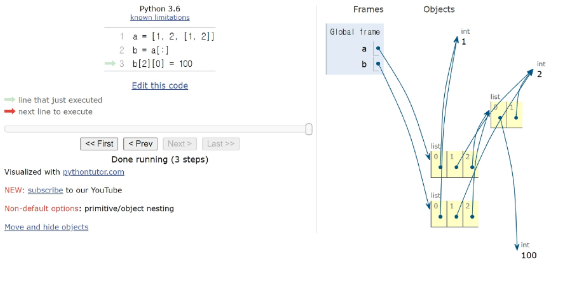
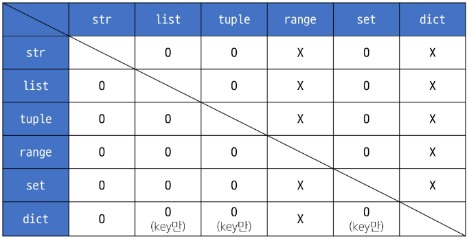
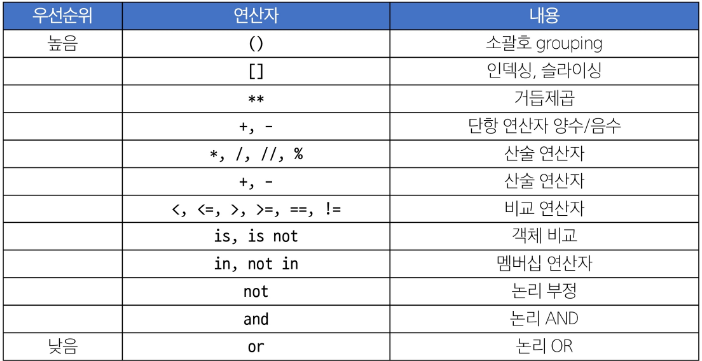

# Python data type
타입들이 사용하는 함수 = 메서드

- 데이터 타입 분류
    - Numeric Type: int(정수), float(실수), complex(복소수)
    - Text Sequence Type: str(문자열)
    - Sequence Types: list, tuple, range
    - Non-sequence Types: set, dict
    - 기타: boolean, none, functions


## 메서드
객체에 속한 함수로, 객체의 상태를 조작하거나 동작을 수행함

-> 파이썬에 있는 모든 것은 객체. 이 객체들은 type으로 분류가 됨. 각각의 type들이 고유하게 가지고 있는 함수들을 '메서드'라고 함

- 특징
    1. 메서드는 클래스(class) 내부에 정의되는 함수
    2. 클래스는 파이썬에서 '타입을 표현하는 방법'
    3. help 함수를 통해 str을 호출해보면 class라는 것을 확인 가능

- `데이터 타입 객체.메서드()` 로 호출


## Numeric Type
- int: 정수 자료형
- float: 실수 자료형
- 지수 표현 방식: e 또는 E 사용 ex. 312e-2 == 3.14
- `print(type(number))` 이용해서 변수 타입 확인 가능


## Sequence Types
여러 개의 값들을 **순서대로 나열**하여 저장하는 자료형

- str, list, tuple, range

- 특징
    1. 순서(sequence): 값들이 순서대로 저장(정렬X)
    2. 인덱싱(indexing)
        - 각 값에 고유한 인덱스(번호)를 가지고 있음
        - 인덱스 사용하여 특정 위치의 값 선택 및 수정 가능
    3. 슬라이싱(slicing): 인덱스 범위 조정해 부분적인 값 추출 가능
    4. 길이(length): len()함수 사용하여 저장된 값의 개수(길이) 구할 수 있음
    5. 반복(iteration): 반복문 사용하여 저장된 값들을 반복 처리 가능


### str
1. 문자들의 순서가 있는 **변경 불가능한** 시퀀스 자료형
    - 마음대로 내부의 값 바꿀 수 없고, 순서를 바꿀 수도 없음
2. 문자열은 단일 문자나 여러 문자의 조합으로 이루어짐
3. 작은 따옴표 또는 큰 따옴표로 감싸서 표현
    - 문자열 시퀀스 특징: 인덱싱, 슬라이싱, 길이

- index
    ```python
    #  h  e  l  l  o
    #  0  1  2  3  4
    # -5 -4 -3 -2 -1
    ```
- slicing
    - 시퀀스의 일부분 선택해 추출하는 작업
    - 시작 인덱스와 끝 인덱스 지정하여 해당 범위 값 포함하는 새로운 시퀀스 생성
    - `[a:b]`는 a부터 b-1까지 추출됨
    - `[:c]`는 0부터 c-1까지 추출됨
    - `[d:]`는 d부터 끝까지 추출됨
    - `[e:f:g]`는 e부터 f-1까지 추출되는데, g간격으로 추출됨
    - `[::-1]`는 순서가 반대로 추출됨

    ※ 문자열은 불변!!
    ```python
        my_str = 'hello'
        # TypeError: 'str' object does not support item assignment
        my_str[1] = 'z' # e를 z로 변경 불가능
    ```

- 문자열 조작 메서드(새 문자열 반환)
    - `s.replace(old, new[,count])` : 바꿀 대상 글자를 새 글자로 바꿔서 반환
        - 원본을 바꾸는 것X, 원본에서 바꾸려는 값을 적용한 새로운 문자열 반환하는 것O
    - `s.strip([chars])` : 공백이나 특정 문자 제거
    - `s.split(sep=None, maxsplit=-1)` : 공백이나 특정 문자를 기준으로 분리
    - `'separator'.join(iterable)` : 구분자로 iterable의 문자열을 연결한 문자열 반환


### f-string
문자열에 **f 또는 F 접두어**를 붙이고 표현식을 `{expression}`로 작성해 문자열에 파이썬 표현식의 값 삽입 가능
```python
bugs = 'roaches'
counts = 13
area = 'living room'
# Debugging roaches 13 living room 출력
print(f'Debugging {bugs} {counts} {area}')
```


### list
여러 개의 값을 순서대로 저장하는 변경 가능한 시퀀스 자료형
- 0개 이상의 객체를 포함하며 데이터 목록을 저장
- 대괄호로 표기
- 데이터는 어떤 자료형도 저장할 수 있음
    - list 내의 list도 가능

    ※ 리스트는 가변!!
    ```python
    my_list = [1, 2, 3]
    my_list[0] = 100
    print(my_list)  # [100, 2, 3]
    ```


#### list 메서드
- 리스트 값 추가 및 삭제 메서드
    - `L.append(x)` : 리스트 마지막에 항목 x 추가
        - 문자열과 달리 새 값 만들어내는 것이 아닌, 원본에 새로운 값 추가
    - `L.extend(m)` : Iterable m의 모든 항목들을 리스트 끝에 추가(+=와 같은 기능)
    - `L.pop(i)` : 리스트 가장 오른쪽 항목을 반환 후 제거

- 리스트 탐색 및 정렬 메서드
    - `L.reverse()` : 리스트 순서를 역순으로 변경(정렬X)
    - `L.sort()` : 리스트 정렬(매개변수 이용 가능)


### tuple
여러 개의 값을 순서대로 저장하는 변경 불가능한 시퀀스 자료형
- 0개 이상의 객체를 포함하며 데이터 목록을 저장
- 소괄호 표기
- 데이터는 어떤 자료형도 저장할 수 있음

※ 튜플은 불변!!

- 튜플 사용 목적
    - 튜플의 불변 특성을 사용한 여러 개의 값 전달, 그룹화, 다중 할당 등
    - **개발자가 직접 사용하기 보다 '파이썬 내부 동작'에서 주로 사용됨**


### range
연속된 정수 시퀀스를 생성하는 변경 불가능한 자료형
- `range(시작값, 끝값, 증가값)`
- `range(n)` : 0부터 n-1까지의 숫자 시퀀스
- `range(n,m)` : n부터 m-1까지의 숫자 시퀀스

- 특징
    - 증가 값이 없으면 1씩 증가
    - 증가 값이 음수라면 감소, 양수라면 증가
    - 증가 값이 0이면 error
    - 주로 반복문과 함께 사용

```python
# 리스트로 형 변환 시 데이터 확인 가능
print(list(range(5)))   # [0, 1, 2, 3, 4]
print(list(range(1, 10)))  # [1, 2, 3, 4, 5, 6, 7, 8, 9]
```


## Non-Sequence Types
### dict
key-value 쌍으로 이루어진 순서와 중복이 없는 변경 가능한 자료형

- key는 변경 불가능한 자료형만 사용 가능(str, int, float, tuple, range..)
    - key값은 중복되면 안됨
    - why? key가 중복되면 key값으로 조회하고자 할 때 어떤 value값을 가져와야할 지 모름
    - 때문에 key값은 변경 불가능한 자료형만 사용 가능
    - 만약 변경 가능하다면 key값 수정 시, 이후에 오류 발생할 수 있음
- value는 모든 자료형 사용 가능
- 중괄호로 표기

#### 딕셔너리 메서드
- `D.get(k)` : 키 k에 연결된 값 반환
    - 키가 없으면 none 반환
- `D.get(k,v)` : 키 k에 연결된 값을 반환하거나 키가 없으면 기본값으로 v 반환
- `D.keys()` : 딕셔너리 D의 키를 모은 객체 반환
- `D.values()` : 딕셔너리 D의 값을 모은 객체 반환
- `D.items()` : 딕셔너리 D의 키/값 쌍을 모은 객체 반환
- `D.pop(k)` : 딕셔너리 D에서 키 k를 제거하고 연결됐던 값을 반환(없으면 오류)
- `D.pop(k,v)` : 딕셔너리 D에서 키 k를 제거하고 연결됐던 값을 반환(없으면 v 반환)

※ `my_dict[key]`와 `my_dict.get(key)`의 차이점

1. 대괄호에 key값 넣는 방식은 내가 찾으려는 key가 딕셔너리 내에 없다면 keyerror 발생
2. get 메서드는 내가 찾으려는 key가 없더라도 none 반환함
3. 그럼 왜 에러가 발생하는 대괄호 접근법을 사용하는가?
4. 예를 들어, 사용자가 특정 값을 입력했을 때 그 key값이 반드시 존재해야하는 경우가 있음
5. 이때 get으로 none을 반환하면, 반환한 값이 none일 때에 대해서 '사용자가 값을 입력하지 않았다는 별도의 처리'를 필요로 함
6. keyerror가 직접적으로 발생하는 대괄호 접근법은 에러에 대한 '예외처리'만 하면 됨


### set
순서와 중복이 없는 변경 가능한 자료형
- 수학에서의 집합과 동일한 연산 처리 가능
- 중괄호 표기
    ```python
    my_set_1 = {1, 2, 3}
    my_set_2 = {3, 6, 9}
    # 합집합
    print(my_set_1 | my_set_2)  # {1, 2, 3, 6, 9}
    # 차집합
    print(my_set_1 - my_set_2)  # {1, 2}
    # 교집합
    print(my_set_1 & my_set_2)  # {3}
    ```
    - dict와 표기 방법이 동일하기 때문에 비어있는 set를 만들고 싶다면 `set()`으로 생성


#### set 메서드
- `s.add(x)` : set s에 항목 x를 추가(이미 x가 있다면 변화 없음)
    - 순서XX append와 달리 어디에 추가되는지 모름!!
- `s.remove(x)` : set s에 항목 x를 제거(항목 x가 없을 경우 Key error)
    - 맨 마지막 요소 제거하는 것이 아니라, 순서가 없기 때문에 내가 지정해서 제거


## Other Types
### None
파이썬에서 '값이 없음'을 표현하는 자료형
- `0`, `[]`, `''`, `{}`, `set()` 은 int, list, str, dict, set이라는 값은 가지고 있는 것임! 요소를 가지지 않은 것 뿐!
- none은 '값이 없다'
- 함수의 return이 없는 경우 None을 반환함


### Boolean
참(True)과 거짓(False)을 표현하는 자료형
- 비교/논리 연산의 평가 결과로 사용됨
- 주로 조건/반복문과 함께 사용


## 복사
### 변경 가능한 데이터 타입의 복사
```python
a = [1, 2, 3, 4]
b = a
b[0] = 100
print(a)  # [100, 2, 3, 4]
print(b)  # [100, 2, 3, 4]
```
- a에 리스트를 할당
- b가 a와 같은 리스트를 참조하도록 복사
- 따라서 b를 바꾸면 a도 바뀜


### 변경 불가능한 데이터 타입의 복사
```python
a = 20
b = a
b = 10
print(a)  # 20
print(b)  # 10
```


### 복사 유형
1. 할당(Assignment)
    - a에 값 할당 후 b에게 a가 참조하는 대상을 동일하게 할당하는 경우
    - 객체 참조를 복사하는 것이므로
    - 객체 요소를 바꾸면 a,b 모두 바뀜
    - **즉, 할당 연산자(=)를 통한 복사는 해당 객체에 대한 '객체 참조를 복사'**
2. 얕은 복사(Shallow)
    - 슬라이싱 사용해서 복사
        ```python
        a = [1, 2, 3]
        b = a[:] # [1, 2, 3]이라는 '새로운 리스트' 생성하는 것과 같음
        ```
    - b 요소를 바꿔도 a에 영향X
    - **즉, 슬라이싱으로 생성된 객체는 '원본 객체와 독립적'으로 존재**
    - 얕은 복사의 한계
        - 2차원 리스트와 같이 '변경 가능한 객체 안에 변경 가능한 객체가 있는 경우'
        - a,b의 주소는 다르지만 내부 객체의 주소는 같기 때문에 함께 변경됨
            ```python
            a = [1, 2, [1, 2]]
            b = a[:] # [1, 2, [1, 2]]
            ```
        - [**1, 2**, [1, 2]] 앞의 1, 2는 얕은 복사
        - [1, 2, **[1, 2]**] 뒤의 [1, 2]는 b가 a 리스트 내부의 '리스트 자체'를 가져오는 것이므로, a와 b가 같은 내부 리스트를 참조하게 됨

        

3. 깊은 복사(Deep copy)
    - 내부에 중첩된 모든 객체까지 새로운 객체 주소를 참조하도록 하자
        ```python
        import copy
        copy.deepcopy(복사하려는list)
        ```


## Type Conversion
### 암시적 형변환
- 파이썬이 자동으로 형변환 하는 것
- boolean과 numeric type에서만 가능


### 명시적 형변환
- 개발자가 직접 형변환 하는 것
- 암시적 형변환이 아닌 경우를 모두 포함
- Collection 간 형변환 정리
    

---

# Operator
## 산술 연산자
- `-` 음수 부호
- `+` 덧셈
- `-` 뺄셈
- `*` 곱셈
- `/` 나눗셈
- `//` 정수 나눗셈(몫)
- `%` 나머지
- `**` 지수(거듭제곱)


## 복합 연산자
- `+=` a += b -> a = a + b
- `-=` a -= b -> a = a - b
- `*=` a *= b -> a = a * b
- `/=` a /= b -> a = a / b
- `/=` a //= b -> a = a // b
- `%=` a %= b -> a = a % b
- `**=` a **= b -> a = a ** b


## 비교 연산자
- `<` 미만
- `<=` 이하
- `>` 초과
- `>=` 이상
- `==` 같음
- `!=` 같지 않음
- `is` 같음
- `is not` 같지 않음 

※ is와 is not은 특별한 상황에서만 사용

### is 비교 연산자
메모리 내에서 같은 객체를 참조하는지 확인
- `==`는 동등성(equality), `is`는 식별성(identity)
- `==`은 값(데이터)을 비교하는 것이지만 `is`는 레퍼런스(주소)를 비교함


## 논리 연산자
- `and` 논리곱: 두 피연산자 모두 True인 경우에만 전체 표현식을 True로 평가
- `or` 논리합: 두 피연산자 중 하나라도 True인 경우에 전체 표현식을 True로 평가
- `not` 논리부정: 단일 피연산자를 부정
```python
print(3 and 5)  # 5
# and의 경우 전체 표현식이 참이면 두번째 연산자 출력
```


### 단축평가
- 논리 연산에서 두 번째 피연산자를 평가하지 않고 결과를 결정하는 동작
- **and** 사용 시 **첫 번째 피연산자로 false**가 발생하면 두 번째 피연산자는 평가XX
- **or** 사용 시 **첫 번째 피연산자로 true**가 발생하면 두 번째 피연산자는 평가XX


## 멤버십 연산자
특정 값이 시퀀스나 다른 컬렉션에 속하는지 여부 확인
- `in` : 왼쪽 피연산자가 오른쪽 피연산자의 시퀀스에 속하는지 확인
- `not in` : 왼쪽 피연산자가 오른쪽 피연산자의 시퀀스에 속하지 않는지를 확인


## 시퀀스형 연산자
+와 *는 시퀀스 간 연산에서 산술 연산자일 때와 다른 역할을 가짐
- `+` : 결합 연산자
    - list + list
- `*` : 반복 연산자
    - list * 3 -> list 세번 반복


## 연산자 우선순위


---


# 제어문
코드의 실행 흐름을 제어하는 데 사용되는 구문으로, 조건에 따라 코드 블록 실행 또는 반복적으로 코드 실행함
- 조건문
    - if, elif, else
- 반복문
    - for, whlie
- 반복문 제어
    - break, continue, pass


## 조건문
파이썬 조건문에 사용되는 키워드 `if` , `elif` , `else`
```python
if 표현식:
    코드 블록
elif 표현식:
    코드 블록
else:
    코드 블록
```
- 표현식: 하나의 값으로 나타낼 수 있는 어떠한 문장 형태
-  위에서부터 아래로 조건을 판별해나감
- if를 만족하면 코드블록 실행 후 제어문 끝남
- if를 만족하지 않으면 elif 표현식 true/false 판별


## 반복문
### for
임의의 시퀀스 항목들을 그 시퀀스에 들어있는 순서대로 반복
- 시퀀스뿐만 아니라 **반복 가능한 객체**는 모두 가능
    - ex. dict, set ..
- 인덱스로 리스트 순회
    ```python
    numbers = [4, 6, 10, -8, 5]
    for i in range(len(numbers)):
        numbers[i] = numbers[i] * 2
    print(numbers)  # [8, 12, 20, -16, 10]
    ```
    - range 사용해서 리스트 요소가 아닌, 인덱스로 접근하여 해당 요소 변경하기

- 중첩 리스트 순회
    ```python
    elements = [['A', 'B'], ['c', 'd']]
    for elem in elements:
        for item in elem:   # 1. ['A', 'B'] 2. ['c', 'd']
            print(item)     # 1-1. A   1-2. B   2-1. c   2-2. d
    ```
    - 반복 가능한 객체로 순회 가능하니 중첩 리스트도 순회 가능


### while
주어진 **조건식이 참(True)인 동안** 코드를 반복해서 실행 == 조건식이 거짓(False)가 될 때까지 반복
```python
while 조건식:
    코드 블록
```


### 적절한 반복문 활용하기
- for
    - 반복 횟수가 명확한 경우
    - ex. 리스트, 튜플, 문자열 등과 같은 시퀀스 형식의 데이터 처리할 때
- while
    - 반복 횟수 불명확 또는 조건에 따라 반복을 종료해야할 때 유용
    - ex. 사용자 입력 받아서 특정 조건이 충족될 때까지 반복하는 경우


### 반복문 제어 키워드
- `break` : 반복 즉시 중지
- `continue` : 다음 반복으로 건너뜀
- `pass` : 아무 동작도 수행하지 않고 넘어감

#### ※ list comprehension
- 간결하고 효율적인 리스트 생성 방법
    ```python
    # list comprehension 사용 전
    num = [1, 2, 3, 4, 5]
    squared_num = []
    for n in num:
        squared_num.append(num**2)

    # list comprehension 사용 후
    [expression for 변수 in interable if 조건식]
    list(expression for 변수 in interable if 조건식) # 비추천(코드 가독성↓)
    ```
- 2차원 배열 생성 시 활용 가능
    ```python
    data1 = [[0] * (10) for _ in range(10)]
    # 또는
    data2 = [[0 for _ in range(10)] for _ in range(10)]
    ```

---

# 함수
### 함수의 구조
어떠한 입력값(input)이 있을 때 내부에서 로직을 실행하고, 실행 결과(output)를 만들어 내는 것

```python
def make_sum(parm1, pram2):
    # 두 수를 받아 합을 반환하는 함수
    # make_sum(1,2)
    # 3
    return pram1 + pram2
```
- `def` 정의하겠다
- `make_sum` 함수이름을
- `parm1, parm2` 그 함수는 값 2개를 받을건데(input)
    - parameter 또는 매개변수 라고 부름
- `return` 로직 실행 후 결과 반환하겠다(output)
    - return이 없다면 파이썬이 알아서 None 반환

- 파이썬 함수 특징
    - 함수가 변수에 할당될 수 있음
    - 함수가 다른 함수의 인자로 전달될 수 있음
    - 함수가 다른 함수에 의해 반환될 수 있음
    - 익명 함수로 사용 가능(람다 표현식)


## 매개변수와 인자
- 매개변수(parameter)
    - 함수를 정의할 때, 함수가 받을 값을 나타내는 변수
- 인자(argument)
    - 함수를 호출할 때, 실제로 전달되는 값
    - 다양한 인자 종류: 1. 위치 인자 2. 기본 인자 값 3. 키워드 인자 4. 임의의 인자 목록 5. 임의의 키워드 인자 목록
```python
def add_numbers(x,y):   # x, y는 매개변수
    result = x + y
    return result
a = 2
b = 3
sum_result = add_numbers(a,b)   #a,b는 인자
print(sum_result)
```

### 위치 인자(Positional Arguments)
함수 호출 시 인자의 위치에 따라 전달되는 인자
- **위치 인자는 함수 호출 시 반드시 값을 전달해야 함**
```python
def greet(name, age):
    print(f'안녕하세요, {name}님! {age}살이시군요.') 
greet('Alice', 40) # 안녕하세요, Alice님! 30살이시군요.
```

### 기본 인자 값(Default Argument Values)
함수 정의에서 매개변수에 기본 값을 할당하는 것
```python
def greet(name, age=30):
    print(f'안녕하세요, {name}님! {age}살이시군요.')
greet('Bob')  # 안녕하세요, Bob님! 30살이시군요.
greet('Charlie', 40)  # 안녕하세요, Charlie님! 40살이시군요.
```
- 함수 호출 시 **인자를 전달하지 않으면, 기본 값이 매개변수에 할당**됨


### 키워드 인자(Keyword Arguments)
함수 호출 시 인자의 이름과 함께 값을 전달하는 인자
- 매개변수와 인자를 일치시키지 않고, 특정 매개변수에 값을 할당할 수 있음
- 인자의 순서는 중요XX, 인자의 이름을 명시하여 전달
- **단, 호출 시 키워드 인자는 위치 인자 뒤에 위치해야 함**
```python
def greet(name, age):
    print(f'안녕하세요, {name}님! {age}살이시군요.')
greet(name='Dave', age=35)  # 안녕하세요, Dave님! 35살이시군요.
greet(age=35, 'Dave') # 이렇게 작성하면 안됨
# age에 35 넣었으면 dave는 알아서 name에 들어갔으면 좋겠지만
# 파이썬에서는 키워드 인자가 위치 인자보다 뒤에 와야하므로
# 즉, 'greet(age=35, "Dave")'처럼 키워드 인자를 먼저 쓰고 그 다음에 위치 인자를 쓰는 것은 문법 오류가 발생함.
# greet('Dave', age=35) ← 이렇게 하면 정상 실행됨
# 매개변수의 양을 늘리면 ex. def greet(name, age, adrees)
```


### 임의의 인자 목록
- **정해지지 않은 개수의 인자**를 처리하고자 할 때 사용
- 함수 정의 시 매개변수 앞에 `*`을 붙여 사용함
- 여러 개의 인자를 받아서 **tuple**로 처리함
    - tuple이 immutable(불변)한  이유
    - `*` 을 사용하여 여러 인자를 넘길 때 내부적으로 튜플로 처리하는데, 사용자가 매개변수로 넘긴 인자 값들은 절대 변경되면 안되기 때문(임의로 값 변경X)
```python
def calculate_sum(*args):
    print(args)   # (1, 2, 3)
    total = sum(args)
    print(f'합계: {total}')
calculate_sum(1, 2, 3)
```


### 임의의 키워드 인자 목록
- **정해지지 않은 개수의 키워드 인자**를 처리하는 인자
- 함수 정의 시 매개변수 앞에 `**`를 붙여 사용
- 여러 인자를 **dictionary**로 묶어 처리
- 튜플처럼 순서대로 넣는게 아니라, key값을 나타내어 정확히 어느 위치(?)에 값 넣을지 알림
    - 명확하게 명시해서 입력하면 key, value 형식으로 들어감
```python
def print_info(**kwargs):
    print(kwargs)
print_info(name='Eve', age=30)  # {'name': 'Eve', 'age': 30}
```

※ 기본적으로는 positional, 매개변수 정의할 때 기본값 넣고싶으면 default, 인자를 넣을 때 특정 위치에 특정 값을 넣고싶으면 keyword인자

**※ 함수 인자 권장 작성 순서**

**-> 가변 키워드 인자가 가변 인자 뒤에 와야함을 주의!!!**


## packing & unpacking
### packing(패킹)
여러 개의 값을 하나의 변수에 묶어서 담는 것
- 변수에 담긴 값들은 튜플(tuple) 형태로 묶임
    ```python
    packed_values = 1, 2, 3, 4, 5 
    print(packed_values)  # (1, 2, 3, 4, 5) 파이썬이 알아서 튜플로 묶음
    ```

- `*`을 활용한 패킹
    ```python
    numbers = [1, 2, 3, 4, 5]
    a, *b, c = numbers # 3개의 변수에 list 나눠 담을 것이다
    print(a)  # 1
    print(b)  # [2, 3, 4]
    print(c)  # 5
    ```
    - *b는 남은 요소들을 리스트로 패킹하여 할당
    - 즉, `*` 패킹 연산자는 여러 개의 인자를 하나의 튜플로 묶는다

### unpacking(언패킹)
패킹된 변수의 값을 개별적인 변수로 분리하여 할당하는 것
- 튜플, 리스트 등의 객체 요소들을 개별 변수에 할당
    ```python
    packed_values = 1, 2, 3, 4, 5
    a, b, c, d, e = packed_values
    print(a, b, c, d, e)    # 1 2 3 4 5
    ```

- `*`을 활용한 언패킹
    ```python
    def my_func(x, y, z): # 3개의 매개변수에
        print(x, y, z)
    names = ['alice', 'jane', 'peter'] # 리스트가 가진 각각의 값을 떼서 넣고싶다면
    my_func(*names) # alice jane peter
    # 리스트를 언패킹해서 인자로 넣자
    ```
    - 즉, `*` 언패킹 연산자는 시퀀스나 반복 가능한 객체를 각각의 요소로 언패킹하여 함수의 인자로 전달한다

- `**`을 활용한 언패킹
    ```python
    def my_func(x, y, z):
        print(x, y, z)
    my_dict = {'x':1, 'y':2, 'z':3}
    my_func(**my_dict) # 1 2 3
    ```
    - 즉, `**` 언패킹 연산자는 딕셔너리의 키-값 쌍을 언패킹하여 함수의 키워드 인자로 전달한다


## 내장함수
파이썬이 기본적으로 제공하는 함수

※ 메서드: '객체'가 가지고 있는 함수(내장함수와 다름!)

- `len` , `max` , `min` , `sum` , `sorted` 등

### map & zip
- `map(function, iterable)`
    - 순회 가능한 데이터구조(iterable)의 모든 요소에 함수를 적용하고, 그 결과를 mab object로 반환
        ```python
        number = [1, 2, 3]
        result = map(str, numbers)
        print(result)   # <map object at 0x0000023..>
        print(list(result)) # ['1', '2', '3']

        numbers1 = inpurt.split()
        numbers2 = list(map(int, input().split()))
        print(numbers1) # ['1', '2', '3']
        print(numbers2) # [1, 2, 3]
        ```

- `zip(*iterables)`
    - 임의의 iterable을 모아 튜플을 원소로 하는 zip object를 반환
        ```python
        girls = ['jane', 'ashley']
        boys = ['peter', 'jay']
        pair = zip(girls, boys)
        print(pair)  # <zip object at 0x000001C76DE58700>
        print(list(pair))  # [('jane', 'peter'), ('ashley', 'jay')]

        # 활용1: 여러 리스트 동시 조회
        kr_scores = [10, 20, 30, 50]
        math_scores = [20, 40, 50, 70]
        en_scores = [40, 20, 30, 50]

        for student_scores in zip(kr_scores, math_scores, en_scores):
            print(student_scores)

        # 활용2: 2차원 리스트와 같은 컬럼 요소를 동시 조회할 때
        scores = [
            [10, 20, 30],
            [40, 50, 39],
            [20, 40, 50],
        ]
        for score in zip(*scores):
            print(score)
        ```

## Lambda expressions 람다 표현식
익명 함수를 만드는 데 사용되는 표현식
- 한 줄로 간단한 함수를 정의
- `lambda 매개변수 : 표현식` 의 구조를 가짐
    - lambda 키워드: 람다 함수 선언을 위해 사용되는 키워드
    - 매개변수: 함수에 전달되는 매개변수들로, 여러 매개변수가 있을 경우 쉼표로 구분
    - 표현식: 함수의 실행되는 코드 블록으로, 결과값을 반환하는 표현식으로 작성

- 예시
    ```python
    def addition(x, y):
        return x + y
    result = addition(3, 5)
    
    # 위 함수를 람다 표현
    addition = lambda x, y: x + y
    result = addition(3, 5)
    print(result)  # 8

    # 람다표현식 & map()
    numbers = [1, 2, 3, 4, 5]
    squares = list(map(lambda x: x * x, numbers))
    print(squares)  # [1, 4, 9, 16, 25]
    ```
