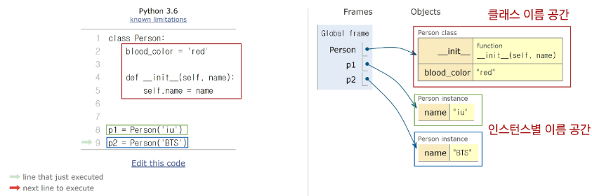

# Classes
## 객체

### 클래스(class)
파이썬에서 타입을 표현하는 방법
- 객체 생성을 위한 설계도
- 데이터와 기능을 함께 묶는 방법 제공
```python
print(type('123')) # <class 'str'>
# 문자열 등 클래스에 속해있는 타입이라 생각할 수 있음
```

### 객체(Object)
클래스에 정의한 것을 토대로 메모리에 할당된 것
- **속성**과 **행동**으로 구성된 모든 것
    - ex. {직업, 생년월일, 국적} == 변수 -> 속성을 가진 class가 있고, 이 클래스에 여러 객체 존재 가능
    - ex. {랩(), 댄스()} == 메서드 -> class에 속한 동일한 행동을 하더라도 output은 달라질 수 있음


### 클래스와 객체
클래스로 만든 객체를 '인스턴스'라고 부름

ex. 가수 = class
1. 아이유는 객체다 (O)
2. 아이유는 인스턴스다 (?)
3. 아이유는 가수의 인스턴스다 (O)

    ※ 어떠한 클래스의 인스턴스임을 명시해야 함(타입 정보 중요 ex. 리스트 클래스, 문자열 클래스 ...)

- 클래스를 만든다 == 타입을 만든다
    - 조건문에 type에 따라 다르게 동작하게 코드 흐름 제어 가능
    - 조건문 없이 반복문 사용해서 코드 실행시키려고 하면
    - 순회 불가능한 타입은 에러 발생
    - 때문에 조건문에서 타입을 통해 에러 방지 하자

```python
name = 'Alice'
print(type(name))   # <class 'str`>
                    # 변수 name은 str 클래스의 인스턴스이다
                    # 문자열 타입(클래스)의 객체(인스턴스)
```

- 객체.행동() == 인스턴스.메서드()
    - 각 객체 타입이 가진 메서드 사용 가능
    - 리스트 타입의 메서드 sort -> [1,2,3].sort()
    - 문자열 타입의 메서드 upper -> "hello".upper()

- 객체 == 특정 타입의 인스턴스
    - 123, 900은 모두 int의 인스턴스
    - 'hello', 'bye'는 모두 string의 인스턴스
    - [2, 1], []은 모두 list의 인스턴스


### 객체 정리
- 타입(type)
    - 어떤 연산자(operator)와 조작(method)이 가능한가?
- 속성(attribute)
    - 어떤 상태(데이터)를 가지는가?
- 조작법(method)
    - 어떤 행위(함수)를 할 수 있는가?
- 즉, 객체들은 모두 어떠한 타입을 가지며, 타입이 가진 속성과 조작법을 함께 가지고 있다
- Object = Attribute + Method


## 클래스
- class 키워드
- 클래스 이름은 파스칼 케이스(Pascal Case) 방식으로 작성
```python
# Pascal Case: 공백을 기준으로 시작하는 첫 단어를 대문자로 적는 것
class MyClass: 
    pass
```


### 클래스 정의
- 속성 정의: 변수에 값 할당하는 것과 동일
- 조작법 정의: 함수 정의하는 것과 동일
```python
# 클래스 정의
class Person:
    blood_color = 'red'
    def __init__(self, name):
        self.name = name
    def singing(self):
        return f'{self.name}가 노래합니다.'

# 인스턴스 생성
singer1 = Person('iu')  
# Person 타입의 인스턴스인 singer1 생성하여 인자를 넣어 함수 호출하듯 사용

# 메서드 호출
print(singer1.singing())  
# 속성(변수) 접근
print(singer1.blood_color)
```


### 클래스 구성 요소
- 생성자 함수
    ```python
    def __init__(self, name):
        self.name = name
    ```
    - **객체 생성 시 자동 호출**하는 특별한 메서드
    - `__init__` 메서드로 정의
    - 객체 초기화를 담당
    - 생성자 함수를 통해 인스턴스를 생성하고 필요한 초기값을 설정함
    - 왜 필요한가? 클래스로 이루어진 각 객체들은 이름은 같지만 서로 다른 속성(안에 든 값이 달라야 함)을 가져야 하므로, 인스턴스 생성 시 해당 인스턴스만이 가져야 할 값이 있다면 그 값의 정보를 올바르게 초기화 시키기 위함
    - self == 생성하려는 인스턴스 자체

- 인스턴스 변수
    ```python
        self.name = name
    ```
    - self가 가지는 변수
    - 인스턴스마다 별도로 유지되는 변수
    - 인스턴스마다 독립적인 값 가지며, 인스턴스 생성될 때마다 초기화됨

- 클래스 변수
    ```python
    blood_color = 'red'
    ```
    - 클래스 내부에 선언된 변수(클래스에 직접 정의)
    - 클래스로 생성된 모든 인스턴스들이 공유하는 변수

- 인스턴스 메서드
    ```python
    def singing(self):
        return f'{self.name}가 노래합니다.'
    ```
    - 각 인스턴스에서 호출할 수 있는 메서드
    - 인스턴스 변수에 접근하고 수정하는 등의 작업을 수행


### 인스턴스 변수와 클래스 변수
```python
class Person:
    count = 0
    def __init__(self, name):
        self.name = name
        Person.count += 1

person1 = Person('iu')
person2 = Person('BTS')
print(Person.count) # 2
```
- Person 클래스의 객체를 통해 만든 인스턴스가 있고, 몇 개의 객체들이 만들어졌는지 관리할 필요가 있을 때 '클래스 변수' 사용
    - 인스턴스가 생성될 때마다 클래스 변수가 늘어나도록 설정할 수 있음
- 서로 다른 값을 필요로 하는 속성은 인스턴스 변수에
- 동일하게 사용하는 속성은 클래스 변수에 넣자

※ 클래스 변수에 본인만의 독특한 값을 할당하고 싶다면?
```python
Class Circle:
    pi = 3.14
    def __init__(self, r):
        self.r = r
c1 = Circle(5)
c1.pi = 1.14 # 인스턴스로 클래스 변수를 바꾸려고 했지만
             # 클래스 변수가 바뀌는 것이 아니라
             # c1 객체만의 새로운 인스턴스 변수 pi가 생김(본인 만의 값)
Circle.pi = 5   # 클래스 직접 써서 할당하면 클래스 변수 바꾸기 가능
```


## 메서드
1. 인스턴스 메서드
2. 클래스 메서드
3. 정적 메서드


### 인스턴스 메서드
클래스로부터 생성된 각 인스턴스에서 호출할 수 있는 메서드
```python
class MyClass:
    def instance_method(self, arg1, ...):
        pass
```
- 인스턴스 상태 조작, 동작 수행
- **반드시 첫 번째 매개변수로 인스턴스 자신(self)을 전달받음**(호출 시 self은 생략 가능)
- self 동작 원리
    - `'hello'.upper()` -> upper 메서드로 대문자 변경하기
    - `str.upper('hello')` -> 실제 파이썬 내부 동작은 이렇게 진행됨
    - str 클래스가 upper 메서드 호출, 그 첫번째 인자로 문자열 인스턴스가 들어간 것
    - 인스턴스 메서드의 첫번째 매개변수가 반드시 인스턴스 자기 자신인 이유
    - 'hello'라는 문자열 객체가 단순한 함수 인자가 아닌, 객체 스스로 메서드를 호출하여 코드를 동작하는 객체 지향적인 표현인 것


#### 생성자 메서드
인스턴스 객체가 생성될 때 자동으로 호출되는 메서드
```python
class Person:
    def __init__(self, name):
        self.name = name
        print('인스턴스가 생성되었습니다.')
    def greeting(self):    # 생성자 메서드
        print(f'안녕하세요. {self.name}입니다.')
person1 = Person('지민')  # 인스턴스가 생성되었습니다.
person1.greeting()  # 안녕하세요. 지민입니다.
```
- 인스턴스 변수들의 초기값을 설정


### 클래스 메서드
클래스가 호출하는 메서드
```python
class MyClass:
    
    @ classmethod
    def class_method(cls, arg1, ...):
        pass
```
- 클래스 변수를 조작하거나 클래스 레벨의 동작을 수행
- @classmethod 데코레이터를 사용하여 정의(나머지는 인스턴스 메서드 만드는 것과 동일)
- 호출 시, **첫번째 인자로 해당 메서드를 호출하는 클래스(cls)가 전달**됨

```python
class Person:
    count = 0
    def __init__(self, name):
        self.name = name
        Person.count += 1
    @classmethod
    def number_of_population(cls):
        print(f'인구수는 {cls.count}입니다.')

person1 = Person('iu')
person2 = Person('BTS')
Person.number_of_population() # 인구수는 2입니다.
```
- 이전에 클래스 변수를 직접 바꿨던 방법 보다는 '클래스 메서드'를 정의해서 이를 호출하여 값을 바꿔주는게 더 명시적임
    - 클래스 변수가 변하면 해당 클래스에 속한 객체가 무수히 많을 수 있으므로 클래스 변수를 참조하는 모든 객체들에게 영향이 감(뭐때매 값이 바꼈는지 추척 힘듦)
    - 클래스 변수를 바꿀 수 있는 클래스 메서드가 정의되어 있다면 '클래스 메소드의 이름'을 찾아봄으로써 코드의 어디에서 변수의 값이 바뀌었는지 추적 가능
    - 즉, 내가 참조하는 데이터가 어떻게 어디서 변경되었는지 추적 가능하다

※ 파이썬은 제약사항이 따로 존재하지 않기 때문에 클래스가 호출하지 않고 인스턴스가 호출할 수는 있음

-> 인스턴스는 '해당 클래스의 인스턴스'이므로 본인이 속한 클래스 정보가 존재하여 어떤 클래스인지 정보 전달 가능(그치만 안쓸거얌)


### 정적 메서드
클래스와 인스턴스와 상관없이 독립적으로 동작하는 메서드
```python
class MyClass:

    @staticmethod
    def static_method(arg1, ...):
        pass
```
- 주로 클래스와 관련 있지만 인스턴스와 상호작용이 필요하지 않은 경우에 사용
- 즉, 클래스가 가진 속성&메서드, 인스턴스가 가진 변수&메서드에 접근할 필요는 없지만 (특정 객체만의 속성에 접근할 필요는 없지만) 클래스 자체의 전체 모둠들이 공통적으로 동작할 때 필요한 것을 만들 때 '정적 메서드' 사용
- @staticmethod 데코레이터 사용하여 정의
- 호출 시 필수적으로 작성해야 할 매개변수가 없음

- 예시
    ```python
    class StringUtils:
        @staticmethod
        def reverse_string(string):
            return string[::-1]
        @staticmethod
        def capitalize_string(string):
            return string.capitalize()

    text = 'hello, world'
    reversed_text = StringUtils.reverse_string(text)
    print(reversed_text)  # dlrow ,olleh
    capitalized_text = StringUtils.capitalize_string(text)
    print(capitalized_text)  # Hello, world
    ```
    - 문자열 data type은 이미 존재
    - 문자열 데이터 타입을 잘 조작하기 위한 클래스 생성
    - 오로지 문자열을 복잡한 로직으로 조작하기 위해 만든 유틸성 클래스라면 인스턴스에 직접적으로 접근할 인스턴스 메서드 필요 없음
    - 이미 인스턴스 접근 방법은 문자열 클래스에 정의되어 있음(속성도 문자열 클래스에 있을 것임)
    - 문자열들을 가지고 어떤 로직을 진행할 때 로직을 여러번 사용해야 하는 유틸성으로서 만들 때에는 정적 메소드를 사용할 수 있다~


### 인스턴스와 클래스 간의 이름 공간
1. 클래스를 정의하면, 클래스와 해당하는 이름 공간 생성
2. 인스턴스를 만들면, 인스턴스 객체가 생성되고 **독립적인** 이름 공간 생성
3. 인스턴스에서 특성 속성에 접근하면, 인스턴스 -> 클래스 순으로 탐색하게 됨
    - LEGB랑 다른거임!!
    - 메서드 내부에서는 LEGB 룰을 따라가겠지만 그것과는 별개

    
    - 클래스 변수의 속성에 접근하는 상황
    - 각각의 인스턴스 공간에 각각의 이름 속성에 값을 넣었을 때
    - `Person('iu').blood_color` 라고 하면 인스턴스 공간 내부에서 blood_color를 먼저 찾아봄
    - 찾아보고 없으면 자기가 속해있는 class로 가서 찾아보고 가져옴
    - `Person('iu').blood_color = blue` 라고 작성하면 클래스의 blood_color='red'에 영향을 미치는 것이 아닌, 내 공간(iu 인스턴스 공간)에 변수 만들어져서 blue가 들어감

---
---
---
# 정리))

## 상속

동일한 속성, 메서드를 가진 뭐를 뭐하려고 클래스를 만든다

Person이라는 클래스 만들었을 때, 인간을 person 클래스에 다 넣기엔 '직업'이 다르면 행동이 다를 수 있음

- 상속 없이 구현하는 경우
    - ex. 학생/교수 정보를 별도로 표현하기 어려움
    - ex. 학생/교수 클래스로 분리했지만 메서드가 중복으로 정의될 수 있음

- 상속 받으면 동일한 메서드를 한번만 구현해도 됨
    ```python
    class Person:
        def __init__(self, name, age):
            self.name = name
            self.age = age
        def talk(self):  # 메서드 재사용
            print(f'반갑습니다. {self.name}입니다.')
    class Professor(Person):
        def __init__(self, name, age, department):
            self.name = name
            self.age = age
            self.department = department
    class Student(Person):
        def __init__(self, name, age, gpa):
            self.name = name
            self.age = age
            self.gpa = gpa

    p1 = Professor('박교수', 49, '컴퓨터공학과')
    s1 = Student('김학생', 20, 3.5)
    # 부모 Person 클래스의 talk 메서드를 활용
    p1.talk()  # 반갑습니다. 박교수입니다.
    # 부모 Person 클래스의 talk 메서드를 활용
    s1.talk()  # 반갑습니다. 김학생입니다.
    ```
    

- 만약 부모-자식간 동일한 메서드가 존재한다면?
    ```python
    class Person:
        def __init__(self, name, age):
            self.name = name
            self.age = age
        def talk(self):  # 메서드 재사용
            print(f'반갑습니다. {self.name}입니다.')
    class Professor(Person):
        def __init__(self, name, age, department):
            self.name = name
            self.age = age
            self.department = department
        def talk(self):  # 메서드 재사용
            print(f'반갑습니다. {self.name}교수 입니다.')
    class Student(Person):
        def __init__(self, name, age, gpa):
            self.name = name
            self.age = age
            self.gpa = gpa

    p1 = Professor('박교수', 49, '컴퓨터공학과')
    s1 = Student('김학생', 20, 3.5)
    ```
    - p1이 호출되면 본인 클래스(Professor)의 talk 메서드가 호출됨
    - 즉, 본인에 맞게????????????????커스텀 가능/??
    - s1이 호출되면 부모의 talk


### 다중 상속
둘 이상의 상위 클래스로부터 여러 행동이나 특징을 상속받을 수 있는 것
- 상속받은 모든 클래스의 요소를 활용할 수 있음
- **중복 속성이나 메서드가 있는 경우 '상속 순서에 의해 결정'됨**


- 다중 상속은 덮어쓰기 방식XX
    ```python
    a = 10
    a = 20
    print(a)    #20
    ```
    - 이런 방식이 아니다

- 다이아몬드 문제


    - 파이썬에서의 해결책
    - 웅앵


    ```python
    O = object

    class D(O): pass
    class E(O): pass
    class F(O): pass
    class B(D, E): pass
    class C(F, D): pass
    class A(B, C): pass

    # A클래스 상속 담색 순서 출력
    print(A.__mro__)

    # <class '__main__.A'>
    # <class '__main__.B'>
    # <class '__main__.C'>
    # <class '__main__.D'>
    # <class '__main__.E'>
    # <class '__main__.F'>
    # <class 'object'>
    ```

O는 O
D, E, F는 O를 상속받고 있음
B는 D -> E -> O 상속받음
C는 F -> D -> O 상속받음
A는 B -> C -..

- `super()`
    - 부모 클래스(상위 클래스)의 메서드 호출을 위해 사용하는 내장 함수
    - 다중 상속 시 MRO(메서드 결정 순서)를 기반으로 현재 클래스가 상속하는 모든 부모 클래스 중 다음에 호출될 메서드를 결정하여 자동으로 호출
    - 주로 생성자 메서드에서 사용
    ```python
    # super 사용 전
    class Person:
        def __init__(self, name, age, number, email):
            self.name = name
            self.age = age
            self.number = number
            self.email = email

    class Student(Person):
        def __init__(self, name, age, number, email, student_id):
            self.name = name        # 중
            self.age = age          # 복
            self.number = number    # 중
            self.email = email      # 복
            self.student_id = student_id    

    # super 사용 후
    class Person:
        def __init__(self, name, age, number, email):
            self.name = name
            self.age = age
            self.number = number
            self.email = email

    class Student(Person):
        def __init__(self, name, age, number, email, student_id):
            # Person의 init 메서드 호출
            super().__init__(name, age, number, email)
            self.student_id = student_id
    ```

#### MRO가 필요한 이유
- 부모


#### super의 사용 사례 2가지


## 클래스 참고
### 메서드 주의사항


### 매직 메서드


### 데코레이터(Decorator)
다른 함수의 코드를 유지한 채로 수정되거나 확장하기 위해 사용되는 함수

- 데코레이터 정의
    ```python
    def my_decorator(func):
    def wrapper():
        # 함수 실행 전에 수행할 작업
        print('함수 실행 전')
        # 원본 함수 호출
        result = func()
        # 함수 실행 후에 수행할 작업
        print('함수 실행 후')
        return result
    return wrapper
    ```
    - 함수 내에 함수 정의
    - 함수를 인자로 받는 함수 정의
    - 움

- 데코레이터 사용
    ```python
    @my_decorator
    def my_function():
        print('원본 함수 실행')
    my_function()
    """
    함수 실행 전
    원본 함수 실행
    함수 실행 후
    """
    ```

## 참고
### 제너레이터
- Iterator(이터레이터)
    - 반복 가능한 객체의 요소를 하나씩 반환하는 객체

- python 내부적으로 반복이 동작하는 원리


#### Generator(제너레이터)
이터레이터를 간단하게 만드는 함수

- 제너레이터 사용 이유
    1. 메모리 효율성
        - 한번에 

    2. 무한 시퀀스 처리

함수는 return이 있었는 데 얜 함수처럼 ㅎ작성하지만 yield문 사용해서 값을 반환
다음 요소 찾으면 불러옴

- 제너레이터 활용
    1. 대용량 데이터 처리
        - 파일에서 한 줄씩 읽어와 처리
        - 메모리에 전체 파일 로드하지 않고, 한 줄씩 처리하여 메모리 사용 절약
    
    2. 


### 예외처리
- `try` 
- `except`
- `else`
- `finally`
```python


```

- `raise`

### 모듈(Module)
한 파일로 묶인 변수와 함수의 모음
- 특정 기능을 하는 코드가 작성된 파이썬 파일(.py)
- 모듈 가져오는 방법
    - import 문 사용


    - from절 사용

- 모듈 사용하기
    - `. (dot)` 연산자
    - 점의 왼쪽 객체에서 점의 오른족 이름을 찾으라는 의미


### 정규 표현식
문자열에서 특정 패턴을 찾기 위해 사용되는 기법

- 복잡한 문자열 속 특정한 규칙으로 된 문자열을 검색, 치환, 추출 등을 간결하게 수행할 수 있음

- 정규 표현식 문자열 앞에 'r'을 붙여야 함
    - 문자열을 "raw string"으로 취급하여 역슬래시(`\`)를 이스케이프 문자로 처리하지 않도록 하기 위함

- 특수 문자
사진

- 특수 시퀀스
사진

- 메서드