x# HTML & CSS
## Web
### World Wide Web
인터넷으로 연결된 컴퓨터들이 정보를 공유하는 거대한 정보 공간(www.~~)

### Web
Web site, Web application 등을 통해 사용자들이 정보를 검색하고 상호 작용하는 기술

### Web site
인터넷에서 여러 개의 Web page가 모인 것으로, 사용자들에게 정보나 서비스를 제공하는 공간

### Web page
HTML, CSS 등의 웹 기술을 이용해 만들어진, "Web site"를 구성하는 하나의 요소

- Web page 구성 요소
    - `HTML` : Structure 
    - `CSS` : Styling
    - `Javascript` : Behaviot
    - 즉, Web page는 1. 기초 틀과 2. 기초 틀을 어떻게 스타일링 할 것인지와 3. 사용자와 상호작용 가능하도록 만들어진 특정 동작들로 이루어진다

#### ※ 각 구성 요소에서 중점적으로 봐야하는 것
- HTLM: 기본적인 문서 구조화 과정 & 구조화가 왜 중요한지
- CSS: 어떤 요소를 어떻게 강조할 것인지
- javascript: 사용자와의 상호작용하는 방법 
ex. 클라이언트가 '어떻게' 요청을 보내는지, 요청 과정에서 데이터는 어떻게 전송이 되어야 하는지, 보안적으로 신경써야 할 부분이 있는지


## 웹 구조화
### HTML(HyperText Markup Language)
웹 페이지의 **의미**와 **구조**를 정의하는 언어

- Hypertext
    - 웹 페이지를 다른 페이지로 연결하는 링크
    - 참조(link)를 통해 사용자가 한 문서에서 다른 문서로 즉시 접근할 수 있는 텍스트
    - 텍스트를 클릭하는 것 만으로 해당 정보로 옮겨갈 수 있게 만드는 것이 요점!
    - 특징: 비선형성, 상호연결성, 사용자 주도적 탐색

- Markup Language
    - 태그 등을 이용하여 문서나 데이터 구조를 명시하는 언어
    - ex. HTML, Markdown 
    - 마크업 언어 또는 마크다운으로 작성한다 해서 무조건 가독성 좋게 보이는거 아님! 스타일링을 통해 결과값이 보기 좋게 보이도록 정의된 것
    - 마크업 언어로 보면 `<태그>내용</태그>` 이런식으로 보인다
    - 마크업 언어로 '태그'만 잘 작성해서 만들어진 html 파일을 다양한 브라우저에서 사용함으로써 스타일링 된 형태를 볼 수 있음

- HTML 구조
    ```html
    <!DOCTYPE html>
    <html lang="en">

    <head>
        <meta charset="UTF-8">
        <title>My page</title>
    </head>

    <body>
        <p>This is my page</p>
        <a href="https://www.google.co.kr/">Google로 이동</a>
        
       
    </body>
    </html>
    ```

    - `<!DOCTYPE html>` : 해당 문서가 Html임을 나타냄
    - `<html></html>` : 전체 페이지의 콘텐츠 포함(html의 시작과 끝 지점 알려줌)
        - `<html lang="en">` html 시작부분에 추가적으로 언어 설정
        - 웹 브라우저 상에서 영어를 한글로 번역하려고 할 때, 페이지 내의 내용이 영어로 작성됨을 인지하고 en to kr 형식으로 번역하라고 할 수 있음
    - `<title></title>` : 브라우저 탭 및 즐겨찾기 시 표시되는 제목으로 사용
    - `<head>` : HTML 문서에 관한 설명, 설정 등 컴퓨터가 식별하는 메타데이터 작성
        - 문서에서 필요로 하는 추가적인 정보들(사용자에게 보이지 않음)
        - ex. 카톡으로 링크 보낼 때 링크가 작성된 텍스트 아래에 카드가 생성됨. 카드에는 어떤 사이트인지 설명이 작성되어 있음 -> 메신저 서비스에서 제공하는 것이 아닌, 메타 태그를 통해 설정한 것
        - `<meta ..>`: 자기 자신을 설명하기 위한 메타 데이터를 설정
    
    - `<body> </body>` : HTML 문서의 '내용'을 나타냄
        - 페이지에 표시되는 모든 콘텐츠 작성
        - 한 문서에 하나의 body 요소만 존재

- HTML 요소

    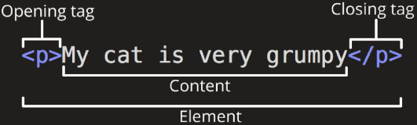
    - 하나의 요소는 **여는 태그**와 **닫는 태그**, 그리고 그 안의 **내용**으로 구성됨
    - 닫는 태그는 여는 태그와 이름 동일한데, 태그 이름 앞에 슬래시 포함
        - 닫는 태그가 없는 태그도 존재(내용 구성을 어떻게 하냐에 따라 다름)
        - 기본적인 '내용'은 타이핑한 문자열인데, 문자열이 아닌 경우 닫는 태그가 필요 없음 ex. 이미지
        - 이미지를 보여주고 싶다면 이미지 파일이 어디에 있는지 보여줘야 함 -> 경로를 '속성'에 작성함으로써 이미지를 보낼 수 있음

- HTML 속성

    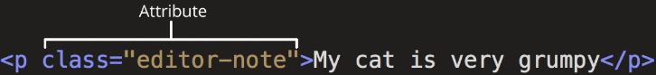
    - 사용자가 원하는 기준에 맞도록 요소 설정하거나 다양한 방식으로 요소의 동작을 조절하기 위한 값
    - 나타내고 싶진 않지만 추가적인 기능, 내용을 담고 싶을 때 사용함
    - CSS에서 스타일 적용을 위해 해당 요소를 선택하기 위한 값으로 활용됨
    - 이미지 주소도 속성으로 보낼 수 있다
    - 기본적인 속성 예시: class
    - HTML에서의 클래스는 '동일한 속성과 동작을 가지고 있어야할 요소들을 하나로 묶는 용도'라고 생각

- HTML 속성 작성 규칙
    1. 속성은 요소 이름과 속성 사이에 공백 있어야 함
    2. 하나 이상의 속성이 있는 경우(ex.클래스 여러개 부여하고 싶다면)엔 속성 사이에 공백으로 구분함
    3. 속성 값은 열고 닫는 따옴표로 감싸야 함
    4. 대소문자 구분 못하므로 항상 소문자로 작성

※ HTML의 태그를 작성하시오. 특정한 요소를 작성하시오. 라고 했을 때 대소문자 구분 잘 해야함

※ HTML에서 일반적으로 하이픈(-) 사용 -> **Kebab-case** 

※ 확장자가 html인 파일 생성 후 `! + tap` 누르면 vscode에서 HTML 기본 구조 작성해줌

※ 확장툴 `Auto Rename Tag`
- 태그 수정할 때 여는 태그 수정하면 닫는 태그는 알아서 수정됨

※ 확장툴 `Highlight Matching Tag`
- 태그를 선택하면 그 태그가 언제 끝나는지 매칭 태그가 하이라이트 됨
- 문서 구조가 매우 복잡해 졌을 때 본문 작성 시 내가 수정하려는 영역이 어디부터 어디까지인지 알 수 있음

※ 확장툴 `open in browser`
- **alt + b** 단축키로 해당 페이지를 바로 열어줄 수 있는 확장 툴

- HTML 구조 예시
    ```html
    <!DOCTYPE html>
    <html lang="en">

    <head>
    <meta charset="UTF-8">
    <title>My page</title>
    </head>

    <body>
    <p>This is my page</p>
    <a href="https://www.google.co.kr/">Google로 이동</a>
    
    
    </body>

    </html>
    ```
    - F12로 개발자 도구 열어보자
    - Elements, Console 주로 사용 예정
    - Elements -> 내 문서가 어떻게 구성되어 있는지, 태그가 차지하는 영역, 이미지 태그에 어떤 속성이 부여됐는지 스타일도 보여줌
    - 디버깅 시 개발자 도구로 테스트 가능


### HTML Text structure
HTML의 주요 목적 중 하나는 **텍스트 구조와 의미**를 제공하는 것

- HTML: 웹 페이지의 '의미'와 구조를 정의하는 언어
    - ex. `<h1>Heading</h1>` -> h1요소는 단순히 텍스트를 크게만 만드는 것이 아닌, 현재 문서의 최상위 제목이라는 의미 부여한 것
    - h1 태그쓰면 글자 커지는 이유는 스타일링이 되어있기 때문 -> 크롬 브라우저가 만든 스타일

- 대표적인 HTML Text structure
    - Heading & Paragraphs : `h1~6` , `p`
    - Lists : `ol(순서있는 목록)` , `ul(순서없는 목록)` , `li(list item)`
    - Emphasis & importace : `em`, `strong` 

- HTML Text structure 예시
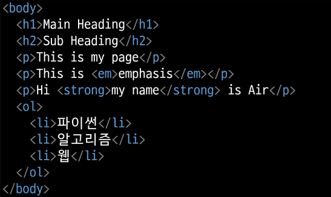


## 웹 스타일링
### CSS(Cascading Style Sheet)
웹 페이지의 **디자인**과 **레이아웃**을 구성하는 언어

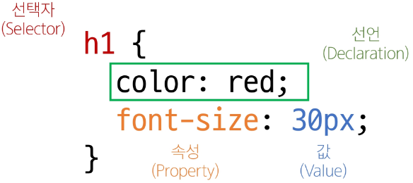
- 어디에 적용시킬지! h1 (**선택자**)을 신경쓰자

- CSS 적용방법
1. 인라인(Inline) 스타일
    - HTML 요소 안에 style 속성 값으로 작성
    ```html
    <body>
        <h1 style="color: blue; backgroud-color: yellow;">Hello World!</h1>
    </body>
    ```
    - 특별한 일 아닌이상 쓰지마
    - 왜? 다음시간에 알려줌

2. 내부(Internal) 스타일 시트
    - **head 태그 안에 style 태그 만들어서 작성**
    ```html
    <head>
        ...
        <title>
        <style>
            h1 {
                color: blue;
                background-color: yello;
            }
        </style>
    </head>
    ``` 
    - 우리가 주로 쓸거

3. 외부(External)
    - 별도 CSS 파일 생성 후 HTML link 태그를 사용해 불러오는 방법(import하듯이)
    ```html
    <head>
        ...
        <link rel="stylesheet" href="style.css">
    <title></title>
    </head>
    ```
    ```css
    /* style.css */
    h1 {
        color: blue;
        background-color: yello;
    }
    ``` 


### CSS Selectors
HTML 요소를 선택하여 스타일을 적용할 수 있도록 하는 선택자

-  CSS Selectors 종류
1. 기본 선택자
    - 전체(*) 선택자
    - 요소(tag) 선택자
    - 클래스(class) 선택자
    - 아이디(id) 선택자
        - id 속성 부여 방법은 class와 동일
        - `<p class="">` 대신에 `<p id="">`
    - 속성(attr) 선택자
        - 속성 자체를 선택
        - ex. 링크 부여하는 `<a href="www.naver.com">`가 있을 때, 네이버 외에도 다른 링크와 연결된 텍스트가 있다면 연결된 링크가 무엇이냐에 따라 선택해서 적용시킬 수 있음
2. 결합자(Combinators)
    - 자손 결합자(" " (space))
    - 자식 결합자(">")
        ```html
        <parent>
            <child>
            </child>
        </parent>
        ```
        - parent > child 이렇게 표현함

- CSS Selectors 특징
    - 전체 선택자 `*` : HTML 모든 요소를 선택
    - 요소 선택자: 지정한 모든 태그를 선택
    - 클래스 선택자 `.` (dot): 주어진 클래스 속성을 가진 모든 요소를 선택
    - 아이디 선택자 `#` : 주어진 아이디 속성을 가진 요소 선택(문서에는 주어진 아이디를 가진 요소가 하나만 있어야 함)
    - 자손 결합자 `" "` (space) : 첫 번쨰 요소의 자손 요소들 선택
    - 자식 결합자 `>` : 첫 번째 요소의 직계 자식만 선택


#### 실습 04-css-selectors.html
- 04-css-selectors.html을 실행(atr+b) 해보면 내가 설정한 스타일이 부분적으로 적용된 것을 볼 수 있음

- 개발자 도구에서 해당 태그에 설정된 스타일 확인 가능
    - 전체 결합자로 작성한 컬러 설정에 취소선이 보인다
    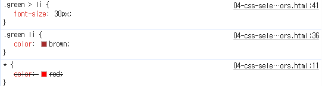
    - green 클래스의 자식 li의 폰트 사이즈가 30이라는 내용이 04-css-sele..ors.html의 37번째 줄에 적혀있다는 의미
    - 모든 요소에 색을 빨강으로 설정했는데 취소선이 설정되어 있다
    - 또 다른 li를 확인해보자
    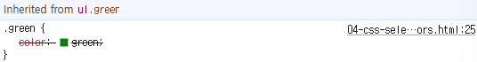
    - ul 요소에 '클래스 green인 요소로부터 상속받은 속성 green'이 적용되어 있지 않다(취소선)

- 따라서 우선순위가 정해져있는 것 같아 보인다

- ol태그 안의 li태그를 보면 ul 태그(엄밀히 말하면 green클래스)의 자식 li 태그에 스타일 지정하게 했었는데, 왜 직접적으로 폰트 사이즈가 바뀐것이 아니라 상속받은 li인걸까? Inherited from li 
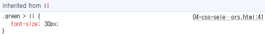
    - 자식 결합자의 범위를 생각해보자
    - 현재 사진의 태그는 ul.green > li > ol > li로 이루어진 구성에서 가장 하위의 li를 눌렀을 때 나옴
    - green클래스의 직계자식 li는 폰트 변경을 직접적으로 당해서 Inherited from li 없이 '.green > li {..}'가 수행되어서 폰트가 바뀜
    - 가장 하위에 있는 li는 .green의 직계자식이 아니므로 '.green > li {..}'로 인해서 폰트가 바뀐 것이 아니라, 직계자식 li가 코드로 인해 폰트가 바뀌어서 li의 하위에 있는 ol과 가장 하위 li가 '상위 li의 스타일을 상속받아' 폰트가 바뀐 것

- 자식 결합자는 '직계 자식'을 의미하므로 자식 결합자로 작성한 코드가 직접적으로 반영되는건 직계 자식 뿐!


### Specificity(명시도)
결과적으로 요소에 적용할 CSS 선언을 결정하기 위한 알고리즘

- CSS Seletor에 가중치를 계산하여 어떤 스타일을 적용할지 결정
- 동일한 요소를 가리키는 2개 이상의 CSS 규칙이 있는 경우, 가장 높은 명시도를 가진 Selector가 승리하여 스타일이 적용됨
- CSS(**Cascading** Style Sheet)
    - Casecade: 계단식
    - 한 요소에 동일한 가중치를 가진 선택자가 적용될 때 CSS에서 마지막에 나오는 선언이 사용됨

    ```html
    h1 {
        color: red;
    }
    h1 {
        color: purple;
    }
    ```
    - 동일한 명시도를 가진 선택자를 가졌으므로 purple이 적용됨
    ```html
    .make-red {
        color: red;
    }
    h1 {
        color: purple;
    }
    ```
    - 명시도 순서가 높은 선택자를 따라가므로 red가 적용됨


- 명시도가 높은 순
1. importance
    - `!important` : 다른 우선순위 규칙보다 우선하여 적용하는 키워드
    - Cascade의 구조를 무시하고 강제로 스타일 적용하는 방식이므로 사용을 권장하지XX
    - 디버깅 시 사용(개발자 도구로 !important 넣었을 때 반영이 됐으면 우선순위 제대로 못보고 넣었구나 하면 됨. 반영이 안되면 상속받은 넘인가? 보면됨)
2. Inline 스타일
3. 선택자
    - id 선택자 > class 선택자 > 요소 선택자
4. 소스 코드 선언 순서

※ 상속받아온 속성은 부모가 가진 속성이므로 명시도가 가장 낮다

**※ 명시도 뭐가 우선적인지 암기**

※ vscode에서는 코드 작성해서 선택자에 마우스 올려보면 명시도가 나타남

1. 클래스 선택자는 명시도가 (0,1,0)
2. id는 명시도가 (1,0,0)
3. 요소 선택자는 명시도가 (0,0,1)
4. 자손결합자는 명시도가 (0,1,1)
5. 자식도 명시도가 (0,1,1)

※ 클래스1과 클래스2를 모두 가진 요소에 색을 넣고싶어서
.green.box {color:red}로 클래스 중첩해서 설정하면 명시도가 020이 됨


### CSS 상속
CSS는 상속을 통해 부모 요소의 속성을 자식에게 상속해 재사용성을 높임

- 상속 되는 속성
    - Text 관련 요소: font, color, text-align(정렬)
    - opacity(투명도)
    - visibility
- 상속되지 않는 속성
    - Box model 관련 요소: width, height, border, box-sizing 등
    - position 관련 요소: position, top/right, bottom/left, z-index 등

※ MDN의 각 속성별 문서 하단에서 상속 여부 확인 가능

### CSS Box Model
웹 페이지의 모든 HTML 요소를 감싸는 사각형 상자 모델

- 원은 네모 박스를 깎은 것

    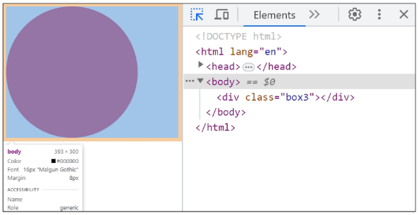

- 박스로 구성된 웹 페이지 레이아웃

    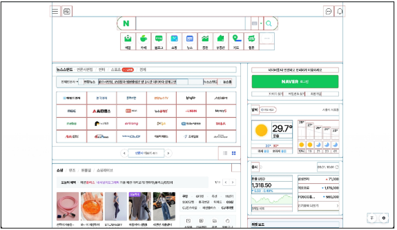

- 박스 타입
1. Block box
2. Inline Box

    ※ 박스 타입에 따라 페이지에서의 배치 흐름 및 다른 박스와 관련하여 박스가 동작하는 방식 달라짐

- 박스 표시(Display) 타입
1. Outer display type
    - 박스가 문서 흐름에서 어떻게 동작할지 결정
    - block
        ```css
        .index {
            display: block;
        }
        ```
        - 항상 새로운 행으로 나뉨
        - width와 height 속성 사용 가능
        - padding, margin, border로 인해 다른 요소를 상자로부터 밀어냄
        - width 속성을 지정하지 않으면 박스는 inline 방향으로 사용 가능한 공간을 모두 차지함(상위 컨테이너 대비 100%로 채움)
        - block 타입 태그 : `h1~6` , `p` , `div`

    - inline
        ```css
        .index {
            display: inline;
        }
        ```
        - 새로운 행으로 넘어가지 않음
        - width와 height 속성을 사용할 수 없음
            - height -> display가 block인 부모 요소의 높이를 따라감
            - width -> 작성한 내용의 너비를 따라감(너비는 조정 가능 = padding)
        - 수직 방향: padding, margin, border가 적용되지만 다른 요소를 밀어낼 수 없음
        - 수평 방향: padding, margin, border가 적용되어 다른 요소를 밀어낼 수 있음
        - inline 타입 태그 : `a` , `img` , `strong` , `em`

    ※ Normal flow: 일반적인 흐름 또는 레이아웃을 변경하지 않은 경우 웹 페이지 요소가 배치되는 방식
        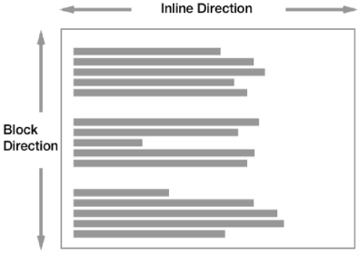

    - 사용예시
        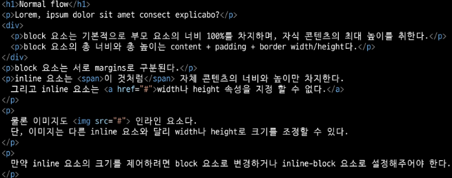

2. inner display type
    - 박스 내부의 요소들이 어떻게 배치될지 결정
    - flexbox
        ```css
        .container {
            display: flex;
        }
        ```
    - CSS layout - Flexbox 파트에서 설명 봐주세요

※ padding, margin, borde이 뭐냐?

-> 개발자 도구로 스타일 파트 보면 그림 보임 = 요소가 차지하는 공간 설정!


## 참고
### 명시도 관련 문서
- [그림으로 보는 명시도](https://specifishity.com/)

- 명시도 갱장히 중요

### HTML 스타일 가이드
1. 대소문자 구분
    - HTML은 대소문자 구분하지 않지만, 소문자 사용을 강력히 권장
    - 태그명과 속성명 모두 소문자로 작성
2. 속성 따옴표
    - 속성 값에는 큰 따옴표 `""` 를 사용하는 것이 일반적
3. 코드 구조와 포맷팅
    - 일관된 들여쓰기 사용(보통 2칸씩 공백)
    - 각 요소는 한 줄에 하나씩 작성
    - 중첩된 요소는 한 단계 더 들여쓰기(==일관된 들여쓰기)
4. 공백 처리
    - HTML은 연속된 공백을 하나로 처리
    - Enter키로 줄바꿈 해도 브라우저에서 인식하지 않음(줄바꿈 태그 이용)
5. 에러 출력 없음
    - HTML은 문법 오류가 있어도 별도의 에러 메시지 출력XX

### CSS 스타일 가이드
1. 코드 구조와 포맷팅
    - 일관된 들여쓰기
    - 선택자와 속성은 각각 새 줄에 작성
    - 중괄호 앞에 공백 넣기
    - 속성 뒤에는 콜론(:)과 공백 넣기
    - **마지막 속성 뒤에는 세미콜론(;) 넣기**
2. 선택자 사용
    - class 선택자를 우선적으로 사용
    - id, 요소 선택자 등은 가능한 피할 것
        - 여러 선택자들과 함께 사용할 경우 우선순위 규칙에 따라 예기치 못한 스타일 규칙 적용으로 전반적인 유지보수가 어려워짐
        - id 선택자 남발하면 id 속성 자체의 의미가 퇴색될 수 잇음. 요소 하나 지정해야할 때, 대주제로서, 카테고리로 사용할 때 id 써라
3. 속성과 값
    - 속성과 값은 소문자로 작성
    - 0 값에는 단위를 붙이지 않음
4. 명명규칙
    - 클래스 이름은 의미 있고 목적 나타내도록 사용
    - kebab-case 사용
    - 약어보다 전체 단어 사용
5. CSS 적용 스타일
    - 인라인 스타일은 되도록 사용하지 말것
        - CSS와 HTML 구조 정보가 혼합되어 작성되므로 코드 이해 어려움

#### ※ CSS 속성은 외우는 것 아님!!
-> 자주 사용하는 속성 위주로 자연스럽게 익히도록

### MDN Web Docs
Mozilla Debeloper Network에서 제공하는 온라인 문서로, 웹 개발자와 디자이너를 위한 종합적인 참고 자료

- HTML, CSS, JavaScript, 웹API, 개발도구 등 웹 기술에 대한 정보 제공

- 검색하고 싶은 부분 입력하고 뒤에 mdn만 붙이면 됨 ex. 자식 결합자 mdn
