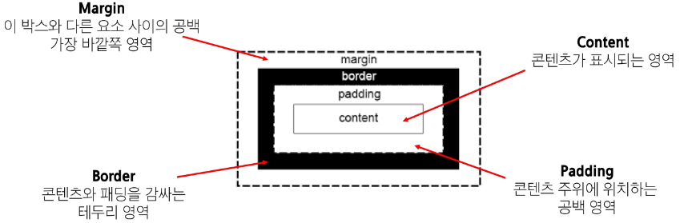
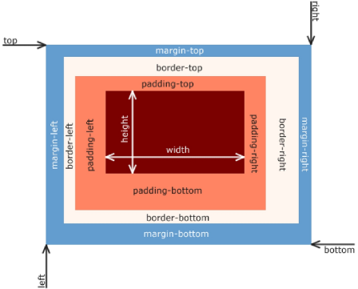
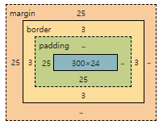
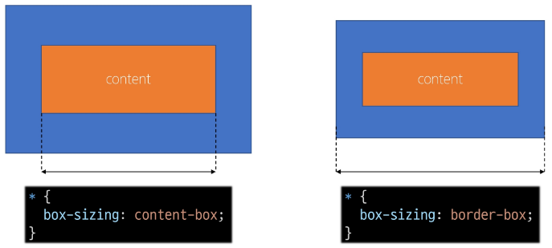
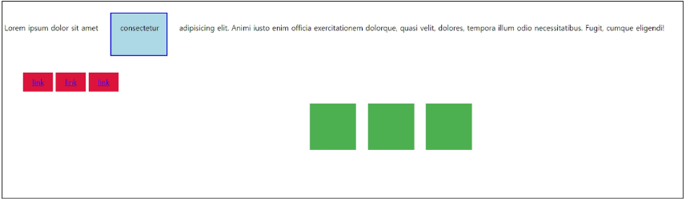
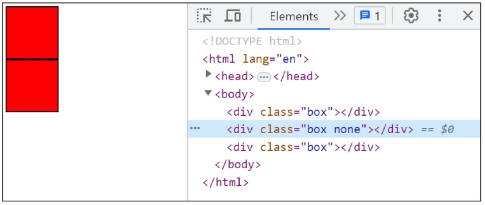
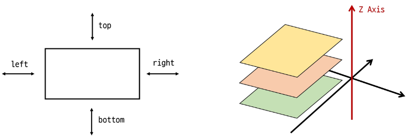
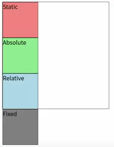
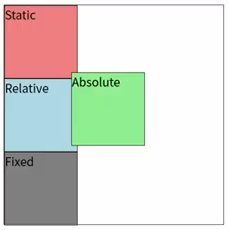
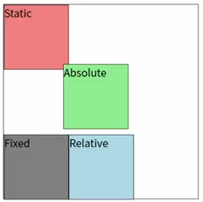

# CSS Layout
## CSS Box Model
웹 페이지의 모든 HTML 요소를 감싸는 사각형 상자 모델
※ 01_web.md 파일의 Box Model 참고

- 내용(contect), 안쪽 여백(padding), 테두리(border), 외부 간격(margin)으로 구성되어 요소의 크기와 배치를 결정

    

    - Content box
        - 실제 콘텐츠가 표시되는 영역 크기
        - width 및 height 속성을 사용해 크기 조정
    - Padding box
        - 콘텐츠 주위의 공백
        - padding 관련 속성을 사용하여 크기 조정
    - Border box
        - 콘텐츠와 패딩을 래핑
        - border 관련 속성을 사용하여 크기 조정
    - Margin box
        - 콘텐츠, 패딩 및 테두리를 래핑
        - 박스와 다른 요소 사이의 공백
        - margin 관련 속성 사용하여 크기 조정
    
- Box 구성의 방향 별 속성 값
    

- box 구성 요소 예시
    ```html
    <style>
        .box1 {
            border-width: 3px;
            border-style: solid;
            border-color: black;
            /* width를 작성 안하면 너비가 전체 너비를 가짐 */
            width: 300px;
            padding-left: 25px;
            padding-bottom: 25px;
            margin-top: 25px;
            margin-left: 25px;
        }
    ```

    

    - `border-width: 3px;` , `border-style: solid;` , `border-color: black;`로 테두리 너비, 색, 스타일 설정
    - `width: 300px`로 설정하면 **content box 너비**가 300px로 설정됨
    - `padding-left: 25px;` , `padding-bottom: 25px;`로 설정하면 border(테두리) 안쪽에 25px 여백 생김
    - `margin-top: 25px;`, `margin-left: 25px;`로 설정하면 border기준 바깥쪽에 25px 여백 생김
    - 02-part-of-box.html 파일 코드로 실행 결과 확인 가능

- box 구성 요소 예시2
    ```html
    <style>
        .box2 {
            width: 300px;
            border: 1px dashed black;
            margin: 25px auto;
            padding: 25px 50px
        }
    ```
    - `border: 1px dashed black;`와 같이 box1처럼 한줄씩 설정하는게 아니라 한줄에 3개 다 설정 가능 == Shorthand 속성
    - `margin: 25px auto;` -> 상하 25px, 좌우 auto로 설정되어 있어 창 크기 늘리면 자동으로 중앙 정렬되도록 맞춰서 좌우 margin크기가 조절됨 


### Shorthand 속성
- shorthand 속성 - 'border'
    - `border-width`, `border-style`, `border-color`를 한번에 설정하기 위한 속성
        ```html
        <style>
            <!-- 작성 순서는 영향X-->
            .box {
                border: 2px solid black;
            }
        ```

- shorthand 속성 - 'margin' & 'padding'
    - 4방향 속성을 각각 지정하지 않고 한번에 지정할 수 있는 속성
        ```html
        <style>
            .box {
                <!-- 4개: 상우하좌 -->
                margin: 10px 20px 30px 40px;
                padding: 10px 20px 30px 40px;

                <!-- 3개: 상/좌우/하 -->
                margin: 10px 20px 30px;
                padding: 10px 20px 30px;

                <!-- 2개: 상하/좌우 -->
                margin: 10px 20px;
                padding: 10px 20px;  
                
                <!-- 1개: 공통 -->  '
                margin: 10px;
                padding: 10px; 
            }
        ```
    - shorthand 방법이랑 한 설정에 한 줄씩 쓰는 방법이랑 둘 다 알아야 함
    - 4개: 시계방향
    - 3개로 구분 시 상/하를 쪼개는 이유
        - 한 요소와 다른 요소를 배치하려고 할 때 주로 위, 아래 여백을 신경써야함. 또, 어떤 요소는 본문, 어떤 요소는 제목인 것처럼 위 아래 단락의 기준이 다를 수 있기 때문!
        - 보통 좌,우는 다르게 설정하는 것보다 동일하게 설정하는 경우가 많기 때문에 함께 묶임


### box-sizing 속성

- The standard CSS box model

    

    - 위 출력 결과의 코드를 보면 width: 300px로 설정되어 있는데, 이것은 content의 너비를 뜻하는 것
    - **표준 상자 모델에서 width, height 속성 값 설정하면 content box의 크기를 조정하게 됨**
    - 그렇다 보니 추가로 붙는 padding, border로 인해 실제 박스가 차지하는 영역이 내가 설정한 300px보다 커짐(margin은 반영X)
    - 사진의 전체 박스 크기는 300(content) + 25(padding) + 6(border) = 331px
    - 그래서 300px이라고 생각하고 box1 옆에 box2를 뒀을 때, 생각한 것과 다르게 배치될 수 있음
    - 고로 대체 상자 모델로 속성 설정하자

- The alternative CSS box model
    ```html
    <style>
    * {
        box-sizing: border-box
    } 
    ```    
    - 대체 상자 모델에서 모든 width, height는 실제 상자 너비와 실제 박스 크기를 정하기 위해 테두리와 패딩을 조정할 필요가 없음

    

    - box-sizing은 기본 값이 content-box
    - 요구사항에 없더라도 box-sizing은 `border-box`로 설정해놓고 하자


### 기타 display 속성
-  `inline-block`
    - inline과 block 요소 사이의 중간 지점을 제공하는 display 값
    - width 및 height 속성 사용 가능
    - padding, margin, border로 인해 다른 요소가 상자에서 밀려남
    - 새로운 행으로 넘어가지 않음
    - 요소가 줄바꿈 되는 것을 원하지 않으면서 너비와 높이를 적용하고 싶은 경우에 사용
    - 예시: 04-inline-block.html

        

- `none`
    - 요소를 화면에 표시하지 않고, 공간조차 부여되지 않음
    - 사용자에게 보이지 않을 뿐, 랜더링은 된 것
    - 요소가 필요해서 랜더링은 해야하지만 사용자에게 보일 필요가 없을 때 사용

    


## CSS position
※ CSS Layout: 각 요소의 위치와 크기를 조정하여 웹 페이지의 디자인을 결정하는 것
- display, position, flexbox
- 지금까지의 내용이 크기 조정하는 display 부분
- 이제 위치를 조정하는 position 방식을 알아보자


### CSS Position
요소를 normal flow에서 제거하여 다른 위치로 배치하는 것 ex. 다른 요소 위에 올리기, 화면의 특정 위치에 고정시키기 등

- 일단 기본적인 normal flow를 제거
    - 기본 normal flow는 왼쪽 위에서부터 오른쪽 아래로 내려올 수밖에 없음

- Position 이동 방향

    
    - 상(top), 하(bottom), 좌(left), 우(right) + **Z축(Axis)** 
    - 3차원으로 포지셔닝(z축까지 존재)

- Position 유형
1. static(정적)
    - 요소를 Normal Flow에 따라 배치
    - top, right, bottom, left 속성이 적용되지 않음
    - 기본 값!!

        

2. absolute(절대)
    - 요소를 Normal Flow에서 제거
    - 가장 가까운 relative 부모 요소를 기준으로 이동
        - 만족하는 부모 요소가 없다면 body 태그를 기준으로 함
    - top, right, bottom, left 속성으로 위치 조정
    - 문서에 요소가 차지하는 공간이 없어짐
    
        
        - 절대 위치로 설정하기 때문에 (지금은)파일의 왼쪽 상단 끝을 기준으로 100px 100px 이동된 것
        - 평소에 사용할 땐 position이 relative인 부모 요소가 있다면 그 요소를 기준으로 이동하니 이 부분 생각해서 활용
        - absolute인 요소가 이동하면 이전에 차지하던 공간을 사라지므로 아래에 있던 relative 박스가 normal flow를 따라 위로 올라옴

3. relative(상대)
    - 요소를 Normal Flow에 따라 배치
    - 자신의 원래 위치(static)을 기준으로 이동
    - top, right, bottom, left 속성으로 위치 조정
    - 다른 요소의 레이아웃에 영향을 주지 않음(요소가 차지하는 공간은 static일 때와 같음)
        - 즉, 요소 위치를 바꿔도 이전 위치의 공간이 없어지지 않음!! 

        
        - 문서의 끄트머리가 아닌, 자신이 있던 위치의 왼쪽 상단 끄트머리에서부터 100px 100px 이동된 것
        - relative인 요소가 이동하면 이전에 차지하던 공간이 유지되어 아래에 있는 fixed 박스가 위로 올라오지 못함
        
4. fixed(고정)
    - 요소를 Normal Flow에서 제거
    - 현재 화면영역(viewport)을 기준으로 이동
    - 스크롤해도 항상 같은 위치에 유지됨
    - top, right, bottom, left 속성으로 위치 조정
    - 문서에서 요소가 차지하는 공간이 없어짐

5. stick(스띡끼)
    - relative와 fixed의 특성을 결합한 속성
    - 스크롤 위치가 임계점에 도달하기 전에는 relative처럼 동작
    - 스크롤이 특정 임계점에 도달하면 fixed처럼 동작하여 화면에 고정됨(ex. normalflow에 있다가 스크롤 내려서 요소 위치가 sticky: top 0이 되면 상단에 고정)
    - 만약 다음 sticky 요소가 나오면 다음 sticky 요소가 이전 sticky 요소의 자리를 대체
        - 이전 스띡끼 요소가 고정되어 있던 위치와 다음 스띡끼 요소가 고정되어야 할 위치가 겹치기 때문
    ```html
    <body>
    <h1>Sticky positioning</h1>
    <div>
        <div class="sticky">첫 번째 Sticky</div>
        <div>
        <p>내용1</p>
        <p>내용2</p>
        <p>내용3</p>
        </div>
        <div class="sticky">두 번째 Sticky</div>
        <div>
        <p>내용4</p>
        <p>내용5</p>
        <p>내용6</p>
        </div>
        <div class="sticky">세 번째 Sticky</div>
        <div>
        <p>내용7</p>
        <p>내용8</p>
        <p>내용9</p>
        </div>
    </div>
    </body>
    ```    
    - stick는 div 하나에 여러 div 자식들로 이루어진 형태(즉, 여러 stick를 하나의 div가 부모로써 묶고있음)
        - 부모 영역은 벗어날 수 없기 때문에 top 0에서 고정되어 있다가 부모영역 끝나면 사라짐

---
---
---


- z-index
    - 요소의 쌓임 순서(stack order)를 정의하는 속성
    - 정수 값을 사용해 Z축 순서를 지정
    - 값이 클수록 요소가 위에 쌓이게 됨
    - static이 아닌 요소에만 적용됨
    - 기본 값은 auto
    - 부모 요소의 z-index 값에 영향을 받음
    - 같은 부모 내에서만 z-index 값을 비교
    - 부모의 z-index가 낮으면 자식의 z-index가 아무리 높아도 부모보다 위로 올라갈 수 없음
    - z-index 값이 같으면 HTML 문서 순서대로 쌓임


※ Position의 목적: 전체 페이지에 대한 레이아웃 구성 보다는 **페이지 특정 항목의 위치를 조정**하는 것


## CSS Flexbox
- inner display type
    ```css
    .container {
        display: flex;
    }
    ```
    - 박스 내부 요소들이 어떻게 배치될지를 결정
    - 속성: flex

### CSS Flexbox
요소를 행과 열 형태로 배치하는 **1차원** 레이아웃 방식
- '공간 배열' & '정렬'

사지ㅜㄴ

- Flexbox 구성요소
1. main axis(주 축)


2. cross axis(교차 축)


3. flex Container


4. flex item


- Flexbox 속성 목록


## 참고
### Margin collapsing (마진 상쇄)
두 block 타입 요소의 martin top과 bottom이 만나 더 큰 margin으로 결합되는 현상

사진

- margin을 쓰는 이유?는 복잡한 레이아웃에서 요소 간 간격을 일관되게 유지하기 위함
- 요소 간의 간격을 더 예측 가능하고 관리하기 쉽게 만듦
- 일관성, 단순화


### 박스 타입 별 수평 정렬
- block 요소의 수평 정렬
    - margin: auto 사용
        - 블록 요소의 너비를 지정하고, 좌우 마진을 auto로 설정
    - text-align 사용
        - 부모 요소에 사용

- inline-block 요소의 수평 정렬
     - text-align 사용
        - 부모 요소에 사용   


