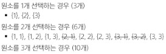
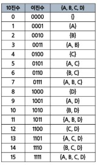
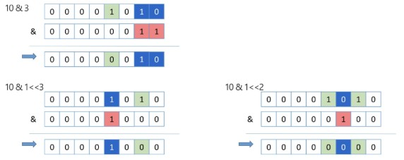

# 알고리즘
## 알고리즘
유한한 단계를 통해 문제를 해결하기 위한 절차나 방법으로, 주로 컴퓨터 용어에 쓰임

- 컴퓨터가 어떤 일을 수행하기 위한 단계적 방법
- 즉, 어떠한 문제를 해결하기 위한 절차

### 알고리즘 표현 방법
1. 의사 코드
2. 순서도
3. 프로그래밍 언어

    

### 알고리즘 성능
- 정확성(★★★): 얼마나 정확하게 동작하는가
- 효율성(★): 얼마나 최적화 되었는가
- 확장성(★): 입력 크기에 상관없이 항상 성능이 일정한가
- 단순성(★★): 얼마나 단순한가

※ 주어진 문제를 해결하기 위해 여러 알고리즘이 가능한데, 이 알고리즘들의 성능 분석이 필요함

- 알고리즘 성능 분석 예시
    
    - 100번 코드 돌아가는 것보다 3번 코드 돌아가는게 당연히 좋다


## 복잡도
### 시간 복잡도
연산의 작업량, 수행 시간이 어느정도 되는지 계산

- 최선의 경우(Best Case)
    - 빅 오메가 표현법 사용 `Ω(n)`
    - 알고리즘이 가장 빠르게 실행될 때의 성능

- 평균적인 경우(Average Case)
    - 빅 세타 표기법 사용 `Θ(n)`
    - 일반적인 알고리즘의 성능

- 최악의 경우(Worst Case)
    - 빅 오 표기법 사용 `O(n)` 
    - 알고리즘이 가장 느리게 실행될 때의 성능
    - 우리는 최악의 경우를 기준으로 복잡도를 얘기할 것임
    - 알고리즘을 통해 문제 해결을 필요로 하고 있는데, n번의 경우의 수에 대한 해결 방법이 있을 것이고 n개의 복잡도가 생긴다면 최악의 경우를 기준으로 생각하는 것이 당연

### 공간 복잡도
메모리 사용량
- 변수에 값 할당했을 때 그 값이 메모리에 저장되어 있을 것임. 이 때의 메모리 양
- 런타임 환경에서 코드가 실행되는 동안 재귀 함수를 실행하기 위해 필요되고 있는 메모리 등도 포함된 메모리 사용량


### 복잡도의 점근적 표기
시간 (또는 공간) 복잡도는 입력 크기에 대한 함수로 표기하는데, 이 함수는 주로 여러 개의 항을 가지는 다항식임

- 이를 단순한 함수로 표현하기 위해 '점근적 표기'를 사용
- 입력크기 n이 무한대로 커질 때의 복잡도를 간단히 표현하기 위해 사용하는 표기법

- 빅-오(O) 표기법
    - 시간 복잡도 함수 중 **가장 큰 영향력을 주는 n에 대한 항만을 표시**
    - 계수(Coefficient)는 생략하여 표시
    - 상수는 모두 O(1)과 동일 취급

        
    
    - n개의 데이터를 입력받아 저장한 후 각 데이터에 1씩 증가시킨 후 각 데이터를 화면에 출력하는 알고리즘의 시간 복잡도 = `O(n)`
        - 데이터 입력(1번), 저장(n번), 데이터 1씩 증가(n번), 화면출력(n번) = `O(3n+1) = O(n)`
        - 왜 이렇게 표기해도 되는 것일까?

    - 다양한 시간 복잡도 비교

        
        - 점근적으로 표기를 했을 때 이 표기법들에 의해 나오는 결과값들이 **유의미할 정도로 차이가 남**
        - 그래서 계수 떼고 가장 큰 차수만 표기하는 빅-오 표기법으로 표기해도 충분히 시간 복잡도 구분 가능

    - 시간 복잡도별 실제 실행 시간 비교

        
        - n = 1억 -> 즉, 1억번 연산할 때 0.1초 걸림
        - n이 1000, 10000인데 시간 제한이 4초다? 쫄지말고 그냥 풀 것
    

## 재귀 호출
### 재귀 함수
- 반복(Iteration)과 재귀(Recursion)
    - 반복과 재귀는 유사한 작업 수행함
    - 반복은 수행하는 작업이 완료될 때까지 반복
    - 재귀는 주어진 문제의 해를 구하기 위해 **동일하면서 더 작은 문제의 해를 이용**하는 방법으로, 재귀 함수로 구현함

        

- 재귀 함수(recursive function)
    - 함수 내부에서 직접 혹은 간접적으로 **자기 자신을 호출하는 함수**
    - 일반적으로 재귀적 정의를 이용해서 재귀 함수를 구현함
    - 기본 부분(basis part)과 유도 부분(inductive part)으로 구성됨
        - `basis part` : 종료조건
        - `inductive part` : 다음 식을 유도하는 부분
    - 재귀적 프로그램을 작성하는 것은 반복 구조에 비해 간결하고 이해가 쉬움
    - 함수 호출은 프로그램 메모리 구조에서 **스택**을 사용함
    - 즉, 재귀 호출은 반복적인 스택 사용을 의미하며 메모리 및 속도에서 성능 저하가 발생함

※ 재귀 함수는 언제 써야할까?

-> 점화식을 만족할 때! (어떤 수열의 각각의 항들의 관계를 나타낸 식)

-> 즉, 큰 문제를 더 작은 문제로 나눠서 풀 수 있을 때

-> 예를 들어, F(n) = F(n-1) + F(n-2) 라는 점화식을 충족하는 피보나치 수열은 재귀함수로 풀 수 있다

- 팩토리얼 반복문
    ```python
    # 팩토리얼: 3! = 3 * 2 * 1
    
    N = 5   # 구하고자 하는 값 N
    answer = 1    # 최종 결과값 (1로 초기화)
    
    # 1부터 N까지 answer에 곱해 나갈 수 있도록 순회
    for num in range(1, N+1):
        answer *= num
    print(answer)
    ```

- 팩토리얼 재귀 함수
    - 재귀적 정의
        ```
        Basis Rule
            N <= 1 경우, N = 1
        
        Inductive Rule
            N > 1, N! = N * (N - 1)!
        ```
    - 재귀 함수
        ```python
        def fact(n):
            # n이 주어졌을 때, n ~ 1 사이의 정수들을 모두 곱해야 함
            # 곱셈 연산이므로 0이 되기 전에 종료되어야 함
            # 1이 되었을 때 1을 반환해야 함
            # f(5) = 5*4*3*2*1
            # f(4) = 4*3*2*1
            # ...
            # f(n) = n * f(n-1)

            if n <= 1:      # Basis Rule
                return 1
            else:
                return n * fact(n-1)    # Inductive Rule
            
            # 표현식 -> 하나의 값으로 평가할 수 있어야 함
            # return: 하나의 값을 반환하는 것
            # return으로 값 반환 하려면 n*fact(n-1)이라는 표현식을 평가해야 함
            # 저 식을 평가하려면 fact(n-1)을 호출한 값이 무엇인지 알아야 함
            # 함수가 호출되어 값으로 환산할 수 있을 때까지(return 1 받을 때까지) 반복해서 코드 실행되는 것이 '재귀함수'

        ```
    - 팩토리얼 함수에서 n=4인 경우의 실행

        

- 피보나치 수열 반복문
    ```python
    def fibonacci(n):
        # 기본 룰 동일하게 적용
        # n이 0이면 0 반환
        # n이 1이면 1 반환
        if n == 0:
            return 0
        elif n == 1:
            return 1
        else:   # n이 2 이상인 경우
                # 내 이전의 두 항의 값이 무엇인지 알 수 있어야 함
                # else문에 올 수 있는 가장 적은 수 2를 기준으로 생각해보자
            first, second = 0, 1    # f(i-1), f(i-2)의 역할을 해줄 것
                # 2부터 n까지도 위 규칙과 동일한 규칙이 실행되어야 함
                # 피보나치 규칙 상 2~n까지 순회해서 얻어내는 숫자(인덱스?)는 필요없음
                # 그래서 임시변수 _로 처리
            for _ in range(2, n+1):
                next_fib = first + second
                first = second   # 기존의 first는 쓸모 없어지고, 기존의 second가 first가 되어야 함
                second = next_fib   # 또한, 다음 피보나치 수가 second가 됨
                # 파이썬은 first, second = second, next_fib 한 줄로 작성 가능
            return second
            # 더 이상 다음 연산을 할 작업이 없다면 반환
            # next_fib == second
    ```
    - 반복문을 사용하면 이전에 사용했던 값들을 다음에 사용하기 위해 어떻게 사용해야 할지 생각해봐야 함

- 피보나치 수열 재귀 호출
    - 이전의 두 수 합을 다음 항으로 하는 수열을 피보나치라고 함
    - `0, 1, 1, 2, 3, 5, 8, 13, ...`
    - 수식
        ```
        F0 = 0, F1 = 1
        Fi = F(i+1) + F(i+2) for i >= 2
        ```
    - 재귀 함수
        ```python
        def fibonacci(n):
            if n == 0:      # Basis Rule: n이 0일 때, 0 반환
                return 0
            elif n == 1:    # Basis Rule: n이 1일 때, 1 반환
                return 1
            else:           # Inductive Rule: n이 2 이상일 때, F(n-1) + F(n-2) 반환
                return fibonacci(n-1) + fibonacci(n-2)
        ```
        - 이 경우에 이미 연산했던 함수들이 여러번 반복해서 호출되면서 쓸데없는 메모리 사용량만 늘어나게 됨
    
    - 이미 연산한 값은 저장하는 방식
        ```python
        def fibonacci_memoization(n):
            # n이 2 이상이고, memo[n]번째가 아직 계산되지 않았으면 계산
            if n >= 2 and memo[n] == 0:
                memo[n] = fibonacci_memoization(n-1) + fibonacci_memoization(n-2)
            return memo[n]
            # 이전에 계산한 적이 있다면 그대로 가져다 쓰는 방식
        
        # 피보나치 수 10까지의 결과를 기록하기 위해
        # 0부터 10까지 총 11개 담을 수 있는 리스트 생성
        n = 10
        memo = [0] * (n+1)
        
        # 피보나치 기본 룰 초기화
        memo[0], memo[1] = 0, 1

        print(fibonacci_memoizaion(n))
        ```

- 하노이의 탑 문제
    - 하노이 탑 게임은 세 개의 기둥과 서로 다른 크기의 N개 원판으로 구성
    - 원판을 세 번째 기둥에 모두 옮겨 놓아야 함
    - 원판을 옮길 때는 반드시 한 번에 한 개씩 옮길 수 있고 두 번째 기둥을 이용할 수 있다
    - 옮기는 과정에서 절대로 큰 원판이 작은 원판 위에 놓이지 말아야 함

        
    - 제일 우선적인 목표: 가장 큰 원판을 목적 기둥(가장 오른쪽 기둥)에 두는 것이 가장 우선적
    - 위 목표를 수행하려면 가장 큰 원판 바로 위의 원판을 치워야 함
    - 가장 큰 원판을 기준으로 생각해보자
        - 원판 1개: 목적기둥에 옮기는 것 1번 수행 -> `H(1) = 1`
        - 원판 2개: 가장 큰 원판은 목적 기둥으로 1번 옮겨갔고, 그 위의 작은 원판은 2번 옮김 -> `H(2) = 1 + 2`
        - 원판 3개: 가장 큰 원판 1번, 중간 원판 2번, 가장 작은 원판 3번 -> `H(3) = 1 + 6 = 1 + H(2)*2`
        - 즉, `H(n) = 2H(n-1) + 1` 수식 찾아낼 수 있음
    
- 하노이의 탑 코드
    ```python
    def hanoi(n, source, auxiliary, target):
        """
        n개의 원반을 source 기둥에서 target 기둥으로 옮깁니다.

        Args:
            n (int): 이동할 원반의 개수
            source (str): 시작 기둥 (예: 'A')
            auxiliary (str): 보조 기둥 (예: 'B')
            target (str): 목표 기둥 (예: 'C')
        """
        # 일단, 옮겨야 할 원판의 수가 1개보단 많아야 일을 함
        if n > 0:
            # 1단계: 가장 큰 원반을 옮기기 위한 준비
            # n-1개의 원반들을 모두 옮겨야 한다 -> 보조 기둥으로
            # n-1번째 원반 입장에서는 보조 기둥으로 가야하므로 타겟 기둥이 B가 됨
            # 즉, n-1 호출 시 타겟과 보조 기둥을 바꿔서 호출
            hanoi(n-1, source, target, auxiliary)
            # n-2번째 원판의 입장에서 봤을 때 n-1번째가 B에 가있기 때문에
            # n-2번째는 C로 이동해야 하고, 타겟과 보조기둥을 다시 바꿔서 호출하게 될 것

            # 2단계: 목표였던 가장 큰 원반을 옮긴다
            print(f'원반 {n}을 {source}에서 {target}으로 이동하였음')

            # 3단계: 마무리 작업
            # 가장 큰 원반을 옮기는 데 성공했으니
            # 우리는 이제 보조 기둥(각각의 원반 기준으로 보조기둥)에서
            # 다시 target 기둥으로 옮겨야 한다.
            hanoi(n-1, auxiliary, source, target)
    # --- 실행 예시 ---
    # 3개의 원반을 'A' 기둥에서 'C' 기둥으로 옮기기 ('B' 기둥을 보조로 사용)
    number_of_disks = 3
    hanoi(number_of_disks, 'A', 'B', 'C')
    ```    


# 완전 탐색
### Baby-gin Game


- 접근 방법1
    - 입력 받은 숫자 정렬 후, 앞뒤 3자리씩 끊어서 run 및 triplet 확인하는 방법을 고려할 수 있다
    - ex. {6, 4, 4, 5, 4, 4} -> {4, 4, 4, 4, 5, 6}으로서 쉽게 baby-gin 확인할 수 있음
    - 그러나 {1, 2, 3, 1, 2, 3} -> {1, 1, 2, 2, 3, 3}으로서 오히려 baby-gin 확인에 실패할 수 있음

- 접근 방법2
    - 고려할 수 있는 모든 경우의 수 생성하기
    - 6개의 숫자로 만들 수 있는 모든 숫자의 나열(순열)
    - ex. 입력으로 {2, 3, 5, 7, 7, 7}을 받았을 경우
        ```
        2 3 5 7 7 7
        2 3 7 5 7 7
        2 3 7 7 5 7     
        ...             <모든 경우의 순열 나열>
        7 7 7 5 3 2
        ```
    - 모든 경우의 수 생성하다가 원하는 조건에 부합하면 return하는 방식으로 진행 가능


### 완전 검색
문제의 해법으로 생각할 수 있는 **모든 경우의 수를 나열해보고 확인**하는 기법
- Brute-force 혹은 generate-and-test 기법이라고도 불림
- 대부분 문제에 적용 가능
- 상대적으로 빠른 시간에 문제 해결(알고리즘 설계)을 할 수 있음
- 일반적으로 경우의 수가 작다면 유용
- 모든 경우의 수를 생성하고 테스트하기 때문에 수행 속도는 느리지만, 해답을 찾아내지 못할 확률이 낮음
- 전형적으로 순열(permutation), 조합(combination), 부분집합(subset)과 같은 조합적 문제들과 연관됨
- 검정 등에서 주어진 문제를 풀 때, **우선 '완전 검색으로 접근'하여 해답 도출 후 성능 개선을 위해 다른 알고리즘을 사용하고 해답 확인하는 것이 바람직**


## 순열
- 여행 계획 문제
    
    
    - 출발, 도착 도시를 선택하면 모든 도시를 여행하는 코스를 알려드립니다
        - 어떤 코스가 경비가 가장 적게 들까?
            ```
            1. 모든 경우의 수를 손으로 쓰고, 경비 계산 => 가장 안전한 방법
            A -> B -> D -> F -> E -> C
            A -> B -> D -> F -> C -> E
            A -> B -> F -> C -> E -> F
            ...
            
            2. 또는, 가장 저렴한 이동 경비를 따라가보기
            A (10) B (8) E (12) C (12) D (18) F
            => 가장 싼 경로로 갔지만, 이미 갔던 도시는 제외해야 하므로 마지막 D -> F는 고정적임(현재 상황에서)
            => 만약 D -> (1000000) -> F 라면?
            => 앞에서 아무리 저렴하게 돌아다녔어도 마지막에 경비가 매우 비싼 코스로 갔다면 소용이 없음

            3. 따라서, 우리는 6개 도시 중 6개를 모두 사용해서 만들 수 있는 모든 경우의 수를 만들어 보자.
            ```
    - 3개의 도시를 선택하면 숙박비를 지원해 드립니다
        - 여행자는 어느 도시를 택했을 때 가장 이득일까?
            ```
            1. 숙박비가 가장 비싸지만 만족도가 높은 3개의 도시 A B F를 선택하면 이동 경비로 인해 안될 것 같다

            2. 그렇다면 6개 도시 중 3개를 일단 선택
            => 만약 A B F를 선택했다고 하자
            => '(전체 숙박비 - 경비) * 만족도'라는 형식으로 계산한다 했을 때 나오는 일정한 수치가 있을 것임
            => A B F가 정답이 아닐 수 있으므로 A B D, C E F 등을 비교해봐야 함
            => C E F에서 만족스러운 수치가 나왔다 하더라도, C E F 보다 F E C가 정답일 수도 있음
            => 이러한 경우를 if문으로 모두 쓰기엔 한계가 있음
            => 그래서 모든 경우의 수를 봐야할 것 같음
            ```
    - 여행 경비를 넘지 않으며 최대 만족도를 갖도록 선택하려면?
        - 여행경비 70만원이 있고, 이동 경로는 고려하지 않는다

    
### 순열(Permutation)
서로 다른 것 중 몇 개를 뽑아서 **순서대로** 나열하는 것

- 순서가 중요!!
- 서로 다른 n개 중 r개를 택하는 순열 `nPr`
- `nPr = n * (n-1) * (n-2) * ... * (n-r+1)` 식이 성립함
- `nPn = n!` 으로 표기하며 Factorial이라 부름
- 다수의 알고리즘 문제는 순서화된 요소들의 집합에서 최선의 방법을 찾는 것과 관련 있음
- N개의 요소들에 대해 n!개의 순열들이 존재함
    - 12! = 479,001,600
    - N > 12인 경우, 시간 복잡도는 폭발적으로 ↑

    

- 반복문을 통한 순열 생성
    - {1, 2, 3}을 포함하는 모든 순열 생성
        ```python
        for i in range(1, 4):       # A B C 중 하나 선택(첫번째 자리)
            for j in range(1, 4):   # A B C 중 하나 선택(두번째 자리)
                if j != i:          # 첫번째 자리와 두번째 자리가 같으면 안되므로 '같지 않을 때 세번째 자리 선택'
                    for k in range(1, 4):   # A B C 중 하나 선택(세번째 자리)
                        if k != i and k != j:   # 세번째 자리가 첫번째&두번째 자리와 같으면 안됨
                            print(i, j, k)
        ```
        ```
        결과: 
        1 2 3
        1 3 2
        2 1 3
        2 3 1
        3 1 2
        3 2 1
        ```
        - 지금 작성한 코드는 3P3에 대한 코드
        - 여행 문제는 6P3
        - 그렇다면 우리는 6중 for문을 써야하는 걸까? 아니면 3중 for문을 써야하는 걸까?
        - 만약 7P6을 계산해야한다면?
        - 위의 코드를 사용할 수 없게 됨
        - 문제 상황 발생할 때마다 for문을 늘렸다 줄였다 하기엔 곤란함
    - 반복문으로 어떤 요소를 선택했을 때 그것이 이미 선택했던 요소가 아니면 삽입하자
    - 단, 추가 조건 필요: '언제까지' 즉, 내가 모으고 있는 요소가 몇 개가 될 때까지 삽입할 것인지 작성할 필요가 있음

- 재귀 호출을 통한 순열 생성 `nPn` ex. 3P3
    ```python
    def perm(selected, remain):  
        '''
        Args:
            selected: 선택된 값 목록
            reamin: 선택되지 않고 남은 값 목록 
        '''
        # 모든 요소를 선택할 것이므로 나머지가 없을 때까지 작업 진행
        if not remain:
            print(selected)     # remain에 요소가 다 사라졌다는 것은 selected가 완성됐다는 것 -> 출력
        else:   # 아직 선택할 수 있는 요소들이 남아있다면
            for idx in range(len(remain)):  # 남아있는 요소들을 모두 순회하면서
                
                select_item = remain[idx]   # idx 번째의 요소를 선택

                # 선택한 요소는 selected 리스트에 넣을 예정
                # 요소를 넣고 난 뒤, 그 리스트를 perm 함수의 selected 인자로 넣어서 재귀 처리
                # 그렇다면 다음 perm에는 remain 리스트에 요소가 하나 빠져있어야 함(selected 리스트에 넣었던 요소)
                # 이때, 원본을 훼손하는 것은 안됨!!
                # 선택된 idx번째를 제외한 remain을 만들자(진짜 나머지 리스트)
                
                # selected에 들어간 remain[:idx] (idx를 제외한 이전 요소들(idx가 0이면 빈 리스트))과 remain[idx+1:] (선택되지 않은 나머지 요소들)을 합치면
                # 나머지 리스트가 만들어 진다
                remain_list = remain[:idx] + remain[idx+1:]

                # (선택됐던 요소들 + 지금 선택한 요소)를 selected 인자로 넣고, 나머지 리스트를 remain 인자로 넣어서 재귀 호출
                perm(selected + [select_item], remain_list)

    # 초기 호출로 빈 리스트와 [1, 2, 3] 리스트 사용
    perm([], [1, 2, 3])
    ```

- n개 중 r개 선택하는 순열은? `nPr` ex. 3P2
    ```python
    def perm(selected, remain):  
        '''
        Args:
            selected: 선택된 값 목록
            reamin: 선택되지 않고 남은 값 목록 
        '''
        # 만약 선택한 값이 2(즉, r)개 선택했다면 출력
        if len(selected) == 2:
        # 선택하지 않은 값이 1(즉, n-r)개 남았다면 출력해도 동일한 결과 나옴
        # len(remain) == 1:

        #if not remain:
            #print(selected)
        else:
            for idx in range(len(remain)):
                select_item = remain[idx]
                remain_list = remain[:idx] + remain[idx+1:]
                perm(selected + [select_item], remain_list)

    # 초기 호출로 빈 리스트와 [1, 2, 3] 리스트 사용
    perm([], [1, 2, 3])
    ```    

- 슬라이싱 사용하지 않고 순열 코드 작성 `nPn` ex. 3P3
    ```python
    def perm_no_slice(arr, start_idx):
        '''
        Args:
            arr: 순열을 만들 원본 리스트 (여기서는 변경 가능)
            start_idx: 현재 순열을 만들고 있는 시작 인덱스
        '''
        # 순열을 만들 리스트와, 시작 인덱스를 인자로 받을 것이므로
        # 시작 인덱스가 내가 선택해야 하는 요소 개수만큼 되었다
        # 즉, 시작 인덱스가 마지막 번호가 되면 출력
        if start_idx == len(arr):
            print(arr)
            return

        # 재귀호출
        for idx in range(start_idx, len(arr)):
            # start_idx번째와 idx번째의 값을 swap
            arr[start_idx], arr[idx] = arr[idx], arr[start_idx]
            # ['1', 2, 3] 1 고정시켜놓고 2, 3 swap 시키기 위한 코드
            perm_no_slice(arr, start_idx + 1)

            # 어질러놓은거 되돌려놔야함(다음 반복문 실행 전까지)
            # [1, 2, 3] -> [1, 3, 2] -> !!!
            # !!!은 제일 처음 for문 돌아갈 때 start_idx=0, idx=0이 끝나고
            # 내부 로직 수행해서 [1,2,3] [1,3,2] 출력 후
            # 다시 돌아와서 start_idx=0, idx=1로 바뀜으로써 ['2', 1, 3] -> ['2', 3, 1] 수행해야함
            # 그럼 인덱스 0, 1이 서로 바뀌는 것이므로
            # 배열은 [1, 2, 3]에서 [2, 1, 3]으로 바뀌어야 하는데
            # 어질러놓은거 되돌리지 않으면 [1, 2, 3] -> [1, 3, 2] (여기에서!!!) -> [3, 1, 2] 이렇게 바뀜
            # 그러므로 start_idx=0, idx=0 -> idx=1로 바뀌기 전에 제자리로 돌려놓자
            arr[start_idx], arr[idx] = arr[idx], arr[start_idx]

    my_list = [1, 2, 3]
    perm_no_slice(my_list, 0)
    ```    

- 슬라이싱 사용하지 않고 순열 코드 작성 `nPr` ex. 3P2
    ```python
    def perm_no_slice(arr, start_idx):
        '''
        Args:
            arr: 순열을 만들 원본 리스트 (여기서는 변경 가능)
            start_idx: 현재 순열을 만들고 있는 시작 인덱스
        '''
        # 앞의 2개(즉, r개) 까지만 보고싶다
        if start_idx == 2:
            print(arr[:2])
        
        # 계속 원본을 바꾸고 있기 때문에
        # 순열은 끝까지 스왑해야함
        # [1, 2, 3]에서 앞에 2개만 바꾸면 뒤에 있는 3은 앞으로 오지 않으므로
        # 뒤에 있는 요소들도 앞으로 땡겨와야 함
        # 즉, swap하는 대상은 nPn과 동일함
        if start_idx == len(arr):
            print(arr)
            return

        # 재귀호출
        for idx in range(start_idx, len(arr)):
            arr[start_idx], arr[idx] = arr[idx], arr[start_idx]
            perm_no_slice(arr, start_idx + 1)
            arr[start_idx], arr[idx] = arr[idx], arr[start_idx]
    ```


## 조합(Combination)
서로 다른 n개의 원소 중 r개를 **순서 없이** 골라낸 것
- 조합 수식

    

- 반복문을 통한 조합 생성
    ```python
    for i in range(1, 5):   # 1, 2, 3, 4 숫자 중 하나 선택(첫번째 자리)
        for j in range(i+1, 5):   # 나머지 3개 숫자 중 하나 선택(두번째 자리)
            for k in range(j+1, 5):   # 나머지 2개 숫자 중 하나 선택(세번째 자리)
                print(i, j, k)  # 출력
    ```
    - {1, 2, 3, 4} 중 원소 3개를 포함하는 모든 조합 생성
    - 모든 경우에 대해서 완전히 동일한 조건 하에 내 제약 사항을 준수하는 반복
        - 이것을 재귀할 수 있는 코드 만들어보자
    
- 재귀 호출을 통한 조합 생성
    ```python
    def comb(arr, n):
    # 최종 결과값
    result = []
    if n == 1:  # 선택할 요소의 수가 1인 경우
                # n이 1이라면 더 이상 조합할 요소가 필요 없어짐
                # 각 요소 자체가 하나의 조합이 됨
        return [[i] for i in arr] # [[1], [2], [3], [4]] 이런식으로 반환

    # 배열의 모든 요소를 일단 순회
    for idx in range(len(arr)):
        select_item = arr[idx]  # 요소 하나를 선택
                                # 현재 선택한 그 요소 이후의 나머지 요소들
                                # 즉, n-1개의 요소들로 조합을 재귀로 다시 구성
        for rest in comb(arr[idx+1:], n-1): 
            # 순회 가능한 어떤 요소에서 반복을 할 것이다
            # 그럼 저 함수의 호출 결과 값을 알아야함
            # 그걸 알기 위해 바깥 반복문 순회
            # 끝까지 순회하면 이 comb 함수는 [[4]] 형태가 반환됨

            result.append([select_item] + rest) #rest = [4]
        return result


    print(comb([1, 2, 3, 4], 3))  # [1, 2, 3], [1, 2, 4], [1, 3, 4], [2, 3, 4] 출력
    ```
    - 만약 comb([1, 2, 3, 4], 2)를 입력하면
    - 1이 선택됨(select_item), `comb([2, 3, 4], 1)` 호출 -> [[2], [3], [4]] 반환
    - 내부 반복문으로 [1]+[2], [1]+[3], [1]+[4]의 결과가 result 리스트에 추가됨
    - 그 다음 2가 선택됨(select_item), `comb([3, 4], 1)` 호출 -> [[3], [4]] 반환
    - 내부 반복문으로 [2]+[3], [2]+[4] 의 결과가 result 리스트에 추가됨
    - 그 다음 외부 반복문으로 3이 선택됨(select_item), `comb([4], 1)` 호출 -> [4] 반환
    - 내부 반복문으로 [3]+[4] 결과가 저장됨
    - 요-론-로-직★

- 재귀 호출을 통한 조합 생성2
    ```python
    def combinations(arr, r, current_comb, start_idx):
        # 종료 조건
        if len(current_comb) == r:  # 내가 만든 조합의 길이가 r개가 되었다
            print(current_comb)
            return
        # 아직 더 모아야 한다
        for idx in range(start_idx, len(arr)):
            # 그 idx 번째를 선택
            current_comb.append(arr[idx])
            # 다음 요소 선택하러 조합 재귀 떠남
            combinations(arr, r, current_comb, idx+1)
            # 그렇게 선택한 개수가 r개가 되어 조합을 출력하고 나면,
            # 돌아와서는 마지막으로 선택한 요소를 취소하고, 다른 요소를 선택할 수 있게 해야 함
            current_comb.pop()

    # 사용 예시
    my_list = [1, 2, 3, 4]
    r = 3 # 3개의 요소를 선택하는 조합

    # 함수를 호출할 때는 초기 상태를 전달
    # 빈 리스트 []는 현재 선택된 요소가 없음을 의미
    # 0은 arr의 첫 번째 인덱스부터 탐색을 시작함을 의미
    combinations(my_list, r, [], 0)
    ```

## 순열과 조합 활용
### 중복 순열
순서를 고려하여 여러 번 선택할 수 있게 나열하는 모든 가능한 방법
- ex. {1, 2, 3}

    

### 중복 조합
순서를 고려하지 않고 여러 번 선택할 수 있게 나열하는 모든 가능한 방법
- ex. {1, 2, 3}

    
    - 조합의 근본적인 규칙은 달라지지 않음({1, 2} == {2, 1})

- 순열&조합 코드
    ```python
    def comb(arr, n):
        result = []  # 조합을 저장할 리스트

        if n == 1:
            return [[i] for i in arr]

        for i in range(len(arr)):
            elem = arr[i]
            
            for rest in comb(arr[i + 1:], n - 1):  # 조합
            # for rest in comb(arr[:i] + arr[i+1:], n - 1):  # 순열
            # for rest in comb(arr, n - 1):  # 중복순열
            # for rest in comb(arr[i:], n - 1):  # 중복조합
                result.append([elem] + rest)

        return result

    print(comb([1, 2, 3, 4], 3))
    ```
    - 순열과 조합 코드는 내가 뭘 선택할 것인지에 대한 부분만 다름
    - 조합
        - 중복XX, 순서XX
        - `arr[i+1:]` : 나보다 뒤에 있는 값들만 선택 가능
    - 순열
        - 중복XX, 순서 고려
        - `arr[:i] + arr[i+1:]` : 나를 제외한 모든 값들 사용 가능
    - 중복 조합
        - 중복 허용, 순서XX
        - `arr[i:]` : 나 포함해서, 뒤에 있는 값들 사용 가능
    - 중복 순열
        - 중복 허용, 순서 고려
        - `arr` 그대로 : 모든 값(자기 자신 포함)을 계속 사용할 수 있음
 
 - 실제로 순열 & 조합 구현할 때는 `Itertools`를 활용하자
    ```python
    import itertools
    arr = [1, 2, 3]

    print(tuple(itertools.permutations(arr)))  # 순열
    # ((1, 2, 3), (1, 3, 2), (2, 1, 3), (2, 3, 1), (3, 1, 2), (3, 2, 1))

    print(tuple(itertools.combinations(arr, 2)))  # 조합
    # ((1, 2), (1, 3), (2, 3))

    print(tuple(itertools.product(arr, repeat=2)))  # 중복순열
    # ((1, 1), (1, 2), (1, 3), (2, 1), (2, 2), (2, 3), (3, 1), (3, 2), (3, 3))

    print(tuple(itertools.combinations_with_replacement(arr, 2)))  # 중복조합
    # ((1, 1), (1, 2), (1, 3), (2, 2), (2, 3), (3, 3))
    ```


## 부분집합(반복문과 재귀)
### 부분 집합(Power Set)
집합에 포함된 원소들을 선택하는 것

- N개의 원소를 포함한 집합에서 공집합을 포함한 부분집합의 개수는 `2^n`개
    - 각 원소를 부분집합에 포함하거(1) 포함하지 않는(0) 2가지 경우를 모든 원소에 적용한 것과 동일
    - {1, 2, 3, 4} => 2 * 2 * 2 * 2 = 16가지
- 많은 중요 알고리즘들이 원소들의 그룹에서 최적의 부분 집합을 찾는 데 사용됨 ex. 배낭 짐싸기

- 부분집합 - 반복문
    ```python
    # 3개의 선택된 값을 저장할 리스트 초기화
    selected = [0] * 3

    # i, j, m은 각각 첫 번째, 두 번째, 세 번째 선택된 값을 나타냄
    for i in range(2):
        selected[0] = i # 첫 번째 값 설정
        for j in range(2):
            selected[1] = j # 두 번째 값 설정
            for m in range(2):
                selected[2] = m # 세 번째 값 설정
                subset = [] # 부분 집합을 저장할 리스트 초기화
                for n in range(3): # selected 리스트의 각 요소에 대해 반복
                    if selected[n] == 1: # 요소가 1인 경우 (값이 설정된 경우)
                        subset.append(n+1) # 부분 집합
                print(subset) # 현재 부분 집합 출력
    ```
    - 부분집합 요소 개수가 늘어나면 답도없음

- 부분집합 - 재귀
    
    
    - 지금 이해하기엔 다소 어려움이 있음
    - 바이너리 카운팅으로 이해하자


### 바이너리 카운팅(Binary Counting)
부분집합 생성하기 가장 자연스러운 방법으로, 원소 수에 해당하는 N개의 비트열을 이용함
- n번 비트 값이 1이면 n번 원소가 포함되었음을 의미함

    

- 비트 연산자
    - `&` : 비트단위로 AND 연산
    - `|` : 비트단위로 OR 연산
    - `^` : 비트단위로 XOR 연산(같으면 0, 다르면 1)
    - `~` : 단항 연산자로서 피연산자의 모든 비트를 반전시킴
    - `<<` : 피연산자의 비트 열을 왼쪽으로 이동시킴
    - `>>` : 피연산자의 비트 열을 오른쪽으로 이동시킴

- `<<` 연산자>
    - 값을 n비트만큼 왼쪽으로 shift
    - 왼쪽으로 밀어내고 남은 오른쪽 자리는 0으로 채움

        

- `&` 연산자
    - 값1과 값2를 and 연산
    - 각 비트 열을 비교하여 두 비트 모두 1이면 1, 아니면 0으로 처리

        

- 바이너리 카운팅을 통한 부분집합 생성
    - {1, 2, 3} 집합의 모든 부분집합 생성
    ```python
    arr = [1, 2, 3]
    n = len(arr)
    subset = []

    # 모든 경우의 수에 대해서 조회
    # for idx in range(2**n): 또는
    for idx in range(1 << n):   # 1을 n번 shift한 정수 8을 기준으로 순회
        tmp_subset = []     # 이번 경우의 수의 부분집합
        for j in range(n):  # j번째 요소가 이번 경우의 수에 사용되었는지 판별
            '''
            idx = 0  => 000
            j = 0    => 001  &연산 -> 0

            idx = 3  => 011
            j = 0    => 001  &연산 -> True
            j = 1    => 010  &연산 -> True
            '''
            # 1을 j번 shift 연산한 것과 idx를 &연산
            if idx & (1 << j):
                tmp_subset.append(arr[j])
                # true라면 j번째 요소가 이번 경우의 수에 사용되었다는 것이므로
                # tmp_subset에 넣음
        subset.append(tmp_subset)
    print(subset)
    ```
