# greedy
## 탐욕 알고리즘
최적해를 구하는 데 사용되는 근시안적인 방법

- 최적화 문제(optimization)란 가능한 해들 중에서 가장 좋은(최대 또는 최소) 해를 찾는 문제
- 일반적으로, 머리 속에 떠오르는 생각을 검증 없이 바로 구현하면 Greedy 접근이 됨
- 여러 경우 중 하나를 선택할 **때마다 그 순간에 최적이라고 생각되는 것을 선택**해 나가는 방식으로 진행하여 최종 해답에 도달함
- 각 선택 시점에서 이루어지는 결정은 지역적으로는 최적이지만, 그렇게 최종 해답을 만들었다고 하여 **그것이 최적이라는 보장은 없음**
- 한번 선택한 것은 번복XX -> 이런 특성으로 인해 대부분의 탐욕 알고리즘은 단순함 -> 제한적인 문제들에 적용됨

### 문제 제시: 거스름돈 줄이기
- 손님이 지불한 금액에서 물건 값을 제한 차액(거스름돈)을 지불하는 문제
    - 어떻게 하면 손님에게 거스름돈으로 주는 지폐와 동전의 개수를 최소한으로 줄일 수 있을까?

        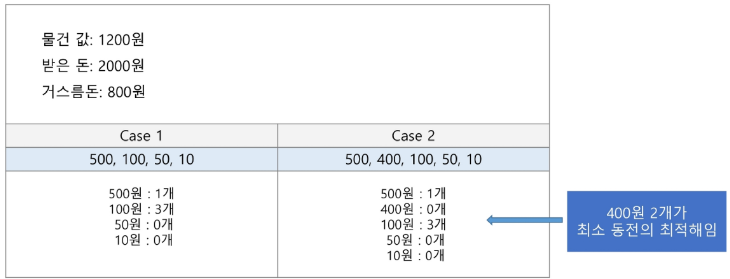
        - 거스름돈(800)에 도달하기 위해 가장 빠르게 도달할 수 있을 것 같은 500을 처음에 선택
        - 이후 다음 최적이라고 생각하는 100을 선택함
        - 그러나 400원짜리가 있다면? 이 선택이 최종적으로는 최적이 아니게 됨

**※ 어떤 문제를 해결하기 위해 진행하는 순서**
1. 그리디로 풀리는지 검증 -> 안될 것 같으면 완전탐색

2. 완전탐색이 기본 베이스 -> 가지치기로 시간복잡도 줄이기 -> 줄이다 보니 그리디로 해결할 수 있을 것 같다 -> 다른 방법도 물색해보자

-> 1 또는 2의 방식으로 문제를 풀어나갈 것임

**※ 무작정 생각하지 말고!!**
- 1번 방법으로 해결할 것이라면
    1. 그리디로 시도
    2. 작은 문제를 해결하기 위해 얻었던 최적해가 다음 반복문에서는 최적해가 될 수 없을수도 있겠구나 깨달음
    3. 잠깐 멈추고 완전탐색으로 완벽하게 조사
    4. 아까 그리디에서 생각했던 조건들을 가지치기에 적용

- 2번 방법으로 해결할 것이라면
    1. 내가 특정 문제를 해결하기 위해 선택한 최적해가 모든 부분 문제들에 동일하게 적용이 되겠구나
    2. 가지치기
    3. 이 조건 만족하지 못하면 다 제외되고 선택지가 하나만 남겠구나
    4. 그리디로 해결해볼 수 있겠구나 를 시도

->  이런 사고 방식을 가지고 있어야 함..!

-> 여러가지 방법으로 사고할 수 있어야 함..!


### 활용
1. 배낭 짐싸기(knapsack)
    - 문제
        - 도둑이 훔친 물건을 배낭에 담아 올 계획이다. 배낭은 담을 수 있는 물건의 총 무게(W)가 정해져있다
        - 창고에는 여러 개(n개)의 물건들이 있고 각각의 물건에는 무게와 값이 정해져있다
        - 경비원들에게 발각되기 전에 배낭에 수용할 수 있는 무게를 초과하지 않으면서, 값이 최대가 되는 물건들을 담아야 한다

            
    
    - 문제 정의

        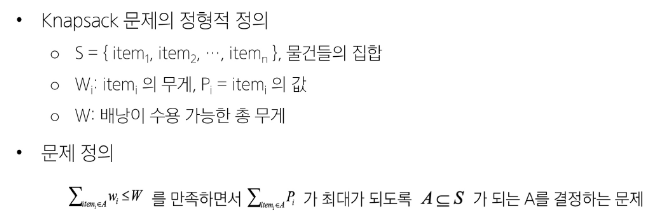
    
    - Knapsack 문제 유형

        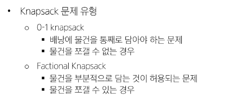
    - 0-1 knapsack에 대한 완전 검색 방법
        - 완전 검색으로 물건들의 집합S에 대한 모든 부분집합 구한다
        - 부분집합의 총 무게가 W를 초과하는 집합들은 버리고, 나머지 집합에서 총 값이 가장 큰 집합 선택
        - 물건의 개수가 증가하면 시간 복잡도가 지수적으로 증가함
            - 크기 n인 부분집합의 수 `2^n`
        
    - 0-1 knapsack에 대한 탐욕적인 방법1

        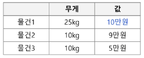
        - 값이 비싼 물건부터 채운다
        - W = 30kg
        - 탐욕적 방법의 결과: (물건1) => 25kg, 10만원
        - 최적해: (물건2, 물건3) => 20kg, 14만원
        - 최적이 아님!!
        
    - 0-1 knapsack에 대한 탐욕적인 방법2

        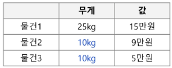
        - 무게가 가벼운 물건부터 채운다
        - W = 30kg
        - 탐욕적 방법의 결과: (물건2 + 물건3) => 14만원
        - 최적해: (물건1) => 15만원
        - 역시 최적이 아님!!
        
    - 0-1 knapsack에 대한 탐욕적인 방법3

        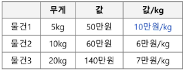
        - 무게당 (ex. kg당) 값이 높은 순서로 물건을 채움
        - W = 30kg
        - 탐욕적 방법의 결과: (물건1, 물건3) => 190만원
        - 최적해: (물건2, 물건3) => 200만원
        - 이또한 최적이 아님!!
        
    - Factoinal knapsack 문제
        
        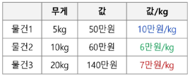
        - 물건의 일부를 잘라서 담을 수 있음
        - 탐욕적인 방법: (물건1 5kg + 물건3 20kg + 물건2의 절반 5kg) => 30kg
        - (50만원 + 140만원 + 30만원) => 220만원

    - 배낭 짐싸기 **그리디** 
    ```python
    '''
        - 거스름돈 문제 그리디로 해결
        - 가장 큰 거스름돈을 먼저 거슬러주고, 남은 금액을 다음 단위로 해결
    '''
    def get_minimum_coins(coins, change):
        # 어떤 동전이: 몇개 사용되었는가?
        result = {}

        # 가장 큰 코인부터 coins에서 빼나갈 것이다 -> 오름차순
        coins.sort(reverse=True)

        # 코인 종류별로 change에서 제거
        for coin in coins:
            count = 0               # 몇 번 뺐는지 알아야 하므로 count 세자
            while change >= coin:   # 뺄 수 있으면
                change -= coin
                count += 1
                result[coin] = count    
                # count = change // coin 이렇게 정의하는 것도 가능(알아서하셍)
        return result

    coins = [1, 5, 10, 50, 100, 500]  # 동전 종류
    change = 882  # 잔돈

    # 아래의 경우라면 어떨까?
    '''
    coins = [1, 5, 10, 50, 100, 400, 500]  # 동전 종류
    change = 882  # 잔돈
    # 400원짜리가 끼면 그리디로 해결되지 않음
    # 빠른 것보다 정확도가 중요!!
    # 백트래킹 방식으로 진행해보자
    '''
    result = get_minimum_coins(coins, change)
    for coin, count in result.items():
        print(f"{coin}원: {count}개")
    ```

    - 배낭 짐싸기 **백트래킹**
    ```python


    ```


2. 활동 선택 문제(회의실 배정)
    - 문제
        - 회의실은 하나만 존재하고 다수의 회의가 신청된 상태이다
        - 회의는 시작 시간과 종료 시간이 있으며, 회의 시간이 겹치는 회의들은 동시에 열릴 수 없다
        - 가능한 많은 회의가 열리기 위해서는 어떻게 배정해야 할까?

        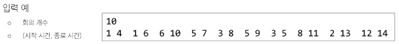
    - 문제 정의

        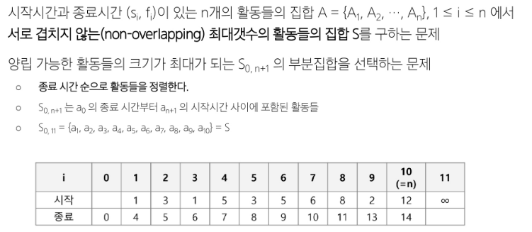
    
    - (1) 탐욕 기법을 적용한 반복 알고리즘
        - 종료시간이 빠른 순서대로 활동들을 정렬
        - 첫 번째 활동(A1) 선택
        - 선택한 활동(A1)의 종료시간보다 빠른 시작을 가지는 활동은 무시하며, 같거나 늦은 시간을 갖는 활동을 선택
        - 선택된 활동의 종료시간을 기준으로 뒤에 남은 활동들에 대해 앞의 과정을 반복
    
    - (2) 종료시간으로 정렬
        - 10개의 회의들을 종료시간으로 정렬
            
            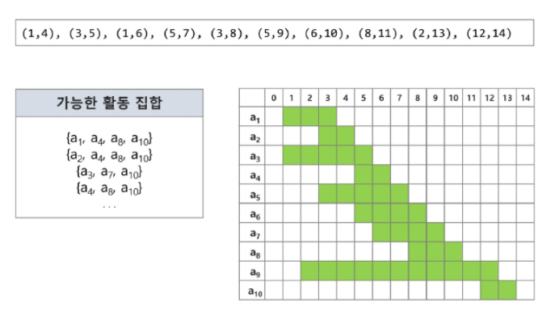
            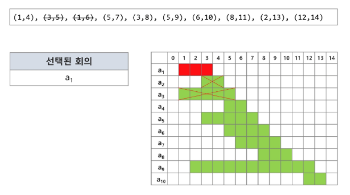
            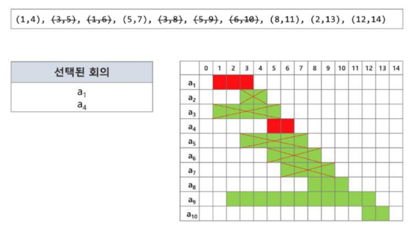
            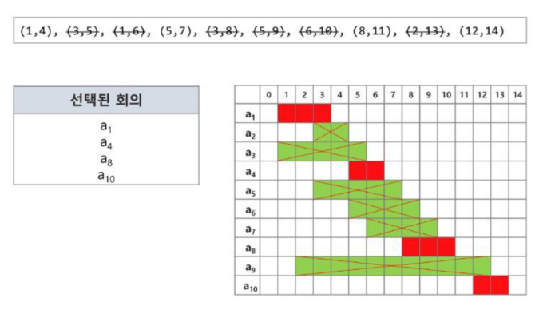
        

## 탐욕 알고리즘 필수 요소
- 탐욕적 선택 속성(greedy choice property)
    - 탐욕적 선택은 최적해로 갈 수 있음을 보여라
    - 즉, 탐욕적 선택은 항상 안전함
- 최적 부분 구조(optimal substructure property)
    - 최적화 문제를 정형화해라
        - 하나의 선택을 하면 풀어야 할 하나의 하위문제가 남음
- `[원 문제의 최적해 = 탐욕적 선택 + 하위문제의 최적해]`임을 증명해라

## 대표적인 탐욕 기법의 알고리즘들
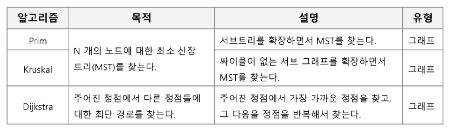


### 연습문제
- [SWEA 5648] 원자 소멸 시뮬레이션

    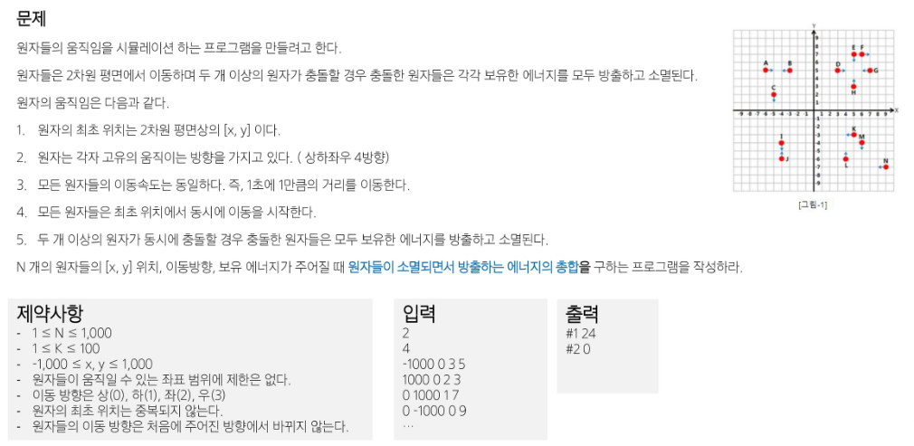

- [SWEA 4012] 요리사

    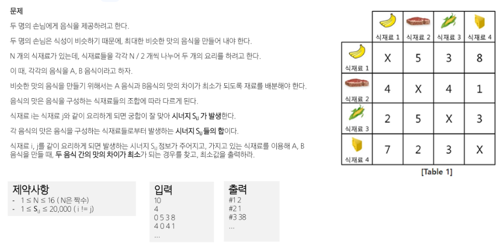


