# BFS
## BFS(트리)
루트 노드의 자식 노드들을 먼저 모두 차례로 방문한 후에, 방문했던 자식 노드들을 기준으로 하여 다시 해당 노드의 자식 노드들을 차례로 방문하는 방식

- 인접한 노드들에 대해 탐색 후 차례로 다시 너비 우선 탐색을 진행해야 함
    - 선입선출 형태의 자료구조 `Queue` 활용

### BFS 알고리즘

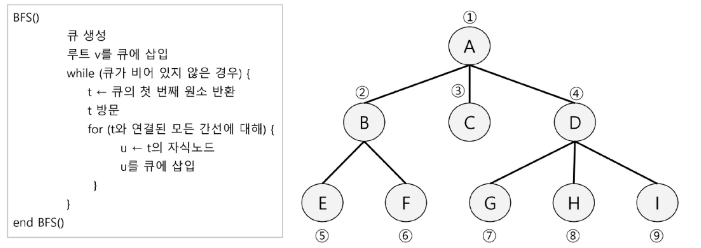
- A를 시작으로 너비 우선 탐색 시작
- A의 인접 노드 [B, C, D] 중 B로 가서, B의 자식을 탐색하는 것이 아니라(그건 DFS) A의 자식인 B, C, D를 다 순회하고 난 뒤에 그 아래 자식들을 순회할 것임
- 그렇다면 언제 순회할 것인가?
    - 내가 가진 후보군들을 어딘가에 담아두고, 담은 후보들은 모두 다음 순회 대상에 들어가야 함
    - A가 가진 [B, C, D]에 대한 순회가 다 끝났다면
    - 순회 대상이었던 B를 꺼내서 B의 자식들 [E, F]를 순회하도록 [C, D, E, F] 후보군 리스트 추가
    - 그러고 C를 조사하러 가는 순서로 진행

- BFS(트리) 탐색 순서
    1. 큐 생성 & 루트노드(A) enqueue

        
    2. dequeue(A) & A의 자식 노드 enqueue

        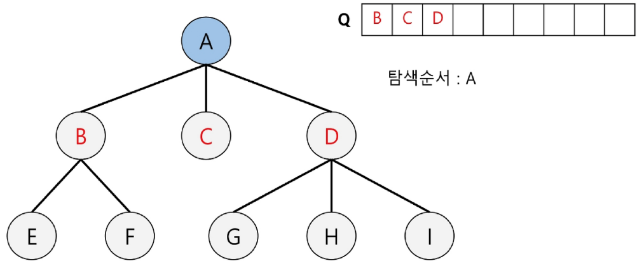
    3. dequeue(B) & B의 자식노드 enqueue

        
    4. dequeue(C) & C의 자식노드 enqueue(없음)

        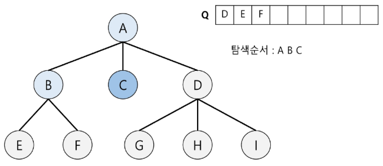
    5. dequeue(D) & D의 자식노드 enqueue

        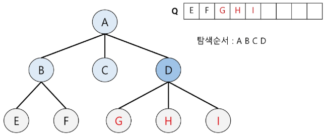
    6. dequeue(E) & E의 자식노드 enqueue(없음)

        
    7. dequeue(F) & F의 자식노드 enqueue(없음)

        
    8. dequeue(G) & G의 자식노드 enqueue(없음)

        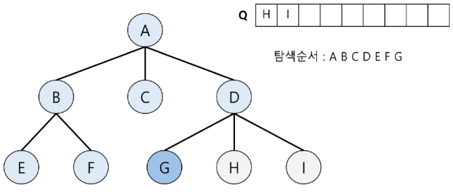
    9. dequeue(H) & H의 자식노드 enqueue(없음)

        
    10. dequeue(I) & I의 자식노드 enqueue(없음)

        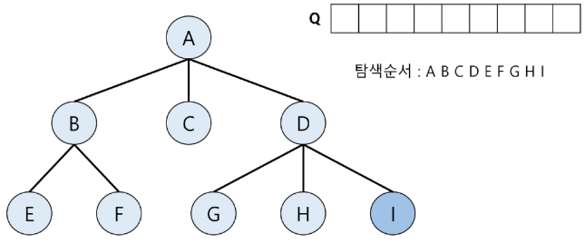
    11. Queue가 비었으므로 탐색 종료

- BFS(트리) 구현 코드
    ```python
    def BFS(root_node):
        '''
        :param root_node: 너비우선 탐색을 시작할 서브 트리의 루트
        :return: 완성된 경로
        '''
        # 탐색 경로를 저장할 리스트(바로 print 안하고 append)
        result = []     

        # 이번에 조사할 노드와 앞으로 조사할 노드들(후보군)을 담을 자료구조
        data_structure = [root_node]    # 처음 시작 노드 넣어놓기

        # 탐색이라는 행위는 언제까지 할 것이냐?
        # 모든 노드를 다 탐색해서 더 이상 탐색할 후보군이 없을 때까지!
        while data_structure:   # 후보군이 남아있으면 계속 조사
            # node = data_structure.pop()     # LIFO 해버려서 DFS가 됨
            node = data_structure.pop(0)    # FIFO
            result.append(node)

            # 내 자식 노드들(인접 노드들)을 인접 리스트 목록에서 찾아와서
            for child in graph.get(node, []):   # 디폴트 값 [] 설정(디폴트값 없으면 None 반환)
                                                # 찾는 키가 없으면 빈 리스트 반환
                # 다음 조사 후보군 목록에 자식을 추가함
                data_structure.append(child)

        return result
    # BFS ------------------------------------------

    # 그래프 인접 리스트
    graph = {
        'A': ['B', 'C', 'D'], 
        'B': ['E', 'F'],
        'C': [],
        'D': ['G', 'H', 'I'], 
        'E': [],
        'F': [],
        'G': []
    }

    start_node = 'A'
    print(BFS('A'))
    ```

---
---
---


노드가 가진 인접 노드의 정보를 

..


## BFS(그래프)


- BFS(그래프) 탐색 순서
    1. Visited 리스트 생성 및 False 초기화 & 큐 생성 & 시작 정점(A) 방문처리 및 enqueue

        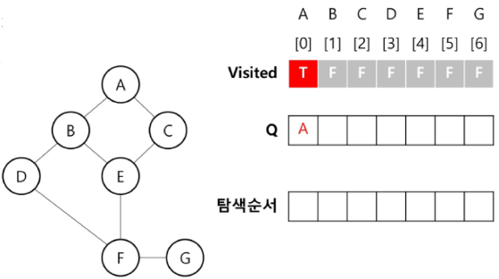
    2. dequeue(A) & A의 인접 정점(B, C) 방문처리 및 enqueue

        
    3. dequeue(B) & B의 인접 정점(D, E) 방문처리 및 enqueue

        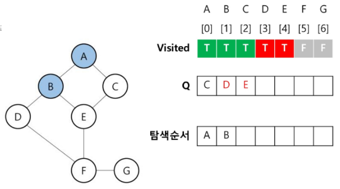
    4. dequeue(C) & C의 인접 정점 방문처리 및 enqueue(없음)

        
    5. dequeue(D) & D의 인접 정점 방문처리(F) 및 enqueue

        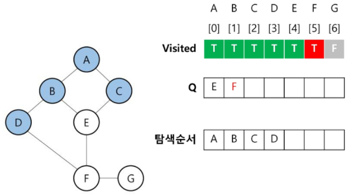
    6. dequeue(E) & E의 인접 정점 방문처리 및 enqueue(없음)

        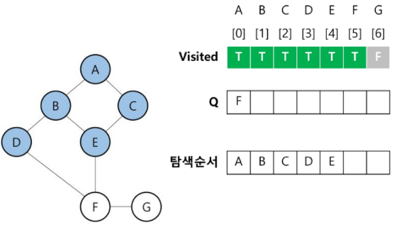
    7. dequeue(F) & F의 인접 정점 방문처리(G) 및 enqueue

        
    8. dequeue(G) & G의 인접 정점 방문처리 및 enqueue(없음)

        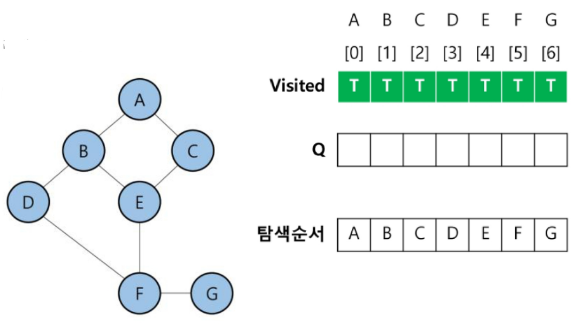
    9. 큐가 비었으므로 탐색 종료

- BFS(그래프) 구현 코드
    ```python
    from collections import deque
    def BFS(start_vertax):
        # 해당 정점 방문 여부 표시할 배열 필요함
        # visited = [0] * len(nodes)
        # 또는
        visited = set()

        # 후보군 저장
        # deque는 첫번째 인자로  iterable 객체를 받음
        queue = deque([start_vertax]) # 그냥 넣지말고 리스트로 만들어서 넣자

        # 조사 시작할 때 시작정점 넣어주기
        visited.add(start_vertax)

        # 최종 결괏값
        result = []

        while queue:
            node = queue.popleft()
            result.append(node)

            # 내 인접 리스트에서 인접 정점 찾아서 순회
            for neighbor in adj_list.get(node, []):
                # 해당 정점 아직 방문한 적 없다면
                if neighbor not in visited:
                    visited.add(neighbor)   # 방문 예정 표시
                    queue.append(neighbor)  # 다음 후보군에 추가
        return result

    # BFS2 --------------------------------------

    def BFS2(start_index):
        visited = set()
        queue = deque([start_index])
        visited.add(start_index)
        result = []

        while queue:
            node = queue.popleft()
            result.append(node)

            # 모든 노드들에 대해 인덱스 조사
            for next_index in range(len(nodes)):
                # ??
                if next_index not in visited and adj_matrix[node][next_index]:
                    visited.add(next_index)
                    queue.append(next_index)
        return result
    # 정점&간선 정보 -----------------------------

    # 정점 정보
    #         0    1    2    3    4    5    6
    nodes = ['A', 'B', 'C', 'D', 'E', 'F', 'G']

    # 간선 정보
    edges = [
        '0 1',  # A - B 무방향 그래프
        '0 2',  # A - C 무방향 그래프
        '1 3',  # B - D
        '1 4',  # B - E
        '2 4',  # C - E
        '3 5',  # D - F
        '4 5',  # E - F
        '5 6'   # F - G
    ]
    # 문제 풀 때는 간선 정보를 받는 경우가 많으니
    # 간선 정보를 토대로 인접 리스트 or 인접 행렬을 만드는 연습 해보기

    # 인접 리스트 --------------------------------
    
    # 간선 정보를 보기 쉬운 인접 리스트 형태로 만들어보자
    adj_list = {        # dict comprehension
        node: [] for node in nodes
        # key: value
    }

    # 간선 정보와 정점의 index 정보로 adj_list 채워주기
    for edge in edges:
        u, v = edge.split()     # 시작 정점, 도착 정점
        # print(f'{u}: {nodes[int(u)]}, {v}: {nodes[int(v)]})

        adj_list[nodes[int(u)]].append(nodes[int(v)])
        # 현재 간선 정보는 '무방향' 그래프
        # -> 양쪽 다 갈 수 있다는 뜻
        # 반대방향도 넣어주자
        adj_list[nodes[int(v)]].append(nodes[int(u)])
    # 인접 리스트 완성
    # print(adj_list)

    print(BFS('A'))
    # 인접 행렬 ----------------------------------

    # 인접 행렬 -> [[], [], [], ...]
    adj_matrix = [[0] * len(nodes) for _ in range(len(nodes))]
                # 모든 정점에 못간다고 가정해두고
                # 갈 수 있는 정점을 1로 변경하자(아니면 나중에 0 다 채워야함)

    for edge in edges:
        u, v = edge.split()
        u_index, v_index = int(u), int(v)
        adj_matrix[u_index][v_index] = 1
        adj_matrix[v_index][u_index] = 1    # 무방향이므로 반대쪽도 해주기

    print(BFS2(0))
    ```


###  연습문제


