# DFS
## 비선형 자료구조
비선형구조인 트리, 그래프의 각 노드(정점)를 중복되지 않게 전부 방문(visit)하는 것을 말함
- 비선형구조는 선형 구조에서와 같이 선후 연결 관계를 알 수 없음
    - 특별한 방법 필요
        1. 깊이 우선 탐색(Depth First Search, DFS)
        2. 너비 우선 탐색(Breadth First Search, BFS)

## DFS(트리)
루트 노드에서 출발하여 한 방향으로 갈 수 있는 경로가 있는 곳까지 **깊이 탐색**해 가다가 더이상 갈 곳이 없으면, 가장 마지막에 만났던 갈림길 간선이 있는 노드로 되돌아와서 다른 방향의 노드로 탐색을 계속 반복하여 결국 모든 노드를 방문하는 순회 방법

- 가장 마지막에 만났던 갈림길의 노드로 되돌아가서 다시 깊이 우선 탐색을 반복해야 함
    - 재귀적으로 구현
    - 또는 **후입선출 구조의 스택**으로 구현

- 재귀로 구현

    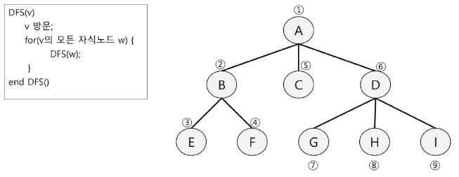

- 스택으로 구현
    1. 루트노드 A를 시작으로 깊이 우선 탐색 시작

        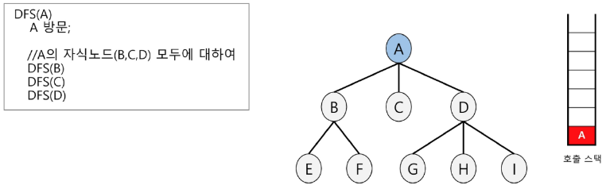
    2. 노드B에서 깊이 우선 탐색을 처리

        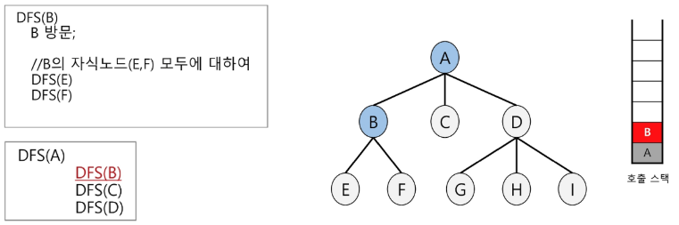
    
    3. 노드E에서 깊이 우선 탐색을 처리

        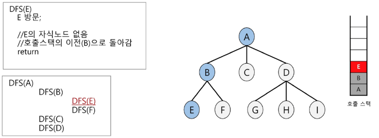
        - E는 할 일이 끝났으므로 스택 들어왔다가 빠져 나감

    4. 노드F에서 깊이 우선 탐색을 처리

        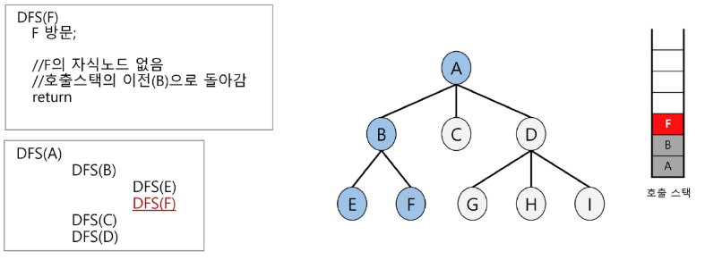
    5. 노드C에서 깊이 우선 탐색을 처리

        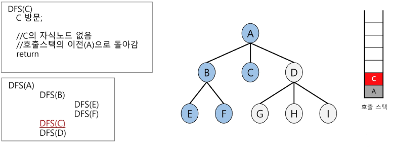
    6. 노드D에서 깊이 우선 탐색을 처리

        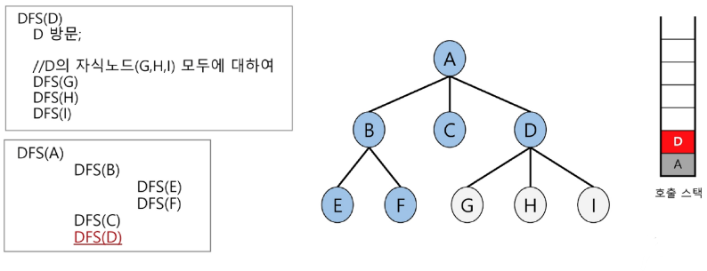
    7. 노드G에서 깊이 우선 탐색을 처리

        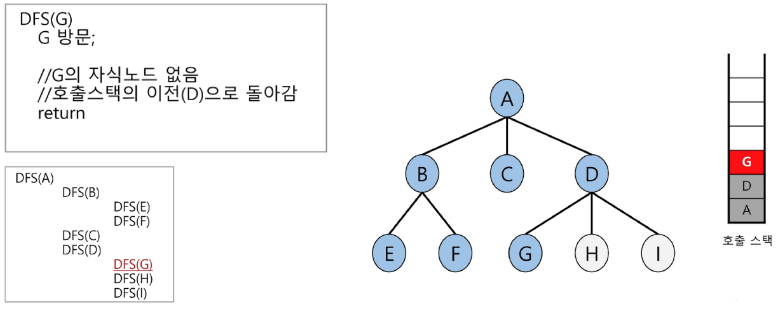
    8. 노드H에서 깊이 우선 탐색을 처리

        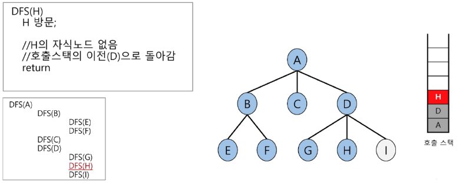
    9. 노드I에서 깊이 우선 탐색을 처리

        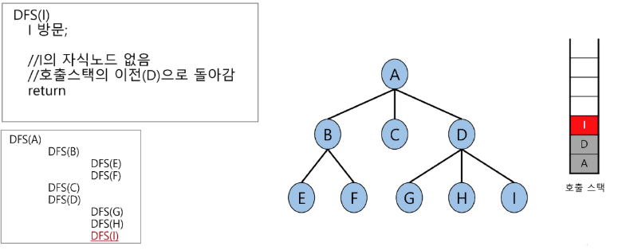

```python


```

하나.
둘. 어떤 방식으로 순회 할거냐
셋. 웅앵


## DFS(그래프)
**시작 정점**에서 출발하여 한 방향으로 갈 수 있는 경로가 있는 곳까지 깊이 탐색해 가다가 더 이상 갈 곳이 없게 되면, 가장 마지막에 만났던 갈림길 간선이 있는 정점으로 되돌아와서 다른 방향의 정점으로 탐색을 계속 반복하여 결국 모든 정점을 방문하는 순회방법

- 트리와 그래프의 명확한 차이점
    - 트리는 뿌리 확인 가능
        - 트리는 계층 구조이므로 ..
    - 그래프는 뿌리 확인 불가능
        - 그래프는 계층 구조가 아니므로 ..

그래프는 뿌리 확인 불가능
그래프는 임의의 시작 정점에서 출발한다고 가정
출발 지점에 따라 결과 달라짐


이전에 방문한 적 있었는지 기록할 필요가 있음!!
정점들의 모음을 만들고, 이 모음과 동일한 선형 자료구조를 만들어서 정점들에 대해 인덱스를 적절히 부여해서 방문했다면 그 자료구조에 첵흐

이미 방문 했으므로 후보군에 들어갈 수 없음

후보군의 후보군 순으로 이동해서 깊이 우선 탐색으로,,


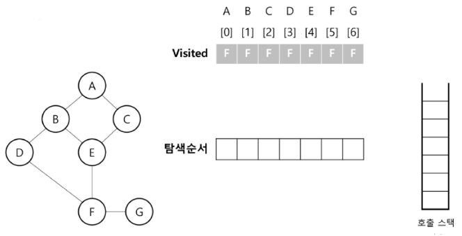
