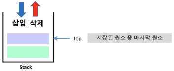
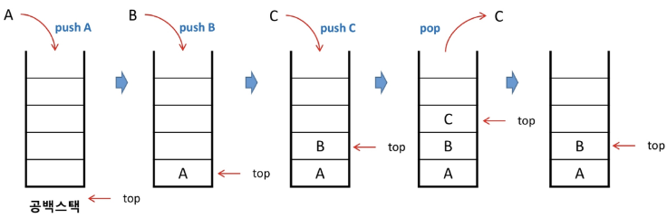
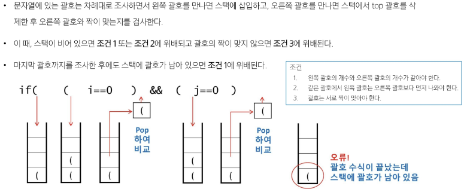
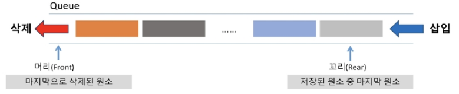
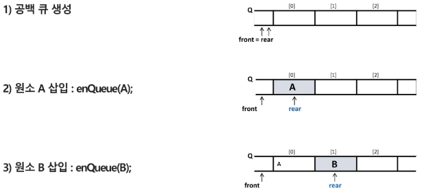
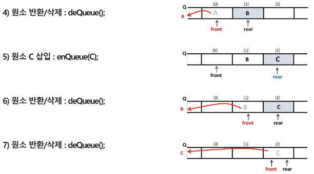
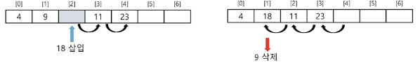
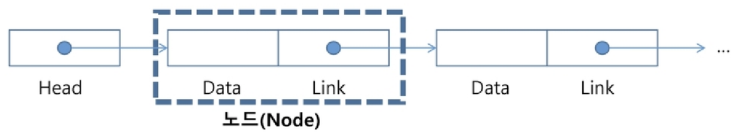

# 스택과 큐
## 스택(stack)
물건을 쌓아 올리듯, 자료를 쌓아 올린 형태의 자료구조

- 스택에 저장된 자료는 선형 구조를 가짐
    - 선형구조: 데이터 요소들 사이에 순서가 존재
    - 비선형구조: 데이터 요소가 순차적으로 나열되지XX
- 스택에 자료를 삽입 또는 꺼낼 수 있음
- **후입선출** 구조(**LIFO**, Last-In-First-Out)
    - 마지막에 삽입한 자료를 가장 먼저 꺼냄
    - ex. 1, 2, 3 순으로 스택에 넣으면 3, 2, 1 순으로 꺼낼 수 있음

### 스택 주요 연산


- `Push` : 저장소에 자료 저장(삽입)
- `Pop` : 저장소에서 자료를 꺼냄(삭제)
    - 꺼낸 자료는 삽입한 자료의 '역순'으로 꺼냄
- `InEmpty` : 스택이 공백인지 확인
    - `isfull` : 스택이 꽉 차면 삽입 불가능 하므로 확인 필요
    top의 위치로 자료 넣을 수 있는지 없는지 확인
- `Peek` : 스택의 top에 있는 자료를 반환

### 스택의 삽입/삭제 과정
빈 스택에 원소 A, B, C를 차례로 삽입 후 한번 삭제하는 연산과정




### 스택 구현
```python
class Stack:
    # 생성자 함수: 스택 자료구조 인스턴스 생성 시, 이 자료구조의 최대 크기도 함께 넘겨줘야 함
    def __init__(self, capacity=10):
        self.capacity = capacity    # 이 자료구조의 최대 수용 가능 공간(기본값 10)
        self.item = [None] * capacity   # 내 최대 크기만큼 리스트를 None으로 채운다
        self.top = -1   # 왜 top이 0이 아닌 -1로 초기화 하느냐?
                        # 여기서 -1은 리스트의 마지막을 의미하는 것이 아닌
                        # push 연산 진행 시, top의 값을 1 증가시키고 그곳에 값을 삽입할 예정

    # 삽입할 수 있는 공간을 생성자 함수로 만들어 놨으니, 이제 값을 삽입하자
    # 주어진 값을 삽입
    def push(self, item):
        # push를 계속 해서 스택이 가득 찼을 때 또 삽입하면 IndexError 발생
        # 스택이 가득 찼음을 확인해야 함 -> 예외처리
        if self.is_full():
            print('Stack is Full!!')
            return
            # 또는 에러 직접 발생시키기 가능 -> raise IndexError('Stack is Full')        
        self.top += 1   # 올바른 삽입 위치 찾기(top의 위치를 옮긴 후 그 자리에 삽입)
        self.items[self.top] = item
    
    def pop(self):
        if self.is_empty():
            print('Stack is Empty!!')
            return
        item = self.items[self.top]     # 제거할 값은 top위치에 있음
        self.items[self.top] = None     # 왜 그런지 설명쓰...
        self.top -= 1
        return item

    def is_full(self):
        # stack이 가득 찼음을 어떻게 알 수 있을까?
        # top의 최대 위치가 어디인지 확인해 봤을 때
        # 최대 용량의 -1에 top이 도달했다면 full?
        return self.capacity -1 == self.top
        
    # 스택이 비었는지 확인
    # top이 -1일 때 스택이 비어있다고 판단할 수 있음
    def is_empty(self):
        return self.top == -1
            
stack = Stack()

# stack.push(1)
# stack.push(2)
# stack.push(3)

# print(stack.pop())
# print(stack.pop())
# print(stack.peek())
# print(stack.is_empty())
# print(stack.pop())
# print(stack.pop())


```


### 스택 응용
- 괄호 검사
    - 괄호의 종류: 대괄호 `[]`, 중괄호 `{}`, 소괄호 `()`
    - 조건
        1. 왼쪽 괄호의 개수와 오른쪽 괄호의 개수가 같아야 함
        2. 같은 괄호에서 왼쪽 괄호는 오른쪽 괄호보다 먼저 나와야 함
        3. 괄호는 서로 짝이 맞아야 함
    - 잘못된 괄호 사용 예시
        - ( a ( b )
        - a ( b ) c )
        - a { b ( c [ d ] e } f )

- 괄호검사 solution

    

```python
def check_match(expression):
    # 여는 괄호들을 일단 담아둘 스택
    # 여는 괄호들을 담아두다가 올바른 닫는 괄호가 나왔는지 확인하기 위함
    stack = []

    # 괄호의 짝을 매칭시킬 수 있어야 할 것 같다
    # 문자열도 시퀀스 타입이므로 리스트 아니어도 괜츈
    opening_bracket = '({['
    closing_bracket = ')]}'
    matching_dict = { ')':'(',
                      '}':'{',
                      ']':'['}

    for char in expression:
        if char in matching_dict.values():  # 여는 괄호인지 물어보기
            # 여는 괄호라면 스택에 넣어랏
            stack.append(char)
        elif char in matching_dict.keys():  # 닫는 괄호인지 물어보기
            # 닫는 괄호라면?
            # 스택에서 나와 매칭되는 짝을 찾을 수 있다면, 그 괄호를 제거
            # 단, 스택이 비어있지 않아야 함!
                # 스택이 비었거나, 마지막 요소 값이 내가 찾는 여는 괄호가 아니면 실패
            if not stack or stack[-1] != matching_dict[char]:
                return False

            # 매칭 짝을 찾았으면 제거
            stack.pop()
    # 모든 문자를 다 순회했을 때, 스택이 비어있지 않다면 문제가 있는 것
    return not stack


# 예시
examples = ["(a(b)", "a(b)c)", "a{b(c[d]e}f)"]
for ex in examples:
    if check_match(ex): 
        print(f"{ex} 는 올바른 괄호") 
    else:
        print(f"{ex} 는 올바르지 않은 괄호")  
```

- Function call


- 계산기


## 큐(Queue)
스택과 마찬가지로 삽입과 삭제의 위치가 제한적인 자료구조
- 큐의 뒤에서는 삽입만 하고, 큐의 앞에서는 삭제만 이루어지는 구조
- **선입선출** 구조(**FIFO**, First-In-Fitst-Out)
    - 큐가 삽입한 순서대로 원소가 저장되어, 가장 먼저 삽입한(First In) 원소는 가장 먼저 삭제(First Out) 됨

### 큐의 주요 연산

- `EnQueue` : 큐의 뒤쪽에 원소를 삽입
- `Dequeue` : 큐의 앞쪽에서 원소를 삭제하고 반환
- `IsEmpty` : 큐가 공백상태인지 확인
- `Peek` : 큐의 앞쪽에서 원소를 삭제 없이 반환

### 큐의 연산 과정




### 큐 구현
```python
class Queue:
    # 생성자 함수
    def __init__(self, capacity=5):
        self.capacity = capacity
        self.items = [None] * capacity
        self.front = -1     # 출구
        self.rear = -1      # 입구
    
    # 꽉 찼니?
    def is_full(self):
        return self.rear == self.capacity -1
    # 비었니?
    def is_empty(self):
        return self.front == self.rear
    
    # 값 삽입
    def enqueue(self, item):
        if self.is_full():
            print('queue is full!!')
            return
        # 가득 안찼다면
        self.rear += 1
        self.items[self.rear] = item
    
    # 값 제거
    def dequeue(self):
        if self.is_empty():
            print('queue is empty!!')
            return
        # 값이 비어있지 않다면
        self.front += 1
        item = self.items[self.front]
        self.items[self.front] = None
        return item
    
    
    
# queue = Queue()

# queue.enqueue(1)
# queue.enqueue(2)
# queue.enqueue(3)

# print(queue.dequeue())
# print(queue.dequeue())
# print(queue.items)
# print(queue.peek())

# queue.enqueue(4)
# queue.enqueue(5)

# print(queue.items)
# print(queue.is_full())
# queue.enqueue(11)

# 이렇게 작성했을 때 거짓 포화 상태 발생함
# 왜? empty의 판별 조건을 front와 rear의 위치가 동일할 때로 설정했고
# full의 판별 조건을 rear가 최대 용량 -1에 도달했을 때로 설정했어서
# 웅앵
# 원형 큐? 

```


### 리스트의 문제점

- 자료의 삽입/삭제 연산 과정에서 연속적인 메모리 배열을 위해 원소들을 이동시키는 작업이 필요함
- 원소의 개수가 많고, 삽입/삭제 연산이 빈번하게 일어날수록 작업 소요 시간이 크게 증가함

- 주소를 지정 안하면 된다?
- 그럼 순서를 어떻게 만드냐?
- 내 다음은 OO이다. 하고 알려주는거임


## 연결 리스트(Linked List)
자료의 논리적인 순서와 메모리 상의 물리적인 순서가 일치하지 않고, 개별적으로 위치하고 있는 **각 원소를 연결**하여 **하나의 전체적인 자료구조**를 이룸

- **링크를 통해 원소에 접근**하므로, 리스트에서처럼 물리적인 순서를 맞추기 위한 작업이 필요XX
- 자료구조의 크기를 동적으로 조정할 수 있어, 메모리의 효율적인 사용이 가능함

### 연결 리스트의 기본 구조

- 노드
    - 연결 리스트에서 하나의 원소를 표현하는 기본 구성 요소
    - 구성 요소
        1. 데이터 필드
            - 원소의 값을 저장
            - 저장할 원소의 종류나 크기에 따라 구조를 정의하여 사용
        2. 링크 필드
            - 다음 노드의 참조 값을 저장
- 헤드
    - 연결 리스트의 첫 노드에 대한 참조 값을 갖고 있음


### 단순 연결 리스트(Singly Linked List)

