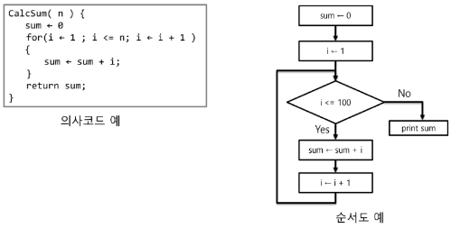
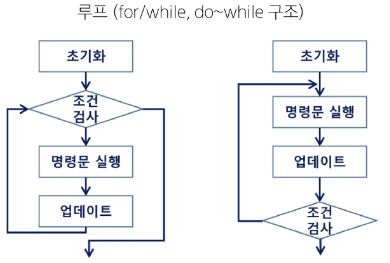
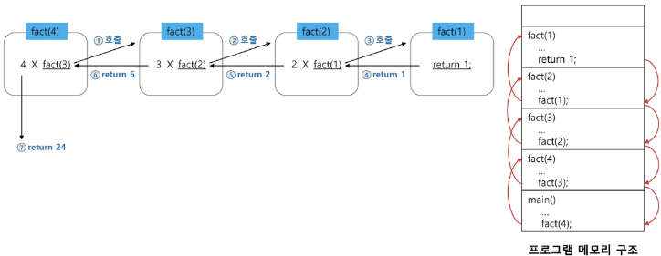
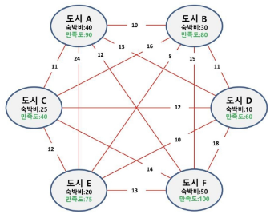

# 알고리즘
## 알고리즘
유한한 단계를 통해 문제를 해결하기 위한 절차나 방법으로, 주로 컴퓨터 용어에 쓰임

- 컴퓨터가 어떤 일을 수행하기 위한 단계적 방법
- 즉, 어떠한 문제를 해결하기 위한 절차

### 알고리즘 표현 방법
1. 의사 코드
2. 순서도
3. 프로그래밍 언어

    

### 알고리즘 성능
- 정확성(★★★): 얼마나 정확하게 동작하는가
- 효율성(★): 얼마나 최적화 되었는가
- 확장성(★): 입력 크기에 상관없이 항상 성능이 일정한가
- 단순성(★★): 얼마나 단순한가

※ 주어진 문제를 해결하기 위해 여러 알고리즘이 가능한데, 이 알고리즘들의 성능 분석이 필요함

- 알고리즘 성능 분석 예시
    
    - 100번 코드 돌아가는 것보다 3번 코드 돌아가는게 당연히 좋다


## 복잡도
### 시간 복잡도
연산의 작업량, 수행 시간이 어느정도 되는지 계산

- 최선의 경우(Best Case)
    - 빅 오메가 표현법 사용
    - 알고리즘이 가장 빠르게 실행될 때의 성능

- 평균적인 경우(Average Case)
    - 빅 세타 표기법 사용
    - 일반적인 알고리즘의 성능

- 최악의 경우(Worst Case)
    - 빅 오 표기법 사용 `O(n)` 
    - 알고리즘이 가장 느리게 실행될 때의 성능
    - 우리는 최악의 경우를 기준으로 복잡도를 얘기할 것임
    - 알고리즘을 통해 문제 해결을 필요로 하고 있는데, n번의 경우의 수에 대한 해결 방법이 있을 것이고 n개의 복잡도가 생긴다면 최악의 경우를 기준으로 생각하는 것이 당연

### 공간 복잡도
메모리 사용량

### 복잡도의 점근적 표기
시간 (또는 공간) 복잡도는 입력 크기에 대한 함수로 표기하는데, 이 함수는 주로 여러 개의 항을 가지는 다항식임

- 이를 단순한 함수로 표현하기 위해 '점근적 표기'를 사용
- 입력크기 n이 무한대로 커질 때의 복잡도를 간단히 표현하기 위해 사용하는 표기법

- 빅-오(O) 표기법
    - 시간 복잡도 함수 중 가장 큰 영향력을 주는 n에 대한 항만을 표시
    - 계수(Coefficient)는 생략하여 표시

        
    
    - n개의 데이터를 입력받아 저장한 후 각 데이터에 1씩 증가시킨 후 각 데이터를 화면에 출력하는 알고리즘의 시간 복잡도 = `O(n)`
        - 3n..

    - 다양한 시간 복잡도 비교

        
    
    - 시간 복잡도별 실제 실행 시간 비교

        
        - n = 1억 -> 즉, 1억번 연산할 때 0.1초 걸림
        - n이 1000, 10000인데 시간 제한이 4초다? 쫄지말고 그냥 풀 것
    

## 재귀 호출
### 재귀 함수
- 반복(Iteration)과 재귀(Recursion)
    - 반복과 재귀는 유사한 작업 수행함
    - 반복은 수행하는 작업이 완료될 때까지 반복
    - 재귀는 주어진 문제의 해를 구하기 위해 **동일하면서 더 작은 문제의 해를 이용**하는 방법으로, 재귀 함수로 구현함

    

- 재귀 함수(recursive function)
    - 함수 내부에서 직접 혹은 간접적으로 **자기 자신을 호출하는 함수**
    - 일반적으로 재귀적 정의를 이용해서 재귀 함수를 구현함
    - 기본 부분(basis part)과 유도 부분(inductive part)으로 구성됨
    - 재귀적 프로그램을 작성하는 것은 반복 구조에 비해 간결하고 이해가 쉬움
    - 함수 호출은 프로그램 메모리 구조에서 **스택**을 사용함
    - 즉, 재귀 호출은 반복적인 스택 사용을 의미하며 메모리 및 속도에서 성능 저하가 발생함

    - 점화식이 뭐시기..

- 팩토리얼 재귀 함수
    - 재귀적 정의
        ```
        Basis Rule
            N <= 1 경우, N = 1
        
        Inductive Rule
            N > 1, N! = N * (N - 1)!
        ```
    - 재귀 함수
        ```python
        def fact(n):
            if n <= 1:      # Basis Rule
                return 1
            else:
                return n * fact(n-1)    # Inductive Rule
        ```
    - 팩토리얼 함수에서 n=4인 경우의 실행

        

- 피보나치 수열 재귀 호출
    - 이전의 두 수 합을 다음 항으로 하는 수열을 피보나치라고 함
    - `0, 1, 1, 2, 3, 5, 8, 13, ...`
    - 수식
        ```
        F0 = 0, F1 = 1
        Fi = F(i+1) + F(i+2) for i >= 2
        ```
    - 재귀 함수
        ```python
        def fibonacci(n):
            if n == 0:      # Basis Rule: n이 0일 때, 0 반환
                return 0
            elif n == 1:    # Basis Rule: n이 1일 때, 1 반환
                return 1
            else:           # Inductive Rule: n이 2 이상일 때, F(n-1) + F(n-2) 반환
                return fibonacci(n-1) + fibonacci(n-2)
        ```

- 하노이의 탑 문제
    - 하노이 탑 게임은 세 개의 기둥과 서로 다른 크기의 N개 원판으로 구성
    - 원판을 세 번째 기둥에 모두 옮겨 놓아야 함
    - 원판을 옮길 때는 반드시 한 번에 한 개씩 옮길 수 있고 두 번째 기둥을 이용할 수 있다
    - 옮기는 과정에서 절대로 큰 원판이 작은 원판 위에 놓이지 말아야 함

        


## 완전 탐색
### Baby-gin Game


- 접근 방법1
    - 입력 받은 숫자 정렬 후, 앞뒤 3자리씩 끊어서 run 및 triplet 확인하는 방법을 고려할 수 있다
    - ex. {6, 4, 4, 5, 4, 4} -> {4, 4, 4, 4, 5, 6}으로서 쉽게 baby-gin 확인할 수 있음
    - 그러나 {1, 2, 3, 1, 2, 3} -> {1, 1, 2, 2, 3, 3}으로서 오히려 baby-gin 확인에 실패할 수 있음

- 접근 방법2
    - 고려할 수 있는 모든 경우의 수 생성하기
    - 6개의 숫자로 만들 수 있는 모든 숫자의 나열(순열)
    - ex. 입력으로 {2, 3, 5, 7, 7, 7}을 받았을 경우
        ```
        2 3 5 7 7 7
        2 3 7 5 7 7
        2 3 7 7 5 7     
        ...             <모든 경우의 순열 나열>
        7 7 7 5 3 2
        ```

### 완전 검색
문제의 해법으로 생각할 수 있는 **모든 경우의 수를 나열해보고 확인**하는 기법
- Brute-force 혹은 generate-and-test 기법이라고도 불림
- 대부분 문제에 적용 가능
- 상대적으로 빠른 시간에 문제 해결(알고리즘 설계)을 할 수 있음
- 일반적으로 경우의 수가 작다면 유용
- 모든 경우의 수를 생성하고 테스트하기 때문에 수행 속도는 느리지만, 해답을 찾아내지 못할 확률이 낮음
- 전형적으로 순열(permutation), 조합(combination), 부분집합(subset)과 같은 조합적 문제들과 연관됨
- 검정 등에서 주어진 문제를 풀 때, 우선 '완전 검색으로 접근'하여 해답 도출 후 성능 개선을 위해 다른 알고리즘을 사용하고 해답 확인하는 것이 바람직


## 순열
- 여행 계획 문제
    
    
    - 출발, 도착 도시를 선택하면 모든 도시를 여행하는 코스를 알려드립니다
        - 어떤 코스가 경비가 가장 적게 들까?
            ```
            1. 모든 경우의 수를 손으로 쓰고, 경비 계산 => 가장 안전한 방법
            A -> B -> D -> F -> E -> C
            A -> B -> D -> F -> C -> E
            A -> B -> F -> C -> E -> F
            ...
            
            2. 또는, 가장 저렴한 이동 경비를 따라가보기
            A (10) B (8) E (12) C (12) D (18) F
            => 가장 싼 경로로 갔지만, 이미 갔던 도시는 제외해야 하므로 마지막 D -> F는 고정적임(현재 상황에서)
            => 만약 D -> (1000000) -> F 라면?
            => 앞에서 아무리 저렴하게 돌아다녔어도 마지막에 경비가 매우 비싼 코스로 갔다면 소용이 없음

            3. 따라서, 우리는 6개 도시 중 6개를 모두 사용해서 만들 수 있는 모든 경우의 수를 만들어 보자.
            ```
    - 3개의 도시를 선택하면 숙박비를 지원해 드립니다
        - 여행자는 어느 도시를 택했을 때 가장 이득일까?
            ```
            1. 숙박비가 가장 비싸지만 만족도가 높은 3개의 도시 A B F를 선택하면 이동 경비로 인해 안될 것 같다

            2. 그렇다면 6개 도시 중 3개를 일단 선택
            => 만약 A B F를 선택했다고 하자
            => '(전체 숙박비 - 경비) * 만족도'라는 형식으로 계산한다 했을 때 나오는 일정한 수치가 있을 것임
            => A B F가 정답이 아닐 수 있으므로 A B D, C E F 등을 비교해봐야 함
            => C E F에서 만족스러운 수치가 나왔다 하더라도, C E F 보다 F E C가 정답일 수도 있음
            => 이러한 경우를 if문으로 모두 쓰기엔 한계가 있음
            => 그래서 모든 경우의 수를 봐야할 것 같음
            ```
    - 여행 경비를 넘지 않으며 최대 만족도를 갖도록 선택하려면?
        - 여행경비 70만원이 있고, 이동 경로는 고려하지 않는다

    
### 순열(Permutation)
서로 다른 것 중 몇 개를 뽑아서 **순서대로** 나열하는 것

- 순서가 중요!!
- 서로 다른 n개 중 r개를 택하는 순열 `nPr`
- `nPr = n * (n-1) * (n-2) * ... * (n-r+1)` 식이 성립함
- `nPn = n!` 으로 표기하며 Factorial이라 부름
- 다수의 알고리즘 문제는 순서화된 요소들의 집합에서 최선의 방법을 찾는 것과 관련 있음
- N개의 요소들에 대해 n!개의 순열들이 존재함
    - 12! = 479,001,600
    - N > 12인 경우, 시간 복잡도는 폭발적으로 ↑

    

- 반복문을 통한 순열 생성
    - {1, 2, 3}을 포함하는 모든 순열 생성
        ```python
        for i in range(1, 4):       # A B C 중 하나 선택(첫번째 자리)
            for j in range(1, 4):   # A B C 중 하나 선택(두번째 자리)
                if j != i:          # 첫번째 자리와 두번째 자리가 같으면 안되므로 '같지 않을 때 세번째 자리 선택'
                    for k in range(1, 4):   # A B C 중 하나 선택(세번째 자리)
                        if k != i and k != j:   # 세번째 자리가 첫번째&두번째 자리와 같으면 안됨
                            print(i, j, k)
        ```
        ```
        결과: 
        1 2 3
        1 3 2
        2 1 3
        2 3 1
        3 1 2
        3 2 1
        ```
        - 지금 작성한 코드는 3P3에 대한 코드
        - 여행 문제는 6P3
        - 그렇다면 우리는 6중 for문을 써야하는 걸까? 아니면 3중 for문을 써야하는 걸까?
        - 만약 7P6을 계산해야한다면?
        - 위의 코드를 사용할 수 없게 됨
        - 문제 상황 발생할 때마다 for문을 늘렸다 줄였다 하기엔 곤란함
    - 반복문으로 어떤 요소를 선택했을 때 그것이 이미 선택했던 요소가 아니면 삽입하자
    - 단, 추가 조건 필요: '언제까지' 즉, 내가 모으고 있는 요소가 몇 개가 될 때까지 삽입할 것인지 작성할 필요가 있음

- 재귀 호출을 통한 순열 생성 `nPn` ex. 3P3
    ```python
    def perm(selected, remain):  
        '''
        Args:
            selected: 선택된 값 목록
            reamin: 선택되지 않고 남은 값 목록 
        '''
        # 모든 요소를 선택할 것이므로 나머지가 없을 때까지 작업 진행
        if not remain:
            print(selected)     # remain에 요소가 다 사라졌다는 것은 selected가 완성됐다는 것 -> 출력
        else:   # 아직 선택할 수 있는 요소들이 남아있다면
            for idx in range(len(remain)):  # 남아있는 요소들을 모두 순회하면서
                
                select_item = remain[idx]   # idx 번째의 요소를 선택

                # 선택한 요소는 selected 리스트에 넣을 예정
                # 요소를 넣고 난 뒤, 그 리스트를 perm 함수의 selected 인자로 넣어서 재귀 처리
                # 그렇다면 다음 perm에는 remain 리스트에 요소가 하나 빠져있어야 함(selected 리스트에 넣었던 요소)
                # 이때, 원본을 훼손하는 것은 안됨!!
                # 선택된 idx번째를 제외한 remain을 만들자(진짜 나머지 리스트)
                
                # selected에 들어간 remain[:idx] (idx를 제외한 이전 요소들(idx가 0이면 빈 리스트))과 remain[idx+1:] (선택되지 않은 나머지 요소들)을 합치면
                # 나머지 리스트가 만들어 진다
                remain_list = remain[:idx] + remain[idx+1:]

                # (선택됐던 요소들 + 지금 선택한 요소)를 selected 인자로 넣고, 나머지 리스트를 remain 인자로 넣어서 재귀 호출
                perm(selected + [select_item], remain_list)

    # 초기 호출로 빈 리스트와 [1, 2, 3] 리스트 사용
    perm([], [1, 2, 3])
    ```

- n개 중 r개 선택하는 순열은? `nPr` ex. 3P2
    ```python
    def perm(selected, remain):  
        '''
        Args:
            selected: 선택된 값 목록
            reamin: 선택되지 않고 남은 값 목록 
        '''
        # 만약 선택한 값이 2(즉, r)개 선택했다면 출력
        if len(selected) == 2:
        # 선택하지 않은 값이 1(즉, n-r)개 남았다면 출력해도 동일한 결과 나옴
        # len(remain) == 1:

        #if not remain:
            #print(selected)
        else:
            for idx in range(len(remain)):
                select_item = remain[idx]
                remain_list = remain[:idx] + remain[idx+1:]
                perm(selected + [select_item], remain_list)

    # 초기 호출로 빈 리스트와 [1, 2, 3] 리스트 사용
    perm([], [1, 2, 3])
    ```    

- 슬라이싱 사용하지 않고 순열 코드 작성 `nPn` ex. 3P3
    ```python
    def perm_no_slice(arr, start_idx):
        '''
        Args:
            arr: 순열을 만들 원본 리스트 (여기서는 변경 가능)
            start_idx: 현재 순열을 만들고 있는 시작 인덱스
        '''
        # 순열을 만들 리스트와, 시작 인덱스를 인자로 받을 것이므로
        # 시작 인덱스가 내가 선택해야 하는 요소 개수만큼 되었다
        # 즉, 시작 인덱스가 마지막 번호가 되면 출력
        if start_idx == len(arr):
            print(arr)
            return

        # 재귀호출
        for idx in range(start_idx, len(arr)):
            # start_idx번째와 idx번째의 값을 swap
            arr[start_idx], arr[idx] = arr[idx], arr[start_idx]
            # ['1', 2, 3] 1 고정시켜놓고 2, 3 swap 시키기 위한 코드
            perm_no_slice(arr, start_idx + 1)

            # 어질러놓은거 되돌려놔야함(다음 반복문 실행 전까지)
            # [1, 2, 3] -> [1, 3, 2] -> !!!
            # !!!은 제일 처음 for문 돌아갈 때 start_idx=0, idx=0이 끝나고
            # 내부 로직 수행해서 [1,2,3] [1,3,2] 출력 후
            # 다시 돌아와서 start_idx=0, idx=1로 바뀜으로써 ['2', 1, 3] -> ['2', 3, 1] 수행해야함
            # 그럼 인덱스 0, 1이 서로 바뀌는 것이므로
            # 배열은 [1, 2, 3]에서 [2, 1, 3]으로 바뀌어야 하는데
            # 어질러놓은거 되돌리지 않으면 [1, 2, 3] -> [1, 3, 2] (여기에서!!!) -> [3, 1, 2] 이렇게 바뀜
            # 그러므로 start_idx=0, idx=0 -> idx=1로 바뀌기 전에 제자리로 돌려놓자
            arr[start_idx], arr[idx] = arr[idx], arr[start_idx]

    my_list = [1, 2, 3]
    perm_no_slice(my_list, 0)
    ```    

- 슬라이싱 사용하지 않고 순열 코드 작성 `nPr` ex. 3P2
    ```python
    def perm_no_slice(arr, start_idx):
        '''
        Args:
            arr: 순열을 만들 원본 리스트 (여기서는 변경 가능)
            start_idx: 현재 순열을 만들고 있는 시작 인덱스
        '''
        # 앞의 2개(즉, r개) 까지만 보고싶다
        if start_idx == 2:
            print(arr[:2])
        
        # 계속 원본을 바꾸고 있기 때문에
        # 순열은 끝까지 스왑해야함
        # [1, 2, 3]에서 앞에 2개만 바꾸면 뒤에 있는 3은 앞으로 오지 않으므로
        # 뒤에 있는 요소들도 앞으로 땡겨와야 함
        # 즉, swap하는 대상은 nPn과 동일함
        if start_idx == len(arr):
            print(arr)
            return

        # 재귀호출
        for idx in range(start_idx, len(arr)):
            arr[start_idx], arr[idx] = arr[idx], arr[start_idx]
            perm_no_slice(arr, start_idx + 1)
            arr[start_idx], arr[idx] = arr[idx], arr[start_idx]
    ```


## 조합(Combination)
서로 다른 n개의 원소 중 r개를 **순서 없이** 골라낸 것
- 조합 수식

    

- 반복문을 통한 조합 생성
    ```python
    for i in range(1, 5):   # 1, 2, 3, 4 숫자 중 하나 선택(첫번째 자리)
        for j in range(i+1, 5):   # 나머지 3개 숫자 중 하나 선택(두번째 자리)
            for k in range(j+1, 5):   # 나머지 2개 숫자 중 하나 선택(세번째 자리)
                print(i, j, k)  # 출력
    ```
    - {1, 2, 3, 4} 중 원소 3개를 포함하는 모든 조합 생성
    - 모든 경우에 대해서 완전히 동일한 조건 하에 내 제약 사항을 준수하는 반복
        - 이것을 재귀할 수 있는 코드 만들어보자
    
- 재귀 호출을 통한 조합 생성
