# Django Web Framework
## Web Application
### Web Application (web service) 개발
인터넷을 통해 사용자에게 제공되는 소프트웨어 프로그램을 구축하는 과정

※ 다양한 디바이스(모바일, 태블릿, PC 등)에서 웹 브라우저를 통해 접근하고 사용할 수 있음

- 클라이언트와 서버
    - 웹의 동작 방식: `클라이언트 - 서버` 구조

        
        - 클라이언트가 서버에게 어떠한 '요청'을 보냄
        - 서버는 요청에 맞는 '응답'을 보냄
    
    - Client(클라이언트)
        - 서비스를 요청하는 주체
        - 웹 사용자의 인터넷이 연결된 장치, 웹 브라우저
    
    - Server(서버)
        - 클라이언트의 요청에 응답하는 주체
        - 웹 페이지, 앱을 저장하는 컴퓨터
    
    - 우리가 웹 페이지를 보게 되는 과정

        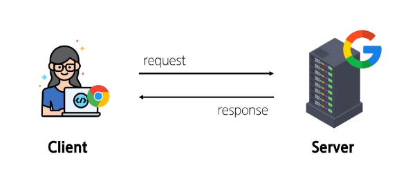
        1. 웹 브라우저(클라이언트)에서 `google.com`을 입력
        2. 브라우저는 인터넷에 연결된 전세계 어딘 가에 있는 구글 컴퓨터(서버)에게 `google 홈페이지.html` 파일을 달라고 **요청**
        3. 요청받은 구글 컴퓨터는 데이터베이스에서 `google 홈페이지.html` 파일을 찾아 **응답**
        4. 전달받은 `google 홈페이지.html` 파일을 사람이 볼 수 있도록 웹 브라우저가 해석해주면서, 사용자는 구글의 메인 페이지를 보게 됨


### Frontend & Backend
- Frontend (프론트엔드)
    - 사용자 인터페이스(UI)를 구성하고, 사용자가 애플리케이션과 상호작용할 수 있도록 함
    - HTML, CSS, JavaScript, 프론트엔드 프레임워크 등

- Backend (백엔드)
    - 서버 측에서 동작하며, 클라이언트 요청에 대한 처리와 데이터베이스와의 상호작용 등을 담당
    - 서버 언어(python, java 등) 및 벡엔드 프레임워크, 데이터베이스, API, 보안 등

※ 프론트엔드 != 디자이너

-> 클라이언트(요청의 주체) 즉, 크롬 브라우저 상에서 내 화면을 보고 서비스를 요청보낼 수 있는 쪽이 '어떻게 서버로 요청 보내도록 하는지?'에 대한 것들을 비개발자까지 누구든지 사용할 수 있도록 해야함

-> 또한 클라이언트 측은 요청해서 응답받은 데이터를 화면에 랜더링할 수 있어야 함

-> 그러려면 서버에 요청 보내는 방법, 응답받은 데이터를 어떻게 처리할지 알아야 하는데, 그것을 개발하는 것이 프론트엔드!!


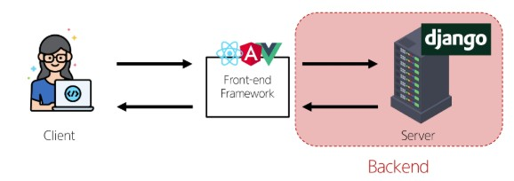

-> 클라이언트에서 요청이 단순히 브라우저 상에서 벌어지는 html 문서로 끝나는게 아니라, 서버로 어떻게 요청할 것인지, 응답은 받아와서 어떻게 화면에 보여줄 것인가에 대한 것이 중요해지다보니 프론트 직군이 분화되어 나왔음

-> 이번 시간에는 사용자 요청을 보냈을 때 응답을 받는 서버측에 집중해보자


## Web Framework
웹 애플리케이션을 빠르게 개발할 수 있도록 도와주는 도구

-> 개발에 필요한 기본 구조, 규칙, 라이브러리 등을 제공

### Django framework
Python 기반의 대표적인 웹 프레임워크( 개발에 사용)

- Django 사용 이유
    1. 다양성
        - python 기반으로 소셜 미디어 및 빅데이터 관리 등 광범위한 서비스 개발에 적합
    2. 확장성
        - 대량의 데이터에 대해 빠르고 유연하게 확장할 수 있는 기능을 제공
    3. 보안
        - 취약점으로부터 보호하는 보안 기능이 기본적으로 내장되어 있음
    4. 커뮤니티 지원
        - 개발자를 위한 지원, 문서 및 업데이트를 제공하는 활성화 된 커뮤니티

- 가장 인기있는 Backend Framework
    - `Laravel`
    - **`Django`**
    - `Spring`
    - `Flask`
    - `Express JS`
    
※ Django를 사용해서 서버를 구현할 것임


### 가상 환경
Python 애플리케이션과 그에 따른 패키지들을 격리하여 관리할 수 있는 **독립적인** 실행 환경

- 가상 환경이 필요한 시나리오1
    ```Markdown
    1. 한 개발자가 2개의 프로젝트(A, B)를 진행해야 함
    2. 프로젝트 A는 requests 패키지 버전1을 사용해야 함
    3. 프로젝트 B는 requests 패키지 버전2를 사용해야 함
    4. 하지만 파이썬 환경에서 패키지는 1개의 버전만 존재할 수 있음
    5. A와 B 프로젝트의 다른 패키지 버전 사용을 위한 **독립적인 개발 환경**이 필요함
    ```
    - 각 버전마다 의존하고 있는 다른 버전, 또는 그 환경에서만 호환되는 패키지가 있는 등의 복잡한 관계 존재
    - 항상 최신 버전으로 사용하는 것이 아니라, 위에 말한 관계를 생각했을 때 특정 버전을 명시하고 사용할 필요가 있음

- 가상 환경이 필요한 시나리오2
    ```Markdown
    1. 한 개발자가 2개의 프로젝트(A, B)를 진행해야 함
    2. 프로젝트 A는 water라는 패키지 사용해야 함
    3. 프로젝트 B는 fire라는 패키지 사용해야 함
    4. 하지만 파이썬 환경에서 두 패키지를 함께 사용하면 충돌이 발생하기 때문에 설치할 수 없음
    5. A와 B 프로젝트의 패키지 충돌을 피하기 위해 각각 **독립적인 개발 환경**이 필요함
    ```

- 환경 구조 예시

    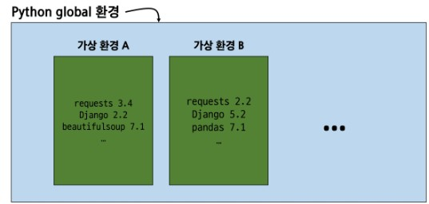

1. 가상환경 설정
    - 바탕화면에 폴더 만듦 `First_project` (바탕화면 아니어도 편한곳에 만들기)
    - 그 폴더 환경에 git bash 열기
    - `pip list` : 현재 환경에 설치된 패키지 목록 확인(현재 많은 리스트 나오는거 확인됨)
        - 패키지 목록은 팀원들끼리 공유해야 함
        - 각자의 가상 환경 상황 공유 필수
    - 가상환경 만들기
        - `python -m venv folder_name` 
        - `python -m venv venv` -> 보통 venv 이름으로 가상환경 만듦
    - 가상환경 활성화
        - `source venv/Scripts/activate`
        - 가상환경 활성화 시킴으로써 사용할 수 있는 상태로 만들기
        - 이제부터 실행시키는 명령어는 가상환경에서 실행됨
    - 다시 pip list하면 아무것도 안나옴(가상환경 만들었으니까)

※ 의존성 패키지: 한 소프트웨어 패키지가 다른 패키지의 기능이나 코드를 이용하여 그 패키지가 존재해야만 제대로 작동하는 관계

-> ex. requests 설치하면 1개만 설치되는 것이 아니라, 다른 패키지도 같이 설치됨

2. 깃 관리에 가상환경은 배제시키자
    - `code .gitignore` -> vscode로 내 폴더에서 .gitignore 파일 열기
    - 파일에다가 gitignore.io 거기서 뭐 직접 추가해도 되는데
    - 우리는 직접 추가하지 않고 일단 venv 폴더만 추가 -> `venv/` 입력
    - 이로써 venv에 대한 변동사항은 깃이 신경쓰지 않음
    - 깃 관리에 가상환경 배제시키는 이유
        - 만약 venv에서 일어나는 변동사항을 깃이 관리하게 되면 .. 어케될까용
        - 때문에 깃으로 venv 관리 안되게 만들자~!!

3. `.gitignore.py`에서 터미널 열고 활성화
    - bash에서 가상환경 활성화 한거랑 vscode에서 가상환경 활성화 한거랑 따로임!
        - vscode에서도 활성화 해주자
        - 항상 가상환경 활성화 됐는지 확인
    - 현재 vscode 터미널 상태
        ```bash
        SSAFY@DESKTOP-763H707 MINGW64 ~/Desktop/First_project
        $ source venv/Scripts/activate
        (venv)
        ```

3. `pip install django`
    - 가상환경 폴더에 장고 설치
    - 똑같이 장고 설치했지만 매번 버전이 다름 -> 버전 고정시키자!

4. `pip freeze > requirements.txt`
    - 의존성 패키지 목록 생성
    - 즉, 가상환경에 설치했던 패키지 목록들의 버전을 txt 파일에 얼려놓음
        - 종속되어 함께 설치된 패키지의 버전까지 들어감
    - 얘네는 gitlab 또는 github에 올림
    - 다른 곳에서 설치할 때 txt 파일에 있는 목록대로 설치 가능!
    - `pip install -r requirements.txt`
        - 목록 읽어서 설치해라는 명령어
        - 실습 시 글로벌에 설치하지 말고 모든 레포지토리에 목록 읽혀서 설치하기(각각 반복해서 입력)

※ 프로젝트 시작하면 `venv 가상환경 폴더` -> `.gitgnore.py` , `requirements.txt` , `.git폴더` 한 세트로 만들어놓고 진행하자


### Django 프로젝트
- Django 프로젝트 생성 전 루틴

    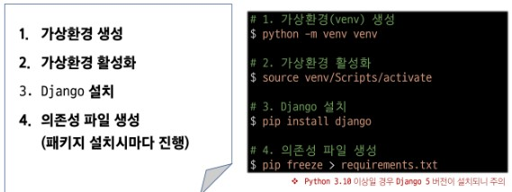

- Django 프로젝트 생성
    - `django-admin startproject first_pjt .`
    - 장고의 관리자에게(django-admin) 프로젝트 시작해달라고 시킬건데(startproject) first_pjt라는 이름의 프로젝트를 현재 폴더에(.) 만들어 줘
        - `django-admin startproject` : 명령어
        - `first_pjt` : 프로젝트 이름
        - `.` : 현재 폴더

- Django 서버 실행
    - `python manage.py runserver`
        ```bash
        August 11, 2025 - 14:38:00
        Django version 5.2.5, using settings 'First_project.settings'
        Starting development server at http://127.0.0.1:8000/
        Quit the server with CTRL-BREAK.
        ```
        - manage.py와 동일한 경로에서 진행
        - 주소 창 들어가기 `ctrl + click` -> 서버 확인
        - 장고 웹 서비스 준비 끗.
    - 서버 끌 때는 터미널에 `ctrl + c`


### Django Design Pattern
- 디자인 패턴
    - 소프트웨어 설계에서 발생하는 문제를 해결하기 위한 일반적인 해결책
    - 공통적인 문제를 해결하는 데 쓰이는 형식화된 관행
    - 즉, '애플리케이션의 구조는 이렇게 구성하자'라는 관행

- MVC 디자인 패턴
    - `Model` , `View` , `Controller`
    - 애플리케이션을 구조화하는 대표적인 패턴
    - `데이터` & `사용자 인터페이스` & `비즈니스 로직`을 분리
        - 시각적 요소와 뒤에서 실행되는 로직을 서로 영향 없이, 독립적이고 쉽게 유지 보수할 수 있는 애플리케이션을 만들기 위함

- MTV 디자인 패턴
    - `Model` , `Template` , `View`
    - Django에서 애플리케이션을 구조화하는 패턴
    - 기존 MVC 패턴과 동일함(명칭만 다르게 정의)
        - `View` -> `Template`
        - `Controller` -> `View`
    - 클라이언트 측에서는 사용자가 바라볼 화면이니까 view라고 부르는데, 장고 입장에서는 개발하는 사람한테 초점을 맞춰서 명칭 정의힘

- Project & App

    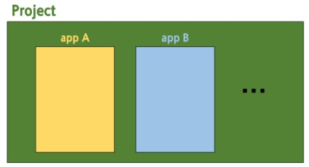
    - Django project
        - 애플리케이션의 집합
        - DB 설정, URL 연결, 전체 앱 설정 등을 처리
    
    - Django application
        - 독립적으로 작동하는 기능 단위 모듈
        - 각자 특정한 기능을 담당하며 다른 앱들과 함께 하나의 프로젝트를 구성
    
    - ex. 만약 온라인 커뮤니티 카페를 만든다면?
        - 프로젝트: 카페(전체 설정 담당. 위에서 명령어 쳐서 만든거)
        - 앱: 게시글, 댓글, 회원 관리 등(DB, 인증, 화면)

    - 앱 사용 순서
        1. 앱 생성
            - `python manage.py startapp articles`
            - 매니저야! 어플리케이션 만들건데, 이름은 articles라고 할게
            - 앱 이름은 **복수형**으로 지정하는 것을 권장

        2. 앱 등록
            - 어디에? 내 프로젝트에 대한 설정 파일에!
            - `first_pjt - settings.py`에 등록!
                ```python
                INSTALLED_APPS = [
                    'articles'  # 여기 적어서 등록하자
                    'django.contrib.admin',
                    'django.contrib.auth',
                    'django.contrib.contenttypes',
                    'django.contrib.sessions',
                    'django.contrib.messages',
                    'django.contrib.staticfiles',
                ]
                ```
            - 'articles' 추가함
            - 이로써 first_pjt라는 프로젝트에서 articles 어플리케이션 사용할 준비 완료
            - 반드시 앱 생성 후 등록!!(등록 후 생성은 불가능)
    

    - 프로젝트 구조

        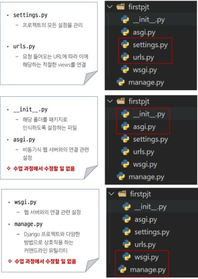

    - 앱 구조

        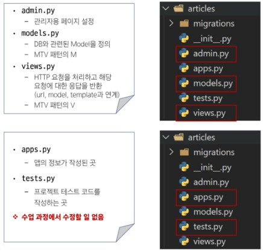


## REST API
### API (Application Programming Interface)
두 소프트웨어가 서로 통신할 수 있게 하는 메커니즘

- 클라이언트 - 서버처럼 서로 다른 프로그램에서 **요청과 응답**을 받을 수 있도록 만든 체계

- API 예시
    - 기상 데이터가 들어있는 기상청의 시스템
        - 스마트폰 날씨 앱, 웹사이트 날씨 정보 등 다양한 서비스들이 기상청 시스템으로부터 데이터를 **요청해서 받아 감**
        - 날씨 데이터를 얻기 위해선 기상청 시스템에 정보들을 요청하는 지정된 형식이 있음 ex. 지역, 날짜, 온도 등을 제공하는 메뉴얼
        - "이렇게 요청을 보내면, 이렇게 정보를 제공해 줄 것이다"라는 매뉴얼
        - 이때, 소프트웨어 간 지정된 정의(형식)으로 소통하는 수단 -> `API`
    
- API 역할
    - 내가 사용려는 데이터를 직접 만드는 것이 아니라, 남들이 만들어 놨던 기능을 매커니즘을 통해 받아오는 것

### Web API
웹 서버 또는 웹 브라우저를 위한 API

- 현대 웹 개발은 하나부터 열까지 직접 개발보다는 여러 Open API들을 활용하는 추세

- 대표적인 Third Party Open API 서비스 목록
    - Youtube API
    - Google Map API
    - Naver Papago API
    - Kakao Map API
    - 등등

### REST (Representational State Transfer)
API Server를 개발하기 위한 일종의 소프트웨어 설계 "방법론"

- API Sever를 설계하는 구조가 각자 다르니, 맞춰서 설계하자

### RESTful API
REST 원리를 따르는 시스템을 RESTful 하다고 부름

- **자원을 정의**하고 **자원에 대한 주소를 지정**하는 전반적인 방법을 서술
    - 요청 보내려면 요청 보낼 위치를 어떻게 지정하는지가 중요
    - 응답 해줄 데이터(자원)가 어떤 형식인지도 중요
    - 이에 대한 방법을 서술함

- 각각 API 서버 구조를 작성하는 모습이 너무 다르니, 어느정도 약속을 만들어서 다같이 API 서버를 구성하자

### REST API
REST라는 설계 디자인 약속을 지켜 구현한 API

- REST에서 자원을 사용하는 법 3가지
    1. 자원의 식별 (어디에 있는지 식별)
        - URI
    2. 자원의 행위 (어떤 동작을 수행할지 명시)
        - HTTP Methods
    3. 자원의 표현 (어떤 양식으로 표현할 것인지)
        - JSON 데이터
    
- 자원의 식별
    - URI (Uniform Resource Identifier, 통합 자원 식별자)
        - 인터넷에서 리소스(자원)를 식별하는 문자열
        - 가장 일반적인 URL는 웹 주소로 알려진 URL    
    
    - URL (Uniform Resource Locator, 통합 자원 위치)
        - 웹에서 주어진 리소스의 주소
        - 네트워크 상에 리소스가 어디 있는지를 알려주기 위한 약속

        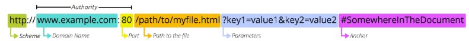
        1. Schema (or Protocol)
            - 브라우저가 리소스를 요청하는 데 사용해야 하는 규약
            - URL의 첫 부분은 브라우저가 어떤 규약을 사용하는지를 나타냄
            - 기본적으로 웹은 `http(s)`를 요구

        2. Domain Name
            - 요청 중인 웹 서버를 나타냄
            - 어떤 웹 서버가 요구되는 지를 가리키며 직접 IP 주소를 사요하는 것도 가능하지만, 사람이 외우기 어려우므로 주로 Domain Name으로 사용
            - ex. 도메인 google.com의 IP 주소는 142.251.42.142

        3. Port
            - 웹 서버의 리소스에 접근하는 데 사용되는 기술적인 문(Gate)
            - HTTP 프로토콜의 표준 포트
                - `HTTP - 80`
                - `HTTPS - 443`
            - 표준 포트만 작성 시 생략 가능
            - 장고에서 쓰는 표준 포트는 8000

        4. Path
            - 웹 서버의 리소스 경로
            - 초기에는 실제 파일이 위치한 물리적 위치를 나타냈지만, 지금은 실제 위치가 아닌 추상화된 형태의 구조를 표현
            - ex. /articles/create/라는 주소는 실제 articles 폴더 안에 create 폴더 안을 나타내는 것XX

        5. Parameters
            - 웹 서버에 제공되는 추가적인 데이터
            - `&` 기호로 구분되는 **key-value** 쌍 목록
            - 서버는 리소스 응답 전 이러한 파라미터를 사용하여 추가 작업을 수행할 수 있음

        6. Anchor 
            - 일종의 '북마크'
            - 브라우저에 해당 지점에 있는 콘텐츠를 표시함
            - 부분 식별자(fragment identifier)인 `#` 이후 부분은 서버에 전달되지 않음
            - 스크롤바 내린 위치 찍어서 해당 지점으로 이동할 수 있도록 하는거!


- 자원의 행위
    - HTTP Request Methods
        - 리소스에 대한 행위(수행하고자 하는 동작)를 정의
        - HTTP verbs 라고도 함
    
    - 대표 HTTP Request Methods
        1. `GET`
            - 서버에 리소스의 표현을 요청
            - GET을 사용하는 요청은 데이터만 검색해야 함
        2. `POST`
            - 데이터를 지정된 리소스에 제출
            - 서버의 상태를 변경
        3. `PUT` / `PATCH`
            - 요청한 주소의 리소스를 수정
        4. `DELETE`
            - 지정한 리소스 삭제


    - HTTP response status codes
        - 특정 HTTP 요청이 성공적으로 완료되었는지 여부를 나타냄

        - 5개의 응답 그룹
            1. Informational responses (100 - 199)
            2. Successful responses **(200 - 299)**
            3. Redirection messages (300 - 399)
            4. Client error responses **(400 - 499)**
            5. Server error responses **(500 - 599)**
        
        - 응답코드를 `2XX` 보냈다 -> 너 잘 요청했고, 나 잘 응답했어 -> 즉, 성공
        - 응답코드를 `4XX` 보냈다 -> 니가 이상한 곳에 요청했고, 권한 없고, 니 누군데;; -> 즉, 클라이언트 측이 잘못했을 때
        - 응답코드를 `5XX` 보냈다 -> 내(서버)가 잘못했졍.. -> 즉, 서버 측이 잘못했을 때

※ RESTful하게 만들고자 한다면 status code를 잘 보내주기만 해도 디버깅을 잘할 수 있음!

- 자원의 표현
    - 현재 Django가 응답(자원을 표현)하는 것
        - Django는 Full Stack Framework에 속하기 때문에 기본적으로 사용자에게 페이지(html)를 응답함
        - 하지만 서버가 응답할 수 있는 것은 페이지 뿐만 아니라 다양한 데이터 타입을 응답할 수 있음
        - REST API는 이 중에서도 **JSON** 타입으로 응답하는 것을 권장
    
    - 응답 데이터 타입의 변화
        1. 페이지(html)만을 응답했던 서버
            
            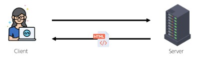
        2. 이제는 JSON 데이터를 응답하는 REST API 서버로의 변환

            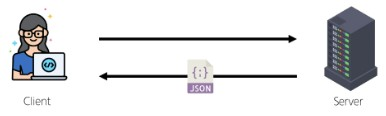
            - 소프트웨어 측에서 다 랜더링된 html을 보내는 것보단
            - 데이터를 가지고 내가 무언가를 구성하기 위해 따로 만들거라 JSON 형태로 보내오는 쪽이 우리가 개발하기 편해짐
        3. Django는 더이상 Template 부분에 대한 역할을 담당하지 않게 되며, 본격적으로 front-end와 back-end가 분리되어 구성됨

            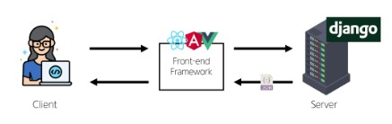
            - JSON을 view가 받아올 것임
            - 브라우저에서 뭔가 클릭을 하면 -> javascript로 서버 요청 보냄 -> 서버는 JSON을 view에게 보냄 -> view는 그것을 가지고 화면 만들어서 보여줌
        4. 이제부터 Django를 사용해 RESTful API 서버를 구축할 것임

            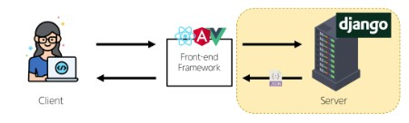

※ 사용자가 ① 어디로 ② 어떻게 요청을 보낼 것인지, 이때 ③ 무엇을 응답해 줄 것인지가 중요하다


## 요청과 응답
### DRF (Django REST Framework)
Django에서 Restful API 서버를 쉽게 구축할 수 있도록 도와주는 오픈소스 라이브러리

※ Django REST Framework 공식문서 꼭 참고하기

- 사전 준비1 (아까 한거)
    1. 가상환경(venv) 생성
    2. 가상환경 활성화
    3. Django 설치

- 사전 준비2
    1. Django 설치2
        - `pip install djangorestframework`
    2. settings.py 수정
        ```python
        INSTALLED_APPS = [
            # local app
            'articles'  

            # third part library
            "rest_framework",

            # django core
            'django.contrib.admin',
            'django.contrib.auth',
            'django.contrib.contenttypes',
            'django.contrib.sessions',
            'django.contrib.messages',
            'django.contrib.staticfiles',
        ]
        ```
        - 보통 주석 위치에 해당 코드들 작성함

        
    3. 의존성 파일 생성
        - `pip freeze > requirements.txt`
        - 이것도 버전 txt파일에 추가해줘야 함

※ freeze는 언제하냐 -> pip install 할때마다 하기


### Django URLs
- Django와 요청 & 응답

    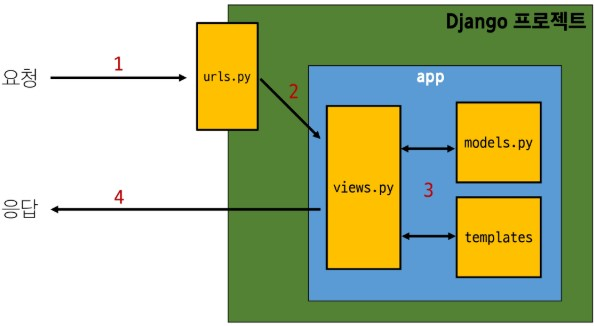
    - 요청과 응답 과정
        - 사용자가 어디로 요청 보낼 것인지 정의(urls.py)
        - 요청에 대한 응답을 할 수 있는 로직 작성(view.py)
        - 그 과정에서 만약 DB에 있는 데이터를 필요로 한다면 model을 거쳤다 올것임

    - ex. data의 조회 요청을 보내고 그 데이터에 대한 JSON 파일이 응답되도록 할 때
        - 어디로 요청 받을지 **식별**
        - 사용자가 무슨 요청을 보냈는지 알아야 하니 **행위**에 대한 코드 작성
        - 사용자의 조회 요청에 맞는 응답에 해당하는 코드 작성 -> **표현**
        - 이 순서로 작성!!!(외워)
    
            ### 1. 식별 -> 2. 행위 -> 3. 표현
    

- 요청과 응답에서 Django URLs의 역할

    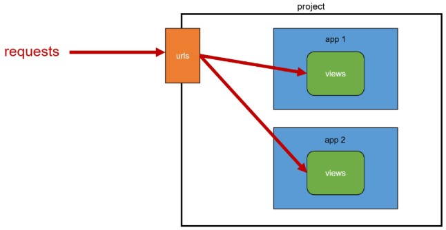

- URL dispatcher (운항 관리자, 분배기)
    - URL 패턴을 정의하고, 해당 패턴이 일치하는 요청을 처리할 view 함수들을 연결(매핑)

### Django와 요청 & 응답 코드
1. URLs (식별)

    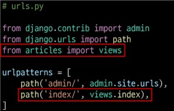
    ```python
    from django.contrib import admin
    from django.urls import path

    # articles app이 가지고 있는 views 모듈
    from articles import views

    urlpatterns = [
        path('admin/', admin.site.urls),

        # 사용자가 index라는 경로로 요청을 보내면
            # 경로는 항상 문자열 형태의 상대 경로로 입력
        # views에 있는 index 함수를 실행시킨다
        path('index/', views.index),
    ]
    ```

    

    - `http://127.0.0.1:8000/index/`로 요청이 왔을 때 views 모듈의 view 함수 index를 호출
    - `articles` 패키지에서 `views` 모듈 가져오는 것
    - url 경로는 반드시 `/` 로 끝나야 함

2. View (행위)

    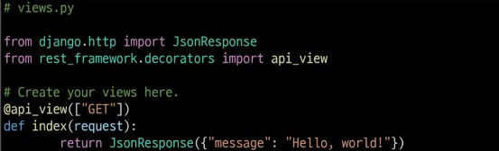
    - JSON 응답 객체를 반환하는 index view 함수 정의

    - 모든 view 함수는 첫번째 인자로 request 요청 객체를 필수적으로 받음

    - 매개변수 이름이 request가 아니어도 되지만, 그냥 request로 씀

    - `@api_view()`
        - DRF view 함수에서는 **필수 작성**, view 함수 실행 전 HTTP 메서드를 확인
        - 기본적으로 GET 메서드에만 허용되며 다른 메서드 요청에 대해서는 405 Method Not Allowed로 응답
        - DRF view 함수가 응답해야 하는 HTTP 메서드 목록을 작성

    - `JsonResponse()`
        - Django에 내장된 HTTP 응답 클래스
        - 첫번째 위치 인자로 JSON으로 변환 가능한 데이터를 받아와 응답 객체를 반환해줌
        - 필요시 http response의 응답 코드도 설정하여 반환 가능
    
        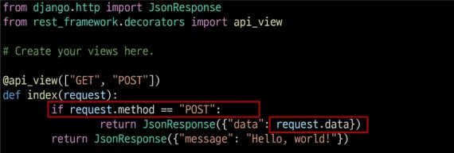
        - view 함수의 첫번째 인자는 request 또는 httpRequest 객체를 받아옴
        - HTTP 메소드, 요청 데이터, 사용자 정보 등 request 객체를 활용하여 요청 데이터를 처리하고 적절한 응답 생성 가능
    
    - 현재 URL 관리의 문제점
        ```python
        urlpatterns = [
            path('article/1/', ...),
            path('article/2/', ...),
            path('article/3/', ...),
            ...
        ]
        ```
        - 템플릿의 많은 부분이 중복되고, URL의 일부만 변경되는 상황이라면?
        - article 뒤에 정수가 들어오면 그 번호에 대한 정보를 가지고 오고 싶다 -> Variable Routing
    
    - `Variable Routing`
        - URL 일부에 변수를 포함시키는 것
        - 변수는 view 함수의 인자로 전달할 수 있음
        - 즉, 변수 형식으로 경로를 지정하는 것
        - `<path_converter:variable_name>` 으로 작성
            ```python
            urlpatterns = [
                # Variable Routing
                # 정수만 허용
                path('article/<int:num>/', views.detail)
            ]
            ```
        - Path converters: URL 변수 타입 지정
    
    - 상황 예시
        ```python
        urlpatterns = [
            path('article/<int:article_pk>/', views.detail),
        ]
        ```
        - article 경로로 요청 보냈을 때 int 형태로 article_pk 변수에 사용자가 넣은 변수 값을 쓸 것임
        - 그래서 views함수를 쓸것임
        - 1번에 대한 GET 요청이 오면, detail 함수 정의할 때도 '행위가 GET인데 1번 게시글에 대한 정보를 표현하려니 urls.py의 article_pk에 정보가 들어있음'
        - 이것을 detail 함수에게 넘겨주고 싶다
        - 그럼 detail 함수 정의 시 article_pk 변수명 그대로 가져가야 함
        
    - 전체 코드(view.py)
        ```python
        from django.shortcuts import render
        
        # django가 가지고 있는 http에 따른 응답 방식(애를 써서 JSON으로 응답)
        from django.http import JsonResponse
        
        # RESTful한 API를 만들도록 해주는 famework
        from rest_framework.decorators import api_view

        # Create your views here.
        # 행위 -> RESTful API를 위한 것

        # GET 요청일 때만 아래 함수가 동작하도록 하고 싶어, 그렇게 함수를 꾸밀꺼야 -> 데코레이터
        # GET과 함께 POST도 쓰고 싶다면 리스트니까 두개 이상 입력 가능
        @api_view(['GET', 'POST'])
        def index(request):
            # 모든 view 함수는 첫번째 인자 request 고정
                # 물론 인자명 request는 다른 이름이어도 상관은 없지만
                # django의 가이드 상, request이므로, 다른 이름으로 적지않음

            # 이 함수가 할 일은?
            # 응답: JSON 형태로 Response -> {'message': 'Hello, Django!'}

            # request에는 사용자의 모든 요청과 관련된 정보가 들어있음
            # 사용자가 보낸 request 방법에 따라 조건 분기 가능
            if request.method == 'POST':
                return JsonResponse({'message': 'Hello, Django!'})
            elif request.method == 'GET':
                return JsonResponse({'message': 'Hello, Django!'})

        def detail(request, article_pk):
            # 원래는 여기서 model 거쳐서 실제 1번 게시글을 가져와야하는디
            # 지금은 모델이 없으니 그냥 반환
            data = {
                'id': article_pk,
                'message': f'{article_pk}번 게시글에 대한 정보입니다.'
            }
            return JsonResponse(data)
        ```

### App과 URL
- view 함수 이름이 같거나 같은 패턴의 URL 주소를 사용하는 경우
    ```python
    # articles app이 가지고 있는 views 모듈
    from articles import views
    from accounts import views
    
    urlpatterns = [
        path('index/', views.index),
    ] # 그럼 views는 article이 아니라 마지막에 선언한 accounts의 views가 됨
    ```
    - 이런 이슈로 프로젝트가 커지면 app마다 경로를 따로 관리!!
    - `include` 기능 사용하자

        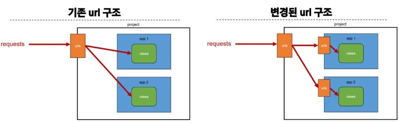
        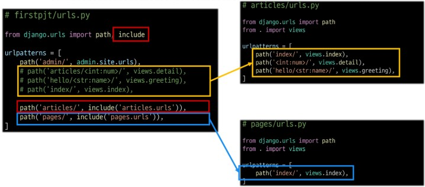

- `include()`
    - 프로젝트 내부 앱들의 URL을 참조할 수 있도록 매핑하는 함수
    - URL의 일치하는 부분까지 잘라내고, 남은 문자열 부분은 후속 처리를 위해 include된 URL로 전달

        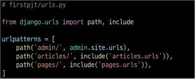
        - `path('article/', include('articles.urls')`: 이제부터 articles/ 라는 경로 요청이 오면, 이 요청들에 대해서는 articles 앱이 가진 urls가 처리한다는 의미
        - `'articles.urls'` : 위치 경로를 문자열로 표기한 것 -> 이 문자열을 가지고 모듈 urls를 찾으면 되는구나! -> 어딨는데? -> 만들면 됨
        - articles 폴더 안에 urls.py 파일 만들기

    - **articles/urls.py**
        ```python
        from django.urls import path
        
        # 나랑 같은 폴더의 views
        from . import views

        urlpatterns = [
            path('index/', views.index),
            path('<int:article_pk>/', views.detail),
        ]
        ```
        - index 경로로 요청 오면 현재 폴더에 있는 views가 가진 index 호출
        - `first_pjt/urls.py`에 'articles' 이미 표기해놨기 때문에, `articles/urls.py`에는 articles 생략해서 써도 됨
    

## 참고
- View 함수의 request
    - 클라이언트로부터 서버소 전달된 모든 정보를 포함하는 객체
    - request 객체는 Django의 HttpRequest 클래스를 기반으로 함

- Request 객체의 주요 구성 요소
    - Request 메서드 `request.method`
    - 요청 경로 `request.path`
    - GET 데이터 `request.GET`
        - URL 쿼리 스트링에 포함된 데이터
    - POST 데이터 `request.POST`
        - 폼 제출을 통해 전달된 데이터
    - 쿠키 데이터 `request.COOKIES`
        - 클라이언트에 저장된 쿠키
    - 세션 데이터 `request.session`
        - 서버에 저장된 사용자 세션 데이터
    
    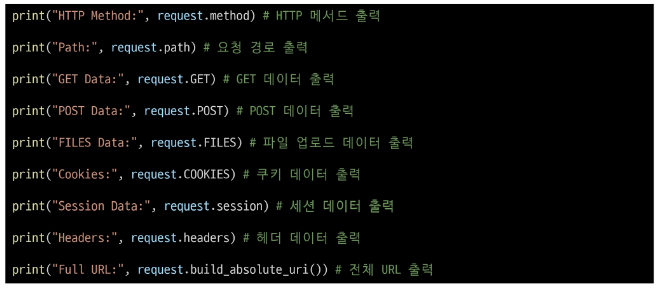

- MTV 디자인 패턴 정리
    - Model
        - 데이터와 관련된 로직을 관리
        - 응용 프로그램의 데이터 구조를 정의하고 데이터베이스의 기록을 관리
    - Template
        - 레이아웃과 화면을 처리
        - 화면상의 사용자 인터페이스 구조와 레이아웃을 정의
    - View
        - Model & Template과 관련한 로직을 처리해서 응답을 반환
        - 클라이언트 요청에 대해 처리를 분기하는 역할
    - View 예시
        - 데이터가 필요하다면 model에 접근해서 데이터를 가져오고,
        - 가져온 데이터를 template로 보내 화면을 구성하고,
        - 구성된 화면을 응답으로 만들어 클라이언트에게 반환
    
    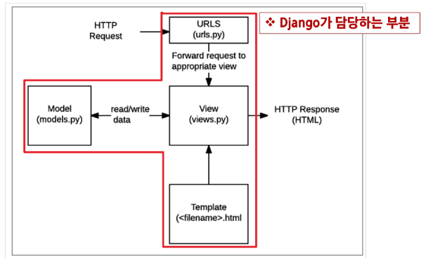

- render 함수
    - 주어진 템플릿을 주어진 컨텍스트 데이터와 결합하고 랜더링 된 텍스트와 함께 HttpResponse 응답 객체를 반환하는 함수
    
        `render(request, template_name, context)`
    1. `request`
        - 응답을 생성하는 데 사용되는 요청 객체
    2. `template_name`
        - 템플릿 이름의 경로
    3. `context`
        - 템플릿에서 사용할 데이터(딕셔너리 타입으로 작성)

- 지금까지 나온 Django 규칙
    1. urls.py에서 각 url 경로는 반드시 `/`로 끝남
    2. views.py에서 모든 view함수는 **첫번째 인자로 요청 객체**를 받음
        - 매개변수 이름은 반드시 request로 지정
    3. Django는 **정해진 경로**에 있는 template 파일만 읽어올 수 있음
        - app폴더/templates/ 이후

