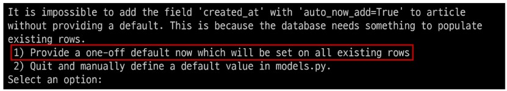
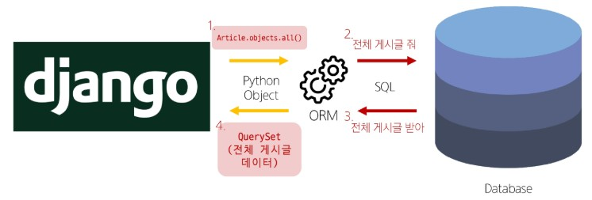

# Django Model & ORM
## Model
- Model을 통한 DB 관리를 배워보자

    
    - article(게시글)에서 title, content를 어디에 어떻게 저장할 것인가?

### Django Model
DB의 테이블을 정의하고 데이터를 조작할 수 있는 기능들을 제공

- 테이블 구조를 설계하는 '청사진(blueprint)'

- models.py에 클래스 정의해주면 됨
    ```python
    # articles/models.py

    class Article(models.Model):
        title = models.CharField(max_length=10)
        content = models.TextField()
    ```
    - 클래스를 만들어 줌으로써 어떤 게시글에 대한 테이블 `Article`을 만들 수 있게 됨
    - 제목과 내용을 `CharField`, `TextField`와 같은 문자열을 담을 수 있는 공간으로서 컬럼을 정의할 수 있음
    - `max_length=10`과 같은 제약사항도 제공

- 작성한 모델 클래스는 최종적으로 DB에 아래와 같은 테이블 구조를 만듦

    
    - DB에서 중요한 것은 id라 할 수 있음 -> 클래스에 직접 정의하지 않더라도 장고가 알아서 id 필드까지 생성해주기도 함
    - Django 모델 클래스에서 정의한 `title`, `content`와 같은 클래스 변수는 실제로는 `models.Field` 객체이고, Django가 이를 이용해 데이터베이스 테이블의 컬럼(필드)을 만듦
        - `title`, `content`는 `models.Field`의 인스턴스를 참조하는 클래스 속성

- `django.db.models` 모듈의 `Model` 이라는 부모 클래스를 상속받음

    
    - Model은 model에 관련된 모든 코드가 이미 작성되어 있는 클래스
    - 개발자는 가장 중요한 **테이블 구조를 어떻게 설계할지에 대한 코드만 작성하도록 하기 위한 것**(상속을 활용한 프레임워크의 기능 제공)
        - DB에서 데이터 조회, 생성, 수정, 삭제 등 요청과 관련된 메서드 등을 미리 정의해놓은 클래스를 상속받기만 하면 된다!

- model class
    
    
    1. `클래스 변수명`
        - 테이블의 각 **필드(열) 이름**
        - `title`, `content`

    2. `model Field` 클래스
        - 테이블 필드의 **데이터 타입**
        - `CharField`, `TextField`
        - 클래스 변수 명에 model Field 클래스를 할당해줌으로써 데이터 타입을 나타냄

    3. `model Field 클래스의 키워드 인자`(필드 옵션)
        - 테이블 필드의 **제약조건** 관련 설정
        - `max_length=10`

※ 제약 조건

-> 데이터가 올바르게 저장되고 관리되도록 하기 위한 규칙

-> ex. 숫자만 저장되도록, 문자가 100자까지만 저장되도록 하는 등


## Migrations
model 클래스의 변경사항(필드 생성, 수정 삭제 등)을 DB에 최종 반영하는 방법

- Migrations 과정

    
    - 클래스로 장고 내에서 사용할 객체를 정의 -> 그 객체는 설계도라 볼 수 있음
        - 진짜 설계도는 ERD라고 따로 있는데, ERD 기반으로 파이썬 사용할 수 있도록 클래스 정의해둘 것임
    - 클래스로 정의해둔 내용을 토대로 청사진만들 것임(makemigrations)
    - 청사진 내용을 토대로 DB에 테이블 생성(migrate)
    - django 프로젝트를 만든 순간부터 `manage.py` 파일이 만들어 졌었음(매니저 역할 하는 파일)
        - 모든 명령어는 앞으로 얘한테 시킬 예정
        - `makemigrations`, `migrate`도 여기에서 사용

- Migrations 핵심 명령어 2가지
    1. `python manage.py makemigrations`
        - model class를 기반으로 최종 설계도(migration) 작성

    2. `python manage.py migrate`
        - 최종 설계도를 DB에 전달하여 반영

- migrate 후 DB 내에 생성된 테이블 확인
    - 어디에, 어떻게, 무슨 이름의 테이블이 만들어 질까?
        - Article 모델 클래스로 만들어진 articles_article 테이블
        - 장고에서 쓰는 `SQLite3`는 MySQL처럼 서버가 돌아가는 것이 아니라, 파일 단위로 사용할 수 있음(`db.sqlite3`)
        - 이 파일 자체가 내 프로젝트를 위한 DB
        - 이 DB에는 테이블들이 여러개 있음
        - Article 클래스는 articles라는 어플리케이션 안에 있던 article 클래스라서 테이블 명이 articles_article로 만들어짐
        - 테이블 내부에 `id`, `title`, `content` 컬럼 확인 가능

            

### 추가 Migrations
※ 이미 생성된 테이블에 필드를 추가해야 한다면?

1. 추가 모델 필드 작성
    
    
    - 필드를 클래스 변수로서 속성만 추가해주면 됨
    - 제약사항 뿐만 아니라 추가적인 옵션도 달 수 있음
        - `auto_now_add=True` 추가된 시간을 DB에 넣어줌
        - `auto_now=True` 수정된 시간을 DB에 넣어줌
    - 보통 방금 생성한 클래스에 대해 곧바로 까먹은 필드 추가하기 보다는, 데이터가 이미 만들어진 상태로 작업을 하다가~ 뒤늦게 필드를 추가하는 경우가 발생함

2. 이미 기존 테이블이 존재하기 때문에 필드를 추가할 때 필드의 기본 값 설정이 필요

    
    - `python manage.py makemigrations`
    - 1번: 현재 대화를 유지하면서 직접 기본 값 입력하는 방법
    - 2번: 현재 대화에서 나간 후 `models.py`에 기본 값 관련 설정하는 방법

3. 추가하는 필드의 기본 값을 입력해야 하는 상황

    
    - 날짜 데이터이기 때문에(날짜는 어떻게 쓴다해도 시간은..?) 직접 입력하기 보다 Django가 제안하는 기본 값을 사용하는 것 권장
    - 아무것도 입력하지 않고 enter 누르면 Django가 제안하는 기본 값으로 설정됨
        - timezone: 시간 기준을 UTC로 할건지, 서울로 할건지 등을 정함

4. migrations 과정 종료 후 2번째 migration 파일이 생성됨을 확인

    
    - 기본적으로 청사진은 `migragions` 폴더에 파이썬 파일들이 쌓아지는 형태
    - 쌓여나가는 파일들은 지우는거 아님. 만약 지워야 한다면 0001, 0002처럼 넘버링된 파일들만 지울 수 있음(얘네가 내 명령어로 만들어진 청사진)
    - Django는 설계도를 쌓아가면서 추후 문제가 생겼을 시 복구하거나 되돌릴 수 있도록 함('git commit'과 유사)
    - 쌓아놓는 이유: 버전 관리..!

5. migrate 후 테이블 필드 변화 확인
    - `python manage.py migrate`

        
    

### 실습
1. `05_django/02_model_serializer/01-ORM` 에서 gitbash로 vscode 켜기(`code .`)
2. `$ python -m venv venv` 가상환경 만들기
3. `$ source venv/Scripts/activate` 가상환경 활성화
4. `$ pip install django` 가상환경에 장고 설치
    - `pip list`로 올바르게 가상환경 활성화 되어있는지 확인
5. `code .gitignore` .gitignore 파일 만들기
    - `venv/` , `db.sqlite3` 작성
    - 만약 `.gitignore`가 최상단 폴더에 있다면? 
    - 하단 프로젝트 모든 곳에서 동일하게 사용하는 범용적인 내용들(venv/ , db.sqlite3)을 위한 .gitignore는 따로 안만들어도 됨
    - 왜?! 항상 상대경로를 기준으로 하기 때문에 최상단 폴더의 안쪽에 있는 모든 venv, sqlit3은 전부 업로드가 되지 않음
    - 오로지 하단 프로젝트 하나만을 위해 만들어진 파일들을 깃으로 관리하고 싶지 않을 때! 최상단 .gitignore가 있지만 하단 프로젝트 폴더에도 .gitignore를 만들어야 함
6. 환경 세팅 다 했으면 전체 코드 슥 둘러보자
    - `config/settings.py` -> INSTALLED_APPS에 `"article"` app 등록되어 있는지 확인
        - 남의 코드 받아오더라도 내가 프로젝트 진행하는 것과 동일하게 진행해주는 것이 좋음
    - `config/urls.py` -> 기본으로 쓰인 admin 외에도, articles로 요청이 들어왔을 때 articles 어플리케이션의 urls로 연결이 되겠다는 내용이 주석처리 되어있음 -> articles에 urls.py가 있구나! -> 이런저런 주석들이 적혀있구나! 확인
    - `models.py`에는 클래스가 이미 정의되어 있는 상태
    - `migrations` 폴더에는 별도의 init이 된 내용이 없는 것 같다???

7. `1. model class 변경 2. makemigrations -> 3. migrate` 진행해보자!
    - 내 프로젝트 입장에서는 Article 클래스가 새롭게 만들어진 것으로 인식됨. 왜? 이 클래스에 대한 어떠한 설계도도 없기 때문
    - `python manage.py`로 내가 manage.py가 있는 곳에서 작업중인게 맞는지도 확인
    - `python manage.py makemigrations` 설계도 생성
        - Article 모델 추가됨
        - magrations 폴더에 `0001_initial.py` 설계도 만들어진 것 확인됨
    - `python manage.py migrate` -> `db.sqlite3` 추가된 것 확인된
    - DB파일에 클래스가 추가된 것이 보고싶다면?
        - Database client -> `+` 버튼 -> SQLite -> Path에 `05_django/02_model_serializer/01-ORM`로 가서 All Files 보게 해서 `db.sqlite3` 선택 -> `+content` -> articles_article 만들어진 것 확인됨
    
8. 필드 추가(models.py에 아래 내용 작성)
    ```python
    created_at = models.DateTimeField(auto_now_add=True)
    updated_at = models.DateTimeField(auto_now=True)
    ```
    - 다시 `python manage.py makemigrations` -> 1번 -> enter -> 필드 추가됨을 확인할 수 있음
        ```
        articles\migrations\0002_article_created_at_article_updated_at.py
            + Add field created_at to article
            + Add field updated_at to article
        ```
        - migrations 폴더에 `0002_article_created_at_...` 파일을 보면 ADDField 추가된거 확인 가능
    - `python manage.py migrate` -> 내 DB에 추가된 정보 확인 가능

※ model class에 변경사항(1)이 생겼다면, 반드시 새로운 설계도를 생성(2)하고, 이를 DB에 반영(3)해야 함

-> 1. model class 변경 2. makemigrations -> 3. migrate

### Model Field
DB 테이블의 **필드(열)**을 정의하며, 해당 필드에 저장되는 **데이터 타입**과 **제약조건**을 정의

- `CharField()`
    - 길이의 제한이 있는 문자열을 넣을 때 사용
    - 필드의 최대 길이를 결정하는 max_length는 필수 인자

- `TextField()`
    - 글자의 수가 많을 때 사용

- `DateTimeField()`
    - 날짜와 시간 넣을 때 사용


## Admin site
### Automatic admin interface
Django는 추가 설치 및 설정 없이 자동으로 관리자 인터페이스를 제공

-> 데이터 확인 및 테스트 등을 진행하는데 매우 유용

1. admin 계정 생성
    - `python manage.py createsuperuser`
    - email은 선택사항이므로 입력하지 않고 진행 가능
    - 비밀번호 입력 시 보안상 터미널에 출력되지 않으니 무시하고 입력 이어가기

2. DB에 생성된 admin 계정 확인

    
3. admin에 모델 클래스 등록
    - `admin.py`에 작성한 모델 클래스 등록해야만 admin site에서 확인 가능

        
4. admin site 로그인 후 등록된 모델 클래스 확인

    
5. 데이터 생성, 수정, 삭제 테스트

    
6. 테이블 확인

    


## ORM (★★★)
### Object-Relational-Mapping
객체지향 프로그래밍 언어를 사용하여 호환되지 않는 유형의 시스템 간에 데이터를 변환하는 기술

-> 프로그래밍 언어가 아닌(파이썬이 아닌) 시스템과의 데이터를 변환하는 기술

- ORM 역할
    - 사용하는 언어가 다르기 때문에 소통 불가
    - 장고에 파이썬 객체 쓰면 SQL로 바꿔줌(QuerySet API 써서)
    - Django에 내장된 ORM이 중간에서 이를 해석!!

        
    

### QuerySet API
ORM에서 데이터를 검색, 필터링, 정렬 및 그룹화 하는 데 사용하는 도구

-> API를 사용하여 SQL이 아닌 Python 코드로 데이터 처리

-> 파이썬 언어를 사용해서 상대측에서 정해놓은 양식에 맞춰 코드 잘 작성해주면 ORM을 통해 SQL을 보내고 받아올 수 있도록 함


- QuerySet API 구문

    
    - `Article` : 내가 정의해놨던 클래스
    - `objects` : Article이 가지고 있는 속성(상속받아서 쓸 수 있는 객체임)
    - `all()`: Queryset API 메서드
        - Article에 대한 전체 정보를 받아올 수 있음
    - 직역하면 됨! Article 객체의 모든 내용 == 전체 조회 == 게시글 객체들 전부 (내놔라)
    - manager가 구문에서 필요한 이유
        - 우리가 다루는 데이터는 대체로 '관계형 데이터베이스'를 다룰 것임
        - 게시글이 독립적으로 존재하지XX. 작성자나 댓글 등에 관련되어 있음
        - objects 안쓰면 작성자를 달라는건지 댓글 달라는건지 모름
        - manager의 역할은 게시글에 대한 모든 '객체들의' 정보를 가져오라고 지정해주는 것

- QuerySet API 구문 예시

    

- `Query`
    - DB에 특정 데이터를 보여달라는 요청
    - "쿼리문을 작성한다" == 원하는 데이터를 얻기 위해 DB에 요청을 보낼 코드를 작성한다
    - 파이썬으로 작성된 코드가 ORM에 의해 SQL로 변환되어 데이터베이스에 전달되며, DB의 응답 데이터를 ORM이 QuerySet이라는 자료 형태로 변환하여 우리에게 전달

- `QuerySet`
    - DB에게서 전달받은 객체 목록(데이터 모음)
        - 순회가 가능한 데이터로써 1개 이상의 데이터를 불러와 사용할 수 있음
    - Django ORM을 통해 만들어진 자료형
    - 단, DB가 단일한 객체를 반환할 때는 QuerySet이 아닌 모델(Class)의 인스턴스로 반환됨

**※ QuerySet API는 python의 모델 클래스와 인스턴스를 활용해 DB에 데이터를 저장, 조회, 수정, 삭제하는 것**

### QuerySet API 실습
1. Postman 설치
    - API를 구축하고 사용하기 위한 플랫폼
    - API를 빠르게 만들 수 있는 여러 도구 및 기능을 제공
    - 설치 후 로그인 해서 Workspaces - MyWorkspace
    - Postman 화면 구성

        

2. URL과 HTTP requests methods 설계
    

3. 스켈레톤 프로젝트
    - 스켈레톤은 계속 바뀔 것임. 읽어보셍

    
    
    

    

    


### QuerySet API 실습 - Create
데이터 객체를 만드는(생성하는) 3가지 방법

1. 첫번째 방법

    

    

    

2. 두번째 방법
    - save 메서드를 호출해야 비로소 DB에 데이터가 저장됨
    - 테이블에 한 줄(행, 레코드)이 쓰여진 것

    

3. 세번째 방법
    - QuerySet API 중 `create()` 메서드 활용

    

※ `save()` : 객체를 데이터베이스에 저장하는 메서드

### QuerySet API 실습 - Read
- 대표적인 조회 메서드
    - Return new QuerySets
        - `all()`
        - `filter()`
    - Do not return QuerySets
        - `get()`

- `all()`
    - 전체 데이터 조회

        

- `filter()`
    - 특정 조건 데이터 조회
        
        

- `get()`
    - 단일 데이터 조회

        

    - get() 특징
        - 객체를 찾을 수 없으면 **DoesNotExist** 예외를 발생시킴
        - 둘 이상의 객체를 찾으면 **MultipleOjectsReturned** 예외를 발생시킴
        - 이런 특징으로 인해 **primary key 와 같이 고유성(uniqueness)을 보장하는 조회에서 사용**해야 함

### QuerySet API 실습 - Update
- 데이터 수정
    - 인스턴스 변수 변경 후 save 메서드 호출

        

### QuerySet API 실습 - Delete
- 데이터 삭제
    - 삭제하려는 데이터 조회 후 delete 메서드 호출

        


### 실습 (Create만)
※ `05_Django > 02_model_serializer > 01-ORM 폴더`

1. articles/urls.py에서 게시글 생성 요청을 보낼 경로 필요함 -> config/urls.py에서 작성
    ```python
    # articles/urls.py
    from django.urls import path
    from . import views

    urlpatterns = [
        path('new/', views.article_create),
        # path("list/", views.article_list),
        # path("<int:pk>/", views.article_detail),
        # path("<int:pk>/edit/", views.article_update),
        # path("<int:pk>/delete/", views.article_delete),
    ] 
    ```
    ```python
    # config/url.py
    from django.contrib import admin
    from django.urls import path, include

    urlpatterns = [
        path("admin/", admin.site.urls),
        # 요청이 articles/로 시작하면 뒤로 이어지는 URL path는 articles/urls.py에서 처리하도록 설정
        path("articles/", include("articles.urls")),   
    ]
    ```
    - config/urls.py에서의 `path("articles/", include("articles.urls"))` -> articles로 시작하는 모든 요청을 articles 앱의 urls.py로 넘겨 처리할 수 있도록 경로를 만드는 것
    - articles/urls.py에서의 `path('new/', views.article_create)` -> articles의 new라는 곳으로 요청을 보내면 article_create 함수가 동작하도록 만들 것임

2. 어떤 형식으로 게시글을 생성할 것인가? (생성!!)
    ```python
    # articles/views.py
    from django.http import JsonResponse
    from rest_framework.decorators import api_view
    from rest_framework import status
    from .models import Article

    @api_view(['POST'])
    def article_create(request):
        # 데이터 객체를 만드는(생성하는) 첫번째 방법
        article = Article() 
        
        article.title = request.data.get('title') 
        article.content = request.data.get('content')
        
        # 데이터 객체를 만드는(생성하는) 두번째 방법
        # article = Article(title=request.data.get('title'), content=request.data.get('content'))
        
        article.save() # 데이터베이스에 저장
        
        # 데이터베이스에 저장하는 세번째 방법  -> 위 두 방법과 달리 객체 생성과 동시에 데이터베이스에 저장됨
        # Article.objects.create(title=request.data.get('title'), content=request.data.get('content'))
        
        # 반환값으로 article.id와 status.HTTP_201_CREATED를 응답 코드로 반환
        return JsonResponse({'id': article.id}, status=status.HTTP_201_CREATED)
    ```
    - article = Article() 의 `Article` -> models.py에서 정의한 Artice class를 가지고 와서 쓰겠다!
        - 어떻게 가지고 오냐? `from .models import Article`
    - Article 클래스에서 정의한 변수인 title, content에 값을 넣을 것임
        - `article = Article()` : Article 클래스로 만든 인스턴스 article
        - `article.title = request.data.get('title')` : 인스턴스 변수 title에 사용자가 요청 보낸 정보(request)에서 데이터(data)를 얻어와(get) 할당!
        - 할당하면 python 변수 article에 요청보내서 받아온 문자열이 title, content 변수에 들어감
        - 여기까진 파이썬 객체에 값을 넣은 것 -> 이제 DB에 저장해야지
    - `article.save()` -> DB 저장
        - 사용자가 게시글 만들어달라고 요청 -> 게시글 만들어서 저장 -> 이제 사용자에게 응답해줘야 함
    - `JsonResponse({'id': article.id}, status=status.HTTP_201_CREATED)`
        - 무엇을 응답해주냐?
        - `{'id': article.id}` -> ex. 너가 만든 게시글 1번으로 만들어 졌엉
        - ` status=status.HTTP_201_CREATED` -> 성공을 의미하는 200번대! 201은 생성됨을 의미함

4. 현재 Queryset API를 사용하는 이 방법은 사용자가 요청보낸 데이터를 그대로 가지고 와 DB에 쑤셔넣는 방식
    - Article 클래스에서 title, content를 정의해놨음
    - 사용자에게 두 데이터를 받을 것임 -> 받은 데이터 저장해야 함
    - 그래서 article 인스턴스 만들고 이 인스턴스가 가진 title, content라는 변수에 사용자가 보낸 데이터를 넣고 DB에 우겨넣음
    - 이런 우겨넣는 방식은 제약사항(ex. max_length=10)이 의미 없어짐
    - 왜? 사용자가 10글자 이상의 데이터를 넣어도 우겨넣음(확인X)
    - 그럼 유효한 데이터가 맞는지 확인하는 과정도 필요함(save 이전에 뭔가 과정을 더 거쳐야할 것 같다)
    - 또, 지금은 title, content 두 개의 컬럼이지만, 컬럼이 10개, 100개, ... 늘어나면 `article.title = request.data.get('title')` 100줄 쓰는거 쉽지않음

5. 게다가 조회할 때 `Article.objects.all()`을 통해 게시글 객체들을 모아놓은 QuerySet 객체를 가지고 올 것임
    ```python
    # articles/views.py

    @api_view(['GET'])
    def article_list(request):
        articles = Article.objects.all()  # 저장된 모든 article 데이터를 가져옴
        articles = Article.objects.filter(title='title1')
        
        # QeurySet 객체를 순회하며 각각의 데이터를 딕셔너리로 변환
        if articles:
            data = [model_to_dict(article) for article in articles]
            return JsonResponse({'data': data})
        return JsonResponse({'data': []})
    ```
    - article_list 함수가 하는 역할은, 전체 데이터 셋을 받아오면 그 정보를 articles 변수에 담을 것임
    - articles 변수를 그냥 JsonResponse 하는 것은 곤란함
    - 왜? all을 통해 받아온 데이터 안의 모든 내용들을 보여줄 '수도' 있겠지만, 여기엔 queryset이라는 데이터셋이 들어있는 것이고, 우리는 이 데이터를 변환해서 보여줘야 함

6. Article 객체를 딕셔너리로 변환하는 함수
    ```python
    # articles/views.py
    def model_to_dict(article):
        '''
        Article 객체를 딕셔너리로 변환하는 함수
        :param article: Article 객체
        :return: Article 객체를 딕셔너리로 변환한 결과
        '''
        return {
            'id': article.id,
            'title': article.title,
            'content': article.content
        }
    ```
    - 왜 변환해서 보여줘야 하냐?
    - queryset 데이터는 배열 형태에 객체 자체가 들어있는 형태 `[<object> <object>]`
    - 우리는 이 정보를 JSON형태로 넘겨주기로 했음 -> JSON은 문자열!!
    - 쿼리셋에 있는 객체를 문자열로 바꿔주면 `<object>` 자체가 문자열로 보임(내가 원하는 형태XX)
    - 그래서 변환 과정 필요
    - id, title, content만 클라이언트에게 응답하겠다
    - 응답할 데이터가 무슨 모양이 될 것인지 처리 과정 필요
    - 이것 역시 Field가 100개면 100줄 쓰고 반복문 100번 돌려야 함

7. 아래 코드에서 중요하게 봐야할 것(조회!!)
    ```python
    # articles/views.py

    @api_view(['GET'])
    def article_list(request):
        articles = Article.objects.all()  # 저장된 모든 article 데이터를 가져옴
        # title이 'article_02'인 데이터만 가져옴 존재하지 않으면 빈 리스트 반환
        articles = Article.objects.filter(title='title1')
        
        # QeurySet 객체를 순회하며 각각의 데이터를 딕셔너리로 변환
        if articles:  # articles가 존재하면
            data = [model_to_dict(article) for article in articles]
            return JsonResponse({'data': data})  # articles가 존재하면 데이터를 반환
        return JsonResponse({'data': []})  # articles가 존재하지 않으면 빈 리스트 반환
        # return JsonResponse(data, safe=False)  # 딕셔너리가 아닌 데이터를 반환할 때 safe=False로 설정

    @api_view(['GET'])
    def article_detail(request, pk):
        article = Article.objects.get(pk=pk)
        # article = Article.objects.get(title='title')  # title 필드에 저장된 값이 'title'인 데이터를 가져옴
        return JsonResponse(model_to_dict(article))
    ```
    - 이 코드에서는 GET 요청하면 전체조회 할 것이라는 것!
        - 그리고 `Article.objects.all()` 이렇게 쓴다는 것!이 중요
    - 제목이 title1인 애들을 필터링해서 보여주는 `filter` queryset API도 있다
    - 전체 또는 필터링하는 것이 아니라, 한개만 지정해서 가져오고 싶으면?
        - Variable Routing 방법 이용해서 pk값을 통해 (id값이 primary key와 동일하다 보면 됨) 사용자에게 받은 정보를 하나 집어서 딕셔너리로 변환 후 JSON으로 응답하는 방법 있음

8. 수정, 삭제
    ```python
    # articles/views.py

    @api_view(['PUT'])
    def article_update(request, pk):
        article = Article.objects.get(pk=pk) # 수정할 article 데이터를 가져옴
        # 수정할 데이터를 request.data로부터 가져와서 수정
        article.title = request.data.get('title') 
        article.content = request.data.get('content') 
        article.save() # 수정된 데이터를 저장
        return JsonResponse(model_to_dict(article))


    @api_view(['DELETE'])
    def article_delete(request, pk):
        article = Article.objects.get(pk=pk)  # 삭제할 article 데이터를 가져옴
        article.delete() # 데이터 삭제
        return JsonResponse({'message': '삭제 완료~'})
    ```
    - 수정을 할 때는 보통 1개를 집어서 수정 -> `get` queryset api 이용해서 1개 집어오면 그 객체 article이 지정됨(인스턴스 하나 얻었을 것임)
    - ex. article 1개 즉, 사용자가 넘겨준 pk=1인 인스턴스 하나를 지정
        - 얘는 title, content에 대한 정보를 가지고 있음
        - 이걸 나는 수정하고 싶다
        - article.title에 사용자가 보내준 데이터를 가지고와서(`request.data.get('title')`) 바꿔줌
    - 수정이라는 행위는 인스턴스가 가진 변수에 담긴 값을 바꾸는 것인데, 바꾸면 파이썬 객체에만 있는 값만 바뀌는 것임 -> DB에 반영해야 한다!!
        - 반영 == 저장 `article.save()`
    - 반영된 article 객체를 사용자에게 반환해주는 것이 article_update 함수의 역할
    - 수정 정리
        - `article_update` -> 게시글을 수정하는 함수구나 ^^
        - 게시글을 수정하려면 필요한 것?
        - `request` -> 사용자가 요청보낸 데이터가 필요하겠지 ^^ (그 정보를 토대로 수정할거니까)
        - 하나의 게시글을 수정할거면 무슨 게시글을 수정할지 알아야겠지?
        - `pk` -> 고유한 id 값이 무엇인지 알아야겠지 ^^
        - `article = Article.objects.get(pk=pk)` -> id값을 가지고 Queryset API를 이용해서 DB에 있는 데이터를 집어옴으로써 내가 수정하려는 게시글을 찾을거야
        - 집어온 객체는 python에서 인스턴스로서 변수에 할당해서 쓸 수 있고
        - 그 인스턴스가 가진 속성(title, content) 정보에 인자로 받았었던 사용자의 요청 정보를 토대로 속성을 수정할거야
        - 수정했으면 파이썬 객체로만 가지고 있는 것이 아니라, DB에 저장할거야
        - 저장만 하는게 아니라, 사용자에게 응답도 해줄거야
        - 수정 요청하신거 잘 수정해서 요롷게 돌려줄게. 맞니?^^ 하고 응답
    - 삭제도 수정과 마찬가지
        - 삭제를 하더라도 삭제를 성공했다고 사용자에게 응답해야 함
        - 웹 서비스 상 모든 요청은 응답과 함께한다!!

※ 이 코드를 RESTful하게 개선할 예정

-> RESTful하게 응답을 제공하기 위해, 직렬화를 통해 모델 데이터를 JSON으로 표현한다


## Django Serializer (★★★)
### Serialization (직렬화)
여러 시스템에서 활용하기 위해 데이터 구조나 객체 상태를 나중에 구성할 수 있는 포맷으로 변환하는 과정

- Serialization 예시
    - 데이터 구조나 객체 상태를 나중에 재구성할 수 있는 포맷으로 변환하는 과정

        
        

-> 즉, Serialization는 어떠한 언어나 환경에서도 나중에 다시 쉽게 사용할 수 있는 포맷으로 변환하는 과정


### Serializer Class
- Serializer
    - Serialization을 진행하여 Serialized data를 반환해주는 클래스

        

- ModelSerializer
    - Django 모델과 연결된 Serializer 클래스
    - 일반 Serializer와 달리 사용자 입력 데이터를 받아 자동으로 모델 필드에 맞춰 Serializaion 진행

- ModelSerializer class 사용 예시
    - Article 모델을 토대로 직렬화를 수행하는 ArticleSerializer 정의

        
        - serializers.py의 위치나 파일명은 자유롭게 가능

- Meta class
    - ModelSerializer의 정보를 작성하는 곳
    - `fields` 및 `exclude` 속성
        - exclude 속성을 사용하여 모델에서 포함하지 않을 필드 지정 가능

        


## CRUD with ModelSerializer
### GET
- ModelSerializer를 적용한 리스트 조회 로직
    
    

    

    

- ModelSerializer의 인자 및 속성
    
    
    - many 옵션
        - Serialize 대상이 QuerySet인 경우 입력
    - data 속성
        - Serialized data 객체에서 실제 데이터를 추출

- 과거 view 함수와의 비교
    - 과거
        
        
    - 현재

        

- ModelSerializer를 적용한 단일 조회 로직
    1. 단일 게시글 데이터 조회하기
        - 각 게시글의 상세 정보를 제공하는 ArticleSerializer 정의

        
    
    2. url 및 view 함수 작성

        
    3. `http://127.0.0.:8000/articles/1/` 응답확인

### POST
- 게시글 데이터 생성하기
    - 데이터 생성이 성공했을 경우 201 Created 응답
    - 데이터 생성이 실패했을 경우 400 Bad request 응답

1. **article_list** view 함수 구조 변경(method에 따른 분기처리)

    

2. `http://127.0.0.:8000/api/v1/articles/` 응답확인

    

3. 새로 생성된 게시글 데이터 확인
    - GET `http://127.0.0.:8000/articles/6/`

    

※ `is_valid()` : 여러 유효성 검사를 실행하고, 데이터가 유효한지 여부를 Boolean으로 반환

- 유효성 검사
    - 수집한 데이터가 정확하고 유효한지 확인하는 과정
    - 유효성 검사를 구현하기 위해서는 입력 값, 형식, 중복, 범위, 보안 등 많은 것을 고려해야 함
    - 이런 과정과 기능을 직접 개발하지 않고 DRF가 제공하는 serializer class를 사용
    - 유효성 검사 예시
        - content 필드가 누락됐을 때 반환 결과 확인
        
        
    

### DELETE
1. 게시글 데이터 삭제하기
    - 요청에 대한 데이터 삭제가 성공했을 경우 204 No content 응답

        
        - get으로 찾아와서 -> 유효성 검사 -> 삭제 -> 응답
    
2. DELETE `http://127.0.0.:8000/api/v1/articles/1/` 응답확인

    

### PUT
1. 게시글 데이터 수정하기
    - 요청에 대한 데이터 수정이 성공했을 경우는 200 OK 응답

    
    - articles/1/ 등으로 요청이 왔을 때에 대한 처리들을 조회, 삭제, 수정을 모아놓은 `article_detail` 함수에서 진행할 것임
    - 수정은 사용자 데이터가 필요함
        - 게시글에 대한 정보에 대한 데이터를 담겠다 `(article, data=request.data)` 해서 처리

2. PUT `http://127.0.0.:8000/api/v1/articles/5/` 응답확인

    

3. GET `http://127.0.0.:8000/api/v1/articles/5/` 수정된 데이터 확인

- `partial` argument

    
    - 부분 업데이트를 허용하기 위한 인자
    - 예를 들어, partial 인자 값이 False일 경우 게시글 title만을 수정하려고 해도 반드시 content값도 요청 시 함께 전송해야 함
    - 기본적으로 serializer는 모든 필수 필드에 대한 값을 전달 받기 때문
        - 즉, 수정하지 않는 다른 필드 데이터도 모두 전송해야 하며, 그렇지 않으면 유효성 검사에서 오류 발생

**※ PUT vs PATCH**

-> PUT은 전체에 대한 수정

-> patch는 일부에 대한 수정


### 실습 (Serializer)
※ `05_Django > 02_model_serializer > 02-serializer 폴더`
- 환경설정
    - `python -m venv vnev`
    - `source venv/Scripts/activate`
    - `pip install django djangorestframework`
        - django와 함께 djangorestframework도 설치
    - `pip list`
    - `pip freeze > requirments.txt`
    
- 장고 시작할 세팅 끝났으면 해야할 두 가지
    - `django-admin startproject practice .`
        - 장고 관리자야 프로젝트 만들어조 'practice' 이름으로, 현재 폴더에!
    - `python manage.py startapp articles`
        - 매니저야(만들어진 프로젝트 즉, parctice의 manage.py) 게시글들에 대한 기능을 만들기 위한 어플리케이션을 만들어줘

        
- 프로젝트에서 쓸 어플리케이션을 사용하겠다는 것을 설정에 알려야함
    ```python
    # practice/settings.py
    INSTALLED_APPS = [
        'articles',         # 추가
        'rest_framework',       # 추가
        'django.contrib.admin',
        'django.contrib.auth',
        'django.contrib.contenttypes',
        'django.contrib.sessions',
        'django.contrib.messages',
        'django.contrib.staticfiles',
    ]
    ```
    - INSTALLED_APPS 온김에 `rest_framework`도 추가
    - INSTALLED_APPS에 등록을 해야 rest_framework가 만들어주는 기능들을 장고에서 쓸 수 있음
    - django와 django rest framework는 서로 다른 프레임워크임! 그래서 장고가 rest_framework에 있는 기능을 그냥 사용하진 못함. 등록해!

- 프로젝트에서 어플리케이션 등록 다음으로 해야할 것 -> **모델 등록**
    ```python
    # articles/models.py
    from django.db import models

    # Create your models here.
    class Article(models.Model):
        title = models.CharField(max_length=10)
        content = models.TextField()    # 글자수 제한XX
        created_at = models.DateTimeField(auto_now_add=True)
        updated_at = models.DateTimeField(auto_now=True)

        # 매직 메서드
        def __str__(self):
            # PRINT 했을때 사람이 보기 좋게 꾸밀때 쓴다.
            return self.title
    ```
    - 기능 테스트를 위해선 모델이 있어야하기 때문에 어플 등록 다음으로 가장 먼저 모델 등록해야 함
    - 매직 메서드인 `__str__` 함수의 역할

        
        - 매직메서드 사용 전에는 `<__main__.Person object ...>` 이런식으로 안예쁘게 나옴
        - 그래서 매직메서드를 만들엇 print했을 때 사람이 보기 편하게 만들어 줌
    - 그럼 `return self.title`로 작성을 했다면?
        - print했을 때 그 객체의 제목 정보가 출력될 것임
    
- 모델 정의 끝났으면 설계도 만들어주기
    - `python manage.py makemigrations`

- 설계도 만들었으면 DB에 반영
    - `python manage.py migrate`
    - DB 반영은 꼭 설계도를 만든 후에 해야함! 설계도 makemigrations 이전에 migrate 하면XX

        
        - 내가 만든건 `articles.0001_initial...` 뿐인데 많은 것이 DB에 반영됨
        - 왜? 관리자 페이지가 존재하기 위해선 회원가입, 유저 정보, 로그인 등등 여러가지 관리해야 하는데, Django는 기본적으로 관리해줌
        - 그래서 내가 만든거 외에 장고가 기본적으로 제공해주는 것들이 같이 반영되는 것

- 서버 활성화
    - `python manage.py runserver`
        - 당장 확인 가능한 것은 없지만, 서버 켜놓고 작업할 것임
    - 서버 키면 바로 링크 들어가지 말고 문구 봐주기
        - 별말 없으면 '작성한 모든 내용이 DB에 잘 들어가있음' -> 기본 warning 문구 나옴
        - 빨간 글씨로 migrate 어쩌구.. 할 때도 있는데 그건 migrate 안했을 때 나타나는 반응 -> '변동사항 있는 것 같은데 DB에 반영 안했네? 안해도 됨?
    - Django 개발 서버를 실행했을 때 나오는 기본 경고 메시지
        ```bash
        WARNING: This is a development server. 
        Do not use it in a production deployment. 
        Use a production WSGI or ASGI server instead.
        For more information on production servers see: https://docs.djangoproject.com/en/stable/howto/deployment/
        ```
        - 개발 서버(development server) -> python manage.py runserver 명령어로 실행되는 Django의 기본 서버. 개발 편의를 위해 만들어진 서버라서 성능/보안이 약함
        - 주의점 -> 실제 서비스(배포, production) 환경에서는 이 개발 서버를 쓰지 말라는 경고
        - 이유 -> 동시 접속 처리, 보안, 속도 등에서 한계가 있음
    - 서버 링크 들어가서 로켓 날아가는거 확인

- 서버 켜놓은 채 작업 진행
    - 데이터 조회 하고싶은데, 조회 하려면 생성부터 할 줄 알아야함
    - 그걸 다 떠나서 프로젝트 즉, practice/urls.py에서 include부터 해야함
        ```python
        from django.contrib import admin
        from django.urls import path, include

        urlpatterns = [
            path('admin/', admin.site.urls),
                                                            # articles/로 요청이 왔을때
            path('articles/', include('articles.urls')),    # articles앱이 가진 urls로 include(연결) 해줄 것이다
        ]
        ```
        - articles/로 요청이 들어오면 articles 앱의 urls에서 처리하도록 할 것이라는 것을 장고에게 알렸음
        - 근데 articles에는 urls.py가 없음 -> 만들면 됨(urls.py)
        - 장고가 기본적으로 만들어주는 파일들 외에 내가 필요로 하는 파일이 있다면 파이썬 파일 만들어주면 됨
        - 파일 이름이 urls.py인 것은 url들을 모아놓은 곳이라고 명시하는 것이지, 이름에 기능이 있는 것은 아님
    
- `articles/urls.py` 생성
    ```python
    # articles/urls.py
    from django.urls import path    
    from . import views

    # 패턴 리스트
    urlpatterns = [
        # 왜? articles/ 경로에 GET or POST 요청이 왔을때,
        # 행위 method에 따라, 서로 다른 작업을 진행한다.
        # 경로만 보면 articles/
        # 행위와 더해서 보면 GET or POST articles/
        path('', views.article_get_or_create),
        path('<int:article_pk>/', views.article_detail),
    ]
    ```
    - `from django.urls import path`
        - Django가 제공하는 URL 매핑 함수 path()를 가져오는 것
        - path는 Django에서 URL(경로)과 views(함수/클래스)를 연결(mapping) 할 때 사용
        - 즉, 특정 URL 요청이 들어왔을 때 어떤 view 함수가 실행될지 정해주는 도구
    - `from . import views`
        - 현재 폴더에 있는 views 가지고 와서 패턴들에 대한 리스트(urlpatterns=[]) 정의할 것임
    - `path('', views.article_get_or_create)` 
        - articles라는 곳으로 요청이 오면(`''`) views의 article_get_or_create 함수 실행시킬 것임
        - articles라는 곳으로 요청온다는 것은 articles/ 뒤에 뭐 안붙은 'articles/' 이렇게 요청 왔을 때를 말하는 것임
        - 그렇다면 views에 article_get_or_create를 정의하자

- article_get_or_create 함수 생성
    ```python
    # articles/views.py
    from .models import Article

    # Create your views here.
    def article_get_or_create(request):
        # 전체 게시글 조회
        articles = Article.objects.all()
        # 전체 게시글 조회라서, id, title만 보여주고싶음.
        # serializer라는걸 정의!
    ```
    - `def article_get_or_create(request):` -> request를 인자로 받는 것은 필수
    - 전체 게시글을 조회하려면, 내 views.py와 같은 위치에 있는 model.py로부터 Article 클래스를 가지고 와야 게시글에 대한 처리가 가능함
        - `from .models import Article`
    - 전체 조회하고 return할 때 우리는 rest_framework한테 시킬 것임 -> serializer 사용해서!
        - 시킬것이라면 그에 대한 코드가 어딘가에 있어야 함(serializer 정의)
        - 어디에? articles/views.py에 `class ArticleSerializer()` 만들어도 상관없음
        - 그치만! serializer들만 모아놓으면 좋을 것 같음
        - serializers.py 만들자!!

- `articles/serializers.py` 생성
    ```python
    from rest_framework import serializers
    from .models import Article

    class ArticleSerializer(serializers.ModelSerializer):
        # 직렬화를 한다.
        class Meta:
            # 모델에 대한 정보를 토대로
            model = Article
            
            # 필드를 전부
            # fields = '__all__'
            # 혹은 필드를 id, title만 반환
            fields = ('id', 'title',)
    ```
    - serializer는 rest_framework가 제공해줌
        - `from rest_framework import serializers`
        - serializers는 모듈임
        - 내가 필요한 것은 내가 만들 ArticleSerializer가 상속받을 클래스 필요
        - serializers 모듈에 있는 ModelSerializer를 상속받자
    
    - 우리가 가진 모든 데이터가 model에 있을 필요XX 모두 DB에 있을 필요도XX
        - 내 DB에 없는 데이터를 제공해 줄 수도 있어야 함
        - 내 DB에 저장하지 않을 데이터도 사용자에게 넘겨받을 수 있어야 함
        - 그렇다면? 내 모델에 없는 데이터를 받을 땐 serializers 모듈의 `Serializer`를 쓰고
        - 모델에 있는 데이터를 사용한다면 serializers 모듈의 `ModelSerializer`를 상속받자
    
    - 모델에 대한 정보를 토대로 직렬화를 할 것임
        - 클래스를 정의할건데, 그 클래스를 위한 정보를 보통 '메타 데이터'라고 부름
        - 즉, 우리는 메타 데이터를 정의하는 것
        - '모델에 대한 정보를 토대로' -> 여기서의 모델은 models.py에 있는 Article 클래스
            -  `from .models import Article`
    
- `ArticleSerializer`는 어디서 쓸까?
    ```python
    # articles/views.py
    from rest_framework.response import Response
    from .models import Article
    from .serializers import ArticleSerializer

    # Create your views here.
    def article_get_or_create(request):
        # 전체 게시글 조회
        articles = Article.objects.all()
        # 전체 게시글 조회라서, id, title만 보여주고싶음.
        # serializer라는걸 정의!
        serializer = ArticleSerializer(articles, many=True)
        # 직렬화를 마친 객체의 data만 사용자에게 반환.
        # 그리고, 이 직렬화는 django가 아닌 DRF로 인해 만들어진 것!
        # 즉, 반환도 django 기본 기능이 아니라 DRF의 반환방식을 쓸것
        return Response(serializer.data)
    ```
    - articles/views.py에서 article에 대한 정보를 포맷팅할 때 사용
        - 포맷팅한 정보 즉, ArticleSerializer를 쓰고 싶다 -> 클래스 import 받아야 함
        - `from .serializers import ArticleSerializer` -> 나와 같은 폴더에 있는 serializer.py의 ArticleSerializer를 쓰겠다
    - `serializer = ArticleSerializer(articles, many=True)` -> 결국 인스턴스 만드는 것
        - ArticleSerializer가 하는 역할: 게시글 포맷팅
        - 어떤 게시글? 전체 게시글! 즉, `articles`
        - 게시글 한개 아니고 여러개 넘길거라고 알려주기! `many=True`
    - 우리는 serializer 인스턴스가 가진 data만 반환하면 됨
        - DRF의 반환방식을 쓴다고 했으니, import 받자
        - `from rest_framework.response import Response`
        - django rest framework가 반환하는 방법인 '어떠한 클래스로 인해 만들어진 객체를 반환하는 형태'로 반환할 것이다
        - `return Response(serializer.data)`

- 서버로 다시 돌아가보자
    - `ModuleNotFoundError: No module named 'articles.urls'`
        - articles.urls 만들기 전에 켜놓은거라 꺼져있을 것임
        - 다시 켜주자
    - `python manage.py runserver`
        - 이제는 로켓이 아닌, 'Page not found'가 뜰 것임
        - 왜? 경로가 생겼기 때문
        - 주소창에 `127.0.0.1:8000/articles` 입력하면 -> 오류가 뜸;;

            
        - 뭘 빼먹었길래 응답을 위한 랜더링이 안된다는 것일까?
        - **식별과 표현은 정의했는데, 행위를 정의하지 않음!!!!!!!!**
        - Django REST framework는 Response 객체를 사용해 데이터를 반환함
        - 이 과정에서 우리가 별도의 템플릿을 만들 필요는 없고, REST framework가 제공하는 @api_view 데코레이터를 통해 요청 방식(행위, HTTP Method)을 정의해야 함
        - 이것을 지정하지 않았을 때, 아래와 같이 "응답을 렌더링하려면 APIView가 필요하다"는 메시지를 친절히 보여줌

            
        ```python
        # articles/views.py
        from rest_framework.response import Response
        from rest_framework.decorators import api_view  # 추가
        from .models import Article
        from .serializers import ArticleSerializer

        # Create your views here.
        @api_view(['GET'])  # 추가
        def article_get_or_create(request):
            articles = Article.objects.all()
            serializer = ArticleSerializer(articles, many=True)
            return Response(serializer.data)
        ```

        
        
        - 지금은 별다른 데이터가 보이지 않음 `[]`

- 데이터가 보이도록 게시글 생성 만들자
    - 게시글 생성과 전체 조회는 pk값이 있어야 생성, 조회할 수 있는 것이 아니기 때문에 같은 경로에 메서드만 다르게 처리할 수 있음
    ```python
    # articles/views.py
    from rest_framework.response import Response
    from rest_framework.decorators import api_view
    from .models import Article
    from .serializers import ArticleSerializer

    @api_view(['GET', 'POST'])  # 'POST' 추가
    def article_get_or_create(request):
        if request.method == 'GET':     # 조건 분기!!
            articles = Article.objects.all()
            serializer = ArticleSerializer(articles, many=True)
            return Response(serializer.data)

        elif request.method == 'POST':
            # 사용자가 보낸 데이터로 article을 생성하고,
                # 앗, 지금 우리가 만든 시리얼라이저는... content에 대한
                # 필드가 없다...
            # 그 정보가 유효한지 검증하고,
            # 정상적이면 저장하고
            # 반환한다. 
    ```
    - 조건분기를 통해 `request.method == 'GET'`이면 전체 조회
    - `request.method == 'POST'`이면 사용자가 보내준 데이터를 기반으로 값들을 넣어 저장하고, 저장된 결과를 반환할 것인데, 저장하는 과정에서 유효한지 데이터 검증
        - 이것도 serializer가 해줄 것임
        - 아까 만들었던 serializer에는 content에 대한 필드가 없으므로, 게시글 생성을 위한 serializer 하나 더 만들자

- serializer.py에서 serializer 수정 및 추가 생성
    - 게시글 생성하려면 title, content를 사용자가 작성해야 하는데, 아까 만든 직렬화 함수는 id, title만 처리하는 serializer였음
        - 즉, ArticleSerializer의 사용성이 게시글에 대한 전체 로직에 대해 동작하지는 못할 것 같고, **오로지 article 리스트에 대한 serializer**가 됨 -> 이름 바꾸자
        - 아까 만든 ArticleSerializer -> `ArticleListSerializer`로 이름 변경
        - 이름 바꾸는 이유? ArticleListSerializer가 정의해주는 필드가 너무 한정적이라스
    
    - 이제 범용적으로 게시글에 대한 전반적인 처리가 가능한 시리얼라이즈 추가 생성
        ```python
        # articles/serializers.py
        from rest_framework import serializers
        from .models import Article

        '''
        Serializer를 통해 직렬화할 때 사용할 필드를 지정할 때 사용 가능한 속성
        1. fields: 직렬화할 필드를 지정
            - '__all__': 모든 필드를 직렬화
        2. exclude: 직렬화에서 제외할 필드를 지정
        3. read_only_fields: 읽기 전용 필드를 지정 - 1:N 관계에서 학습 예정

        - 참고: 튜플 또는 리스트로 여러 개의 필드를 지정할 수 있음
        '''

        class ArticleListSerializer(serializers.ModelSerializer):
            class Meta:
                model = Article
                fields = ('id', 'title',)

        # 위에는 오로지 전체 목록만을 위한 시리얼라이저 였다면
        # 이번에는 범용적으로 게시글에 대한 전반적인 처리가 가능한 시리얼라이저
        class ArticleSerializer(serializers.ModelSerializer):
            class Meta:
                model = Article
                fields = '__all__'
                # exclude = ('created_at', 'updated_at',)
        ```
    
- serializer.py 수정한거 반영해서 view.py 완성시키자
    ```python
    from rest_framework.response import Response
    from rest_framework.decorators import api_view
    from .models import Article
    from .serializers import ArticleListSerializer, ArticleSerializer   # import도 두개!

    @api_view(['GET', 'POST'])
    def article_get_or_create(request):
        if request.method == 'GET':
            articles = Article.objects.all()
            serializer = ArticleListSerializer(articles, many=True)    # Article'List'Serializer로 수정
            return Response(serializer.data)

        elif request.method == 'POST':
            serializer = ArticleSerializer(data=request.data)

            if serializer.is_valid():   # 그 정보가 유효한지 검증하고,
                serializer.save()       # 정상적이면 저장하고 
                return Response(serializer.data)    # 반환한다.
    ```
    - POST 요청을 받았을 때 ArticleSerializer를 사용할 것임
        - 이번에는 ArticleSerializer에게 넘길 articles는 존재하지 않음

            
        - ModelSerializer를 이용해서 게시글을 생성하고자 할 때는 '생성하려는 데이터'를 넣어주면 됨
        - 생성하려는 데이터는 어디있냐? 사용자가 요청보낸 데이터에 들어있음
        - 그리고 사용자가 요청보낸 데이터는 request에 들어있음 -> `request.data`
        - 이때 데이터는 **키워드 인자**로 넘겨주는거 잊지 말기 -> `data=request.data`

- 다시 서버 확인

    
    
    - api view에 POST 허용했더니 POST 요청을 보낼 수 있는 곳이 추가가 됨
    - 근데 여기에 입력하려면 JSON 형식으로 작성해야함
    - 그래서 postman을 설치~

- postman
    1. 추가 버튼 클릭

        
    2. 주소란에 서버에 있던 주소 복사해서 넣기
    3. GET 요청아니고 POST 요청이니까 GET -> POST로 바꿔주기(주소란 옆에)

        
    4. POST 요청 보낼 땐 Params 아님XX -> Body -> form-data

        
    5. key에 필드명, value에 값 입력해서 Send

        
    6. 결과 확인

        
    7. 동일한 경로로 GET 요청 보냈을 때도 게시글 조회 결과 확인 가능

        
        

※ 상세 조회는 `all()` 대신 `get()` 사용

-> Variable Routing 이용해서 한개 조회 가능하게 하자

-> 삭제 또한 한개 찾아와서 삭제

-> 수정도 한개 찾아서 수정

-> 그러기 위해 경로(url.py), view함수(view.py), serializer(serializer.py) 정의해서 만들어 보면 됨

-> DELETE, PUT 위에 이론 내용 다시 읽어보고, `05_Django/02_model_serializer/02-serializer`에 코드 참고해서 보기


## 참고
- 데이터베이스 초기화

    

- Migrations 기타 명령어
    - `python manage.py showmigrations`
        - migrations 파일들이 migrate 됐는지 안됐는지 여부를 확인하는 명령어
        - [X] 표시가 있으면 migrate가 완료되었음을 의미
    - `python manage.py sqlmigrate articles 0001`
        - 해당 migrations 파일이 SQL 언어(DB에서 사용하는 언어)로 어떻게 번역되어 DB에 전달되는지 확인하는 명령어
    
- 첫 migrate 시 출력 내용이 많은 이유는?
    - Django 프로젝트가 동작하기 위해 미리 작성되어있는 기본 내장 app들에 대한 migration 파일들이 함께 migrate 되기 때문

- SQLite
    - DB관리 시스템 중 하나이며 Django의 기본 데이터베이스로 사용됨
    - 파일로 존재하며, 가볍고 호환성이 좋음

- ORM, QuerySET API를 사용하는 이유
    - DB 쿼리를 추상화하여 Django 개발자가 데이터베이스와 직접 상호작용하지 않아도 됨
    - DB와의 결합도를 낮추고 개발자가 더욱 직관적이고 생산적으로 개발할 수 있도록 도움

### 유효성 검사를 통과하지 못할 경우 (꼭 기억하기!!)
- `raise_exception` 
    - `is_valie()`의 선택 인자
    - 유효성 검사를 통과하지 못할 경우 **ValidationError** 예외를 발생시킴
    - DRF에서 제공하는 기본 예외 처리기에 의해 자동으로 처리되며, 기본적으로 HTTP 400 응답을 반환
    - 즉, 유효성 검사를 통과하지 못하면 ValidationError가 발생하고, DRF의 기본 예외 처리기에 의해 HTTP 400 Bad Request 응답과 함께 에러 메시지가 반환됨

    
