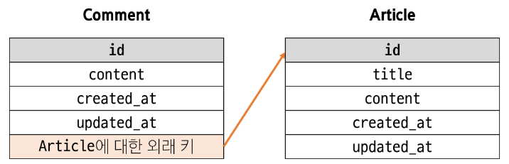

# Django Relationships
### 실습
※ `05_Django/03-many_to_one/01-many_to_one`
- 이 폴더에는 config라는 프로젝트에 articles라는 어플리케이션이 만들어 져있음
- 코드 작성 전 환경설정
    - `python -m venv venv`
    - `source venv/Scripts/activate`
    - `pip install -r requirements.txt`
        - requirements.txt에 뭐 있는지도 확인

- config/settings.py의 INSTALLED_APPS 확인
    - articles 추가되어 있는 것 확인
    - articles/views.py를 보면 rest_framework를 쓰고 있는데, INSTALLED_APPS에 추가되어 있지않음 -> "rest_framework" 추가 
    - 외부 프로젝트를 가지고 왔을 땐 제일 먼저 설정들을 보면서 내가 어떻게 구성해야 할지 둘러보기

- 작성되어있는 코드 둘러보기
    - 코드 작성과 동일한 루틴으로 둘러보기
        1. 프로젝트 가상환경(venv) 활성화
        2. 프로젝트 기획이 어느정도 되어있다는 가정 하에, 그렇다면 모델들의 관계도 구성되어 있을 것 -> model 확인
            ```python
            # articles/models.py
            from django.db import models

            # Aricles 클래스가 장고의 model클래스를 상속받고 있음
            # 그래서 manage가 있었고
            # article에 대한 전체 정보를 불러오려면 objects라는 매니저를 통해 전체 조회를 해야하는 QuerySet API가 있었음
            class Article(models.Model):
                # 각 컬럼들을 어떤 데이터 타입으로 만들 것인지 필드 정의된 것 확인
                # 필드들마다 제약사항이 있거나, 장고에게 맡길 추가적인 옵션이 들어있음
                title = models.CharField(max_length=120)    # 제약사항
                content = models.TextField()
                created_at = models.DateTimeField(auto_now_add=True)    # 옵션
                updated_at = models.DateTimeField(auto_now=True)    # 옵션

                # 매직메서드를 통해 디버깅 쉬울지도 확인
                def __str__(self):
                    return self.title
            ```

        3. model을 활용한 식별자(url)와
            - 프로젝트의 urls.py 먼저 확인
            ```python
            # config/urls.py
            from django.contrib import admin
            from django.urls import path, include

            urlpatterns = [
                path("admin/", admin.site.urls),
                path("articles/", include("articles.urls")),
            ]
            # articles/로 요청 들어오면 그 이후는 articles.urls에서 뒷부분을 처리하겠다는 코드 확인
            # articles/로 요청 들어오면 articles.urls이 처리한다 하니 이 파일도 확인해보자
            ```
            ```python
            # articles/urls.py
            from django.urls import path
            from . import views

            urlpatterns = [
                path('', views.article_list),
                path('<int:article_pk>/', views.article_detail),
                path('<int:article_pk>/comments/', views.comment_create),
                # path('comments/', views.comment_list),
                # path('comments/<int:comment_pk>/', views.comment_detail),
            ]
            # 비어있는 문자열 ''은
            # 만약 사이트 주소가 https://example.com/이라면
            # https://example.com/로 접속했을 때 views.article_list 함수가 실행된다는 뜻
            # 즉, ''은 홈페이지에 해당하는 URL 경로
            # 그럼 article_list 함수를 살펴보자
            ```
        4. 메서드와 표현(views) 확인
            ```python
            # articles/views.py

            @api_view(['GET', 'POST'])  # api_view 데코레이터로 GET과 POST 두 개의 메서드를 허용하고 있음 
            def article_list(request):
                if request.method == 'GET':     # 만약 GET요청 받으면 
                    articles = Article.objects.all()    # Article이라는 내 모델에서부터 
                                                        # object 속성(장고가 만들어준 매니저)으로
                                                        # all 이라는 QuerySet API를 사용해서
                                            # 내 DB에 있는 전체 게시글 가져와서 articles 변수에 전달
                                            # 이것을 ArticleListSerializer 이용해서 표현
                                            # ArticleListSerializer 생긴거 보러 가자
                    serializer = ArticleListSerializer(articles, many=True) 
                    return Response(serializer.data)
                elif request.method == 'POST':      # 만약 POST 요청 받으면
                    serializer = ArticleSerializer(data=request.data)   # ArticleSerializer에
                                                                        # 사용자가 넘겨준 데이터를
                                                                        # data 위치에 키워드 인자로 넘겨줌
                    # class에 인스턴스 생성하기 위한 인자 전달 시.. 키워드 인자를 써야하는 이유?
                    '''
                        class Some:
                            def __init__(self, arg1, arg2='default', arg3='default'...):
                                pass
                        s1 = Some('arg1', arg3='other data')
                    '''
                    # serializer의 역할은 '어떠한 데이터를 포맷팅 하는 것'
                    # 그럼 serializer의 첫번째 인자는 당연히 '포맷팅할 데이터'가 들어가는 것을 기대함
                    # 즉, 내가 가진 데이터가 들어오길 기대함 -> 그래서 첫번째 인자
                    # 그래서 articles는 객체를 넘기기로 한 첫번째 인자에 위치 맞춰서 들어간거라 위치 인자로서 들어간 것
                    # serializer에게 기대하는 두번째는
                    # 나한테 데이터 없고, 저쪽에서 온 데이터를 내가 쓰고싶을 때 들어갈 데이터가 있을 것
                    # 즉, 요청받은 데이터가 들어가길 기대함 -> 두번째 인자
                    # 생성하려고 하는데 요청받은 데이터를 내가 가진 데이터 없이 넘기려고 하니 키워드 인자로 넘김
                    # (넘길 인자가 한개인데 위치 인자로 넣으려면 두번째에 넣어야하니)
                    # (키워드 인자로 넘긴 것)

                    if serializer.is_valid(raise_exception=True):
                        serializer.save()
                        return Response(serializer.data, status=status.HTTP_201_CREATED)
                    # return Response(serializer.errors, status=status.HTTP_400_BAD_REQUEST)
            

            @api_view(['GET', 'DELETE', 'PUT'])
            def article_detail(request, article_pk):
                # article = Article.objects.get(pk=article_pk)
                article = Article.objects.annotate(num_of_comments=Count('comment')).get(
                    pk=article_pk
                )
                # comments = article.comment_set.all()
                if request.method == 'GET':
                    serializer = ArticleSerializer(article)
                    return Response(serializer.data)
                
                elif request.method == 'DELETE':
                    article.delete()
                    return Response(status=status.HTTP_204_NO_CONTENT)
                
                elif request.method == 'PUT':
                    serializer = ArticleSerializer(article, data=request.data)
                    if serializer.is_valid(raise_exception=True):
                        serializer.save()
                        return Response(serializer.data)
                    # return Response(serializer.errors, status=status.HTTP_400_BAD_REQUEST)
            
            # GET은 특정 pk 지정해서 조회할 수 있음
            # 이 pk값을 urls.py에서부터 받아옴 
                # path('<int:article_pk>/', views.article_detail),
            # DELETE -> 조회한 대상을 삭제
            # PUT -> 조회해온 대상(article)을 저쪽에서 보내온 데이터로 수정
                # 내가 수정할 대상과, 거기에 넣을 데이터!
                # 총 두개의 인자 넣음
            ```
        5. serializers -> 메서드와 표현 확인하려면 serializers도 함께 확인해야 함
            ```python
            # articles/serializers.py
            from rest_framework import serializers
            from .models import Article, Comment

            class ArticleListSerializer(serializers.ModelSerializer):
                class Meta:
                    model = Article 
                    exclude = ('created_at', 'updated_at',)
            # 내 모델 Article을 가지고(model = Article)
            # 모델 정보를 토대로 직렬화를 할 수 있는(ModelSerializer) ArticleListSerializer 만들어 놓은거 확인
            # 메타데이터 정보가 Article 클래스를 기반으로 함
            # exclude -> 제외시킨다
            # 즉, 사용자에게 제공되는 데이터가 id, content, title, created_at, updated_at 전부 모이는 것이 아닌
            # id, content, title 세 개만 보여주겠다
            ```
        6. 테스트해보고 싶으면 admin 정보도 확인

-> 살펴보기 끝^^;;

-> 이제 여기에 Comment라는 댓글 모델을 추가할 예정

-> 그냥 추가XX 1:N의 관계로 추가해보자

## Many to one relationships
### Many to one relationships N:1 or 1:N
한 테이블의 0개 이상의 레코드가 다른 테이블의 레코드 한 개와 관련된 관계

- `Comment - Article` : 0개 이상의 댓글은 1개의 게시글에 작성될 수 있음
    - `Comment(N) - Article(1)` : **0개 이상**의 댓글은 1개의 게시글에 작성될 수 있음
- 테이블 관계

    
    - 테이블을 구성한다(=내 데이터를 저장할 공간을 만든다)고 가정했을 때, 현재 Article 테이블이 오른쪽과 같이 만들어져있음을 알고있음
        - 왜? 클래스 이렇게 만들었으니까

            
        - id는 장고가 알아서 만들어줌
    - 댓글(Content)도 비슷하게 만들 것임
        - models.py에 있는 Aritcle 클래스의 내용을 Comment 클래스 만들 때 그대로 복사
            ```python
            # articles/models.py
            from django.db import models

            # Create your models here.
            class Article(models.Model):
                title = models.CharField(max_length=120)
                content = models.TextField()    # 복사
                created_at = models.DateTimeField(auto_now_add=True)    # 복사
                updated_at = models.DateTimeField(auto_now=True)    # 복사

                def __str__(self):
                    return self.title

            class Comment(models.Model):
                content = models.TextField()    # 붙여넣기
                created_at = models.DateTimeField(auto_now_add=True)    # 붙여넣기
                updated_at = models.DateTimeField(auto_now=True)    # 붙여넣기
            ```
        - Comment는 어디에 작성하며, Article은 자신을 참조하고 있는 댓글들이 누군지 어떻게 알 수 있을까?

    - 어떻게 해야 이 두개의 클래스를 가지고 N:1 관계를 만들 수 있을까?
        - 내(Comment)가 참조할 대상(Article)에 대한 정보를 저장할 수 있는 공간을 만들어주면 됨
        - N이 0일 '수도' 있으니, 1의 입장인 Article에 0개일 수도 있는 N을 위한 공간을 만드는 것은 이상함
        - 반드시 한 개가 있어야 하는 N의 입장에서, 본인이 바라보고 있는 대상이 누군지를 저장할 공간을 마련하는게 맞음

    - Comment는 Article을 바라보고 있음
        ```python
        class Comment(models.Model):
            article = ??
            content = models.TextField()
            created_at = models.DateTimeField(auto_now_add=True)
            updated_at = models.DateTimeField(auto_now=True)
        ```
        - article을 바라보고 있는 곳에 저장해야할 것? (article = ??)
        - 일반적으로 클래스 변수에 필드에 대한 정보를 할당함
        - 그럼 게시글 정보 중 어떤 정보를 댓글에 저장해야 올바른 게시글을 찾아갈 수 있을까?
        - 고유한 정보는 Article이 가진 `id`!!
        - id 외의 나머지 필드는 중복될 수 있음
    
    - Comment의 id(primary key)와는 구분되야 하므로 Article의 id는 외부에서 가져왔다 하여 `ForeignKey`라고 함

    - Comment 모델 구성할 때 Article에 대한 외래키를 구성해야 함 


### 댓글 모델
- `ForeignKey()` : N:1 관계 설정 모델 필드

- 댓글 모델 정의
    - ForeignKey 클래스의 인스턴스 이름은 참조하는 모델 클래스 이름의 **단수형**으로 작성하는 것을 권장
    - 외래 키는 ForeignKey 클래스를 작성하는 위치와 관계없이 테이블 필드 마지막에 생성됨

    

- `ForeignKey(to, on_delete)`
    - `to` : 참조하는 모델 class 이름
    - `on_delete`
        - 외래 키가 참조하는 객체(1)가 사라졌을 때, 외래 키를 가진 객체(N)를 어떻게 처리할 지를 정의하는 설정(**데이터 무결성**)
        - on_delete의 'CASCADE' : 부모 객체(참조된 객체)가 삭제됐을 때 이를 참조하는 객체도 삭제

- Migration 이후 댓글 테이블 확인
    - 댓글 테이블의 article_id 필드 확인
    - 참조하는 클래스 이름의 소문자(단수형)으로 작성하는 것이 권장되었던 이유
        - `참조 대상 클래스 이름 + _ + 클래스 이름`

        

### 실습
```python
from django.db import models

# Create your models here.
class Article(models.Model):
    title = models.CharField(max_length=120)
    content = models.TextField()
    created_at = models.DateTimeField(auto_now_add=True)
    updated_at = models.DateTimeField(auto_now=True)

    def __str__(self):
        return self.title

class Comment(models.Model):
    # Article class를 참조 하는데, 내가 참조 중인 게시글이 삭제되면, 나도 삭제
    '''
        project의 urls.py에서, 내가 지금 요청 들어온것에 대한 처리를
        다른 위치에 있는 다른 모듈 혹은 어떠한 함수에 대해 처리를 위임하려고 할때
        그 대상을 직접적으로 호출하여 작성하는 것이 아니라,
        문자열 형태로 (현재 활성화 되지 않았어도) 지금 코드가 실행되는데 문제없도록
        실행 대상의 명확한 위치를 기록
        include("articles.urls") -> app_name.module_name
    '''
    article = models.ForeignKey('articles.Article', on_delete=models.CASCADE)
    # article = models.ForeignKey(Article, on_delete=models.CASCADE)
    content = models.TextField()
    created_at = models.DateTimeField(auto_now_add=True)
    updated_at = models.DateTimeField(auto_now=True)
```
- `article = models.ForeignKey(Article, on_delete=models.CASCADE)` 작성
    - ForeignKey 지정
        - to : Article
        - on_delete: models.CASCADE
- Comment 클래스가 article이라는 필드에 FK 설정하는데, 그 대상이 Article 클래스임
    - 문제없이 정상동작하는 이유는
    - Comment 클래스가 Article 클래스보다 나중에 정의되어 있어서 사용 가능한 것!!
    - Comment 클래스가 Article 클래스보다 먼저 정의되어 있으면(위에 정의되어 있으면) 당연히 못씀
        ```python
        print(dust)
        dust = 60
        # name 에러 -> 참조 불가능
        ```
    
- 1:N의 관계 클래스에 대해서 순서 맞춰서 써야하는가?
    - 관계에 따라 클래스에 정의되는 위치가 달라져야 하나?
    - 아주 복잡쓰
    - 이를 위해 클래스 위치 계속 바꿀 수 없음
    - 클래스 직접적으로 참조하도록 하는 방법이 일반적인데,
    - '안전하게' 하고싶다면 `include("articles.urls")`처럼 문자열 형태로 작성
    - `'app이름.module이름'`
    - Article 클래스는 articles 어플리케이션에 있음
    - `"articles.Article"`

- 즉, `article = models.ForeignKey('articles.Article', on_delete=models.CASCADE)` 이렇게 작성

- 모델에 변경사항 생겼으니 설계도 작성
    - `python manage.py makemigrations`
        ```python
        class Migration(migrations.Migration):

            dependencies = [
                ('articles', '0001_initial'),
            ]

            operations = [
                migrations.CreateModel(
                    name='Comment',
                    fields=[
                        ('id', models.BigAutoField(auto_created=True, primary_key=True, serialize=False, verbose_name='ID')),
                        ('content', models.TextField()),
                        ('created_at', models.DateTimeField(auto_now_add=True)),
                        ('updated_at', models.DateTimeField(auto_now=True)),
                        ('article', models.ForeignKey(on_delete=django.db.models.deletion.CASCADE, to='articles.article')), # 추가된거 확인
                    ],
                ),
            ]
        ```
        - `('article', models.ForeignKey(on_delete=django.db.models.deletion.CASCADE, to='articles.article')),`
        - 참조 대상이 대문자로 작성한 Article이 아닌 article이 된 것도 확인
        - 우린 대문자로 썼는데 왜 설계도엔 소문자로 들어갔을까?

- DB 반영
    - `python manage.py migrate`

        
        - db.sqlite3 생긴거 확인

- DB 확인
    - Database - sqlite - path - 현재 폴더로 가서 - All Files - db.sqlite3 - +connect 

        
        
        
        
        
        

    - article_comment 테이블에 `article_id` 추가된 것 확인
        
        
        - article은 왜 `_id`가 붙었을까?
        - python에서 객체를 사용할 때 편의성과 DB에서 어떤 테이블을 구성할 때 각 컬럼에 들어갈 value에 대해 생각해보면 좋을듯
        - 우리는 comment 테이블에 FK(참조 대상)을 게시글의 id값을 넣을 것임 = INTEGER
        - 파이썬 객체에서 article 변수에 굳이 숫자를 넘길 필요가 있을까?
        - 나는 Comment가 가진 article 속성에 게시글 인스턴스 자체를 넣고싶은데, 굳이 id값을 찾아서 넣어야 하는가?
        - 객체의 속성에는 다른 객체를 넣을 수 있는데,
        - 모델 정의할 때 article에 Comment 클래스로 인해 만들어진 댓글은 본인의 article에 대한 정보를 저장하거나 조회해서 출력하려고할 때 그 값이 정수일 필요가 있을까? 없지 않을까?
        - 생각해보기
        

## 관계 모델 참조
### 역참조
N:1 관계에서 1에서 N을 참조하거나 조회하는 것 `1 → N`

-> N은 외래 키를 가지고 있어 물리적으로 참조가 가능하지만, 1은 N에 대한 참조 방법이 존재하지 않아 별도의 역참조 기능이 필요

- 역참조 사용 예시 `article.comment_set.all()`
    - `article` : 모델 인스턴스
    - `comment_set` : related manager (역참조 이름)
    - `all()` : QuerySet API
    - 즉, 특정 게시글에 작성된 댓글 전체를 조회하는 명령

- related manager
    - N:1 혹은 M:N 관계에서 역참조 시에 사용하는 매니저
        - `objects` 매니저를 통해 QuerySet API를 사용했던 것처럼 `related manager`를 통해 QuerySet API를 사용할 수 있게 됨
    - related manager 이름 규칙
        1. N:1 관계에서 생성되는 related manager의 이름은 참조하는 **"모델명_set"** 이름 규칙으로 만들어짐
        2. 특정 댓글의 게시글 참조 (Comment → Article)
            - `comment.article`
        3. 특정 게시글의 댓글 목록 참조 (Article → Comment)
            - `article.comment_set.all()`

## DRF with DRF with N:1 Relation
### 사전준비
- Comment 모델 정의
    1. Comment 클래스 정의 및 데이터베이스 초기화

        

    2. Migrate 작업 진행
        - `python manage.py makemigrations`
        - `python manage.py migrate`

- URL 및 HTTP request method 구성

    

### POST
- 댓글 생성을 위한 CommentSerializer 정의

    

- 단일 댓글 생성을 위한 url 및 view 함수 작성

    

- serializer 인스턴스의 `save()` 메서드는 특정 Serializer 인스턴스를 저장하는 과정에서 추가 데이터를 받을 수 있음

    

- POST `http://127.0.0.1:8000/articles/{article_pk}/comments/` 응답확인
    - 상태코드 400 응답확인

        
    - CommentSerializer에서 외래 키에 해당하는 article 필드 또한 사용자로부터 입력 받도록 설정되어 있기 때문에 서버 측에서는 누락되었다고 판단한 것
    - 유효성 검사 목록에서 제외 필요
    - article 필드를 **읽기 전용 필드**로 설정하기

- 읽기 전용 필드(`read_only_fields`)
    - 데이터를 전송받은 시점에 "**유효성 검사에서 제외**시키고, **데이터 조회 시에는 출력**"하는 필드

    

- POST `http://127.0.0.1:8000/articles/{article_pk}/comments/` 재요청

    


### GET - List
- url 작성

    
- view 함수 작성

    
- GET `http://127.0.0.1:8000/articles/comments/` 응답확인
    
    

### GET - Detail
- 단일 댓글 조회를 위한 url 및 view 함수 작성

    

- GET `http://127.0.0.1:8000/comments/{comment_pk}/` 응답확인

    

### DELETE & PUT
- 단일 댓글 삭제 및 수정을 위한 view함수 작성

    

- DELETE `http://127.0.0.1:8000/articles/comments/{comment_pk}/` 응답확인

    

- PUT `http://127.0.0.1:8000/articles/comments/{comment_pk}/` 응답확인

    

### 응답 데이터 재구성
- 댓글 조회 시 게시글 출력 내역 변경
    - 댓글 조회 시 게시글 번호만 제공해주는 것이 아닌 **게시글 제목까지 제공**하기

    
- 필요한 데이터를 만들기 위한 Serializer는 내부에서 추가 선언 가능

    
- GET `http://127.0.0.1:8000/articles/comments/{comment_pk}/` 응답확인

### 읽기 전용 필드 지정 주의사항
- 특정 필드를 override 혹은 추가한 경우 `read_only_fields`는 동작하지 않음
    - 이런 경우 새로운 필드에 `read_only 키워드 인자`로 작성해야 함

    

- `read_only_fields` 속성
    - 기존 외래 키 필드 값을 그대로 응답 데이터에 제공하기 위해 지정하는 경우
- `read_only` 인자
    - 기존 외래 키 필드 값의 결과를 다른 값으로 덮어쓰는 경우
    - 새로운 응답 데이터 값을 제공하는 경우

## 역참조 데이터 구성
`Article → Comment` 간 역참조 관계를 활용한 JSON 데이터 재구성

- 아래 2가지 사항에 대한 데이터 재구성하기
    1. 단일 게시글 조회 시 **해당 게시 글에 작성된 댓글 목록**도 함께 붙여서 응답
    2. 단일 게시글 조회 시 **해당 게시 글에 작성된 댓글 개수**도 함께 붙여서 응답

### 단일 게시글 + 댓글 목록
- `Nested relationships` (역참조 매니저 활용)
    - 모델 관계 상으로 참조하는 대상은 참조되는 대상의 표현에 포함되거나 중첩될 수 있음
    - 이러한 중첩 관계는 serializers를 필드로 사용하여 표현 가능

    

- GET `http://127.0.0.1:8000/api/v1/articles/2/` 응답확인
    
    

### 단일 게시글 + 댓글 개수
- View 로직 개선: `annotate` 사용
    - view에서 `Article` 객체 조회할 때 annotate를 활용해 `num_of_comments` 필드를 추가
        - `annotate`는 Django ORM 함수로, SQL의 집계 함수를 활용하여 쿼리 단계에서 데이터 가공을 수행
    - 댓글 수를 세어 `num_of_comments`라는 필드를 추가

        
    - 이제 `serializer.data`를 반환하면, 해당 article 객체에는 num_of_comments라는 **주석(annotate) 필드**가 포함되어 있음

- Serializer 개선: `SerializerMethodField` 사용
    - SerializerMethodField는 읽기 전용 필드를 커스터마이징 하는 데 사용
    - 이 필드를 선언한 뒤 `get_<필드명>` 메서드를 정의하면, 해당 메서드의 반환 값이 직렬화 결과에 포함됨

    

    - 이제 `serializer.data`를 호출할 때, `get_num_of_comments` 메서드가 실행되어 `num_of_comments` 값이 자동으로 포함됨
    - 추가적으로 view에서 data를 딕셔너리로 변환하거나 수정할 필요 없이, `serializer.data`를 바로 변환해도 최종 JSON 응답에 `num_of_comments` 값이 반영됨

- GET `http://127.0.0.1:8000/api/v1/articles/3/` 응답확인

    

### SerializerMethodField
DRF에서 제공하는 읽기 전용 필드

- Serializer에서 추가적인 데이터 가공을 하고 싶을 때 사용
    - ex. 특정 필드 값을 조합해 새로운 문자열 필드를 만들거나, 부가적인 계산(비율, 합계, 평균)을 하는 경우 등

- SerializerMethodField 동작 원리
    - SerializerMethodField를 Serializer 클래스 내에서 필드로 선언하면, DRF는 `get_<필드명>`이라는 이름을 가진 메서드를 자동으로 찾음

        
        - ex. `full_name = serializers.SerializerMethodField()`라고 선언하면, DRF는 `get_full_name(self, obj)` 메서드를 찾아 해당 값을 직렬화 결과에 넣어줌
        - obj는 현재 직렬화 중인 모델 인스턴스이며, 이 메서드에서 obj의 속성이나 annotate된 필드를 활용해 새 값을 만들 수 있음

- SerializerMethodField 주의사항
    - 읽기 전용!! 생성(POST), 수정(PUT) 요청 시에는 사용되지 않음
    - get_메서드는 반드시 `(self, obj)` 형태로 정의해야 하며, obj는 현재 직렬화 중인 모델 인스턴스를 의미

- SerializerMethodField 사용 목적
    - 유연성
        - 다양한 계산 로직을 손쉽게 추가 가능
    - 가독성
        - 데이터 변환 과정을 Serializer 내부 메서드로 명확히 분리
    - 유지보수성
        - view나 model에 비해 Serializer 측 로직 변경이 용이
    - 일관성
        - view에서 별도로 data 수정 없이도 직렬화 결과를 제어

## Many to many relationships
### Many to many relationships N:M or M:N
한 테이블의 0개 이상의 레코드가 다른 테이블의 0개 이상의 레코드와 관련된 경우

-> **양쪽 모두에서 N:1 관계를 가짐**

-> Django에서는 `ManyToManyField`로 중개모델을 자동으로 생성

### ManyToManyField 예시 (스켈레톤 프로젝트)

- 스켈레톤 프로젝트 django-many-to-many-pjt
1. 가상환경 생성, 활성화 및 패키지 설치
    - `python -m venv venv`
    - `source venv/Scripts/activate`
    - `pip install -r requirements.txt`
2. migrate 진행
    - `python manage.py makemigrations`
    - `python manage.py migrate`
3. 프로젝트 모델 확인

    
    
    

4. 강좌와 보조 강사 간 N:M 관계 설정

    

- ※ `ManyToManyField()`
    - M:N 관계 설정 모델 필드
    - `Teacher(M) - Course(N)`
        - 0명 이상의 보조 강사는 0개 이상의 강좌와 관련
        - 즉, 강좌는 0명 이상의 보조강사를 가질 수 있고, 강사는 0개 이상의 강좌에 보조강사로 참여할 수 있음
    
5. 모델 관계 설정
    - Article 클래스에 ManyToManyField 작성

        
    - Migration 진행 후 에러 발생

        

    - 역참조 매니저 충돌
        - `N:1`
            - "주 강사로 참여하는 강좌"
            - `user.article_set.all()`
        - `M:N`
            - "보조 강사로 참여하는 강좌"
            - `user.article_set.all()`
        - assistant_teachers 필드 생성 시 자동으로 역참조 매니저인 `.article_set`가 생성됨
        - 그러나 이전 N:1 (Course - Teacher) 관계에서 이미 같은 이름의 매니저를 사용중
            - `tescher.course_set.all()` -> 해당 강사가 주 강사로 참여하는 모든 강좌
        - 주 강사로 참여하는 강좌(tescher.course_set)와 보조 강사(tescher.course_set)로 참여하는 강좌를 구분할 수 없게 됨
        - teacher와 관계된 ForeignKey 혹은 ManyToManyField 둘 중 하나에 `related_name` 작성 필요

    - `related_name` 작성 후 Migration 재진행

        
    - 생성된 중개 테이블 확인
        
        

- `Teacher - Course`간 사용 가능한 전체 related manager
    - `course.main_teacher` : 강좌의 주 강사 정보 N:1
    - `teacher.course_set` : 강사가 주 강사로 참여하는 강좌 정보 - N:1
    - `course.assistant_teachers` : 강좌의 보조강사 정보 - M:N
    - `user.assistant_courses` : 강사가 보조 강사로 참여하는 강좌 정보 - M:N

- ManyToManyField의 대표 인자 3가지
    1. `related_name`
        - 역참조 시 사용하는 manager name을 변경

            
    2. `symmetrical`
        - 관계 설정 시 대칭 유무 설정
        - ManyToManyField가 동일한 모델을 가리키는 정의에서만 사용
        - 기본값: True

            
        - True일 경우
            - source 모델의 인스턴스가 target 모델의 인스턴스를 참조하면 자동으로 target 모델 인스턴스도 source 모델 인스턴스를 자동으로 참조하도록 함(대칭)
            - 즉, 내가 니 친구면 니도 내 친구
        - False일 경우
            - True와 반대. 대칭되지 않음
        - ※ source 모델: 관계를 시작하는 모델
        - ※ target 모델: 관계의 대상이 되는 모델
    3. `through`
        - 사용하고자 하는 중개모델을 지정
        - 일반적으로 추가 데이터를 M:N 관계와 연결하려는 경우에 활용

        

- M:N에서의 대표 methods
    - `add()`
        - 지정된 객체를 관련 객체 집합에 추가
        - 이미 존재하는 관계에 사용하면 관계가 복제되지 않음
    - `remove()`
        - 관련 객체 집합에서 지정된 모델 객체를 제거

### 기능 구현
- url 작성

    
- view 함수 작성

    
- 결과 확인

    
    


## 참고
### 올바르게 404 응답하기
- Django shortcuts functions
    - `render()`
    - `redirect()`
    - **`get_object_or_404()`**
    - **`get_list_or_404()`**

- `get_object_or_404()`
    - 모델 manager objects에서 `get()`을 호출하지만, 해당 객체가 없을 땐 기존 DoesNotExist 예외 대신 **Http404를 raise** 함 

    

- `get_list_or_404()`
    - 모델 manager objects에서 `filter()`의 결과를 반환하고, 해당 객체 목록이 없을 땐 **Http404를 raise** 함

    

- 적용 전/후 비교
    - 존재하지 않는 게시글 조회 시 이전에는 상태 코드 500을 응답했지만 현재는 404를 응답

    

