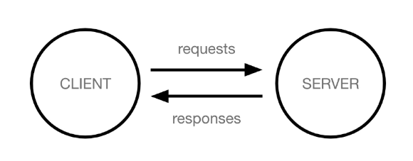
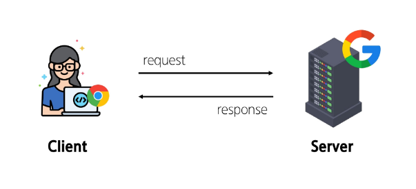

# Django Web Framework
## Web Application
### Web Application (web service) 개발
인터넷을 통해 사용자에게 제공되는 소프트웨어 프로그램을 구축하는 과정

※ 다양한 디바이스(모바일, 태블릿, PC 등)에서 웹 브라우저를 통해 접근하고 사용할 수 있음

- 클라이언트와 서버
    - 웹의 동작 방식: `클라이언트 - 서버` 구조

        
        - 클라이언트가 서버에게 어떠한 '요청'을 보냄
        - 서버는 요청에 맞는 '응답'을 보냄
    
    - Client(클라이언트)
        - 서비스를 요청하는 주체
        - 웹 사용자의 인터넷이 연결된 장치, 웹 브라우저
    
    - Server(서버)
        - 클라이언트의 요청에 응답하는 주체
        - 웹 페이지, 앱을 저장하는 컴퓨터
    
    - 우리가 웹 페이지를 보게 되는 과정

        
        1. 웹 브라우저(클라이언트)에서 `google.com`을 입력
        2. 브라우저는 인터넷에 연결된 전세계 어딘 가에 있는 구글 컴퓨터(서버)에게 `google 홈페이지.html` 파일을 달라고 **요청**
        3. 요청받은 구글 컴퓨터는 데이터베이스에서 `google 홈페이지.html` 파일을 찾아 **응답**
        4. 전달받은 `google 홈페이지.html` 파일을 사람이 볼 수 있도록 웹 브라우저가 해석해주면서, 사용자는 구글의 메인 페이지를 보게 됨


### Frontend & Backend
- Frontend (프론트엔드)
    - 사용자 인터페이스(UI)를 구성하고, 사용자가 애플리케이션과 상호작용할 수 있도록 함
    - HTML, CSS, JavaScript, 프론트엔드 프레임워크 등

※ 프론트엔드 != 디자이너

-> 

-> 

->

- Backend (백엔드)
    - 서버 측에서 동작하며, 클라이언트 요청에 대한 처리와 데이터베이스와의 상호작용 등을 담당
    - 서버 언어(python, java 등) 및 벡엔드 프레임워크, 데이터베이스, API, 보안 등


## Web Framework
웹 애플리케이션을 빠르게 개발할 수 있도록 도와주는 도구

-> 개발에 필요한 기본 구조, 규칙, 라이브러리 등을 제공

### Django framework
Python 기반의 대표적인 웹 프레임워크

- Django 사용 이유
    1. 다양성
        - python 기반으로 소셜 미디어 및 빅데이터 관리 등 광범위한 서비스 개발에 적합
    2. 확장성
        - 대량의 데이터에 대해 빠르고 유연하게 확장할 수 있는 기능을 제공
    3. 보안
        - 취약점으로부터 보호하는 보안 기능이 기본적으로 내장되어 있음
    4. 커뮤니티 지원
        - 개발자를 위한 지원, 문서 및 업데이트를 제공하는 활성화 된 커뮤니티
    

### 가상 환경
Python 애플리케이션과 그에 따른 패키지들을 격리하여 관리할 수 있는 **독립적인** 실행 환경

- 가상 환경이 필요한 시나리오1
    ```
    1. 한 개발자가 2개의 프로젝트(A, B)를 진행해야 함
    2. 프로젝트 A는 requests 패키지 버전1을 사용해야 함
    3. 프로젝트 B는 requests 패키지 버전2를 사용해야 함
    4. 하지만 파이썬 환경에서 패키지는 1개의 버전만 존재할 수 있음
    5. A와 B 프로젝트의 다른 패키지 버전 사용을 위한 **독립적인 개발 환경**이 필요함
    ```

- 가상 환경이 필요한 시나리오2
    ```
    1. 한 개발자가 2개의 프로젝트(A, B)를 진행해야 함
    2. 

    ```


바탕화면에 폴더 만듬(First_project)

그 폴더 환경에 git bash 열기

`pip list`
하니까 깔려있는 많은 리스트 나옴

가상환경 만들기
`python -m venv folder_name` -> `python -m venv venv` 보통 venv 이름으로 가상환경 만듬

`source venv/Scripts/activate` 가상환경 활성화 시킴으로써 사용할 수 있는 상태로 만들기

다시 pip list하면 아무것도 안나옴(가상환경 만들었으니까)

`code .gitignore` 입력해서 내 폴더에서 .gitignore 파일 열기

파일에다가 gitignore.io? 거기서 뭐 직접.. 추가해도 되는데

우리는 직접 추가하지 않고 일단 venv만 추가 -> `venv/` 입력

깃으로 venv 관리 안되게 만듬~!!

venv에 대한 변동사항은 깃이 신경쓰지 않음

.gitignore에서 터미널 열기


bash에서 가상환경 활성화 한거랑 vscode에서 가상환경 활성화 한거랑 따로임

항상 가상환경 활성화 됐는지 확인

현재 vscode 터미널 상태
```bash
SSAFY@DESKTOP-763H707 MINGW64 ~/Desktop/First_project
$ source venv/Scripts/activate
(venv)
```

가상환경에 장고 설치 `pip install django`

똑같이 장고 설치했지만 시간에 따라? 버전이 다름

`pip freeze > requirements.txt`

버전 얼려놓기

다른 곳에서 설치할 때 txt 파일에 있는 목록대로 설치 가능!

`pip install -r requirements.txt` 목록 읽어서 설치해라

글로벌에 설치하지 말고 모든 레포지토리에 목록 읽어서 설치하기(각각 반복해서 입력)


### Django 프로젝트
프로젝트 만들건데 이 폴더에 만들어 달라는 명령어래
`django-admin startproject First_project .`

`python manage.py runserver`
```bash
August 11, 2025 - 14:38:00
Django version 5.2.5, using settings 'First_project.settings'
Starting development server at http://127.0.0.1:8000/
Quit the server with CTRL-BREAK.
```
주소 창 들어가기

서버 끌 때는 ctrl + c

### Django Design Pattern
- 디자인 패턴
    - 소프트웨어 설계에서 발생하는 문제를 해결하기 위한 일반적인 해결책
    - 공통적인 문제를 해결하는 데 쓰이는 형식화된 관행
    - 즉, '애플리케이션의 구조는 이렇게 구성하자'라는 관행

- MVC 디자인 패턴
    - `Model` , `View` , `Controller`
    - 애플리케이션을 구조화하는 대표적인 패턴
    - `데이터` & `사용자 인터페이스` & `비즈니스 로직`을 분리
        - 시각적 요소와 뒤에서 실행되는 로직을 서로 영향 없이, 독립적이고 쉽게 유지 보수할 수 있는 애플리케이션을 만들기 위함

- MTV 디자인 패턴
    - `Model` , `Template` , `Controller`
    - Django에서 애플리케이션을 구조화하는 패턴
    - 기존 MVC 패턴과 동일함(명칭만 다르게 정의)

- Project & App
    - Django project
        - 애플리케이션의 집합
        - DB 설정, URL 연결, 전체 앱 설정 등을 처리
    
    - Django application
        - 독립적으로 작동하는 기능 단위 모듈
        - 각자 특정한 기능을 담당하며 다른 앱들과 함께 하나의 프로젝트를 구성
    
    - 앱 사용 순서
        1. 앱 생성
        2. 앱 등록


`python manage.py startapp articles`

first_project - settings.py에서
```
INSTALLED_APPS = [
    'django.contrib.admin',
    'django.contrib.auth',
    'django.contrib.contenttypes',
    'django.contrib.sessions',
    'django.contrib.messages',
    'django.contrib.staticfiles',
]
```
```
INSTALLED_APPS = [
    'articles'
    'django.contrib.admin',
    'django.contrib.auth',
    'django.contrib.contenttypes',
    'django.contrib.sessions',
    'django.contrib.messages',
    'django.contrib.staticfiles',
]
```
'articles' 추가


## REST API
### API (Application Programming Interface)
두 소프트웨어가 서로 통신할 수 있게 하는 메커니즘

- 클라이언트 - 서버처럼 서로 다른 프로그램에서 **요청과 응답**을 받을 수 있도록 만든 체계

- API 예시
    - 기상 데이터

- API 역할


### Web API
웹 서버 또는 웹 브라우저를 위한 API

- 현대 웹 개발은 하나부터 열까지 직접 개발보다는 여러 Open API들을 활용하는 추세

- 대표적인 Third Party Open API 서비스 목록
    - Youtube API
    - 
    - 
    - 

### REST (Representational State Transfer)
API Server를 개발하기 위한 일종의 소프트웨어 설계 "방법론"


### RESTful API
REST 원리를 따르는 시스템을 RESTful 하다고 부름

- **자원을 정의**하고 **자원에 대한 주소를 지정**하는 전반적인 방법을 서술
- 각각 API 서버 구조를 작성하는 모습이 너무 다르니, 어느정도 약속을 만들어서 다같이 API 서버를 구성하자

### REST API
REST라는 설계 디자인 약속을 지켜 구현한 API


- REST에서 자원을 사용하는 법 3가지
    1. 자원의 식별
        - URI
    2. 자원의 행위
        - HTTP Methods
    3. 자원의 표현
        - JSON 데이터
    
- 자원의 식별
    - URI (Uniform Resource Identifier, 통합 자원 식별자)
        - 인터넷에서 리소스(자원)를 식별하는 문자열
        - 가장 일반적인 URL는 웹 주소로 알려진 URL    
    
    - URL (Uniform Resource Locator, 통합 자원 위치)
        - 웹에서 주어진 리소스의 주소
        - 네트워크 상에 리소스가 어디 있는지를 알려주기 위한 약속

        
        1. Schema (or Protocol)
            - 브라우저가 리소스
        

        2. Domain Name


        3. Port


        4. Path


        5. Parameters


        6. Anchor 

        스크롤바까지..

- 자원의 행위
    - HTTP Request Methods
        - 리소스에 대한 행위(수행하고자 하는 동작)를 정의
        - HTTP verbs 라고도 함
    
    - 대표 HTTP Request Methods
        1. GET
        2. POST
        3. PUT
        4. DELETE


    - HTTP response status codes
        - 특정 HTTP 요청이 성공적으로 완료되었는지 여부를 나타냄

        - 5개의 응답 그룹
            1. Informational responses
            2.
            3.
            4.
            5.
        
        200, 400, 500번대 알고있으면 됨

- 자원의 표현
    - 현재 Django가 응답(자원을 표현)하는 것
        - Django는 Full Stack Framework에 속하기 때문에 기본적으로 사용자에게 페이지(html)를 응답함
        - 하지만 서버가 응답할 수 있는 것은 페이지 뿐만 아니라 다양한 데이터 타입을 응답할 수 있음
        - REST API는 이 중에서도 **JSON** 타입으로 응답하는 것을 권장
    
    - 응답 데이터 타입의 변화
        1. 페이지(html)만을 응답했던 서버
            
            
        2. 이제는 JSON 데이터를 응답하는 REST API 서버로의 변환

            
        3. 먉

            
        4. 먉

            


## 요청과 응답
### DRF (Django REST Framework)
Django에서 Restful API 서버를 쉽게 구축할 수 있도록 도와주는 오픈소스 라이브러리


Django REST Framework 공식문서 꼬옥 참고?


`pip install djangorestframework`

이것도 버전 txt파일에 추가해줘야 함

`pip freeze > requirements.txt`

freeze는 언제하냐? pip install 할때마다 하기


### Django URLs
- Django와 요청 & 응답


- 요청과 응답에서 Django URLs의 역할


- 


서버 주소 뒤에 article/1/ 


- urls.py
    ```python
    from django.urls import path
    # 나랑 같은 폴더의 views
    from . import views

    urlpatterns = [
        path('index/', views.index),
        path('<int:article_pk>/', views.detail),
    ]
    ```