# 최소 신장 트리
## 최소 신장 트리(MST)
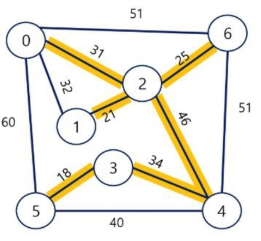

- 신장 트리(Spanning Tree)
  - **n개의 정점**으로 이루어진 **무향 그래프**에서 n개의 정점과 n-1개의 간선으로 이루어진 트리
    - 그래프에 사이클을 없애면 트리가 됨
    - 그래프를 트리로서 내 자료구조에 저장하기 위해, 어떤 정보가 있어야 신장 트리를 자료구조로 나타낼 수 있을까?
    - 프로그래밍에서는 **간선 정보**를 통해 얘가 그래프인지, 노드 간 이동이 가능한지 등의 여부를 알 수 있음!
  - 즉, 그래프가 있다고 말할 수 있는 것은 그래프를 형성할 수 있을 만큼의 충분한 간선들이 있기 때문
  - 그리고 이 그래프에서 불필요한 간선들을 빼면 신장 트리가 됨!

- 최소 신장 트리(Minimum Spanning Tree)
  - 무향 가중치 그래프에서 신장 트리를 구성하는 간선들의 **가중치의 합이 최소**인 신장 트리
  
  - 모든 노드들을 잇는 **전체 가중치의 합**이 최소가 되는 것이 최소 신장 트리의 핵심
    - 두 노드를 잇는 간선이 두 노드를 잇는 것에 있어선 최단거리가 될 수 있지만 다른 노드를 연결했을 때 전체 거리가 커질 수 있음(주의)

- 그래프에서 최소 비용 문제
  - 모든 정점을 연결하는 간선들의 가중치 합이 최소가 되는 트리
  - 두 정점 사이의 최소 비용의 경로 찾기

### KRUSKAL 알고리즘
간선을 하나씩 선택해서 MST를 찾는 알고리즘
1. 최초, 모든 간선을 가중치에 따라 **오름차순** 정렬
2. 가중치가 가장 낮은 간선부터 선택
  - 선택한 간선의 두 정점에 대해서 아래 상황에 따라 진행
    - 두 대표자가 다르다면, 엣지를 최소 비용 집합에 추가
    - 두 대표자가 같다면, 사이클이 생성되므로 무시
3. n-1개의 간선이 선택될 때까지 2번 과정을 반복

- KRUSKAL 알고리즘 예시

  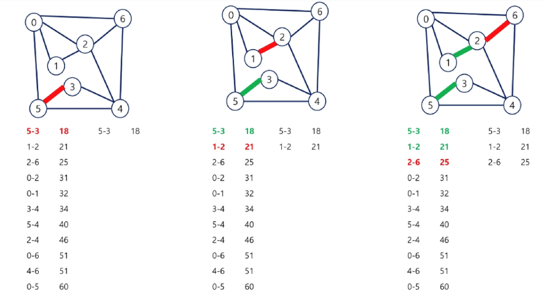

  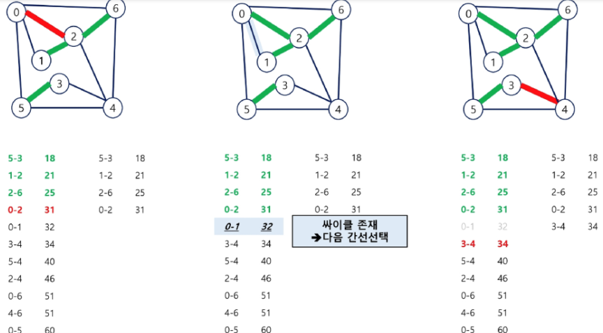

  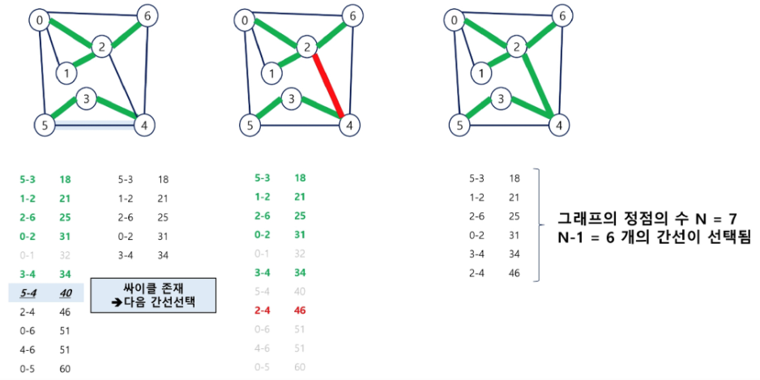

- disjointSet 복습(클래스로 구현)
  ```python
  class DisjointSet:
      def __init__(self, v):
          self.p = [0] * (len(v) + 1)  # 부모 노드 배열 초기화
          self.rank = [0] * (len(v) + 1)  # 랭크 배열 초기화

      def make_set(self, x):
          self.p[x] = x  # 각 노드가 자기 자신을 부모로 가지도록 초기화
          self.rank[x] = 0  # 초기 랭크는 0

      def find_set(self, x):
          if x != self.p[x]:  # 노드 x가 자기 자신을 부모로 가지지 않는 경우
              self.p[x] = self.find_set(self.p[x])  # 부모 노드를 재귀적으로 찾고 경로 압축 수행
          return self.p[x]

      def union(self, x, y):
          px = self.find_set(x)  # 노드 x의 대표자(부모) 찾기
          py = self.find_set(y)  # 노드 y의 대표자(부모) 찾기

          if px != py:
              if self.rank[px] < self.rank[py]:
                  self.p[px] = py  # x의 부모를 y의 부모로 설정
              elif self.rank[px] > self.rank[py]:
                  self.p[py] = px  # y의 부모를 x의 부모로 설정
              else:
                  self.p[py] = px  # y의 부모를 x의 부모로 설정
                  self.rank[px] += 1  # x의 랭크를 1 증가

  disjoint_set = DisjointSet([1, 2, 3, 4, 5, 6])

  for i in range(1, len(disjoint_set.p)):
      disjoint_set.make_set(i)
  print(disjoint_set.p)  # 초기 부모 노드 배열 출력
  print(disjoint_set.rank)  # 초기 랭크 배열 출력
  print()

  # 간선 추가
  edges = [(1, 2), (2, 3), (4, 5), (5, 6), (3, 4)]
  # 간선을 통해 유니온 연산 수행
  for i, (u, v) in enumerate(edges):
      disjoint_set.union(u, v)
  print(disjoint_set.p)       # 최종 부모 노드 배열 출력
  print(disjoint_set.rank)    # 최종 랭크 배열 출력
  ```

- kruskal 알고리즘 구현(disjointSet 활용)
  ```python
  class DisjointSet:
      def __init__(self, v):
          self.p = [0] * (len(v) + 1)  # 부모 노드 배열 초기화
          self.rank = [0] * (len(v) + 1)  # 랭크 배열 초기화

      def make_set(self, x):
          self.p[x] = x  # 각 노드가 자기 자신을 부모로 가지도록 초기화
          self.rank[x] = 0  # 초기 랭크는 0

      def find_set(self, x):
          if x != self.p[x]:  # 노드 x가 자기 자신을 부모로 가지지 않는 경우
              self.p[x] = self.find_set(self.p[x])  # 부모 노드를 재귀적으로 찾고 경로 압축 수행
          return self.p[x]

      def union(self, x, y):
          px = self.find_set(x)  # 노드 x의 대표자(부모) 찾기
          py = self.find_set(y)  # 노드 y의 대표자(부모) 찾기

          if px != py:
              if self.rank[px] < self.rank[py]:
                  self.p[px] = py  # x의 부모를 y의 부모로 설정
              elif self.rank[px] > self.rank[py]:
                  self.p[py] = px  # y의 부모를 x의 부모로 설정
              else:
                  self.p[py] = px  # y의 부모를 x의 부모로 설정
                  self.rank[px] += 1  # x의 랭크를 1 증가

  def mst_kruskal(vertices, edges):
      '''
          1. 가중치를 오름차순 정렬 한다.
          2. 그 순서대로 간선들을 선택하는데
          3. 2에서 선택한 간선의 시작, 종료 노드가 같은 대표자가 아니어야한다.
          4. 2와3을 선택된 간선이 n-1개가 될 때까지 반복한다. 
      '''
      mst = []    # 최소 신장 트리를 구성하는 간선 정보를 담을 리스트

      edges.sort(key=lambda x: x[2])  # 가중치를 기준으로 오름차순 정렬 한다.
      print(edges)                    # 간선 정보의 구성 [[시작노드, 종료노드, 가중치], ]

      ds = DisjointSet(vertices)    # disjointset 생성하기
      for i in range(len(vertices) + 1):  # 전체 정점 집합 개수만큼
          ds.make_set(i)
      print(ds.p)         # 모든 노드가 독립적인 집합들로 만들어짐
      for edge in edges:    # 오름차순 정렬된 간선 정보 순회
          print(edge, mst)  
          s, e, w = edge  # 시작노드, 끝노드, 가중치
          '''
              가중치에 대한 정보는 처음 오름차순 과정에서 역할을 다했고
              이제 우리가 할 일은
              s와 e가 같은 집합에 속해있는지 판별 하고,
              만약 같은 집합에 속해있지 않은 노드들이라면
              합칠 수 있음!
          '''
          # 두 노드가 다른 집합에 속한경우, union
          if ds.find_set(s) != ds.find_set(e):
              ds.union(s, e)
              mst.append(edge)
      return mst

  '''
      가중치 그래프 형상
          1
       ¹ / \ ²
        2---3
          ³
  '''
  # [시작정점, 도착정점, 가중치]
  edges = [[1, 2, 1], [2, 3, 3], [1, 3, 2]]
  vertices = [1, 2, 3]  # 정점 집합

  '''
      MST 구성 결과
          1
       ¹ / \ ²
        2   3
  '''
  result = mst_kruskal(vertices, edges)  # [[1, 2, 1], [1, 3, 2]]
  print(result)

  # 교재 간선 정보
  edges = [
      (0, 1, 32),
      (0, 2, 31),
      (0, 5, 60),
      (0, 6, 51),
      (1, 2, 21),
      (2, 4, 46),
      (2, 6, 25),
      (3, 4, 34),
      (3, 5, 18),
      (4, 5, 40),
      (4, 6, 51),
  ]
  vertices = list(range(7))  # 정점 집합

  result = mst_kruskal(vertices, edges)
  print(result) 
  # [(3, 5, 18), (1, 2, 21), (2, 6, 25), (0, 2, 31), (3, 4, 34), (2, 4, 46)]
  ```

- 코드 정리

  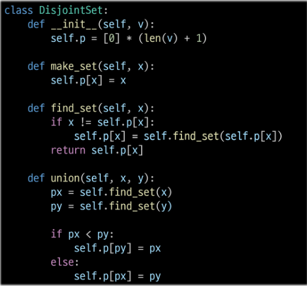
  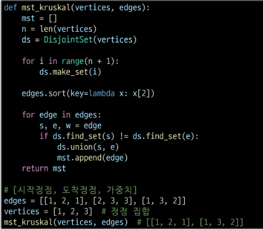


### PRIM 알고리즘
하나의 **정점**에서 연결된 간선들 중 하나씩 선택하면서 MST를 만들어가는 방식
1. 임의 정점을 하나 선택해서 시작
2. 우선순위 큐를 사용하여 간선의 가중치가 가장 작은 간선을 선택
3. 가장 가중치가 작은 간선을 선택하고, 이 간선이 연결하는 정점이 이미 방문한 정점이 아니라면, 이 간선을 최소 신장 트리에 추가하고, 그 정점을 방문한 것으로 표시
4. 우선순위 큐가 빌 때까지 위 과정 반복

- PRIM 알고리즘 예시

  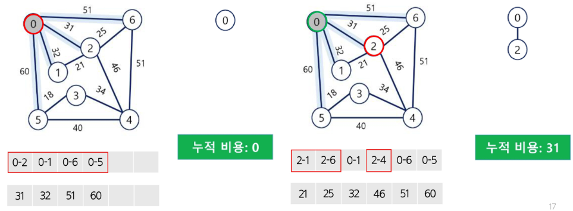

  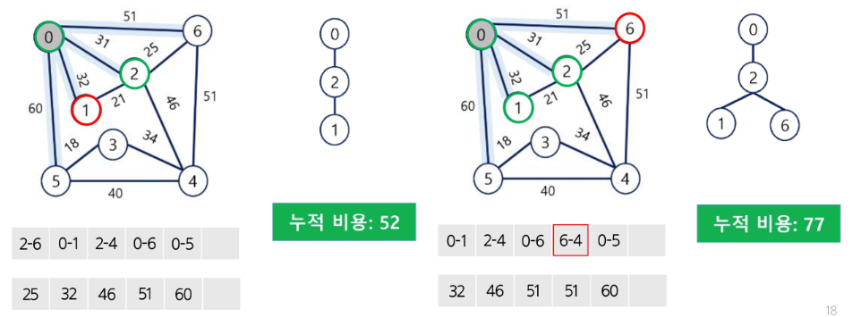

  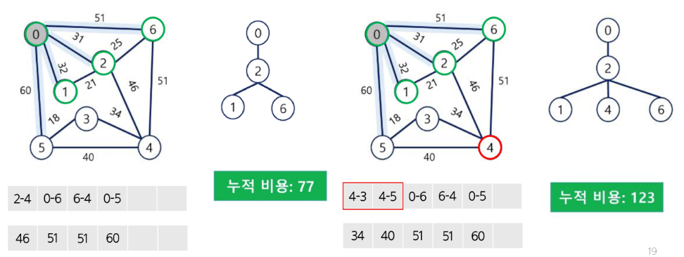

  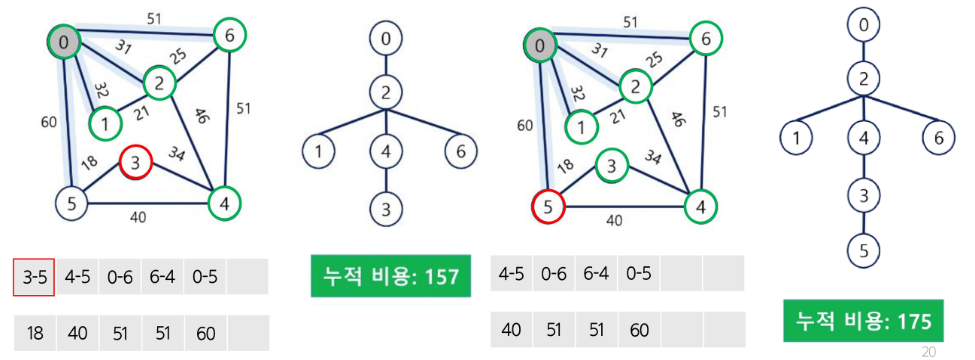

**※ kruskal vs PRIM**

-> 크루스칼은 전체 가중치 정렬 후 가장 낮은 가중치 간선을 선택해 나가는 방식

-> 프림은 임의의 노드 하나를 선택해서 그 노드에서 갈 수 있는 간선의 가중치 중 가장 낮은 가중치 간선을 선택

- PRIM 알고리즘 구현
  ```python
  import heapq  # 우선순위 큐 구현을 위해 힙큐 사용

  def prim(vertices, edges):
      mst = []    # 최소 신장 트리를 그릴 수 있는 간선 목록
      visited = set() # 한번 방문한 정점은 가지 않는다.
      # 시작 정점이 무엇이든 상관없다.
      start_vertex = vertices[0]

      # 시작 정점에서 갈 수 있는 모든 정점들에 대한 간선정보
      # heapq 에 삽입
      # 가중치, 시작정점, 종료정점
      min_heap = [(w, start_vertex, e) for e, w in adj_list[start_vertex]]
      heapq.heapify(min_heap)
      visited.add(start_vertex)

      while min_heap: # 모든 후보군 다 순회 완료 할 때까지!
          print(min_heap)
          weight, start, end = heapq.heappop(min_heap)
          # 이미 방문한 적 있으면 건너뛰기
          if end in visited: continue

          visited.add(end)    # 새로운 정점 방문
          mst.append((start, end, weight))    # 이 간선 정보 mst에 추가

          for next, weight in adj_list[end]:
              # 현재의 도착정점에서 이어진 인접 정점이
              # 즉, 다음에 방문 할 예정이었던 정점이 이미 방문한적있다면
              # 후보군에 넣을 필요도 없다.
              if next in visited: continue
              heapq.heappush(min_heap, (weight, end, next))
      return mst

  '''
      가중치 그래프 형상
          1
       ¹ / \ ²
        2---3
          ³
  '''
  vertices = [1, 2, 3]
  edges = [[1, 2, 1], [2, 3, 3], [1, 3, 2]]

  # 이 그래프 기준, 인접 정점 정보를 가지고 있어야 겠다.
  # 즉, 인접 행렬 혹은 인접 리스트가 필요하다.
  adj_list = {v: [] for v in vertices}  # 인접 리스트 생성
  for s, e, w in edges:
      adj_list[s].append((e, w))
      adj_list[e].append((s, w))  # 무향 그래프
  print(adj_list)

  '''
      MST 구성 결과
          1
       ¹ / \ ²
        2   3
  '''
  mst = prim(vertices, edges)  # [(1, 2, 1), (1, 3, 2)]
  print(mst)


  # # 교재 간선 정보
  edges = [
      (0, 1, 32),
      (0, 2, 31),
      (0, 5, 60),
      (0, 6, 51),
      (1, 2, 21),
      (2, 4, 46),
      (2, 6, 25),
      (3, 4, 34),
      (3, 5, 18),
      (4, 5, 40),
      (4, 6, 51),
  ]
  vertices = list(range(7))  # 정점 집합
  adj_list = {v: [] for v in vertices}
  for s, e, w in edges:
      adj_list[s].append((e, w))
      adj_list[e].append((s, w))
  result = prim(vertices, edges)
  # print(result) # [(0, 2, 31), (2, 1, 21), (2, 6, 25), (2, 4, 46), (4, 3, 34), (3, 5, 18)]
  ```

- 코드 정리

  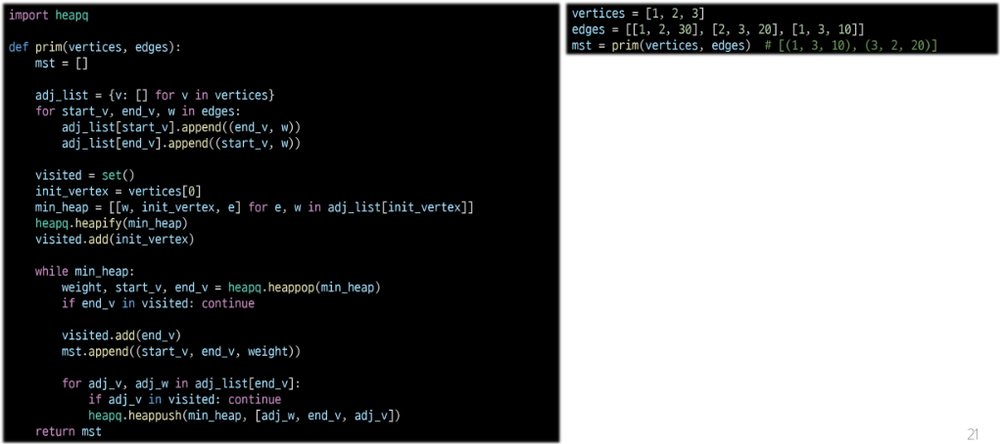

