# 최단 경로
## 최단 경로
간선의 가중치가 있는 그래프에서 두 정점 사이의 경로들 중 간선의 가중치의 합이 최소인 경로

- 하나의 시작 정점에서 끝 정점까지의 최단 경로
  - 다익스트라(dijkstra) 알고리즘
    - 음의 가중치를 허용하지XX
  - 벨만-포드(Bellman-Ford) 알고리즘
    - 음의 가중치를 허용
    - 단, 음수 가중치에 의한 사이클이 만들어지면 안됨

      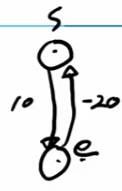

- 모든 정점들에 대한 최단 경로
  - 플로이드-워샬(Floyd-Warshall) 알고리즘

## Dijkstra Algorithm
시작 정점에서 다른 모든 정점으로의 최단 경로를 구하는 알고리즘으로, **시작 정점에서의 거리가 최소인 정점을 선택**해 나가면서 최단 경로를 구하는 방식

- **탐욕 기법**을 사용한 알고리즘으로 MST의 프림 알고리즘과 유사함
- **우선순위 큐** 활용

### 다익스트라 알고리즘 동작 순서
- 현재 상황에서 가장 좋은 선택을 반복해서 최종 해답을 구하는 방식
  1. 시작 정점에서 각 정점까지의 최단 거리를 저장할 리스트 생성
    - 모든 거리를 무한대로 초기화, 시작 정점의 거리는 0으로 설정
  2. 시작 정점과 거리를 우선순위 큐에 삽입
  3. 가장 짧은 거리를 가진 정점을 추출하고, 추출한 정점과 인접한 정점을 모두 확인
    - 기존 거리보다 멀면 무시
  4. 인접한 정점과의 거리가 기존에 저장된 거리보다 작으면, 거리를 갱신하고 우선순위 큐에 삽입
  5. 우선순위 큐가 모두 빌 때까지 **3~4 과정** 반복

- 다익스트라 알고리즘 예시

  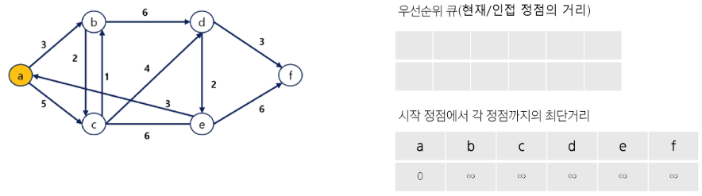

  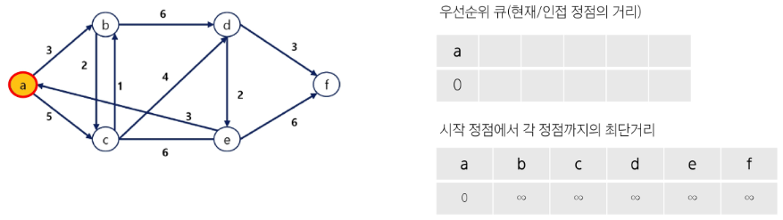

  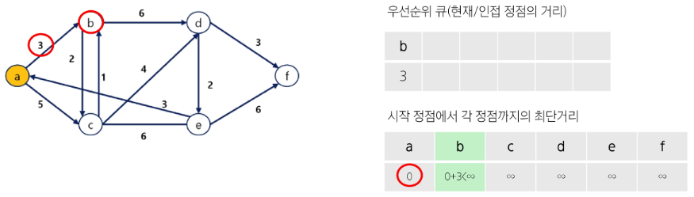

  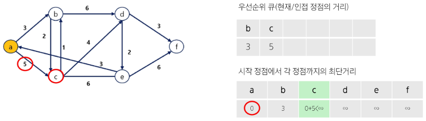

  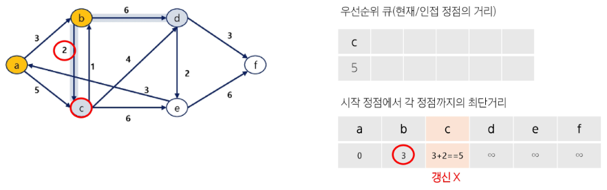

  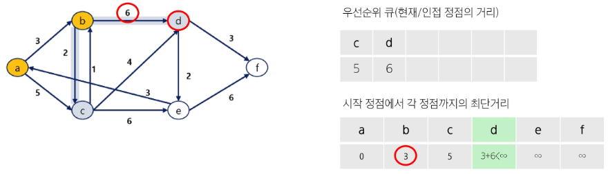

  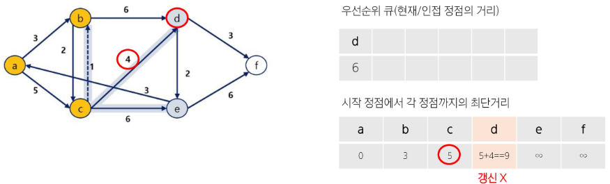

  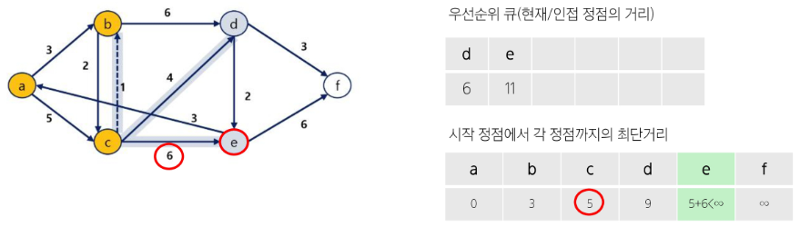

  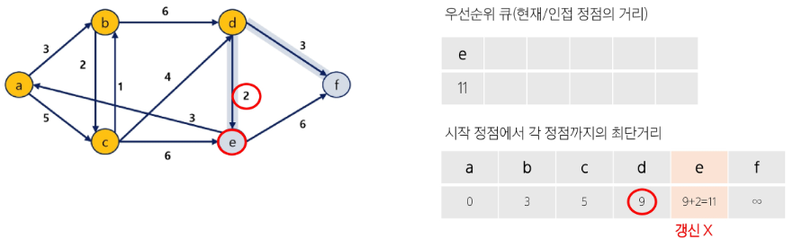

  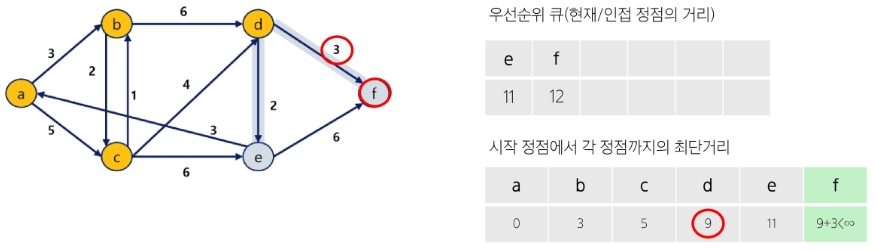

  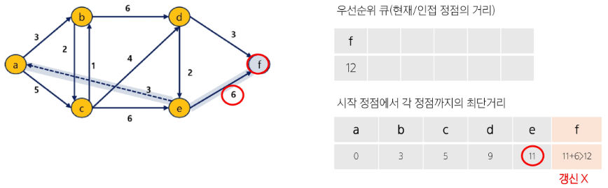

  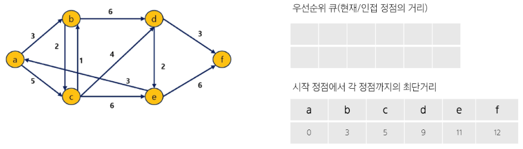


※ 무한대로 초기화 하기보다는 제약조건 확인해서 최대값 설정하기!!

- 파이썬에서 무한대 수 표현하기
  1. `float('inf')`
  2. `math.inf`
  3. `numpy.inf`
  4. `pandas.NA`

  - 각각의 특성과 장점
    - `float('inf')`: 기본적인 무한대 표현, 모든 상황에서 사용 가능
    - `math.inf`: 수학적 계산에 최적화, 수학 관련 함수와 함께 사용 시 유리
    - `numpy.inf`: 배열 연산에 최적화, NumPy 배열과 함께 사용 시 유리
    - `pandas.NA`: 결측치 표현, Pandas 데이터프레임에서 결측치 처리에 유리

  - 단점
    - `float('inf')`: 메모리 사용량이 많고, 속도가 느릴 수 있음
    - `math.inf`: 수학적 연산에 최적화되어 있지만, 일반적인 상황에서는 불편할 수 있음(모듈 사용하지 못하는 상황 등)
    - `numpy.inf`: NumPy 배열 전용, 다른 데이터 구조와의 호환성이 떨어질 수 있음
    - `pandas.NA`: 결측치 표현에 특화되어 있어, 일반적인 무한대 표현에는 부적합

- 다익스트라 연습

  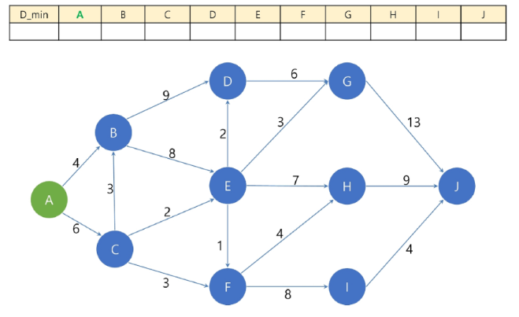

  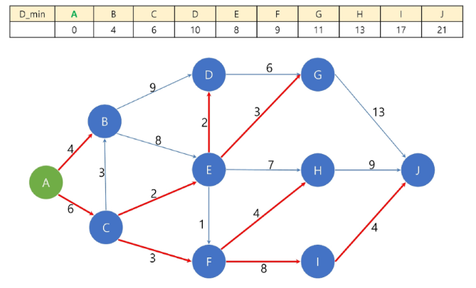

※ 인접 리스트, 인접 행렬 작성 방법
```python
# 정점 정보
vertices = ['a', 'b', 'c', 'd', 'e', 'f']

# 간선 정보
# 시작 정점, 도착 정점, 가중치
edges = [
    (0, 1, 3),
    (0, 2, 5),
    (1, 2, 2),
    (2, 1, 1),
    (2, 3, 4),
    (2, 4, 6),
    (3, 4, 2),
    (3, 5, 3),
    (4, 5, 6)
]

# 인접 리스트
adj_list = {vertices[idx]: {} for idx in range(len(vertices))}
print(adj_list)
for start, end, weight in edges:
    # print(start, end, weight) -> 0 1 3
    # print(vertices[start], vertices[end], weight) -> a b 3
    # adj_list[vertices[start]] -> 얘 자체가 딕셔너리임 {}
    # start_node_value = vertices[start]
    # end_node_value = vertices[end]
    adj_list[vertices[start]][vertices[end]] = weight   # 방향O
print(adj_list)
''' 
{
    'a': {'b': 3, 'c': 5},
    'b': {'c': 2},
    'c': {'b': 1, 'd': 4, 'e': 6},
    'd': {'e': 2, 'f': 3},
    'e': {'f': 6},
    'f': {}
}
'''

# 인접 행렬
adj_matrix = [[float('inf')] * len(vertices) for _ in range(len(vertices))]
# 자기 자신은 도달하지 못하므로 0으로 초기화 해주면 좋겠다.
for i in range(len(vertices)):
    adj_matrix[i][i] = 0
for start, end, weight in edges:
    adj_matrix[start][end] = weight
for m in adj_matrix:
    print(m)
'''
[
    [0, 3, 5, inf, inf, inf],
    [inf, 0, 2, inf, inf, inf],
    [inf, 1, 0, 4, 6, inf],
    [inf, inf, inf, 0, 2, 3],
    [inf, inf, inf, inf, 0, 6],
    [inf, inf, inf, inf, inf, 0]
]
'''
```

### 다익스트라 알고리즘 구현
```python
import heapq, math

def dijkstra(graph, start):
    distances = {v: math.inf for v in graph}  # 각 노드들에 대해서 충분히 큰 값으로 초기화
    distances[start] = 0 # 시작 정점까지 도달하는 거리 0 초기화
    
    # 내 다음 조사 후보군들을 삽입할 배열 -> 힙으로 만들거임
    heap = []   # 최소 힙
    heapq.heappush(heap, [0, start])    # heap 배열에 push할거임
                                          # [도달한 거리, 시작정점]
    # 방문표시
    visited = set()
    # visited.add(start)   <-- 시작 노드 방문 처리는 while 안에서 처리할 것이라 지움

    while heap:
        dist, current = heapq.heappop(heap)   # 거리, 현재위치 빼주기

        # 기존 거리보다, 갱신된 거리가 더 크고, 이미 방문한적 있으면 패스
        if current in visited or distances[current] < dist: 
          continue
        visited.add(current)

        # 현재 노드 기준 인접한 모든 노드에 대해서, 갱신하거나, 우선순위큐에 삽입
        for next, weight in graph[current].items():
            next_distance = dist + weight   # 현재까지 걸린 가중치 + 다음 위치까지의 가중치
            # 아직 방문하지 않았고, 정점까지 도달하는 거리가 충분히 작을때
            if next_distance < distances[next]:
                distances[next] = next_distance
                heapq.heappush(heap, [next_distance, next])
    return distances

graph = {
    'a': {'b': 3, 'c': 5},  # a에서 b로가는 가중치 3, a에서 c로가는 가중치 5
    'b': {'c': 2},
    'c': {'b': 1, 'd': 4, 'e': 6},
    # 'c': {'b': -4, 'd': 4, 'e': 6},
    'd': {'e': 2, 'f': 3},
    'e': {'f': 6},
    'f': {}
}
start_v = 'a'
res = dijkstra(graph, start_v)
print(res)  # {'a': 0, 'b': 3, 'c': 5, 'd': 9, 'e': 11, 'f': 12}
```
- 다익스트라는 DFS인데, 최단 경로를 구하기 위해 모든 노드를 순회하며 '가중치를 기준으로' 우선순위 큐 자료구조를 이용하여 구함
  - 다익스트라 문제점 -> 음수 가중치를 허용XX
    - 왜?
    - 이미 방문한 적 있으면 방문하지 않기로 헀음
    - 가중치가 제일 낮은 간선들만 모아서 진행하면 우선순위가 밀려있는 다른 간선 정보들은 실행XX
    - 근데 만약 음수 가중치가 있다면
    - 초반에는 가중치가 커서 그 길로 아예 안갔는데, 마지막에 음수 가중치로 인해 최단거리가 되는 상황이 발생할 수 있음
    - 이미 초반에 우선순위 높은 길로 노드에 도착해버리면, 돌아돌아 겨우 도착했을 때 최단 경로임에도 갱신되지 못할 수 있음
  - 그래서 음수 가중치가 있는 경우엔 벨만-포드 알고리즘을 쓰자

- 다익스트라 코드 정리

  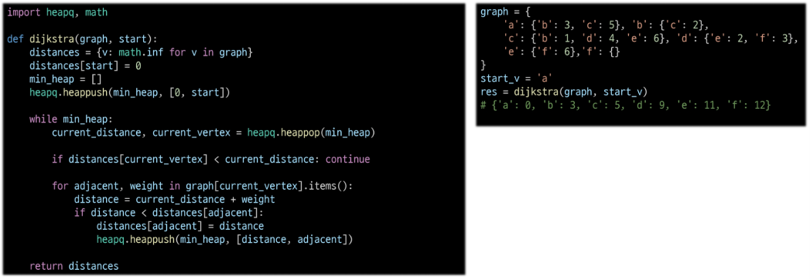


## Bellman-Ford Algorithm
시작 정점에서 다른 모든 정점으로의 최단 경로를 구하는 알고리즘으로, **음수 가중치**를 갖는 간선이 있는 그래프에서도 동작

- 다익스트라와 달리, 탐욕기법 대신 **동적 프로그래밍(DP) 접근**을 사용
- 우선순위 큐 사용XX

### 벨만-포드 알고리즘 동작 순서
1. 시작 정점에서 각 정점까지의 최단 거리를 저장할 리스트 생성
  - 모든 거리를 무한대로 초기화, 시작 정점의 거리는 0으로 설정
2. 모든 간선을 반복해서 검사하고, 각 간선을 통해 더 짧은 경로가 발견되면 거리를 업데이터
  - 1번째 반복
    - 시작 정점에서 한 개의 간선만으로 갈 수 있는 모든 정점들의 최단 거리가 갱신
  - 2번째 반복
    - 시작 정점에서 최대 두 개의 간선만으로 갈 수 있는 모든 정점들의 최단 거리가 갱신
  - k번째 반복
    - 시작 정점에서 최대 k개의 간선만으로 갈 수 있는 모든 정점들의 최단 거리가 갱신
3. 마지막 정점을 제외한 모든 정점에 대해서 2번 과정 반복(V-1번 탐색)
  - 마지막 정점은 이미 갱신이 다 되었다고 간주하여 검사하지 않음
4. 마지막으로 한번 더 모든 간선을 검사하여 거리가 갱신되면, 음수 사이클이 존재함을 의미

- 벨만-포드 알고리즘 예시

  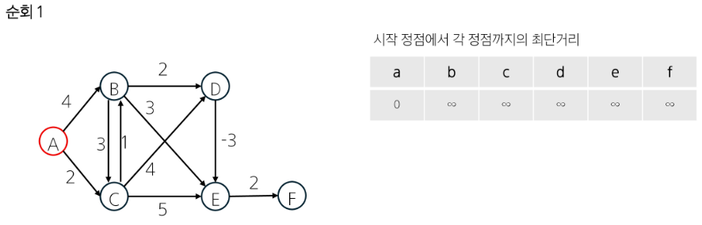

  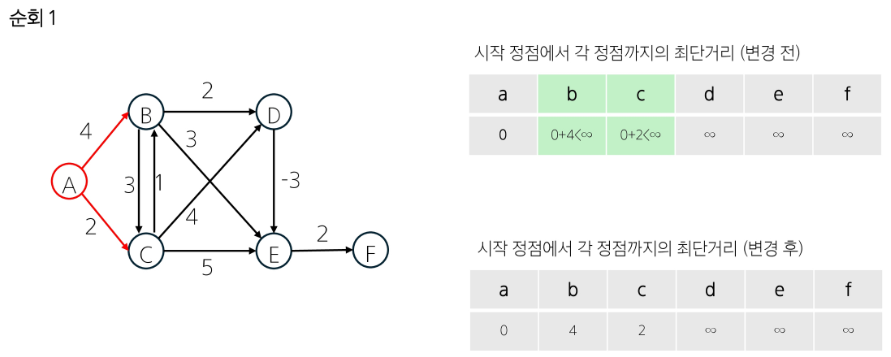

  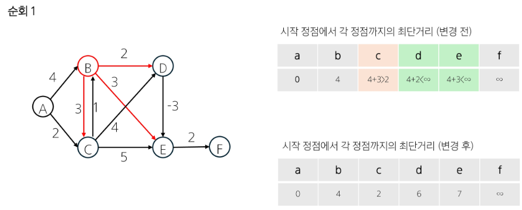

  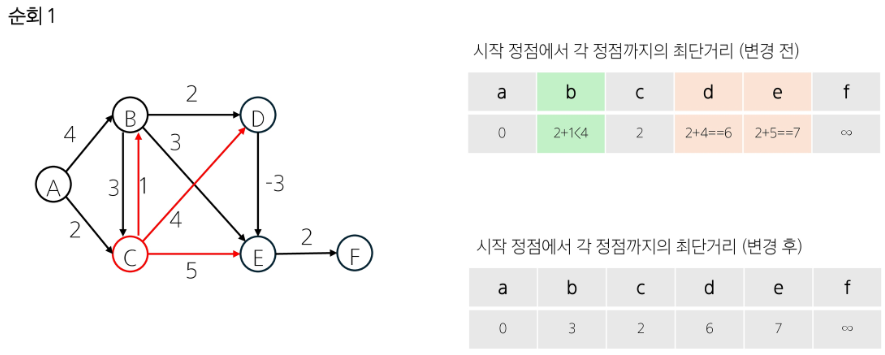

  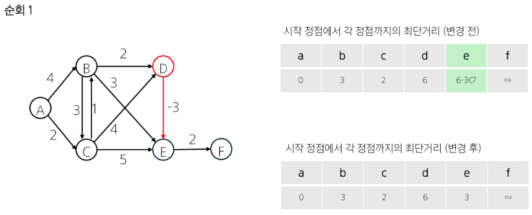

  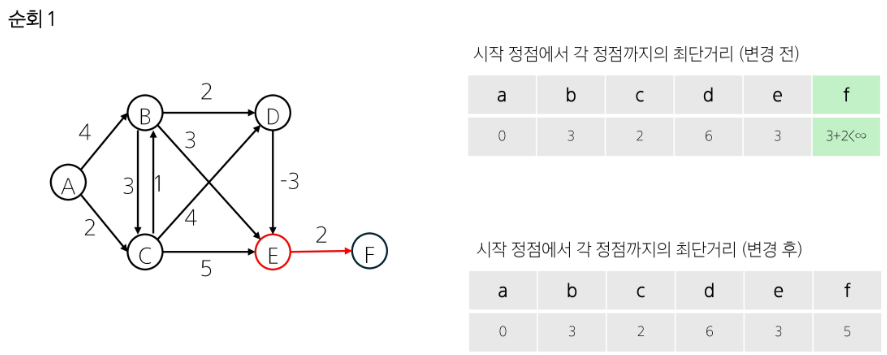

  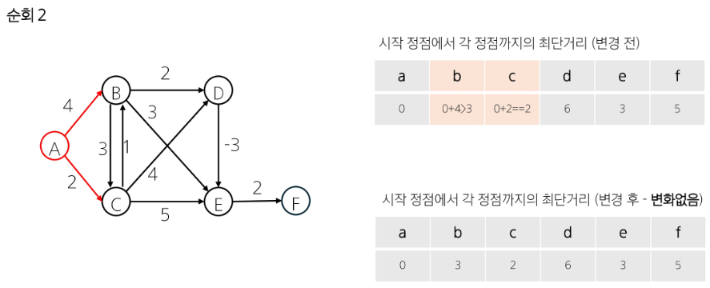

  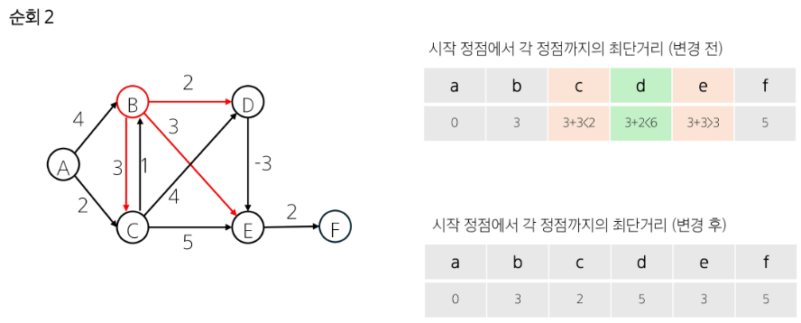

  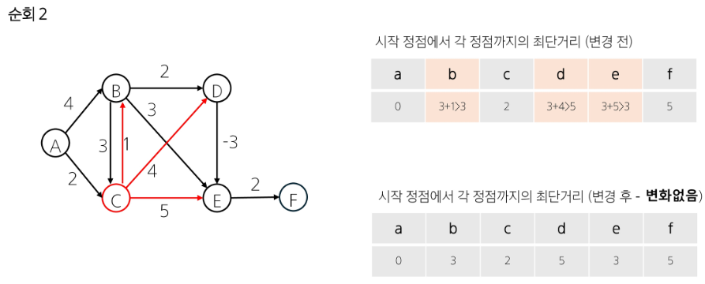

  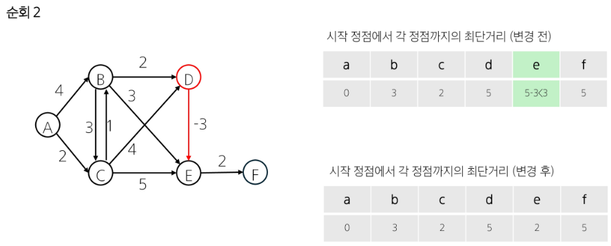

  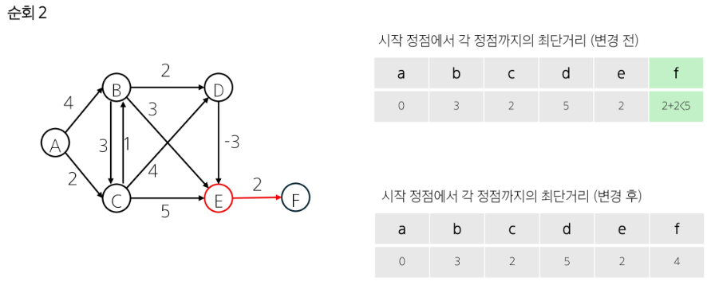

  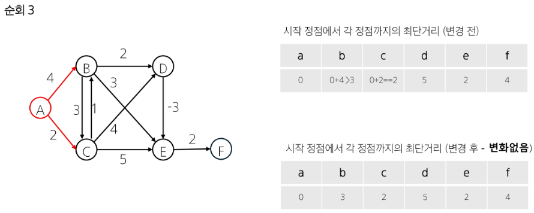

  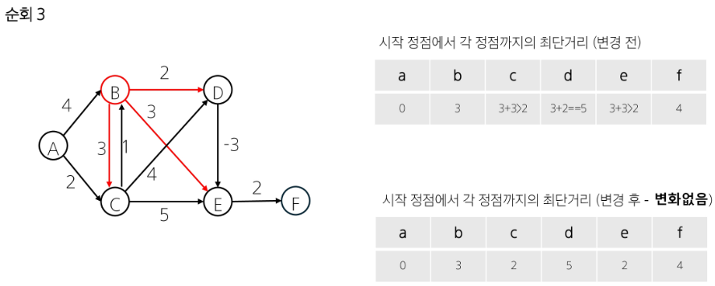

  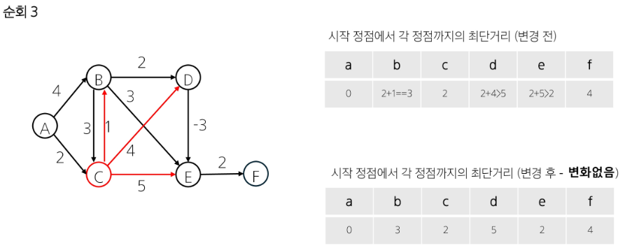

  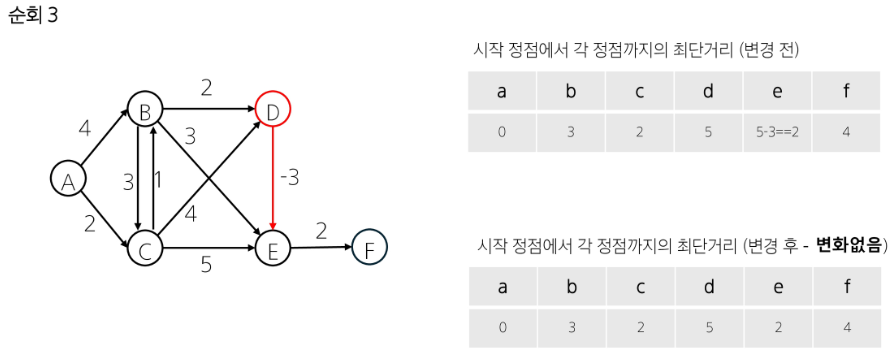

  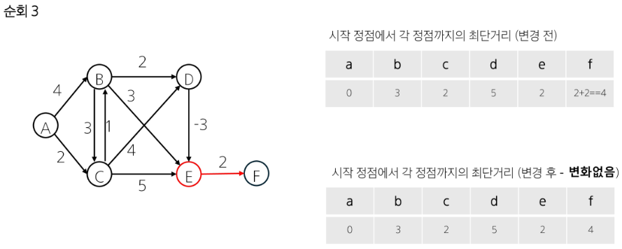

  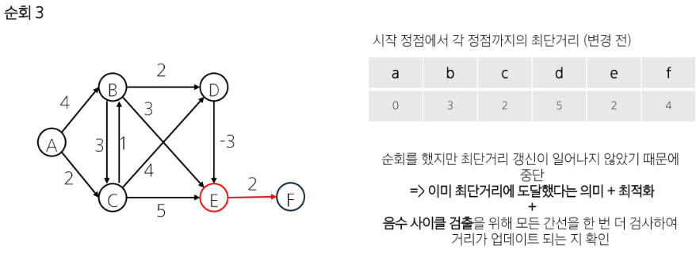


### 벨만-포드 알고리즘 구현
```python
def bellman_ford(graph, start):
    n = len(graph)  # 정점의 수 

    # 모든 노드에 도달하는데 걸리는 거리 무한대로 초기화
    distances = {v: float('inf') for v in graph}  # {'a':inf , 'b':inf, ...}

    # 시작 정점 거리 0 초기화
    distances[start] = 0    # {'a':0 , 'b':inf, ...}

    # 마지막 정점을 제외한 횟수만큼 순회
    for _ in range(n - 1):
        updated = False     # 이번 회차에 갱신여부 확인용
        
        # 각 정점별 인접 정점 순회
        for u in graph:
            for v, weight in graph[u].items():
                # 시작 정점 u에 도달하는 거리 + 다음 정점 가중치
                # 해당 정보가 도착 정점까지 걸리는 최소거리보다 작아야 갱신할 것임
                # 단, 시작정점 u가 무한대면 안된다.  -> 아직 도달 불능
                if distances[u] != float('inf') and distances[u] + weight < distances[v]:
                    distances[v] = distances[u] + weight    # 갱신
                    updated = True
        # 이번 회차에 전체 노드에 대한 조사를 했음에도 갱신이 없다?
        if updated == False:
            break
    
    # 음수 사이클 검사 
    for u in graph:
        for v, weight in graph[u].items():
            if distances[u] != float('inf') and distances[u] + weight < distances[v]:
                # 어? 조사 이미 끝났는데 왜 또 갱신 해야 하는 상황나옴?
                print('음수 사이클이 있습니다.')
                return False
    return distances

# 예시 그래프
graph = {
    'a': {'b': 4, 'c': 2},
    'b': {'c': 3, 'd': 2, 'e': 3},
    'c': {'b': 1, 'd': 4, 'e': 5},
    'd': {'e': -3},
    'e': {'f': 2},
    'f': {}
}

# 음수 사이클 예시 그래프
graph = {
    'a': {'b': 4, 'c': 2},
    'b': {'c': -3, 'd': 2, 'e': 3},
    'c': {'b': 1, 'd': 4, 'e': 5},
    'd': {'e': -3},
    'e': {'f': 2},
    'f': {}
}

# 시작 정점 설정
start_vertex = 'a'

# 벨만-포드 알고리즘 실행
result = bellman_ford(graph, start_vertex)

print(f"'{start_vertex}': {result}")
```

- 벨만-포드 코드 정리
  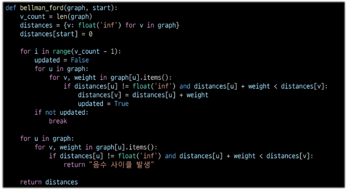
  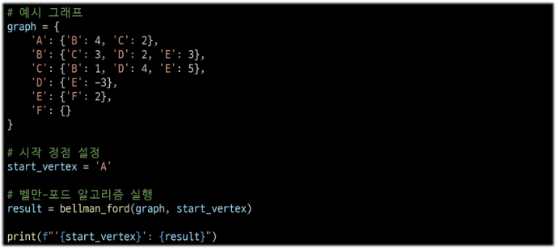


## Floyd-Warshall Algorithm
### 플로이드-워셜 알고리즘
모든 정점 쌍 간의 최단 경로를 구하는 알고리즘으로, 동적 프로그래밍을 사용하여 최단 경로를 점진적으로 갱신함

- 음수 가중치가 있어도 정상적으로 동작(음수 사이클은XX)
- 다익스트라 알고리즘과 시간 복잡도가 동일하지만 구현이 간단함
  - 다익스트라, 벨만포드는 정점과 정점간의 최단경로를 구하는 알고리즘

### 플로이드-워셜 알고리즘 동작 원리
- 동적 계획 알고리즘으로 모든 쌍 최단 경로 문제를 해결하려면 먼저 부분문제들을 찾아야함
  - 이를 위해 일단 그래프의 정점의 수가 적을 때를 생각해보자
  - 그래프에 3개의 정점이 있는 경우, 정점 i에서 정점 j까지의 최단 경로를 찾으려면 2가지 경로,
    - 즉, 정점 i에서 정점 j로 직접 가는 경로와 정점 1을 경유하는 경로 중에서 짧은 것을 선택하면 됨

      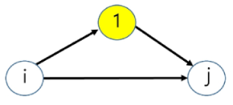

  - 또 하나의 중요한 아이디어는 경유 가능한 정점들을 정점 1로부터 시작하여, 정점 1과 2, 그 다음엔 정점 1,2,3으로 하나씩 추가하여, 마지막에는 정점 1~n까지의 모든 정점을 경유 가능한 정점들로 고려하면서 모든 쌍의 최단 경로의 거리를 계산(DP)

- 부분문제 정의: 단, 입력 그래프의 정점을 각각 1, 2, 3, …, n이라 하자.
  - `D_{ij}^k = 정점 {1, 2, …, k}`만을 경유 가능한 정점들로 고려하여, 정점 i로부터 정점 j까지의 모든 경로 중에서 가장 짧은 경로의 거리

- 여기서 k ≠ i, k ≠ j이고, k = 0인 경우, 정점 0은 그래프에 없으므로 어떤 정점도 경유하지 않는다는 것을 의미함
  - 따라서 `D_{ij}^0`은 입력으로 주어지는 간선 (i, j)의 가중치임
  - `D_{ij}^1`은 i에서 정점 1을 경유하여 j로 가는 경로와 i에서 j로 직접 가는 경로 중에서 짧은 거리를 의미
  - 따라서 모든 쌍 i와 j에 대하여 `D_{ij}^1`을 계산하는 것이 가장 작은 부분문제들이다. (단 i ≠ 1, j ≠ 1)

    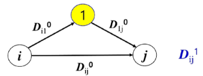

- 그다음엔 i에서 정점 2를 경유하여 j로 가는 경로의 거리와 `D_{ij}^1` 중에서 짧은 거리를 `D_{ij}^2`로 정함
  - 단, 정점 2를 경유하는 경로의 거리는 `D_{i2}^1 + D_{2j}^1`
  - 모든 쌍 i와 j에 대하여 `D_{ij}^2`를 계산하는 것이 그다음으로 큰 부분문제들이다. (단 i ≠ 2, j ≠ 2)

    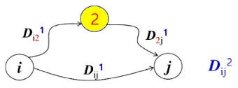

- k를 계속 늘려 정점 i에서 정점 k를 경유하여 j로 가는 경로의 거리와` D_{ij}^{k-1}` 중에서 짧은 거리를 `D_{ij}^k`로 정함
  - 단, 정점 k를 경유하는 경로의 거리는 `D_{ik}^{k-1} + D_{kj}^{k-1}` 이고, i ≠ k, j ≠ k 이다.

    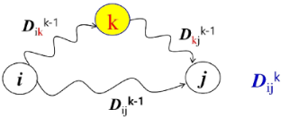

- 이런 방식으로 k가 1에서 n이 될 때까지 `D_{ij}^k`를 계산해서
  - `D_{ij}^n`, 즉 모든 정점을 경유 가능한 정점들로 고려한 모든 쌍 i와 j의 최단 경로의 거리를 찾는 방식이 플로이드-워셜의 모든 쌍 최단 경로 알고리즘

    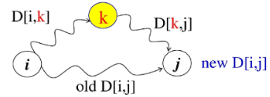

### 플로이드-워셜 알고리즘 동작 과정
- 배열 D의 원소들이 k가 1부터 5까지 증가함에 따라서 갱신되는 것을 살펴보자

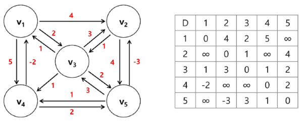

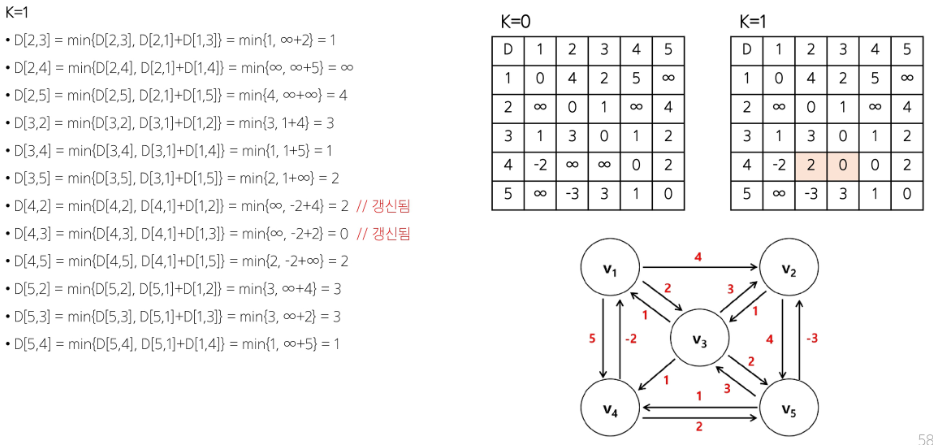

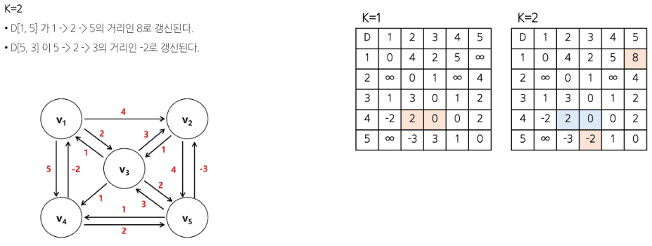

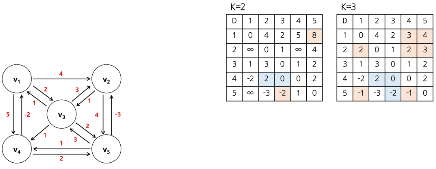

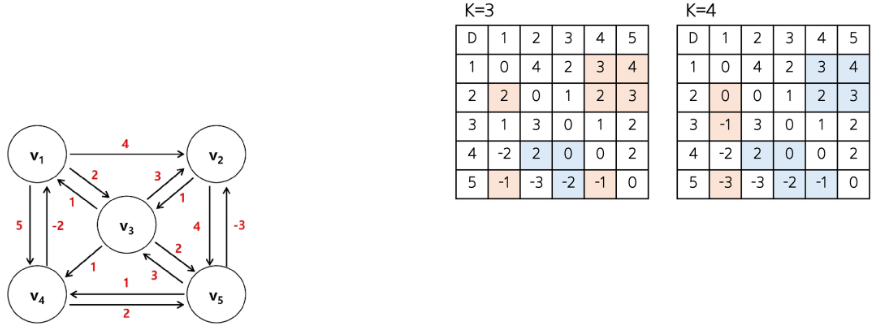

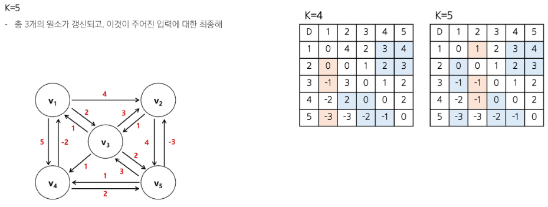

### 플로이드-워셜 알고리즘 구현
```python
def floyd_warshall(graph):
    n = len(graph)  # 전체 노드의 개수
    # 모든 정점을 경유 정점으로 고려
    for k_node in range(n):
        for start in range(n): # 시작노드
            for end in range(n): # 도착노드
                # Dik + Dkj < Dij
                Dik = graph[start][k_node]  # i에서 k로 가는 거리
                Dkj = graph[k_node][end]    # k에서 j로 가는 거리
                Dij = graph[start][end]     # i에서 j로 가는 거리
                if Dik + Dkj < Dij:         # k를 경유하는게 더 싸면
                    graph[start][end] = Dik + Dkj   # 그걸로 갱신
    # 음수 사이클 확인
    for i in range(n):
        if graph[i][i] < 0:
            print('음수 사이클이 존재함')
            break
    return graph

INF = float('inf')  # 무한대

# 예시 그래프의 인접 행렬
# adj_matrix = [
#     [0, 4, 2, 5, INF],
#     [INF, 0, 1, INF, 4],
#     [1, 3, 0, 1, 2],
#     [-2, INF, INF, 0, 2],
#     [INF, -3, 3, 1, 0]
# ]

# 음수 사이클 확인
adj_matrix = [
    [0, -4, 2, 5, INF],
    [INF, 0, 1, INF, 4],
    [1, 3, 0, 1, 2],
    [-2, INF, INF, 0, 2],
    [INF, -3, 3, 1, 0]
]

result = floyd_warshall(adj_matrix)

# 최단 거리 행렬 출력 
for row in result:
    print(row)
```

- 플로이드-워셜 코드 정리
  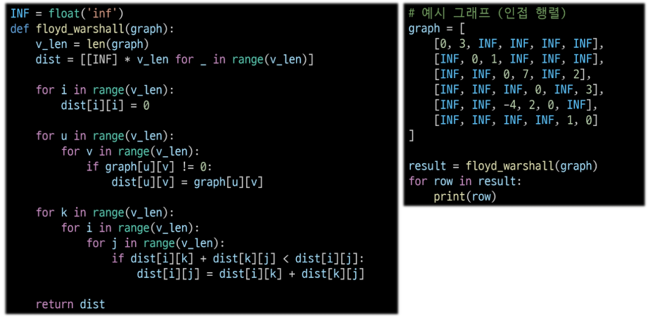

