# DP
### 문제 제시: 토끼 수 구하기


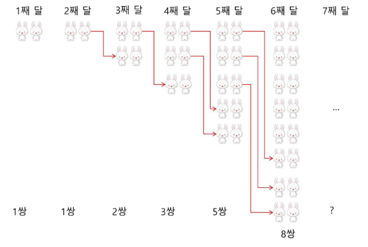

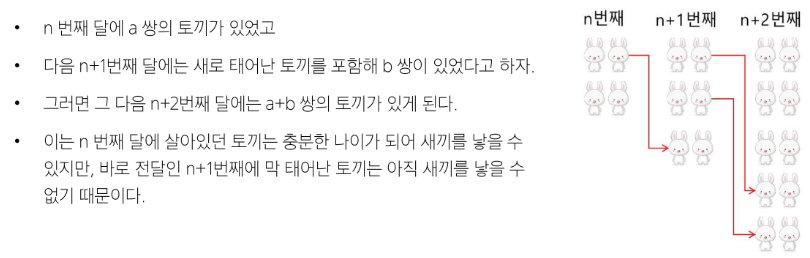

- f(n)을 n번째 달의 토끼 수라고 하면
  - `f(n+2) = f(n) + f(n+1)`이 성립하고, 이것이 피보나치 수열

- 피보나치 수열 재귀 호출
  - 이전의 두 수 합을 다음 항으로 하는 수열을 피보나치라고 함
    - `0, 1, 1, 2, 3, 5, 8, 13..`
  - 피보나치 수열의 i번째 값을 계산하는 함수 F를 정의하면 아래와 같다

    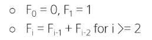
  - 이 정의로부터 피보나치 수열의 i번째 항을 반환하는 함수를 재귀함수라고 할 수 있음
  - 피보나치 수를 구하는 재귀함수
    ```python
    def fibo(n):
        if n < 2:
            return n
        else:
            return fibo(n-1) + fibo(n-2)
    ```
    - 피보나치 수를 구하는 재귀함수의 문제점 => '엄청난 중복 호출이 존재'

      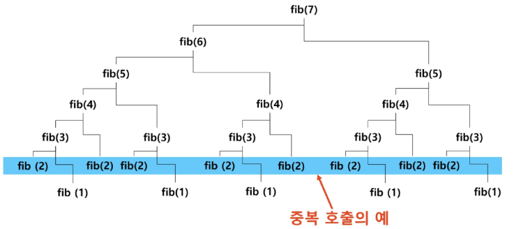
      ```python
      def fibonacci(n):
          global cnt
          cnt += 1
          print(cnt)

          # 기본 규칙: n이 2미만 일때, n을 반환.
          if n < 2:
              return n

          # 귀납 규칙: n이 2 이상일 때, F(n-1) + F(n-2)를 반환
          else:
              return fibonacci(n - 1) + fibonacci(n - 2)

      cnt = 0
      print(fibonacci(100)) # 계-속 돌아감
      print(cnt)  # 20분동안 돌려서 이백몇십만번 돌아가는 중..
      ```

- 메모이제이션(memoization)
  - 컴퓨터 프로그램을 실행할 때 이전에 계산한 값을 메모리에 저장해서 매번 다시 계산하지 않도록 하여 전체적인 실행 속도를 빠르게 하는 기술
  - 동적 계획법(Dynamic Programming)의 핵심 기술
  - 피보나치 수를 메모이제이션으로 구현
    - memo(n)의 값을 계산하자마자 저장하면 (memoize), 실행시간을 O(n)으로 줄일 수 있음
    ```python
    def fibo(n):
        global cnt  # 함수 호출 횟수 체크용
        cnt += 1

        if n >= 2 and memo[n] == 0:
            # memo[n] = memo[n-1] + memo[n-2]
            memo[n] = fibo(n-1) + fibo(n-2)
        return memo[n]

    memo = [0] * (101)  # 0부터 100까지 들어갈 배열 생성

    # f(100)을 얻기 위해서는 f(99), f(98)을 얻을 수 있어야 하듯
    # 기저 조건을 미리 넣어줘야 함(초기값 넣기)
    memo[0] = 0
    memo[1] = 1

    cnt = 0
    result = fibo(100)
    print(result)
    print(cnt)  # 199번 호출함!
    ```
    - 코드 정리

      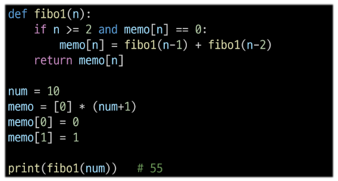

    - 이러한 방식을 동적 계획법에서 '탑 다운 접근 방식'이라고 함
  
  - 메모이제이션을 활용한 탑 다운 방식의 동적 계획법
    - '탑' (ex. fib(100)) 번째 문제를 해결하기 위해 '다운' (ex. fib(99), .., fib(1)) 번째 문제로 내려가서 해결하는 방식
   
  - N번째 값을 구하기 위해서는 N-1, N-2번째 값이 필요함
    - N-1, N-2를 알고있으면 되지 않을까? -> 리스트에 담아놓자(기록)
    - 완전탐색 했을 때 이전에 구했던 값을 다시 구해야하진 않는지 체크
      - 만약 있다면, 기록해놓고 꺼내쓰자(메모이제이션)
    
  - 메모리제이션 단점
    - 추가적인 메모리 공간이 필요함
    - 재귀 함수 호출로 인한 시스템 호출 스택을 사용하게 되고, 실행 속도 저하 또는 오버플로우가 발생할 수 있음
    - ex. 구하려는 피보나치 수가 충분히 커지게 되면(fibo(10000)) 1000번보다 더 깊은 재귀 스택이 쌓여나가서 문제 발생함

      
    - 해결책은? 우리가 재귀 스택 최대치보다 더 내려갈 수 있도록 for문 방식 사용하자
    - 메모이제이션은 재귀함수 말고 반복문으로도 구현 가능
      ```python
      def fibo(N):
          if N <= 1:      # 0이거나 1이면 N return
              return N
          
          # 함수 내에서 저장할 공간을 생성
          dp = [0] * (N+1)
          dp[1] = 1   # 0번째는 0이니 1번째만 1로 초기화

          for i in range(2, N+1):   # 재귀를 반복문으로 바꾸자
              dp[i] = dp[i-1] + dp[i-2]
          return dp[N]

      result = fibo(100)
      print(result)
      ```
    - 값을 구하기 위한 공간을 N개 만들었음
    - 초깃값 설정(0, 1)
    - index 2부터 N까지 연산 => O(N-2) => O(N)

# DP(Dynamic Programming)
동적 계획 알고리즘은 그리디 알고리즘과 같이 최적화 문제를 해결하는 알고리즘

- 입력 크기가 작은 부분 문제들을 모두 해결한 후(bottom) 그 해들을 이용하여 보다 큰 크기의 부분 문제를 해결(up)하여, 최종적으로 원래 주어진 입력의 문제를 해결하는 알고리즘

**※ 탑 다운 vs 바텀 업**
- 탑다운 (Top-Down, 재귀 함수)
  - 점화식 기반의 재귀 호출로 큰 문제에서 작은 문제로 내려감
  - 작은 문제의 결과는 **메모이제이션(캐싱)**을 통해 저장
  - 메모이제이션(Memoization)
    - **재귀 방식(top-down)**에서 쓰이는 "결과 저장 기법"
    - 큰 문제를 풀다 작은 문제를 호출했을 때, 이미 풀어본 적 있으면 저장해둔 결과를 바로 반환
    - 실행 과정에서 "필요한 부분만" 계산한다는 특징이 있음
  - 코드 구현은 보통 간단하고 직관적임
  - 단점
    - 재귀 호출로 인해 스택 메모리 사용, 호출 깊이에 따라 StackOverflow 가능

- 바텀업 (Bottom-Up, 반복문)
  - 작은 문제부터 차례차례 계산하여 테이블을 채움
  - 테뷸레이션(Tabulation)
    - **반복문 방식(bottom-up)**에서 쓰이는 "결과 저장 기법"
    - 작은 문제부터 차례대로 배열/테이블을 채워 올라가면서 큰 문제를 해결
    - 항상 "작은 문제부터 차례대로 모두" 계산한다는 특징이 있음
  - 재귀가 아닌 반복문으로 구현하므로 스택 오버플로우 위험 없음
  - 보통 실행 속도는 탑다운보다 빠른 경우가 많음 (호출 스택 오버헤드 없음)
  - 저장 공간 자체(dp 배열)은 탑다운, 바텀업 둘 다 동일하지만 
    - 탑다운은 추가적으로 스택 프레임 공간을 더 씀

**※ 스택 메모리와 재귀 호출 횟수**

-> 재귀 호출 횟수 = 함수 실행의 깊이(스택 프레임 개수)

-> 스택 메모리 = 그 깊이에 비례해서 쓰이는 실제 메모리 공간

### 동적 계획법의 적용 요건
- 동적 계획법을 적용하려는 문제는 필히 아래와 같은 요건을 가지고 있어야 함
  - 중복 부분문제 구조(Overlapping subproblems)
    - 부분 문제의 결과값이 다른 문제를 해결할 때 필요한 형태
  - 최적 부분문제 구조(Optimal substructure)
    - ex. 그리디

  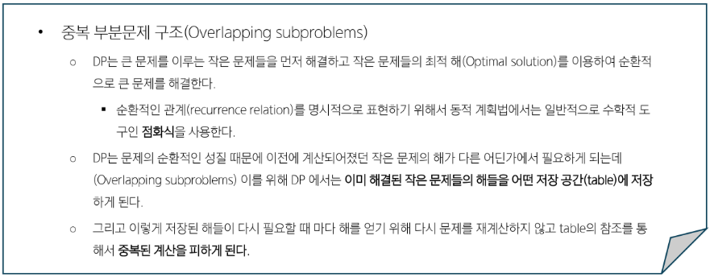
  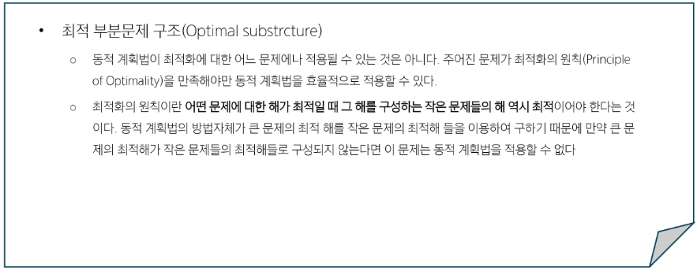

- 최적의 원칙이 적용되지 않는 예: **최장경로(Longest Path) 문제**

  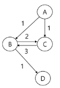
  - A에서 D로의 최장 경로는 `[A, C, B, D]`
  - 그러나, 이 경로의 부분 경로인 A에서 C로의 최장경로는 [A, C]가 아니라 `[A, B, C]`
  - 최적의 원칙이 적용되지 않음
  - 따라서 최장경로문제는 Dp로 해결할 수 없음
  - 그럼 어떨 때 DP를 적용할 수 있을까?

### 3단계 DP 적용 접근 방법
1. 최적해 구조의 특성을 파악하기
    - 문제를 부분 문제로 나눈다
2. 최적해의 값을 재귀적으로 정의하기
    - 부분 문제의 최적해 값에 기반하여 문제의 최적해 값을 정의한다
3. 상향식 방법으로 최적해의 값을 계산하기
    - 가장 작은 부분 문제부터 해를 구한 뒤 테이블에 저장한다
    - 테이블에 저장되어 있는 부분 문제의 해를 이용하여 점차적으로 상위 부분 문제의 최적해를 구한다(상향식 방법)

- 분할 정복과 동적계획법 비교
  - 분할 정복
    - 연관 없는 부분 문제로 분할
    - 부분 문제를 재귀적으로 해결
    - 부분 문제의 해를 결합(combine)
    - ex. 병합 정렬, 퀵 정렬
  - DP
    - 부분 문제들이 '연관 없으면 적용할 수 없음'
    - 즉, 부분 문제들은 더 작은 부분 문제들을 공유함
    - 모든 부분 문제를 한 번만 계산하고 결과를 저장, 재사용함
    - DP에는 부분문제들 사이에 의존적 관계가 존재함
    - ex. E, F, G의 해가 C를 해결하는 데 사용되어지는 관계가 있음
  - 이런 관계는 문제에 따라 다르고, 대부분의 경우 뚜렷이 보이지 않아서 함축적인 순서(implicit order)라고 함
  - 분할 정복은 하향식 방법, DP는 상향식 방법으로 접근!!

    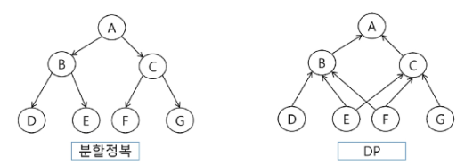
  
- 피보나치 수 DP 적용

  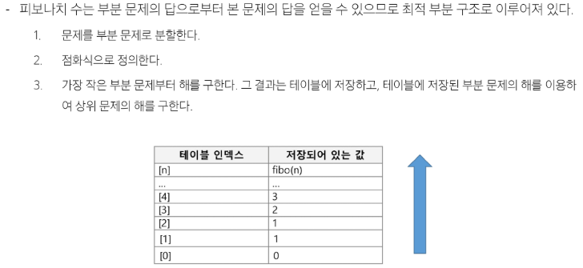
  - 코드 정리

    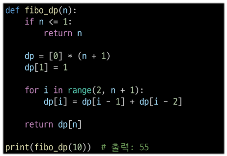
  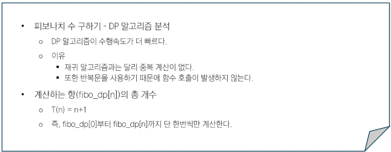

## DP - 이항계수
- 이항정리

  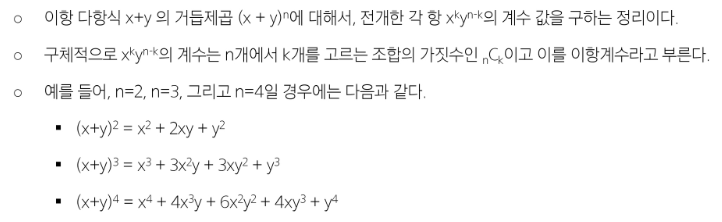
  - `(x+y)ⁿ`을 전개한 각 항 `x^(n-k)y^k`의 계수를 구하려고 할 때
    - x,y의 값보다 x를 몇개 선택했는지 또는 y를 몇개 선택했는지가 중요
  - ex. `(x+y)² = x²+2xy+y²`를 구할 때 y를 0, 1, 2개 선택하는 경우를 생각해보자
    - k=0일 때(y를 하나도 선택하지 않았을 때) x²이 되고, 계수는 1이 됨
    - k=1일 때(y를 1개 선택했을 때) xy가 되고, 계수는 2가 됨
    - k=2일 때(y를 2개 선택했을 때) y²가 되고, 계수는 1이 됨
    - 이 때의 N은 2
  - 즉, N=2일 때 k=0, 1, 2일 때에 대한 조합이 됨
    - N=2일 때 k=0(아무 원소도 선택하지 않은 경우의 수)는 `1` (공집합)
    - N=2일 때 k=1(원소 1개를 선택했을 때 만들 수 있는 경우의 수)는 `2` (1, 2)
    - N=2일 때 k=2(원소 2개를 선택했을 때 만들 수 있는 경우의 수)는 `1` (12)

- 이항계수 구하는 공식

  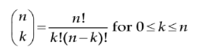
- 계산량이 많은 `n!`이나 `k!`을 계산하지 않고 이항계수를 구하기 위해 통상 다음 수식을 사용함

  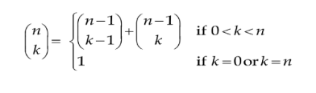
    - 점화식 구했으니 코드 작성하자
- 이항계수 `nCk`를 구하는 재귀함수
  ```python
  def bino(n, k):
      if k == 0 or k == n:
          return 1    
      return bino(n-1, k-1) + bino(n-1, k)

  n = 5
  k = 2
  print(bino(n, k))  # 출력: 10
  ```
  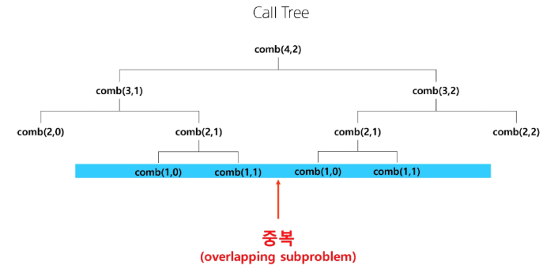
  - 바텀업으로 바꾸자

- 이항계수를 바텀업 방식으로 구현
  ```python
  def bino(n, k):
      dp = [[0 for _ in range(k+1)] for _ in range(n+1)]   
      # n+1, k+1 크기의 이차원 리스트가 필요함
      # n도 변하고, k도 변함
      # 한 행은 전체 k의 개수, 그 행이 n개 있는 것
      '''
          [0, 0, 0, 0]
          [0, 0, 0, 0]
          [0, 0, 0, 0]
          [0, 0, 0, 0]

      '''
      for i in range(n+1):
          # k는 0부터 n까지 갈 수 있음 (x+y)²일 때 k가 2를 넘지XX
          '''
              [1, 0, 0, 0]
              [1, 1, 0, 0]
              [1, 2, 1, 0]
              [1, 3, 3, 1]  
            # n=4이고 k=1이라면 k=2,3,4인 경우는 볼 필요가 없음
            # 즉, j의 범위를 현재 돌고있는 i와 k 중 작은 값까지만 반복
          '''
          for j in range(min(i, k) + 1):  
              if j == 0 or i == j:
                  # j=0이면 k=0이므로 공집합 => 경우의 수: 1
                  # n == k일 때도 항상 1
                  dp[i][j] = 1
              else:
                  dp[i][j] = dp[i-1][j] + dp[i-1][j-1]
      '''
        [1, 0, 0, 0, 0] -> (x+y)^0
        [1, 1, 0, 0, 0] -> (x+y)¹
        [1, 2, 1, 0, 0] -> (x+y)²
        [1, 3, 3, 1, 0] -> (x+y)³
        [1, 4, 6, 4, 1] -> (x+y)⁴
      '''
        # 이항 계수들이 모여있는 저 모양을 파스칼 삼각형이라고 부름
      return dp[n][k]

  n = 5 
  k = 2
  print(bino(n, k))  # 출력: 10
  ```
  - 동적 계획법을 적용한 이항계수 계산 `O(n x k)` 코드 정리

    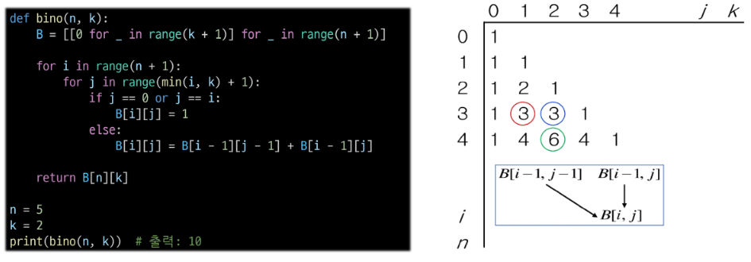
  
## DP - 동전 거스름돈
- 동전의 종류
  - 1원, 4원, 6원
- 8원을 거슬러주려 한다. 최소 몇 개의 동전을 거슬러 주면 되나?
  - 그리디 방법의 접근
    - 6원, 1원, 1원
  - 최적은?
    - 4원, 4원
  - 그리디 방법이 항상 최적해를 구하는 것은 아니다. 어떻게 풀어야 하나?
    - 동적 계획법으로 접근해보자

- 재귀적인 8원 잔돈에 대한 알고리즘(ex. 깊이 우선 탐색으로 완전탐색)
  - 3가지 동전 각각을 선택해서 재귀적으로 해결

    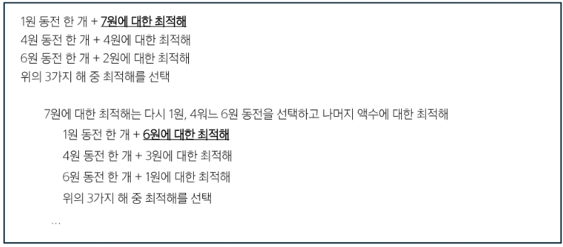
    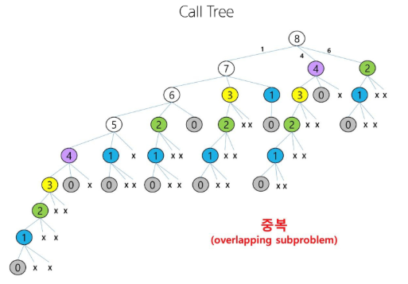
    - 서브트리가 중복해서 사용되는 상황 발견
    - 완탐으로 해결하려고 봤더니 작은 문제를 해결하기 위한 부분 문제들이 중복 부분문제 형식으로 처리되고 있네? DP 처리 가능!
    - 3가지 동전 각각을 선택해서 '재귀적으로' 해결 = 최적해를 재귀 방식으로 해결한다
    - 즉, 모든 문제들을 해결하기 위한 나의 풀이 방식이 모든 상황에서 동일하게 '반복적으로 '실행될 수 있다(최적 부분 문제를 구할 수 있다)
    - 최적 부분 문제를 구하는 방식으로 했더니 중복 부분 문제가 있더라
    - 최적 부분 문제 해결하는 방식에 중복 부분 문제 방식을 처리하기 위한 메모이제이션 방식으로 만들 수 있겠다
    - 상향식 DP 접근 해보자

- DP 접근: 상향식

  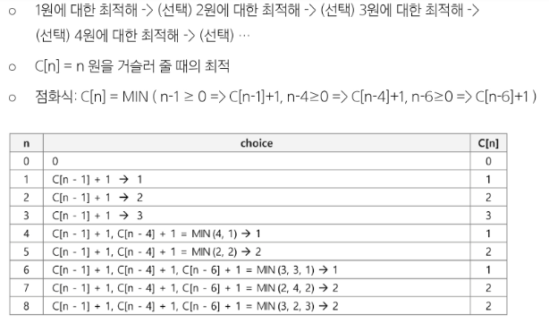
  
  ```python
  def coin_change(coins, amount):
      # 이전에는 이곳의 값을 0으로 초기화
      # 이전에 구했던 식과 이번에 구한 식의 최저값을 구할 것이므로
      # 충분히 큰 값으로 초기화 필요
      dp = [amount + 1] * (amount + 1)
      dp[0] = 0

      for i in range(1, amount + 1):  # 1원부터 마지막까지
          for coin in coins:  # 내가 가진 모든 코인을 가지고 조사
              if coin <= i: 
                  dp[i] = min(dp[i], dp[i-coin] + 1)
                  # dp[i]: 충분히 큰 값(전부 1원으로 때려박았을 때)
                  # dp[i-coin] + 1 :
                    # dp[i-coin] -> 내가 선택한 코인만큼 뺐을 때 남아있을 거스름돈
                      # 그 거스름돈 번째에서 구할 수 있는 최적해(옛날에 구해놨을 것임)
                    # + 1 -> 이번 경우를 선택한 경우의 수
      return dp[amount]

  coins = [1, 4, 6]  # 사용 가능한 동전의 종류
  amount = 8  # 만들어야 할 금액

  print(coin_change(coins, amount))
  ```

  - 동전 거스름돈 DP 코드 정리

    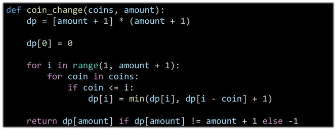

- 배낭 문제 DP로 풀기
  - 풀이1(2차원 리스트)
  ```python
  def knapsack(weights, values, capacity):
      n = len(weights)  # 물건의 개수
      # DP 테이블 초기화: (n+1) x (capacity+1) 크기의 2차원 리스트를 0으로 초기화
      K = [[0 for _ in range(capacity + 1)] for _ in range(n + 1)]

      # DP 테이블 채우기
      for i in range(1, n + 1):  # 1부터 n까지
          for w in range(1, capacity + 1):  # 1부터 capacity까지
              if weights[i - 1] > w:  # 현재 물건을 담을 수 없는 경우
                  K[i][w] = K[i - 1][w]  # 이전 물건까지의 최대 가치를 그대로 가져옴
              else:  # 현재 물건을 담을 수 있는 경우
                  # 현재 물건을 담는 경우와 담지 않는 경우 중 최대 가치를 선택
                  K[i][w] = max(values[i - 1] + K[i - 1][w - weights[i - 1]], K[i - 1][w])
                  # 점화식: values[i - 1] + K[i - 1][w - weights[i - 1]], K[i - 1][w]

      return K[n][capacity]  # 최대 담을 수 있는 가치 반환


  weights = [10, 20, 30]  # 각 물건의 무게
  values = [60, 100, 120]  # 각 물건의 가치
  capacity = 50  # 배낭의 용량

  max_value = knapsack(weights, values, capacity)
  print(f"배낭에 담을 수 있는 물건들의 최대 가치: {max_value}")
  ```

  - 풀이2
  ```python
  def knapsack_optimized(weights, values, capacity):
      # 1차원 DP 테이블 초기화
      # dp[w]는 현재 용량 w에서의 최대 가치를 저장
      dp = [0] * (capacity + 1)

      # 물건들을 하나씩 순회
      for i in range(len(weights)):
          # 용량 w를 capacity부터 1까지 역순으로 순회
          for w in range(capacity, weights[i] - 1, -1):
              # 현재 물건을 담는 경우와 담지 않는 경우 중 더 큰 가치를 선택
              dp[w] = max(dp[w], values[i] + dp[w - weights[i]])

      return dp[capacity]

  # 예시
  weights = [10, 20, 30]
  values = [60, 100, 120]
  capacity = 50

  max_value = knapsack_optimized(weights, values, capacity)
  print(f"최적화된 배낭 문제의 최대 가치: {max_value}")
  ```

※ DP 사용을 위해 기억해야 할 것

-> 최적해 구조 특성 파악(이 문제에 규칙 있는지 찾기)

-> 규칙 있는지 찾기위해 문제를 작은 문제로 쪼개서 작은 문제를 해결할 수 있는지 본다

-> 규칙 찾았으면 재귀적으로 풀어본다(점화식을 만들어본다)

-> 점화식을 재귀로 풀었다면 불필요한 스택 메모리 공간 차지하지 않기 위해(충분히 큰 문제 풀기 위해) 상향식으로 바꿔본다
