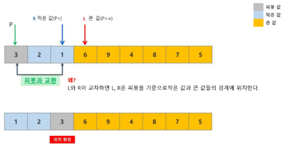

# 정렬
## 버블정렬(Bubble Sort)
인접한 두 개의 원소를 비교하며 자리를 계속 교환하는 방식

- 정렬과정
  1. 첫 번째 원소부터 인접한 원소끼리 계속 자리를 교환하면서 맨 마지막 자리까지 이동한다
  2. 한 단계가 끝나면 가장 큰 원소가 마지막 자리로 정렬된다
  3. 교환하며 자리를 이동하는 모습이 물 위에 올라오는 거품 모양과 같다고 하여 `버블 정렬` 이라고 한다

- 시간 복잡도: `O(n²)`

### 버블 정렬 과정
- ex. [55, 7, 78, 12, 42]를 오름차순 정렬하는 과정
  - 첫 번째 패스

    
  - 두 번째 패스

    
  - 세 번째 패스
    
    
  - 네 번째 패스

    
    - 정렬 끝

- 버블정렬 알고리즘 코드
  ```python
  def bubble_sort(arr):
      n = len(arr)  # 배열의 길이

      for i in range(n):
          for j in range(0, n - i - 1):  # 마지막 i개 요소는 이미 정렬되어 있으므로
                                          # 비교에서 제외
              if arr[j] > arr[j + 1]:  # 현재 요소가 다음 요소보다 큰 경우
                  arr[j], arr[j + 1] = arr[j + 1], arr[j]  # 두 요소를 교환

  arr = [55, 7, 78, 12, 42]
  bubble_sort(arr)
  print(arr)  # [7, 12, 42, 55, 78]
  ```

## 삽입정렬(Insertion Sort)
리스트를 정렬/미정렬로 나누고, "미정렬" 부분의 원소를 "정렬된" 부분의 올바른 위치에 삽입

- 정렬과정
  1. 정렬할 자료를 두 개의 부분집합 S와 U로 가정
    - 부분집합 S: 정렬된 앞부분의 원소들
    - 부분집합 U: 아직 정렬되지 않은 나머지 원소들
  2. 정렬되지 않은 부분집합 U의 원소를 하나씩 꺼내서 이미 정렬되어 있는 부분집합 S의 마지막 원소부터 비교하면서 위치를 찾아 삽입한다
  3. 삽입 정렬을 반복하면서 부분집합 S의 원소는 하나씩 늘리고 부분집합 U의 원소는 하나씩 감소하게 된다
    - 부분집합 U가 공집합이 되면 삽입정렬 완성

- 시간복잡도: `O(n²)`

### 삽입 정렬 과정
- ex. [69, 10, 30, 2, 16, 8, 31, 22]를 삽입 정렬하는 과정
  - 초기상태: 첫 번째 원소는 정렬된 부분집합 S로 생각, 나머지 원소들은 정렬되지 않은 부분집합 U로 생각한다

    
  - U의 첫 번째 원소 10을 S의 마지막 원소 69과 비교할 때, 10 < 69 이므로 원소 10은 69의 앞에 위치
  - 더이상 비교할 S의 원소가 없으므로 찾은 위치에 원소 10 삽입

    
  - U의 첫 번째 원소 30을 S의 마지막 원소 69과 비교할 때, 30 < 69 이므로 69의 앞자리 원소 10과 비교
  - 30 > 10 이므로 원소 10과 69 사이에 삽입

    
  - U의 첫 번째 원소 2를 S의 마지막 원소 69과 비교할 때, 2 < 69 이므로 69의 앞자리 원소 30과 비교
  - 2 < 30 , 2 < 10 이므로 최종적으로 가장 앞자리에 삽입

    
  - U의 첫 번째 원소 16을 S의 마지막 원소 69과 비교할 때, 16 < 69 이므로 69의 앞자리 원소 30과 비교
  - 비교를 반복하여 10과 30 사이에 삽입

    
  - U의 첫 번째 원소 8을 S의 마지막 원소 69과 비교할 때, 8 < 69 이므로 69의 앞자리 원소 30과 비교
  - 비교를 반복하여 2와 10 사이에 삽입

    

  - U의 첫 번째 원소 31을 S의 마지막 원소 69과 비교할 때, 31 < 69 이므로 69의 앞자리 원소 30과 비교
  - 비교를 반복하여 30와 69 사이에 삽입

    

  - U의 첫 번째 원소 22을 S의 마지막 원소 69과 비교할 때, 22 < 69 이므로 69의 앞자리 원소 31과 비교
  - 비교를 반복하여 16과 69 사이에 삽입

    

- 삽입정렬 알고리즘 코드
  ```python
  def insertion_sort(arr):
      n = len(arr)  # 배열의 길이

      for i in range(1, n):
          for j in range(i, 0, -1):
              if arr[j-1] > arr[j]:
                  arr[j-1], arr[j] = arr[j], arr[j-1]
              else:
                  break


  arr = [9, 5, 7, 1, 4]
  insertion_sort(arr)
  print(arr)  # [1, 4, 5, 7, 9]
  ```


## 카운팅정렬(Counting Sort)
항목들의 순서를 결정하기 위해 집합에 각 항목이 몇 개씩 있는지 세는 작업을 하여, 선형 시간에 정렬하는 효율적인 알고리즘

- 제한사항
  - 정수나 정수로 표현할 수 있는 자료에 대해서만 적용 가능
    - 각 항목의 발생 횟수를 기록하기 위해, 정수 항목으로 인덱스되는 카운트들의 배열을 사용하기 때문
  - 카운트들을 위한 충분한 공간을 할당하려면 집합 내의 가장 큰 정수를 알아야함

- 시간복잡도: `O(n+k)`
  - n: 리스트 길이
  - k: 정수의 최대값

### 카운팅 정렬 과정
- {0, 4, 1, 3, 1, 2, 4, 1}을 카운팅 정렬하는 과정
  - Data에서 각 항목들의 발생 횟수를 세고, 정수 항목들로 직접 인덱스되는 카운트 배열 counts에 저장한다

    
  - 정렬된 집합에서 각 항목의 앞에 위치할 항목의 개수를 반영하기 위해 counts의 원소를 조정한다
    
    
  - counts[1]을 감소시키고 Temps[3]에 1을 저장
    
    
  - counts[4]을 감소시키고 Temps[7]에 4를 저장

    
  - counts[2]을 감소시키고 Temps[4]에 2를 저장

    
  - counts[1]을 감소시키고 Temps[2]에 1을 저장

    
  - counts[3]을 감소시키고 Temps[5]에 3을 저장

    
  - counts[1]을 감소시키고 Temps[1]에 1을 저장

    
  - counts[4]을 감소시키고 Temps[6]에 4를 저장

    
  - counts[0]을 감소시키고 Temps[0]에 0를 저장

    
    - 정렬완료

- 카운팅 정렬 알고리즘 코드
  ```python
  def counting_sort(arr, max_value):
      n = len(arr)  # 배열의 길이
      count_arr = [0] * (max_value + 1)  # 최대값 + 1을 기준으로 임시 공간 할당
      result = [0] * n  # 정렬 결과를 저장할 변수

      # 각 요소의 빈도 계산
      for num in arr:
          count_arr[num] += 1

      # 각 숫자가 들어가야 할 인덱스를 저장하기 위해서, 누적합을 계산
      for i in range(1, max_value + 1):
          # dp와 같은 느낌으로
          # 이전까지 나온 수들의 합이 i가 놓을 수 있는 위치
          count_arr[i] += count_arr[i - 1]

      # 거꾸로 순회하면서, 현재 자신이 놓여야 하는 위치가 값을 놓고
      # 놓을 수 있는 위치를 -1 함
      for i in range(n - 1, -1, -1):
          val = arr[i]
          result[count_arr[val] - 1] = val
          count_arr[val] -= 1

      return result  # 정렬된 결과 반환

  arr = [0, 4, 1, 3, 1, 2, 4, 1]
  result = counting_sort(arr, 4)
  print(result)  # [0, 1, 1, 1, 2, 3, 4, 4]
  ```


## 선택정렬(Selection Sort)
주어진 자료들 중 가장 작은 값의 원소부터 차례대로 선택하여 위치를 교환하는 방식

- 정렬과정
  1. 주어진 리스트 중 최소값을 찾는다
  2. 그 값을 리스트의 맨 앞에 위치한 값과 교환한다
  3. 맨 처음 위치를 제외한 나머지 리스트를 대상으로 위의 과정을 반복한다

- 시간복잡도: `O(n²)`

### 선택 정렬 과정
- 주어진 리스트에서 최소값을 찾는다
  - 리스트의 맨 앞에 위치한 값과 교환

    
  - 주어진 리스트에서 최소값을 찾는다
  - 리스트의 맨 앞에 위치한 값과 교환

    

  - 미정렬 리스트에서 최소값을 찾는다
  - 리스트의 맨 앞에 위치한 값과 교환

    

  - 미정렬 리스트에서 최소값을 찾는다
  - 리스트의 맨 앞에 위치한 값과 교환

    

- 선택 정렬 알고리즘 코드
  ```python
  def selection_sort(arr):
      n = len(arr)  # 배열의 길이

      # 맨 마지막 값은 굳이 비교할 필요가 없으므로, n-1까지만 순회
      for i in range(n - 1):
          min_idx = i  # 현재 위치를 최소값으로 가정

          # 이미 정렬된 원소 다음 위치부터 최소값 찾기
          for j in range(i + 1, n):
              if arr[j] < arr[min_idx]:  # 현재 요소가 최소값보다 작은 경우, 최소값 인덱스 갱신
                  min_idx = j

          arr[i], arr[min_idx] = arr[min_idx], arr[i]  # 최소값과 현재 위치의 요소를 교환

  arr = [64, 25, 10, 22, 11]
  selection_sort(arr)
  print(arr)  # [10, 11, 22, 25, 64]
  ```


제일 작은애 찾아서
몇번째에 있는지 알아내
걔를 언제 바꿀꺼냐? 다 조사한 다음에 마지막에!
내가 가진 모든 횟수에 대해 다 할건데
쓸데없는 조사 안하려면 확정된 애는 조사 대상에서 빼버리기


## 병합정렬(Merge Sort)
여러 개의 정렬된 자료의 집합을 병합하여 한 개의 정렬된 집합으로 만드는 방식

- 분할 정복 알고리즘 활용
  - 자료를 최소 단위의 문제까지 나눈 후 차례대로 정렬하여 최종 결과를 얻어냄
  - `top-down` 방싟

- 시간복잡도: `O(nlogn)`

### 병합 정렬 과정
- {69, 10, 30, 2, 16, 8, 31, 22}를 병합 정렬하는 과정
  - 분할 단계
    - 전체 자료 집합에 대하여, 최소 크기의 부분집합이 될 때까지 분할 작업을 계속한다

    
  - 병합 단계
    - 2개의 부분집합을 정렬하면서 하나의 집합으로 병합
    - 8개의 부분집합이 1개로 병합될 때까지 반복함

    
  
- 병합 정렬 알고리즘 코드
  ```python
  # 나누는 파트
  def merge_sort(arr):
      n = len(arr)
      
      # 배열의 길이가 1 이하인 경우, 배열을 반환
      # 더 이상 나눌 수 없는 경우
      if n <= 1:
          return arr

      mid = n // 2  # 배열을 반으로 나눌 중간 인덱스를 구함
      left_half = arr[:mid]  # 왼쪽 절반 배열
      right_half = arr[mid:]  # 오른쪽 절반 배열

      # 왼쪽 절반과 오른쪽 절반을 재귀적으로 병합 정렬
      left_half = merge_sort(left_half)
      right_half = merge_sort(right_half)
      
      # 정렬된 두 절반을 병합
      # 더 이상 나눌 수 없는 부분까지 가면 아래 코드가 실행되고
      # 합쳐진 결과는 다시 15,16 라인에서 결과가 변수에 할당되면서
      # 재귀를 탈출하면서 결과를 구함
      return merge(left_half, right_half)


  # 합치는 파트
  def merge(left, right):
      result = []  # 병합된 결과를 저장할 리스트

      # 왼쪽 배열과 오른쪽 배열이 모두 비어있지 않은 동안 반복
      while left and right:
          # 왼쪽 배열의 첫 번째 요소가 오른쪽 배열의 첫 번째 요소보다 작은 경우
          if left[0] < right[0]:
              result.append(left.pop(0))  # 왼쪽 배열의 첫 번째 요소를 결과에 추가
          else:
              result.append(right.pop(0))  # 오른쪽 배열의 첫 번째 요소를 결과에 추가

      # 왼쪽 배열에 남은 요소들을 결과에 추가
      result.extend(left)
      # 오른쪽 배열에 남은 요소들을 결과에 추가
      result.extend(right)

      return result

  arr = [69, 10, 30, 2, 16, 8, 31, 22]
  result = merge_sort(arr)
  print(result)  # [2, 8, 10, 16, 22, 30, 31, 69]
  ```


## 퀵 정렬(Quick Sort)
주어진 배열을 두 개로 분할하고, 각각을 정렬함

- 퀵 정렬은 분할할 때
  - 기준 아이템(pivot item)을 중심으로
    - 이보다 작은 것은 왼편
    - 같거나 큰 것은 오른편에 위치

- 시간복잡도: `O(nlogn)`

- 퀵 정렬 아이디어
  1. P(피벗) 값들보다 같거나 큰 값은 오른쪽, 작은 값은 왼쪽 집합에 위치하도록 함
  2. 피벗을 두 집합의 가운데에 위치시킴

    
    

### 퀵 정렬 과정
- 피벗 선택: 가장 왼쪽 값
  
  

  

  

  

  

  

  

- 퀵 정렬 알고리즘 코드
  ```python
  # 분할하는 부분
  def quick_sort(arr, start, end):
      # start >= end 라는 건 부분 배열의 길이가 0 or 1 이라는 소리이고
      # 그렇다는 건 퀵 정렬을 진행할 필요가 없다는 소리
      if start < end:
          # 피벗을 기준으로 리스트를 분할하고 피벗의 위치를 반환 
          p = partition(arr, start, end)
          
          # 피벗을 기준으로 분할된 두 부분을 재귀적으로 정렬
          quick_sort(arr, start, p - 1)
          quick_sort(arr, p + 1, end)


  # 분할된 영역을 정렬하는 부분
  def partition(arr, start, end):
      p = arr[start]  # 피벗을 리스트의 첫 번째 요소로 설정
      left = start + 1  # 왼쪽 포인터는 피벗 다음 요소부터 시작 
      right = end  # 오른쪽 포인터는 리스트의 끝에서 시작 

      while True:
          # 왼쪽에서 피벗보다 큰 값을 찾는다
          while left <= end and arr[left] < p:
              left += 1
          # 오른쪽에서 피벗보다 작은 값을 찾는다
          while right > start and arr[right] >= p:
              right -= 1
          # 두 인덱스가 교차하지 않으면 교환
          if left < right:
              arr[left], arr[right] = arr[right], arr[left]
          else:  # 교차하면 중단하고, 아래 로직을 실행 (31 line)
              break
      
      # 피벗과 right 인덱스의 요소를 교환 
      arr[start], arr[right] = arr[right], arr[start]
      return right  # 피벗의 최종 위치 반환 


  arr = [3, 2, 4, 6, 9, 1, 8, 7, 5]
  # 처음 인덱스를 피벗으로 설정해서 퀵 정렬 시작
  quick_sort(arr, 0, len(arr) - 1)
  print(arr)  # [1, 2, 3, 4, 5, 6, 7, 8, 9]
  ```