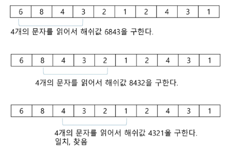
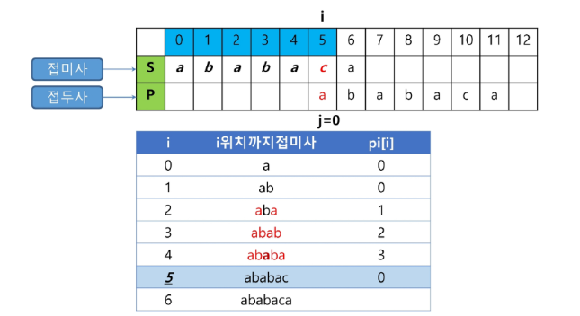

# 문자열 매치
## 문자열 매치
### 문제 제시: 문자열 찾기


### 문자열 패턴 매칭
- 패턴 매칭에 사용되는 알고리즘
  - 브루트포스 검색 알고리즘
  - 라빈-카프 알고리즘
  - 보이어-무어 알고리즘
  - KMP 알고리즘

## 브루트포스 알고리즘
본문 문자열을 처음부터 끝까지 차례대로 순회하면서 패턴 내의 문자들을 일일이 비교하는 방식으로 동작

### 브루트포스 알고리즘 동작 방식


- 자세히 보자

  

  

- 브루트포스 알고리즘 코드 `O(N X M)`
  ```python
  def find_pattern(text, pattern):
      M = len(pattern)    # 패턴의 길이
      N = len(text)     # 전체 텍스트의 길이

      # 텍스트와 패턴을 탐색할 인덱스
      i = 0  # 텍스트 인덱스
      j = 0  # 패턴 인덱스

      # 텍스트의 끝이나 패턴의 끝에 도달할 때까지 반복
      while i < N and j < M:
          if text[i] != pattern[j]:   # 현재 위치의 문자가 일치하지 않는 경우
              i = i - j     # 텍스트 인덱스를 일치 실패 지점의 다음 위치로 재설정
              j = -1        # 패턴 인덱스를 처음으로 재설정
          
          # 다음 위치로 이동
          i += 1
          j += 1

      # 패턴 전체가 일치하는지 확인
      if j == M:
          return i - M    # 패턴이 시작된 텍스트의 인덱스 반환
      else:
          return -1       # 패턴을 찾지 못한 경우 -1 반환

  # 예제 사용
  str_main = "123456789"
  str_sub = "456"

  # 패턴의 시작 위치 찾기
  result = find_pattern(str_main, str_sub)

  if result != -1:
      print(f"패턴이 텍스트의 {result}번째 위치에서 발견되었습니다.")
  else:
      print("패턴을 찾을 수 없습니다.")
  ```

- 브루트포스 패턴 매칭 시간복잡도
  - 최악의 경우 시간복잡도는 텍스트의 모든 위치에서 패턴을 비교해야 하므로 `O(NM)`이 됨
  - 예시에서는 최악의 경우 약 10,000 * 80 = 800,000번의 비교가 일어남
  - 비교 횟수를 줄일 수 있는 방법은 없을까?


## 라빈-카프 알고리즘
패턴 내의 문자들을 일일이 비교하는 대신, 패턴의 해시 값과 본문 안에 있는 하위 문자열의 해시 값만을 비교

- 문자열 검색을 위해 해시 값 함수를 사용함
- 최악의 시간 복잡도는 `O(NM)`이지만, 평균적으로는 선형에 가까운 빠른 속도를 가지는 알고리즘

### 라빈-카프 알고리즘 동작 방식
- 문자열 대신 숫자로 생각해보자
- 10개의 숫자 문자열이 주어지고 찾으려는 패턴은 "4321"

  

- 패턴의 해쉬값을 계산
  - 각 자리의 숫자에 자리값을 곱하여 더함
  - 즉 `4*10³ + 3*10² + 2*10 + 1 = 4321`
  - 해쉬값은 "4321"라는 문자열이 아니라 정수값 4321이 됨

    
  
- 찾고자 하는 문자열에서 4자리씩 해쉬값 계산

  
  - 찾고자 하는 문자열에서 해쉬값을 구할 때
    - 찾고자 하는 문자열에서 한 글자씩 이동하며 패턴 길이만큼 읽어서 해쉬값을 계산하는 것이 아니라
    - 새로 추가되는 문자와 그 전에 읽었던 값을 이용하여 해쉬값을 구함

      

- 라빈-카프 알고리즘 고려사항
  - 처음 해쉬 값 구할 땐 찾고자 하는 문자열에서 패턴 길이만큼 읽어서 구한다
  - 예제는 패턴 길이를 4자리 정수로 작게 했지만, 패턴이 문자열이며 길이가 커지면 길이를 일정 자리수로 맞추기 위해 **mod** 연산을 취해준다
  - 따라서 해쉬 값이 일치하더라도 실제 패턴이 일치하지 않을 수 있기 때문에 해쉬값이 일치하면 문자열 일치를 검사해야 한다(이를 해쉬 충돌이라 함)

- 라빈-카프 알고리즙 코드
  ```python
  def rabin_karp_rolling_hash(text, pattern):
      n = len(text)
      m = len(pattern)
      prime = 101  # 해시 값의 범위를 제한하기 위한 소수
      base = 256   # ASCII 문자의 범위 (0-255)
                   # 문자열 해싱거라서!

      def calculate_hash(str):
          """
          문자열의 초기 해시 값을 계산하는 함수
          ord: 아스키코드값을 구하는 내장함수
          pow: 3번째 파라미터는 제곱을 하면서 값이 너무 커지는 걸 막기 위해
          prime보다 커지지 않도록, 자체적으로 최적화를 진행하면서 계산하는 파라미터
          => 어차피 나머지값을 사용할 거기 때문에 prime 나머지 연산으로 계산되어도 상관없다.
          """
          hash_value = 0
          for i, char in enumerate(str):
              hash_value += ord(char) * pow(base, m-1-i, prime)
          return hash_value % prime

      # 패턴과 첫 윈도우의 해시 값 계산
      pattern_hash = calculate_hash(pattern)
      window_hash = calculate_hash(text[:m])

      # 최고 자리수의 값 (base^(m-1) % prime)
      # 롤링 해쉬 진행할 때, 최고 자리수만큼 빼주기 위해서 미리 구해 놓음
      highest_power = pow(base, m-1, prime)

      # 텍스트를 순회하며 패턴 검색
      # 패턴만큼의 길이는 제외하고 검색
      for i in range(n - m + 1):
          # 해시 값이 일치하는 경우, 실제 문자열 비교
          # 해시 값이 같다고, 문자열이 같은 건 아니기 때문에!
          if window_hash == pattern_hash:
              if text[i:i+m] == pattern:
                  print(f"패턴: {i} - {i + m - 1}")

          # 해시값이 일치하지 않는 경우
          # 검사하려는 인덱스 + 패턴 길이가 아직 문자열 전체 길이보다 작은 경우에만 ( 넘치면 안되니까)
          # 다음 윈도우로 이동 (마지막 윈도우가 아닌 경우에만)
          if i < n - m:
              # 이전 윈도우의 첫 문자 제거
              window_hash = window_hash - (ord(text[i]) * highest_power) % prime
              # 윈도우를 한 칸 이동 (base를 곱함)
              # 전체적으로 base를 곱해준 효과
              window_hash = (window_hash * base) % prime
              # 새 윈도우의 마지막 문자 추가
              # 현재 i 위치에서 패턴 m만큼 더해주면, 검사하려는 부분 문자열의 마지막 문자를 추가하게 됨
              window_hash = (window_hash + ord(text[i + m])) % prime

  # 테스트
  text = "ABABDABACDABABCABAB"
  pattern = "ABABCABAB"
  print(f"텍스트: {text}")
  print(f"패턴: {pattern}")
  rabin_karp_rolling_hash(text, pattern)
  ```

## 보이어-무어 알고리즘
오른쪽에서 왼쪽으로 문자열을 비교하여 '패턴에 오른쪽 끝에 있는 문자가 불일치하고 이 문자가 패턴 내에 존재하지 않는 경우', 이동 거리는 무려 패턴의 길이만큼이 됨

- 최악의 시간 복잡도는 `O(MN)` 이지만
- 최선의 시간 복잡도는 `O(N/M)`이며, 평균적으로 가장 빠른 속도를 가지는 알고리즘

  

### 보이어-무어 알고리즘 동작 방식
- 오른쪽 끝에 있는 문자가 불일치하고, 이 문자가 패턴 내에 존재할 경우

  

- 예시

  
  - rithm 패턴 문자열의 skip 배열

    

- 보이어-무어 알고리즘 코드
  ```python
  def build_bad_char_heuristic(pattern):
      """나쁜 문자 휴리스틱 테이블 생성"""
      bad_char = {}
      for i in range(len(pattern)):
          bad_char[pattern[i]] = i
      return bad_char

  def boyer_moore(text, pattern):
      """나쁜 문자 휴리스틱만 사용한 보이어-무어 문자열 검색 알고리즘"""
      bad_char = build_bad_char_heuristic(pattern)
      m = len(pattern)
      n = len(text)
      i = 0

      while i <= n - m:
          j = m - 1

          # 패턴의 오른쪽에서 왼쪽으로 비교
          while j >= 0 and pattern[j] == text[i + j]:
              j -= 1

          if j < 0:
              print(f"패턴이 위치 {i}에서 발견되었습니다.")
              i += 1  # 중복 패턴을 찾기 위해 한 칸만 이동
          else:
              # 나쁜 문자 휴리스틱을 사용하여 이동
              skip = j - bad_char.get(text[i + j], -1)
              i += max(1, skip)

  # 테스트
  text = "ABAAABCDAAABCABAAABCABAB"
  pattern = "AAABCABAB"
  print(f"텍스트: {text}")
  print(f"패턴: {pattern}")
  boyer_moore(text, pattern)
  ```

※ 브루트포스, 라빈-카프 알고리즘은 텍스트 문자열의 문자를 적어도 한번씩 비교함

-> 그래서 최선의 경우에도 시간 복잡도는 `Ω(n)`

※ 보이어-무어 알고리즘은 텍스트 문자를 다 비교하지 않음

-> 입력에 따라 다르지만 일반적으로 `θ(n)`보다 시간이 덜 소요됨

-> 발상의 전환: 패턴의 오른쪽부터 비교


## KMP 알고리즘 (Knuth-Morris-Pratt)
불일치가 발생한 텍스트 문자열의 앞 부분에 어떤 문자가 있는지를 미리 알고 있으므로, 불일치가 발생한 앞 부분에 대하여 다시 비교하지 않고 매칭을 수행


- 패턴을 전처리하여 부분일치 테이블 배열`pi[k]`을 구해서 잘못된 시작을 최소화함
  - `pi[k]`: 처음부터 k 인덱스까지를 끝으로 하는 부분 문자열에서 접두사와 접미사가 일치하는 최대 길이
  
  

- 시간복잡도: `O(M+N)`

### KMP 알고리즘 동작 방식
- KMP 알고리즘 아이디어
  - 텍스트에서 abcdabc까지는 매치되고, e에서 실패한 상황 패턴의 abc와 실패 작전의 abc는 동일함을 이용할 수 있다
  - 실패한 텍스트 문자와 P[4]를 비교한다

    
  - 패턴의 0번째 인덱스를 제외한 각 인덱스마다 맨 앞부터 해당 인덱스까지의 부분문자열 중 접두사와 접미사가 일치하는 최대 길이로 계산하여 작성
  - 맨 앞부터 해당 인덱스까지의 길이가 2 이상인 부분문자열 중 접두사이면서 접미사인 최대 문자열

    

- KMP 알고리즘 테이블 생성
  - 부분일치 테이블 배열 만들기

    

    

    

    

    

    

    

    
  
- KMP 알고리즘 연습
  - 부분일치 테이블 배열 만들기 연습

    

- KMP 알고리즘 비교

  

  

  

  

- KMP 알고리즘 코드
  ```python
  def get_lps(pattern):
      """
      LPS(Longest Proper Prefix which is also Suffix) 배열을 계산
      패턴의 각 위치에서 접두사와 접미사가 일치하는 최대 길이를 저장
      """
      lps = [0] * len(pattern)  # LPS 배열 초기화
      j = 0  # 현재까지 일치하는 접두사의 길이
      i = 1  # 패턴의 두 번째 문자부터 시작

      while i < len(pattern):  # i가 패턴 길이 넘어서기 전까지
          # 패턴이 일치하는 경우에는,
          if pattern[j] == pattern[i]:
              j += 1      #  접두-접미 일치하는 최대길이 + 1
              lps[i] = j  # lps 값 세팅
              i += 1      # i 도 한 칸 앞으로 전진

          # 패턴이 일치하지 않는 경우
          else:
              if j == 0:        # j == 0 이라면,
                  lps[i] = 0    # 즉, 일치했던 게 없었던 경우는 lps[i]=0으로 하고,
                  i += 1        # 그냥 i를 한 칸 앞으로

              # 여태까지 일치가 발생했던 경우면
              # 이전까지 발생한 접두-접미 일치하는 최대길이만큼
              # 패턴을 땡김
              else:
                  j = lps[j - 1]
      return lps

  def kmp(text, pattern):
      M = len(pattern)
      N = len(text)
      lps = get_lps(pattern)  # LPS 배열 계산

      i = 0  # 텍스트의 인덱스
      j = 0  # 패턴의 인덱스

      # 이 i랑 j는 같이 앞으로 가면서 비교
      while i < N:
          if pattern[j] == text[i]:
              # 문자가 일치하면 양쪽 인덱스를 증가
              i += 1
              j += 1

          if j == M:
              # 패턴을 완전히 찾은 경우
              print(f"패턴 {i - j}에서 발견")
              # 다음 일치를 찾기 위해 j를 LPS 배열을 이용하여 갱신
              # 이전 부분 일치 길이만큼 이동해서 다시 탐색
              j = lps[j - 1]

          # 불일치가 발생한 경우
          elif i < N and pattern[j] != text[i]:
              # 완전한 불일치인 경우, 그냥 i만 한 칸 앞으로
              if j == 0:
                  i += 1
              # 이전 부분 일치 길이만큼 패턴을 땡김
              # i는 고정하고, j의 값만 되돌려놓음으로써, 사실상 패턴을 앞으로 땡기는 것과 같은 효과
              else:
                  j = lps[j - 1]

  text = "ABABDABACDABABCABAB"
  pattern = "ABABCABAB"
  kmp(text, pattern)
  ```

