# 해시와 BST
## Hash
- 문제 제시
  - 데이터 급증
  - 전통적인 검색 방법 한계
    - 선형 검색: 데이터 정렬되지 않은 경우, 시간복잡도 `O(N)`
    - 이진 검색: 데이터가 정렬된 경우에만 사용이 가능하며, 시간복잡도 `O(logN)`
  - 특정한 상황에서는 효율적이지 않으며, 특히 데이터 양이 매우 클 때 한계가 두드러짐

### 해시
데이터를 고정된 크기의 값으로 변환하는 과정

-> 변환된 해시값(Hash Value)은 원본 데이터를 고유하게 식별하거나 데이터를 빠르게 검색하는 데 사용

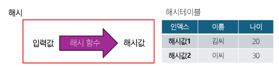

- 해시 함수
  - 입력값을 고정된 크기의 해시 값으로 변환하는 함수
  - 결정론적 특성
    - **동일한 입력은 항상 동일한 해시값을 생성**
  - 균등한 분포
    - 해시 값이 균등하게 분포되어야 좋은 해시함수
  - 충돌 최소화
    - 다른 입력값이 동일한 해시값을 생성하는 경우가 낮아야 좋은 해시함수
    
    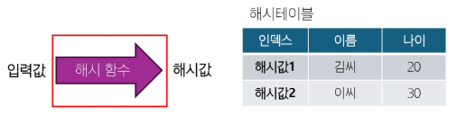

- 해시 테이블
  - **해시 값을 인덱스로 사용**하여 데이터를 저장하고 검색하는 자료구조
  - 대부분의 경우 상수 시간(`O(1)`) 내에 데이터 검색/삽입/삭제
  - 데이터베이스 인덱싱, 캐싱, 보안 등 다양하게 응용
  - 해시함수 성능에 큰 영향 -> 충돌 처리 필요(Chaining, Open Addressing)

    
  
- 해시 특징

  
  - 메모리 사용량이 배열보다 많은 이유
    - 배열은 값만 저장하면 되는데, 해시 테이블은 값과 키를 저장해야 하므로 일단 두배정도 필요


## 해시 함수
- 좋은 해시 함수
  - 결정론적 특성
    - 동일한 입력은 항상 동일한 해시값을 생성
  - 균등한 분포
    - 해시 값이 균등하게 분포되어야 좋은 해시함수
  - 충돌 최소화
    - 다른 입력값이 동일한 해시값을 생성하는 경우가 낮아야 좋은 해시함수
  - 눈사태 효과
    - 입력의 작은 변화가 출력의 큰 변화를 야기해야 함
    - 유사한 입력들이 다른 해시값을 가지게 하여 클러스터링 방지
  - 효율성
    - 계산 속도가 빨라야 함
  - 저항성
    - 입력값을 예상하기 어려워야 함

### Division Hash Function
키(Key)를 해시 테이블의 크기로 나눈 나머지를 해시값으로 사용하는 나머지 연산 해시 함수

- 가장 기본적인 해시 함수
- 구현이 매우 간단, 이해 쉬움
- 계산 속도 빠름(효율성)
- `h(k) = k mod m` 
  - k = 해시할 키 값
  - m = 해시 테이블 크기

- 장점
  - 정수 키에 대해 효과적으로 작동
  - **해시 테이블의 크기를 적절히 선핵**하면 좋은 성능 발휘
- 단점
  - **테이블 크기 선택에 민감**
  - 특정 패턴의 키에 대해 성능이 저하될 수 있음
  - 문자열이나 복잡한 키는 추가적인 처리 필요함

※ 테이블 크기 선택 중요!! **(소수, 2의 거듭제곱)**

※ **보조 해시** 사용, **MAD**(Multiply-Add-Divide) 등을 사용하여 성능 개선 가능

- Division Hash Function 코드
  ```python
  def division_hash(key, table_size):
      """
      Division Hash Function을 사용하여 해시 값을 계산하는 함수.
      
      매개변수:
      - key: 해시할 정수형 키 값.
      - table_size: 해시 테이블의 크기 (일반적으로 소수를 사용하는 것이 좋음).
      """
      return key % table_size

  def mad_hash(key, table_size, a, b, p):
      """
      MAD (Multiply-Add-Divide) 방식의 해시 함수를 사용하여 해시 값을 계산하는 함수.
      
      수식:
        h(k) = ((a * key + b) mod p) mod table_size
        
      매개변수:
      - key: 해시할 정수형 키 값.
      - table_size: 해시 테이블의 크기.
      - a: 1 이상 p-1 이하의 정수 (보조 해시에서 사용하는 상수).
      - b: 0 이상 p-1 이하의 정수 (보조 해시에서 사용하는 상수).
      - p: 키 값 범위보다 큰 소수.
      """
      return ((a * key + b) % p) % table_size
          # MAD 추가 사용 -> ((a * key + b) % p)

  keys = [10, 20, 30, 40, 50]
  table_size = 7  # 해시 테이블의 크기, 일반적으로 소수를 사용하는 것이 좋음

  # MAD 방식에 사용할 상수 값들
  a = 3   # 1 이상 p-1 범위 내의 임의의 값
  b = 1   # 0 이상 p-1 범위 내의 임의의 값
  p = 101 # 키 값 범위보다 큰 소수 (예: 101)

  print("Division Hash Function 결과:")
  for key in keys:
      print(f"키 {key}의 해시 값: {division_hash(key, table_size)}")

  print("\nMAD(Multiply-Add-Divide) Hash Function 결과:")
  for key in keys:
      print(f"키 {key}의 해시 값: {mad_hash(key, table_size, a, b, p)}")
  ```
  - 결과

    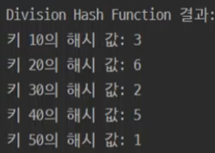

    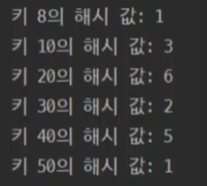
    - 8 넣으면 50과 해시 값이 동일하게 나옴(지금 테이블 크기가 7이라서) => 충돌
    - 그래서 보조 해시 MAD 사용

      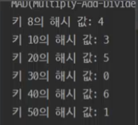


### Multiplication Hash Function
키(Key)를 0과 1 사이의 실수로 변환 후, 이를 해시 테이블의 크기와 곱하여 해시 값을 생성하는 곱셈 해시 함수

- 나머지 연산 해시 함수보다 더 균일한 분포 제공
- 해시 테이블 크기에 덜 민감
- `h(k) = m(kA mod 1)`
  - k = 해시할 키 값
  - m = 해시 테이블 크기
  - A = 0과 1 사이의 실수
- A 값 선택이 성능에 큰 영향을 미침

- 장점
  - 키의 분포에 덜 민감함
  - 나머지 연산 해시 함수에 비해 더 균일한 분포 제공
- 단점
  - **구현이 조금 더 복잡함**
  - 부동 소수점 연산을 사용하므로 정밀도 문제가 발생할 수 있음
- A 값의 선택이 매우 중요함
  
  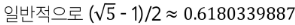
- **비트 연산, 다양한 A값으로 실험**하는 등의 방법을 사용하여 성능 개선 가능

- Multiplication Hash Function 코드
  ```python
  def multiplication_hash(key, table_size, A):
      """
      Multiplication Hash Function을 사용하여 해시 값을 계산하는 함수.
      
      주어진 키에 상수 A를 곱하고, 소수점 이하 부분(fractional part)을 추출
      추출한 소수점 이하 값과 해시 테이블 크기(table_size)를 다시 곱한다.
      이떄 얻은 정수 부분을 해시 값으로 사용용
      
      수식:
        h(k) = floor(table_size * ((key * A) mod 1))
        
      매개변수:
      - key (int): 해시할 정수형 키 값.
      - table_size (int): 해시 테이블의 크기.
      - A (float): 0과 1 사이의 실수 상수, 기본값은 약 0.6180339887 (일반적으로 (sqrt(5)-1)/2 사용).
      """
      # 키와 상수 A의 곱에서 소수점 이하(fractional part)를 추출
      fractional_part = (key * A) % 1
      # 해시 테이블 크기와 곱하여 정수형 해시 값으로 변환
      return int(table_size * fractional_part)

  keys = [10, 20, 30, 40, 50]
  table_size = 7  # 해시 테이블의 크기 (일반적으로 소수 사용 권장)
  A = 0.6180339887  # 곱셈 해시 함수에서 사용하는 상수 A

  for key in keys:
      # 각 키에 대해 해시 값을 계산하여 출력
      hash_value = multiplication_hash(key, table_size, A)
      print(f"키 {key}의 해시 값: {hash_value}")
  ```


### Folding Hash Funcion
키(Key)를 **여러 부분으로 나누고**, 이 부분들을 **조합**하여 최종 해시 값을 생성하는 폴딩 해시 함수

- **주로 긴 숫자나 문자열 키에 사용**
- 작동 원리
  1. 키를 일정 크기의 부분으로 나눈다 (ex. 2자리/ 3자리 단위)
  2. 나눈 부분들을 모두 더한다
  3. 최종 합을 해시 테이블 크기로 나눈 나머지를 해시값으로 사용
- 키의 모든 부분을 사용하므로 비교적 균일한 분포를 보임
  - 이전에는 같은 길이의 문자열은 같은 해시 값을 가졌지만
  - 내 데이터 자체를 가지고 해싱을 하므로 균일한 분포가 됨
- 폴딩 크기를 조절하여 다양하게 사용 가능
- 장점
  - 긴 키나 문자열에 효과적
  - 키의 모든 부분이 최종 해시값에 기여(균일한 분포)
  - 구현이 간단
- 단점
  - **짧은 키에 대해서는 오버헤드가 있을 수 있음**
  - 폴딩 크기가 성능에 영향을 미침
- **가중치 부여, 덧셈 대신 다른 방식(XOR), 순환 시프트** 등의 방법을 사용하여 성능을 개선시킬 수 있음

- Folding Hash Funcion 코드
  ```python
  def folding_hash(key, table_size, chunk_size=2):
      """
      Folding Hash Function을 사용하여 해시 값을 계산하는 함수.
      
      키를 문자열로 변환한 후, 일정 크기의 부분(chunk)으로 나누어 각 부분을 정수로 변환해서 모두 더한다.
      만약, 정수 변환이 불가능한 경우, 각 문자의 ASCII 코드 합으로 대체한다.
      전체 합을 해시 테이블 크기(table_size)로 나눈 나머지를 해시 값으로 사용
      
      매개변수:
      - key: 해시할 키 (숫자나 문자열 모두 사용 가능).
      - table_size: 해시 테이블의 크기.
      - chunk_size: 키를 나눌 부분의 크기 (예: 2자리 또는 3자리).
      
      예:
        키가 123456일 경우, chunk_size가 2이면 "12", "34", "56"으로 분할되고,
        각 부분을 정수로 변환한 후 모두 더하여 table_size로 나눈 나머지를 해시 값으로 사용한다.
      """
      key_str = str(key)  # 문자열로 처리
      total = 0
      # 키를 chunk_size 길이로 잘라서 순회
      for i in range(0, len(key_str), chunk_size):
          chunk = key_str[i:i+chunk_size]
          try:
              # chunk를 정수로 변환하여 합산
              total += int(chunk)
          except ValueError:
              # 변환 불가능한 경우, 각 문자의 ASCII 코드 합산
                # 문자열은 정수 형변환 안되니까 아스키로
              total += sum(ord(c) for c in chunk)
      return total % table_size

  keys = [123456, "987654321", "ABCDEF", 1020304050]
  table_size = 7  
  chunk_size = 2  # 2자리씩 나누어 폴딩

  print("Folding Hash Function 결과:")
  for key in keys:
      hash_value = folding_hash(key, table_size, chunk_size)
      print(f"키 {key}의 해시 값: {hash_value}")
  ```


### Polynomial Hash Function
문자열을 다항식으로 표현하여 해시 값을 계산하는 다항식 해시 함수

- **문자열 처리에 유용함**
- 수식

  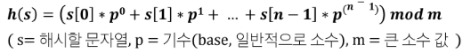
- 적절한 p와 m을 선택하면 균일한 해시 분포를 얻을 수 있음
  - p는 보통 소수, m은 큰 소수
- 문자열의 순서가 해시 값에 영향을 미침

- 장점
  - 문자열 비교에 효과적
  - 문자열 패턴 매칭 알고리즘에 유용(라빈-카프)
  - 간단하면서도 효과적인 해시 분포를 제공
- 단점
  - **긴 문자열에 대해서는 오버 플로우가 있을 수 있음**
  - p와 m 값의 선택이 성능에 큰 영향을 미침
- **라빈-카프 알고리즘, 데이터베이스 인덱싱** 등 다양한 분야에서 활용됨

- Polynomial Hash Function 코드
  ```python
  def polynomial_hash(s, p=31, m=1000000009):
      """
      다항식 해시 함수를 사용하여 문자열의 해시 값을 계산하는 함수.
      
      이 함수는 문자열 s의 각 문자를 정수로 변환하고,
      각 문자의 위치에 따라 p의 거듭제곱을 곱하여 누적합을 구한 후,
      최종 합계를 m으로 나눈 나머지를 해시 값으로 사용한다.
      
      수식:
        h(s) = ( s[0]*p^0 + s[1]*p^1 + ... + s[n-1]*p^(n-1) ) mod m
        
      매개변수:
      - s: 해시할 문자열
      - p: 기수(base) 값, 기본값은 31 (일반적으로 소수를 사용)
      - m: 큰 소수 값, 기본값은 1000000009
      """
      hash_val = 0  # 누적 해시 값을 저장할 변수
      p_pow = 1     # p의 거듭제곱 값, 초기값은 p^0 = 1
      
      # 문자열의 각 문자에 대해 순서대로 해시 값을 계산
      for char in s:
          # 각 문자를 아스키 코드(ord)를 사용하여 정수로 변환하고,
          # 현재 위치에 해당하는 p_pow 값을 곱하여 누적합에 더함
          hash_val = (hash_val + ord(char) * p_pow) % m
          # 다음 문자를 위해 p의 거듭제곱 값을 업데이트
          p_pow = (p_pow * p) % m
          
      return hash_val

  strings = ["hello", "world", "polynomial", "hash", "function"]
  p = 31           # 기수 (일반적으로 소수 사용)
  m = 1000000009   # 큰 소수

  print("Polynomial Hash Function 결과:")
  for s in strings:
      h_val = polynomial_hash(s, p, m)
      print("문자열 '{}'의 해시 값: {}".format(s, h_val))
  ```


### SHA - 256
임의의 길이의 입력 데이터를 고정된 크기의 256비트(32바이트) 해시 값으로 변환하는 함수

- **현대적이고 널리 사용되는 암호학적 해시함수**
- 입력 크기에 관계없이 항상 256비트 해시 값을 생성함
- 해시 값에서 원본 메시지를 복원하는 것이 실질적으로 불가능
- 입력의 작은 변화가 출력의 큰 변화를 야기함(눈사태효과)
- 같은 해시 값을 가진 두 개의 다른 입력을 찾기가 매우 어려움(저항성)
- SHA - 256 코드
  ```python
  import hashlib

  word = '''
  금일 수업시간에 작성할 스켈레톤 코드를 lectures 에 업로드 하였습니다.

  수업 시작 전 미리 clone 혹은 pull 받아두시기 바랍니다.
  '''
  data_list = word.split()

  for data in data_list:
      # 입력 데이터를 utf-8 인코딩을 통해 바이트 형식으로 변환
      data_bytes = data.encode('utf-8')
      # hashlib의 sha256 함수를 사용하여 해시 객체 생성
      hash_object = hashlib.sha256(data_bytes)
      # 해시 객체를 16진수 문자열로 변환하여 반환
      result = hash_object.hexdigest()
      print(f"입력 '{data}'의 해시 값: {result}")
  ```


## 해시 충돌
충돌(Collision)은 두 개 이상의 서로 다른 키가 동일한 해시 값을 생성하는 상황(birthday problem)

- 해시 함수의 결과로 동일한 인덱스가 나오고, 서로 다른 키가 동일한 버킷에 저장되어야 하는 경우

- 해시 충돌의 원인
  - 해시 값의 범위가 제한적이기 때문에 서로 다른 입력 데이터가 동일한 해시 값을 가질 가능성이 존재(비둘기집 원리)
  - 해시 함수가 입력 데이터를 균등하게 분포시키지 못하면 충돌이 빈번하게 발생
  - 무한한 입력을 유한한 출력(한정된 해시 테이블)로 매핑하는 과정에서 발생

- 해시 충돌의 영향
  - 성능 저하
    - 해시 테이블의 검색, 삽입, 삭제 연산 속도가 저하
  - 보안 위험
    - 해시 충돌은 보안 취약점이 될 수 있음
  - 데이터 무결성 문제

- 해시 충돌 해결 방법
  - 오픈 어드레스(Open Addressing)
    - 선형 탐사(Linear Probing)
    - 이차 탐사(Quadratic Probing)
    - 이중 해싱(Double hasing)
  - 체이닝(Chaining), 분리 연결법(Separate Chaining)


### 체이닝(Chaining)
해시 테이블의 각 버킷에 연결 리스트(다른 자료구조도 가능)를 사용하여 **충돌이 발생한 항목을 저장**하는 방법으로, 해시 테이블에서 충돌 해결하는 가장 일반적인 방법

- 작동 원리
  1. 해시 함수를 통해 키의 해시 값을 계산
  2. 계산된 해시 값에 해당하는 버킷에 항목을 저장
  3. 충돌이 발생하면, 해당 버킷의 연결 리스트에 새 항목을 추가

- 체이닝 과정
  - 해시 충돌 해결(체이닝)
    
    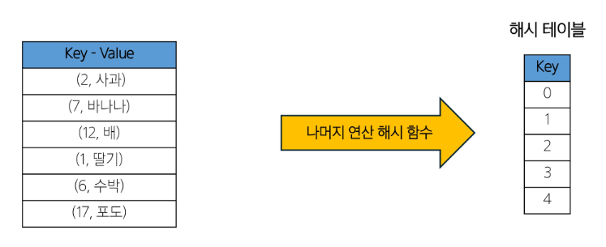

    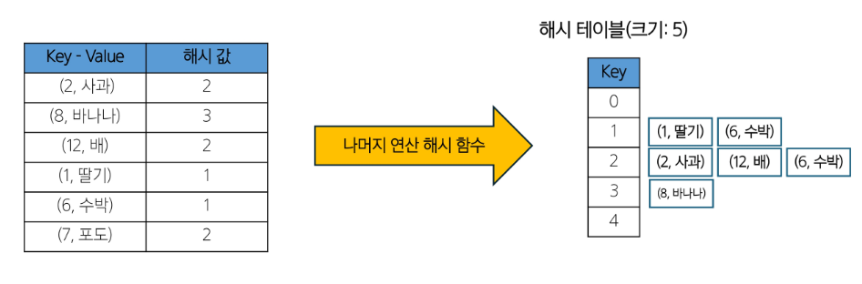

- 체이닝 정리
  - 장점
    - 구현이 비교적 간단함
    - 해시 테이블의 크기를 **동적으로 조절하기 쉬움**
    - 키의 전체 또는 일부를 저장할 수 있어 보안에 유리함

  - 단점
    - **연결 리스트를 위한 추가 메모리 필요**
    - 최악의 경우에 **검색 시간이 `O(n)`**이 될 수 있음 => 캐시 성능이 개방 주소법에 비해 떨어질 수 있음

  - **자료구조를 변경**(AVL 사용), **더 좋은 해시 함수 사용**으로 성능을 향상시킬 수 있음


### 주소 개방법(Open Addressing)
"모든 키-값 쌍을 해시 테이블 배열 내에 직접 저장하고, 충돌이 발생하면 다른 빈 슬롯을 찾아 데이터를 저장"하는 해시 테이블에서 충돌을 해결하는 또 하나의 방법

- 특징
  - 모든 데이터가 해시 테이블 배열 내에 저장
  - 별도의 체인이나 추가 데이터 구조가 필요 없음
- 충돌이 발생했을 경우, 빈 슬롯을 찾는 여러 가지 방법이 있음
  - 선형 탐사(Linear Probing)
  - 제곱 탐사(Quadratic Probing)
  - 이중 해싱(Double hasing)


### 선형 탐사(Linear Probing)
해시 충돌을 해결하는 간단하면서도 효과적인 방법으로, 충돌이 발생했을 때 **순차적**으로 다음 버킷을 검사하여 빈 슬롯을 찾는 방식

- 작동 원리
  1. 해시 함수로 초기 버킷 위치를 계산
  2. 해당 버킷이 이미 사용중이라면, **다음 버킷으로 이동**
  3. 빈 버킷을 찾을 때까지 위 과정을 반복

- 선형 탐사 과정
  - 해시 충돌 해결(선형탐사)

    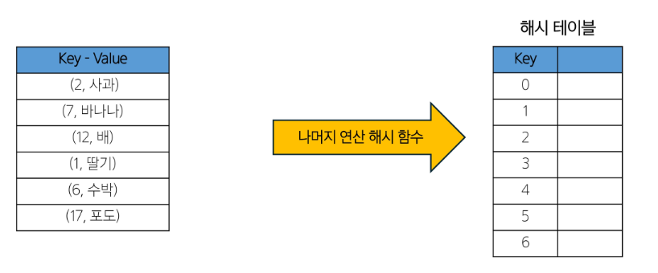
    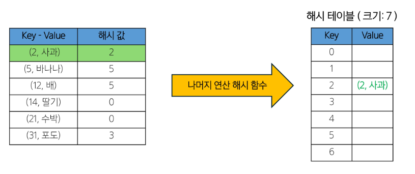
    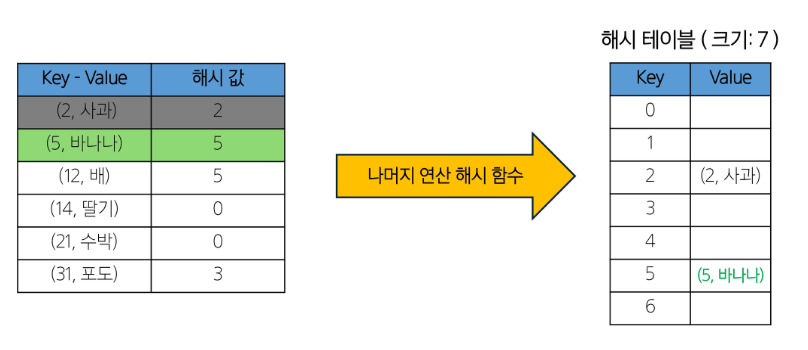
    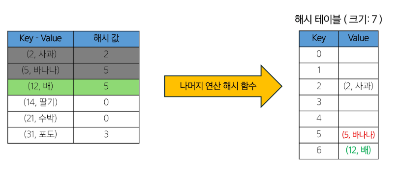
    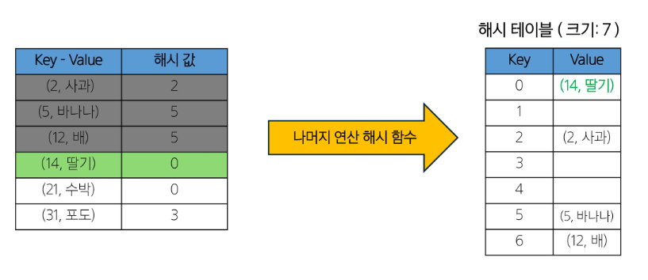
    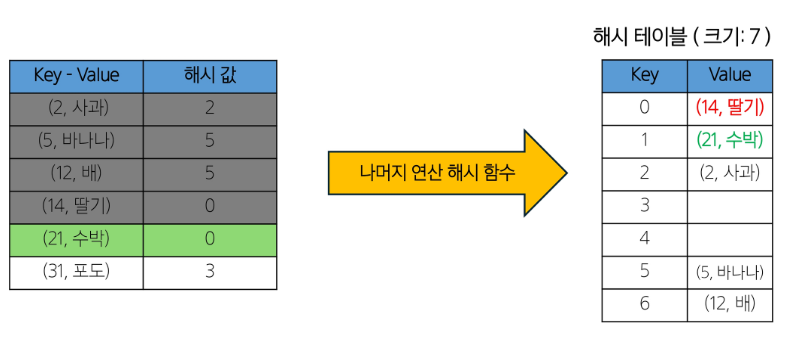
    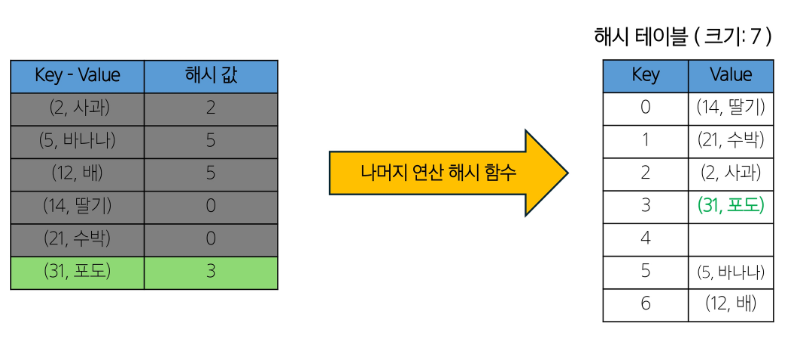

- 선형 탐사 정리
  - 장점
    - 구현이 간단
    - 캐시 성능 좋음(연속된 메모리를 사용하기 때문)
    - 추가 메모리가 필요없음(정해진 테이블 내에 저장하기 때문)
  - 단점
    - **클러스터링 문제**: 연속된 항목들이 몰리는 현상 발생할 수 있음
    - **테이블이 거의 가득 찼을 때** 성능이 크게 저하
    - 최악의 경우 검색이 `O(N)`
  - 테이블 효율성을 위해 **로드 팩터가 특정 임계값(0.6 ~ 0.75)을 초과하면 테이블 크기를 늘리고, 모든 항목을 재삽입**
    - 로드 팩터란?
    - 해시 테이블에 저장된 항목의 수를 테이블 크기로 나눈 값으로, 성능을 나타내는 중요한 지표임
  

### 제곱 탐사(Quadratic Probing)
해시 충돌 해결 방법 중 선형 탐사의 단점 보완을 위해 고안된 방법으로, 충돌이 발생했을 때 원래의 해시 값에서 **제곱수만큼 떨어진 위치**를 순차적으로 탐색

- 작동 원리
  1. 해시 함수로 초기 버킷 위치를 계산
  2. 해당 버킷이 이미 사용중이라면, **1¹, 2², 3², 4², ... 만큼 떨어진 위치**를 순차적으로 확인
  3. 빈 버킷을 찾을 때까지 위 과정을 반복

- 제곱 탐사 정리
  - 장점
    - 선형 탐사에 비해 클러스터링 문제가 덜함
    - 충돌 해결을 더 넓은 범위로 함으로 충돌 해결 능력이 조금 더 향상됨
    - 캐시 성능이 좋음(연속된 메모리)
  - 단점
    - **이차 클러스터링**이 발생할 수 있음(충돌 해결 과정에서 동일한 탐사 순서를 따르는 현상)
    - 테이블이 절반 이상 차면 성능이 급격히 저하될 수 있음
    - 모든 버킷을 탐색하지 못할 수도 있음(순환 패턴으로 인해) => 테이블 크기를 소수로 선택하면 모든 버킷 탐색
  - **이중 해싱과의 결합, 동적 해시**를 통해 성능을 개선할 수 있음


### 이중 해싱(Double Hashing)
두 개의 해시 함수를 사용하여 충돌을 해결하는 방법으로, 첫 번째 해시 함수는 초기 위치를 결정하고 두 번째 해시 함수는 충돌 시 탐사 간격을 결정함

- 작동 원리
  1. 첫 번째 해시 함수(h1)로 초기 버킷 위치 계산
  2. 해당 버킷이 이미 사용중이라면, 두 번째 해시 함수(h2)로 탐사 간격을 계산
  3. 해당 간격으로 다음 위치를 탐색
  4. 빈 버킷을 찾을 때까지 위 과정 반복

- 이중 해싱 정리
  - 장점
    - 클러스터링 문제를 크게 감소시킴
    - 선형 탐사나 제곱 탐사보다 더 균일한 분포 제공
    - 두 번째 해시 함수로 인해 충돌 해결 패턴이 다양함
  - 단점
    - 두 개의 해시 함수를 계산해야 하므로 **약간의 추가 연산**이 필요함
    - 구현이 조금 더 복잡함
    - 두 번째 해시 함수를 잘못 선택하면 성능이 저하될 수 있음
  
