# 서로소 집합
## 서로소 집합(Disjoint-set)
서로소 또는 상호배타 집합들은 서로 중복 포함된 원소가 없는 집합들임

-> 즉, 교집합이 없다

- **두 집합 간에 공통 원소가 하나도 없을 때**, 이 두 집합을 서로소 집합이라고 함

- 집합에 속한 하나의 특정 멤버를 통해 각 집합들을 구분함
  - 이것을 대표자(representative)라고 함

- 상호배타 집합을 표현하는 방법
  - 연결 리스트(클래스로 구현)
  - 트리(리스트로 구현)

- 상호배타 집합 연산
  - `Make-Set(x)` -> 각 집합들을 본인이 대표자인 집합으로 만듦
  - `Find-Set(x)` -> 대표자 찾음
  - `Union(x, y)` -> 공통원소 없는 집합들 합치기
    - 합친다는 것은 x가 y의 대표자에게 붙거나, y가 x의 대표자에게 붙는 것

- 서로소 집합 예시

  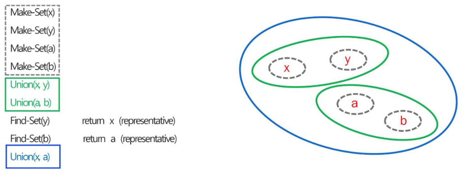
  - Find-Set(y) 실행시켰을 때 y가 속한 집합의 대표자 x를 출력할 수 있게됨
  - 대표자 x와 대표자 a를 Unoin하면 두 집합이 하나의 큰 집합으로 합쳐짐

## 서로소 집합 표현
### 서로소 집합 표현 - 트리
- 같은 집합의 원소들을 하나의 트리로 표현
  - 이진 트리 아님을 주의하자!
- 자식 노드가 부모 노드를 가리키며 루트 노드가 대표자가 됨

  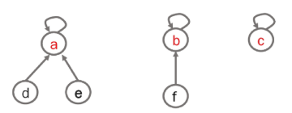
  - a는 트리의 루트 노드를 가지고 있음(a 본인이 대표자)
    - d와 a를 합집합할 때 a를 대표자로 둔다면, a의 자식으로 d가 들어오는 형태
    - b를 부모 노드로 가지는 자식 f가 있거나, 자기 혼자만 존재하는 형태로 있는 트리 c가 있을 수 있음

  - 이진트리가 아니기 때문에 리스트로 트리 구현했을 때 인덱스 약속을 지킬 수 없음
    - `부모 인덱스 = 자식 인덱스//2` -> 사용XX
  - 그렇다면 리스트에 `(부모 인덱스, 값)`인 튜플 형태로 나타내자
    - 두번째 그림을 표현하면
      ```
      index  0     1     2
      list   X   (1,b) (1,f)
      ```
      - 2번 인덱스에 있는 노드의 값은 f이고, f의 부모 노드는 1번 인덱스에 있다
      - 1번 인덱스에 있는 노드의 값은 b이고, b의 부모 노드는 자기 자신이다
  - 만약 a와 b를 union 한다면 
    - 루트 노드를 a로 유지한다고 정했을 때 아래와 같이 트리 형태를 유지한 상태로 관계만 집합 형태로 만들 수 있음

      
      ```
      index  0     1     2     3     4     5     
      list   X   (1,a) (1,d) (1,e) (1,b) (4,f)
      ```

- 서로소 집합 트리 표현 순서
  1. `Make-Set(a)` ~ `Make-Set(f)`

      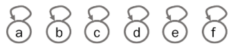
    - Make-Set을 이용해서 각자가 자신을 바라보도록 만들기
    - 즉, 부모 정보에 자기 자신 인덱스가 들어가도록 함
  2. `Union(c,d)` , `Union(e,f)`

      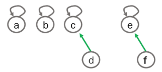
    - c와 d를 Union하면 d의 부모 정보에 c의 인덱스를 넣음

  3. `Union(d,f)`

      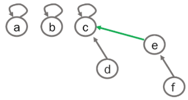
    - d와 f Unoin하려는데 d,f가 각 집합의 대표자가 아니므로 대표자를 찾음
    - d의 대표자 c와 f의 대표자 e가 합쳐져 c가 합친 집합의 대표자가 되도록 트리 구성

- `Fine-Set(d)`, `Find-Set(e)` -> return c

- 서로소 집합을 표현한 트리의 배열을 이용해 저장된 모습

  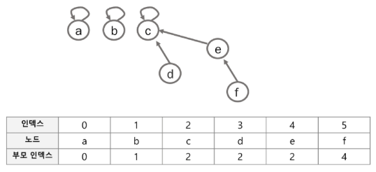

## 서로소 집합 연산
- `make_set(x)`
  - 유일한 멤버 x를 포함하는 새로운 집합을 생성하는 연산
    ```python
    def make_set(n):
        '''
            n: 집합을 만들 원소의 개수
        '''
        # 우선 자기 자신을 대표자(부모)로 하는 배열 반환
        return [i for i in range(n+1)]
    ```

- `union(x,y)`
  - x와 y를 포함하는 두 집합을 통합하는 연산
    ```python
    def union(x, y):
        '''
            x, y: 합쳐질 두 집합의 원소
            유니온 과정에 삽입 대상 원소는 그 원소의 집합의 대표자가 아닐 수 있음!!
        '''
        # 두 집합을 합친다는 것은
        # 두 원소가 속한 집합의 대표자가 서로 다르다면?
            # 원소 y가 속한 집합의 대표자를 x로 바꾸거나
            # 원소 x가 속한 집합의 대표자를 y로 바꾸거나
            # parent[y 집합의 대표자] = x 집합의 대표자
            # 그럼 두 원소가 속한 집합의 대표자를 먼저 알아야 함
                # find_set(x)
        root_x = find_set(x)
        root_y = find_set(y)
        if root_x != root_y:
            parent[root_y] = root_x
        
        # 두 원소의 대표자가 같으면
            # 이미 두 원소는 같은 집합 소속인 것임
    ```
    - union에 넣은 원소 x, y를 합치는게 아니라 x의 대표자와 y의 대표자를 합쳐야함을 유의하자

- `find_set(x)`
  - x를 포함하는 집합을 찾는 연산
    ```python
    def find_set(x):
        '''
            원소 x가 속한 집합의 대표자가 누구인지 반환한다
        '''
        if x == parent[x]:    # 원소 x가 속한 집합의 대표자가 자기 자신이면
            return parent[x]    # 자기 자신 반환
        
        # 자기 자신이 아니라면
        # x의 대표자로 지정된 원소의 대표자가 누구인지 찾는다
        return find_set(parent[x]) 
    ```

※ 합쳐놓은 집합을 가지고 무엇을 할까?

-> 특정 노드에서 다른 특정 노드까지의 거리 측정

-> 노드 들이 어떤 경로에 포함되어 있는지 확인

-> 내 집합과 타 집합의 특정 원소들이 공통 조상을 가지고 있는지 확인

-> 위 경우들에 서로소 집합 사용할 예정

### 서로소 집합 연산의 문제점
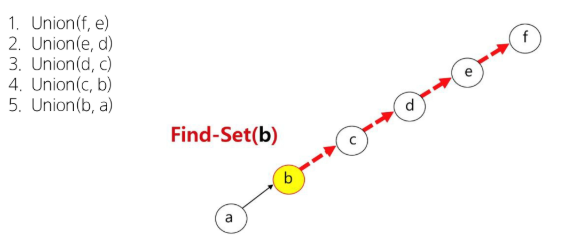
- 1~5를 거쳐 서로소 집합을 만들었음
  - b가 e 원소와 같은 서브트리 내에 존재하고 있는지 확인하고 싶음 -> `Find-Set(b)`, `Find-Set(e)`
    - b가 속한 집합의 대표자는 f
    - e 또한 대표자는 f
    - 그럼 같은 서브트리에 존재한다고 판단

- 편향 트리로 집합이 만들어 졌을 때 말단(ex. a)에서 대표자(ex. f)를 찾으려면 N번 연산이 필요함
  - 왜? 나는 부모 인덱스 정보를 가지고 있기 때문에 N번 연산을 통해 부모를 타고타고 루트까지 가야함

- Union으로 대표자들끼리 합쳤을 때 탐색 연산 길어지는 여러 경우들이 생김
  - 탐색 시간 줄일 필요성 있음

## 서로소 집합 최적화
- `Path compression`
  - Find-Set을 행하는 과정에서 만나는 **모든 노드들이 직접 root를 가리키도록** 포인터를 바꾸어줌
    - 위에서 서로소 집합 코드 작성한게 평탄화 없이 부모 노드를 가리키도록 작성한 것
    - 평탄화를 진행하면 a가 b를 가리키지 않고 a와 b 모두 f를 가리킴
    - b가 a의 부모였다는 것은 사라지지만, a와 b의 **원소 간 관계**는 유지됨(같은 집합에 속해있다는 것)
  - 해당 집합이 하나의 대표자를 기반으로 한 집합인지만 나타내고자 한다면 경로 최적화(평탄화 작업) 진행 가능

- `Rank를 이용한 Union`
  - 각 노드는 자신을 루트로 하는 subtree의 높이를 rank로 저장함
  - 두 집합을 합칠 때 rank가 낮은 집합을 rank가 높은 집합에 붙이기

※ Path compression과 Rank를 이용한 Union 모두 각 노드의 부모 노드가 누구인지 중요한 상황에서는 사용하면XX

### Path Compression 최적화
Path Compression을 적용한 Find-Set 연산은 **특정 노드에서 루트까지의 경로를 찾아가면서 부모 노드를 갱신**함

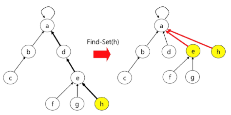
- h를 기존에 있던 a~g 서브트리에 합칠 때 그냥 합치는 것이 아니라
  - h가 부모라고 바라볼 e가 사실은 a를 루트로 하는 집합의 요소였음
  - 그렇다면 h는 바로 a에게 붙이고, e도 a에 붙도록 하겠다
  - 즉, 평탄화 과정을 union할 때마다 진행

- Find-set(x) 최적화(x를 포함하는 집합을 찾는 오퍼레이션)
  ```python
  # 02_dsu_path_compression.py

  def make_set(n):
    return [i for i in range(n+1)]

  def find_set_pc(x):
      """경로 압축이 적용된 find_set"""
      # 원소 x가 속한 집합의 대표자가 자기 자신이면
      if x == parent[x]:
          return parent[x]
      # 아니면?
      # 원소 x의 대표자를, 그 대표자의 대표자로 변경
      parent[x] = find_set_pc(parent[x])
      return parent[x]

  def union(x, y):
      """두 집합을 합치기"""
      root_x = find_set_pc(x)
      root_y = find_set_pc(y)
      if root_x != root_y:
          parent[root_y] = root_x
  ```
  - 만약 매번 경로압축 하고싶으면 union함수에서 `parent[root_y] = root_x` 다음줄에 find_set해서 부모에 넣는 경로압축 코드 추가하면 됨
  - 그치만 평탄화는 필요할 때만 하자
    - 편향트리인 경우엔 한번에 평탄화가 되지만, 서브트리가 여러개이면 평탄화 여러번 해야함
    - 평탄화가 굳이 필요하지 않은 상황에서 평탄화 여러번 해놓을 필요XX

- 최적화 전 vs 후 차이

  
  
### Rank 최적화
랭크를 이용한 Union

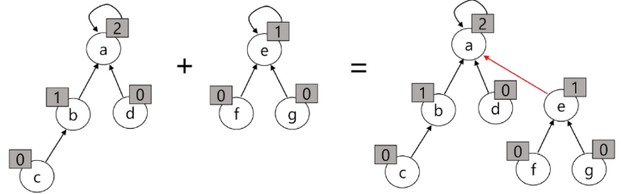
- 왜 랭크 이용해서 합쳐야하냐?
  - union(a, e)를 했을 때 e의 대표자를 a로 정했다면 별 문제XX

    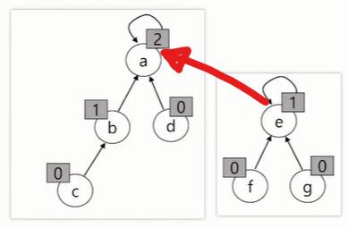
  - 만약 a의 대표자를 e로 정했을때 즉, union(e, a) -> `x=e, y=a`
    - 우리가 작성한 코드 상 e는 원래 높이가 1이었는데 3이 됨
    - 높이가 0이었던 f와 g가 높이가 2가 됨
    - 높이가 높아졌다는 것은 DFS로 최대 깊이 탐색 했을 때 깊이가 깊어진다는 것

    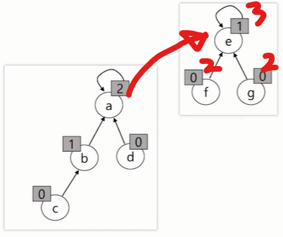
  - **높이가 동일한 집합**을 합집합할 때에도 깊이가 달라짐!

    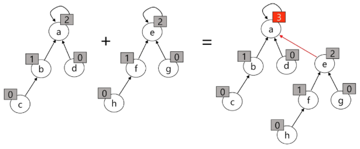
    - 랭크를 이용한 Union에서 랭크가 증가하는 예시
  
※ 무엇을 x의 대표자와 y의 대표자 중 무엇을 루트로 정할 것인지는 보통 오름차순/내림차순 정렬에 따라 달라짐

-> 오름차순 정렬되어 있으면 y를, 내림차순 정렬되어 있으면 x를 대표자로 정하는 느낌쓰

※ rank를 이용해서 Union했을 때 랭크가 증가하는 것을 허용하는 경우는 **두 집합의 랭크가 동일할 때에만 허용**

-> 이때 증가하는 것은 **대표자 기준의 랭크만 1 증가**

-> 서브트리로 끊었을 때 서브트리의 랭크는 기존과 동일함

- Rank를 저장할 변수 추가 및 랭크 비교 저장
  ```python
  def make_set(n):
      """부모 리스트와 랭크 리스트 초기화"""
      parent = [i for i in range(n+1)]
      rank = [0] * (n+1)    # 모든 집합의 rank를 0으로 초기화

      # 파이썬의 함수는 return으로 반드시 하나의 값을 반환한다.
      return parent, rank   # 이렇게 쓰면 튜플로 묶어서 하나의 객체로 반환
                            # 반환해서 언패킹하면 됨 
                            # parent, rank = make_set(6)

  def find_set(x):
      """기본 find_set (랭크 최적화 확인용)"""
      if x == parent[x]:
          return x
      return find_set(parent[x])

  def union_by_rank(x, y):
      """랭크를 이용한 최적화된 union"""
      root_x = find_set(x)
      root_y = find_set(y)

      if root_x != root_y:
          # 기준은 랭크가 더 높은 곳에 랭크가 더 낮은 집합을 합친다.
          if rank[root_x] > rank[root_y]:
              parent[root_y] = root_x
          elif rank[root_y] > rank[root_x]:
              parent[root_x] = root_y
          else:   # 랭크가 똑같네?
              # x와 y중 누구를 대표로 할 건지는? 상황에 따라 다르다!
              # parent[root_x] = root_y
              # rank[root_y] += 1
              parent[root_y] = root_x
              rank[root_x] += 1
  ```

- 최적화 전 vs 후 차이

  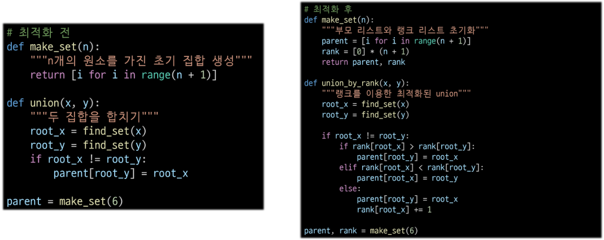


### 서로소 집합 최종 완성 코드
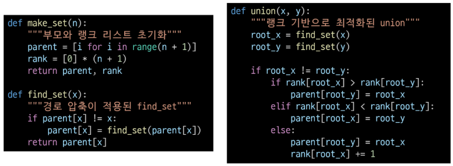
- 경로압축 + 랭크 기반이 반영된 코드임!
  - `find_set(x)` 함수가 링크 최적화 코드의 find_set과 쬐끔 다름
    - if문만 조금 다르게 쓴거지, 로직은 똑같음

- 경로 압축은 언제 일어날까?
  - find_set 호출 시, 해당 경로만 `On-Demand`로 최적화
  - 경로 압축은 union 연산의 기능이 아님
  - Union이 내부적으로 find_set을 호출하기 때문에 발생하는 **부수 효과**
  - 자료구조를 **사용할 때마다, 필요한 부분만 자동으로, 점진적으로** 최적화
  - 따라서 별도의 압축을 호출할 필요 없이, 자료구조를 사용하다 보면
    - **전체 트리가 자연스럽게 효율적인 구조로 개선**


## 참고
### 서로소 집합 표현 - 연결리스트
같은 집합의 원소들은 하나의 연결 리스트로 관리

- 연결 리스트의 맨 앞 원소를 집합의 대표 원소로 삼는다
- 각 원소는 집합의 대표 원소를 가리키는 링크를 갖는다

  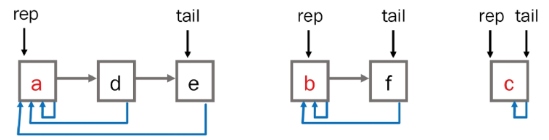

  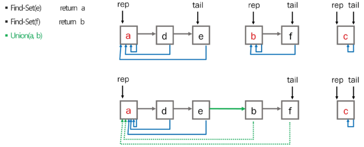

- 클래스로 구현
  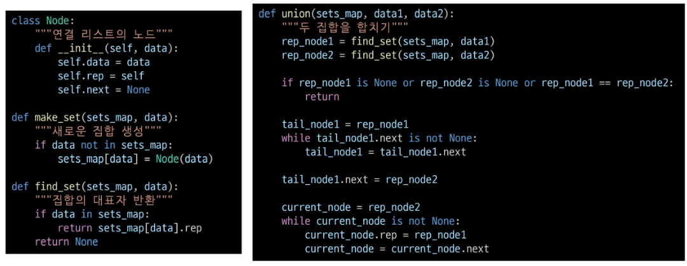

