# Introduction of Vue
## Frontend Development
웹사이트와 웹 애플리케이션의 사용자 인터페이스(UI)와 사용자 경험(UX)을 만들고 디자인하는 것

-> HTML, CSS, JavaScript 등을 활용하여 사용자가 직접 상호작용하는 부분을 개발

-> 여기서의 '디자인'은 예술과 같은 미적인 부분XX, 설계나 기획하는 기계적인 부분에 있어서의 디자인임

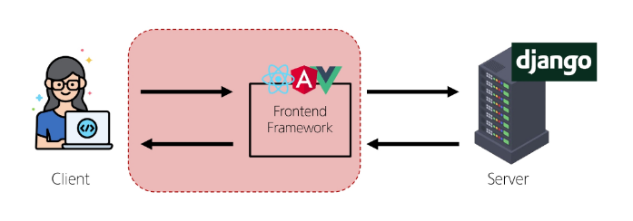


### Client-side framework
클라이언트 측에서 UI와 상호작용을 개발하기 위해 사용되는 JavaScript 기반 프레임워크


- Client-side frameworks가 필요한 이유 : **웹에서 하는 일이 많아짐**
  1. 단순히 무언가를 읽는 곳 -> 무언가를 하는 곳
      - 사용자는 웹에서 문서를 읽는 것이 아닌 음악 스트리밍, 영화 시청, 영상 채팅을 통해 즉시 통신하고 있음
      - 이처럼 현대적이고 복잡한 대화형 웹 사이트를 **웹 애플리케이션(web applications)**이라 부름
      - JavaScript 기반의 Client-side frameworks가 등장하면서 매우 **동적인 대화형 애플리케이션**을 훨씬 더 쉽게 구축할 수 있게 됨

  2. 다루는 데이터가 많아짐
      - ex. 인스타에서 친구가 이름을 변경했다면?
        - 친구 목록, 스토리 등 친구 이름이 출력되는 모든 곳이 함께 변경되어야 함
      - 애플리케이션의 기본 데이터를 안정적으로 추적하고 업데이트(랜더링, 추가, 삭제 등)하는 도구가 필요함
      - **애플리케이션의 상태를 변경할 때마다 일치하도록 UI를 업데이트해야 함**
      - Vanilla JS만으로는 쉽지 않음

        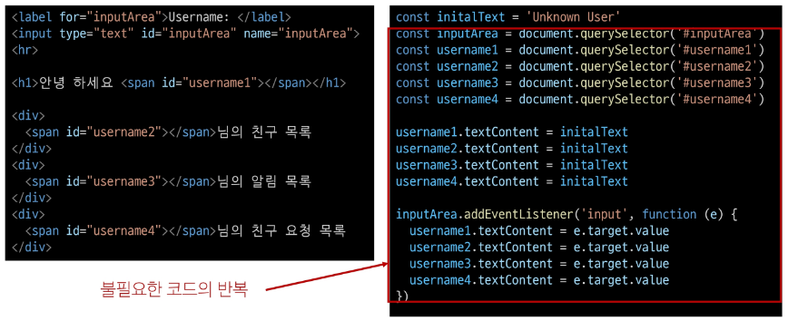
        - 직접적으로 DOM조작 활용해서 특정 요소를 메서드 직접 지정할 필요가 있고, 지정한 모든 요소에 대해 데이터를 일일이 수정하는 과정도 생김


### SPA (Single Page Application)
단일 페이지로 구성된 애플리케이션으로, 하나의 HTML 파일로 시작하여 사용자가 상호작용할 때마다 페이지 전체를 새로 로드하지 않고 화면의 필요한 부분만 동적으로 갱신함

- 대부분 JavaSctipt 프레임워크를 사용하여 클라이언트 측에서 UI와 랜더링을 관리
- CSR 방식 사용

### Client-side Rendering
클라이언트에서 화면을 렌더링하는 방식

- CSR 동작 과정

  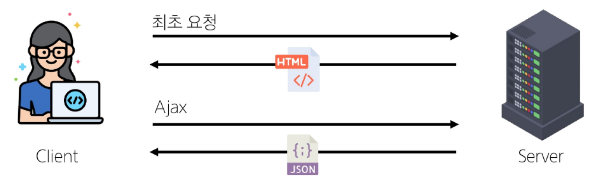
  1. 브라우저는 서버로부터 최소한의 HTML 페이지와 해당 페이지에 필요한 JavaScript 응답 받음
  2. 그 다음 클라이언트 측에서 JavaScript 사용하여 DOM을 업데이터하고 페이지를 렌더링
  3. 이후 서버는 더이상 HTML을 제공하지 않고 요청에 필요한 데이터만 응답
      - Google Maps, Instagram 등의 서비스에서 페이지 갱신 시 새로고침이 없는 이유

※ 클라이언트 사이드 렌더링(CSR) vs 서버 사이드 렌더링(SSR)

- CSR 장점
  - 빠른 페이지 전환
    - 페이지가 처음 로드된 후에는 필요한 데이터만 가져오면 되고, JavaScript는 전체 페이지를 새로 고칠 필요 없이 페이지의 일부를 다시 랜더링할 수 있기 때문
    - 서버로 전송되는 데이터의 양을 최소화(서버 부하 방지)
  - 사용자 경험(UX)
    - 새로고침이 발생하지 않아 네이티브 앱과 유사한 사용자 경험을 제공
  - Frontend와 Backend의 명확한 분리
    - Frontend는 UI 랜더링 및 사용자 상호 작용 처리를 담당 & Backend는 데이터 및 API 제공을 담당
    - 대규모 애플리케이션을 더 쉽게 개발하고 유지 관리 가능
  
- CSR 단점
  - 느린 초기 로드 속도
    - 전체 페이지를 보기 전에 약간의 지연을 느낄 수 있음
    - JavaScript가 다운로드, 구문 분석 및 실행될 때까지 페이지가 완전히 랜더링되지 않았기 때문
  - **SEO(검색 엔진 최적화)** 문제
    - 페이지를 나중에 그려 나가는 것이기 때문에 검색에 잘 노출되지 않을 수 있음
    - 검색엔진 입장에서 HTML을 읽어서 분석해야 하는데 아직 콘텐츠가 모두 존재하지 않기 때문
  
### SPA vs MPA / CSR vs SSR
- MPA (Multi Page Application)
  - 여러 개의 HTML 파일이 서버로부터 각각 로드
  - 사용자가 다른 페이지로 이동할 때마다 새로운 HTML 파일이 로드됨
- SSR (Server-side Renering)
  - 서버에서 화면을 랜더링하는 방식
  - 모든 데이터가 담긴 HTML을 서버에서 완성 후 클라이언트에게 전달


## Vue
### Vue.js
사용자 인터페이스 구축을 위한 JavaScript 프레임워크

- Vue 체험하기
  ```html
  <div id="app">
    <h1>{{ message }}</h1>
    <button v-on:click="count++">
      Count is: {{ count }}
    </button>
  </div>

  <script src="https://unpkg.com/vue@3/dist/vue.global.js"></script>
  <script>
    const { createApp, ref } = Vue

    const app = createApp({
      setup() {
        const message = ref('Hello vue!')
        const count = ref(0)

        return {
          message,
          count
        }
      }
    })

    app.mount('#app')
  </script>
  ```

  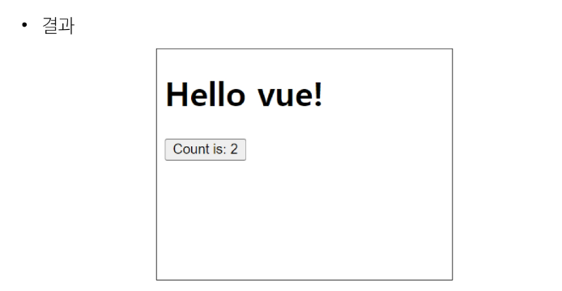

- Vue의 2가지 핵심 기능
  1. 선언적 렌더링(Declarative Rendering)
      - 표준 HTML을 확장하는 "템플릿 구문"을 사용하여 JavaScript 상태(데이터)를 기반으로 화면에 출력될 HTML을 **선언적**으로 작성
  2. **반응성(Reactivity)**
      - JavaScript 상태(데이터) 변경을 추적하고, 변경사항이 발생하면 자동으로 DOM을 업데이트


### Vue Style Guide
Vue의 스타일 가이드 규칙은 우선순위에 따라 4가지 범주로 나눔

- 규칙 범주
  - 우선순위 A: 필수(Essential)
    - 오류를 방지하는 데 도움이 되므로 어떤 경우에도 규칙을 학습하고 준수
  - 우선순위 B: 적극 권장(Strongly Recommended)
    - 가독성 또는 개발자 경험을 향상시킴
    - 규칙을 어겨도 코드는 실행되겠지만, 정당한 사유가 있어야 규칙을 위반할 수 있음
  - 우선순위 C: 권장(Recommended)
    - 일관성을 보장하도록 임의의 선택을 할 수 있음
  - 우선순위 D: 주의 필요(Use with Caution)
    - 잠재적 위험 특성을 고려함

### Vue tutorial
- Vue 사용 방법
  1. `CDN` 방식
      - Vue는 프로젝트가 아니어도 진행할 수 있으며, 한 장의 HTML만으로도 구성할 수 있음
      - 그러기 위해 HTML 안에 Vue 객체를 사용해야 하기 때문에 CDN 방식으로 뷰 개발자들이 만들어놓은 JS파일을 가지고 와서 사용하는 방법! 사용
  2. `NPM` 설치 방식
      - 직접 뷰 설치, 프로젝트 만드는 방식

- Vue Application 생성하기
  ```html
  <!-- html 화면 구성을 위한 기본 틀 -->
  <!DOCTYPE html>
  <html lang="en">

  <head>    <!-- html 문서를 위한 정보 -->
    <meta charset="UTF-8">
    <meta name="viewport" content="width=device-width, initial-scale=1.0">
    <title>Document</title>
  </head>
  <!-- 위에 애들은 내 서비스를 위해 수정이 필요하면 그때 수정하기(뷰를 위해 건드릴 필요XX) -->

  <body>
    <div id="app">
      <h1>{{ message }}</h1>
      <h1>{{ message.split('').reverse().join('') }}</h1>
    </div>

    <!-- body 영역에서 가장 먼저 처리해야할 부분: CDN 가져오는 부분 -->
    <script src="https://unpkg.com/vue@3/dist/vue.global.js"></script>
    <script>
      const { createApp, ref } = Vue
      // Vue가 가진 createApp 메서드를 가져와서 더 쉽게 사용하기 위해 할당해둔 상태
      // JS는 객체의 구조를 분해해서 할당 가능
      // 할당하고자 하는 변수명과 객체의 메소드 이름이 동일하다면 다른 객체에게 다시 할당하는 느낌으로 작성해준거
      // 한줄로 작성해놓은 이 방법이 '구조분해할당' 문법
      // 뷰 튜토리얼 6분7초

      // const obj = {
      //   setup: function () {

      //   }
      // }
      // createApp(obj)
      const app = createApp({
        setup() {
          const message = ref('Hello vue!')
          console.log(message.value)
          return {
            message
          }
        }
      })

      app.mount('#app')
    </script>
  </body>

  </html>
  ```
  - CDN 작성

    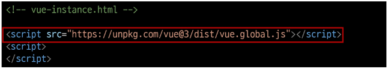
    - `"https://unpkg.com/vue@3/dist/vue.global.js"` 주소로 들어가보자
    - Vue 객체가 어떻게 만들어 져있는지 확인 가능
    - Vue 라는 어떤 객체가 정의되어 있고, function 형식으로 만들어서 이 객체가 가진 메서드를 가지고 와서 쓸 수 있겠구나 생각할 수 있음

      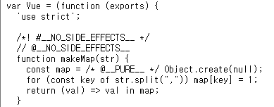

  - Application instance
    - CDN에서 Vue를 사용하는 경우 전역 Vue 객체를 불러오게 됨
    - 구조분해할당 문법으로 Vue 객체의 `createApp` 함수를 할당
    
      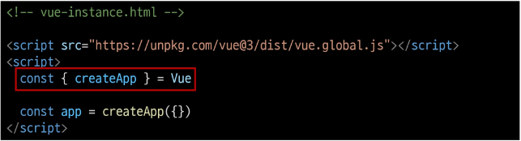
    - 모든 Vue 애플리케이션은 createApp 함수로 새 Application instance를 생성하는 것으로 시작함
      
      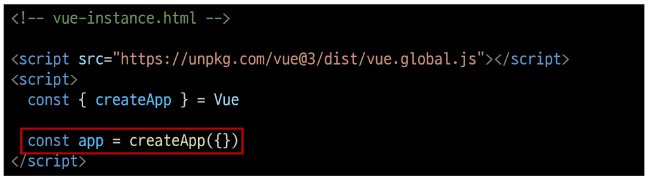
  
  - Root Component
    - createApp 함수에는 객체(컴포넌트)가 전달됨
    - 모든 App에는 다른 컴포넌트들을 하위 컴포넌트로 포함할 수 있는 Root(최상위) 컴포넌트가 필요(현재는 단일 컴포넌트)
      
      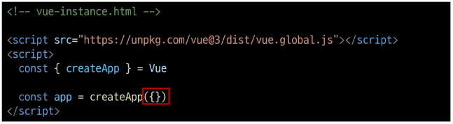
  
  - Mounting the App (앱 연결)
    - HTML 요소에 Vue Application instance를 탑재(연결)
    - 각 앱 인스턴스에 대해 `mount()`는 한 번만 호출할 수 있음
    
      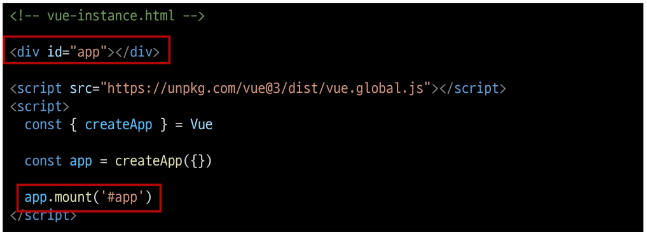

  - setup 함수
    - 컴포넌트가 동작하기 전에 미리 준비하는 "시작점", "초기 설정용 함수"
    - 이 함수 안에서 데이터를 정의하거나, 화면에 표시할 값을 계산하거나, 각종 로직(함수)을 준비할 수 있음
    - setup에서 준비한 값들은 이후 템플릿이나 컴포넌트의 다른 부분에서 바로 사용 가능

      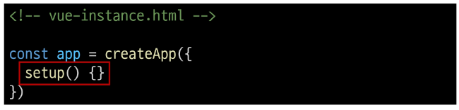

- ref 함수
  - 반응형 상태(데이터)를 선언하는 함수(Declaring Reactive State)
  - `.value` 속성이 있는 ref 객체로 래핑(wrapping)하여 반환하는 함수
  - ref로 선언된 변수의 값이 변경되면, 해당 값을 사용하는 템플릿에서 자동으로 업데이트
  - 인자는 어떠한 타입도 가능

    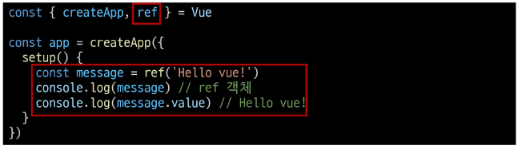
  - 템플릿의 참조에 접근하려면 setup 함수에서 선언 및 반환 필요
  - 편의상 템플릿에서 ref 사용할 때는 .value 작성할 필요XX (automatically unwrapped)

    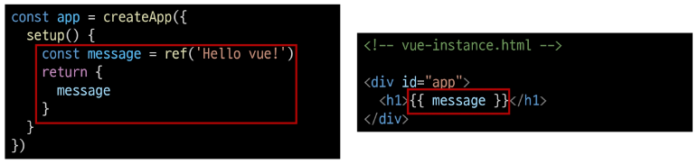

※ `ref()` : 반응형 상태를 선언하는 함수 -> 반응형을 가지는 참조 변수를 만드는 것 (ref === reactive reference)


### Vue 기본 구조
- `createApp()`에 전달되는 객체는 Vue 컴포넌트
- 컴포넌트의 상태는 `setup()` 함수 내에서 선언되어야 하며 **객체를 반환해야 함**

  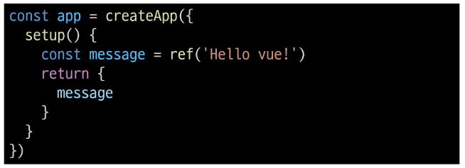

- 템플릿 렌더링
  - 반환된 객체의 속성은 템플릿에서 사용할 수 있음
  - Mustache syntax (콧수염 구문)을 사용하여 메시지 값을 기반으로 동적 텍스트를 렌더링

    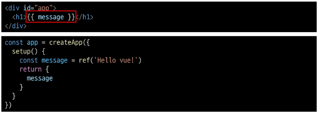
  - 콘텐츠는 식별자나 경로에만 국한되지 않으며 유효한 JavaScript 표현식을 사용할 수 있음

    

- Event Listeners in Vue
  - `v-on` directive를 사용하여 DOM 이벤트를 수신할 수 있음
  - 함수 내에서 반응형 변수를 변경하여 구성 요소 상태를 업데이트

    


### 참고
- ref 객체가 필요한 이유
  - Vue는 템플릿에서 ref를 사용하고 나중에 ref 값을 변경하면 자동으로 변경 사항을 감지하고 그에 따라 DOM을 업데이트 함
    - 의존성 추적 기반의 반응형 시스템
  - Vue는 렌더링 중에 사용된 모든 ref를 추적하며, 나중에 ref가 변경되면 이를 추적하는 구성 요소에 대해 다시 렌더링
  - 이를 위해서 참조 자료형의 객체 타입으로 구현한 것
    - JavaScript에서는 일반 변수의 접근 또는 변형을 감지할 방법이 없기 때문에 일반적인 변수가 아닌 객체 데이터 타입으로 사용!

- Ref Unwrap 주의사항
  - 템플릿에서의 unwrap은 ref가 최상위 속성인 경우에만 적용가능

    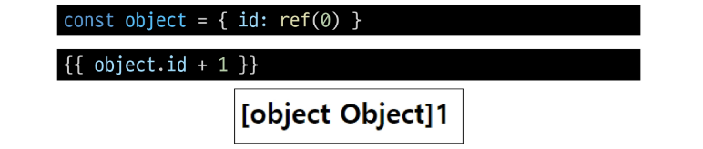
    - object는 최상위 속성이지만 `object.id`는 그렇지 않음
    - 표현식을 평가할 때 `object.id`가 unwrap 되지 않고 ref 객체로 남아있기 때문
    - 이 문제를 해결하기 위해서는 **id를 최상위 속성으로 분해**해야 함

      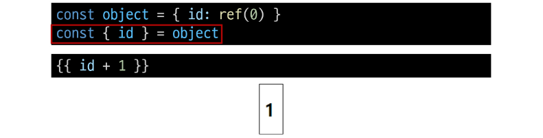

  - 단, ref가 `{{ }}`의 최종 평가 값인 경우는 unwrap 가능

    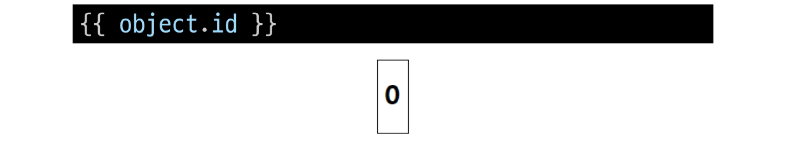
    - `{{ object.id.value }}` 와 동일
  
- 반응형 변수 vs 일반 변수
  
  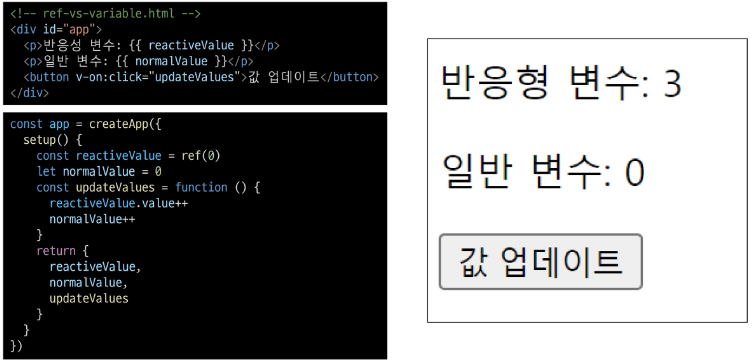


## Single-File Components
### Component
재사용 가능한 코드 블록

- Component 특징
  - UI를 독립적이고 재사용 가능한 일부분으로 분할하고 각 부분을 개별적으로 다룰 수 있음
  - 자연스럽게 애플리케이션은 중첩된 Component의 트리 형태로 구성됨

    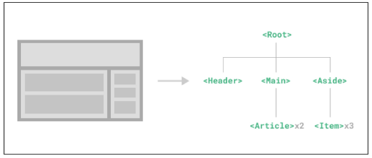

- Component 예시
  - 웹 서비스는 여러 개의 Component로 이루어져 있음

    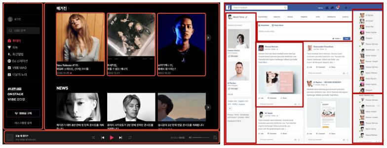

### Single-File Components (SFC)
컴포넌트의 템플릿, 로직 및 스타일을 하나의 파일로 묶어낸 특수한 파일 형식 ( `*.vue` 파일)

- SFC 파일 예시
  - Vue SFC는 HTML, CSS 및 JavaScript를 단일 파일로 합친 것
  - `<template>`, `<script>`, `<style>` 블록은 하나의 파일에서 컴포넌트의 뷰, 로직 및 스타일을 독립적으로 배치

    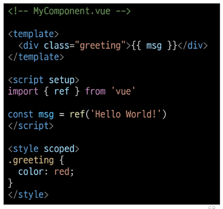

- SFC 문법
  - 각 `*.vue` 파일은 세 가지 유형의 최상위 언어 블록 `<template>`, `<script>`, `<style>`으로 구성됨
  - 언어 블록의 작성 순서는 상관없으나, 일반적으로 template -> script -> style 순서로 작성

  - 언어블록 - `<template>`
    -  각 `*.vue` 파일은 최상위 `<template>` 블록을 하나만 포함할 수 있음
      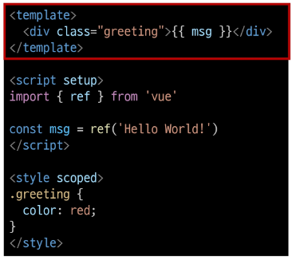

  - 언어블록 - `<script>`
    -  각 `*.vue` 파일은 최상위 `<script setup>` 블록을 하나만 포함할 수 있음(일반 `<script>` 제외)
    - 컴포넌트의 setip() 함수로 사용되며 컴포넌트의 각 인스턴스에 대해 실행
    - 변수 및 함수는 동일한 컴포넌트의 템플릿에서 자동으로 사용 가능

      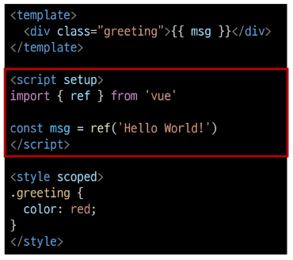

  - 언어블록 - `<style>`
    - `*.vue` 파일에는 여러 `<style>` 태그가 포함될 수 있음
    - scoped가 지정되면 CSS는 현재 컴포넌트에만 적용됨

      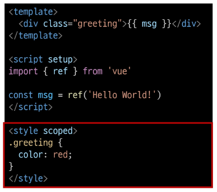

- 컴포넌트 사용하기
  - Vue SFC는 일반적인 방법으로 실행할 수 없으며, 컴파일러를 통해 컴파일된 후 빌드 되어야 함
  - 실제 프로젝트에서는 Vite와 같은 공식 빌드(Build) 도구를 사용

    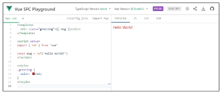
  

## Node.js
