# Introduction to Database
## Database
체계적인 데이터 모음

- 데이터
  - 저장이나 처리에 효율적인 형태로 변환된 정보

**※ 데이터를 저장하고 잘 관리하여 활용할 수 있는 기술이 중요해짐**

### Relational Database
- 데이터베이스 역할
  - 데이터를 **저장**(구조적 저장)하고 조작(CRUD)

- 관계형 데이터베이스
  - 데이터 간에 **관계**가 있는 데이터 항목들의 모음
  - 테이블, 행, 열의 정보를 구조화하는 방식으로
  - **서로 관련된 데이터 포인터를 저장**하고 이에 대한 **엑세스**를 제공함

    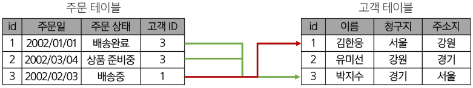

- 관계
  - 여러 테이블 간의 (논리적) 연결
    - 물리적XX, 만약 물리적인 연결이었다면 테이블이 하나 뿐이었을 것

- 관계로 할 수 있는 것
  - 이 관계로 인해 두 테이블을 사용하여 데이터를 다양한 형식으로 조회할 수 있음
    - 특정 날짜에 구매한 모든 고객 조회
    - 지난 달에 배송일이 지연된 고객 조회 등
  
- 관계형 데이터베이스 예시
  - 예시1. 고객 데이터가 테이블에 저장되어 있다고 가정

    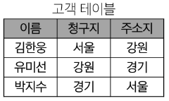
    - 고객 데이터 간 비교를 위해서는 어떤 값을 활용해야할까?
    - "각 데이터에 고유한 식별 값을 부여하자" => **기본키(Primary Key)**

      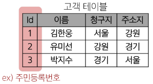
  - 예시2. 각 고객이 주문한 데이터가 테이블에 저장되어 있다고 가정

    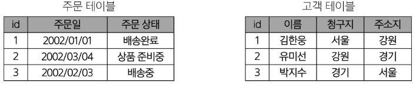
    - 누가 어떤 주문을 했는지 어떻게 식별할 수 있을까? 
    - "주문 정보에 고객의 고유한 식별 값을 저장하자" => **외래 키(Foreign Key)**

      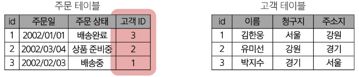

- 관계형 데이터베이스 관련 키워드
  1. Table (aka Relation)
      - 데이터를 기록하는 곳

        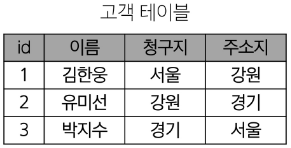
  2. Field (aka Column, Attribute)
      - 각 필드에는 고유한 데이터 형식(타입)이 지정됨

        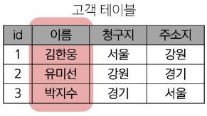
  3. Record (aka Row, Tuple)
      - 각 레코드에는 구체적인 데이터 값이 저장됨

        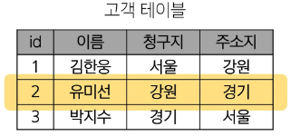
  4. Database (aka Schema)
      - 테이블의 집합

        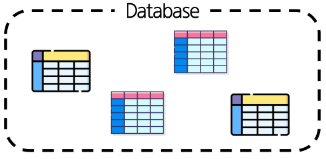
  5. Primary Key (기본키, PK)
      - 각 레코드의 고유한 값
      - 관계형 데이터베이스에서 **레코드의 식별자**로 활용

        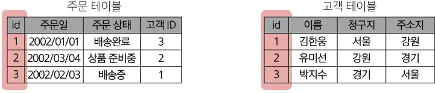
  6. Foreign Key (외래 키, FK)
      - 테이블의 필드 중 다른 테이블의 레코드를 식별할 수 있는 키
      - 다른 테이블의 기본 키를 참조
      - 각 레코드에서 서로 다른 테이블 간의 **관계를 만드는 데** 사용

        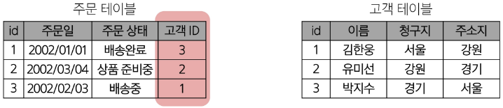

※ 데이터베이스 정리

-> Table은 데이터가 기록되는 곳

-> Table에는 행에서 고유하게 식별 가능한 기본 키라는 속성이 있으며,

-> 외래 키를 사용하여 각 행에서 서로 다른 테이블 간의 관계를 만들 수 있음

-> 데이터는 기본 키 또는 외래 키를 통해 결합(join)될 수 있는 여러 테이블에 걸쳐 구조화됨.


### RDBMS
- DBMS (Database Management System)
  - 데이터베이스를 관리하는 소프트웨어 프로그램
  - 데이터 저장 및 관리를 용이하게 하는 시스템으로, 데이터베이스와 사용자 간의 인터페이스 역할을 함
  - 사용자가 데이터 구성, 업데이트, 모니터링, 백업, 복구 등을 할 수 있도록 도움

- RDBMS (Relational Database Management System)
  - '관계형' 데이터베이스를 관리하는 소프트웨어 프로그램
  - RDBMS 서비스 종류
    - `SQLite`
    - `MySQL`
    - `PostgreSQL`
    - `Oracle Database`


## Database Modeling
데이터베이스 시스템을 구축하기 위한 과정으로 데이터의 구조, 관계, 특성을 결정하는 작업

-> 효율성, 일관성, 무결성을 보장하기 위해 진행하는 중요한 단계

- 무결성 제약 조건
  - 데이터베이스의 데이터 일관성을 유지하고,
  - 부적절한 데이터의 삽입, 수정, 삭제를 방지하여 데이터의 신뢰성을 보장하는 조건

    1. 개체 무결성 (Entity Integrity)
        - 기본키의 값이 중복되지 않고, NULL값이 허용되지 않는 것을 보장하는 제약 조건
          ```SQL
          CREATE TABLE Student (
            student_id INT PRIMARY KEY, -- NULL 불가능, 중복 불가능
            name VARCHAR(50) NOT NULL
          )
          ```
          - 각 레코드는 유일한 식별자를 가져야 한다
          - 기본키는 NULL값을 가질 수 없다
    2. 참조 무결성 (Referential Integrity)
        - 외래 키와 기본 키 간의 관계를 유지하고, 무효한 참조를 방지하는 제약 조건
          ```SQL
          CREATE TABLE Department (
            dept_id INT PRIMARY KEY, 
            dept_name VARCHAR(50) NOT NULL
          );

          CREATE TABLE Employee (
            emp_id INT PRIMARY KEY,
            emp_name VARCHAR(50) NOT NULL,
            dept_id INT,
            FOREIGN KEY (dept_id) REFERENCES Department(dept_id) -- 참조 무결성 적용
          )
          ```
          - 외래 키 값은 참조하는 테이블의 기본 키 값을 참조하거나 NULL값을 가질 수 있다
          - 존재하지 않는 기본 키는 참조할 수 없다
    3. 도메인 무결성 (Domain Integrity)
        - 각 속성의 값이 정의된 도메인에 속하는 것을 보장하는 제약 조건
        ```SQL
        CREATE TABLE Product (
          product_id INT PRIMARY KEY,
          price DECIMAL(10, 2) CHECK (price > 0) -- 가격은 0보다 커야 함
          category VARCHAR(20) CHECK (category IN ('전자제품', '의류', '도서')) -- 특정 값만 허용
        )
        ```
        - 도메인은 속성이 가질 수 있는 값의 범위, 형식, 제약 조건 등을 정의해야 한다
        - 속성 값이 도메인에 속하지 않는 경우에는 삽입 또는 수정을 제한하거나 오류를 발생시킨다
    4. 그 외 무결성 제약 조건
        - 고유성(UNIQUE) 무결성
          - 특정 컬럼의 값이 테이블 내에서 중복되지 않도록 제한함
        - NULL 무결성 (NOT NULL)
          - 특정 컬럼이 NULL값을 가질 수 없도록 강제함
        - 일반 무결성 (General Integrity)
          - 위의 특정 제약조건 외에도, 비즈니스 로직에 따라 추가로 정의하는 무결성 규칙
          - 예시: 은행 계좌 잔액에 0 미만으로 내려가지 않도록 하는 규칙을 설정하는 경우
  
### Proceeding with Database modeling
※ 데이터베이스 모델링 진행

-> `요구사항 수집 및 분석 -> 개념적 설계 -> 논리적 설계 -> 물리적 설계`

1. 요구사항 수집 및 분석
    - 어떤 종류의 데이터를 정리하는지 정보 수집하고 어떤 작업을 수행해야 하는지 파악하는 단계
    - 개체 (Entity)
      - 업무에 필요하고 유용한 정보를 저장하는 집합적인 것
      - ex. 고객, 제품, 사원, 부서
    - 속성 (Attribute)
      - 관리하고자 하는 것의 의미를 더 이상 작은 단위로 분리되지 않은 데이터 단위
      - ex. 고객명, 고객 전화번호, 상품명, 상품 가격
    - 관계 (Relationship)
      - 객체 사이의 논리적인 연관성을 의미하는 것
      - ex. 고객-상품, 부서-사원

2. 개념적 설계
    - 요구사항을 기반으로 데이터베이스의 **개념적 모델**을 설계
    - 개체(Entity)와 관계(Relationship)를 식별하고, 개체 간의 관계를 정의하여 ER Diagram을 작성

      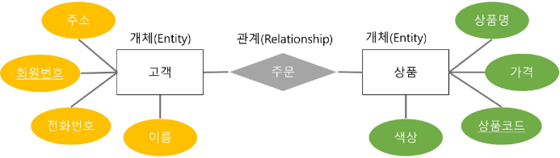

※ ERD 표기 방법
- 까마귀 발 모델(Crow's Foot Model) 표기법

  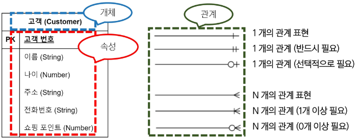

- N:M 관계 예시

  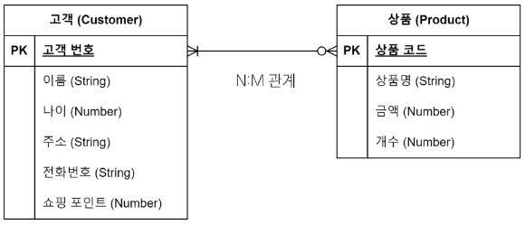

3. 논리적 설계
    - 개념적 설계를 기반으로 데이터베이스의 **논리적 구조**를 설계
    - 테이블, 속성, 제약 조건 등과 같은 구체적인 데이터베이스 개체를 정의
    - 정규화를 수행하여 데이터의 중복을 최소화하고 일관성을 유지

      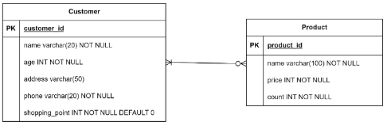
4. 물리적 설계
    - 논리적 설계를 기반으로 데이터베이스를 실제 **저장 및 운영** 할 수 있는 형태로 변환하는 단계
    - 테이블의 인덱스, 파티션, 클러스터링 등 물리적인 구조와 접근 방식을 결정
    - 보안, 백업 및 복구, 성능 최적화 등을 고려하여 데이터베이스를 설정
  

## Database Normalization
- 정규화 (Normalization)
  - 중복을 최소화하고 데이터의 일관성과 효율성을 유지하기 위해 데이터를 구조화하는 과정
  - 정규화의 목적
    - 불필요한 데이터를 제거하여 중복을 최소화하기 위해
    - 각 종 이상 현상(Anomaly)을 방지하기 위해
    - 데이터베이스 구조를 변경할 때 다시 구조화 해야 하는 영역을 최소화

- 이상 현상 (Anomaly)
  - 데이터베이스를 잘못 설계했을 때 발생할 수 있는 불필요한 데이터 중복으로 인한 부작용
    1. 삽입 이상 (Insertion Anomaly)
        - 새로운 데이터를 삽입하기 위해 **불필요한 데이터도 함께 삽입해야 하는 문제**
    2. 갱신 이상 (Update Anomaly)
        - 중복된 데이터 중 **일부만 변경하여 데이터가 불일치되는 문제**
    3. 삭제 이상 (Deletion Anomaly)
        - 데이터를 삭제하는 경우, **반드시 있어야 하는 데이터까지 같이 삭제되는 문제**
    
### 1NF ~ 3NF, BCNF
- 데이터베이스 정규화 종류
  - 1NF ~ 6NF (+ BCNF)가 있지만 일반적으로 3NF만 되면 정규화가 되었다고 표현
  - 제 1 정규화 (1NF)
    - 각 요소의 **중복되는 항복은 없어야** 한다
  - 제 2 정규화 (2NF)
    - 제 1 정규화를 만족하면서 PK가 아닌 모든 속성이 PK에 **완전 함수 종속되어야** 한다
  - 제 3 정규화 (3NF)
    - 제 2 정규화를 만족하면서 모든 속성이 PK에 **이행적 함수 종속이 되지 않아야** 한다
  - BCNF (Boyce Codd Normalizaion Form)
    - 제 3 정규형을 만족하면서, **모든 결정자가 후보키(Candidate Key)**여야 함

### 제 1 정규화 (1NF)
- 각 속성이 원자적(Atomic)이어야 함
  - 각 속성(컬럼)이 **원자값(Atomic Value, 하나의 값)**만을 가져야 함
- 각 행이 유일한 식별자(Primary Key)를 가져야 함
  - 중복된 데이터를 허용하지 않음

    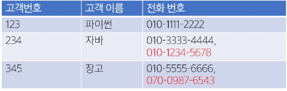
- 제 1 정규화 시도
  - 2개를 초과하는 전화번호를 저장할 수 없음
  - 해결을 위해 컬럼을 추가하는 경우, 불필요한 NULL값을 가지게 됨

    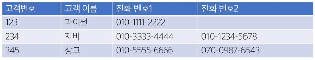
  - 동일 데이터를 여러 행으로 나누어 저장하는 경우, 기본키가 중복 됨

    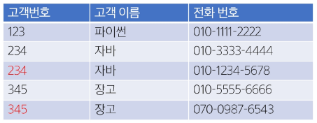
  - 고객 번호를 참조하여 **전화번호를 저장하는 테이블을 분리**

    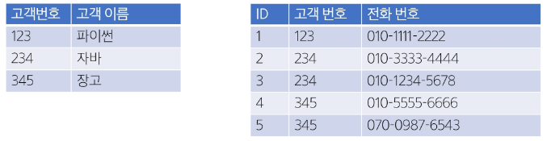

### 제 2 정규화 (2NF)
- 제 1 정규형을 만족하면서, 부분 함수 종속(Partial Dependency)이 없어야 함
  - 즉, 테이블의 **모든 컬럼이 기본키에 대해 완전하게 종속**되어야 함
  - 기본 키의 일부만으로 결정될 수 있는 속성 제거(새로운 테이블로 분리)

    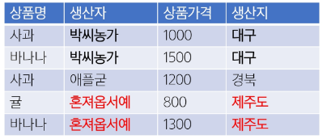

    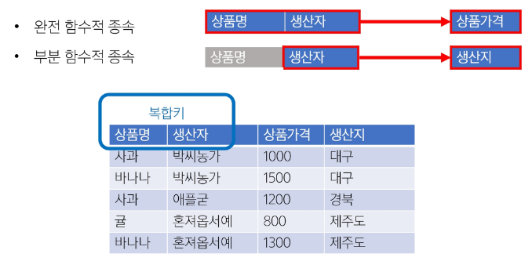
  - 생산자와 생산지가 완전 함수적 종속이 되도록 테이블 분리

    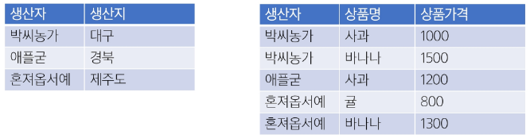

### 제 3 정규화 (3NF)
- 제 2 정규형을 만족하면서, 기본 키 이외의 속성이 기본 키에 **이행적 함수 종속**(Transitive Dependency)되지 않아야 함
- 이행적 함수 종속이란?
  - `A → B`, `B → C`가 성립할 때 `A → C`가 성립하는 것
  - 기본 키가 아닌 다른 속성에 종속된 경우를 의미함
- 즉, **기본 키(PK)가 아닌 속성 간의 종속성을 제거해야 함**
- 비(非) 기본 키 컬럼이 다른 비 기본 키 컬럼을 결정하면 안됨
  - 예시
    - 학생번호 → 학과, 학과 → 학과장
    - 학생 번호는 학과장을 직접 결정하지 않음 -> 이행적 함수 종속 발생

      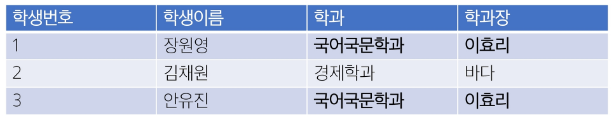
    - 학생정보와 학과정보를 분리

      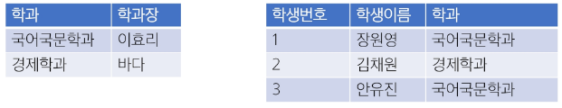

### BCNF
- 후보 키(Candidate Key)
  - 테이블에서 각 행을 유일하게 식별할 수 있는 속성(또는 속성의 조합) 중, 최소성을 만족하는 키를 의미
  - 후보 키의 조건
    - **유일성(Unique)**: 테이블의 각 행을 고유하게 식별할 수 있어야 함
    - **최소성(Minimality)**: 불필요한 속성을 포함하지 않는 최소한의 속성 조합이어야 함
  - 후보키 예시

    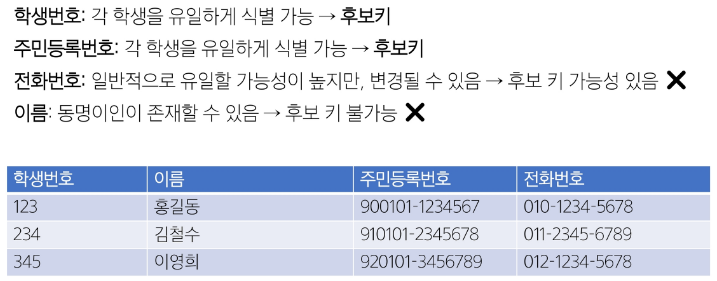

- BCNF (Boyce Codd Normalizaion Form)
  - 제 3정규형을 만족하면서, 모든 결정자가 **후보 키**여야 함
    - 제 3 정규형(3NF)를 적용한 후에도 일부 이상현상(Anomaly)이 남아있을 수 있음
    - 3NF는 모든 비(非) 기본 키 속성이 기본 키에 이행적 종속되지 않아야 함을 요구하지만, **후보키가 아닌 속성이 결정자가 되는 문제**를 해결하지 못할 수 있음

  - **모든 결정자가 후보 키가 되도록 강제**함으로써 보다 엄격한 정규화
    - 기본 키가 아닌 속성이 다른 속성을 결정할 수 없어야 함
  - 예시
    - 담당 교수가 하나의 과목만 맡고 있다고 가정했을 때
    - 김교수가 '국문학의 이해' 과목을 '고전 문학의 이해'로 명칭 변경 가능

      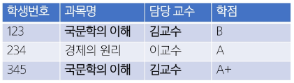
    - 담당 교수가 과목의 결정자가 됨
    - 과목은 담당 교수를 따라갈 수밖에 없어 갱신 이상 발생 가능

      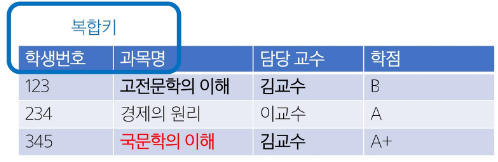
    - 학점 테이블과 과목 테이블 분리

      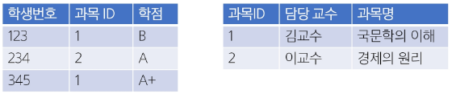


## SQL 기본
### SQL (Structure Query Language)
데이터베이스에 정보를 저장하고 처리하기 위한 프로그래밍 언어

-> 테이블 형태로 **구조화**(Structure)된 관계형 데이터베이스에게 요청을 **질의**(요청, Query)

-> 관계형 데이터베이스와의 대화를 위해 사용하는 프로그래밍 언어임


- SQL Syntax
  ```SQL
  SELECT column_name FROM table_name;
  ```
  - SQL 키워드는 대소문자 구분하지XX
    - 하지만 대문자 작성 권장(명시적 구분)
  - 각 SQL Statements의 끝에는 세미콜론 `;` 필요
    - 세미콜론은 각 SQL Statements을 구분하는 방법(명령어 마침표)

### SQL Statements
SQL을 구성하는 가장 기본적인 코드 블록

- SQL Statements 예시
  ``` SQL
  SELECT column_name FROM table_name;
  ```
  - 위 코드는 SELECT Statement라 부름
  - 이 Statement는 `SELECT`, `FROM` 2개의 키워드로 구성됨

- 수행 목적에 따른 SQL Statements 4가지 유형
  1. DDL - 데이터 정의
  2. DQL - 데이터 검색
  3. DML - 데이터 조작
  4. DCL - 데이터 제어

  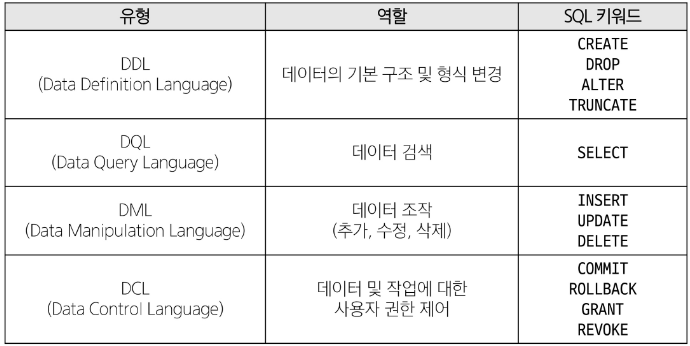


## DDL (Data Definition Language)
테이블을 정의하고 수정하고 삭제하기 위한 SQL

### 사전 준비
  - MySQL 서버 확인

    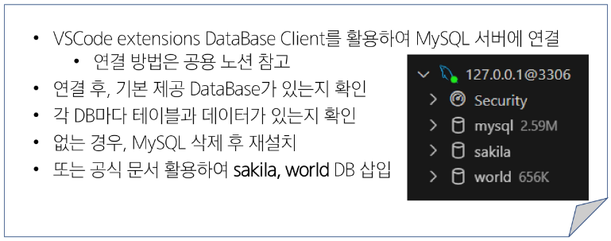
  - 서버 연결하기

    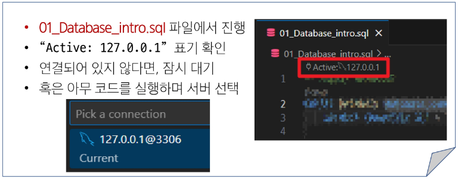

### CREATE DATABASE
```SQL
CREATE DATABASE database_name
    DEFAULT CHARACTER SET = 'utf8mb4'
```
- 연결된 RDBMS 서버에 DB 생성
- 텍스트 저장하고 처리할 때 사용되는 문자 인코딩 방식을 CHARACTER SET으로 지정
  - 일반적으로 'utf8mb4' 사용
- 코드 실행(Run) 후 결과 확인 `Nms AffectedRows: 1`

  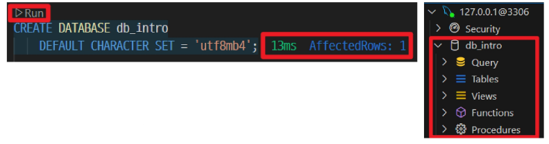
  - 실행 결과 메시지 뿐만 아니라, 실제로 DB 생성됐는지 반드시 확인

- `USE database_name`
  ```SQL
  USE db_intro;
  ```
  - 작업 진행할 DB 선택
    - **단, USE 명령문은 타 RDBMS에서는 지원 형태가 다를 수 있음에 유의하자**

### CREATE TABLE
테이블 생성

```SQL
CREATE TABLE table_name (
  column_1 data_type constraints,
  column_2 data_type constraints,
  ...,
);
```
- 각 필드에 적용할 데이터 타입 작성
- 테이블 및 필드에 대한 제약조건(constraints) 작성
- CREATE TABLE 활용
  - examples 테이블 생성 및 확인
    ```SQL
    CREATE TABLE examples (
      ExamId INT PRIMARY KEY AUTO_INCREMENT,
      LastName VARCHAR(50) NOT NULL,
      FirstName VARCHAR(50) NOT NULL
    );
    ```
  - 테이블 schema(구조) 확인 -> MySQL
    ```SQL
    -- 구조 보여주는거
    DESCRIBE examples;
    ```
    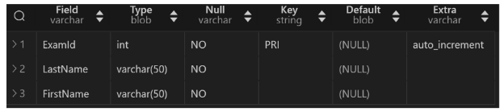
    ```SQL
    -- 롸?
    SHOW CREATE TABLE examples;
    ```
    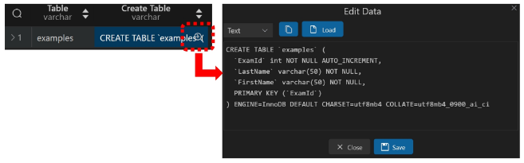

- MySQL 데이터 타입

  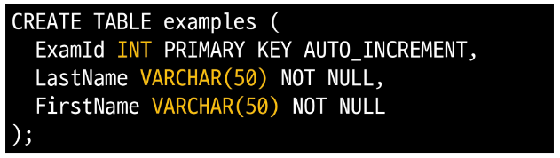
  1. `NULL`
      - 아무런 값도 포함하지 않음을 나타냄
  2. 문자열 타입
      - `CHAR` : 고정 길이
      - `VARCHAR` : 가변 길이
      - `TEXT` : 긴 텍스트
  3. 숫자 타입
      - 정수: `INT`, `BIGINT`
      - 실수 - 부동소수점: `FLOAT`, `DOUBLE`
      - 실수 - 고정소수점: `DECIMAL`
      - 여기 뭐 설명 잘못 했다는듯?2일차 첫부분 보기

  4. 날짜와 시간 타입
      - `DATE`, `DATETIME`
      - `TIMESTAMP`: 자동으로 현재 시간 설정 가능
  5. 기타 데이터 타입
      - `BOOL`
      - `ENUM(val1, val2, val3, ...)`: 정의된 값 중 하나를 선택
      - `BLOB`: 대용량 바이너리 데이터

- 제약 조건(Constraints)

  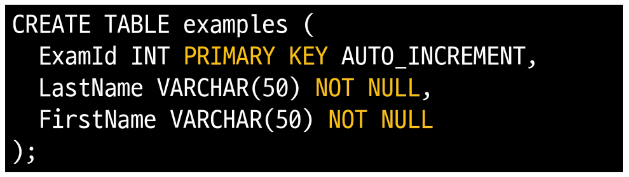
  - 테이블 필드에 적용되는 규칙 또는 제한 사항
  - 데이터의 무결성을 유지하고 데이터베이스의 일관성을 보장
    - `PRIMARY KEY` : 해당 필드를 기본 키로 지정
    - `NOT NULL` : 해당 필드에 NULL값을 허용하지 않도록 지정
    - `FOREIGN KEY` : 다른 테이블과의 외래 키 관계를 정의
    - `CHECK` : 저장되는 값이 특정 조건을 만족하는지 확인
  - 제약조건 정의 방법

    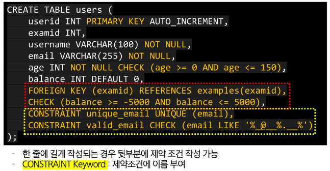

- CONSTRAINT 키워드
  - 제약 조건에 이름을 부여하여 정의할 때 사용하는 키워드
    - 데이터베이스 구조 및 관리에 용이
    - 디버깅 및 오류 추적에 용이
    - 유지 보수에 용이
  - CONSTRAINT 키워드로 정의 가능한 제약조건
    - `PRIMARY KEY`
    - `FOREIGN KEY`
    - `UNIQUE`
    - `CHECK`

- AUTO_INCREMENT 키워드

  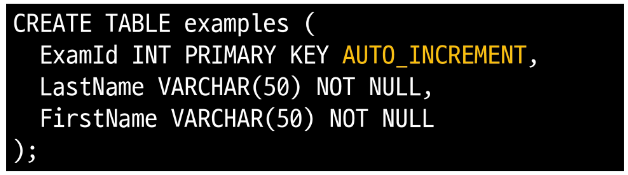
  - 자동으로 고유한 정수 값을 생성하고 할당하는 필드 속성
  - AUTO_INCREMENT 특징
    - 필드의 자동 증가를 나타내는 특수한 키워드
    - 주로 primary key 필드에 적용
    - `INT PRIMARY KEY AUTO_INCREMENT`가 작성된 필드는 항상 새로운 레코드에 대해 이전 최대 값보다 큰 값을 할당
    - 삭제된 값은 무시되며 재사용하지 않음
  
### ALTER TABLE
테이블 및 필드 조작

- ALTER TABLE 역할

  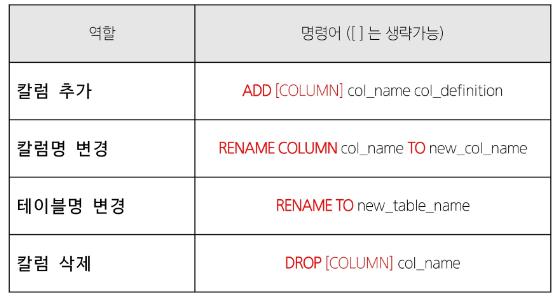

1. ALTER TABLE ADD COLUMN syntax
  ```SQL
  ALTER TABLE
      table_name
  ADD COLUMN
      col_name column_definition;
  ```
  - ADD COLUMN 키워드 이후 추가하고자 하는 새 필드 이름과 데이터 타입 및 제약 조건 작성
    - 단, 추가하고자 하는 필드에 NOT NULL 제약조건이 있을 경우 NULL이 아닌 기본 값 설정 필요
  - ALTER TABLE ADD COLUMN 활용
    - examples 테이블에 다음 조건에 맞는 Country 필드 추가

      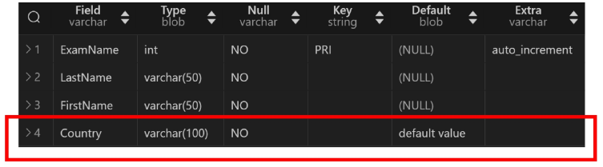
      ```SQL
      ALTER TABLE 
        examples
      ADD COLUMN
        Country VARCHAR(100) NOT NULL DEFAULT 'default value';
      ```
    - examples 테이블에 다음 조건에 맞는 Age, Address 필드 추가

      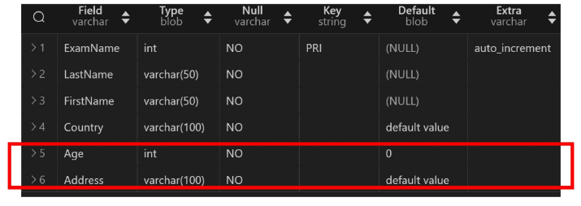
      ```SQL
      ALTER TABLE examples
      ADD COLUMN Age INTEGER NOT NULL DEFAULT 0,
      ADD COLUMN Address VARCHAR(100) NOT NULL DEFAULT 'default value';
      ```
      - ADD COLUMN 사이에 `,`를 붙여서 여러 컬럼을 한 번에 추가 가능

2. ALTER TABLE RENAME COLUMN syntax
  ```SQL
  ALTER TABLE
      table_name
  RENAME COLUMN
      current_name TO new_name
  ```
  - RENAME COLUMN 키워드 뒤에 이름을 바꾸려는 필드의 이름을 지정하고 TO 키워드 뒤에 새 이름 지정
  - ALTER TABLE RENAME COLUMN 활용
    - examples 테이블 Address 필드의 이름을 PostCode로 변경

      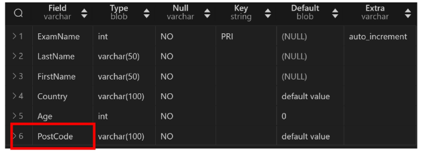
      ```SQL
      ALTER TABLE examples
      RENAME COLUMN Address TO PostCode;
      ```

3. ALTER TABLE RENAME TO syntax
  ```SQL
  ALTER TABLE
      table_name
  RENAME TO
      new_table_name
  ```
  - RENAME TO 키워드 뒤에 새로운 테이블 이름 지정
  - ALTER TABLE RENAME TO 활용
    - examples 테이블 이름을 new_examples로 변경

      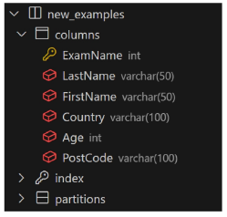
      ```SQL
      ALTER TABLE examples
      RENAME TO new_examples;
      ```

### DROP TABLE
테이블 삭제

- DROP TABLE syntax
  ```SQL
  DROP TABLE table_name;
  ```
  - DROP Table statement 이후 삭제할 테이블 이름 작성

- DROP TABLE 활용
  ```SQL
  DROP TABLE new_examples;
  ```
  - new_examples 테이블 삭제 시도(실패)
    - user 테이블에서 examid를 참조하고 있음

      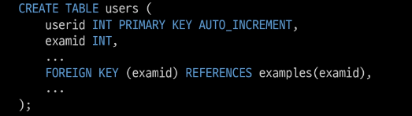
  - users 테이블 먼저 삭제 후, new_examples 테이블 삭제하자


### TRUNCATE TABLE
테이블의 모든 데이터 비우는 작업

-> DELETE와 유사하지만 TRUNCATE 동작은 Table을 DROP 후 재생성하기 때문에 ID(PK) 값이 초기화 됨

- TRUNCATE TABLE syntax
  ```SQL
  TRANCATE [TABLE] table_name;
  ```
  - TRANCATE [TABLE] statement 이후 데이터를 삭제할 테이블 이름 작성


## 참고
### Query
"데이터베이스로부터 정보를 요청" 하는 것
-> 일반적으로 SQL로 작성하는 코드를 쿼리문(SQL문)이라 함

### SQL 표준
SQL은 미국 국립 표준 협회(ANSI)와 국제 표준화 기구(ISO)에 의해 표준이 채택됨

- 모든 RDBMS에서 SQL 표준을 지원
- 다만 각 RDBMS마다 독자적인 기능에 따라 표준을 벗어나는 문법이 존재하니 주의

### 반드시 NOT NULL 제약을 사용해야할까?
"NO"

- 하지만 데이터베이스를 사용하는 프로그램에 따라 NULL을 저장할 필요가 없는 경우가 많으므로 대부분 NOT NULL을 정의

- "값이 없다"라는 표현을 테이블에 기록하는 것은 "0"이나 "빈 문자열" 등을 사용하는 것으로 대체하는 것을 권장

