# AI & 기계학습 기초 - AI와 ML은 무엇인가?
## AI, ML, DL
- AI (Artificial Intelligence)
  - 주어진 환경/데이터를 인지·학습·추론을 통해 목표 달성을 하도록 예측·행동 선택·계획하는 시스템

- ML (Machine Learning)
  - AI 범주 내에서 데이터로부터 학습하여 목적을 달성하는 접근 방법론
  - ex. 언어 모델, 이미지 분류 모델, 추천 시스템

- DL (Deep Learning)
  - ML 범주 내에서 신경망(Neural Network) 함수를 사용한 학습 방법론

- AI – ML (ML이 아닌 AI 시스템)의 예
  - 규칙 기반 시스템
  - 휴리스틱 기반(최적화) 알고리즘

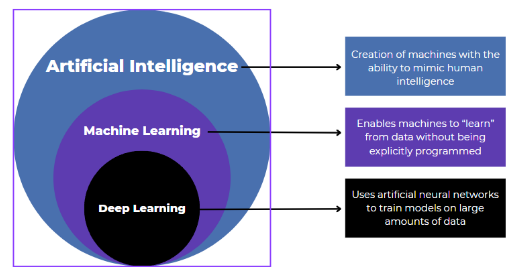

## 데이터와 학습의 이해
### 데이터 구성 요소 (Feature/Label)
- 데이터의 중요성
  - 머신러닝은 규칙을 직접 코딩하지 않고 (하드코딩XX), 데이터에서 규칙을 학습함
  - 데이터(Feature, Label)의 분포와 관계가 머신러닝의 학습 결과를 결정

- Feature (피처, 특성)
  - 모델이 예측에 사용하는 입력 정보 -> `input`
  - 예측, 판단의 근거/단서

- Label (라벨, 목표값)
  - 모델이 예측하려는 정답 -> `output`
  - 학습의 목표값

  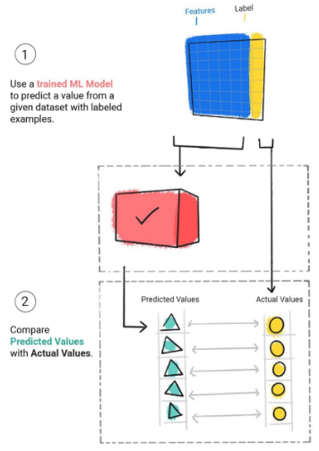

### ML 실생활 예시
- 예시1: 유튜브 추천
  - Feature
    - 각 영상들의 정보(장르, 크리에이터, 조회수, 좋아요 수 등)
    - 사용자 정보(시청 이력, 구독 채널 등)
  - Label
    - 영상에 대한 사용자 피드백(시청 여부, 좋아요 클릭 여부)

    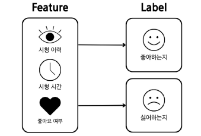

- 예시2: 스팸메일 분류
  - Feature
    - 메일 제목, 발신자, 단어 빈도
  - Label
    - 스팸 / 정상

## 단일 피쳐 기반 학습
### 1D 피쳐 기반 학습 (단일 피쳐 학습)
- 1D = 1차원
- Feature가 하나일 때 머신러닝이 학습하는 가장 단순한 형태
- 수식
  - $Income_i​=f^∗(Years of Education_i​)+ε_i​$
  - 데이터셋 `D` : 30명의 **Years of Education**(피처)과 **Income**(라벨) 쌍
    - $D = \{(Years\ of\ Education_i,\ Income_i)\}_{i=1}^{30}$

      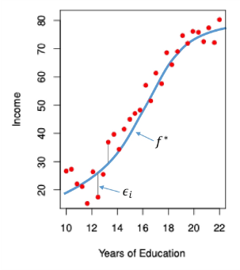
    - 빨간색 데이터 포인트들을 가지고, X와 Y의 **함수적인 관계를 가정**할 것임
  - $f^*$ : 미지의 참 함수
    - Feature와 Label 사이의 실제 평균 관계
    - 하지만 직접 관찰할 수 없음 (우리가 정확히 알 수 없음)
    - 오차가 포함된 데이터(접근만 가능)
  - $ε$ : 측정 오차
    - 데이터에는 주로 측정 오차가 섞여 있음
    - ex. 측정 기기의 한계, 환경적 요인 등
    - 따라서, `데이터 = 참 함수 + 오차 (f* + ε)`

- ※ 미지의 참 함수 $f^*$와 측정오차 $ε$는 관측 불가능
  - 관측 가능한 것은 데이터 포인트(빨간점) 뿐

    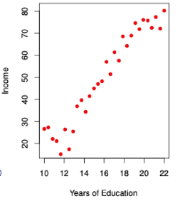
    - "빨간 점들을 보면서 feature와 label 사이의 평균적인 관계를 잘 나타내는 함수는 무엇일까?"를 학습하는 것
    - 무엇이 관측 가능하고, 무엇이 관측 가능하지 않은지 확실히 알아야 함

- 피처와 라벨의 관계를 잘 나타낸 함수 $f$는 무엇일까?
  - 여기서의 $f$는 미지의 참 함수 $f^*$가 아님XX
    - $f$가 미지의 참 함수와 동일하다면 그것이 가장 이상적인 상황
  - 데이터를 설명하는 여러 함수 후보가 존재
  - 어떤 함수가 가장 잘 맞는지 **학습**해야 함

    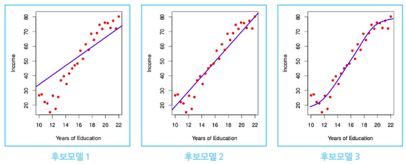

### 모델과 가설공간
- 학습 (Learning)
  - "입력(Feature) → 출력(Label)" 관계를 찾는 과정
  - 평균 관계를 하나의 함수로 표현함
  - 하지만 관계를 표현할 수 있는 함수는 무수히 많음

- 가설 공간 (Hypothesis Space)
  - 관계를 표현할 수 있는 모든 후보 함수들의 모음
  - **피처 공간**과 **라벨 공간** 위에서 정의된 함수들의 집합 $\mathcal{F}$

- 모델 (Model)
  - 가설공간 $\mathcal{F}$에 속한 특정 함수 $f$

    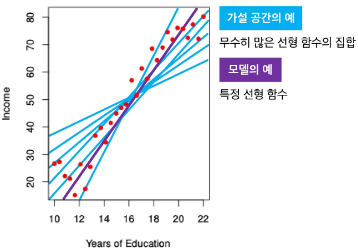
    - 가설 공간을 '선형 함수'로 정했다면
    - 모델은 특정 선형 함수를 뜻함
  
- 선형함수/비선형함수 가설공간

  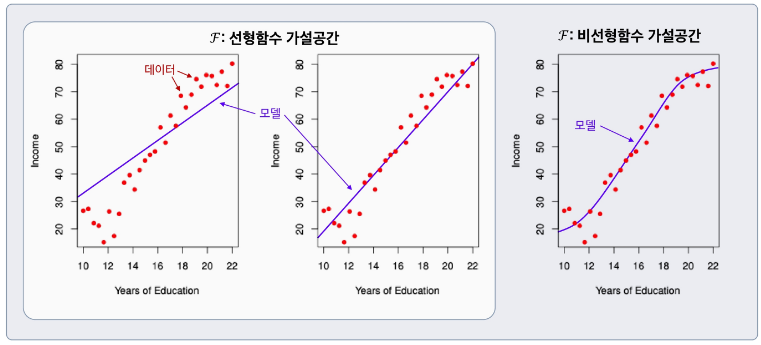

### 학습 (Learning)
주어진 데이터와 성능 척도를 바탕으로
**가설공간 $\mathcal{F}$** 의 후보들 중 최적의 모델을 선택하는 과정

- 즉, 데이터 $D$ → 가설공간 $\mathcal{F}$ → 선택된 모델 $f$

  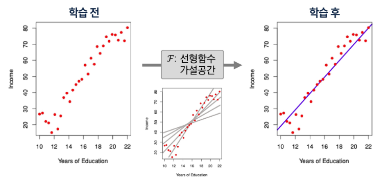
  - 학습 전: 데이터만 존재 (관계 미정)
  - 학습 중: 가설공간 $\mathcal{F}$ 안의 여러 후보 함수 탐색
  - 학습 후: 최적의 모델 $f$ 선택

## 복수 피쳐 기반 학습
### 2D 피쳐 기반 학습 (다차원 피처 기반 학습)
- 수식
  - $Income=f^∗(Years of Education, Seniority)+ϵ$
    - $f^∗$ : 미지의 참 함수 (입력과 출력을 이어주는 숨겨진 진짜 함수)

- 예시: 학력과 수업 데이터

  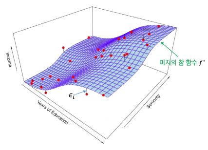
  - 파란색 Surface (= 미지의 참 함수 $f^*$) 는 관측 불가능
  - 빨간색 점들 (= 데이터) 만 관측 가능
  - 학습 전
    - 어떤 가설공간 $\mathcal{F}$ 을 사용할까?
  - 학습 후
    - 데이터를 활용하여 어떤 모델 $f$ 을 선택해야 할까?

- 모델 복잡도에 따른 학습 예시

  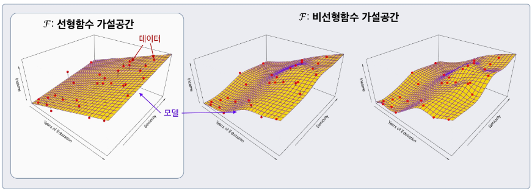
  - $\mathcal{F}$: 선형함수 가설공간
    - 단순한 선형 관계만을 표현할 수 있음
    - 데이터(빨간 점)를 완벽히 설명하기 어려움
    - 모델(보라색 곡면)은 전체적인 경향만 반영
  - $\mathcal{F}$: 비선형함수 가설공간
    - 더 복잡한 형태의 관계를 표현할 수 있음
    - 데이터의 세밀한 패턴까지 학습 가능
    - 단, 과적합(Overfitting) 가능성 증가
  - 무한이 많은 선형함수, 비선형함수들 중 적절한 함수를 특정해서 찾는 것은 매우 어려움
    - "어떻게 하면 효율적으로 찾을 수 있을까?"가 학습 테스크

### 일반적 용어 정리 및 모델 가정
- $Income = f^*(Years\ of\ Education,\ Seniority,\ ...)\ +\ \epsilon \ \rightarrow \ Y = f^*(X) + \epsilon$
  - `Income`: 우리가 예측하려는 라벨(반응/목표) 변수 → $Y$ 로 표기
  - `Years of Education`: 첫 번째 피처(입력/예측) 변수 → $X_1$ 로 표기
  - `Seniority`: 두 번째 피처(입력/예측) 변수 → $X_2$ 로 표기
    - 다른 $i$번째 피처가 있다면 역시 $X_i$ 로 표기
  - 일반적인 $p$차원 피처(총 $p$개의 피처) 벡터:
    - $\mathbf{X} = [X_1, X_2, ..., X_p]^T \in \mathbb{R}^p$
  - 모델(함수형): $f^*: \mathbb{R}^p \rightarrow \mathbb{R}$ ,  $Y = f^*(\mathbf{X}) + \epsilon$
  - 측정오차 $\epsilon$:
    - 피처 $\mathbf{X}$와 독립
    - $E[\epsilon] = 0$ (**평균이 0인 오차로 가정**)

### 왜 $f(\cdot)$를 학습하는가?
- 예측 (Prediction)
  - 잘 학습된 $f$가 있으면, 새로운 입력값 $X = x$에서 반응/목표 $Y$ 를 예측할 수 있음

- 중요 특성 파악 (Feature Importance)
  - 피처들 $X = (x_1, x_2, ..., x_p)$ 의 **어떤 특성**이 $Y$를 설명하는 데 **중요**한지,
  - 그리고 어떤 것은 **덜 중요(무관)** 한지를 알 수 있음
  - 예시:
    - 근속연수(Seniority), 교육기간(Years of Education)은 소득(Income)에 큰 영향을 줄 수 있지만
    - 혼인 여부(Marital Status)는 영향이 거의 없을 것임

- 해석 가능성 (Interpretability)
  - $f$의 **복잡도**에 따라 각 구성요소 $x_j$가 $Y$에 **어떻게 영향을 미치는지** (증가/감소 방향, 민감도 등)을 이해할 수 있음

# AI & 기계학습 기초 2 - 지도학습은 무엇인가?
## 지도학습(supervised learning)
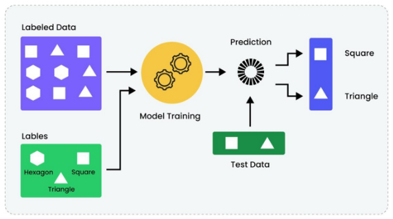

- 데이터
  - 입력(특성)과 정답(라벨)이 쌍으로 있는 데이터

- 목표
  - 새 입력이 들어오면 정답을 잘 맞추는 규칙을 학습

- 지도학습 종류
  - **회귀** : 예측값이 숫자(가격, 점수, 온도)
  - **분류** : 예측값이 범주(스팸/정상, 질병 유/무)

### 지도학습 용어
- 특성 (Feature, $x$)
  - 예측에 쓰이는 설명 변수
  - ex. 집값 예측 {지역, 평수, 방수, 연식} / 이메일 스팸 필터링 {제목, 내용, 송신인}

- 라벨 (Label, $y$)
  - 맞춰야 하는 정답
  - ex. 집값, 스팸/정상 이메일

- 예측값 ($\hat{y}$)
  - 모델이 내놓은 결과 (숫자 또는 범주)

- 오류 (Error)
  - 예측값($\hat{y}$)과 라벨($y$)의 차이: $\hat{y}$ - $y$
  - 측정오차 $ε$와 다른거!!

- 예시

  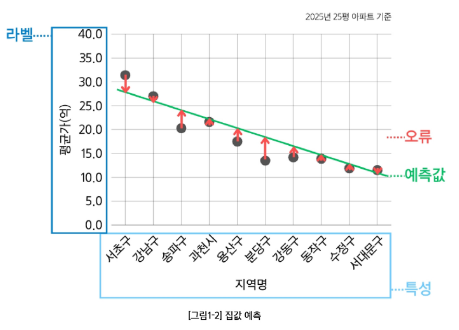

## 회귀(Regression)
### 회귀 문제
- "입력(Feature)으로부터 숫자(output)를 얼마나 정확히 예측할까?"에 대한 문제
  - ex. Feature: 면적, 방수, 연식 -> Label: 집값
  - ex. Feature: 매체별 광고비(TV/라디오/온라인) -> Label: 매출액

- 라벨 및 예측 모델의 출력: **연속적인 수치**

  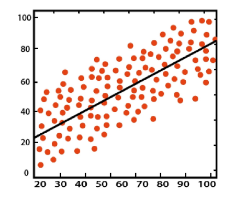

### 회귀 오류: 평균제곱오차(MSE)
- 평균제곱오차 (Mean Squared Error, MSE)
  - 각 데이터에서 정답($y_i$) 과 예측값($\hat{y_i}$) 의 평균 제곱 차이값
  - 수식: $MSE = \frac{1}{n} \sum_{i=1}^{n} (y_i - \hat{y_i})^2$

- 해석
  - 큰 오차를 더 크게 벌주므로, 전체 오차 수준을 한눈에 파악할 수 있음

- 참고
  - 데이터와 같은 단위로 표현하고 싶다면 RMSE (MSE의 제곱근) 을 사용
    - R은 root를 의미함
  - 수식: $RMSE = \sqrt{MSE} = \sqrt{\frac{1}{n} \sum_{i=1}^{n} (y_i - \hat{y_i})^2}$

### 회귀 설명력: $R^2$ (결정계수)
- 결정계수
  - 라벨의 분산 중에서 특성으로 설명되는 비율
  - "평균만 쓰는 단순한 예측"보다 나의 모델링 결과가 얼마나 더 잘 맞추는지를 `0~1` 사이로 나타낸 값
  - 수식: $R^2 = 1 - \frac{\sum_{i=1}^{n}(y_i - \hat{y_i})^2}{\sum_{i=1}^{n}(y_i - \bar{y})^2}$
    - $\bar{y}$ : $y_i$들의 평균값
    - 분모: 예측값을 $y$의 평균으로 했을 때($\bar{y}$) 발생하는 에러
    -  

- 해석
  - $R^2$이 1에 가까울수록 설명력이 높고, 낮을수록 설명력이 낮음

※ $R^2$가 음수가 나올 수 있을까?

-> 나올 수 있음. 예측값($\hat{y_i}$)들이 평균값($\bar{y}$) 보다도 못하다면!! 분자의 에러가 분모보다 커져서 $R^2$가 음수될 수 있음

## 분류(Classification)
### 분류 문제
- "입력(Feature)으로부터 범주(output)를 얼마나 정확히 가려낼까?"에 대한 문제
  - ex. Feature: 메일 내용, 보낸이 이메일 주소 -> Label: 스팸/정상
  - ex. Feature: 종양 반경, 면적 -> Label: 악성/양성

- 라벨 및 예측 모델의 출력: **범주 라벨(이진/다중)**

  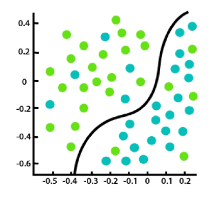

### 분류 정확도(Accuracy)
- 정확도 (Accuracy)
  - 전체 중 맞춘 비율
  - 수식: $Accuracy = \frac{1}{n} \sum_{i=1}^{n} \mathbb{I}(y_i = \hat{y_i})$
    - $\mathbb{I}$ : 지시(Indicator) 함수
    - $\mathbb{I}(A) = 1$ if $A$ is true
    - 올바르게 예측한 값(1, true)을 다 더해서 n으로 나눔
    - 즉, 내가 예측한 값들 중 얼만큼의 비율이 정확히 맞췄는지 계산

- 정확도만 보면 발생하는 문제
  - 불균형 데이터(예: 양성 1%, 음성 99%)에서는 **전부 음성**이라고 예측해도 **정확도 99%** 로 보일 수 있음

- 결론
  - 정확도만 보지 말고, 다른 지표(Precision, Recall 등) 도 함께 봐야 안전함

### 혼동행렬(Confusion Matrix)
- 혼동행렬
  - 예측과 실제 값 사이의 관계를 행렬 형태로 표현
    | 구분              | 예측 Positive         | 예측 Negative         |
    | :-------------- | :------------------ | :------------------ |
    | **실제 Positive** | True Positive (TP)  | False Negative (FN) |
    | **실제 Negative** | False Positive (FP) | True Negative (TN)  |

  - 용어
    - **TP** (True Positive): 실제 양성, 예측도 양성
    - **TN** (True Negative): 실제 음성, 예측도 음성
    - **FP** (False Positive): 실제는 음성인데 양성이라 함 (오탐)
    - **FN** (False Negative): 실제는 양성인데 음성이라 함 (누락)
      
      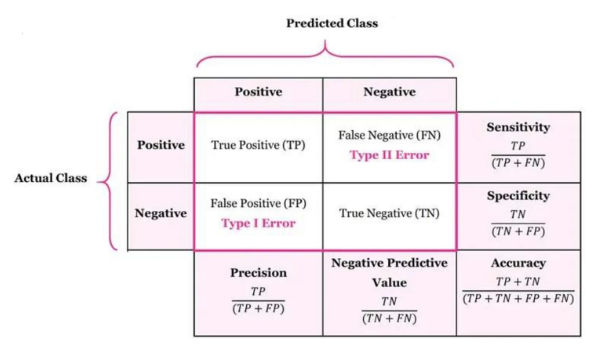
      - FP(오탐), FN(누락)은 줄이고 TP, TN은 높여야함

- 정밀도 (Precision)
  - "양성이라 **판정한 것** 중" 진짜 양성의 비율
  - 수식: $Precision = \frac{TP}{TP + FP}$

- 재현율 (Recall, Sensitivity)
  - "진짜 양성 **가운데**" 잡아낸 예측 양성의 비율
  - 수식: $Recall = \frac{TP}{TP + FN}$

- F1-score
  - **정밀도와 재현율의 조화평균**
  - 수식: $F1 = 2 \times \frac{Precision \times Recall}{Precision + Recall}$

## 학습의 목적
### 학습의 목적은 "테스트 예측 (일반화)"
- **학습 모델**의 성능 평가는 모델이 **처음 보는(학습에 사용되지 않은) 데이터**로 평가
  - **일반화(generalization)** 오류의 최소화 지향
- 훈련 데이터에서 성능이 아무리 좋아도, 새로운 데이터에서 성능이 떨어지면 실전에서 사용 불가
- **일반화 성능을 추정**(검증/교차검증) 방법을 알아야함

### 오버피팅(overfitting)
- 오버피팅
  - 훈련 데이터의 **우연한 패턴/잡음**까지 외워버려서(초록색 함수) 훈련에서는 잘 맞지만 **테스트에서는 성능이 나빠지는** 현상

    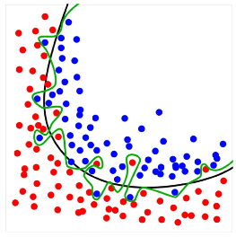
  - 현상
    - **훈련 오류 급격히 낮음** -> train data의 Accuracy는 100%가 될 것임
    - 테스트 오류 **높음/요동**

- 오버피팅이 안좋은 이유
  - **표본(sample) 의존/불안정**
    - 훈련 데이터는 모집단의 일부 표본이라 우연한 잡음이 섞임
    - 이것에만 과하게 맞추어 학습하면, 샘플 몇 개만 바뀌어도 예측이 크게 흔들림 (분산 ↑)
  - **일반화 실패**
    - 보지 못한 데이터(테스트) 에서 오류가 커지고, 모집단(population) 전체 성능과의 격차가 벌어짐
  
### 오버피팅 ≠ 분포 변화(Distribution Shift)로 인한 에러 증가
- 분포 변화로 인한 오류
  - 훈련 데이터 분포와 테스트 **분포가 다름으로 인해** (환경, 계절, 센서 변화 등) 성능이 떨어지는 현상
  - 예시

    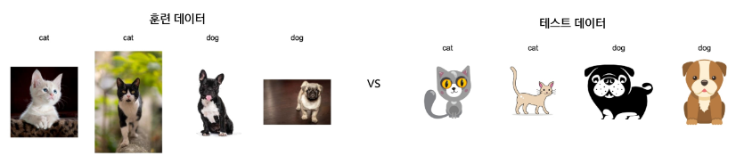
    - 훈련은 실제 사진으로 했는데, 테스트는 카툰 이미지로 했다면?
    - 데이터가 아예 변했기 때문에 모델은 구분 잘 못함
    - 이런 경우가 "데이터의 분포가 변한 것"
  - **분포 변화**로 인한 에러 증가는 **모델이 과적합하지 않아도 발생** 가능
  - 오버피팅은 train, test 데이터가 **"같은 분포에서 오는 데이터"** 인데, 데이터 포인트가 다른 것
    - (★ 차이점 꼭 기억하기 ★)

### 오버피팅 vs 언더피팅
- 오버피팅
  - 모델이 너무 복잡 -> 잡음까지 학습 (테스트 성능 나쁨)

- 언더피팅
  - 모델이 단순하거나 학습이 완료되지 않음 -> 중요한 패턴 놓침 (오류 큼)

  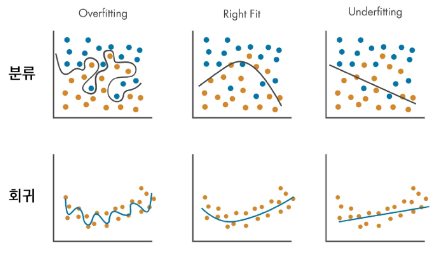

- 오버피팅 vs 언더피팅 (균형잡기) 해결 방법론
  - 더 많은 데이터 사용
  - 테스트 데이터를 활용한 모델 선정
  - 테스트 데이터를 추정해가며 교차검증

# AI & 기계학습 기초 3 - 교차검증(Cross-Validation)
## 테스트 성능 평가
### 훈련오류 vs 테스트 오류
- 훈련오류
  - 모델을 학습시킨 **같은 데이터**에 다시 적용해 계산한 오류
- 테스트 오류
  - 학습에 쓰지 않은 **새 관측치**에 대해 모델을 적용했을 때의 평균 예측오류

  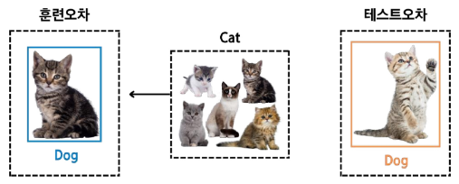

- 보통 훈련 오류는 테스트 오류와 다름
  - 특히 훈련 오류는 테스트 오류를 (심하게) 과소평가하는 경우가 많음
  - 즉, 테스트에서는 성능이 안좋을텐데 마치 훈련오류 안에서는 잘하는 것처럼 보이는 것
  - ex. 암기 vs 응용 시험
    - 족보를 암기했을 때, 훈련 오류는 매우 낮을 것임
    - 족보를 암기했다고 해서 중간고사를 잘 볼 것이라는 보장 없음(즉, 테스트 오류 또한 낮을 것이라는 보장이 없음)
    - 지금까지 봐왔던 시험들을 바탕으로 훈련 오류가 매우 낮았다고 해서, 이를 바탕으로 "나는 새로운 테스트에서 잘하겠지"라고 생각하는 것이 **훈련 오류로 테스트 오류를 과소평가하는 경우**임

- 훈련 오류 vs 테스트 오류

  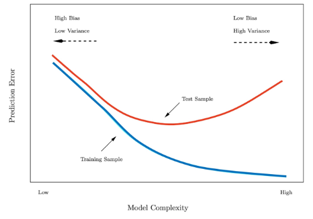
  - x축: 모델 복잡도 / y축: 예측 오류 
  - 파란선: 훈련 오류 / 빨간선: 테스트 오류
  - 훈련 오류는 계속 ↓, 테스트 오류는 U자형
    - 모델 복잡도가 충분히 커져서 (아주 유연한 함수여서), 모든 훈련 데이터의 노이즈마저 학습할 수 있다면 훈련 오류는 현저히 작아짐
    - 그렇다고 해서 우리가 낮추고자 하는 테스트 오류(일반화 성능)가 항상 낮아지는 것은 아니다
  - 훈련 오류가 매우 작아졌을 때 테스트 오류가 오히려 높아질 수 있음
    - 이 상태가 오버피팅 상태!!
    - 훈련 오류와 테스트 오류가 차이가 난다해서 무조건 오버피팅이 아니라,
    - train data에 과적합하여 노이즈까지 학습함으로써 훈련 오류가 작고, 테스트 오류가 클 때 '오버피팅' 된거임
  - 훈련 오류도 높고, 테스트 오류도 높은 구간은 '언더피팅'
    - 데이터에 있는 주요 패턴을 아직 잘 학습하지 못해 두 오류 다 높게 나타나는 상태

  - 목적
    - 테스트 오류의 U자형이 바닥이 되도록하는 적절한 모델 찾기
    - 즉, 테스트 오류가 가장 낮아지는 모델 찾는 것이 목적

### 테스트 예측 오류 계산
- 테스트 오류 계산하는 이상적인 케이스
  - 충분히 큰 별도의 테스트 데이터셋 존재 -> 현실에선 구하기 어려움
  - 현실에서는 테스트만을 위한 데이터를 갖기에 데이터 자체가 부족할 수 있음

- 대안: **재표본화(resampling)를 통한 테스트 오류 추정**
  - **데이터를 나눠** 여러번 "훈련 -> 평가"를 반복해 테스트 오류를 가늠
  - 방법
    - 검증셋 (hold-out), K겹 교차검증 (K-fold Cross-Validation)
  - 장점
    - 별도의 테스트 데이터 없이 **데이터를 더 효율적으로 사용**하여 일반화 오차 추정
  
  
## 검증셋(validation set) 접근
### 검증셋 방법
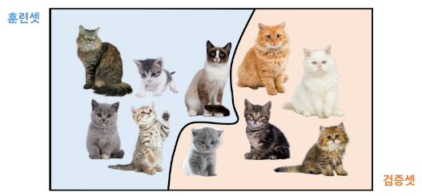
- 가용 샘플들을 무작위로 **훈련셋과 검증셋(hold-out)** 으로 분할
- 훈련셋으로 **모델 적합**, 검증셋으로 **예측 후 검증 오류**를 계산
- 검증 오류는 보통 **정량 반응은 MSE, 범주 반응은 오분류율(또는 F1-score)** 을 측정함

### 검증셋 절차
- 데이터 순서 무작위 **셔플링** 후 두 부분으로 분할
  - 왼쪽(파랑) = 훈련셋 / 오른쪽(주황) = 검증셋

    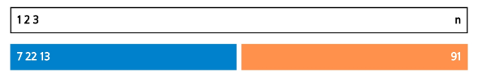
  - 학습은 훈련셋에서, 성능평가는 검증셋에서 수행

- 예시: 자동차 데이터
  - 목표
    - 선형(1차) 모델부터 고차항(다항식) 모델 비교

      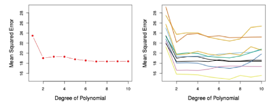
      - 알아두어야 할 것
        - 현재 테스트 데이터 없음
        - 만약 테스트 데이터가 주어졌을 때, 테스트 데이터의 에러가 얼만큼일까?를 알려고 하는 것
  - 392개 데이터를 무작위로 196개 훈련셋 / 196개 검증셋으로 분할
    - 일반적으로 반으로 나눌 필요는 없음

  - **죄측 패널**: 단 한 번 분할 시의 MSE 곡선
    - 테스트 에러를 구한 것은 아님(테스트 데이터 없으니까)
    - 테스트 에러를 '추정한 값'을 그래프로 나타냄
  - **우측 패널**: 여러번 (셔플 후) 다른 분할의 MSE 곡선들
    - 어떻게 분할하냐에 따라 테스트 에러 추정치가 여러 값으로 다르게 나옴
    - 2차항까지 고려한 모델을 가지고 테스트 에러를 추정했을 때 추정한 테스트 에러 값은 몇이라고 할 수 있을까? -> 추정치의 분산이 큼
    - 추정치의 분산이 큰 것은 매우 나쁜 것임 -> 검증셋 방법의 단점

### 검증셋 접근의 한계
- 예시에서 보이는 검증셋 방법의 단점
  - 어떤 표본이 훈련/검증에 들어가느냐에 따라 **검증 기반 테스트 오류 추정치가 매우 가변적**
  - 검증 접근에서는 훈련셋 (= 전체의 일부)만으로 모델을 **적합**하므로, 전체 데이터로 학습했을 때보다 **성능이 낮게 추정(즉, 테스트 오류를 과대 추정)** 될 수 있음

- 전체 데이터로 학습한 모델의 **테스트 오류를 과대 추정하는 경향**이 있는 이유
  - "학습에 데이터를 부분만 사용하기 때문"

## K-겹 교차검증(K-fold Cross-Validation)
### K-겹 교차검증
- 테스트 오류 추정의 표준적 접근
- 추정치는 모델 선택과 최종 모델의 테스트 오류 규모 파악에 활용함
- 최대한 많은 데이터를 사용하고, **에러값의 가변성을 줄이는** 데 큰 역할을 함
- 데이터 전체를 **크기 동일한 $K$개 폴드**로 무작위 분할
  - 각 폴드 $k \in {1, 2, \dots, K}$ 를 검증용으로 사용하고, 나머지 $K-1$개는 훈련용으로 사용
- $k = 1, \dots, K$ 에 대해 반복 수행 후, 평균 오류로 테스트 오류를 추정

- K겹 교차검증 단계
  - 데이터를 먼저 **셔플링**한 뒤, 총 n 개의 데이터를 **겹치지 않는 $K$개의 그룹으로 분할**
  - 각 그룹이 번갈아 **검증셋(주황)**, 나머지는 **훈련셋(파랑)**
  - $K$개의 MSE를 평균내어 테스트 오류를 추정
  - 예시: 5-fold Cross-Validation

    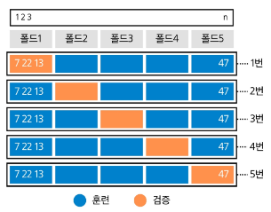

### K-겹 교차검증 오류 계산
폴드 집합 $C_1, \cdots, C_K$, 각 폴드 크기 $n_k$라고 할 때,

- 수식: $CV(K) = \sum_{k=1}^{K} \frac{n_k}{n} MSE_k$

  - 여기서, $MSE_k = \frac{1}{n_k} \sum_{i \in C_k} (y_i - \hat{y_i})^2$

    - $K$-폴드를 검증셋으로 두고, 나머지로 적합한 예측값 $\hat{y_i}$
    - $MSE_k$: k 번째 fold에서 발생하는 MSE
  
  - 설명
    - $C_1$: 첫 번째 fold의 index set
    - $C_K$: K 번째 fold에 들어있는 데이터 포인트들의 인덱스 집합
    - 각각의 집합들은 서로 겹치지XX

    - $n_1$: 첫 번째 fold의 크기
    - $n_K$: K 번째 fold의 크기
    - 폴드 크기가 동등한 사이즈가 아닐 수도 있음!!
      - 왜? data size가 101개라고 할 때(n이 101개), `K = 5` 이면 101이 5로 안나누어지기 때문에
      - 최대한 동등하게 나누려고 하지만 항상 폴드 크기가 동등하다는 것을 보장할 수 없음
    
    - $\frac{n_k}{n}$: 폴드 크기를 나타내는 n들의 사이즈가 다를 수 있으니 k 번째 fold의 사이즈에 맞게 상대적인 가중치를 주는 것

- $K = n$ 이면 Leave-One-Out 교차검증 (LOOCV)
  - K가 전체 데이터 개수(n)와 동일한 경우에 나타나는 특별한 케이스

### Leave-One-Out 교차검증
각각의 fold의 개수($K$)가 데이터 포인트 개수($n$)와 동일한 경우의 K-겹 교차검증

- Leave-One-Out 교차검증에서 검증셋 크기는 `1`
  - 훈련셋(파랑): 관측치 하나만 제외한 나머지 전부
  - 검증셋(주황): 제외한 **1개 관측치**
  - 이 과정을 **n번 반복**해 나온 n개의 MSE 평균으로 테스트 오류를 추정함

    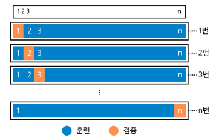

- 하나만 제외한 나머지 전부를 훈련셋으로 사용한다는 것은
  - 매 반복마다(총 n번) 최대한의 데이터를 활용하여 훈련하는 것
  - n = 데이터 개수
  - 학습-검증 과정을 n번 반복함 -> 데이터 개수가 늘어날수록 계산량 증가
  - 만약 데이터가 10만 개 있다면? ^^;;
    - 굳이 이렇게 지나치게 할 필요 있을까?

### K-겹 교차검증 비교
- Leave-One-Out 교차검증 vs 10-겹 교차검증
  - 예시
    - 자동차 데이터에서 Leave-One-Out 교차검증과 10-겹 CV 결과 비교(다항차수에 따른 MSE 곡선)

      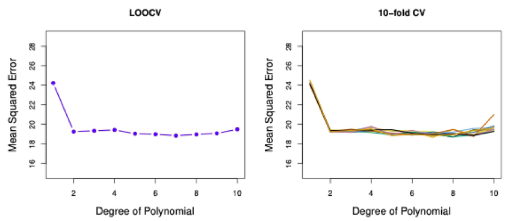
    - 두 방법의 **경향**과 **최적 차수**가 비슷함

- 검증셋 접근 방법의 단점
  - '부분집합만 가지고 학습하니 실제 테스트 오류보다 테스트 오류를 과대평가하는 경향'
  - 이를 해결하기 위해 K-겹 교차검증을 하는데, 그렇다면 최대한 많은 데이터로 학습시키는게 좋을 것 같다(LOOCV)
  - 그러나 Leave-One-Out 교차검증의 경우에는 데이터가 클수록 계산량이 너무 많아짐
  - 적절한 차수의 K-겹 교차검증을 찾아보자

### K-겹 교차검증 비교
- 시뮬레이션: 참/추정 테스트 MSE
  - 파랑: 참(test) MSE -> 우리에겐 안보이는 것
  - 검은 점선: LOOCV 추정
  - 주황: 10-겹 CV 추정

    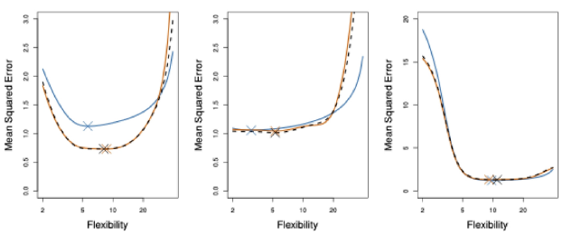
    - LOOCV와 10-겹 CV의 MSE 경향이 매우 유사함(계산량은 LOOCV보다 적게, 그러나 성능은 비슷하게)
    - 10-겹 CV 추정 -> **테스트 성능 추정의 좋은 대안**

# AI & 기계학습 기초 4 - 비지도학습
## 비지도학습
**레이블(정답) 없이** 데이터의 구조·패턴·집단(잠재 서브그룹) 을 찾아내는 학습

※ 레이블이 있더라도 레이블에 관심을 두지 않고, 피처 자체에 관심을 둠

- 대표 과제
  - 군집화(Clustering)
  - 차원축소(PCA 등)
  - 밀도추정 / 이상치 탐지

- 출력
  - "정답 예측"이 아니라 구조 / 요약 / 표현 (embedding)

- 핵심 질문
  - 무엇을 비슷함/다름으로 볼 것인가? (거리·유사도 선택)
  - 전처리(스케일 표준화 등) 를 어떻게 할 것인가?

### 비지도학습 vs 지도학습
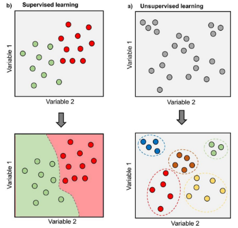

- 지도학습
  - 입력 + 라벨로 예측 모델 학습
  - ex. 가격 예측, 악성 종양 예측
  - 위 사진에서 분류를 위해 데이터를 구분짓는 함수를 찾음

- 비지도학습
  - 입력만으로 구조 학습
  - ex. 고객 세그먼트
  - 위 사진에서 분류를 위해 데이터를 구분지어 묶음

- 비지도학습 예시
  - **클러스터링**: 서로 비슷한 데이터끼리 묶어 동질 그룹 만들기

## 클러스터링(Clustering)
데이터 안에서 하위 집단(클러스터)를 찾는 기법들의 총칭

- 목표
  - **집단 내부는 서로 유사, 집단 간은 상이**하도록 데이터를 분할
    - 유사/상이 정도는 **도메인 맥락**에 따라 정의가 달라질 수 있음
    - 문제 & 데이터 특성에 의존함

- 예시: 마케팅 세그먼테이션
  - 다수의 지표(가구소득, 직업, 도심거리 등)를 가진 많은 사람들에 대해 '특정 광고/상품'에 더 반응할 하위 집단 식별

    
    - '시장 세분화' 작업 자체가 클러스터링에 해당함

- 대표 클러스터링 기법
  - **K-평균(K-means)**: K(클러스터 수)를 **미리 정해** 분할
  - **계층적 군집(Hierarchical)**: K를 사전에 고정하지 않음

## K-means 클러스터링
### K-means 클러스터링 예시
- 패널
  - K = 2, 3, 4에서 각 K-means 결과
    - 점 색상 = 할당된 클러스터

      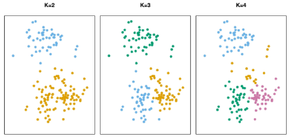
    - 클러스터 결과에서 **특정 색상은 의미X**
    - 점들이 다른 색이라는 것은 서로 다른 클러스터에 속해있다는 뜻

### K-means 표기(군집 집합)
관측치 인덱스 집합(각각 하나의 클러스터에 들어가있는 인덱스 집합)을 $C_1, ..., C_K$ 라 하면

- $C_1 \cup \cdots \cup C_K = {1, ..., n}$ (각 관측치는 적어도 하나의 군집에 속함)

- 모든 다른 클러스터 $k \neq k'$ 에 대해, $C_k \cap C_{k'} = \varnothing$ (겹치지 않음)

- $i$번째가 $k$번째 군집이면 $i \in C_k$ (비중첩 분할)

### K-means 핵심 아이디어
- 좋은 군집화
  - **클러스터 내부 변동**(Within-Cluster Variation)이 작은 분할
  - 즉, 각각의 군집 내부  데이터 포인트들의 퍼져있는 정도(분산)가 작은 분할이 좋은 군집화

- 목표
  - **클러스터 내부 변동의 합이 최소**가 되도록 분할을 찾음
    - 즉, 모든 클러스터의 내부 흩어짐 총합이 가장 작은 분할
  
### K-means 알고리즘
- 알고리즘 단계

  
  1. 초기화
      - 관측치들에 **무작위로** $1 \sim K$ 클러스터를 임시 부여
  2. 반복(할당이 더이상 바뀌지 않을 때까지)
      - 2a. 각 클러스터의 **중심(centroid)** 계산 (특성 평균 벡터)
        - ex. 1번 클러스터로 분류된 데이터 포인트들 기준으로 중심점을 찾는 것
      - 2b. 각 관측치를 **가장 가까운 중심의 클러스터에 재할당**(거리 예: 유클리드 거리)
  
  - 예시

    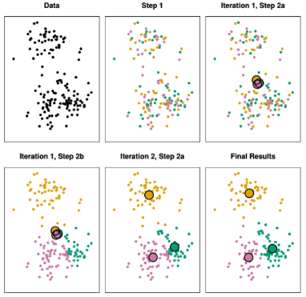
    - 반복1 - 2a: 3개의 클러스터에 무작위 분류, 그에 따른 3개의 중심점
    - 반복1 - 2b: 중심점과 가까운 점들을 해당 중심점의 클러스터로 재배정
    - 반복2 - 2a: 3개의 클러스터, 3개의 중심점 재계산
    - 반복2 - 2b: 중심점과 가까운 점들을 해당 중심점의 클러스터로 재배정
    - 재배정 했는데 이전 클러스터와 동일한 곳에 배치됐으면 stop

- 알고리즘 특성
  - 위 반복은 매 단계마다 **목표함수 값을 감소**시킴(군집 내 평균 제곱거리의 성질 때문)
  - 단, **전역(global) 최소값 보장은 아님** (반복 과정은 그리디 접근이기 때문)
    - → 초기값에 따라 지역 최소값으로 수렴 가능

### K-means 클러스터링에서 초기값의 영향
- 다른 초기값의 영향
  - 서로 다른 초기 레이블에서 **최종 분할과 목표값**(패널 상단 숫자)이 달라짐
  
    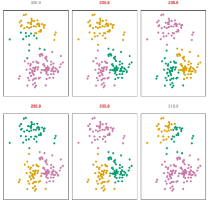

- 초기화의 중요성
  - **여러 번 시도 권장**
  - 초기값의 무작위성에 따라 최종 분할 값이 달라짐
  - 그림에 적힌 숫자는 **내부 분산 값**
    - 여러번 돌려서 내부 분산 값이 가장 낮은 것을 선택

## 계층적 군집(Hierarchical Clustering)
### K-means 클러스터링 vs 계층적 군집
- K-means는 클러스터 수 **K를 미리 지정**해야 하는 단점이 존재함
- 계층적 군집은 **K를 고정하지 않고** 전체 구조를 '덴드로그램'으로 제공

  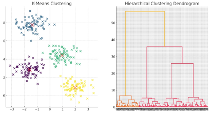

### 계층적 군집 결과 예시
- 덴드로그램에서 수평선 높이(거리)를 기준으로 가위질하여 K개 군집을 얻음

  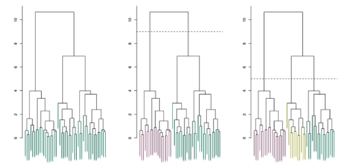
  - 가장 하위에 있는 것들이 데이터 포인트들
  - 거리 기준으로 병합해나감
  - 2개의 군집으로 나눌 때 두번째 그림처럼, 3개의 군집으로 나눌 때 세번쨰 그림처럼 가위질

### 계층적 군집 알고리즘(상향식)

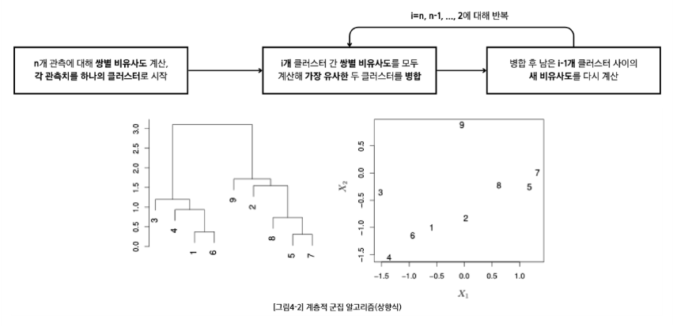

- 계층적 군집에서는 항상 '클러스터들의 병합'이 이루어 지는 것

- 계층적 군집 병합 진행 순서(ex. 그림4-2 예시)

  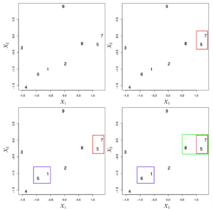
  - 데이터들이 **점차 큰 클러스터로 합쳐지는 과정**
  - 매 단계에서 클러스터들끼리의 병합이 이루어짐
    - 처음에는 데이터 포인트들이 각각의 클러스터가 되므로 총 9개의 클러스터 존재
    - 가까운 클러스터끼리 병합(5와 7을 하나의 클러스터로 묶음)
    - 그 다음으로 가까운 클러스터 병합(1과 6 병합)
    - 그 다음으로 가까운 클러스터 병합(8과 (5, 7) 병합. 이때, 5와 7은 하나의 클러스터가 돼있는 상태)
    - 반복
  - 1개의 단일 클러스터가 될 때까지 진행

- 계층적 군집의 계산량
  - 매 단계에서 모든 클러스터 쌍 간의 거리를 계산해야 함
  - 데이터의 수가 많은 경우 K-means에 비해 계산량이 많음

### 계층적 군집의 링크 유형
클러스터 간 거리를 재는 방법

- Single (최소 거리) 링크
  - 두 개 클러스터 내 데이터 **쌍별 거리 중 최소값**을 군집 간 거리로 사용

- Complete (최대 거리) 링크
  - 두 개 클러스터 내 데이터 **쌍별 거리 중 최대값**을 군집 간 거리로 사용

- Average (평균 거리) 링크
  - 두 개 클러스터 내 데이터 **쌍별 거리의 평균**을 군집 간 거리로 사용

  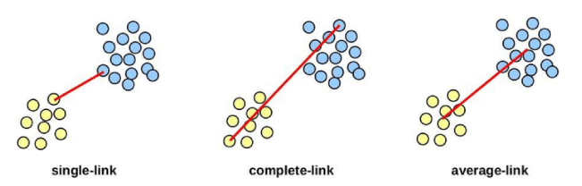

- 링크 유형에 따른 계층적 군집 결과
  - **링크에 따라 결과가 달라짐!!**
  - 같은 데이터라도 링크 선택에 따라 클러스터링 결과(덴드로그램)가 달라질 수 있음
  - 하나의 링크만 시도하는 것이 아니라 다른 종류의 링크도 사용 권장

    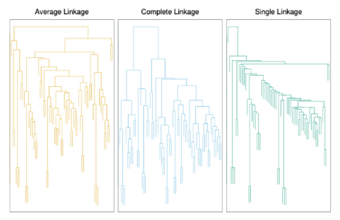

## 클러스터링 주의점
### 클러스터링 체크리스트
- 스케일링
  - 표준화(평균 0, 표준편차 1로 입력 변수를 변환하는 것)가 필요할까?
    - Yes, **변수 단위 차이 영향 큼**
  
- 몇 개의 클러스터가 적합할까?
  - K-means, 계층적 군집 모두 어려운 문제
  - 합의된 정답은 없음
  - **단일 시도가 아닌 여러 번 시도 권장**

