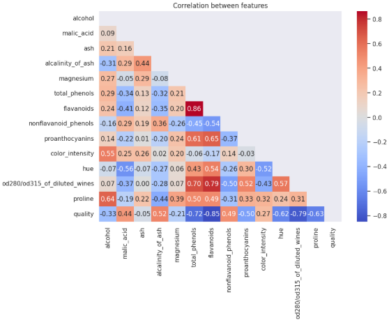
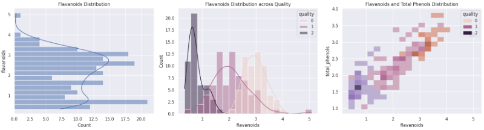
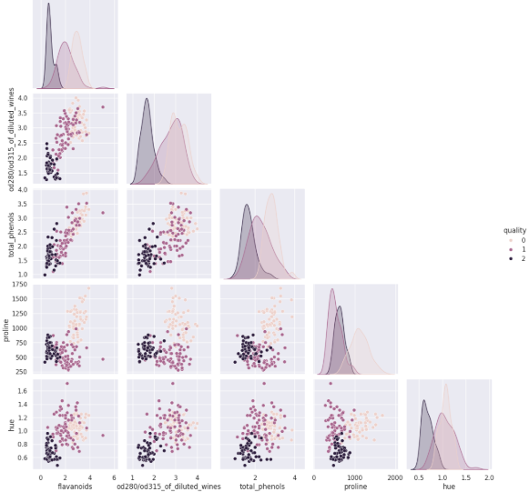
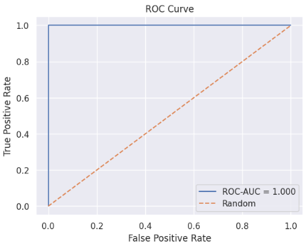
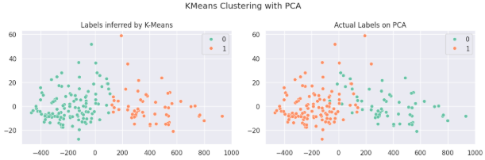
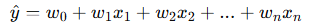

# 데이터 EDA 및 모델 학습
## 🔹 탐색적 데이터 분석 (EDA)
### EDA의 목적
EDA(Exploratory Data Analysis)는 모델링 전, 데이터를 깊이 이해하기 위한 첫 단계

-> 데이터의 구조·분포·상관관계·결측치·이상치를 파악함으로써, 이후 전처리 방향과 모델링 전략을 결정할 수 있음

### 데이터 로딩 및 구조 파악
- `load_wine` 데이터셋 로드
  ```python
  from sklearn.datasets import load_wine
  import pandas as pd
  import numpy as np

  df, y = load_wine(as_frame=True, return_X_y=True)
  df["quality"] = y
  ```

- 데이터 구조 파악 함수
  | 함수                           | 설명                       | 예시                                                 |
  | ---------------------------- | ------------------------ | -------------------------------------------------- |
  | `len(df)`                    | 전체 샘플 수(행 개수)를 반환        | `sample_count = len(df)`                           |
  | `df.shape`                   | (행, 열) 형태를 튜플로 반환        | `feature_count = df.shape[1]`                      |
  | `pd.Series().nunique()`      | 고유 값(클래스 등)의 개수 계산       | `class_count = pd.Series(y).nunique()`             |
  | `pd.Series().value_counts()` | 각 클래스나 값의 빈도 계산          | `class_distribution = pd.Series(y).value_counts()` |
  | `.sort_index()`              | 인덱스 기준 정렬 (클래스 번호 순서 맞춤) | `class_distribution.sort_index()`                  |

- 그룹별 통계 계산 함수
  | 함수                       | 설명                        | 예시                                     |
  | ------------------------ | ------------------------- | -------------------------------------- |
  | `pd.DataFrame.groupby()` | 특정 기준(예: 클래스별)으로 묶어 연산 수행 | `df.groupby('y')['alcohol'].mean()`    |
  | `.mean()`                | 평균 계산                     | `malic_mean = df['malic_acid'].mean()` |
  | `.std()`                 | 표준편차 계산                   | `malic_std = df['malic_acid'].std()`   |
  | `.idxmin()`              | 최소값을 가진 행의 인덱스 반환         | `min_ash_idx = df['ash'].idxmin()`     |

- 조건부 비율 및 구간 계산
  | 함수               | 설명                               | 예시                                     |
  | ---------------- | -------------------------------- | -------------------------------------- |
  | `(조건).mean()`    | 조건을 만족하는 비율 계산 (True=1, False=0) | `(df["color_intensity"] >= 10).mean()` |
  | `.quantile(q)`   | 분위수 계산 (예: 상위 10%, 중간값 등)        | `df["magnesium"].quantile(0.9)`        |
  | `np.histogram()` | 연속형 변수의 빈도(도수) 계산                | `np.histogram(df["proline"], bins=20)` |

- 상관관계 분석
  | 함수                 | 설명                          | 예시                                 |
  | ------------------ | --------------------------- | ---------------------------------- |
  | `df.corr()`        | 수치형 변수 간 Pearson 상관계수 행렬 생성 | `corr = df.corr()`                 |
  | `.drop("alcohol")` | 자기 자신 제외                    | `corr["alcohol"].drop("alcohol")`  |
  | `.abs().idxmax()`  | 절댓값 기준 상관계수가 가장 큰 변수명 반환    | `corr_with_alcohol.abs().idxmax()` |

### 상관관계 분석 (Correlation Analysis)
- Pearson 상관계수 (r): 두 변수 간 선형 관계 강도를 `[-1, 1]`로 표현
  - +1 → 양의 상관관계
  - -1 → 음의 상관관계
  - 0 → 관계 없음

- 주의: 상관관계 ≠ 인과관계 (Correlation ≠ Causation)
  - ex. 아이스크림 판매량과 익사 사고는 모두 여름에 증가하지만 인과관계는 없다

- 코드 예시
  ```python
  corr = df.corr()
  fig, ax = plt.subplots(figsize=(10, 7))
  mask = np.triu(np.ones_like(corr, dtype=bool))  # 상삼각행렬 마스크

  sns.heatmap(data=corr, annot=True, fmt=".2f",
              cmap="coolwarm", mask=mask)
  ax.grid(False)
  plt.title("Correlation between features")
  plt.show()
  ```
  

### 변수 분포 살펴보기 (Distribution Visualization)
- `histplot`: 변수의 분포와 커널 밀도(KDE) 시각화
- `scatterplot`: 두 변수의 관계를 점으로 표현
- `pairplot`: 여러 변수 쌍의 관계를 한 번에 탐색

- 여러 형태 분포 시각화
  ```python
  fig, ax = plt.subplots(figsize=(18, 5), ncols=3)

  # 1. 세로형 히스토그램
  sns.histplot(data=df, y="flavanoids", bins=20, kde=True, ax=ax[0])

  # 2. 클래스별 분포
  sns.histplot(data=df, x="flavanoids", hue="quality", bins=20, kde=True, ax=ax[1])

  # 3. 이변량 분포 (2D)
  sns.histplot(data=df, x="flavanoids", y="total_phenols", hue="quality",
              bins=20, ax=ax[2])
  ```
  

- 산점도와 페어플롯 시각화
  ```python
  sns.scatterplot(data=df, x="flavanoids", y="total_phenols", hue="quality")

  # quality와 상관 높은 상위 5개 feature 추출
  corr_with_quality = corr["quality"].abs().sort_values(ascending=False)
  top_features = corr_with_quality.index[1:6]

  sns.pairplot(data=df[top_features.tolist() + ['quality']], hue="quality", corner=True)
  ```
  

### 결측치와 이상치 탐색 (Missing & Outlier Detection)
- 결측치(Missing Value): 데이터가 비어 있는 경우
  - 처리 방법
    1. 행/열 삭제 (`dropna()`)
    2. 평균, 중앙값, 최빈값으로 대체 (`fillna()`)
    3. 예측 기반 대체 (고급 기법)

- 이상치 탐색 (Outlier Detection)
  - IQR(Interquartile Range) 기반 탐색
    - Q1 = 25%, Q3 = 75%
    - IQR = Q3 - Q1
    - 이상치: `Q1 - 1.5×IQR`보다 작거나, `Q3 + 1.5×IQR`보다 큰 값
  
  - 이상치 처리 예시 코드
    ```python
    def detect_outliers_iqr(data, column):
        Q1, Q3 = data[column].quantile([0.25, 0.75])
        IQR = Q3 - Q1
        lower, upper = Q1 - 1.5*IQR, Q3 + 1.5*IQR
        return data[(data[column] < lower) | (data[column] > upper)]

    outliers = detect_outliers_iqr(df_missing, 'alcohol')

    # 이상치 제거
    df_no_outliers = df_filled[~df_filled.index.isin(outliers.index)]
    ```

### 시계열 데이터에서 결측치와 이상치처리
시계열 데이터에서 결측치와 이상치 처리는 단순히 값만 채우거나 제거하는 것이 아니라 시간적 흐름을 고려해야 함

- 결측치 처리
	-	Forward Fill (ffill)
    - 이전 시점의 값을 그대로 채움
    - 주가·온도처럼 값이 급변하지 않는 경우 적합
	-	Backward Fill (bfill)
    - 다음 시점의 값을 사용
	-	보간(Interpolation)
    - 선형·다항·스플라인 보간 등으로 시계열의 추세를 반영해 채움
	-	모델 기반 예측
    - ARIMA, Prophet 등 시계열 모델로 결측 구간을 예측하여 채움

- 이상치 처리
	-	통계적 방법
    - 이동평균·이동표준편차로 정상 범위를 설정하고 벗어난 값 제거/수정
	-	계절성 고려
    - 계절/주기 패턴을 분리한 뒤 잔차가 일정 기준을 넘으면 이상치로 판단

※ 핵심은 시간 순서를 유지하면서 결측치·이상치를 처리하는 것

-> 무작정 삭제하면 시계열 패턴이 왜곡될 수 있으니 주의 필요


## 🔹 머신러닝 전처리 및 모델 학습·검증
### 데이터 전처리 (Preprocessing)
- 전처리 목적
  - 모델이 안정적으로 학습할 수 있도록 데이터 스케일을 맞추고 학습용(train)/평가용(test) 데이터를 분리
  - 데이터 누수(Data Leakage) 방지 및 일반화 성능 향상 목적

- 데이터 분할 (`train_test_split`)
  - 데이터를 학습용과 평가용으로 나누는 함수
    ```python
    from sklearn.model_selection import train_test_split

    X_train, X_test, y_train, y_test = train_test_split(
        X, y,
        test_size=0.3,
        random_state=42,
        stratify=y
    )
    ```
    - 주요 파라미터
      - `test_size`: 테스트 데이터 비율 (예: 0.3 → 30%)
      - `random_state`: 난수 고정 (재현성 확보)
      - `stratify`: 클래스 비율 유지 (불균형 방지)

- 특성 스케일링 (`StandardScaler`)
  - 각 feature를 평균 0, 표준편차 1로 정규화
  - 학습 데이터로 fit, 테스트 데이터로 transform만 수행 (데이터 누수 방지)
  - 모델의 수렴 속도 및 안정성 향상
    ```python
    from sklearn.preprocessing import StandardScaler

    scaler = StandardScaler()
    X_train_norm = scaler.fit_transform(X_train)
    X_test_norm = scaler.transform(X_test)
    ```
    - 주요 메서드
      - `fit()`: 평균, 표준편차 계산
      - `transform()`: 계산된 값으로 변환 적용
      - `fit_transform()`: 한 번에 수행(train 전용)

### 지도학습 (Supervised Learning)
- 로지스틱 회귀 (LogisticRegression)
  - 선형 분류 알고리즘
  - 시그모이드 함수를 통해 확률 예측 수행 (이진 분류용)
    ```python
    from sklearn.linear_model import LogisticRegression

    clf = LogisticRegression()
    clf.fit(X_train, y_train)
    y_pred = clf.predict(X_test)
    ```
    - `fit()`: 모델 학습
    - `predict()`: 예측 수행
    - `predict_proba()`: 클래스별 확률 반환
    - `ConvergenceWarning`: 반복 횟수 부족 시 발생 → max_iter 조정

- 성능 평가 (Evaluation Metrics)
  - 모델의 분류 성능을 다각도로 검증
    ```python
    from sklearn.metrics import confusion_matrix, classification_report

    print(confusion_matrix(y_test, y_pred))
    print(classification_report(y_test, y_pred))
    ```
    - 주요 지표
      - 정밀도(Precision): `TP / (TP + FP)`
      - 재현율(Recall): `TP / (TP + FN)`
      - F1-score: 정밀도·재현율의 조화평균
      - Accuracy: 전체 중 맞춘 비율

- ROC-AUC 분석 (`roc_curve`, `roc_auc_score`)
  - 임계값 변화에 따른 TPR(FN 비율)–FPR 관계 시각화
  - AUC값이 1에 가까울수록 분류기 성능이 우수
    ```python
    from sklearn.metrics import roc_curve, roc_auc_score
    import matplotlib.pyplot as plt

    y_score = clf.predict_proba(X_test)[:, 1]
    fpr, tpr, thresholds = roc_curve(y_test, y_score)
    auc = roc_auc_score(y_test, y_score)

    plt.plot(fpr, tpr, label=f"AUC={auc:.3f}")
    plt.plot([0, 1], [0, 1], '--', label="Random")
    plt.xlabel("False Positive Rate")
    plt.ylabel("True Positive Rate")
    plt.title("ROC Curve")
    plt.legend()
    plt.show()
    ```
    

### 교차 검증 (Cross Validation)
한 번의 데이터 분할 결과에 의존하지 않고, 여러 번 나누어 평균 성능을 계산 

-> 과적합 방지

- 주요 함수: `cross_val_score`
  - 모델의 일반화 성능을 교차검증으로 측정
    ```python
    from sklearn.model_selection import cross_val_score

    f1_scores = cross_val_score(
        estimator=clf,
        X=X_train,
        y=y_train,
        cv=5,
        scoring='f1'
    )
    print("Average F1-score (CV):", f1_scores.mean())
    ```

### 차원축소 (PCA)
- PCA의 목적
  - 고차원 데이터를 주성분 축으로 투영
  - 정보 손실 최소화하면서 저차원 공간으로 압축
  - 시각화나 노이즈 제거, 변수 간 상관성 완화에 활용

- 코드
  ```python
  from sklearn.decomposition import PCA

  pca = PCA(n_components=2)
  X_pca = pca.fit_transform(X)
  ```
  - 주요 메서드
    - `fit()`: 주성분 방향 계산
    - `transform()`: 원본 데이터를 새 축으로 투영
    - `fit_transform()`: 한 번에 수행

### 군집화 (Clustering)
- K-Means 알고리즘 (`KMeans`)
  - 중심점(centroid)을 기준으로 데이터를 그룹화
  - 비지도 학습 → 레이블 없이 데이터 패턴 파악
  - `n_clusters`: 클러스터 개수 지정

- K-means 코드
  ```python
  from sklearn.cluster import KMeans
  import seaborn as sns
  import matplotlib.pyplot as plt

  kmeans = KMeans(n_clusters=2, random_state=42)
  clusters = kmeans.fit_predict(X_pca)

  fig, ax = plt.subplots(figsize=(12, 4), ncols=2)
  sns.scatterplot(x=X_pca[:, 0], y=X_pca[:, 1], hue=clusters, palette="Set2", ax=ax[0])
  ax[0].set_title("Labels inferred by K-Means")

  sns.scatterplot(x=X_pca[:, 0], y=X_pca[:, 1], hue=y, palette="Set2", ax=ax[1])
  ax[1].set_title("Actual Labels on PCA")
  plt.show()
  ```
  
  - 왼쪽: K-Means가 비지도 방식으로 나눈 군집 결과
  - 오른쪽: 실제 클래스 라벨 기반의 분포
  - 두 그래프가 유사할수록 K-Means가 실제 구조를 잘 포착한 것

### 회귀 모델 학습 및 평가 (Regression Modeling & Evaluation)
- Linear Regression (선형 회귀)
  - 입력 변수들의 선형 결합으로 타깃(연속형 값)을 예측하는 모델
  - 수식

    

  - `scikit-learn` 사용 시
    - `fit()` : 회귀계수 𝑤, 절편 𝑏 학습
    - `predict()` : 새로운 데이터의 예측값 계산
      ```python
      from sklearn.linear_model import LinearRegression
      reg = LinearRegression()
      reg.fit(X_train, y_train)
      y_pred = reg.predict(X_test)
      ```

- 회귀 성능 평가 지표 (Regression Metrics)
  | 지표                                    | 설명                                | 함수                                       |
  | ------------------------------------- | --------------------------------- | ---------------------------------------- |
  | **RMSE (Root Mean Squared Error)**    | 오차 제곱의 평균에 루트를 씌운 값. 큰 오차에 민감     | `mean_squared_error(..., squared=False)` |
  | **MAE (Mean Absolute Error)**         | 절대 오차의 평균. 이상치에 덜 민감              | `mean_absolute_error()`                  |
  | **R² (Coefficient of Determination)** | 모델이 타깃 변동을 얼마나 설명하는지(1에 가까울수록 좋음) | `r2_score()`                             |
  ```python
  from sklearn.metrics import mean_squared_error, mean_absolute_error, r2_score

  test_rmse = mean_squared_error(y_test, y_pred, squared=False)
  test_mae  = mean_absolute_error(y_test, y_pred)
  test_r2   = r2_score(y_test, y_pred)
  ```

  