# AI & 기계학습 방법론 - 선형회귀(Linear Regression)
## 선형회귀(Linear Regression)
입력 변수와 출력 변수 사이의 관계를 **직선 형태로 근사**하여, 새로운 값을 예측하는 통계적 방법

- 지도학습의 가장 기초가 되는 접근 중 하나
- 단순해 보이지만, 선형회귀는 개념적으로도, 실무적으로도 매우 유용함

  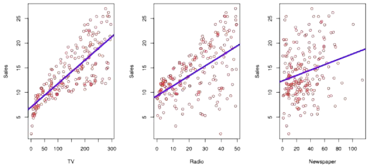
  - 선형회귀라 해서 '데이터가 무조건 선형히어야 한다'는 전제가 깔린 것은 아님!!

- 예시: 광고데이터
  - 선형회귀를 통해 대답할 수 있는 질문들
    - 광고비와 매출 사이에 관계가 있는가?  
    - 그 관계의 강도는 어느 정도인가?  
    - 어떤 매체가 매출에 기여하는가?  
    - 미래 매출을 얼마나 정확히 예측할 수 있는가?  
    - 매체 간에 상호작용(시너지)가 있는가?

## 단순선형회귀 (Simple Linear Regression)
한 개의 설명변수(X)와 하나의 반응변수(Y) 사이의 선형(직선) 관계를 찾는 방법  

- 목표
  - 데이터를 가장 잘 설명하는 직선을 찾아 예측($\hat{y}$)에 활용  

### 단일 설명변수를 이용한 단순선형회귀
- 모형 가정: $y = \beta_0 + \beta_1 X + \epsilon$
  - $\beta_0$ : 절편 (X=0일 때 Y 값)  
  - $\beta_1$ : 기울기 (X가 1 단위 증가할 때 Y의 평균 증가량)  
  - $\epsilon$ : 관측 오차
    - 실제 데이터들은 직선과 조금씩 떨어져있음을 나타냄
  - 위 식은 true 모형이 이렇다고 '가정'한 것이므로 hat은 사용하지 않았음
  - 평균 관계를 나타내는 $f^*$는 관측이 안되는 것처럼 우리는 X, Y 데이터만 보이고 $\beta_0$, $\beta_1$, $\epsilon$는 실제론 보이지 않음(관측 안됨!)
  - 즉, 평균 관계를 나타내는 함수 $f^*$가 단순선형회귀에서는 일차식이라 가정하는 것

    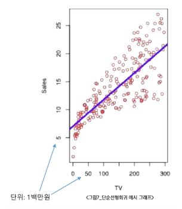

- hat(예, $\hat{y}$, $\hat{\beta}$) 표기는 추정값을 의미

### 최소제곱법(least squares)
**실제 관측값과 예측값의 차이**(잔차, residual)를 제곱해 합한 값(RSS, 잔차제곱합)을 최소화하는 방법  

- 목표
  - 데이터를 가장 잘 설명하는 직선을 찾기 위해 계수 $\beta_0$, $\beta_1$을 추정  

- 잔차(residual) 정의
  - $e_i = y_i - \hat{y_i}$ (예측값 $\hat{y_i} = \hat{\beta_0} + \hat{\beta_1} x_i$)
    - 기울기와 절편의 추정치가 주어졌을 때(별로 좋지 않은 추정치일 수 있음) 이 추정치가 좋고 나쁨은 잔차로 가늠 가능

- RSS(잔차제곱합) 정의
  - $ RSS = e_1^2 + e_2^2 + \dots + e_n^2$

  - 다른 표현:  
    - $RSS = \sum_{i=1}^{n} e_i^2 = \sum_{i=1}^{n}(y_i - \hat{y_i})^2 = \sum_{i=1}^{n}(y_i - \hat{\beta_0} - \hat{\beta_1} x_i)^2$
  
  - true model이 어디있는진 모르겠지만, 관측 가능한 $y_i$와 비교하여 잔차제곱합(RSS) 값이 작으면 좋은 모델임을 판단함
  - 즉, RSS을 최소화시키는 $\hat{\beta_0}$, $\hat{\beta_1}$을 찾는 것이 목표
    - 예시로 $\hat{\beta_1}$을 구해본다면
    - $\hat{\beta_1}$ 기준으로 $(y_i - \hat{\beta_0} - \hat{\beta_1} x_i)^2$ 이 식은 2차식임
    - 2차함수는 최소점이 존재함(U자 형태니까)
    - 2차함수의 최소점이 되는 부분은 꼭짓점이고, 꼭짓점 부분은 기울기가 0임
    - 따라서, 미분하여 찾을 수 있음

- 계수를 측정하기 위한 공식 (closed-form solution)
  - 위에서 예시로 설명한 $\hat{\beta_1}$ 과정을 거쳐서 RSS가 최소가 되는 $\hat{\beta_0}$, $\hat{\beta_1}$을 수식으로 쓸 수 있음
  
  - 기울기: $\hat{\beta_1} = \frac{\sum_{i=1}^{n}(x_i - \bar{x})(y_i - \bar{y})}{\sum_{i=1}^{n}(x_i - \bar{x})^2}$

  - 절편: $\hat{\beta_0} = \bar{y} - \hat{\beta_1}\bar{x}$

    - 참고: $\bar{y} = \frac{1}{n}\sum y_i\quad,\quad\bar{x} = \frac{1}{n}\sum x_i$

### 예시: 광고 데이터
  - 목표: TV 광고비(X)와 제품 판매량(Y)의 선형 관계 예측  

    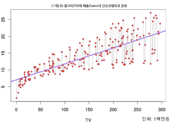
    - 단순선형회귀를 적용하여, 각 데이터에서 잔차제곱을 가장 작게 만드는 직선(최소제곱법)이 선택됨

  - 도형의 의미
    - **파란 직선**: 최소제곱법으로 계산한 회귀선
      - 모든 $\hat{y_i}$은 파란 직선 상에 존재함
      - 현재 파란 직선은 RSS를 최소로 만드는 직선임
    - **빨간 점**: 실제 관측 데이터  
    - **회색 세로선**(빨간 점에서 파란 선까지): 잔차(residual)  
    - RSS(잔차제곱합)을 최소화할 때, 최적의 $\beta_0$, $\beta_1$이 결정됨

  - 수식
    - 기울기: $\hat{\beta_1} = \frac{\sum_{i=1}^{n}(x_i - \bar{x})(y_i - \bar{y})}{\sum_{i=1}^{n}(x_i - \bar{x})^2}$
    - 절편: $\hat{\beta_0} = \bar{y} - \hat{\beta_1}\bar{x}$

### 단순선형회귀 결과 해석
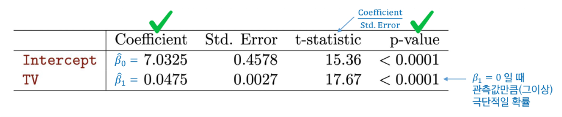

- 계수 해석
  - **절편(Intercept) = 7.03**  
    - TV 광고비가 0이어도 기본적으로 평균 판매량은 7.03백만원  
  - **TV 광고비 계수 = 0.0475**  
    - TV 광고비를 1단위(1백만원) 늘리면 평균 매출이 약 0.0475×1단위(1백만원) = **4.72만원 증가**
  - 그러나 이것을 보고 TV와 매출의 선형관계가 매우 작다고 하면 안됨
    - 왜? TV 광고비 계수는 `0.0475`로, 현재는 백만원 단위지만, 천원단위, 혹은 원단위로 했다면 `47.5`, `475` 이렇게 점점 단위에따라 커짐

- p-value
  - $\beta_1 = 0$일 때 관측값만큼(그이상) 극단적일 확률
    - $\beta_1$ : true model의 기울기. 즉, 관측되지 않는 미지의 기울기로, TV와 매출의 true 관계를 나타냄
    - $\beta_1 = 0$라는 것은 TV와 매출의 관계가 하나도 없다는 뜻. 즉, true가 'X와 Y가 관계가 없다'
  - p-value가 작다는 것은 추정치가 통계적으로 유의미하다는 의미
    - 즉, 선형관계가 매우 강하다

- t-statistic
  - 기울기(ex. TV 광고비 계수)를 보고 선형관계가 크고작음을 논하면 안됨
  - 계수를 std.Error로 나눈 값(비율)으로 선형 관계를 판단해야하는데, 그것이 바로 t-statistic
  - $t-statistic = Coefficient / Std.Error$

- 유의성 검정
  - 계수의 `p-value < 0.0001` (매우 작음, <0.05)이므로 **통계적으로 매우 유의함**  
    - TV 광고비와 매출 간 관계 존재

- 모델 적합도

  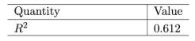
  - $R^2$ 높을수록, 1에 가까울수록 좋음  
  - $R^2 = 0.612$
    - 즉, 판매량 변동의 약 **61%를 광고비로 설명 가능**

## 다중선형회귀 (Multiple Linear Regression)
### 단순선형회귀와 다중선형회귀
- 단순 선형 회귀
  - "TV 광고 → 매출" 한 가지 관계만 고려  
- 다중 선형 회귀
  - "TV 광고, Radio 광고비, 가격, 계절, 경쟁사" 등 복수 요인을 함께 고려하여 매출을 설명

  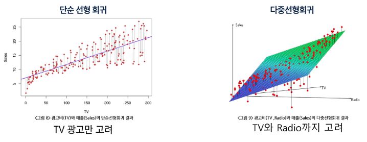

### 복수 설명변수를 이용한 다중선형회귀
독립 변수(설명 변수, Feature)가 여러 개 존재할 때 사용하는 회귀 분석 기법  

- 단순 선형 회귀는 하나의 변수만 고려하지만, 다중 선형 회귀는 여러 독립 변수 $(X_1, X_2, ...)$를 동시에 고려하여 종속 변수(Y)와의 관계를 구함  

- 수식: $Y = \beta_0 + \beta_1 X_1 + \beta_2 X_2 + \dots + \beta_p X_p + \epsilon$
  - Y : 종속 변수 (예측 대상 ex. 매출)  
  - X₁, X₂, X₃, …, Xₚ : p개의 독립 변수들 (ex. 광고비, 가격, 계절 등)  
  - β₀ : 절편  
  - β₁, β₂, β₃, …, βₚ : 각 독립 변수에 대한 회귀 계수 (모수)
    - **변수의 영향력 크기와 방향을 나타냄**
  - 각 변수의 영향력 크기와 방향을 나타냄  
  - ε: 오차항 (모델이 설명하지 못하는 부분, 오류/잔차가 아님!)
  - 해석
    - **다른 변수를 고정**한 채, $Xⱼ$가 1 단위 증가할 때 $Y$가 평균적으로 $βⱼ$만큼 변화  
    - 예시 (광고 데이터):  $sales = β₀ + β₁·TV + β₂·radio + β₃·newspaper$

### 다중선형회귀의 계수 추정과 예측
- 여러 변수($x_{i1}, x_{i2}, ..., x_{ip}$)로 반응 변수 Y를 동시에 예측하는 모형  
- 예측식
  - $\hat{y_i} = \beta_0 + \beta_1x_{i1} + \beta_2x_{i2} + \cdots + \beta_px_{ip}$  
- 추정 방법
  - 실제 값과 예측 값의 차이(잔차)를 제곱해 합한 값(RSS)을 최소화  
  - RSS가 최소일 때 얻어지는 계수 $\hat{\beta_0}, ..., \hat{\beta_p}$가 최적 추정치  

- $RSS = \sum_{i=1}^{n} e_i^2 = \sum_{i=1}^{n}(y_i - \hat{y_i})^2 = \sum_{i=1}^{n}(y_i - \beta_0 - \beta_1x_{i1} - \cdots - \beta_px_{ip})^2$

※ 즉, 여러 입력 변수를 동시에 고려하여 **데이터와 가장 가까운 평면(hyperplane)을 찾는 과정**

### 다중선형회귀 계수 추정 유도 (행렬 표현)
- 행렬 표현

  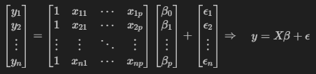
  - true model을 벡터로 표현한 것(우리는 모르는 값)
    - 베타, 입실론은 모르고 우리는 x랑 y만 알고있음

- 최소제곱법 목적: RSS 최소화
  - $RSS = (y - X\hat{\beta})^T(y - X\hat{\beta}) = y^T y - \hat{\beta}^T X^T y - y^T X \hat{\beta} + \hat{\beta}^T X^T X \hat{\beta}$

  - 미분:  
    - $\frac{\partial RSS}{\partial \hat{\beta}} = -2X^T y + 2X^T X \hat{\beta} = 0$
    - **RSS가 가장 작아지는 계수를 찾기 위해, 함수의 기울기=0인 지점을 찾는 과정**

- 정규방정식 해
  - $\hat{\beta} = [\hat{\beta_0}, \hat{\beta_1}, ..., \hat{\beta_p}]^T = (X^T X)^{-1} X^T y$
  - 추정치를 X와 Y의 식으로만 나타낼 수 있음

### 다중선형회귀 결과: 광고 데이터
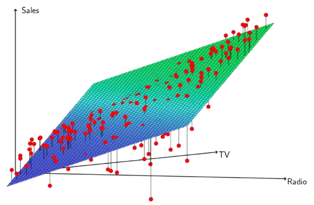

- 다중선형회귀 결과 해석 (광고 데이터)

  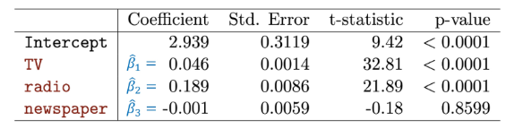
  - TV, 라디오 광고비는 매출 증가에 유의미한 관계를 가짐 (각 p-value들이 매우 낮음 `≪ 0.05`) 
    - TV와 라디오 중 '선형성'이 더 큰것은?
      - 선형성이 크다는 것은 기울기가 크다는 말이 아님!!
      - t-statistic에 따르면 TV의 선형성이 더 큼
    - TV 기준, 라디오 기준으로 각각의 광고 매출액에 대한 단위 당 매출 증가량은 어떤 것이 더 큰가?
      - 기울기가 더 큰것을 보면 됨
      - Coefficient에 따르면 라디오의 매출 증가량이 더 큼
    - 기울기가 큰 것과 선형성이 큰 것은 다름을 주의하자
  - 신문 광고비는 통계적으로 유의하지 않음 (`p-value = 0.8599 > 0.05`) → 매출과 관계가 거의 없음

- 모형 적합도($R^2$ 높을수록, 1에 가까울수록 좋음)

  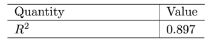
  - 결정계수 $R^2 = 0.897$: 모델 설명력이 매우 높음  
    - 단순선형회귀 결과와 비교하였을 때 향상된 예측

## 선형회귀 주의사항
### 검증/테스트셋 데이터를 활용한 성능 평가
- 선형회귀 결과 검증 및 테스트 성능
  - 훈련 데이터에서의 성능
    - 회귀식을 만들 때 최소제곱 하는 **훈련 데이터만** 보고 계산됨  
    - 학습에 사용된 훈련 데이터에서는(X와 Y의 평균적인 선형관계가 있다면) 적합(fitting)이 잘 되어 있을 것임
    - 그러나 이것은 테스트 성능을 과소평가할 가능성이 높음!!

  - 테스트 성능 평가 필요
    - 선형회귀도 일반화 성능을 확인하려면 훈련에 사용되지 않은 새로운(테스트) 데이터에 적용해 봐야함
    - 수가 많거나 고차항을 사용하면 **과적합 문제**가 여전히 발생할 수 있음
    - 검증/교차검증을 통해서 적절한 적합을 찾을 수 있음

### 다중선형회귀시 회귀계수 해석의 주의점
- 선형회귀를 통해 대답할 수 있는 질문들
  - 이상적 상황
    - 변수들이 서로 겹치지 않아 독립적일 때 → 계수 해석이 명확함 

  - 문제 상황
    - 변수들이 서로 비슷하면 → 계수가 불안정해지고 해석에 혼동이 발생할 수 있음
      - 따라서 피처($X$)들의 상관관계를 확인해보는 것을 가장 먼저 해야함

  - 주의
    - 관찰 데이터의 상관관계로 인과관계를 주장해서는 안 됨
    - 예로 들면, 광고 데이터는 자연스럽게 인과성이 있는 것처럼 보이지만, 다른 많은 데이터에서 선형 관계를 보인다고 하여 인과 관계가 있는 것이 아님
    - ex. "아이스크림 소비량"(X) vs "상어에 물리는 사건"(Y) -> 선형회귀 하면 베타값이 양수로 나옴
      - 이걸 '아이스크림을 많이 먹으면 상어에 잘 물린다'고 인과관계를 주장하면 안된다는 것
      - 상관관계가 있는 이유는 둘 다 '여름'과 연관있어서 그런 것

# AI & 기계학습 방법론 2 - 로지스틱회귀(Logistic Regression)
## 분류 (Classification)
정해진 범주(카테고리) 중 하나로 지정하는 것

- 범주형 변수
  - 수치의 크고 작음이 아니라, 유한한 범주(성별, 혈액형, 지역 등) 로 표현되는 변수
  - ex. 눈동자 색 $C = {black, brown, blue, green}$, 이메일 종류 $C = {spam, normal}$

- 분류 함수 목표
  - 입력
    - $X$ (특성 벡터): ex. 눈동자 이미지, 이메일 내용/제목
  - 출력
    - $Y \in C$ (범주): ex. 눈동자 색 $C = {black, brown, blue, green}$, 이메일 $C = {spam, normal}$, 순서 없는 집합

  - 분류 함수의 목표
    - 분류 함수 $f(X)$ 를 학습하여 입력 $X$가 속할 범주(카테고리) 를 예측
    - 범주의 직접 예측보다, 각 범주에 속할 확률 $P(Y = k \mid X)$ 을 추정하는 것이 더 유용할 때가 많음

### 예시: 신용카드 연체(Default)
- 신용카드 사용량 및 소득에 대한 연체 여부 산점도

  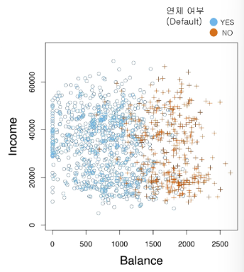
  - 신용카드 사용량(Balance) & 소득(Income) 산점도에 연체(Default) 여부를 색상 및 부호로 구분
  - 신용카드 사용량과 소득은 각각 독립변수, 연체 여부가 종속 변수  

- 신용카드 사용량 및 소득 산점도 해석
  - **연체자(주황색 +)**는 신용카드 사용량이 높은 구간에 집중적으로 분포  
  - **연체가 없는 사람(파란색 ○)**은 신용카드 사용량이 낮은 쪽에 주로 분포  
  - 소득은 연체 여부와 뚜렷한 상관이 보이지 않음

- 그룹별 분포(Boxplot)

  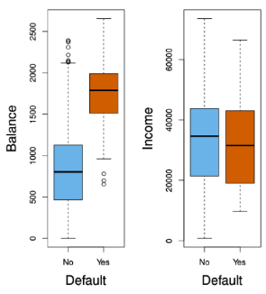
  - 신용카드 사용량(Balance), 소득(Income)에 대해 연체(Default)의 그룹별 분포(Boxplot)
  - 신용카드 사용량과 소득은 각각 독립변수, 연체 여부가 종속 변수

- 그룹별 분포 해석
  - 신용카드 사용량(Balance) vs 연체(Default)
    - '연체자'의 신용카드 사용량이 '연체하지 않은 사람'보다 전반적으로 높음
    - 중앙값도 높고, 분포가 퍼져 있는 정도도 더 큼
  - 소득(Income) vs 연체(Default)
    - 연체 여부에 따른 소득 차이는 거의 없음
    - 중앙값이 약간 다르지만 분포가 대부분 겹침

### 선형회귀는 분류 문제에 사용하기에 부적절함
- 이진 분류 문제
  - 선형회귀는 선형함수를 계산하는 문제로 예측 값이 (Y값 기준) 제한된 값을 갖지 못함
  - 따라서 선형회귀는 **예측 확률이 0보다 작거나 1보다 크게 예측**될 수 있어 **확률로 쓰기 부적절함**  
    - ex. 응급실 환자 진단 {0: 비응급, 1: 응급}  
    - 선형회귀는 확률 범위(0~1)를 벗어나는 값을 내놓을 수 있어 문제 발생

      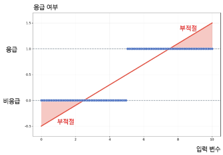

- 다중 범주 분류 문제
  - 선형회귀는 정수형 코딩(1, 2, 3)에 따라 범주 간 순서와 동일한 거리를 가정함
  - 범주(카테고리) 변수는 순서가 없는 라벨이므로 이러한 가정은 부적절함
    - ex. 응급실 환자 진단 {1: 뇌졸중, 2: 약물 과다복용, 3: 간질발작}
    - 이것은 뇌졸증과 약물과다복용의 떨어진 정도가 약물과다복용과 간질발작이 떨어진 정도와 동일함을 암묵적으로 가정한 것
    - → 실제로는 범주 간 순서나 거리가 존재하지 않음

      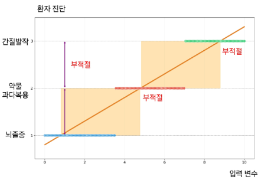
  - 따라서, 선형회귀는 분류 문제에 부적절함

### 분류 문제에서 적합한 모델
- 분류 문제에서 선형회귀의 대안 – 로지스틱 회귀(Logistic Regression)
  - **시그모이드(Sigmoid) 함수**를 활용해 0~1 범위 내 확률값 예측 보장  
  - 순서가 없는 범주를 확률로 직접 예측하는 적절한 분류 방법

    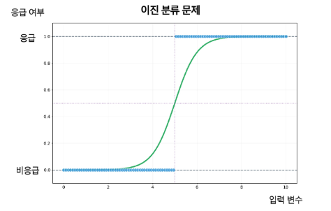

## 로지스틱 회귀 (Logistic Regression)
### 로지스틱(Logistic) 회귀의 모형식
- 이진 분류에서의 적절한 함수
  - **함수의 출력 범위**가 모든 입력에 대해 **0~1 사이의 범위를 가지는 함수**를 활용하자

- 출력 범위가 0~1인 시그모이드(Sigmoid) 함수
  - 기울어진 **S자 형태의 곡선 함수**
  - $y = \frac{e^z}{1 + e^z} = \frac{1}{1 + e^{-z}}$
    - (오일러 수 e ≈ 2.71828)
    
    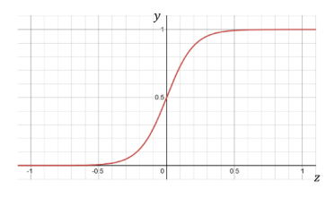

  - **모든 실수 z에 대한 y값의 범위**는 `0 ≤ y ≤ 1`이다.  
    - `z → +∞` 일 때, `y → 1`로 수렴  
    - `z → -∞` 일 때, `y → 0`으로 수렴  

### 로지스틱 회귀(Logistic Regression)의 모형식
- 시그모이드(Sigmoid) 함수 $y = \frac{e^z}{1 + e^z}$ 의 $z$에 선형 회귀(Linear Regression) 식 $z = \beta_0 + \beta_1x$ 를 대입하면,
  - $y = \frac{e^{\beta_0 + \beta_1x}}{1 + e^{\beta_0 + \beta_1x}}$

- 확률 표기 $p(x)$를 활용하면 로지스틱 회귀의 모형식이 됨
  - $p(X) = P(Y = 1 | X)$ (X가 주어졌을 때 결과 Y가 1일 확률)로 두고,

    $$
    p(x; \beta) = \frac{e^{\beta_0 + \beta_1x}}{1 + e^{\beta_0 + \beta_1x}} = \frac{1}{1 + e^{-(\beta_0 + \beta_1x)}}
    $$

    $$
    \beta = [\beta_0, \beta_1]^\top
    $$

### 로지스틱 회귀 모형 vs 선형 모형
- 로지스틱 함수와 선형회귀의 관계
  - 로지스틱 함수 $p(x; \beta) = \frac{e^{\beta_0 + \beta_1x}}{1 + e^{\beta_0 + \beta_1x}}$ 는 선형 함수 $y = \beta_0 + \beta_1x$ 를 내포하고 있음
  - 두 함수의 관계를 해석하기 위해 **오즈(Odds)** 와 **로짓 변환(logit)** 에 대해 알아보자

- 오즈(Odds)
  - '성공(y=1) 확률이 실패(y=0) 확률에 비해 몇 배 더 높은가'를 나타냄
  - $odds = \frac{p(y=1|x)}{p(y=0|x)} = \frac{p(y=1|x)}{1 - p(y=1|x)} = \frac{\text{성공확률}}{\text{실패확률}}$
    - $p(y = 1 | x)$: x 변수가 주어졌을 때 y가 1일 확률
    - $p(y = 0 | x)$: x 변수가 주어졌을 때 y가 0일 확률

- 로짓 변환(logit) = Log odds
  - 로짓변환은 **오즈(odds)** 에 **log**를 취한 함수 형태
  - $logit(p) = \log(odds) = \log\frac{p(y=1|x)}{1-p(y=1|x)} = \log\frac{\text{성공확률}}{\text{실패확률}}$

- 로지스틱 함수 모형식 $p(y=1|x) = p(x; \beta) = \frac{e^{\beta_0 + \beta_1x}}{1 + e^{\beta_0 + \beta_1x}}$ 에 로짓 변환 수행해보자
  $$
  logit(p) = \log(odds) = \log\frac{p(x; \beta)}{1 - p(x; \beta)} = \beta_0 + \beta_1x
  $$
  - 로그 오즈(log(성공확률/실패확률))를 잘 정리하면 **선형식** 나옴!! 아주 재밌죠?
  - 즉, **로지스틱 모형식은 선형 모형식과 시그모이드(sigmoid) 함수의 결합**이며, 로짓 변환시 **선형 회귀 모형식으로 표현이 가능**힘
    $$
    p(x; \beta) = \frac{e^{\beta_0 + \beta_1x}}{1 + e^{\beta_0 + \beta_1x}}
    \quad \Longleftrightarrow \quad
    \log\frac{p(x; \beta)}{1 - p(x; \beta)} = \beta_0 + \beta_1x
    $$
    - **로지스틱 모형** = 선형모형 + 시그모이드 함수
    - 로지스틱 모형의 **로짓 변환** = 선형모형

### MLE 활용 모수 추정
확률을 추정하는 모델을 결정했으니, 모수 $(\beta_0, \beta_1)$을 추정하는 방법에 대해 알아보자

- 우도(Likelihood)
  - "현재 확률 함수가 데이터를 얼마나 잘 설명하는지"를 나타낸 지표
  - 선형회귀에서는 "현재 함수가 데이터와 오차가 작은지"를 평가하기 위해 평균 제곱 오차(MSE)를 지표로 삼았듯, 확률을 계산하는 함수는 평가하기 위해 **우도(Likelihood)** 를 지표로 삼음 
  - 따라서 모델의 학습은 우도 값을 높여 **최대화(maximize)** 되도록 하는 것이 목표이며, 이를 **Maximum Likelihood Estimation (MLE)** 이라고 함

- 로지스틱 회귀의 우도 최대화
  - 로지스틱 회귀와 같은 이진 분류 문제에서 우도를 **최대화**함
    $$
    \max_{\beta} \mathcal{L}(\beta)
    = \prod_{i: y_i = 1} p(x_i; \beta)
    \prod_{i: y_i = 0} (1 - p(x_i; \beta))
    $$
    - 참고: $p(x_i; \beta) = \frac{e^{\beta_0 + \beta_1 x_i}}{1 + e^{\beta_0 + \beta_1 x_i}}$
    - 'y값이 1이 될 확률들을 곱한것'과 'y값이 0일 확률들을 곱한 것'을 곱해서 구함
    - 'y값이 1이 될 확률들을 곱한것'은 1에 가까워야 좋은 것
    - 'y값이 0이 될 확률들을 곱한것'은 0에 가까워야 좋은 것
    - 우리는 likelihood를 최대로 하는 '베타'를 구해야 함

  - 하지만 위와 같은 곱으로 이루어진 함수의 경우, $\beta$에 대해 미분이 어렵기 때문에  
  - 양변에 **log**를 취해 곱셈을 덧셈으로 바꾼 뒤 **log-likelihood**를 만듦
    $$
    \max_{\beta} \log \mathcal{L}(\beta)
    = \sum_{i=1}^{n} [y_i \log p(x_i; \beta) + (1 - y_i) \log (1 - p(x_i; \beta))]
    $$

- log-likelihood로 변형하여 최대화하는 β를 구해도 되는가?
  - 로지스틱 회귀에서 우도(likelihood)를 최대화하는 것인데, log 변환을 한 log-likelihood를 최대화하는 것으로 변형하여 문제를 접근해도 과연 괜찮을까?  
  - **Log 함수는 단조(monotone) 증가 함수**이므로, 
  - log-likelihood를 최대화하는 $\beta$와  
  likelihood를 최대화하는 $\beta$는 **동일함!!**

    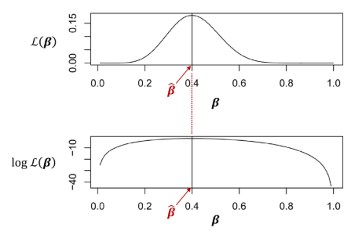

- 로지스틱 회귀의 우도 최대화 정리
  - 로지스틱 회귀와 같은 이진 분류 문제에서 우도를 최대화 한다
    $$
    \max_{\beta} \mathcal{L}(\beta)
    = \prod_{i: y_i = 1} p(x_i; \beta)
    \prod_{i: y_i = 0} (1 - p(x_i; \beta))
    $$

    $$
    \text{where} \quad
    p(x_i; \beta) = \frac{e^{\beta_0 + \beta_1 x_i}}{1 + e^{\beta_0 + \beta_1 x_i}}
    $$
  
  - 하지만 위와 같은 곱으로 이루어진 함수의 경우, $\beta$에 대해 미분이 어렵기 때문에 양변에 **log**를 취해 곱셈을 덧셈으로 바꾼 뒤 **log-likelihood**를 만들어 최대화 한다
    $$
    \max_{\beta} \log \mathcal{L}(\beta)
    = \sum_{i=1}^{n} [y_i \log p(x_i; \beta) + (1 - y_i) \log (1 - p(x_i; \beta))]
    $$
  
  - log $\mathcal{L}(\beta)$를 미분하여 **도함수 = 0**이 되도록 하는 $\beta$를 찾는다
    - 이 과정은 해석적으로 풀기 어려워 **수치적(반복적) 최적화 알고리즘**으로 근사해 나간다

### 로지스틱 회귀 결과: 신용카드 연체 데이터
- 신용카드 연체 데이터 결과 해석
  - 신용카드 사용량(Balance)과 연체 여부(Default)로 로지스틱 회귀 모형을 학습한 결과:

    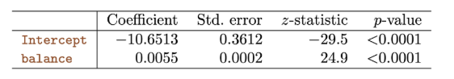
    - 추정 결과 $\hat{\beta_1} = 0.0055$
    - 즉, **신용카드 사용량(Balance)이 1 단위 증가할 때 연체(Default)의 로짓(log-odds)** 이 0.0055 증가함
    - $\log \frac{p(X; \hat{\beta})}{1 - p(X; \hat{\beta})}= -10.6513 + 0.0055 \cdot X$
  
  - 잘못된 해석
    - 베타 계수가 0.0055이니 balance가 연체 여부에 미치는 영향은 매우 작다 XX -> z-statistic와 p-value로 영향력 판단해야함
    - balance가 1 단위 증가할 때 연체할 확률이 0.0055만큼 증가한다 XX -> 연체의 '로짓'이 0.0055 증가하는 것

  - 입력값 변화에 따른 예측 변화

    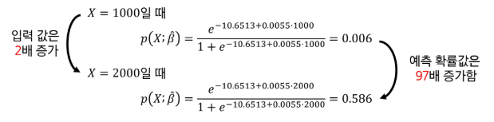
    - 카드 사용량은 두배 늘었는데, 연체 확률은 97배 늘었음
    - 선형이 아니라 '시그모이드'함수이기 때문!
  
- 추가 변수 포함 모델
  - 신용카드 사용량 이외에도 다양한 입력(소득, 학생 여부 등)을 추가하여 여러 변수 $X_1, \dots, X_p$를 함께 모형에 사용하면 회귀 계수를 통해 연체할 확률을 계산할 수 있음

  - 수식: $\log \frac{p(X; \beta)}{1 - p(X; \beta)} = \beta_0 + \beta_1 X_1 + \cdots + \beta_p X_p$
    - $p(X; \beta) = \frac{e^{\beta_0 + \beta_1 X_1 + \cdots + \beta_p X_p}}{1 + e^{\beta_0 + \beta_1 X_1 + \cdots + \beta_p X_p}}$

  - 해석 요약

    
    - balance: 유의미한 영향 (p < 0.0001)  
    - income: 영향 미미 (p ≈ 0.71)  
    - student [Yes]: 학생일 경우 연체 확률 감소 (음의 회귀계수)  
    - 따라서 신용카드 사용량이 많을수록 연체 확률이 커지며, 학생 신분은 연체 가능성을 낮추는 요인으로 작용함

# AI & 기계학습 방법론 3 - 신경망모델(Neural Network)
## 모수적 함수로서의 선형 모델
### 단순(1D) 선형모델
- 모수적 함수
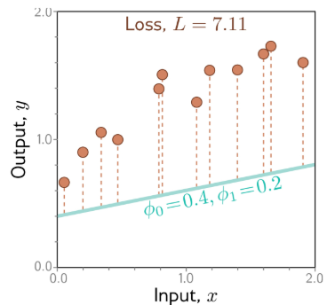
  - 손실함수: $L[\phi] = \sum_{i=1}^{I} (f[x_i, \phi] - y_i)^2 = \sum_{i=1}^{I} (\phi_0 + \phi_1 x_i - y_i)^2$
    - "최소제곱 손실함수"
    - 지금까지 했던 식에서 베타를 피($\phi$)로 용어 표현 변경
      - RSS의 새로운 표현

- 단순(1D) 선형모델 학습
  - 순차적으로 모수(parameter)를 조정하면서 찾아내는 선형회귀

    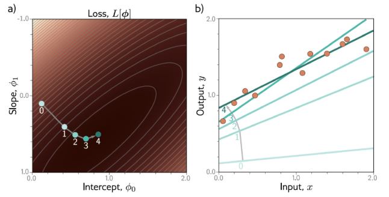

## Shallow 네트워크
### Shallow 네트워크 vs 1D 선형회귀
- 단순(1D) 선형회귀
  - $y = f[x, \phi] = \phi_0 + \phi_1 x$
    - $\phi_0, \phi_1$ : 모수(parameter)

- Shallow 네트워크의 예
  - $y = f[x, \phi] = \phi_0 + \phi_1 a[\theta_{10} + \theta_{11}x] + \phi_2 a[\theta_{20} + \theta_{21}x] + \phi_3 a[\theta_{30} + \theta_{31}x]$
    - $\phi_0, \phi_1, \phi_2, \phi_3, \theta_{10}, \theta_{11}, \theta_{20}, \theta_{21}, \theta_{30}, \theta_{31}$: 모수(parameter)
    - a 함수 내에는 선형회귀와 동일한 형태의 식이 들어있음

- Shallow 네트워크: **활성화 함수**
  - $y = f[x, \phi]$
    - $= \phi_0 + \phi_1 a[\theta_{10} + \theta_{11}x] + \phi_2 a[\theta_{20} + \theta_{21}x] + \phi_3 a[\theta_{30} + \theta_{31}x]$
    - 여기서 a는 파라미터가 아닌 '활성화 함수'임

  - 활성화 함수(activation function)의 대표적 예시:
    - Rectified Linear Unit (ReLU)  
    - $a[z] = \text{ReLU}[z] = \begin{cases} 0, & z < 0 \\ z, & z \ge 0 \end{cases}$

      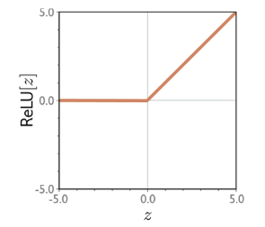

- Shallow 네트워크: **모수(parameter)**
  - $y = f[x, \phi]$
    - $= \phi_0 + \phi_1 a[\theta_{10} + \theta_{11}x] + \phi_2 a[\theta_{20} + \theta_{21}x] + \phi_3 a[\theta_{30} + \theta_{31}x]$

  - 위 네트워크 모델은 **10개의 모수(parameter)** 를 갖고 있음
    - $\phi = \{\phi_0, \phi_1, \phi_2, \phi_3, \theta_{10}, \theta_{11}, \theta_{20}, \theta_{21}, \theta_{30}, \theta_{31}\}$

  - 모수 $\phi$가 정해지면 특정 함수 $f[x, \phi]$가 결정됨
  - 모수가 주어지면 추론(식을 계산, 예측)할 수 있음
  - 훈련데이터 $\{(x_i, y_i)\}_{i=1}^I$ 가 주어지면 **손실함수** (ex. least squares)를 정의하고, 손실을 최소화하도록 모수를 조정함

- Shallow 네트워크: **piecewise linear 함수**
  - 입력 구간을 나눠 **조각별 선형(piecewise linear)** 함수를 만듦  
  - $y = f[x, \phi]$
  - $= \phi_0 + \phi_1 a[\theta_{10} + \theta_{11}x] + \phi_2 a[\theta_{20} + \theta_{21}x] + \phi_3 a[\theta_{30} + \theta_{31}x]$

    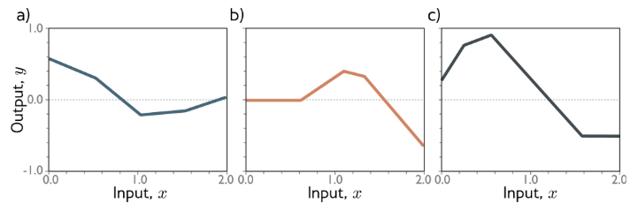
    - 다른 모수(𝜙)에 따라서 달라지는 함수 $f[x, \phi]$ 의 예시 (a), (b), (c)
    - 모수 변화에 따라 다른 조각별 선형 형태를 가짐

- Shallow 네트워크: **Hidden Units**
  - $y = f[x, \phi]$
  - $= \phi_0 + \phi_1 a[\theta_{10} + \theta_{11}x] + \phi_2 a[\theta_{20} + \theta_{21}x] + \phi_3 a[\theta_{30} + \theta_{31}x]$

  - 두 부분으로 나눠 생각:
    - $y = \phi_0 + \phi_1 h_1 + \phi_2 h_2 + \phi_3 h_3$

  - Hidden units 정의:
    - $\begin{cases} h_1 = a[\theta_{10} + \theta_{11}x] \\ h_2 = a[\theta_{20} + \theta_{21}x] \\ h_3 = a[\theta_{30} + \theta_{31}x] \end{cases}$
    - Hidden units: 은닉층에서 **활성화 함수** $a[\cdot]$ 에 의해 계산되는 **중간 결과값**

- Shallow 네트워크 단계별 계산 확인
  1. 선형변환

      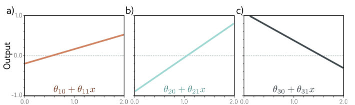
      - 각각의 유닛에서 선형 식 계산
  
  2. 활성화 함수 적용

      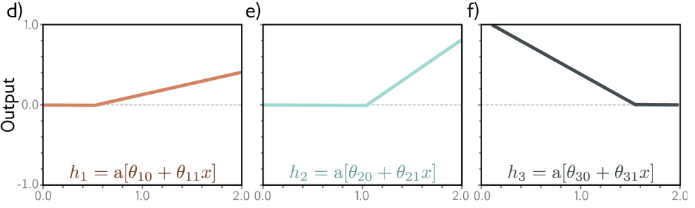
      - ReLU 활성화 함수 적용(0 이하를 0으로 만들어줌)
  
  3. 활성화 후 $\phi_j$배 적용

      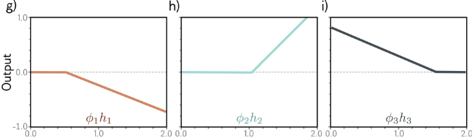
      - 활성화함수 적용한 것에 파라미터 곱해줌
      - g) 그래프 보면 $\phi_1$ 곱했더니 음수가됨. 따라서 $\phi_1$은 음수임을 알 수 있음
      - $\phi_2$는 양수이고, 1보다 큼을 알 수 있음
      - **꺾인 점 위치는 바뀌지 않음**
  
  4. g, h, i 함수의 합

      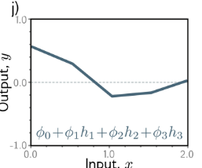
      - 꺾인 점 3개!
      - Why? 3개를 합쳤기 때문
      - Why? 3개의 활성화 함수가 있었기 때문
      - 즉, 3개의 히든 유닛이 있었기 때문
      - 꺾인 점은 활성화 함수 때문에 생기고, activation 한 것은 Hidden Units이니까 히든 유닛 숫자만큼 꺾인선이 있는 것

### 네트워크 도식화
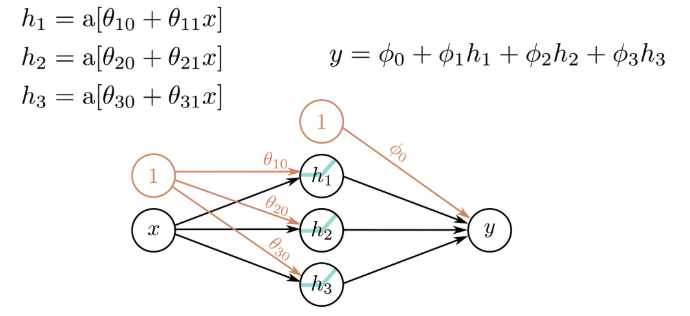
- 각 파라미터는 (출발 노드 값) * (가중치) 를 출력 노드에 더함

- 은닉층(hidden layer)과 출력층(output layer)을 수식으로 표현:
  - $\begin{cases} h_1 = a[\theta_{10} + \theta_{11}x] \\ h_2 = a[\theta_{20} + \theta_{21}x] \\ h_3 = a[\theta_{30} + \theta_{31}x] \end{cases}$

- 출력층 계산식:
  - $y = \phi_0 + \phi_1 h_1 + \phi_2 h_2 + \phi_3 h_3$
    - 각 $h_i$는 은닉층의 활성화 결과 (hidden unit)  
    - $y$는 출력층에서 이들을 가중합(weighted sum)하여 얻은 최종 결과  

- 전체 구조는 "입력 → 은닉층(활성화 함수) → 출력" 형태의 기본 신경망 도식과 동일

- 단순하게 표현

  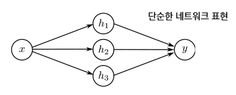

## Shallow 네트워크의 표현력
### Shallow 네트워크
hidden layer가 '하나'인 네트워크

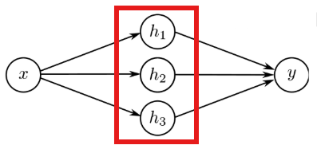

※ hidden layer가 둘 이상인 네트워크를 'Deep 네트워크'라고 함

### 더 많은 Hidden Unit 가능
- 3개의 hidden units:
  $$
  \begin{align*}
  h_1 &= a[\theta_{10} + \theta_{11}x] \\
  h_2 &= a[\theta_{20} + \theta_{21}x] \\
  h_3 &= a[\theta_{30} + \theta_{31}x]
  \end{align*}
  \quad\quad
  y = \phi_0 + \phi_1 h_1 + \phi_2 h_2 + \phi_3 h_3
  $$

- (일반적인) D개의 hidden units:
  $$
  h_d = a[\theta_{d0} + \theta_{d1}x]
  \quad\quad\quad
  y = \phi_0 + \sum_{d=1}^{D} \phi_d h_d
  $$

  - hidden unit 수 $D$를 늘리면 모델이 더 복잡한 함수를 근사할 수 있음  
  - 각 hidden unit은 서로 다른 파라미터 $(\theta_{d0}, \theta_{d1})$를 가짐  
  - 출력층에서는 이들을 가중합하여 $y$를 계산함

- Hidden Unit을 많이 두면?
  - 충분히 많은 Hidden Unit이 있다면, 임의의 1차원 함수를 **원하는 정확도**로 근사할 수 있음

    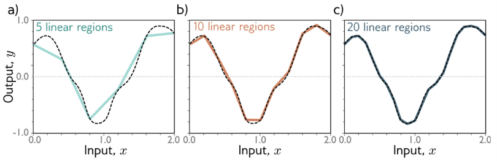

### 보편적 근사 정리(Universal approximation theorem)
"**Hidden unit을 충분히 많이** 갖는다면, 얕은 신경망은 **임의의 연속함수를 임의의 정밀도로 근사**할 수 있음"

※ 깊은 신경망(레이어 2개 이상)이 아니어도 Hidden unit이 충분히 많다면 정밀 근사 가능!!

## 다중 출력/입력
### 2개 출력의 네트워크
- 예시: 1 input, 4 hidden units, 2 outputs
  $$
  \begin{align*}
  h_1 &= a[\theta_{10} + \theta_{11}x] \\
  h_2 &= a[\theta_{20} + \theta_{21}x] \\
  h_3 &= a[\theta_{30} + \theta_{31}x] \\
  h_4 &= a[\theta_{40} + \theta_{41}x]
  \end{align*}
  $$

  - 출력층 계산식:
    $$
    \begin{align*}
    y_1 &= \phi_{10} + \phi_{11}h_1 + \phi_{12}h_2 + \phi_{13}h_3 + \phi_{14}h_4 \\
    y_2 &= \phi_{20} + \phi_{21}h_1 + \phi_{22}h_2 + \phi_{23}h_3 + \phi_{24}h_4
    \end{align*}
    $$

  - 하나의 입력으로부터 4개의 은닉 유닛(hidden units)을 거쳐 **2개의 출력값**을 계산

    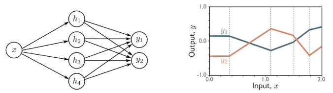
    - 출력 개수 늘어나도 **꺾인 점의 위치는 변하지 않음!!!**
    - $\phi$가 늘어나는거지 히든레이어(히든유닛)는 동일하기 때문

### 2개 입력의 네트워크
- 예시: 2 inputs, 3 hidden units, 1 output
  $$
  \begin{align*}
  h_1 &= a[\theta_{10} + \theta_{11}x_1 + \theta_{12}x_2] \\
  h_2 &= a[\theta_{20} + \theta_{21}x_1 + \theta_{22}x_2] \\
  h_3 &= a[\theta_{30} + \theta_{31}x_1 + \theta_{32}x_2]
  \end{align*}
  $$

  - 출력층 계산식:
    $$
    y = \phi_0 + \phi_1 h_1 + \phi_2 h_2 + \phi_3 h_3
    $$

  - 입력이 2개 $(x_1, x_2)$일 때, 각 은닉 유닛은 두 입력에 대한 가중합을 계산

  - 은닉층에서 추출된 3개의 특징($h_1, h_2, h_3$)을 조합해 하나의 출력 $y$ 생성

    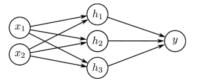
    - $x_2$에 대한 기울기만 늘어나고, 다른건 다 동일함!

- 2개의 입력 네트워크 단계별 계산
  1. 선형변환

      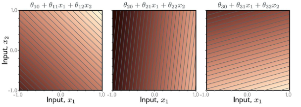
      - 아까는 X, Y가 각각 1차원이었지만 지금은 X가 2차원이므로 '평면'으로 나타남
      - 어두울수록 낮은 값, 밝을수록 높은 값
  
  2. 활성화 함수 적용

      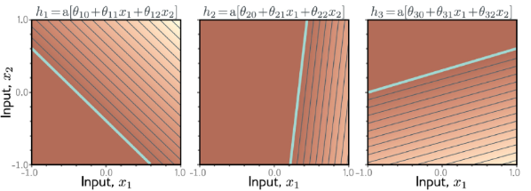
      - ReLU 활성화 함수 적용하여 0 이하는 평평하게 만드는 것
  
  3. Hidden unit에 상수배 적용

      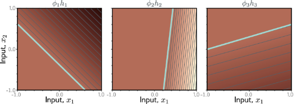
      - 첫번째 그래프 보면 h1이 증가 함수였는데, $\phi_1$ 곱하니까 감소 함수가 됨($\phi_1$는 음수)
      - 두번째 그래프 보면 h2가 증가함수인데, $\phi_2$ 곱하니까 간격이 더 촘촘해짐($\phi_2$ > 1)
      - 세번쨰 그래프 보면 h3가 증가함수인데, $\phi_3$ 곱하니까 감소함수가 되었고, 더 느슨해짐($\phi_3$은 음수 & `< 1`)
  
  4. 3개 함수의 합
      
      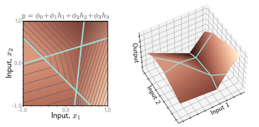

### 임의의 개수의 입력, Hidden Unit, 출력
- $D_o$ Outputs, $D$ Hidden Units, and $D_i$ Inputs
  $$
  h_d = a\left[\theta_{d0} + \sum_{i=1}^{D_i} \theta_{di}x_i \right]
  \quad\quad
  y_j = \phi_{j0} + \sum_{d=1}^{D} \phi_{jd}h_d
  $$
  - 입력층(Input layer): $D_i$개의 입력값 $(x_1, x_2, \dots, x_{D_i})$  
  - 은닉층(Hidden layer): $D$개의 은닉 유닛 $(h_1, \dots, h_D)$  
  - 출력층(Output layer): $D_o$개의 출력값 $(y_1, \dots, y_{D_o})$ 

  - 일반화된 형태로, 모든 입력·은닉·출력 개수를 자유롭게 확장 가능

- 예시: 3 inputs, 3 hidden units, 2 outputs

  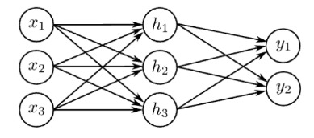

## Deep 네트워크
### 2개의 Shallow 네트워크를 하나로 합성
- Network 1
  $$
  \begin{align*}
  h_1 &= a[\theta_{10} + \theta_{11}x] \\
  h_2 &= a[\theta_{20} + \theta_{21}x] \\
  h_3 &= a[\theta_{30} + \theta_{31}x]
  \end{align*}
  \quad\quad
  y = \phi_0 + \phi_1 h_1 + \phi_2 h_2 + \phi_3 h_3
  $$

- Network 2
  $$
  \begin{align*}
  h'_1 &= a[\theta'_{10} + \theta'_{11}y] \\
  h'_2 &= a[\theta'_{20} + \theta'_{21}y] \\
  h'_3 &= a[\theta'_{30} + \theta'_{31}y]
  \end{align*}
  \quad\quad
  y' = \phi'_0 + \phi'_1 h'_1 + \phi'_2 h'_2 + \phi'_3 h'_3
  $$

  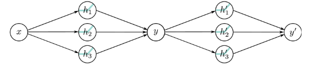
  - 첫 번째 네트워크의 출력 $y$가 두 번째 네트워크의 입력으로 전달됨 

- 합성한 네트워크의 입력에 따른 변화

  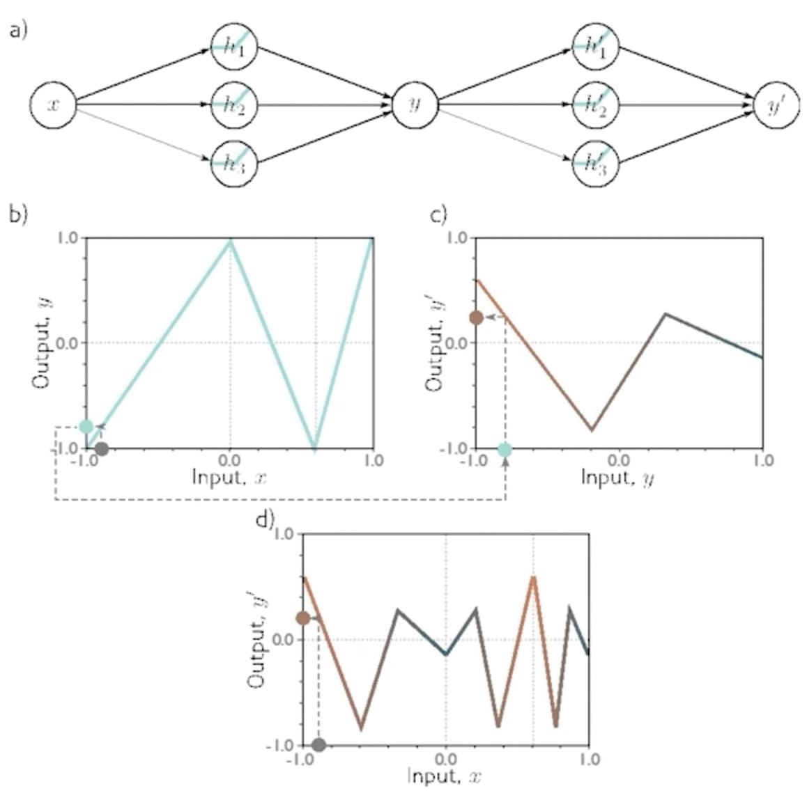
  - b) $x$에 따른 $y$의 변화
  - c) $y$에 따른 $y'$의 변화
  - d) $x$에 따른 $y'$의 변화
  - b) 그래프에 꺾인점이 3번 등장하기 때문에 d) 그래프에 c) 그래프 형태가 3번 등장함
    - (x의 변화에 따라 y가 상승/하강/상승 3번 하므로)

  - "종이접기" 비유

    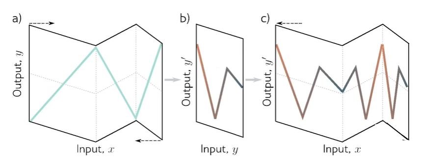
    - 종이 접어놓고 산 모양으로 잘라서 펼쳐보면 산 모양이 여러개인 것과 비슷함
    - 대신, 어느 부분은 squeeze된 것이 있고, 어느 부분은 좀 더 펼쳐진 부분이 있는 것 뿐

### Shallow 네트워크와 Deep 네트워크 비교
- Shallow 네트워크

  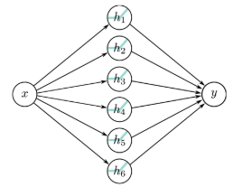  
  - 파라미터 수: 19개
  - 조각적 선형 구역: 7개 이하

- Deep 네트워크

  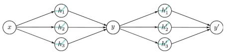
  - 파라미터 수: 20개
  - 조각적 선형 구역: 9개 이상

- 히든 유닛 개수는 6개로 동일
  - 레이어 개수에 따라 조각적 선형 구역을 만들 수 있는 개수가 달라짐
  - 주어진 파라미터에 대해 조각적 선형 구역을 더 많이 만들 수 있는 것은 **Deep 네트워크**
  - 우리는 주어진 파라미터에 대해 **표현력이 더 높은 것**. 즉, 조각이 더 많은 것을 찾아야 함
    - 따라서 Deep 네트워크가 Shallow 네트워크와 비슷한 파라미터 수를 가지고 '더 많은 표현'이 가능함

### 2D Input: 2개의 네트워크를 하나로 합성
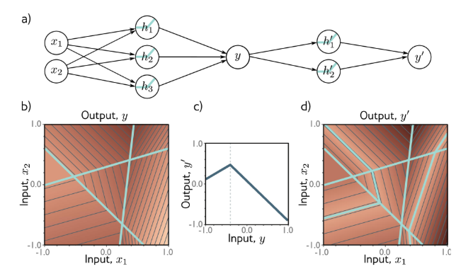

## Deep 네트워크 수식 표현
### 2개의 네트워크를 하나로 합성: 복잡한 수식
- Network 1
  $$
  \begin{align*}
  h_1 &= a[\theta_{10} + \theta_{11}x] \\
  h_2 &= a[\theta_{20} + \theta_{21}x] \\
  h_3 &= a[\theta_{30} + \theta_{31}x]
  \end{align*}
  \quad\quad
  y = \phi_0 + \phi_1h_1 + \phi_2h_2 + \phi_3h_3
  $$

- Network 2
  $$
  \begin{align*}
  h'_1 &= a[\theta'_{10} + \theta'_{11}y] \\
  h'_2 &= a[\theta'_{20} + \theta'_{21}y] \\
  h'_3 &= a[\theta'_{30} + \theta'_{31}y]
  \end{align*}
  \quad\quad
  y' = \phi'_0 + \phi'_1h'_1 + \phi'_2h'_2 + \phi'_3h'_3
  $$

- 두 번째 네트워크의 hidden units
  $$
  \begin{align*}
  h'_1 &= a[\theta'_{10} + \theta'_{11}y] = a[\theta'_{10} + \theta'_{11}\phi_0 + \theta'_{11}\phi_1h_1 + \theta'_{11}\phi_2h_2 + \theta'_{11}\phi_3h_3] \\
  h'_2 &= a[\theta'_{20} + \theta'_{21}y] = a[\theta'_{20} + \theta'_{21}\phi_0 + \theta'_{21}\phi_1h_1 + \theta'_{21}\phi_2h_2 + \theta'_{21}\phi_3h_3] \\
  h'_3 &= a[\theta'_{30} + \theta'_{31}y] = a[\theta'_{30} + \theta'_{31}\phi_0 + \theta'_{31}\phi_1h_1 + \theta'_{31}\phi_2h_2 + \theta'_{31}\phi_3h_3]
  \end{align*}
  $$

### 2개의 네트워크를 하나로 합성: 새로운 변수 활용
- 새로운 파라미터 정의
  $$
  \psi_{10} = \theta'_{10} + \theta'_{11}\phi_0, \quad
  \psi_{11} = \theta'_{11}\phi_1, \quad
  \psi_{12} = \theta'_{11}\phi_2, \quad
  \psi_{13} = \theta'_{11}\phi_3
  $$

- 이를 통해 식을 단순화하면,
  $$
  \begin{align*}
  h'_1 &= a[\psi_{10} + \psi_{11}h_1 + \psi_{12}h_2 + \psi_{13}h_3] \\
  h'_2 &= a[\psi_{20} + \psi_{21}h_1 + \psi_{22}h_2 + \psi_{23}h_3] \\
  h'_3 &= a[\psi_{30} + \psi_{31}h_1 + \psi_{32}h_2 + \psi_{33}h_3]
  \end{align*}
  $$

### 2층 네트워크의 표현
$$
\begin{align*}
h_1 &= a[\theta_{10} + \theta_{11}x], \quad
h_2 = a[\theta_{20} + \theta_{21}x], \quad
h_3 = a[\theta_{30} + \theta_{31}x] \\
\quad
\\
h'_1 &= a[\psi_{10} + \psi_{11}h_1 + \psi_{12}h_2 + \psi_{13}h_3] \\
h'_2 &= a[\psi_{20} + \psi_{21}h_1 + \psi_{22}h_2 + \psi_{23}h_3] \\
h'_3 &= a[\psi_{30} + \psi_{31}h_1 + \psi_{32}h_2 + \psi_{33}h_3]
\end{align*}
$$

출력:
$$
y' = \phi'_0 + \phi'_1h'_1 + \phi'_2h'_2 + \phi'_3h'_3
$$

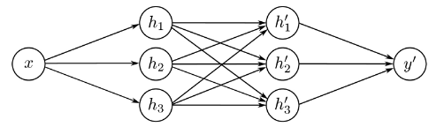

## 6-3. 2층 네트워크의 표현: 네트워크를 합성 함수로 봄

> 두 번째 hidden 유닛들의 **pre-activation(전활성값)** 을 살펴보면,  
> 이 시점에서는 출력 3개를 갖는 1층(one-layer) 네트워크로 볼 수 있음.

$$
\begin{align*}
h_1 &= a[\theta_{10} + \theta_{11}x], \quad
h_2 = a[\theta_{20} + \theta_{21}x], \quad
h_3 = a[\theta_{30} + \theta_{31}x] \\
h'_1 &= a[\psi_{10} + \psi_{11}h_1 + \psi_{12}h_2 + \psi_{13}h_3] \\
h'_2 &= a[\psi_{20} + \psi_{21}h_1 + \psi_{22}h_2 + \psi_{23}h_3] \\
h'_3 &= a[\psi_{30} + \psi_{31}h_1 + \psi_{32}h_2 + \psi_{33}h_3]
\end{align*}
$$

---

## 6-5. 용어의 단순화 (Matrix Form)

$$
\begin{align*}
\begin{bmatrix}
h_1 \\ h_2 \\ h_3
\end{bmatrix}
&= a\left(
\begin{bmatrix}
\theta_{10} \\ \theta_{20} \\ \theta_{30}
\end{bmatrix}
+
\begin{bmatrix}
\theta_{11} \\ \theta_{21} \\ \theta_{31}
\end{bmatrix}
x
\right) \\[10pt]
\begin{bmatrix}
h'_1 \\ h'_2 \\ h'_3
\end{bmatrix}
&= a\left(
\begin{bmatrix}
\psi_{10} \\ \psi_{20} \\ \psi_{30}
\end{bmatrix}
+
\begin{bmatrix}
\psi_{11} & \psi_{12} & \psi_{13} \\
\psi_{21} & \psi_{22} & \psi_{23} \\
\psi_{31} & \psi_{32} & \psi_{33}
\end{bmatrix}
\begin{bmatrix}
h_1 \\ h_2 \\ h_3
\end{bmatrix}
\right) \\[10pt]
y' &= \phi'_0 + [\phi'_1 \ \phi'_2 \ \phi'_3]
\begin{bmatrix}
h'_1 \\ h'_2 \\ h'_3
\end{bmatrix}
\end{align*}
$$

---

> - 두 층 네트워크를 행렬 형태로 단순화  
> - 각 층의 계산을 **벡터/행렬 연산**으로 표현 가능  
> - 이후 **딥러닝의 기본 형태(Forward Propagation)** 으로 확장됨

## 6-5. 용어의 단순화: 벡터 및 행렬 표현

---

### (1) 행렬 표현의 단순화

$$
\begin{bmatrix}
h_1 \\ h_2 \\ h_3
\end{bmatrix}
= 
a\left(
\begin{bmatrix}
\theta_{10} \\ \theta_{20} \\ \theta_{30}
\end{bmatrix}
+
\begin{bmatrix}
\theta_{11} \\ \theta_{21} \\ \theta_{31}
\end{bmatrix}
x
\right)
\quad\Longrightarrow\quad
\mathbf{h} = a[\boldsymbol{\theta_0} + \boldsymbol{\theta}x]
$$

$$
\begin{bmatrix}
h'_1 \\ h'_2 \\ h'_3
\end{bmatrix}
= 
a\left(
\begin{bmatrix}
\psi_{10} \\ \psi_{20} \\ \psi_{30}
\end{bmatrix}
+
\begin{bmatrix}
\psi_{11} & \psi_{12} & \psi_{13} \\
\psi_{21} & \psi_{22} & \psi_{23} \\
\psi_{31} & \psi_{32} & \psi_{33}
\end{bmatrix}
\begin{bmatrix}
h_1 \\ h_2 \\ h_3
\end{bmatrix}
\right)
\quad\Longrightarrow\quad
\mathbf{h'} = a[\boldsymbol{\psi_0} + \boldsymbol{\Psi h}]
$$

$$
y' = \phi'_0 + [\phi'_1\ \phi'_2\ \phi'_3]
\begin{bmatrix}
h'_1 \\ h'_2 \\ h'_3
\end{bmatrix}
\quad\Longrightarrow\quad
y = \phi'_0 + \boldsymbol{\phi'}\mathbf{h'}
$$

---

### (2) 파라미터 기호 변경 (Bias, Weight 표기)

$$
\mathbf{h} = a[\boldsymbol{\theta_0} + \boldsymbol{\theta}x]
\ \Longrightarrow\ 
\mathbf{h_1} = a[\boldsymbol{\beta_0} + \boldsymbol{\Omega_0}x]
$$

$$
\mathbf{h'} = a[\boldsymbol{\psi_0} + \boldsymbol{\Psi h}]
\ \Longrightarrow\ 
\mathbf{h_2} = a[\boldsymbol{\beta_1} + \boldsymbol{\Omega_1h_1}]
$$

$$
y = \phi'_0 + \boldsymbol{\phi'}\mathbf{h'}
\ \Longrightarrow\ 
y = \boldsymbol{\beta_2} + \boldsymbol{\Omega_2h_2}
$$

> - $\boldsymbol{\beta}$ : **Bias vector (편향 벡터)**  
> - $\boldsymbol{\Omega}$ : **Weight matrix (가중치 행렬)**

---

### (3) 일반화된 K층 신경망 표현

$$
\begin{align*}
\mathbf{h_1} &= a[\boldsymbol{\beta_0} + \boldsymbol{\Omega_0x}] \\
\mathbf{h_2} &= a[\boldsymbol{\beta_1} + \boldsymbol{\Omega_1h_1}] \\
\mathbf{h_3} &= a[\boldsymbol{\beta_2} + \boldsymbol{\Omega_2h_2}] \\
&\vdots \\
\mathbf{h_K} &= a[\boldsymbol{\beta_{K-1}} + \boldsymbol{\Omega_{K-1}h_{K-1}}] \\
\mathbf{y} &= \boldsymbol{\beta_K} + \boldsymbol{\Omega_Kh_K}
\end{align*}
$$

---

### (4) 전체 네트워크의 함수적 표현

$$
\mathbf{y}
= \boldsymbol{\beta_K}
+ \boldsymbol{\Omega_K}a[
  \boldsymbol{\beta_{K-1}} + \boldsymbol{\Omega_{K-1}}a[
  \dots
  \boldsymbol{\beta_1} + \boldsymbol{\Omega_1}a[
  \boldsymbol{\beta_0} + \boldsymbol{\Omega_0x}]
  \dots]]
$$

---

> - 각 층은 **활성화 함수 $a[\cdot]$** 를 통해 다음 층의 입력으로 변환됨  
> - 이 구조가 바로 **딥러닝(Deep Learning)** 의 기본 수식 형태임  
> - 입력 → 은닉층 반복 → 출력으로 이어지는 **Feedforward Neural Network**

---

# 신경망 적합(Fitting)
## 0. 학습 시작(Overview)
### 손실함수란 무엇일까?
- 모델이 예측을 얼마나 잘못했는지 측정하는 함수

### 학습이란 무엇일까?
- 손실함수를 최소화하는 파라미터(모델의 가중치)를 찾는 과정

### 경사 하강법이란 무엇일까?
- 손실함수를 줄이기 위해 기울기를 따라 내려가는 방법

### 확률적 경사 하강법(SGD)의 장점은 무엇일까?
- 전체 데이터 대신 일부만 사용하여 업데이트별 계산량이 적은 반면 local 최소점에 빠질 확률이 적은 최적화 방법

# 1. 선형회귀 예시
## 1-1. 손실함수 (Loss Function)

---

### 손실함수란?
- **학습 데이터셋:** 입력(`input`)과 출력(`output`)의 $I$개 쌍  
  - 표기: $\{ \mathbf{x_i}, \mathbf{y_i} \}_{i=1}^{I}$  
- **손실함수(Loss function):**  
  모델이 얼마나 잘못 예측하는지를 측정하는 함수  

> 값이 작을수록 모델이 더 정확하게 학습되었다는 의미

---

### 손실함수의 정의
$$
L[\boldsymbol{\phi}, f[\mathbf{x_i}, \boldsymbol{\phi}], \{ \mathbf{x_i}, \mathbf{y_i} \}_{i=1}^{I}]
$$

간단히 표기하면:
$$
L[\boldsymbol{\phi}]
$$

> 입력을 출력에 더 잘 매핑할수록  
> 작은 값을 반환하는 스칼라를 돌려줌
---

## 1-2. 학습 (Learning)

---

### 손실함수를 최소화하는 파라미터 찾기

$$
\hat{\boldsymbol{\phi}} = \arg \min_{\boldsymbol{\phi}} L[\boldsymbol{\phi}]
$$

> - $\boldsymbol{\phi}$ : 모델의 파라미터 (조정해야 하는 값)  
> - $L[\boldsymbol{\phi}]$ : 손실함수  
> - 손실을 가장 작게 만드는 파라미터를 찾는 과정 = **학습**

---

## 1-3. 1D 선형회귀 예

---

### 1D 선형회귀에서의 손실함수
- 선형회귀 모델에서는 예측값과 실제값의 차이를 제곱하여 합산한 값(평균제곱오차, MSE)을 사용  
- 학습의 목표는 이 손실함수를 최소화하는 **직선(모델)** 을 찾는 것

$$
L[\boldsymbol{\phi}] 
= \sum_{i=1}^{I} \left( f[x_i, \boldsymbol{\phi}] - y_i \right)^2
= \sum_{i=1}^{I} \left( \phi_0 + \phi_1 x_i - y_i \right)^2
$$

> - 실제값: $y_i$  
> - 모델이 예측한 값: $\phi_0 + \phi_1 x_i$

---

## 1-4. 1D 선형회귀 학습

---

### 등고선으로 본 손실함수 값의 크기
- **밝은 구간:** 손실이 큼  
- **어두운 구간:** 손실이 작음  

> 데이터와 선형회귀 직선(초록색 선)의 오차가 클수록 손실값이 커짐  
> - 주황색 점: 실제 데이터  
> - 초록색 직선: 현재 파라미터로 만든 모델

---

### 경사하강법 (Gradient Descent)

- 손실함수의 값이 **줄어드는 방향으로 파라미터를 이동**시키는 과정  
- 즉, 기울기를 계산하여 손실이 최소가 되는 지점으로 점진적으로 이동  

> $ \boldsymbol{\phi} \leftarrow \boldsymbol{\phi} - \eta \nabla_{\boldsymbol{\phi}} L[\boldsymbol{\phi}] $
>
> 여기서 $\eta$는 학습률(learning rate)

# 2. 수학 리뷰
## 2-1. 미분을 이용한 최적화

---

### 🔹 미분을 통한 기울기 이해
- 이차 함수로, 그래프는 **위로 열린 포물선**  
- 미분 결과인 $(2x - 4)$는 **기울기(변화율)** 을 의미  
- 기울기가 0이 되는 지점이 **극값(최소값)**

---

예시:

$$
f(x) = x^2 - 4x + 5
$$

$$
\frac{df}{dx} = 2x - 4
$$

> ⇒ $\frac{df}{dx} = 0$ 이 되는 $x = 2$ 에서  
> 함수 $f(x)$는 **최솟값**을 가짐.

# 3. 경사 하강 (Gradient Descent)
## 3-1. 경사 하강법 (Gradient Descent)

---

### 🔹 경사하강 알고리즘 개념

- 경사하강법은 손실함수 \(L[\boldsymbol{\phi}]\) 를 **최소화**하기 위해  
  파라미터 \(\boldsymbol{\phi}\) 를 반복적으로 갱신하는 알고리즘  

- **기울기 계산:**  
  손실함수 \(L[\boldsymbol{\phi}]\) 를 파라미터의 각 원소에 대해 편미분  

$$
\frac{\partial L}{\partial \boldsymbol{\phi}}
=
\begin{bmatrix}
\frac{\partial L}{\partial \phi_0} \\
\frac{\partial L}{\partial \phi_1} \\
\vdots \\
\frac{\partial L}{\partial \phi_N}
\end{bmatrix}
$$

---

### 🔹 파라미터 업데이트 규칙

- 기울기(미분값)의 **반대 방향**으로 이동 → 손실함수 감소  

$$
\boldsymbol{\phi} \leftarrow \boldsymbol{\phi} - \alpha \frac{\partial L}{\partial \boldsymbol{\phi}}
$$

> 여기서 \(\alpha \ge 0\) 는 **학습률(learning rate)** 으로,  
> 한 스텝에서 이동하는 크기를 결정함

---

## 3-1. 손실함수의 기울기 계산

---

### 🔹 1단계: 전체 손실 \(L[\boldsymbol{\phi}]\) 정의

$$
L[\boldsymbol{\phi}]
= \sum_{i=1}^{I} \ell_i
= \sum_{i=1}^{I} \big(f[x_i, \boldsymbol{\phi}] - y_i\big)^2
= \sum_{i=1}^{I} \big(\phi_0 + \phi_1 x_i - y_i\big)^2
$$

- 각 데이터 샘플 \(i\) 의 손실 \(\ell_i\) 를 모두 더한 값이 전체 손실  
- 전체 기울기 \( \frac{\partial L}{\partial \boldsymbol{\phi}} \) 는  
  각 \(\ell_i\) 의 기울기를 합한 것

$$
\frac{\partial L}{\partial \boldsymbol{\phi}}
= \frac{\partial}{\partial \boldsymbol{\phi}} \sum_{i=1}^{I} \ell_i
= \sum_{i=1}^{I} \frac{\partial \ell_i}{\partial \boldsymbol{\phi}}
$$

---

## 3-2. 경사하강법: 단계별 계산

---

### 🔹 (1) 미분값 구하기

$$
\ell_i = (\phi_0 + \phi_1 x_i - y_i)^2
$$

$$
\frac{\partial \ell_i}{\partial \boldsymbol{\phi}}
=
\begin{bmatrix}
\frac{\partial \ell_i}{\partial \phi_0} \\
\frac{\partial \ell_i}{\partial \phi_1}
\end{bmatrix}
=
\begin{bmatrix}
2(\phi_0 + \phi_1 x_i - y_i) \\
2x_i(\phi_0 + \phi_1 x_i - y_i)
\end{bmatrix}
$$

따라서 전체 손실의 기울기는

$$
\frac{\partial L}{\partial \boldsymbol{\phi}}
= \sum_{i=1}^{I}
\begin{bmatrix}
2(\phi_0 + \phi_1 x_i - y_i) \\
2x_i(\phi_0 + \phi_1 x_i - y_i)
\end{bmatrix}
$$

---

### 🔹 (2) 파라미터 업데이트

기울기의 **반대 방향**으로 이동하여 손실을 최소화

$$
\boldsymbol{\phi}
\leftarrow
\boldsymbol{\phi}
- \alpha
\frac{\partial L}{\partial \boldsymbol{\phi}}
$$

> \(\alpha\) : **학습률 (Learning rate)**  
> 큰 값 → 빠르지만 불안정  
> 작은 값 → 느리지만 안정적

## 3-3. 한눈으로 보는 경사 하강법

---

### 🔹 경사 하강법의 과정
a) 데이터  
b) 손실함수 3D 그래프  
c) 손실함수 등고선 (2D)  
d) 선형함수의 업데이트  

> 경사 하강법은 손실함수의 기울기를 따라  
> 반복적으로 **최솟값 방향으로 이동하는 과정**을 시각적으로 표현함.

---

## 3-4. 함수에 따른 최적화 난이도

---

### 🔹 Convex vs Non-convex 최적화 문제

| 구분 | 특징 | 예시 | 난이도 |
|------|------|------|--------|
| **Convex 함수** | 곡선이 항상 U자형으로 아래로 볼록. 그래프 위 임의의 두 점을 잇는 직선이 그래프 위(또는 위쪽)에 존재 | 볼록 함수 (예: $x^2$) | ✅ 전역(global) 최소값 유일 → 최적화 쉬움 |
| **Non-convex 함수** | 봉우리·골짜기가 섞여 있는 형태. 두 점을 잇는 직선이 그래프 아래로 내려감 | 비볼록 함수 (예: $\sin(x)$, 다층 신경망 손실) | ⚠️ 여러 지역(local) 최소값 또는 **새들(saddle)** 존재 → 최적화 어려움 |

---

### 🔹 손실함수 모양에 따른 최적화의 난이도

- Convex 문제 → **전역 최소값(global minimum)** 존재  
- Non-convex 문제 → **여러 지역 최소값(local minima)** 또는 **새들점(saddle point)** 존재  
  → 경사하강법이 전역 최적점에 도달하지 못할 수 있음  

---

> **요약**  
> - Convex 함수: 학습이 단순하고 안정적  
> - Non-convex 함수: 복잡한 손실 지형 → 딥러닝의 대표적 난제

# 4. 확률적 경사 하강법 (Stochastic Gradient Descent)
## 4-1. 경사 하강법 vs 확률적 경사 하강법

---

### 🔹 경사 하강법의 단점

- **Non-convex 문제**에서  
  → 지역(local) 최소점에 빠지기 쉬움  
  → 예: 점 (1, 2, 3) 경로는 손실함수 $L$ 을 줄여가는 경사 하강 경로지만,  
    점 2에서 출발한 경우 local minimum 에 갇힘  

- **매 스텝마다 전체 데이터에 대한 미분 계산 및 업데이트 필요**  
  → 계산량이 많음  

> ✅ 대안: 전체 데이터 대신, **무작위로 선택한 일부 데이터 샘플 사용**

---

### 🔹 확률적 경사 하강법 (SGD, Stochastic Gradient Descent)

- 경사 하강법의 변형 기법으로,  
  **데이터 일부를 무작위로 선택(batch)** 하여 기울기를 계산  

---

## 4-2. 확률적 경사 하강법의 개념

---

### 🔹 업데이트 방식의 차이점

- **경사 하강법 (Gradient Descent)**  
  전체 데이터셋을 사용하여 기울기를 계산하고 파라미터 업데이트

$$
\boldsymbol{\phi}_{t+1}
\leftarrow
\boldsymbol{\phi}_t
-
\alpha
\sum_{i=1}^{I}
\frac{\partial \ell_i[\boldsymbol{\phi}_t]}{\partial \boldsymbol{\phi}}
$$

- **확률적 경사 하강법 (SGD Mini-batch 버전)**  
  무작위로 샘플된 일부 데이터(batch)만 사용하여 기울기 계산

$$
\boldsymbol{\phi}_{t+1}
\leftarrow
\boldsymbol{\phi}_t
-
\alpha
\sum_{i \in \mathcal{B}_t}
\frac{\partial \ell_i[\boldsymbol{\phi}_t]}{\partial \boldsymbol{\phi}}
$$

---

## 4-4. 확률적 경사 하강법의 특성

---

### 🔹 무작위성(Randomness)

- 무작위 샘플 데이터로 계산된 기울기 → **경로의 무작위성 존재**  
- Local 최소점에 빠질 위험이 상대적으로 낮음  

---

### 🔹 국소 최소값 회피

- 일부 배치만 사용하므로 **노이즈가 섞인 기울기** 발생  
- 이 노이즈가 오히려 local minima, saddle point 에서 탈출하는 데 도움  

---

### 🔹 노이즈에도 불구하고 안정적 학습

- 미니배치 기울기는 정확하지 않지만, **평균적으로 올바른 방향**으로 수렴  
- 반복(iteration)을 통해 **전역 최적점에 근사**

---

### 🔹 계산 효율성

- 전체 데이터셋 대신 일부(batch)만 사용  
  → 연산량 감소, 대용량 데이터셋에서도 학습 가능  
- 반복(step)당 연산량이 작아 빠르게 업데이트 가능  

---

### 🔹 수렴 특성

- full batch보다 **매끄럽게 수렴하지 않고**, 진동(jitter) 포함  
- 하지만 **Convex 문제**에서는 여전히 full-batch보다 느릴 수 있음  
- Non-convex 문제에서는 local minimum 탈출에 유리  

---

> **요약**
> - SGD는 계산 효율이 높고 local minimum 탈출에 강함  
> - 하지만 노이즈로 인해 수렴이 불안정할 수 있음  
> - 실제 딥러닝 학습에서는 Mini-batch SGD가 표준으로 사용됨

# 5. 역전파 (Backpropagation)
## 5-1. 네트워크 파라미터의 미분

---

### 네트워크 파라미터의 미분값을 어떻게 구할까?
- Layer별로 파라미터들이 존재함. 서로 영향을 미침.

$$
\begin{align*}
f_0 &= \beta_0 + \Omega_0 x_i \\
h_1 &= a[f_0] \\
f_1 &= \beta_1 + \Omega_1 h_1 \\
h_2 &= a[f_1] \\
f_2 &= \beta_2 + \Omega_2 h_2 \\
h_3 &= a[f_2] \\
f_3 &= \beta_3 + \Omega_3 h_3 \\
\ell_i &= l[f_3, y_i]
\end{align*}
$$

- 네트워크는 합성함수임

## 5-2. 합성함수의 미분: 연쇄법칙

---

### 연쇄법칙
- 파라미터는 Ω를 갖는 합성 함수를 미분하면?

$$
y = f_1(f_0(x; \Omega))
$$

- 핵심 아이디어: 합성함수의 변화율 = 바깥의 변화율 × 안쪽의 변화율

$$
\frac{\partial y}{\partial \Omega}
=
\frac{\partial f_1(f_0(x; \Omega))}{\partial f_0(x; \Omega)}
\cdot
\frac{\partial f_0(x; \Omega)}{\partial \Omega},
$$

- 해석:
  - f₁의 입력(= f₀)에 대한 기울기를 구한 뒤,
  - 그 값을 f₀의 파라미터 Ω에 대한 기울기와 곱한다.
  - x는 파라미터가 아니므로 ∂y/∂x는 여기서 필요 없음.

---

## 5-3. 역전파(Backpropagation)

---

### 역전파란?
- 출력 오차를 기준으로 그래프를 거꾸로 따라가며 연쇄법칙으로 각 노드(파라미터 포함)의 미분값을 계산하는 절차

1. 각 단계별 계산을 분해  
2. 각 layer별 값(fₖ)을 계산  
3. 각 layer별 값(fₖ)에 대한 출력 손실(ℓᵢ)의 미분을 구함  
