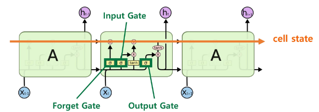
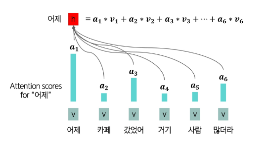
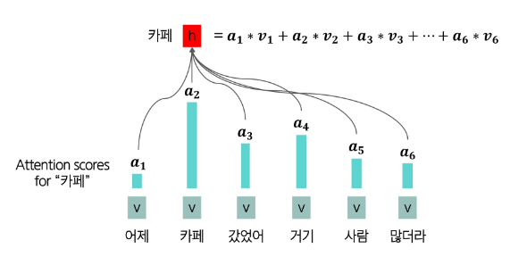
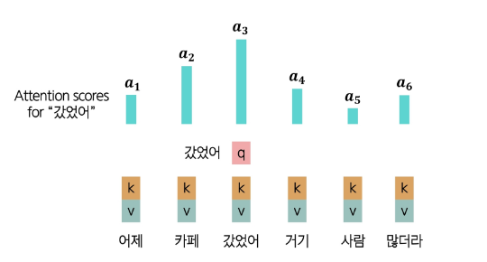

📚 목차
- [워드 임베딩과 순환신경망 기반 모델 (RNN & LSTM)](#워드-임베딩과-순환신경망-기반-모델rnn--lstm)
- [자연어 생성 모델 (Seq2Seq, Attention)](#자연어-생성-모델seq2seq-attention)
- [Transformer](#transformer)
- [사전 학습 기반 언어 모델 (Pre-trained Language Model, PLM)](#사전-학습-기반-언어-모델)


# 워드 임베딩과 순환신경망 기반 모델(RNN & LSTM)
## 워드 임베딩
인간의 언어는 Symbol(변경 불가능한 원시 타입의 값. 즉, 다른 값과 중복되지 않는 고유한 값)이라고 하는데, 컴퓨터는 인간처럼 심볼 바로 이해 못함

-> 심볼 정보를 숫자 정보로 변환 필요

-> 가장 간단한 방법이 '원-핫 인코딩'

### 원-핫 인코딩
- 규칙 기반 혹은 통계적 자연어처리 연구의 대다수는 단어를 원자적(쪼갤 수 없는) 기호로 취급함
  - ex. hotel, conference, walk 같은 단어들이 심볼이라고 함

- 벡터 공간 관점에서 보면, 이는 **한 원소만 1**이고 **나머지는 모두 0인** 벡터를 의미
  - `[0 0 0 0 0 0 0 0 0 0 0 1 0 0 0 0 0 0 0 0]`
  - 원-핫 벡터라고 함
  - 1이 있는 index가 나타내는 단어가 곧 해당 벡터가 나타내는 단어
  - 이를 **원-핫(one-hot) 표현**이라고 부르고, 단어를 원-핫 표현으로 바꾸는 과정을 **원-핫 인코딩(one-hot encoding)**이라고 함

- 차원 수(= 단어 사전 크기)는 대략 다음과 같음:
  - 음성 데이터(2만개)
  - Penn Treebank (PTB) 코퍼스(5만개)
  - big vocab(50만개)
  - Google 1T(1300만개)

### 원 핫 인코딩의 문제점 및 한계
1. **차원의 저주(Curse of Dimensionality)**  
   - 고차원의 희소 벡터를 다루기 위해선 많은 메모리가 필요함
    - 차원이 커질수록 공간 차지多, 연산량多, 비용↑ -> 컴퓨터 느려짐
   - 차원이 커질수록 데이터가 점점 더 희소(sparse)해져 활용이 어려움

2. **의미적 정보 부족**  
    - 비슷한 단어라도 유사한 벡터로 표현되지 않음  
    
    - 예시1
      - "은행"과 "금융"은 의미적으로 밀접하지만, 원-핫 인코딩에서는 전혀 무관한 벡터로 취급됨

    - 예시2: 웹 검색
      - 삼성 노트북 배터리 사이즈 == 삼성 노트북 배터리 용량 
      - 갤럭시 핸드폰 == 갤럭시 스마트폰
      - 인간은 두 검색어가 동일함을 알지만, 컴퓨터는 원-핫 벡터로 보면 동일한지 모름
        ```
        핸드폰   [0 0 0 0 0 0 0 0 0 0 0 1 0 0 0 0 0 0 0 0]^T
        스마트폰 [0 0 0 0 0 0 0 0 1 0 0 0 0 0 0 0 0 0 0 0] = 0
        ```

    - 두 벡터 간 관계를 볼 때는 벡터들을 곱해서(내적) 나온 숫자를 보고 유사도를 판단함(그 숫자가 얼마나 유사한지를 나타내는 스코어)
      - 스코어가 높을수록 유사하다고 판단함
      - 그러나 원-핫 벡터는 모든 단어들이 서로 곱했을 때 무조건 `0`이 나옴
      - 즉, 검색 쿼리 벡터와 문서 벡터들이 서로 **직교**하게 되어, 원-핫 벡터로는 유사도를 측정할 수 없음

### 워드 임베딩
- 주변 단어들 활용해보기
  - 현대 통계적 자연어처리에서 가장 성공적인 아이디어 중 하나로,
  - 앞뒤 문맥을 보고 해당 단어를 이해하는 것을 생각해보자
    - ex. 정부는 가계부채 문제를 해결하기 위해 **은행** 대출 규제를 강화했다.
    - ex. 인공지능 기반 챗봇이 **은행** 상담 서비스에 도입되었다.
    - -> 이런 주변 단어들로 **‘은행’의 의미**를 나타낼 수 있음
  
  - 사전을 보지 않고, 글을 많이 읽어서 문맥을 통해 단어의 의미를 파악하는 것과 같이
  - 컴퓨터도 문장을 많이 읽고, 읽는 와중에 각각 단어들의 의미(유용한 벡터의 표현)를 주변 문맥과의 관계를 통해 배우게 하자!

- 워드 임베딩
  - 단어를 단어들 사이의 의미적 관계를 포착할 수 있는 **밀집(dense)되고 연속적/분산적(distributed) 벡터 표현**으로 나타내는 방법
  
  - 원-핫 인코딩에서는 "은행"과 "금융"이 완전히 독립적인 벡터였지만, 워드 임베딩에서는 두 단어의 벡터가 **공간상 서로 가깝게 위치**하여 의미적 유사성을 반영할 수 있음

    
    - 더이상 원-핫이 아니기 때문에 벡터끼리 직교하지 않아, 곱했을 때 은행과 연관된 단어들은 높은 스코어가 나옴

### 대표적인 워드 임베딩 기법 — Word2Vec
Word2Vec은 2013년 **Google**에서 개발한 워드 임베딩 기법으로, 단어의 표현을 **간단한 인공 신경망**을 이용해 학습함

- Word2Vec의 아이디어
  - 각 단어와 **그 주변 단어들 간의 관계를 예측**하는 것

  - 두 가지 주요 알고리즘이 존재:
    1. **Skip-grams (SG)** 방식  
        - 중심 단어를 통해 주변 단어들을 예측하는 방법 
        - 단어의 위치(앞/뒤)에 크게 구애받지 않는다.

    2. **Continuous Bag of Words (CBOW)** 방식  
        - 주변 단어들을 통해 중심 단어를 예측하는 방법
        - 문맥 단어들의 집합으로 중심 단어를 맞춘다.
  
  - 두 알고리즘의 목적
    - 인간의 이해를 흉내낼 수 있는 벡터(임베딩)을 찾는 것

- **Skip-grams (SG): 중심 단어를 통해 주변 단어 예측하기**
  - 윈도우 크기(window size)
    - 중심 단어 주변 몇 개 단어를 문맥으로 볼 것인가?  
  - 예시 (윈도우 크기 = 2)
    ```
    문장: "... problems turning into banking crises as ..."
    중심 단어: "banking" (위치 t)
    주변 단어: { "turning", "into", "crises", "as" }
    ```
    
    - 문장에서 $w_t$ (t번째 단어)가 주어졌을 때, 그 주변에 $w_{t+1}$, $w_{t+2}$, $w_{t-1}$, $w_{t-2}$번째 단어들의 발생 확률에 대한 인사이트를 얻을 수 있음
    
    - 컴퓨터는 banking 단어를 그대로 받는 것이 아니라 banking의 임베딩 값이 주어지고, crises 또한 임베딩 값으로 받으므로 '두 단어의 임베딩을 이용해 확률을 구함'

    - 즉, 임베딩이 좋지 못하면 사람이 생각하는 확률(단어 빈도)과는 차이가 많이 남

- **Continuous Bag of Words (CBOW): 주변 단어를 통해 중심 단어 예측하기**

  
  - 이웃 단어들의 원-핫 벡터와 임베딩 정보를 입력값으로 넣고, 이를 기반으로 딥러닝 모델이 중심 단어를 예측해 출력함

  - SG는 반대로 중심 단어를 입력으로 넣고, 이를 기반으로 딥러닝 모델이 주변 단어를 예측해 출력함

  - Skip-Gram, CBOW 공통 특징
    - 처음에는 출력이 잘 안될 것임
    - 왜? 출력한다는 것은 50만개 단어들에 대한 확률분포를 뽑아내서 그 중 확률이 가장 높은 단어를 출력한다는 뜻인데
    - 처음에 학습하는 임베딩 값이 좋지 못하기 때문에 원하는 단어의 확률이 낮을 수 있음
    - 학습을 거듭할수록 주변 문맥이 들어가 중심 단어를 잘 예측할 수 있게됨

  - Continuous Bag of Words (CBOW) 목표
    - 주변 단어들의 집합이 주어졌을 때, 그 문맥과 함께 등장할 수 있는 단일 단어를 예측하는 것

  - Continuous Bag of Words (CBOW) 예시

    
    - 중심 단어: `brown`
    - 모든 단어는 중심 단어가 될 수 있음

    
    - 처음의 `The`, `quick`은 각각 50만차원의 원-핫 벡터임(input)
    - '인코더'에서 원-핫 벡터를 밀집(dense)되고 연속적/분산적(distributed) 벡터로 표현하여 바꿈(ex. 100차원)
    - '디코더'에서 원래 차원으로 다시 변환(ex. 100차원 -> 50만차원)
    - 즉, 인코더에서 입력값을 히든 벡터로 변환하고, 디코더에서 히든 벡터를 다시 원래 입력 차원과 같은 차원으로 변환함
    - 이때, 디코더에서 다시 변환되어 나온 50만차원은 **0과 1로 이루어진 벡터 아님XX**
    - 딥러닝 연산(Softmax 연산)을 통해 나온 확률이 들어있는 벡터
      - **50만개 단어에 대한 확률 분포** (이 중 확률이 가장 높은게 brown이길 바라면서 학습함)
      - Softmax(소프트맥스): 입력받은 값을 출력으로 0~1사이의 값으로 모두 정규화하며 출력 값들의 총합은 항상 1이 되는 특성을 가진 함수
    
    - 이 예시의 '정답'은 `brown`이 `1`인 50만차원 벡터
    
    - 정답 벡터(50만차원)와 예측 벡터(50만차원)의 차이를 Loss로 정의하여 차이가 적어지도록 반복 학습
  
  - Loss가 최소화될 때까지 반복 학습하다보면, 궁극적으로 양질의 히든 벡터(ex. 100차원)를 만들 수 있는 '인코더'가 만들어짐
    - 이 인코더를 **임베딩**이라고 함
    - 이 인코더에는 50만개 단어에 대해 각각 100차원의 실수값을 가지고 있음
    - $E \in \mathbb{R}^{500k \times 100}$
    - 즉, **인코더**는 각각 단어에 대해 100차원의 임베딩으로 변환한것 들을 저장하고 있는 거대한 벡터 데이터베이스

- Skip-Gram vs. CBOW
  | 모델 | 장점 | 한계 |
  |------|------|------|
  | **Skip-Gram** |적은 데이터에도 잘 동작한다.<br>희귀 단어나 구 표현에 강하다. |학습 속도가 느리다. |
  | **CBOW** |학습 속도가 빠르다.<br>자주 나오는 단어에 강하다. |희귀 단어 표현에 약하다. |

  
  - Skip-Gram은 중심 단어로 주변 문맥 예측할 때 주변 단어들을 한번에 예측하는게 아니라, 한 단어씩 예측함
    - 즉, Skip-Gram의 학습 데이터가 더 많다
    - CBOW와 동일한 문장을 가지고도, CBOW는 한번 학습하지만 Skip-Gram는 5번 학습함
    - Skip-Gram가 임베딩 더 정밀하게 배우는 대신 오래걸림
    
※ 우리는 각각 단어들에 대한 독립적인 임베딩 표현보다는, 단어로 연결되어있는 문장. 즉, Sequential Data를 처리하고 싶은 것

-> 이것은 단순 임베딩만으로 처리 안됨


## 순차적 데이터
### 순차적 데이터(Sequential Data)
**데이터가 입력되는 순서와 이 순서를 통해 입력되는 데이터들 사이의 관계**가 중요한 데이터

- 자연엔 수많은 **순차적 데이터(Sequential Data)** 가 존재함  

  
  - ex. 오디오, 텍스트, 비디오 등

- 순차적 데이터의 특징
  1. **순서가 중요하다**  
      - 데이터의 순서가 바뀌면 의미가 달라짐 
      - ex. “나는 너를 사랑해” ≠ “너는 나를 사랑해”

  2. **장기 의존성(Long-term dependency)**  
      - 멀리 떨어진 과거의 정보가 현재/미래에 영향을 줌
      - ex. “여러 개의 문 중 파란 문을 열고 안으로 들어가면, 너는 ( ? )을 찾게 될 거야.”
        - ? = 파란 방

  3. **가변 길이(Variable length)**  
      - 순차 데이터는 길이가 일정하지 않고, 단어 수도 제각각임

- 순차적 데이터를 처리하기 위한 딥러닝 아키텍쳐
  - 일반적인 모델(예: 선형 회귀, MLP 등)로는 순차적 데이터를 처리하기 어려움 
  - 따라서 **Sequential Models** 이 필요하다.  
    - ex. **RNN, LSTM, Transformer 등**

      


## RNN
- 전통적인 인공신경망
  - 전통적인 인공신경망(MLP, CNN 등)은 **고정된 길이의 입력**을 받음

    
    - ex. W1의 경우 input이 784차원, 히든레이어가 520차원으로 $W1 \in \mathbb{R}^{784 \times 520}$인 히든 레이어
    - 이렇게 사전에 학습 가능한 파라미터의 크기를 정하고 학습이 시작됨
    - 이미지는 28 by 28 픽셀로 이루어져 있어서 784개의 픽셀로 이루어진 압력이라고 약속 가능한데, 텍스트는 이게 안됨
    - one to one 그림
      - 고정된 입력이 들어갔을 때 고정된 출력이 나온다는 의미(레드 - 입력레이어, 초록 - 히든레이어, 블루 - 출력레이어)
    - 출력 또한 10차원으로 고정적(0부터 9까지 숫자 중 그림이 무슨 숫자 나타내는지 예측하는 문제이므로)
  - 따라서 **가변 길이의 데이터**를 처리하기에 적합하지 않음

### RNN (Recurrent Neural Network)
**가변 길이의 입력**을 받을 수 있고, **이전 입력을 기억**할 수 있기 때문에, **순차적 데이터 처리에 적합한 아키텍처**임

- 예시
  - 영화 리뷰 긍정/부정 예측 (감성분석)
    - 영화 리뷰의 경우 몇글자가 들어올지 알 수 없음 = 가변적
    - 입력 레이어와 히든 레이어가 가변적이고 출력 레이어가 고정적인 상황

      
  
  - 이미지 받아서 텍스트 출력
    - 하나의 이미지를 받으므로 입력은 고정적이지만, 출력은 텍스트 생성해야하므로 가변적
    - 입력 레이어가 고정적이고 히든 레이어와 출력 레이어가 가변적인 상황

      
  
  - 기계번역, 요약, 챗봇
    - 입력과 출력 모두 가변적
    - 입력, 히든, 출력 레이어가 모두 가변적인 상황  

      

- RNN 아키텍처 설명
  - 전통적인 신경망(MLP, CNN 등)과 달리, RNN은 **이전 시점의 정보를 담는 hidden state**를 가짐
  - 입력 시퀀스 벡터 **x**를 처리할 때, 각 시점마다 **recurrence 수식**을 적용해 hidden state를 업데이트함
  
  - 수식: $h_t = f_W(h_{t-1}, x_t)$

      
    - 입력 벡터 : $x_t$ (time step별 입력)  
    - $t$ (time step): 시퀀스 데이터에서 단어들이 순차적으로 모델에 들어갈 때 몇번째 단어인지 표현함

  - 이전 시점의 정보와 입력 벡터(새로운 단어)를 상호작용시켜 현재 시점 정보(새로운 정보)를 반복적으로 만들어냄

    
    - 각 시점마다 입력 $x_t$가 주어지고, 이전 시점의 hidden state $h_{t-1}$가 다음 시점으로 전달됨
    - 동일한 RNN 셀 $f_w$가 각 시점마다 공유된 가중치 $W$로 작동
    - $W_{xh}$ : 입력 $x_t$를 은닉 상태로 변환하는 가중치
    - $W_{hh}$ : 이전 은닉 상태 $h_{t-1}$을 다음 상태로 전달하는 가중치
    - $tanh$ : 비선형 활성화 함수
    - 수식이 **모든 시점 𝑡에서 동일한 $W_{xh}$, $W_{hh}$를 사용**한다는 점이 RNN의 핵심 특징
    - $W_{hy}$ : 은닉 상태를 출력 공간으로 변환하는 가중치
    - 각 $y_t$는 시점별 손실 $L_t$를 계산하는 데 사용되고, 모든 손실이 모여 최종 손실 $L$로 집계됨 
  
  - 위 그림은 순전파만 나타냈지만, 학습 시에는 오른쪽에서 왼쪽으로 시간을 따라 역전파가 수행됨
    - 각 시점의 오차가 이전 시점으로 전달되어 $W_{xh}$, $W_{hh}$가 업데이트 됨
  
  - 파라미터 크기(차원)
    - 임베딩 레이어 없이 원-핫 벡터 입력으로 넣는다고 가정
    
    - $x_t \in \mathbb{I}^{50k}$ 
      - `I`: 0과 1로 이루어진 원-핫 벡터(Indicator 벡터)
      - 입력은 5만 차원이라고 가정
    
    - $h_t \in \mathbb{R}^{100}$
      - $h_t$, $h_{t-1}$은 실수값으로 이루어짐
      - 히든 벡터 차원은 정하기 나름. 단, 입력 차원보다 훨씬 적은 차원으로 정하기
    
    - $W_{xh} \in \mathbb{R}^{50k \times 100}$
      - 5만차원을 100차원으로 바꿔야 함
      - $h_t$ (100차원) = . . . + $W_{xh}$ (50k by 100) * $x_t$ (5만차원)
    
    - $W_{hh} \in \mathbb{R}^{100 \times 100}$
      - 100차원을 100차원으로 바꿔야 함
      - $h_t$ (100차원) = $W_{hh}$ (100 by 100) * $h_{t-1}$ (100차원) + . . .
    
    - $h_t$까지 뽑아내는 과정을 '인코더'라고 함
      - 만약 감성분석하여 긍정/부정 예측한다 했을 때, 100차원의 실수 벡터를 가지고는 아무것도 할 수 없음(해석 불가)
      - 우리는 긍정/부정에 대한 2차원 확률 분포를 뽑아내야 함
    
    - 인코더 이후의 레이어 $y_t = W_{hy}h_t$를 'Classification layer'라고 함
      - 일반적으로 확률값으로 바꿔주기 위해 softmax 많이 쓰기 때문에 'softmax layer'라고도 함 ($y_t = softmax(W_{hy}h_t)$)
    
    - $W_{hy} \in \mathbb{R}^{100 \times 2}$
      - 100차원을 2차원으로 바꿔야 함
      - $y_t$ (2차원) = $W_{hy}$ (100 by 2) $h_t$ (100차원)
    
  - 주의
    - RNN은 각 시점 $t$마다 동일한 가중치(weight)를 사용하기 때문에, 깊은 feedforward 신경망처럼 시점마다 다른 weight를 두는 것보다 파라미터 수가 훨씬 적어 **파라미터 효율적**이라 할 수 있음
    - 그러나 동일한 가중치를 반복 사용한다는 것은 "시간이 지나도 변하지 않는 하나의 표현 방식으로 모든 시점을 설명해야 한다"는 뜻
    - 파라미터 효율적이지만, 장기 의존성을 잃기 쉽기 때문에 주의해야 함

- RNN의 특징
  - RNN은 **한 번에 하나의 요소를 처리**하고, 정보를 앞으로 전달함
  - **펼쳐서 보면**, RNN은 각 층이 하나의 시점을 나타내는 **깊은 신경망처럼 보임**  
  - RNN은 hidden state를 유지하면서 **가변 길이 데이터를 처리**할 수 있음
  - RNN의 출력은 **과거 입력에 영향을 받는다**는 점에서 feedforward 신경망과 다름

- RNN의 한계: 기울기 소실(vanishing gradient) 문제
  - 기울기 소실
    - 역전파(backpropagation) 시 앞쪽 층의 기울기가 0에 가까워져 **장기 의존성 학습이 어려워지는 현상**
  
  - 왜 발생할까?
    1. 역전파 과정에서 **작은 값들이 계속 곱해지기 때문**
    2. 과거 시점에서 온 오차 신호는 감쇠되어 **더 작은 기울기**를 갖게됨
    3. 그 결과, 파라미터들이 장기 의존성을 학습하지 못하고 **단기 의존성만 포착**하게됨

        
        - 현재 그림은 레이어가 1개
        - 깊은 레이어가 있진 않지만, 시계열 데이터로 time step이 여러번 쌓여 가로 방향으로의 딥러닝이라 볼 수 있음
        - $x_1$ 단어에 근접한 히든 벡터 $h_1$, $h_2$ 는 정보가 많이 남아있는데, $x_2$, $x_3$ 단어와 멀리 떨어져있는 히든 벡터 $h_T$에서는 정보가 소실되어 있음

      
## LSTM
### LSTMs
**기울기 소실 문제**를 해결하기 위해, 1997년에 제안된 RNN의 한 종류

- LSTMs의 특징
  - 시점 $t$ 에서 RNN은 길이가 $n$ 인 벡터 **hidden state $h_t$** 와 **cell state $c_t$** 를 가짐  
    - Hidden state는 **short-term information**을 저장  
    - Cell state는 **long-term information**을 저장 
  
  - LSTMs는 cell state에서 정보를 **읽고(read)**, **지우고(erase)**, **기록(write)** 할 수 있음

- RNNs vs LSTMs

  
  - LSTM은 오랫동안 정보 저장하기 위해 Cell state가 존재하는데, 어떤 정보를 저장할지, 지울지, 읽을지 '의사결정' 해야함
    - 의사결정 하는 부분이 시그모이드 함수로 정의되어 있는 Neural Network(신경망)

  - RNN과 LSTM이 Neural Network인데, 뉴럴넷 안에 뉴럴넷이 있는 형태
    - 파라미터가 선형적인 변환을 하고, 비선형 활성화 함수가 연결되어 있으면 뉴럴넷이라고 함 ($h_t = tanh(W_{hh}h_{t-1} + W_{xh}x_t)$)
    - LSTM에는 $tanh(W_{hh}h_{t-1} + W_{xh}x_t)$ 말고도 $sigmoid(W_Ah_{t-1} + W_Bx_t)$ 뉴럴넷이 있다는 것

- LSTMs의 구조
  - 3가지 게이트를 통해 어떤 정보를 **지우고, 쓰고, 읽을지** 결정
    | 게이트 | 역할 |
    |--------|------|
    | **Forget gate** | 이전 cell state에서 **무엇을 버리고 무엇을 유지할지** 결정 |
    | **Input gate** | 새 정보 중 **얼마나 cell state에 쓸지** 결정 |
    | **Output gate** | cell state 중 **얼마나 hidden state로 내보낼지** 결정 |

    

  - 게이트 동작
    - 매 시점마다 게이트의 각 요소는 **열림(1)**, **닫힘(0)**, 혹은 **그 사이의 값**으로 설정됨 
    - 게이트는 **동적으로 계산**되며, 현재 입력과 hidden state 등 문맥에 따라 값이 정해짐
  
  - Forget gate
    - 이전 cell state에서 **무엇을 버리고 무엇을 유지할지** 결정

      
      - $f_t$는 $h_{t-1}$ 과 $x_t$를 상호작용하여 선형변환($W_f$) 후 시그모이드 통과($\sigma$)했기 때문에 0 ~ 1 사이의 값을 가짐
  
  - Input gate
    - 새 정보 중 **얼마나 cell state에 쓸지** 결정
      
      
      - $i_t$는 $h_{t-1}$ 과 $x_t$를 상호작용하여 선형변환($W_i$) 후 시그모이드 통과($\sigma$)했기 때문에 0 ~ 1 사이의 값을 가짐
      - $\tilde{C_t}$는 RNN의 $h_t$와 같은 표현(틸다 $C_t$)
        - $h_t$는 아니고, '임시적인' 히든 정보
    
  - New cell content
    - cell에 기록될 새로운 후보
      
      
      - $C_{t-1}$ : 장기 메모리에 있던 정보
      - $\tilde{C_t}$ : 현재 시점의 임시 정보

  - Output gate
    - cell state 중 **얼마나 hidden state로 내보낼지** 결정

      
      - 현재 time step에 사용할 것만 뽑아쓰기 위함
      - LSTM의 hidden state 크기(hidden size)가 100이라면 $h_t$, $C_t$, $o_t$ 모두 100차원 벡터이고, 위 수식을 연산하면

        
      - 각 차원별로 '출력 게이트가 열리는 정도'를 조절할 수 있음
      - 즉, 100차원 중 일부는 많이 열리고, 일부는 덜 열려서 cell state 중 "얼마나, 어떤 정보"를 hidden state로 내보낼지 결정
  
  - 만약 Forget gate가 0에 가까운 값, Input gate가 1에 가까운 값을 뽑아냈을 때
    - $C_t = f_t * C_{t-1} + i_t * \tilde{C_t}$
    - $f_t$ (0에 가까움)와 $C_{t-1}$를 곱하므로 $f_t * C_{t-1}$가 0에 가까워짐
      - 즉, 장기 메모리에 있던 정보(과거 정보)를 많이 잊게 되는 것
      - 또, $i_t$ (1에 가까움)와 곱해지는 현재 시점 정보($\tilde{C_t}$)는 많이 기억하려는 것
  
  - 만약 Forget gate가 1에 가까운 값, Input gate가 0에 가까운 값을 뽑아냈다면
    - 이전 정보를 많이 기억하고, 현재 내용은 거의 사용하지 말자는 의미
    - (output gate보다 forget, input gate가 상대적으로 더 중요함!!)

  - $f_t * C_{t-1}$와 $i_t * \tilde{C_t}$는 스칼라 값XX
    - `*`가 내적곱이 아니라, 아다마르곱(element-wise product)
    - element-wise는 '같은 차원'의 동일 위치 상에 있는 원소를 서로 연산하는 것

      
    
    - 따라서, $C_{t-1}$, $\tilde{C_t}$가 100차원이면 $f_t$, $i_t$도 100차원

5분31초 2차시 48p
# 자연어 생성 모델(Seq2Seq, Attention)
## 언어모델
인간의 두뇌가 자연어를 생성하는 능력을 모방한 모델로, **단어 시퀀스 전체에 확률을 부여**하여 문장의 자연스러움을 측정함

- 즉, 어떤 문장(단어들의 나열)이 "자연스럽게 보일 확률"을 계산하는 모델
  - ex. "I love you" -> 높은 확률 / "You love I" -> 낮은 확률

-  문장 확률의 표현
  - 언어모델은 모든 가능한 문장에 대한 확률 분포를 가짐
  - 한 문장의 확률은 **각 단어의 조건부 확률들의 곱**으로 표현할 수 있음
  - "각 단어의 조건부 확률"은 문맥이 있을 때, "문맥 뒤에 해당 단어가 있을 확률"을 뜻함

    

- 정리
  - 언어 모델은 문맥이 주어졌을 때, 문맥 다음에 발생할 단어에 대한 확률 분포를 알 수 있고(ex. 5만개 단어)
  - 그 단어들(ex. 5만개 단어) 중 어떤 단어의 확률이 가장 높은지 알 수 있음
  - 확률이 가장 높은 단어를 생성하겠다(말하겠다)는 것을 반복 수행한다면
  - GPT에서 응답 받는 것처럼 단어들이 생성되면서 문장이 만들어지는 현상이 발생함

- 일상 속 언어모델
  - 휴대폰 키보드 자동완성
    - 작은 디바이스에 들어가는 언어 모델은 좋은 모델이 들어가기 힘들어서 이상한 단어 추천될 때 많음
  
  - 웹 검색
    - 웹에서의 검색어 추천은 언어모델이 기업의 클라우드 서버에 있기 때문에 거대하고 좋은 모델 사용 가능

### N-gram 언어모델
대표적인 언어 모델

- n-gram
  - 연속된 n개의 단어 묶음을 말함
    - **uni**grams: “The”, “students”, “opened”, “their”  
    - **bi**grams: “The students”, “students opened”, “opened their”  
    - **tri**grams: “The students opened”, “students opened their”  
    - **four**-grams: “The students opened their”

  - 다양한 n-gram이 얼마나 자주 등장하는지 통계를 수집하고,  
  이를 활용해 **다음 단어를 예측**함

  - n-gram 필요한 이유
    - 단어의 발생 빈도를 가지고 문장, 문맥의 의미와 관계를 파악할건데, RNN과 같은 지능적인 알고리즘이 없으면 파악하기 쉽지 않음
    
    - 딥러닝(ex. RNN) 사용 이전, 통계적 기법을 활용하여 '단어의 개수를 세서 문맥의 의미를 파악'하여 문맥 의미를 이해하기 위함

- 예시: 4-gram 언어모델
  - "as the proctor started the clock, the **students opened their** ______"  
  - **직전 3개의 단어**만 반영됨
  - $P(w \mid \text{students opened their}) = \frac{count(\text{students opened their w})} {count(\text{students opened their})}$

  - 말뭉치 정보 예시
    - “students opened their” -> 1000번 등장  
    - “students opened their books” -> 400번 등장 ($P(\text{books} \mid \text{students opened their}) = 0.4$)  
    - “students opened their exams” -> 100번 등장 ($P(\text{exams} \mid \text{students opened their}) = 0.1$)
  
  - 그런데 문맥의 앞부분을 잘라내는 n-gram 언어모델은 정밀하게 배우지 못함

  - 자르지 않고 n을 늘리면?
    - 4-gram만 해도 특정 문맥(“students opened their”)이 1000번 등장했지만,
    - n을 5-gram, 6-gram으로 늘릴수록 그 문맥 전체가 말뭉치에 거의 등장하지 않게 됨
    - 즉, 등장 횟수가 급격히 줄어들면서 확률을 안정적으로 추정하기 어려워짐

- 언어모델 사용 예시: Statistical Machine Translation
  - 1990년대~2010년대 초까지 **통계적 기계 번역(SMT)** 이 주로 사용됨  
  - 예시: 한국어 → 영어
    - 한국어 문장 x가 주어졌을 떄, 가장 잘 맞는 영어 문장 y를 찾아야 함
      - $\arg\max_y P(y \mid x)$
    - Bayes Rule을 적용하여 식을 두 부분으로 쪼개 **번역 모델과 언어 모델**로 나누는 방법을 사용함
      - $\arg\max_y P(y \mid x) = \arg\max_y P(x \mid y) P(y)$

        

  - SMT의 한계
    - 구조적 복잡성
    - 많은 수작업 필요
    - 언어별 자원 구축 필요
    - -> 유지 및 확장이 어려움  

  - 이후 기계 번역 연구는 **Neural Machine Translation (NMT)** 으로 발전하게 됨


## Seq2Seq
### Neural Machine Translation
**인공 신경망을 이용해 기계 번역을 수행**하는 방법  

- 사용되는 구조: **sequence-to-sequence (Seq2Seq)**  
  - **두 개의 RNNs**으로 구성  

- Translation이 어려운 이유
  - 번역은 **입력과 출력 시퀀스 길이가 다를 수 있다.**
  - 예:  
    - 영어: the black cat drank milk (5개 단어)  
    - 프랑스어: le chat noir a bu du lait (7개 단어)  
  - 따라서 NMT에서는 **길이가 다른 시퀀스 간의 매핑**을 처리할 수 있어야 함

- Seq2Seq의 아이디어
  - **2개의 LSTM**을 사용
    1. Encoder: 입력 시퀀스를 한 time step씩 순차적으로 읽어, 고정된 차원의 큰 벡터 표현 얻음 (1번 LSTM)
    2. Decoder: 그 벡터를 바탕으로 출력 시퀀스를 순차적으로 생성 (2번 LSTM)

### Seq2Seq Architecture
Seq2Seq는 **Encoder**와 **Decoder**로 이루어짐
- **Encoder**: 입력 문장에 담긴 정보를 인코딩  
  - 문장은 시퀀스이므로, 각 단어는 RNN(LSTM/GRU 등)에 의해 차례로 처리되고, 각 시점의 은닉 상태(히든 스테이트)가 생성됨(h1 ~ h7)
  - 인코더에서 가장 쉽게 문장을 요약하는 방법은 마지막 히든 벡터를 사용하는 것
- **Decoder**: 인코딩된 정보를 조건으로 하여 **타겟 문장(출력)** 을 생성
  - 인코더에서 나온 **문맥 벡터(h7)**를 조건(condition)으로 받아들여, 출력 문장을 생성함
  - 이때 **<SOS> (시작 토큰)**을 입력으로 주면, 디코더는 그 다음 단어를 예측함
  - Auto-Regressive 구조
    - 디코더는 매 시점마다 이전에 생성된 단어를 다시 입력으로 사용하여 다음 단어를 생성
    - 이런 방식을 Auto-regressive (자기 회귀) 구조라고 함

  
  - `<SOS>` : 문장이 시작함을 알리는 스페셜 토큰
  - `<EOS>` : 문장이 끝남을 알리는 스페셜 토큰
  - 스페셜 토큰도 원-핫 벡터를 가지고 있음

- Seq2Seq의 다양한 적용
  - Seq2Seq 구조는 기계번역 외에도 **다양한 태스크에 적용** 가능
    | 태스크 | 설명 |
    |:--|:--|
    | 🧾 **요약** | 긴 문서를 읽고 짧은 문장으로 요약된 텍스트를 출력 |
    | 💬 **대화** | 사용자의 발화에 대해 맥락에 맞는 대답(출력 텍스트)을 생성 |
    | 💻 **코드 생성** | 자연어 설명이나 명령을 입력받아 대응하는 **프로그래밍 코드 또는 쿼리**를 출력 |

### Seq2Seq 학습 수행
- Seq2Seq 모델은 인코더와 디코더가 **하나의 통합 네트워크**로 연결되어 있음
- 디코더에서 발생한 오차는 역전파 과정을 통해 인코더까지 전달되어, 전체 네트워크가 **End-to-End (종단 간 학습)로 동시에 최적화** 됨

  
  - End-to-End Learning 특징
    - 데이터가 많을수록 모델의 학습이 잘 될 여지가 있음

- Seq2Seq 학습 수행 (Teacher Forcing)
  - 학습 초반에는 모델의 예측 능력이 떨어지므로 학습이 불안정할 수 있음
    - 데이터가 많지 않기 때문

  - Teacher Forcing
    - 모델이 스스로 예측한 단어 대신, **정답 단어를 디코더 입력으로 강제로 넣어줌**으로써 훨씬 **안정적이고 빠르게 학습**하는 방법

      
      - 문장을 생성하는 훈련이 아닌,
      - ex. 'le' (정답)를 주고 'chat'을 예측하는 학습을 함
      - ex. 'le', 'chat' (정답)를 주고 'noir'를 예측하는 학습을 함
      - 만약 'le'를 주지않고 학습을 시킨다면? 처음에 'le'가 만들어지지 않고 다른 단어가 만들어졌을 때 뒷 부분까지 연쇄적으로 실수하게 되어 제대로된 번역을 할 수 없기 때문

### Seq2Seq의 토큰 출력 방법
- Greedy Inference
  - 토큰을 출력하는 방법 중 하나로, 각 단계에서 **가장 확률이 높은 단어를 선택** 함

  - 한계
    - **되돌리기 불가능**
    - 예시
      ```
      le ____ → le 'chien' ____ → ...
      ('오답'이더라도 이전 단계로 돌아갈 수 없음)
      ```
  
- Beam Search
  - Beam Search 절차

    
    1. 매 단계마다 **k개의 가장 유망한 후보 유지**
        - 첫 시점: `<SOS>` 다음으로 올 단어를 50,000개 중에서 고름
        - 확률이 가장 높은 상위 2개를 선택 (예: le, la)

    2. 후보가 `<EOS>`에 도달하면, **완성된 문장으로 리스트에 추가**
        - 'le' 다음 가능한 50,000개 단어에 대해 예측 -> chat, chien, ..., top 2 선택
        - la 다음 가능한 단어에 대해서도 top 2 선택
        - 현재 후보: `[le, chat], [le, chien], [la, maison], [la, fille]`
        - 여기서 **top 2 (k=2)**만 남김
        - 이때 **전체 5만 개 단어 중 두 개 조합 (2-gram)을 모두 평가**

    3. `<EOS>` 문장이 충분히 모이면 **탐색 종료**  
        - `[le, chat] 다음 noir → a → bu → du → lait → <EOS>`
        - 문장이 완성됨 → 리스트에 저장

    4. 각 후보의 점수를 **로그 확률의 합**으로 계산해 최종 선택
        - `log P(le) + log P(chat | le) + log P(noir | le, chat) + ...  `
    
    - 그림의 초록색 노드는 `<EOS>`로 끝나는 완성된 문장 후보
    - 빨간색 노드는 확률이 낮아 Beam에서 제거된 경로
    

## Attention
- Seq2Seq의 한계: The Bottleneck Problem
  - Bottleneck problem
    - 인코더는 입력 문장 전체를 하나의 벡터로 요약하는데, **마지막 hidden state** 에 문장의 모든 의미 정보가 담김
    - 즉, 고정 길이 벡터 하나에 모든 문장의 의미를 압축하다 보니 **정보 손실이 발생**할 수 있음
    - 이러한 현상을 **bottleneck problem**이라고 함

      

- Attention의 인사이트
  - **Attention**은 디코더가 단어를 생성할 때, 인코더 **전체 hidden state 중 필요한 부분을 직접 참조**할 수 있도록 함
  - 즉, 각 타임스텝마다 “어떤 단어/구절에 집중할지”를 **가중치로 계산**해, bottleneck 문제를 완화시킴

- 예시: 검색
  - 디코더에 있는 time step의 히든 벡터를 $S$라고 해보자

    
    - 첫번째 time step에 있는 히든 벡터가 $S_1$
    - $S_1 = tanh(W_Ah_7 + W_B<SOS>)$
    - 이게 일종의 검색어
    - 이것과 관련있는 단어를 찾기 위해 인코더에 있는 모든 time step과 'Alignment Scoring'을 함
    - $h1$과 $S1$의 차원 크기가 같다는 전제 하에, Dot Product 시행 -> $h_1^TS_1$ , $h_2^TS_1$ 하면 유사도 점수 나옴
    - 이걸 softmax 함수 넣으면 확률 분포 나옴($\alpha1, \alpha2, ...$ -> 그림의 주황색 그래프!) -> Attention 값
    - Attention 값을 가지고 히든 벡터(h1 ~ h7) 가중치 합을 하면 $a_1$이라는 Attention output값이 나옴
    - 그럼 $a_1$이 뭐냐?
    - $S_1$이 검색어로 쓰였을 때, 검색 결과가 $a_1$으로 나온 것
    - 'the'의 정보가 많이 들어간 것 같다고 판단 -> 'the'가 번역된 'le'를 더 잘 찾아낼 수 있음

    
    - 디코더의 time step마다 반복

    
    
  
  - 정리

    

- Alignment Scoring
  - 디코더가 어느 인코더의 히든 상태를 얼마나 참고할지 정하는 점수 계산 방법
    1. Dot Product 방식
    2. General 방식
    3. Concat 방식 (Bahdanau Attention)

### Attention의 효과
- Attention mechanism 장점
  1. **NMT 성능 향상**  
      - 디코더가 전체 문장 대신 필요한 부분에만 집중할 수 있음

  2. **Bottleneck Problem 해결**  
      - 디코더가 인코더의 모든 hidden states에 직접 접근 가능

  3. **Vanishing Gradient Problem 완화**  
      - 멀리 떨어진 단어도 직접 연결할 수 있게 해줌 

- Attention 사용O vs 사용X
  
  
  - X축: 주어진 문장 길이 / Y축: 번역 스코어(클 수록 번역 good)
  - search 붙은 RNN이 Attention 사용한 것
  - 50, 30 : 히든 벡터 사이즈
  - Attention을 쓰고, 파라미터가 50인 모델은 문장이 길어져도 번역 성능이 유지됨
  - Attention 안쓰면 문장 길어졌을 때 성능이 확 떨어짐

    

- 해석 가능성 (Interpretability)
  - Attention 분포를 보면, 디코더가 단어를 생성할 때 **입력 문장의 어느 부분에 집중했는지**를 확인할 수 있음  
  - 즉, 모델의 내부적인 참고 근거를 사람이 파악할 수 있음
    - 모델의 의사결정 과정을 **해석할 수 있는 단서** 제공

    

- 정렬 (Alignment)
  - 기존 기계번역에서는 **단어 alignment 모델을 별도로 학습** 해야했음  
  - 하지만 Attention은 디코더가 필요한 입력 단어에 자동으로 집중하기 때문에, **단어 간의 매핑 관계를 자연스럽게 학습**할 수 있음

### Attention: Query와 Values
Seq2Seq에서 Attention을 사용할 때, 각 **디코더 hidden state**와 **모든 인코더 hidden states** 간의 관계를 **Query–Values 관계**로 볼 수 있음

- 이 관점에서 Attention 과정 요약
  1. **Query와 Values 사이 유사도 점수(score)** 계산  
      - ex. dot-product, multiplication, additive 등 

         
  2. Softmax로 확률 분포(attention distribution) 계산  
  3. 분포를 기반으로 **values를 가중합**하여  
    - **context vector (attention output)** 생성


# Transformer
## Self-Attention
- RNN이 꼭 필요할까?
  - RNN은 hidden state를 통해 순차적으로 정보를 전달하며 **의존성**을 학습함
  - 반면 Attention은 **필요한 시점에 입력 전체에서 직접 정보**를 전달함
  - "RNN이 하던 정보 전달을 Attention이 더 효율적으로 수행할 수 있다면, 굳이 recurrence가 필요할까?" 에서 시작함
    - '순서 정보가 중요하다는 것'과 '순서대로 읽어야 한다는 것'은 별개의 문제

- RNN의 한계점
  1. 장기 의존성 (Long-term Dependency)
      - RNN은 왼쪽에서 오른쪽으로 순차 전개되어, 먼 단어 쌍이 상호작용 하려면 시퀀스 길이 만큼의 단계를 거쳐야 함
      - 따라서, 길어진 단계만큼 기울기 소실 혹은 폭발 문제가 발생해 장기 의존성을 학습하기 어려움
      - 또한, RNN은 입력된 선형 순서를 강하게 반영하기 때문에 언어의 **비선형적 의존성**을 잘 포착하지 못함  
      - ex. "그 **책**은 오랫동안 방치되어 먼지가 많이 쌓인 탓에... 매우 **더러웠다.**" 
      - → “책”과 “더러웠다”의 관계가 멀리 떨어져 있음

        

  2. 병렬화 어려움
      - Forward/Backward 모두 **시퀀스 길이만큼 단계적 연산 필요**
      - 순차적 연산으로 인해 병렬화가 어렵고 GPU 효율이 낮음 
      - 따라서 **대규모 데이터 학습에 비효율적**

        

- 그렇다면 Attention은 어떨까?
  - Attention은 각 단어 표현을 **Query**로 두고, **Value 집합**으로부터 필요한 정보를 직접 불러와 결합함 
  - 이러한 Attention 메커니즘을 Encoder–Decoder 간이 아닌, **하나의 문장 내에서 적용**하면? -> **Self-Attention**.

- Self-Attention의 장점
  1. **순차 연산 불필요** → 시퀀스 길이에 따른 연산 증가 없음
  2. **모든 단어 간 직접 상호작용** → 최대 거리 O(1)
  3. 병렬 처리 가능 → GPU 효율 극대화

      
      - 모든 문장의 시퀀스에 있는 정보를 병렬적으로 한번에 인코딩

### Seq2Seq vs Self-Attention
- **Seq2Seq Attention**: 입력 문장의 단어들 ↔ 출력 문장의 단어들 간 연결
  - $Attention(입력 문장 내의 단어들 | 출력 문장 내의 각 단어 w)$

    
- **Self-Attention**: 한 문장 내의 단어들 간 상호작용 
  - $Attention(문장 내의 다른 단어들 | 문장 내의 각 단어 w)$

     

### Self-Attention - Key, Query, Value
Attention에서 각 단어 $i$를 표현하는 Query와 Value 벡터가 있었듯이, Self-Attention에서는 각 단어 $i$를 표현하는 **Query, Key, Value**가 존재함

1. 각 단어를 Query, Key, Value 벡터로 변환
    - Query 벡터
      - 단어 $i$가 다른 단어로부터 어떤 정보를 찾을지를 정의하는 벡터
      - $q_i = Qx_i(queries)$
    
    - Key 벡터
      - 단어 $i$가 자신이 가진 정보의 특성을 표현하는 벡터
      - $k_i = Kx_i(keys)$
    - Value 벡터
      - 실제로 참조되는 정보 내용을 담고 있는 벡터
      - $v_i = Vx_i(values)$
    
2. Querym, Keys 간의 유사도를 계산해, softmax로 확률분포를 구함
    
    

3. 각 단어의 출력을 Values의 가중합으로 계산

    

10분









97p


## 1. Self-Attention의 한계 해결

---

### ❖ 한계 해결 ① 순서 정보 부재 → **Positional Encoding**

- Self-Attention은 단어 간 순서를 고려하지 않기 때문에,  
  **Positional Encoding**을 통해 각 단어의 위치 정보를 추가한다.  
- 각 단어 위치 *i*를 나타내는 **위치 벡터**를 정의하고,  
  이를 단어 임베딩 벡터에 더하여 **최종 입력으로 사용**한다.

#### ▪ 두 가지 주요 방식
1. **Sinusoidal Position Encoding**
   - 서로 다른 주기의 **사인/코사인 함수**를 결합해 위치 벡터를 생성.
2. **Learned Absolute Position Embedding**
   - 위치 벡터를 **학습 가능한 파라미터**로 두고, 데이터에 맞게 최적화.

---

### ❖ 한계 해결 ② 비선형성 부족 → **Feed-Forward Network 추가**

- Self-Attention의 계산은 선형 가중합이므로  
  **복잡한 패턴이나 비선형 표현 학습이 어렵다.**
- 이를 보완하기 위해 각 단어의 출력 벡터에  
  **Feed-Forward Network (Fully Connected + ReLU 등)** 을 적용.  
  → 표현을 **더 깊고 비선형적으로 확장**할 수 있다.

---

### ❖ 한계 해결 ③ 미래 참조 문제 → **Masked Self-Attention**

- Self-Attention은 모든 단어(미래 단어 포함)를 동시에 참조하므로,  
  **순차적 생성(task)**에서는 부적합하다.  
- 해결책: Attention score 계산 시  
  **미래 단어에 해당하는 항목을 -∞로 설정**하여  
  Softmax 계산 시 해당 단어가 반영되지 않게 함.

---

### ❖ Self-Attention 정리

- Self-Attention은 문장 내 모든 단어가 **서로 직접 상호작용**하여  
  1️⃣ 장거리 의존성을 효율적으로 포착하고,  
  2️⃣ 병렬 처리가 가능한 구조를 제공한다.

#### ▪ 한계 해결 요약
| 문제 | 해결 방법 |
|------|------------|
| 순서 정보 부재 | Positional Encoding |
| 비선형성 부족 | Feed-Forward Network 추가 |
| 미래 참조 문제 | Masked Self-Attention |

## 2. Transformer

## 2. Transformer

---

### Attention is All You Need
- Transformer는 2017년 Google의 “Attention Is All You Need” 논문에서 처음 제안된 아키텍처로,  
  **Self-Attention**을 핵심 메커니즘으로 하는 신경망 구조이다.

---

### Transformer
- Transformer는 **encoder–decoder 구조**로 설계된 신경망 모델이다.  
  - **encoder**: 입력 문장을 받아 의미적 표현으로 변환한다.  
  - **decoder**: 인코더의 표현과 지금까지 생성한 단어들을 입력받아 다음 단어를 예측한다.  
- 이 중 **decoder**가 언어 모델과 같은 방식으로 동작한다.

---

### Multi-Headed Attention
- 문장에서 같은 단어라도 여러 이유(문법적 관계, 의미적 맥락 등)로  
  **다른 단어에 주목할 수 있다.**  
- 단일 Self-Attention Head는 한 가지 관점에서만 단어 관계를 파악할 수 있다.  
- 따라서 여러 **Attention Head**를 두어 다양한 관점에서 동시에 정보를 파악한다.  
  - Attention Head 1: 단어의 문맥적 관계  
  - Attention Head 2: 단어의 시제에 대한 Attention  
  - Attention Head 3: 명사에 대한 Attention  

---

### Scaled Dot Product
- Query와 Key의 차원이 커질수록, 두 벡터의 내적 값도 커진다.  
- 값이 너무 크면 softmax 출력이 지나치게 치우쳐 **gradient vanishing** 문제가 생길 수 있다.  
- 따라서 내적값을 그대로 사용하지 않고, **스케일 조정**을 수행한다.

\[
output_i = softmax(QK^T X^T) * V_l
\]

- 이렇게 하면 값이 안정적으로 분포되어 학습이 빠르고 안정적으로 진행된다.

\[
output_i = softmax\left(\frac{QK^T X^T}{\sqrt{d/h}}\right) * V_l
\]

---

### Residual Connection
- 깊은 신경망은 층이 깊어질수록 학습이 어려워진다.  
  (Gradient vanishing / exploding)  
- 단순히 layer의 출력만 사용할 경우 정보가 소실되므로,  
  기존 입력과의 차이만 학습하도록 하는 **residual connection**을 사용한다.  

---

### Layer Normalization
- 층이 깊어질수록 hidden vector 값이 커졌다 작아졌다 하면서 학습이 불안정해진다.  
- **Layer Normalization**은 각 layer 단위에서 hidden vector 값을 정규화하여  
  **안정적이고 빠른 학습**을 돕는다.

---

### Decoder
- Transformer의 **decoder**는 여러 개의 decoder 블록을 쌓아 만든 구조이다.  
- 각 블록 구성:  
  1. **Masked Self-Attention (Multi-Head)**  
     → 미래 단어를 보지 않도록 마스크 적용  
  2. **Add & Norm (Residual Connection + Layer Normalization)**  
  3. **Feed-Forward Network (비선형 변환 수행)**  
  4. **Add & Norm (Residual Connection + Layer Normalization)**  
- 언어 모델처럼 **단방향 문맥**만 활용한다.

---

### Encoder
- Transformer의 **encoder**는 **양방향 문맥**을 모두 활용할 수 있다.  
  - 입력 문장을 의미적 표현으로 변환.  
  - 각 단어가 양방향 문맥을 모두 반영한 벡터로 인코딩된다.  
- **Decoder와의 차이점**은 Self-Attention에서 **masking을 제거**한 것이다.  

---

### Encoder–Decoder
- 기계 번역에서 Seq2Seq 모델을 사용했던 것처럼, Transformer도  
  **입력을 처리하는 encoder**와 **출력을 생성하는 decoder**로 구성된다.  
- **decoder**는 단순 Self-Attention 외에도,  
  **encoder의 출력 표현을 참조하는 Cross-Attention**을 추가하여 입출력을 연결한다.  

#### Cross-Attention
- Cross-Attention을 수행할 때는 Self-Attention과 다르게,  
  **Query는 decoder에서**,  
  **Key와 Value는 encoder에서** 가져온다.

---

### Transformer의 놀라운 결과
- **Neural Machine Translation** task에서 당시 최고 성능을 달성했을 뿐 아니라,  
  **효율적인 학습과 비용 절감**까지 가능했다.

### Transformer와 사전학습(pretraining)
- Transformer의 등장은 대부분의 최신 모델을이 성능 향상을 위해 **사전학습(pretrainint)**을 결합하도록 했다.
- 또한, **뛰어난 병렬 처리 능력** 덕분에 대규모 사전학습에 적합하여 NLP의 표준 아키텍쳐로 자리 잡았다.

# 사전 학습 기반 언어 모델
## CONTENTS
1. 사전학습이란?
2. Encorder 모델
3. Encoder-Decoder 모델
4. Decoder 모델
5. In-Context Learning

## 1. 사전학습(Pretraining)

---

### 사전학습이란?
- 사전학습이란 **대규모 데이터 셋**을 이용해,  
  모델이 데이터의 **일반적인 특징과 표현을 학습하도록 하는 과정**이다.  
- 특히 언어 모델은 **인터넷의 방대한 텍스트(웹 문서, 책, 뉴스 등)** 를 활용해  
  **비지도학습 방식**으로 학습되어,  
  일반적인 언어 패턴, 지식, 문맥 이해 능력을 습득한다.

---

### 사전학습의 관점에서 — 워드 임베딩 vs. 언어 모델

#### ▪ 워드 임베딩의 한계
- 워드 임베딩은 단어의 의미를 사전학습을 통해 학습하지만, 다음과 같은 한계가 있다.  
  1. **다운스트림 태스크**(예: 텍스트 분류)에 적용하기엔 학습 데이터의 양이 적어,  
     언어의 풍부한 문맥 정보를 충분히 학습할 수 없다.  
  2. **무작위 초기화된 네트워크**로 학습 효율이 낮고,  
     많은 데이터와 시간이 필요하다.

#### ▪ 언어 모델의 장점
- 언어 모델은 **모델 전체를 사전학습**을 통해 학습하기 때문에,  
  강력한 NLP 모델을 구축하는 데에 이점이 있다.  
  1. **언어에 대한 표현 학습** 용으로 적합하다.  
  2. **파라미터 초기화** 관점에서 효율적이다.  
  3. **언어 확률 분포 학습**을 통해 샘플링과 생성에 활용할 수 있다.

---

### 언어모델의 사전학습
- 과거 단어들이 주어졌을 때,  
  **다음 단어의 확률 분포를 모델링**하는 방법을 배우면서 사전학습을 수행한다.  
- 인터넷의 대규모 텍스트 코퍼스에서 언어모델링 학습을 수행한 후,  
  **학습된 네트워크 파라미터를 저장**하여 다양한 다운스트림 태스크에 활용한다.

---

### 사전 학습 → 파인튜닝(fine-tuning) 패러다임
- 사전학습을 통해 언어 패턴을 잘 학습한 파라미터로 초기화하면,  
  NLP 응용(task)에서 **학습 효율과 성능을 동시에 향상**시킬 수 있다.

---

### Encoder / Encoder-Decoder / Decoder 비교
- **Encoders**
  - 양방향 문맥을 활용할 수 있다.
  - 학습하기 위한 훈련 방법은?

- **Encoder-Decoders**
  - Encoder와 Decoder의 장점을 모두 결합했다.
  - 효과적인 사전학습 방법은?

- **Decoders**
  - 전형적인 언어 모델 구조.
  - 문장 생성에 유용 (미래 단어 참조 불가).

---

### Encoder 모델의 사전 학습
- Encoder 모델은 **양방향 문맥을 모두 활용**하기 때문에, 전통적인 언어모델과 차이가 있다.
- Encoder 모델의 사전 학습에서는 입력 단어의 일부를 `[MASK]` 토큰으로 치환하고,  
  모델이 이 `[MASK]` 자리에 올 단어를 예측하도록 학습한다.
- 이를 **Masked Language Model (MLM)** 이라 하며,  
  대표적인 모델은 **BERT**이다.

---

### BERT
- **BERT**는 2018년 Google에서 공개한 **Transformer 기반의 모델**로,  
  **Masked LM 방법**으로 사전학습을 수행했다.

---

### BERT의 학습 방법 1 — Masked LM
- 학습 방식은 다음과 같다:
  - 입력 토큰의 **15%를 무작위로 선택**한다.
  - 선택된 토큰 중  
    → `[MASK]` 토큰 치환 (80%)  
    → 랜덤 토큰 치환 (10%)  
    → 그대로 두기 (10%)
- 모델이 마스크된 단어에만 집중하지 않고,  
  **다양한 문맥 표현을 학습**해 더 **강건한(robust) 표현**을 학습할 수 있도록 했다.

---

### BERT의 학습 방법 2 — Next Sentence Prediction (NSP)
- BERT는 두 개의 연속된 텍스트를 입력으로 받아,  
  **두 번째 문장이 실제 다음 문장인지 여부**를 예측하는  
  **Next Sentence Prediction (NSP)** 을 수행한다.

---

### NSP의 역할과 예시
- NSP를 통해 문장 간 관계를 학습하여  
  문맥적 추론 및 문장 수준 이해 태스크에 도움이 되도록 설계되었다.
- 예시:
  - 자연어 추론 (Natural Language Inference)
  - Paraphrase detection
  - 질의응답 (Question Answering)

\[
Input = [CLS] \, the \, man \, went \, to \, [MASK] \, store \, [SEP]
\]

## 2. Encoder 모델

---

### BERT의 다운스트림 태스크
- BERT는 이렇게 MLM과 NSP 두 가지 태스크를 동시에 학습한다.  
- [CLS] 토큰은 NSP 태스크 용으로 학습되며,  
  다른 토큰들은 MLM 태스크 용으로 학습된다.

---

### BERT의 다운스트림 태스크 - Sentence Level
- 두 문장 관계 분류 태스크:
  - **MNLI**
    - 전제(Premise): 여러 남자들이 뛰고 있는 축구 경기.
    - 가설(Hypothesis): 몇몇 남자들이 스포츠를 하고 있다.
    - 분류: {함의(Entailment), 모순(Contradiction), 중립(Neutral)}
  - **QQP**
    - Q1: 주식 투자 방법은 어디서 배울 수 있나요?
    - Q2: 주식에 대해 더 배우려면 어떻게 해야 하나요?
    - 분류: {중복(Duplicate), 비중복(Not Duplicate)}

---

### BERT의 다운스트림 태스크 - Sentence Level
- 단일 문장 분류 태스크:
  - **SST2**
    - 문장: 이 영화에는 재미있는 요소들이 풍부하다.
    - 분류: {긍정(Positive), 부정(Negative)}

---

### BERT의 다운스트림 태스크 - Token Level
- QA 태스크:
  - **SQuAD**
    - 질문: 뉴욕 자이언츠와 뉴욕 제츠는 뉴욕시의 어느 경기장에서 경기를 하나요?
    - 문맥: … 두 팀은 뉴저지 이스트 러더퍼드에 있는  
      Metlife Stadium에서 홈 경기를 한다. …
    - 정답: **Metlife Stadium**

---

### BERT의 다운스트림 태스크 - Token Level
- 개체명 인식 (Named Entity Recognition, NER):
  - **CoNLL 2003 NER**
    - 문장: John Smith lives in New York  
    - 라벨:
      - John → B-PER (사람 이름의 첫 단어)  
      - Smith → I-PER (사람 이름에 속하는 나머지 단어)  
      - lives → O (개체명이 아닌 단어)  
      - in → O (개체명이 아닌 단어)  
      - New → B-LOC (장소 이름의 첫 단어)  
      - York → I-LOC (장소 이름에 속하는 나머지 단어)

---

### BERT의 결과
- BERT는 다양한 태스크에 적용 가능한 **범용성**

## 3. Encoder-Decoder 모델

---

### 인코더-디코더 모델
- **Encoders**
  - 양방향 문맥을 활용할 수 있다.
  - 학습하기 위한 훈련 방법은?
- **Encoder-Decoders**
  - Encoder와 Decoder의 장점을 모두 결합했다.
  - 효과적인 사전학습 방법은?
- **Decoders**
  - 전형적인 언어 모델 구조.
  - 문장 생성에 유용 (미래 단어 참조 불가).

---

### T5 (Text-to-Text Transfer Transformer)
- T5는 2019년 Google Research에서 공개한 모델로  
  Transformer Encoder-Decoder 구조 기반의 모델이다.
- 모든 태스크를 **Text-to-Text 포맷**으로 변환해  
  하나의 모델로 학습했다.

---

### T5의 학습 방법 — Span Corruption
- Encoder-Decoder 구조에서는 Encoder가 입력 문장을 모두 보고,  
  그 정보를 바탕으로 Decoder가 출력을 생성한다.
- 따라서 학습을 위해 **Span Corruption**이라는 과정을 수행한다.

**과정:**
- 입력 문장에서 연속된 토큰을 무작위로 선택해 제거  
- 제거된 부분을 특수 placeholder 토큰으로 치환  
  (예: <X>, <Y>)
- 디코더는 이 placeholder에 해당하는 원래 span을 복원하도록 학습

➡ 이를 통해 **언어 모델링처럼 훈련을 수행**할 수 있다.

---

### T5의 다운스트림 태스크
- T5는 **NLU (GLUE, SuperGLUE)**,  
  **QA (SQuAD)**, **요약 (CNNDM)**, **번역 (En→De, En→Fr, En→Ro)** 등의 태스크에서  
  모두 좋은 성능을 보여, **범용적으로 활용될 수 있는 모델임**을 입증하였다.

## 4. Decoder 모델

---

### Decoder 모델
- **Encoders**
  - 양방향 문맥을 활용할 수 있다.
  - 학습하기 위한 훈련 방법은?
- **Encoder-Decoders**
  - Encoder와 Decoder의 장점을 모두 결합했다.
  - 효과적인 사전학습 방법은?
- **Decoders**
  - 전형적인 언어 모델 구조.
  - 문장 생성에 유용 (미래 단어 참조 불가).

---

### Finetuning Decoder
- Transformer의 Decoder는 사전학습 단계에서  
  **다음 단어 예측 (Next Token Prediction)** 을 학습한다.

**생성 태스크에 활용할 때:**
- 사전학습 때와 동일하게 다음 단어 예측 방식으로 fine-tuning한다.
- 따라서, decoder는 대화나 요약 태스크 등  
  **출력이 시퀀스인 태스크에 자연스럽게 적합**하다.

**분류 태스크에 활용할 때:**
- 마지막 hidden state 위에 새로운 linear layer를 연결해 classifier로 사용한다.
- 이때, linear layer는 아예 처음부터 다시 학습해야 하며,  
  fine-tuning 시 gradient가 decoder 전체로 전파된다.

---

### GPT-1
- GPT-1은 2018년 OpenAI에서 공개한 Transformer 기반의 Decoder 모델이다.
- **Autoregressive LM (왼쪽 → 오른쪽 단어 예측)** 방식으로 사전학습 되었다.

---

### GPT-1의 fine-tuning 방법 (분류 태스크)
- GPT-1은 다음 단어 예측이라는 언어모델의 학습 목표를 유지하면서,  
  fine-tuning을 수행했다.

**NLI (두 문장을 입력 받아 관계를 함의/모순/중립 중 하나로 분류):**
- 전제(Premise): The man is in the doorway.  
- 가설(Hypothesis): The person is near the door.  
➡ Entailment

- 입력 토큰에 특수한 토큰([START], [DELIM], [EXTRACT])을 붙여  
  분류 문제를 처리했고, [EXTRACT] 위치의 hidden state에 classifier를 연결해 사용했다.

\[
[START] \, The \, man \, is \, in \, the \, doorway \, [DELIM] \, The \, person \, is \, near \, the \, door \, [EXTRACT]
\]

---

### GPT-1의 결과
- GPT-1은 생성 태스크를 잘 수행했을 뿐만 아니라,  
  태스크 별 fine-tuning을 통해 **분류/추론 등 이해 중심 태스크**에서도  
  우수한 성능을 보였다.

---

### GPT-2
- GPT-2는 GPT-1의 확장 버전으로 2019년 OpenAI에서 공개된 모델로,  
  GPT-1에 비해 더 많은 데이터와 더 큰 parameter size로 학습되었으며,  
  이를 통해 더 **자연스러운 텍스트 생성 능력**을 보여주었다.

## 5. In-Context Learning

---

### GPT-3
- GPT-3는 2020년 OpenAI에서 공개한 모델로, GPT-2에서 모델의 parameter size를 키워 (1750억개),  
  별도의 fine-tuning 없이 컨텍스트 안의 예시만 보고도 새로운 태스크를 수행할 수 있게 되었다.
- 이런 능력을 **In-Context Learning**이라고 한다.

---

### GPT-3 - In-Context Learning
- 모델에 예시와 함께 어떤 태스크를 할 지 지정해주면,  
  모델이 그 패턴을 따라가는 식으로 동작하면서,  
  완벽하진 않지만 그럴듯하게 태스크를 수행하는 모습을 보인다.

---

### GPT-3 - In-Context Learning
- 이러한 능력은 모델의 크기, 즉 **parameter size**가 커질수록 더 강력하게 나타났으며,  
  **zero-shot, one-shot, few-shot** 모두에서 일관된 성능 개선이 관찰되었다.

---

### GPT-3 - In-Context Learning
- 또한, 모든 parameter size의 모델에서,  
  **shot의 수가 많을수록 태스크 수행 성능이 향상**되었다.
- Zero-shot < One-shot < Few-shot

---

### Chain-of-Thought prompting
- In-Context Learning의 발견으로 인해, **Prompt의 중요성**이 대두되었다.  
- 하지만 단순한 **Few-shot prompting**만으로는,  
  **여러 스텝을 거쳐야 하는 문제들을 풀기 어려웠는데**,  
  이를 해결하기 위해 **Chain-of-Thought (CoT) prompting** 방식이 등장했다.
- CoT prompting은 모델이 문제 해결 과정에서  
  **논리적인 사고 단계를 거쳐 최종 답을 도출하도록 유도하는 prompting 기법**이다.

---

### Chain-of-Thought prompting
- CoT prompting은 일반적인 prompt 방식보다 훨씬 우수한 성능을 보이며,  
  새로운 **SOTA (State-Of-The-Art)** 성과를 달성하였다.
- 심지어 fine-tuning을 수행한 모델들보다도 더 좋은 성능을 보였다.

---

### Zero-Shot Chain-of-Thought prompting
- 하지만, 기존 **CoT Prompting**은 **few-shot 예시가 필요**하다.  
  예시가 없을 경우 추론 과정이 나타나지 않아 성능 저하가 발생하게 된다.
- 이를 보완하기 위해, 질문 뒤에  
  **"Let’s think step by step"** 이라는 한 문장을 추가해,  
  모델이 스스로 추론 단계를 생성하도록 유도하는  
  **Zero-Shot CoT prompting** 방법이 등장했다.

---

### Zero-Shot Chain-of-Thought prompting
- Zero-Shot CoT prompting을 통해,  
  별도의 예시 없이도 **Few-Shot CoT에 견줄 만한 성능**을 달성하였다.
