# AI강의Ⅱ Wrap Up
## AI를 위한 Python과 Math
- AI를 위한 준비과정  
  1. 파이썬 기본 문법
  2. 클래스  
  3. Numpy  
  4. Pandas  
  5. Matplot  
  6. Seabon  
  7. 선형회귀  
  8. 로지스틱회귀  
  9. Gradient Decent  

### 파이썬 기본 문법
- 함수
  ````python
  # 함수 기본 문법
  def sum1(a, b):
      return a + b

  # 파라미터 타입까지 표기
  def sum2(a: int, b: int):
      return a + b

  # 리턴 타입까지 표현 -> 디폴트
  def sum3(a: int, b: int) -> int:
      return a + b

  c = sum1(10, 20)
  print(c)
  ````
  - 현업에서는 리턴 타입까지 표현하는 함수 표기 방법을 주로 사용함

- 클래스
  ```python
  # 클래스 생성
  class Person:
    def __init__(self):
      self.name = 'HI' #instance attribute
      self.age = '30' #instance attribute

    def sayHi(self):
      print('안녕')

    def sayBye(self):
      print(f'잘가 {self.name} 님')


  # 객체 생성
  bts = Person()
  bts.sayHi()
  bts.sayHi()
  bts.sayBye()
  ```

### Numpy & 선형대수학 기본 내용
- 벡터 표현
  ```python
  import numpy as np

  v = np.array([[1, 2, 3],
                [1, 1, 5]])
  ```
  - Numpy를 이용해 `[1, 1]`, `[2, 1]`, `[3, 5]`와 같은 벡터를 표현함
  - 벡터는 **방향**과 **크기**를 가지는 값으로, 고정된 위치가 아니라 움직임이나 힘의 방향을 나타냄
    - 예를 들어, `(1, 1)`이라는 좌표는 고정 좌표계에서는 한 점을 의미하지만,
    - 벡터에서는 `(0, 0)`을 기준으로 `(1, 1)` 방향으로 힘을 가하는 것
    - ex. 권투 선수가 `(0, 0)` 위치에서 `(1, 1)` 방향으로 펀치를 뻗는 것이라고 이해할 수 있음
  - 이렇게 어떤 방향으로 얼마만큼의 영향을 주는지를 표현하는 단위가 바로 **벡터**

- 변환행렬
  ```python
  #변환행렬 1 : x축 방향 2배 스케일링
  S = np.array([[2, 0],
                [0, 1]])

  #변환행렬 2 : 90도 반시계 방향 회전
  R = np.array([[0, -1],
              [1, 0]])

  #변환행렬 합성
  RS = R @ S

  #합성된 변환행렬로 한방에 변환
  v_scaled = RS @ v

  print(v_scaled)
  ```
  - 선형적으로 공간을 변형하는 개념
    - 벡터에 **스케일링(크기 조정)** 이나 **회전(방향 변경)** 같은 선형 변환을 적용함

  - `S`: x축 방향으로 2배 스케일링
    - ex. 쨉하는 동영상을 가로로 늘리는 것처럼 벡터의 x성분을 2배로 키움

  - `R`: 90도 반시계 방향 회전
    - ex. 쨉을 왼쪽으로 틀어주는 것과 같음 (방향만 바뀌고 크기는 그대로)
  
  - `RS`: 변환행렬 두 개를 한 번에 적용한 것
    - 먼저 스케일링, 그다음 회전 순서
  
  - 이러한 변환행렬은 MLP(다층 퍼셉트론)에서 `y = Wx + b` 연산을 할 때 자주 사용됨
    - ex. 입력 벡터 x에 가중치 행렬 W를 곱하는 것이 바로 선형변환의 예시

### Pandas
- 용도: 파이썬으로 엑셀을 하는 것과 같음
  - 데이터 확인
  - 불필요한 데이터 삭제
  - EDA와 전처리
    - AI에서 주로 사용
  - csv 파일 불러오기

- 데이터 확인
  ```python
  import seaborn as sns
  import pandas as pd

  # 아이리스(꽃) 데이터셋 읽어오기 (Seaborn 공식 자료)
  df = pd.read_csv("https://raw.githubusercontent.com/mwaskom/seaborn-data/master/iris.csv")
  df.head(5) #상위 5줄만 가볍게 출력
  ```
  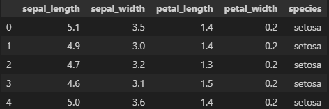

- 불필요한 데이터 삭제 및 필터링
  ```python
  df_sub = df.drop(columns=['sepal_length', 'sepal_width']) # drop = 시리즈 제거
  df_filtered = df_sub[df_sub["petal_width"] >= 0.3] # 필터링
  df_sub.head(5)
  ```
  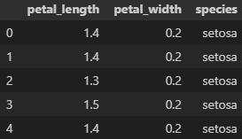

### 시각화 (Matplot, Seaborn, Plotly)
- Matplot으로 시각화
  ```python
  import matplotlib.pyplot as plt
  import numpy as np

  # 데이터 준비
  x = np.linspace(0, 10, 15)   # 0 ~ 10 사이를 20등분
  y = np.sin(x)

  # 라인 그래프 생성
  plt.plot(x, y, label="sin(x)", color="blue")

  # 그래프 설정
  plt.title("Matplot Example")  # 제목
  plt.xlabel("x axis")          # x축 라벨
  plt.ylabel("y axis")          # y축 라벨
  print()
  ```
  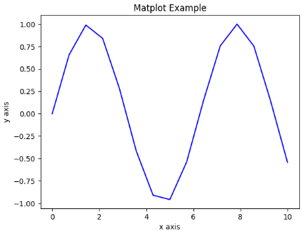

- Seaborn으로 시각화
  ```python
  import numpy as np
  import seaborn as sns

  # 데이터 준비
  x = np.linspace(0, 10, 20) # 0 ~ 10 까지 20 등분
  y = np.sin(x)

  # 라인 그래프 생성 후, 설정을 위한 객체 반환
  ax = sns.lineplot(x=x, y=y, label="sin(x)", color="blue")

  # 그래프 설정
  ax.set_title("Seaborn Example")
  ax.set_xlabel("x axis")
  ax.set_ylabel("y axis")
  print()
  ```
  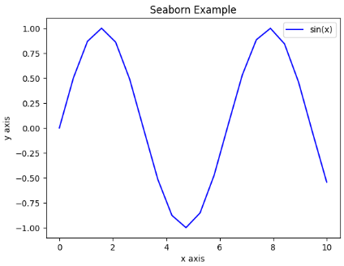
  - Matplot과 사용 방법 동일함

- Plotly으로 시각화
  ```python
  import numpy as np
  import plotly.graph_objects as go

  # 데이터 준비
  x = np.linspace(-5, 5, 100)
  y = np.linspace(-5, 5, 100)
  X, Y = np.meshgrid(x, y)
  Z = np.sin(X) * np.cos(Y)

  # 3D Surface 그래프 생성
  fig = go.Figure(data=[go.Surface(z=Z, x=X, y=Y, colorscale='Viridis')])

  # 그래프 설정
  fig.update_layout(
      title='3D Surface: sin(x) * cos(y)',
      scene=dict(
          xaxis_title='X axis',
          yaxis_title='Y axis',
          zaxis_title='Z axis'
      ),
      template='plotly_white',
      width=500,   # 가로 크기
      height=500   # 세로 크기
  )

  fig.show()
  ```
  

- 시각화 도구를 3가지(Matplot, Seaborn, Plotly)나 사용하는 이유
  1. Matplot
      - 데이터를 차트로 표현하는 기본 Library
      - 가장 많이 사용(가장 기본적)
  2. Seabon
      - Matplot 기반으로 만들어짐
      - Pandas와 함께 사용하면 코드를 한줄로 작성해 그래프 그릴 수 있음
  3. Plotly
      - 3D 표현 가능
      - 마우스 반응형(인터랙티브 그래프)

※참고: 시대의 흐름과 시작점
- 유비쿼터스 시대 -> IoT 시대 -> 빅데이터 시대 -> Data Science 시대를 거쳐 'AI 시대'가 찾아옴
- Data Science의 시작은 3개 Library 활용으로 정립됨
  - `Numpy`, `Pandas`, `Matplot`
    - Numpy에서 제공되는 타입으로 소수점 연산을 빠르게 계산하고
    - 그 값을 Pandas로 모아 분석하고, 필터링하고, 전처리함
    - 최종적으로 Matplot을 이용해 시각화까지 진행
- 이렇게 3개 라이브러리를 다루는 과정이
차후 EDA 학습의 빌드업이 됨

### 선형회귀모델
- 추세선 방정식을 의미함
  ```python
  import seaborn as sns
  import matplotlib.pyplot as plt

  # 예시 데이터 : 팁스
  tips = sns.load_dataset("tips")

  # 모델 에시 (선형 회귀 모델)
  # reg plot은 추세선을 그려주는 기능을 가지고 있습니다.
  sns.regplot(x="total_bill", y="tip", data=tips, ci=None, line_kws={"color": "red"})
  print()
  ```
  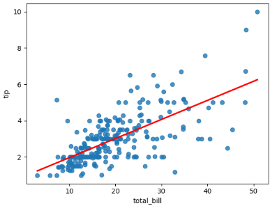
  - 추세선을 찾아내면 '미래 데이터'를 예측할 수 있음

※ 선형회귀모델의 '회귀'는 값을 예측하는 방법을 의미함("과거로 돌아가다"는 의미XX)

- 추세선 알아내는 원리
  1. 실제 값과 추세선의 오차를 구함
      - 예측값 $y=ax+b$ 와 실제 데이터의 차이를 계산
  
        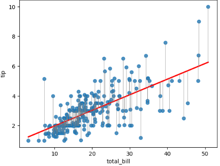

  2. 오차 제곱의 합(MSE)을 계산
      - $MSE = 1/n \sum(y_{예측} - y_{실제})^2$
      - 오차를 제곱해 합한 값이 작을수록 모델이 데이터를 잘 맞춘다는 의미
  
  3. a, b 값을 반복하며 최소 MSE를 찾음 (완전 탐색)
      ```python
      for a in range(1, 100):
          for b in range(1, 100):
              y = a*x + b
              # 실제 데이터와의 MSE 계산
              # MSE가 최소가 되는 a, b 선택
      plot(y = min_a*x + min_b)
      ```
      - 이 방법은 계산량이 많아 시간이 오래 걸림
  
  4. Gradient Descent로 최적화
      - 임의의 a, b에서 시작해 MSE가 줄어드는 방향으로 조금씩 이동
      - 경사가 있는 그래프를 따라 점차 내려가며 최소값(최적 a, b)을 찾음
      - 훨씬 빠르고 효율적
      - a 값에 대한 MSE 변화를 나타낸 예시 그림

        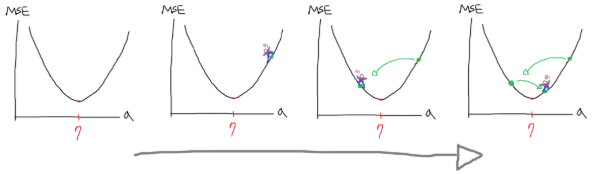
  
  5. 이동하는 크기 = 학습률 (learning rate)
      - 경사를 따라 이동할 때, 한 번에 **얼마만큼 이동할지** 결정하는 값
      - 이 값을 너무 크게 잡으면, 최소 지점을 지나쳐서 양쪽으로 계속 튀는 현상 발생
      - 이 값을 너무 작게 잡으면, 너무 느리게 이동해서 학습 속도가 매우 느려짐
      - 학습률은 사람이 직접 정하는 값 -> **하이퍼파라미터** (모델이 스스로 찾지 못하고, 사람이 직접 설정해줘야 하는 값)

- $y=ax+b$에서 MSE가 가장 작아지는 a, b 지점 시각화
  - a(기울기), b(절편)를 기준으로 계산된 MSE 손실곡면 위에서 최소값을 가지는 지점을 시각화한 그래프
    
    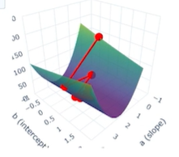
    - 빨간 점은 Gradient Descent가 이동한 경로를 의미
    - $z$축 = MSE

### 로지스틱회귀
- A에 속하는지, B에 속하는지 확률을 구하는 분류 모델
  - 주어지는 데이터
    - 2시간 공부 한 A 학생 : 불합격
    - 3시간 공부 한 B 한색 : 불합격
    - 4시간 공부 한 C 학생 : 합격
    - 3시간 공부 한 D 학생 : 불합격
    - 5시간 공부 한 E 학생 : 합격
    - 1시간 공부 한 F 학생 : 불합격
  
  ```python
  import numpy as np
  import matplotlib.pyplot as plt

  # 공부 시간 (X), 합격 여부 (y)
  X = np.array([1,2,3,4,5,6,2,3,4,5,6,7,1,2,3,4,5,6,7,8,2,3,4,5,6,7,8,9,10])
  y = np.array([0,0,0,1,1,1,0,0,1,1,1,1,0,0,0,1,1,1,1,1,0,0,1,1,1,1,1,1,1])

  def sigmoid(z):
      return 1 / (1 + np.exp(-z))

  # 하이퍼 파라미터 초기화
  lr = 0.1  # 학습률
  epochs = 5000

  # a, b 초기값 세팅
  np.random.seed(42)  # 재현성 고정
  a = np.random.randn()  # 기울기
  b = np.random.randn()  # 절편

  # Gradient Descent
  for epoch in range(epochs):
      # 예측
      y_hat = sigmoid(a * X + b)

      # Loss (Cross Entropy)
      eps = 1e-10
      loss = -np.mean(y*np.log(y_hat+eps) + (1-y)*np.log(1-y_hat+eps))

      # 기울기 계산
      error = y_hat - y
      grad_a = np.mean(error * X)
      grad_b = np.mean(error)

      # 파라미터 업데이트 (점프!)
      a -= lr * grad_a
      b -= lr * grad_b

      # Loss값 출력
      if epoch % 500 == 0:
        print(f"Epoch {epoch}, Loss={loss:.4f}, a={a:.4f}, b={b:.4f}")

  # 학습 결과
  print()
  print("최적 기울기 a:", a)
  print("최적 절편 b:", b)
  print("최종 Loss:", loss)

  # 시각화
  X_test = np.linspace(0, 10, 200)
  y_prob = sigmoid(a * X_test + b)

  plt.plot(X_test, y_prob, color="red", linewidth=2)
  plt.xlabel("Study Time")
  plt.ylabel("Pass Probability")
  plt.grid(True)
  ```
  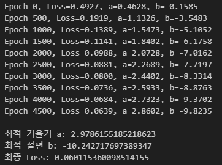
  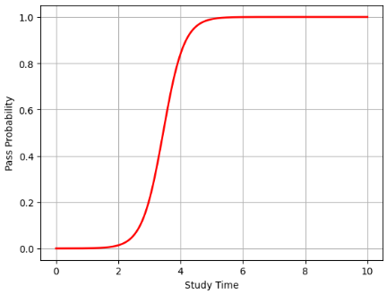
  - 로지스틱 회귀도 MSE가 가장 낮은 a, b 찾는 것이 목적
  - 시그모이드 함수에 a, b를 넣으면 '확률'이 나옴
  - 결과
    - 4시간 공부하면 합격확률 0.85
    - 즉, 가성비있는 공부 시간은 4시간!
    - 6시간이상 공부하는 것은 의미XX
  
- 선형회귀 vs 로지스틱 회귀
  - 선형회귀
    - $y = ax + b$ 형태
  
  - 로지스틱 회귀
    - $y = sigmoid(ax + b)$ 함수 형태
      ```python
      def sigmoid(z):
          return 1 / (1 + np.exp(-z))
      ```

  - 비교
    ```python
    for epoch in range(epochs):
          # 예측
          y_hat = a * X + b           # 선형회귀 선 그려짐 (추세선)
          y_hat = sigmoid(a * X + b)  # 로지스틱회귀 선 그려짐 (확률선)

    . . .
    ```


## EDA
- EDA (Exploratory Data Analysis)
  - 데이터를 살펴보는 행동
    - 데이터 샘플을 확인  
    - 필드 확인  
    - 기본 통계량 확인  
    - 분포 확인  
    - 상관계수 확인  
    - 등등

- 데이터 샘플 확인
  ```python
  import seaborn as sns

  # seaborn 내장 데이터 셋 불러오기 (데이터 프레임)
  df = sns.load_dataset("mpg")
  df.head()
  ```
  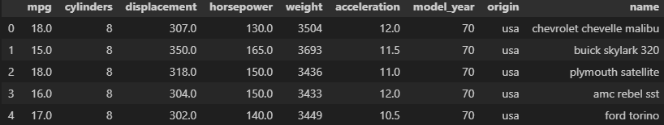

- 변수 간 관계 살펴보기 (feat.시각화)
  ```python
  import seaborn as sns

  df = sns.load_dataset("mpg")

  sns.regplot(data=df, x="weight", y="acceleration", scatter_kws={'alpha':0.6})
  print()
  ```
  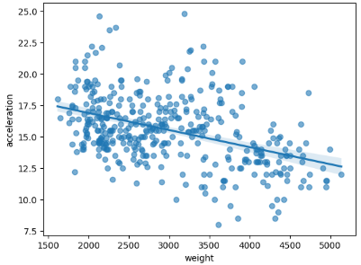

- 상관계수 (feat.히트맵)
  - 뭐랑 뭐랑 상관있습니까? 할 때의 그 상관임
  - 상관계수가 1에 가까우면 양의 상관관계, -1에 가까우면 음의 상관관계가 있는 것
    ```python
    import numpy as np
    import seaborn as sns

    df = sns.load_dataset("mpg")

    # 상관계수 행렬 계산
    corr = df.corr(numeric_only=True)

    # 삼각형 마스크 만들기 (상단 삼각형 가리기)
    mask = np.triu(np.ones_like(corr, dtype=bool))

    # 히트맵 출력
    sns.heatmap(corr, mask=mask, annot=True, cmap="coolwarm", linewidths=1)
    ```
    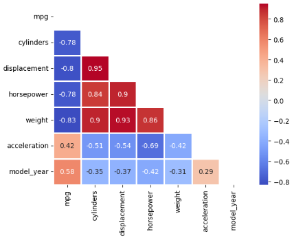
    - 연비(mpg)와 가장 큰 상관관계를 갖는 데이터는 'weight'
      - 절댓값이 가장 크기 때문
      - 즉, 무게(weight)가 높아질수록 연비(mpg)가 낮아짐
  
- 추세선 및 분포 확인 (feat. pair plot)
  ```python
  import seaborn as sns
  import matplotlib.pyplot as plt

  df = sns.load_dataset("mpg")

  # pairplot 시각화
  sns.pairplot(df[["mpg", "weight", "acceleration"]], corner=True, kind="reg", plot_kws={'line_kws': {'color': 'red'}})
  print()
  ```
  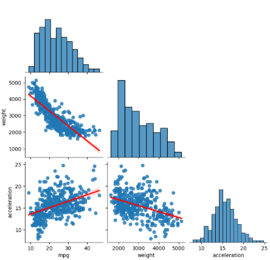
  - 데이터 간 추세선을 시각적으로 확인할 수 있음
  - 대각선에는 각 변수의 분포(histogram)가 표시됨
  - 하지만 분포만으로는 데이터 전체를 설명할 수 없음
    - ex. 똑같은 모양의 분포라도 평균, 분산 등이 다를 수 있음
  - 그래서 분포를 설명할 수 있는 수치적인 값들이 필요함
    - ex. 최솟값(min), 최댓값(max), 평균(mean), 분산(var), 표준편차(std) 등


## MLP
### MLP (Multi-Layer Perceptron)
- 하나 이상의 은닉층(hidden layer) 을 가진 신경망 구조
  - 딥러닝에서 가장 기본이 되는 모델 구조 중 하나

- 신경망 구조의 수식
  - 단순하게 선형회귀처럼 $y = Wx + b$ 형태로 표현할 수 있음
  - 즉, 단순한 추세선도 신경망으로 그릴 수 있음
    ```python
    import torch
    import torch.nn as nn
    import torch.optim as optim
    import matplotlib.pyplot as plt
    import seaborn as sns

    # 데이터 준비 (Seaborn의 tips 데이터셋)
    tips = sns.load_dataset("tips")

    # 입력(X): total_bill, 출력(y): tip
    # 아래 dtype은 데이터 타입을 float 으로 저장하라는 뜻입니다
    X = torch.tensor(tips["total_bill"].values, dtype=torch.float32).reshape(-1, 1)
    y = torch.tensor(tips["tip"].values, dtype=torch.float32).reshape(-1, 1)

    # 모델 정의 - 선형함수 y = wx + b 하나 생성
    model = nn.Linear(1, 1)  # 입력 1개(total_bill), 출력 1개(tip)

    # 손실함수 & 옵티마이저
    # 옵티마이저 = weight, bias를 변경하는 알고리즘 종류, GD를 사용합니다.
    criterion = nn.MSELoss() # MSE 사용
    optimizer = optim.SGD(model.parameters(), lr=0.001) # 옵티마이저 = GD

    # 학습 루프
    for epoch in range(2000): # 점프 2000번~!
        y_hat = model(X) #모델 예측

        loss = criterion(y_hat, y) #로스 계산

        optimizer.zero_grad() #미분 계산 초기화 (미분 Ready)
        loss.backward() #미분 계산 수행

        optimizer.step() #GD 점프 1회 (w, b 값이 업데이트 됩니다.)

        if epoch % 400 == 0:
            print(f"Epoch {epoch:4d} | Loss: {loss.item():.4f}")

    # 학습 결과 출력
    print()
    print('[학습완료]')
    print(f'학습된 가중치(weight): {model.weight.item()}')
    print(f'학습된 편향(bias)) : {model.bias.item()}')
    print()

    # 예측 선 준비
    with torch.no_grad():
      x_line = torch.linspace(X.min(), X.max(), 100).reshape(-1, 1)
      y_line = model(x_line)

    # 시각화
    plt.scatter(X.numpy(), y.numpy(), color='skyblue', alpha=0.6)
    plt.plot(x_line.numpy(), y_line.numpy(), color='red', linewidth=2)
    plt.title("Linear Regression with PyTorch")
    plt.xlabel("Total Bill ($)")
    plt.ylabel("Tip ($)")
    plt.grid(True)
    ```
    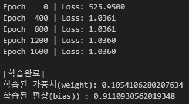

    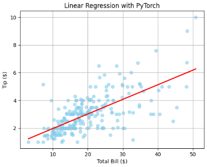
    - 선형 회귀식 $y=ax+b$ (혹은 $y=Wx+b$)는 직선만 표현 가능 -> 복잡한 데이터에는 한계가 있음
    - 그래서 여기에 활성화 함수(Activation Function) 를 넣음
    
- ReLU
  - 대표적인 활성화 함수로, 0 이하일 땐 0, 그 외(양수)엔 그대로 출력하는 함수임
  - 이걸 층(layer) 사이사이에 넣으면 모델이 비선형성을 학습하게 됨

    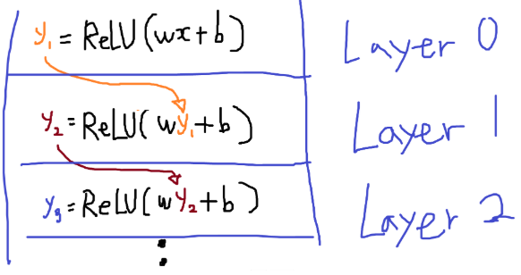
  - 즉, 단순 선형 함수였던 $y=Wx+b$가
    - ReLU를 중간에 끼우고, 여러 번 쌓이면서
    - 곡선, 꺾인 선, 복잡한 형태 등 모두 학습할 수 있게 됨
      
      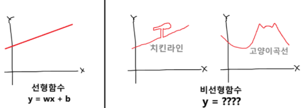

- 이렇게 여러 층을 차례로 연결하는 방식을 AI에서는 Sequential Connection (순차 연결) 이라고 부름
  - 함수의 중첩과 ReLU 활성화 함수를 이용하면, 모든 선을 다 그릴 수 있음

### MLP 예시: MNIST 숫자 데이터셋 분류
- 모델 학습
  ```python
  import pandas as pd
  import torch
  import torch.nn as nn
  import torch.optim as optim
  from torch.utils.data import DataLoader

  #===
  # 1. 데이터 준비 (csv -> data loader에 입력 해두기 까지)
  #===
  train_df = pd.read_csv("sample_data/mnist_train_small.csv")

  # 전처리를 안하니까 가끔씩 학습 실패해서... / 255로 스케일링이 필요했습니다. (0 ~ 1 값으로 정규화)
  X_train = torch.tensor(train_df.iloc[:, 1:].values, dtype=torch.float32) / 255.0
  y_train = torch.tensor(train_df.iloc[:, 0].values, dtype=torch.long)

  # Data Loader 세팅 완료
  train_dataset = list(zip(X_train, y_train))
  train_loader = DataLoader(train_dataset, batch_size=64, shuffle=True)

  #===
  # 2. 모델 준비
  #===
  # Layer의 개수, 중간 Layer의 입력과 출력의 개수는 모두 하이퍼파라미터 입니다.
  model = nn.Sequential(
      nn.Linear(784, 256), # 한 batch당 입력과 출력 개수를 적는 것을 잊지마세요.
      nn.ReLU(),
      nn.Linear(256, 128),
      nn.ReLU(),
      nn.Linear(128, 10) # 최종 출력값은 10개 입니다. '0' ~ '9' 의 점수 값이 나옵니다.
  )

  #===
  # 3. Loss & Optimizer (Adam)
  #===
  loss_fn = nn.CrossEntropyLoss()
  optimizer = optim.Adam(model.parameters(), lr=0.001)

  #===
  # 4. 학습
  #===
  epochs = 5
  for epoch in range(epochs):
      total_loss = 0
      for X_batch, y_batch in train_loader:

          outputs = model(X_batch) # 예측

          loss = loss_fn(outputs, y_batch) # loss 계산 (softmax도 함께 수행함)

          optimizer.zero_grad() # 미분 엔진 초기화
          loss.backward() # 미분 계산
          optimizer.step() # 파라미터 업데이트

          total_loss += loss.item() # Loss 누적

      print(f"Epoch {epoch+1}/{epochs}, Loss: {total_loss/len(train_loader):.4f}")

  #===
  # 5. 학습 완성된 파라미터들, 파일로 저장
  #===
  # 학습 결과로 찾아낸 파라미터 값들을 파일로 저장합니다.
  # .pth 확장자로 저장합니다. (pth = pytorch 약어)
  torch.save(model.state_dict(), "model.pth")
  ```
  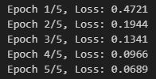
  1. CSV 데이터 불러오기
      - 손글씨 이미지 데이터를 pandas로 불러오고
      - torch.tensor로 바꿔서 0~1 사이로 정규화

  2. DataLoader에 넣기
      - 데이터를 (X, y) 형태로 묶어서 batch 단위로 불러올 수 있게 준비

  3. MLP 모델 구성
      - 입력 784 → 은닉층 256 → 은닉층 128 → 출력 10
      - 각 층 사이에 ReLU 활성화 함수 사용

  4. Loss 함수 & Optimizer 설정
      - CrossEntropyLoss 사용 (Softmax + Loss 포함)
      - 최적화는 Adam 사용, 학습률은 0.001 (하이퍼파라미터)

  5. 학습 루프
      - `for epoch in range(epochs)`로 반복하면서
      - 모델이 예측 → Loss 계산 → 역전파 → 파라미터 업데이트

  6. 학습 완료 후 저장
      - 학습된 모델의 파라미터들을 .pth 파일로 저장
  
  - 즉, 픽셀 하나하나를 입력해서, 0부터 9까지 숫자를 구분하는 방정식을 MLP가 직접 학습한 것

- 학습된 모델로 추론 (모델 불러와서 테스트 데이터에 적용)
  ```python
  import pandas as pd
  import torch
  import torch.nn as nn
  from torch.utils.data import DataLoader
  import matplotlib.pyplot as plt

  #===
  # 1. 모델 구조 정의 (학습할 때랑 똑같아야 함)
  #===
  model = nn.Sequential(
      nn.Linear(784, 256),
      nn.ReLU(),
      nn.Linear(256, 128),
      nn.ReLU(),
      nn.Linear(128, 10)
  )

  #===
  # 2. 모델 불러오기
  #===
  model.load_state_dict(torch.load("model.pth"))  # 저장했던 파일 로드

  #===
  # 3. 테스트 데이터 준비
  #===
  test_df = pd.read_csv("sample_data/mnist_test.csv")

  # 학습했던 것과 정규화 똑같이 해주기
  X_test = torch.tensor(test_df.iloc[:, 1:].values, dtype=torch.float32) / 255.0
  y_test = torch.tensor(test_df.iloc[:, 0].values, dtype=torch.long)

  # DataLoader 준비 완료
  test_dataset = list(zip(X_test, y_test))
  test_loader = DataLoader(test_dataset, batch_size=3, shuffle=True) # batch = 3 장씩

  #===
  # 4. 모델에 입력 데이터 이미지 3장 선택
  #===
  images = None
  for X_batch, y_batch in test_loader:
    images = X_batch
    break

  # 입력할 이미지 출력
  print('입력 이미지')
  for i in range(3):
      plt.subplot(1, 3, i+1)
      record = images[i].reshape(28, 28);
      plt.imshow(record, cmap="gray")
      plt.axis("off")
  plt.show()
  print()

  #===
  # 5. 추론하기!
  #===
  with torch.no_grad():
      outputs = model(images)
      preds = torch.argmax(outputs, dim=1) # 10개의 output 값중 가장 큰 값의 index 찾기
      print(f'모델 추론 결과 : {preds}')
  ```
  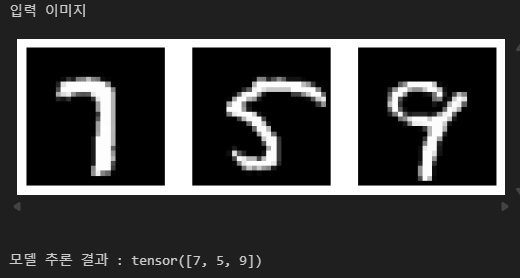
  1. 모델 구조 다시 정의하기
      - 모델을 불러올 땐, 학습할 때와 같은 구조로 다시 만들어줘야 함

  2. 저장된 파라미터 불러오기
      - `torch.load("model.pth")`로 `.pth` 파일 로드
      - `model.load_state_dict()`로 모델에 파라미터 적용

  3. 테스트 데이터 불러오기
      - 학습 때와 마찬가지로 pandas로 CSV 파일 읽고
      - 0~1 사이로 정규화까지 동일하게 진행
      - DataLoader에 넣어서 batch 단위로 사용 (여기선 3장씩)

  4. 이미지 출력해보기
      - test 이미지 중 3장만 꺼내서 matplotlib으로 시각화
      - 실제로 우리가 분류할 이미지를 확인

  5. 추론(Inference)
      - `model(images)`로 예측 결과 계산
      - argmax를 통해 가장 높은 점수를 받은 숫자 선택
      - 최종적으로 모델이 인식한 숫자 출력

  - 즉, 학습한 MLP 모델에 테스트 이미지를 넣고, 모델이 어떤 숫자라고 판단했는지 추론한 결과를 확인함

- MLP 구조 정리 (Multi-Layer Perceptron)
  ```python
  model = nn.Sequential(
        nn.Linear(784, 256),
        nn.ReLU(),
        nn.Linear(256, 128),
        nn.ReLU(),
        nn.Linear(128, 10)
    )
  ```
  - 784 → 256 → 128 → 10
    - 입력층부터 출력층까지 순차적으로 연결된 신경망 구조
    - 각 숫자는 각 층의 출력 노드(=뉴런) 개수를 의미함
      | 층    | 노드 수    | 의미                            |
      | ---- | ------- | ----------------------------- |
      | 입력층  | **784** | 28×28 이미지 → 픽셀 하나당 하나의 입력값    |
      | 은닉층1 | **256** | 첫 번째 중간 계산 단계                 |
      | 은닉층2 | **128** | 두 번째 중간 계산 단계                 |
      | 출력층  | **10**  | 0~9 숫자 중 어떤 숫자인지 예측 (클래스 수만큼) |

  - 수식으로 표현하면?

    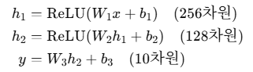
    - $x$: 입력 벡터 (784차원, 이미지 1장)
    - $W_n, b_n$: 각 층의 가중치와 편향
    - $ReLU$: 비선형성 추가를 위한 활성화 함수
    - $y$: 최종 출력 (10차원 → 숫자 0~9 각각의 점수)

### MLP 결론
MLP는 선형 연산 $y=Wx+b$에 $ReLU$ 같은 활성화 함수와 함수의 중첩(층 쌓기)을 더함으로써, 비선형적인 함수도 학습할 수 있는 모델이다


## 토큰화 / 임베딩
문장은 그대로 모델에 바로 대입 불가능

-> 각 토큰 단위로 글자를 자르고, 숫자로 바꾼 후 각 수를 벡터공간의 벡터값으로 치환함


### 토큰화
- 문장을 토큰 단위로 나누는 과정

### 임베딩
- 각 토큰화된 단어들에게 의미를 부여하는 과정
- 의미공간의 특정 Vector값을 갖게됨
- 임베딩 모델
  - **같은 의미를 가진 단어는 유사한 벡터값을 가지도록 매핑시켜줌**
  - 임베딩 모델은 보통 트렌스포머 기반 모델로 만듦

    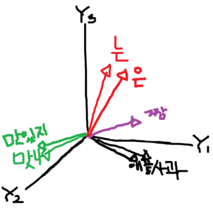
    - 임베딩 모델을 거친 벡터값들은, 수학 연산으로 얼마나 유사한지 빠르게 계산 가능
  
- 예시
  - hugging face에서 `intfloat/e5-small-v2` 임베딩 모델을 불러와 사용
    ```python
    from transformers import AutoTokenizer, AutoModel
    import torch
    import numpy as np

    # 임베딩 테스트 할 단어들
    words = [
        'cat', 'dog', 'tiger', 'lion', 'wolf', 'fox', # 동물
        'apple', 'banana', 'grape', 'orange', 'peach', 'strawberry', # 과일
        'car', 'bus', 'train', 'bicycle', 'airplane', 'ship' # 탈것
    ]

    # 토크나이저 다운로드
    tokenizer = AutoTokenizer.from_pretrained("intfloat/e5-small-v2")

    # 모델 다운로드
    model = AutoModel.from_pretrained("intfloat/e5-small-v2") # 약 130MB

    # 토큰화
    #   - padding=True : 출력되는 토큰 개수를 같은 개수로 통일 (빈 공간은 0으로 채움)
    #                    모델에 입력될 때, 데이터별 입력 개수가 모두 동일해야하기 때문
    #   - return_tensors='pt' : PyTorch의 Tensor로 결과 리턴하시오.
    tokens = tokenizer(words, padding=True, return_tensors='pt')

    # 추론하기
    result = None
    with torch.no_grad():
        outputs = model(**tokens) # 추론
        embeddings = outputs.last_hidden_state.mean(dim=1) # [중요] mean pooling 수행
        result = embeddings.tolist() # 결과를 Python List 타입으로 저장

    # 결과 출력하기
    for i in range(len(words)):
        nums = result[i]
        print(f'{words[i]:10s} : 총 {len(nums)} 차원 값 --> ', end='')
        print(f'[{nums[0]:.2f}, {nums[1]:.2f}, ... , {nums[-2]:.2f}, {nums[-1]:.2f}]')
    ```
    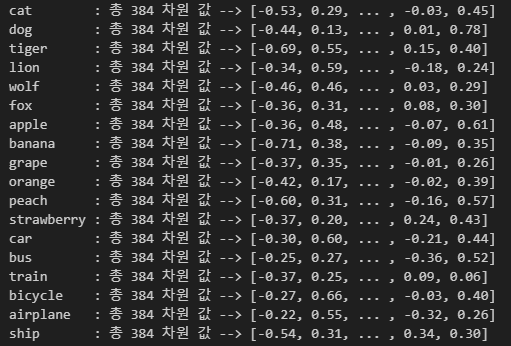
  
  - 유사한 단어가 유사한 벡터값을 가지는지 확인할 수 있음
    ```python
    # 위 코드를 실행 후에, 아래 코드를 실행해주세요.

    from transformers import AutoTokenizer, AutoModel
    import torch
    import numpy as np
    import plotly.graph_objects as go
    from sklearn.decomposition import PCA

    # ===
    # 1. 입력 데이터
    # ===
    words = [
        'cat', 'dog', 'tiger', 'lion', 'wolf', 'fox',                # Animal (0)
        'apple', 'banana', 'grape', 'orange', 'peach', 'strawberry', # Fruit (1)
        'car', 'bus', 'train', 'bicycle', 'airplane', 'ship'         # Vehicle (2)
    ]

    groups = [
        0, 0, 0, 0, 0, 0,   # Animal
        1, 1, 1, 1, 1, 1,   # Fruit
        2, 2, 2, 2, 2, 2    # Vehicle
    ]

    group_names = ["Animal","Fruit", "Vehicle"] # 그룹 이름

    colors = ["royalblue", "tomato", "seagreen"] # 그룹별 점 컬러


    # ===
    # 2. 임베딩 계산
    # ===
    tokens = tokenizer(words, padding=True, return_tensors='pt')

    result = None
    with torch.no_grad():
        outputs = model(**tokens)
        embeddings = outputs.last_hidden_state.mean(dim=1)
        result = embeddings.numpy()

    # ===
    # 3. PCA로 384 차원 ---> 3차원으로 축소 후 정규화
    # ===
    # PCA
    pca = PCA(n_components=3)
    reduced = pca.fit_transform(result)

    # L2 정규화 (잠시 후에 수업합니다.)
    unit_vectors = reduced / np.linalg.norm(reduced, axis=1, keepdims=True)

    # ===
    # 4. Plotly 차트 라이브러리로 시각화
    #    (이 코드는 이쁘게 만드려고 한거니, 이해하지 않아도 됩니다.)
    # ===

    # 원형 만들기
    theta = np.linspace(0, np.pi, 60)
    phi = np.linspace(0, 2 * np.pi, 120)
    theta, phi = np.meshgrid(theta, phi)
    x_sphere = np.sin(theta) * np.cos(phi)
    y_sphere = np.sin(theta) * np.sin(phi)
    z_sphere = np.cos(theta)
    sphere_points = go.Scatter3d(
        x=x_sphere.flatten(),
        y=y_sphere.flatten(),
        z=z_sphere.flatten(),
        mode='markers',
        marker=dict(size=2, color='lightblue', opacity=0.2),
        showlegend=False
    )

    # 점 찍기
    points = []
    added_groups = set()
    for i, word in enumerate(words):
        g = groups[i]
        vec = unit_vectors[i]
        is_show_legend = g not in added_groups
        added_groups.add(g)

        points.append(go.Scatter3d(
            x=[vec[0]], y=[vec[1]], z=[vec[2]],
            mode="markers+text",
            marker=dict(size=5, color=colors[g]),
            text=[word],
            name=group_names[g],
            showlegend=is_show_legend,
        ))

    # 추가 차트 세팅
    fig = go.Figure(data=[sphere_points] + points)
    fig.update_layout(
        title="3D Word Embeddings on Scatter Sphere",
        width=850, height=800,
        scene=dict(
            xaxis=dict(visible=False),
            yaxis=dict(visible=False),
            zaxis=dict(visible=False),
            camera=dict(eye=dict(x=0.9, y=0.9, z=0.9))
        ),
        showlegend=True,
        hovermode=False,
    )

    fig.show()
    ```
    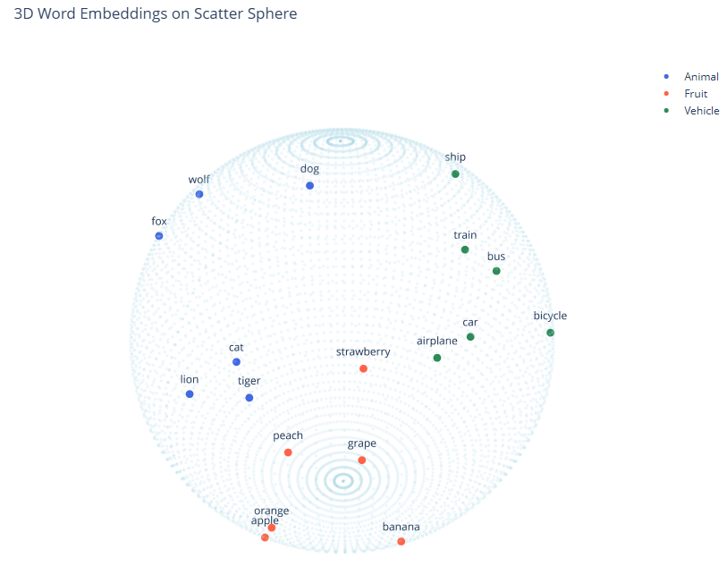
    - 384차원을 PCA를 통해 3차원으로 압축하여 그림으로 표현
    - 비슷한 의미의 단어는 비슷한 벡터값을 가지는 것을 시각적으로 확인
    - 벡터는 '방향'이 중요! 비슷한 '방향'의 벡터들이 비슷한 의미를 가짐


## 합성데이터와 데이터 증강
### 합성데이터 (Synthetic Data)
실제 세계에 없는 새로운 데이터를 생성하는 것

- 예시
  - GPT에게 “데이터를 만들어줘”라고 요청해 생성된 데이터
  - 내가 몇 개의 예시만 주고, 그걸 참고해 GPT가 새로운 문장을 만들어낸 것
  - 즉, 예시가 있어도 **"새로운 걸 만들어줘"**라는 요청이면 그건 합성 데이터
  - 프롬프트 예시
    ```
    """
    원본 데이터를 기반으로 새로운 데이터들을 만들어줘
    - 다양한 표현으로 바꾸어줘
    - 사람이 이해할 수 있는 문장이어야해
    - 원본 데이터 : "안녕, 난 철수야. KFC를 좋아하지"

    아래 예시를 보고, 같은 Format으로 만들어줘
    {
      "name": "철수",
      "age": 30,
      "height": 185,
      "messages": [
        {
          "직업": "아나운서",
          "인삿말": "안녕하십니까. 철수입니다. 저는 KFC를 참 좋아하는데요."
        },
        {
          "직업": "리포터",
          "인삿말": "안녕하세요 여러분. 철수예요. 저는 KFC를 사랑합니다. 여러분도 사랑해요."
        },
        {
          ...
        }
      ]
    }

    총 20개 문장이 되도록 만들어줘.
    최종 결과파일은 data.json 파일로 다운로드 받을 수 있게 해줘
    """
    ```
    - gpt에게 내가 예시를 주었지만, 이것은 증강이 아닌 합성 데이터임! '만들어달라'고 했기 때문!
    - 예시가 150개든, 1000개든 "참고해서 새로 만들어" 라고 하면 모두 **합성 데이터**임

### 데이터 증강 (Data Augmentation)
실제 데이터를 변형하여 데이터 셋을 확보하는 것

- 데이터의 양은 늘리되, 원본 의미는 유지함
- 주로 이미지 처리에서 많이 사용
  - 텍스트는 의미 훼손 가능성 높음 (ex. 단어 순서 바꾸면 의미가 달라질 수 있음)
  - 반면 이미지는 회전, 확대, 자르기 등의 변형에도 본질은 잘 유지됨

- 예시 코드
  - 원본 이미지
    ```python
    import requests
    from PIL import Image
    from io import BytesIO
    import matplotlib.pyplot as plt

    # 이미지 경로
    url = "https://cdn.pixabay.com/photo/2016/12/17/00/06/bowser-1912623_1280.jpg"

    # 다운로드 (request로 데이터 다운받고, 이미지 타입으로 변환)
    response = requests.get(url)
    img_origin = Image.open(BytesIO(response.content)).convert("RGB")
    print(f'타입 : type(img_origin)')

    # 출력하기
    plt.imshow(img_origin)
    plt.axis("off")
    plt.show()
    ```
    
  
  - 데이터 증강
    ```python
    from torchvision import transforms # 전처리 기능들이 모인 클래스
    from torchvision.utils import save_image

    # ===
    # 전처리 - 원본 이미지
    # ===
    base_transform = transforms.Compose([
        transforms.CenterCrop(640), # 640 x 640 이미지로 Crop (이미지 자르기)
        transforms.Resize((224, 224)), # 모델 입력 크기에 맞게 (224 x 224) 사이즈만 축소
        transforms.ToTensor()
    ])

    base_img = base_transform(img_origin) # 전처리된 이미지 저장

    # ===
    # 전처리 - 데이터 증강하기
    # ===
    aug_transform = transforms.Compose([
        transforms.CenterCrop(640),
        transforms.Resize((400, 400)),
        transforms.RandomHorizontalFlip(p=0.5),  # 50% 확률로 좌우반전
        transforms.RandomRotation(degrees=10),   #  -10 ~ 10도 사이 랜덤 회전
        transforms.RandomApply([transforms.RandomGrayscale(p=1.0)], p=0.2), # 20% 확률로 흑백사진
        transforms.ColorJitter(brightness=0.3, contrast=0.3, saturation=0.3), # 밝기, 대조, 노출값 랜덤하게 변경
        transforms.RandomCrop((224, 224)), # 랜덤한 위치로 Crop
        transforms.ToTensor()
    ])

    aug_imgs = []
    for i in range(5):
      aug_img = aug_transform(img_origin)
      aug_imgs.append(aug_img) # 전처리된 이미지 5개 생성

    # ===
    # 시각화 (아래 코드는 이쁘게 출력하기 위한 노력입니다.)
    # ===

    to_pil = transforms.ToPILImage()

    plt.figure()
    plt.title('Original')
    plt.imshow(to_pil(base_img))
    plt.axis("off")

    fig, axes = plt.subplots(1, 5, figsize=(7, 7))
    for i, aug in enumerate(aug_imgs):
        axes[i].imshow(to_pil(aug))
        axes[i].set_title(f'arg{i+1}')
        axes[i].axis("off")

    plt.show()

    # ===
    # 파일로 저장
    # ===
    save_image(base_img, "aug_grid.jpg")
    for i, img in enumerate(aug_imgs):
        save_image(img, f"aug_image_{i+1}.jpg")
    ```
    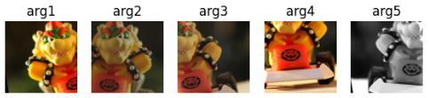

※ 데이터가 부족할 때 합성 데이터 우선? 데이터 증강 우선?

| 상황               | 사용 방법                                                               |
| ---------------- | ------------------------------------------------------------------- |
| **토이 프로젝트, 연습용** | → 진짜든 가짜든 상관없으니 **합성 데이터**를 사용                                      |
| **실제 서비스, 제품**   | → 정확성이 중요하므로, **가짜 데이터 사용 불가**<br>→ 이 경우엔 **데이터 증강**으로 원본 기반 데이터 늘림 |


## CNN
### CNN (Convolutioonal Neural Network)
이미지나 영상처럼 **시각적인 데이터**의 특징을 자동으로 학습해서 **사물을 인식하거나 분류**할 수 있게 해주는 딥러닝 알고리즘

1. 컨볼루션 연산: 이미지 X 커널 = 특징 추출 
    - CNN은 이미지 전체를 한 번에 보지 않고, 작은 커널(필터)을 슬라이딩하면서 일부분씩 곱셈 연산을 함

      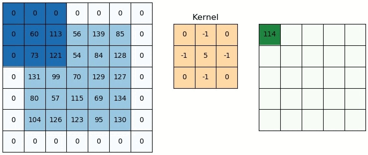
    - 이렇게 하면 테두리, 모서리, 방향 같은 특징이 강조됨
    - 이 연산 과정을 **Convolution(합성곱)** 이라고 부름
    - 즉, 이미지를 kernel에 컨볼루션 연산을 통해, 특징점을 잡는다

      
    - 커널도 학습 대상임
      - CNN은 커널함수의 값을 Weight로 취급하여 학습함

2. ReLU: 음수 제거 -> 비선형성 부여
    - Convolution 결과(특징이 뽑아진 값)에는 음수 값도 섞여 있음
    - ReLU를 통과시키면 음수는 0으로, 양수는 그대로 출력
    - 이렇게 하면 비선형성(Non-linearity) 이 생기고 모델이 더 복잡한 패턴을 학습할 수 있음
    
      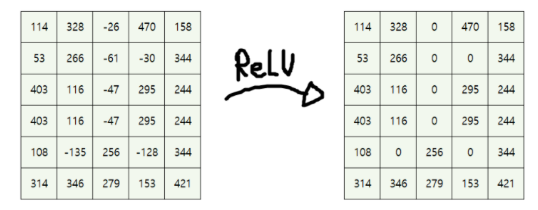

3. Max Pooling: 가장 강한 특징만 뽑아냄
    - 일정 구간(ex. 2×2)에서 가장 큰 값만 남김
    - 특징을 압축하면서도 정보는 유지
    - 연산량 줄고, 모델이 더 중요한 특징에 집중하게 됨
      
      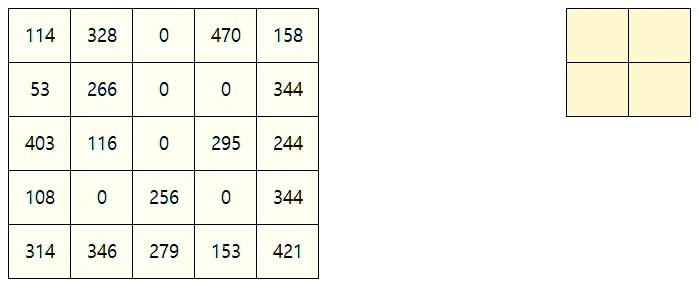

### CNN 전체 구조 흐름
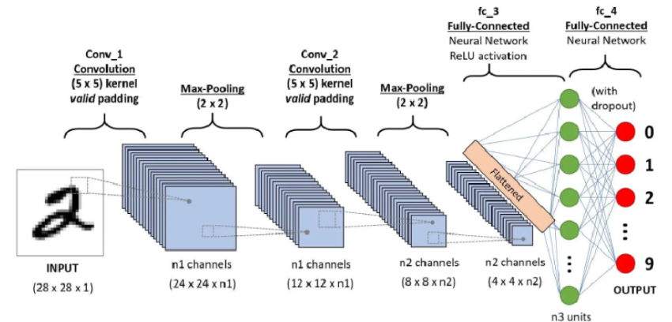

1. 입력(input)
    - ex. 흑백 이미지 28×28 (픽셀값 0~255)
    - CNN은 이 이미지를 숫자 행렬로 받아들임
      - 크기: `[1, 28, 28]` (1채널, 28행 28열)

2. 컨볼루션 (Convolution)
    - 작은 필터(커널)를 이미지 위에서 슬라이딩하며 곱셈 연산 수행
    - ex. 3×3 커널 하나가 이미지 위를 왼→오→아래로 움직이며 계산함
    - 이 커널이 이미지 안에서 테두리, 선, 무늬 등 특징을 감지함
    - 어떤 값으로 곱하냐?
      - 그 **곱할 값(커널 내부의 숫자)** 자체가 **학습 대상** !!
        ```
        예: 커널 (처음엔 랜덤)

        [ 0  1  0 ]
        [ 1 -4  1 ]   ← 이런 값들로 이미지 일부를 곱하고 합칩니다
        [ 0  1  0 ]
        ```
      - CNN은 처음에 이 커널 값들을 랜덤으로 시작하고
      - 학습을 거치면서 경사 하강법(Gradient Descent) 으로 이 커널 값들을 조금씩 바꾸며 더 좋은 특징을 뽑아내게 됨

3. 활성화 함수 (ReLU)
    - Convolution 결과엔 음수도 있음 ->  `ReLU(x) = max(0, x)`
      - 음수는 0으로 날리고, 양수만 남김
    - 덕분에 모델이 비선형성을 가지게 됨 (선만 학습하는 한계를 넘음)

4. 풀링 (Pooling)
    - 보통 Max Pooling (2×2) 사용
    - 일정 영역에서 가장 큰 값만 남김
    - 크기를 줄이고 (Downsampling), 가장 강한 특징만 보존

5. 다시 반복 (Convolution → ReLU → Pooling)
    - 위 과정을 여러 번 반복하면서 이미지에서 점점 더 추상적인 특징을 뽑아냄
    - 초반엔 선, 모서리 → 중반엔 윤곽 → 후반엔 숫자/사물의 모양

6. 전개 (Flatten)
    - 최종적으로 나온 특징 맵(feature map)을 일렬로 펴서 벡터로 변환
    - ex. `[4, 4, 128] → [2048]`
    - → 이제 MLP 구조에 넣을 수 있음

7. Fully Connected Layer (MLP 구조)
    - 여기서부턴 앞서 배운 MLP처럼 $y = ReLU(Wx + b)$ 구조로 예측을 수행함
    - 마지막에는 **클래스 수만큼 출력** (ex. MNIST는 10개 → 0~9)

8. Loss 계산 & 역전파
    - 예측값과 정답을 비교해서 Loss 계산
    - 역전파(backpropagation) 로 
      - MLP의 가중치뿐만 아니라 
      - 커널(필터) 안의 값들도 함께 학습됨

- 정리
  - Convolution → ReLU → Pooling → (반복) → Flatten → MLP(FC)

  - 앞부분에서 이미지의 특징을 뽑고,
  뒤에서는 MLP 구조로 분류까지 마무리함

  - 예를 들어 MNIST 숫자 이미지라면,
  → 마지막 FC 레이어에서 0~9 중 어떤 숫자인지 예측함

  - 이 구조 안에서 학습되는 파라미터는 2가지:
    - ① 커널(필터) 값들
    - ② FC 레이어의 Weight, Bias 값들 -> 이 모든 값을 **Gradient Descent** 로 학습함

※ MLP는 가중치(W)를 학습함

※ CNN은 **커널 안의 값들을 가중치로 사용하고, 그것들을 학습함**

-> 즉, CNN은 **“어떤 모양의 필터로 이미지를 살펴보는 게 좋은가?”** 를
스스로 학습해서 찾아내는 모델

### CNN 확장 (AlexNet & ResNet)
- AlexNet
  - CNN 구조를 기반으로 커널 사이즈, 필터 수, 레이어 순서 등 하이퍼파라미터를 잘 튜닝한 대표 모델
  - 이미지 분류 성능이 기존을 압도하면서 딥러닝의 붐을 이끈 모델
  - 즉, CNN을 "잘 설계한 버전"

- ResNet (Residual Network)
  - CNN 구조를 더 깊게 쌓으려 했던 시도에서 등장
  - 그러나 문제 발생
    - 왜?
    - 연산이 계속 곱해지며, 앞단에서 계산한 값의 영향력이 점점 사라지는 현상 발생
    - 이를 **기울기 소실(Vanishing Gradient)** 이라고 함
  
  - 해결 방법: **Skip Connection**
    - 앞 레이어의 출력을 그대로 뒷단으로 전달 (skip 연결)
      
      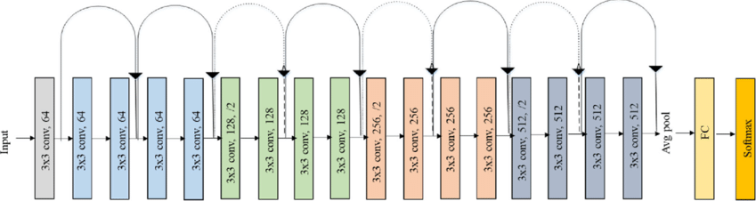
    - 수식 표현: $y = ReLU(F(x) + x)$
    - 이렇게 하면 학습 시 정보가 사라지지 않고 더 깊은 네트워크도 안정적으로 학습 가능

### 사전학습된 CNN 모델 활용: Linear Probing
- 사전 학습 모델
  - ResNet18 같은 모델은 ImageNet이라는 대규모 데이터셋으로 이미 학습되어 있음
  - 즉, **일반적인 이미지 특징을 잘 뽑아내는 능력(백본)**이 탑재된 상태

- 파인튜닝(Fine-Tuning)
  - 기존에 사전학습된 모델을 완전히 새로 학습시키는 게 아니라, 
  - 필요한 일부 Layer만 새로 학습하거나, 전체를 조금만 조정하는 기법

  - 파인튜닝 3가지 방식
    1. Full Fine-Tuning (풀 파인튜닝)
        - 모든 파라미터(Weight)를 업데이트하는 방식
        - 기존 모델의 구조는 유지하지만, 모든 층의 가중치를 다시 조정함
        - 표현력이 매우 높아, 성능 향상이 클 수 있음
        - 그러나, 데이터가 많아야 과적합(overfitting)을 막을 수 있기 때문에 **대규모 데이터셋**이 있을 때 사용
    
    2. Partial Fine-Tuning (파셜 파인튜닝)
        - 일부 레이어만 학습시키고, 나머지는 고정 (freeze)
        - ex. `Linear Probing` → 마지막 FC Layer만 교체해서 학습
        - 실무에서 소량의 커스텀 데이터를 쓸 때 적합

    3. Efficient Fine-Tuning (효율적인 파인튜닝)
        - 기존 모델의 파라미터는 전부 고정하고, "어댑터"나 "로라(LoRA)" 등의 추가 모듈만 학습
        - 모델 내부에 작고 얇은 경로를 삽입하여 추가 학습 가능하게 함
        - 소량의 데이터 & 적은 리소스로도 성능 향상 가능
        - 최근 LLM 파인튜닝 등에서 매우 널리 사용됨

- Linear Probing
  - **전체 네트워크 중 마지막 Layer만 새로 교체**해서 학습하는 방법
  - 앞쪽 CNN Layer들은 학습된 그대로 사용
    - **가중치(Weight)를 고정**시킴
    - 백본의 특징 추출 능력은 그대로 쓰기 위함
  - 새로 만든 마지막 FC Layer만 학습하여 **원하는 분류 작업** 수행

    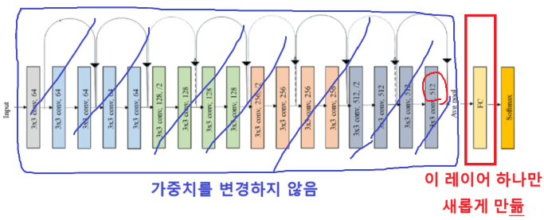

- 예시: 사전학습된 ResNet으로 이미지 분류하기
  - 사전학습된 ResNet-18 로드하고, 이미지 1장을 예측
  - 사전학습된 모델을 **그대로 활용**해서 일반 이미지 분류를 하는 예시 (1000개 클래스 분류)
    ```python
    import torch
    from torchvision import models, transforms
    from PIL import Image
    from io import BytesIO
    from torchvision.models import ResNet18_Weights
    import requests
    import matplotlib.pyplot as plt

    # 모델 불러오기
    # 사전학습된 ResNet-18 모델을 불러옵니다.
    model = models.resnet18(weights=ResNet18_Weights.IMAGENET1K_V1)
    model.eval() # 평가모드 (추론용)

    # 이미지 URL
    url = "https://cdn.pixabay.com/photo/2018/07/07/21/29/cat-3522912_1280.jpg" # 고양이
    #url = "https://cdn.pixabay.com/photo/2012/02/27/17/00/ape-17474_1280.jpg" #침팬지
    #url = "https://cdn.pixabay.com/photo/2020/02/03/07/40/cross-speed-4814978_1280.jpg" #스포츠카

    # 이미지 다운로드
    img = Image.open(BytesIO(requests.get(url).content)).convert("RGB")

    # 이미지 출력
    plt.figure(figsize=(5, 5))
    plt.imshow(img)
    plt.axis('off')
    plt.show()

    # 이미지 전처리
    preprocess = transforms.Compose([
        transforms.Resize((256, 256)), # 크기 변경 (256 x 256)
        transforms.ToTensor(), # PyTorch Tensor 타입으로 변경 + 0 ~ 1로 정규화
        transforms.Normalize( # 정규화
            mean=[0.485, 0.456, 0.406], # ImageNet 학습때 쓴 평균 값
            std=[0.229, 0.224, 0.225] # ImageNet 학습때 쓴 표준편차 값
        ),
    ])

    # 이미지 전처리 후 차원 변경
    # (3, 256, 256) -> (1, 3, 256, 256) : 배치차원 추가
    input_tensor = preprocess(img).unsqueeze(0)

    # 모델 추론
    with torch.no_grad():
        outputs = model(input_tensor)
        preds = torch.argmax(outputs, dim=1).item()

    # 예측 결과 출력
    labels = ResNet18_Weights.IMAGENET1K_V1.meta["categories"]
    print(f'예측 클래스: {labels[preds]}')
    ```
    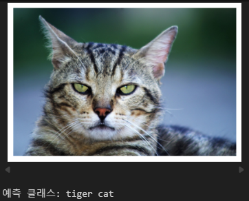

- 예시: Ronald McDonald 분류기 만들기 (Fine-tuning)
  - 맥도날드 이미지 다운로드
    ```python
    !git clone https://github.com/mincoding1/ronald_image.git
    ```
  
  - Linear Probing을 통한 모델 학습
    ```python
    import torch
    import torch.nn as nn
    import torch.optim as optim
    from torchvision import models, datasets, transforms
    from torch.utils.data import DataLoader
    import os

    # ===
    # 1. 기본 설정
    # ===
    device = torch.device("cuda" if torch.cuda.is_available() else "cpu")
    print("사용 장치 : ", device)

    SEED = 0
    torch.manual_seed(SEED)

    # ===
    # 2. 이미지 전처리
    # ===
    print('이미지 준비...', end='')
    transform_train = transforms.Compose([
        transforms.Resize((224, 224)),
        transforms.ToTensor(),
        transforms.Normalize(mean=[0.485, 0.456, 0.406],
                            std=[0.229, 0.224, 0.225])
    ])

    # train 폴더에 이미지들 정보를 읽음 (폴더명을 클래스명으로 인식!)
    train_dataset = datasets.ImageFolder("ronald_image/train", transform=transform_train)
    train_loader = DataLoader(train_dataset, batch_size=64, shuffle=True)
    print('완료')

    # ===
    # 3. 사전학습된 ResNet18 모델 준비 + 파인튜닝 준비
    # ===
    print('모델 준비...', end='')
    model = models.resnet18(weights=models.ResNet18_Weights.IMAGENET1K_V1)

    # [핵심코드 1] 모든 파라미터 autograd off
    for param in model.parameters():
        param.requires_grad = False

    # [핵심코드 2] 마지막 FC 변경 (새로 생성)
    model.fc = nn.Linear(512, 2) # 입력 512개, 출력 2개, 이 부분만 autograd on
    model = model.to(device)
    print('완료')

    # ===
    # 4. 학습
    # ===
    criterion = nn.CrossEntropyLoss()
    optimizer = optim.Adam(model.fc.parameters(), lr=0.001)

    print('학습 시작')
    for epoch in range(5):  # Epoch 수는 자유롭게 조절 가능
        print(f' - [Epoch {epoch+1}/3] ... ',end='')
        model.train()
        total_loss = 0.0

        for imgs, labels in train_loader:
            imgs, labels = imgs.to(device), labels.to(device)

            optimizer.zero_grad()
            outputs = model(imgs)
            loss = criterion(outputs, labels)
            loss.backward()
            optimizer.step()

            total_loss += loss.item()

        avg_loss = total_loss / len(train_loader)
        print(f'Loss: {avg_loss:.4f}')
    print('학습 완료')
    ```
    - 사전학습된 ResNet18 불러와서, 마지막 Layer만 새로 학습
    - 나머지 파라미터는 고정 (Freeze)
    - Ronald vs Not-Ronald 분류기 학습
    - 수정한 부분
      ```python
      # 기존에 있던 마지막 분류층 (1000개의 출력) 제거
      # 대신 우리가 원하는 2개의 클래스만 분류하도록 새로 정의
      model.fc = nn.Linear(512, 2)

      # 기존의 model.fc는 512 → 1000 연결되어 있었는데,
      # 512 → 2로 바꿔서 2-class classification으로 수정함!!
      ```
  
  - 학습된 모델로 예측 및 시각화
    ```python
    import torch
    from torchvision import transforms
    from PIL import Image
    from io import BytesIO
    import requests
    import matplotlib.pyplot as plt

    # 테스트 해볼 이미지 URL들
    urls = [
        "https://cdn.pixabay.com/photo/2012/11/28/10/28/cowboy-67630_1280.jpg",  # 사람
        "https://cdn.pixabay.com/photo/2014/06/17/14/16/mcdonald-370465_1280.jpg",  # 로널드
        "https://cdn.pixabay.com/photo/2018/07/07/21/29/cat-3522912_1280.jpg",  # 고양이
        "https://cdn.pixabay.com/photo/2012/02/27/17/00/ape-17474_1280.jpg",  # 침팬지
        "https://static.wikia.nocookie.net/ronaldmcdonald/images/9/93/Ronald_Actors.jpg",  # 로널드
        "https://cdn.pixabay.com/photo/2020/02/03/07/40/cross-speed-4814978_1280.jpg",  # 스포츠카
        "https://static.wikia.nocookie.net/agk/images/d/db/Screen-Shot-2017-05-01-at-11.17.09-AM.jpg",
        "https://cdn.pixabay.com/photo/2013/06/20/04/41/fool-140229_1280.jpg",
        "https://cdn.pixabay.com/photo/2021/10/10/21/52/makeup-6698881_1280.jpg",
        "https://cdn.pixabay.com/photo/2019/11/04/01/11/cellular-4599956_1280.jpg",
    ]

    results = []
    model.eval()

    with torch.no_grad():
        for url in urls: # 이미지 하나씩 추론해봄

            # 다운로드 1 장
            img = Image.open(BytesIO(requests.get(url).content)).convert("RGB")

            # 이미지 전처리
            img_tensor = transform_train(img).unsqueeze(0).to(device)

            # 추론
            outputs = model(img_tensor)

            # 확률계산
            probs = torch.softmax(outputs, dim=1)[0].cpu().numpy()

            # 결과를 result에 저장
            pred_idx = probs.argmax()
            pred_class = train_dataset.classes[pred_idx]
            pred_prob = probs[pred_idx]

            results.append({
                "img": img,
                "pred_prob": pred_prob,
                "probs": probs
            })

    # 확률 높은 순서대로 정렬
    target_class_idx = train_dataset.classes.index('ronald')
    results_sorted = sorted(results, key=lambda x: x["probs"][target_class_idx], reverse=True)

    # 시각화
    plt.figure(figsize=(15, 4))
    for i, r in enumerate(results_sorted):
        plt.subplot(1, len(results_sorted), i + 1)
        plt.imshow(r["img"].resize((128, 128)))
        plt.axis("off")
        plt.title(f"Top-{i+1}\n{r['pred_prob']:.2f}")

    print()
    ```
    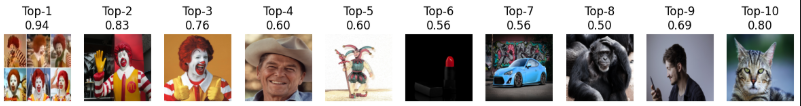
    - 학습된 모델을 사용해 다양한 이미지를 분류
    - 로널드일 확률이 높은 순서대로 시각화


## RNN / LSTM
### RNN (Recurrent Beural Network)
연속된 데이터(시퀀스)를 처리하기 위해 만들어진 딥러닝 구조

- 입력 데이터 간의 시간적 순서나 의존성을 고려함
  - 과거 정보를 기억하며 다음 값을 예측하는 데 유리

- RNN 구조
  - 매 시점마다 입력을 순차적으로 받고
  - 이전 상태(hidden state)를 다음 입력에 반영함
  - 이전 정보를 기억하면서 다음 토큰 예측하는 구조

    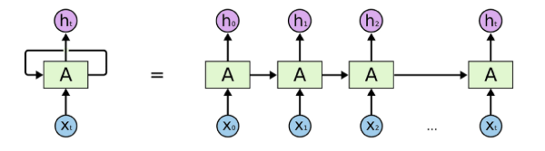

    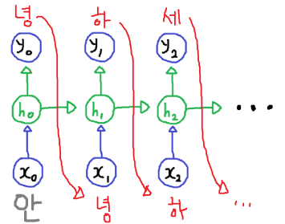

- RNN 문제점
  - 기억 소실 문제 (Vanishing Memory)
    - 시점이 길어질수록 과거 정보 잊어버림
    - 즉, 과거 Hidden Layer의 출력값 정보가 점점 소실됨
    - ex. 문장 초반 단어 정보가 끝에 가면 영향력 거의 없음

      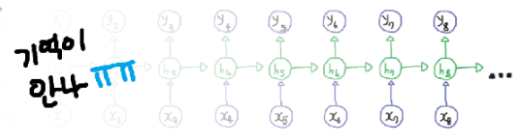

  - 기울기 소실 문제 (Vanishing Gradient)
    - 역전파 시, 반복적인 chain rule로 미분값이 점점 작아짐
    - 결국 앞쪽 Layer는 거의 학습되지 않음
    - 긴 문장 or 긴 시퀀스 학습 불가능에 가까움

      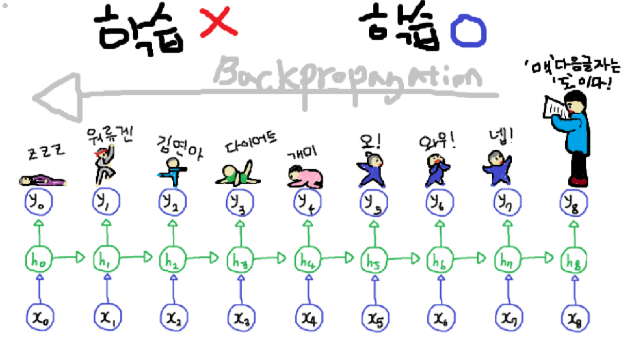
  
  - 이 문제를 해결하려고 나온 것이 LSTM -> Transformer 구조

### LSTM(Long Short-Term Memory)
RNN 단점을 보완한 구조로, 핵심은 **게이트 구조**

-> 중요한 정보는 기억, 쓸모없는 건 지움으로써 **긴 문맥도 기억 가능**하게 됨

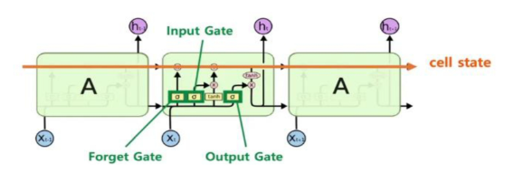

- 내부 구조
  - Forget Gate
    - 이전 정보 중 어떤 걸 버릴지 결정함
    - 시그모이드 -> 0에 가까우면 버림, 1에 가까우면 유지
  - Input Gate
    - 현재 입력에서 어떤 정보를 추가할지 결정
    - 시그모이드 + tanh 조합으로 새로운 기억 후보 생성
  - Cell State (셀 상태)
    - 정보가 흘러가는 고속도로 같은 역할
    - 필요 없는 건 forget gate로 지우고, 중요한 건 input gate로 추가함
  - Output Gate
    - 현재 시점에서 어떤 정보를 출력할지 결정
    - 최종 hidden state로 내보냄 -> 다음 시점의 입력으로도 사용됨

- LSTM 학습 대상
  - 각 게이트마다 고유한 Weight 있음
    - Forget Gate: `W_f`
    - Input Gate: `W_i`
    - Output Gate: `W_o`
    - Cell State 업데이트용: `W_c`
  - 이 weight 값들이 모두 학습 대상임
  - 학습하면서 "어떤 정보를 버릴지, 저장할지, 출력할지"를 결정하는 능력을 키움

- LSTM 한계점
  - RNN에서 발생하던 기억 소실 문제를 어느 정도 해결함
  - 하지만 완전히 해결한 건 아님
  - 문장이 너무 길어지면, 여전히 **과거 정보가 희미**해짐
  - 특히 문맥 안의 **모든 단어 간의 관계를 동시에 파악하기 어려움**
    - ex. 앞에서 말한 주어가 뒤에서 동사와 연결될 때, 멀리 떨어져 있으면 연결 잘 안 됨
  - 결국, 순차적으로만 정보를 처리한다는 구조적 한계 존재
  - 그래서 등장한 것이 Attention 메커니즘!


## Attention과 Transformer 모델
### Attention
중요한 입력데이터에 더 집중하도록 도와주는 구조

- 문장 내 모든 단어들 간의 관계를 한 번에 고려함
- RNN처럼 순차적으로 정보를 전달하지 않음 -> 병렬처리 가능, 속도 빠름

- 작동 방식 (Self-Attention 기준)

  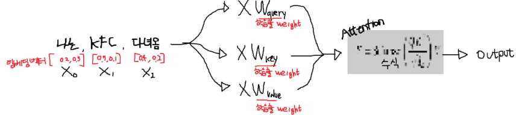
  - 입력을 임베딩함 (예: "나는 KFC 다녀옴" → `X₀, X₁, X₂` 등)
  - 각각의 입력에서 세 가지 벡터 생성함
    - Query, Key, Value
    - 이 세 벡터는 학습 가능한 weight를 통해 만들어짐 (`W_q`, `W_k`, `W_v`)
  - Query와 Key의 내적 -> 유사도 점수(score)
  - 이 score들을 softmax -> 가중치로 사용(중요도 수치화)
  - 각 Value에 가중치를 곱해 모두 더함 -> 최종 출력 벡터 생성(이 가중합 벡터가 최종 Attention 결과)
  - 결과적으로 **문맥 속에서 중요한 정보를 반영한 표현 벡터**를 만들어냄

- 문맥 표현 공간과의 관계
  - Attention을 통해 만들어지는 벡터는 **“문맥 표현 공간”** 이라는 의미 임베딩 공간의 좌표값이라 볼 수 있음
  - 이 공간에서는 문맥이나 의미가 유사한 단어/문장/이미지들이 **비슷한 위치에 맵핑**됨
  - 예시
    - "나는 KFC 다녀옴", "KFC 아까 갔다왔는데?"
    - 서로 다른 표현이지만 문맥은 같음 → 표현 공간에서 거의 같은 벡터값 가짐

- 문맥 표현 공간 매핑

  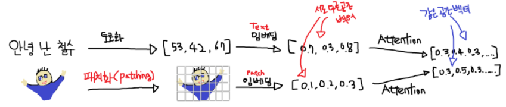
  - 텍스트
    1. 문장을 단어 단위로 토큰화
    2. 각 토큰을 의미 기반 벡터(임베딩)로 변환 → 이 벡터들이 의미 공간에 위치함(입주민)
    3. Attention을 통해 이 벡터들을 종합적으로 고려하여 문장의 문맥을 담은 하나의 벡터를 생성
    4. 이 문맥 벡터는 문맥 표현 공간의 입주민이 됨
    - 요약: 토큰화 → 임베딩 → 의미 반영한 벡터들 → Attention → 하나의 문맥 벡터

  - 이미지
    - Patch로 나눈 뒤 → 각 패치를 임베딩 → Attention → 전체 이미지의 의미를 담은 벡터 생성
  
  - 최종적으로 둘 다 의미 기반으로 **같은 공간에 입주**하게 됨


### Transformer
Attention 메커니즘을 확장하여 인코더-디코더 구조로 구성된 딥러닝 모델

- 핵심 구성 요소 (참고!)
  - 멀티-헤드 어텐션
    - 여러 개의 어텐션을 병렬로 계산해 다양한 의미 관계를 동시에 학습
  - 포지셔널 인코딩
    - 순서를 알 수 없는 어텐션의 한계를 보완하기 위해 위치 정보를 인코딩하여 추가
  - 인코더 블록과 디코더 블록을 쌓는 구조 → 번역, 요약, 생성 등 다양한 작업 가능

- 트랜스포머 기반으로 등장한 모델
  - BERT, GPT, T5, ViT, CLIP, SAM, LLAMA, Gemini 등

- 즉, “여러 개의 어텐션을 정교하게 묶은 구조”가 트랜스포머 모델이고, 트랜스포머가 등장하면서 Foundation Model 시대가 열림


## Transformer 기반 이미지 모델
### 트랜스포머, 이미지 분야에서도 Game Changer
- 기존엔 이미지 처리에 CNN(합성곱 신경망) 이 주로 사용됨
- 하지만 최근에는 트랜스포머 기반 모델들이 이미지 분야에서도 뛰어난 성능을 보이며 CNN을 대체하는 추세
- 텍스트 뿐 아니라 이미지, 영상, 음성 등 다양한 모달에서 강력한 성능을 보임

### 객체 인식
- 트랜스포머 기반 객체 인식 모델인 YOLOS를 사용해 이미지를 분석하는 코드
  ```python
  from transformers import YolosImageProcessor, YolosForObjectDetection
  import requests
  import torch
  from PIL import Image, ImageDraw, ImageFont
  import matplotlib.pyplot as plt

  # 이미지 로드 후 전처리
  url = 'https://cdn.pixabay.com/photo/2021/07/09/02/29/family-6398107_1280.jpg'
  image = Image.open(requests.get(url, stream=True).raw)
  image = image.resize((640, 462))

  # 전처리기, 모델 로드
  feature_extractor = YolosImageProcessor.from_pretrained('hustvl/yolos-small')
  model = YolosForObjectDetection.from_pretrained('hustvl/yolos-small')

  # 입력 전처리
  inputs = feature_extractor(images=image, return_tensors="pt")

  # 모델추론
  outputs = model(**inputs)

  # 후처리
  target_sizes = torch.tensor([image.size[::-1]])
  results = feature_extractor.post_process_object_detection(
      outputs, threshold=0.7, target_sizes=target_sizes
  )[0]

  # 이미지에 바운딩박스 그리기
  draw = ImageDraw.Draw(image)
  font = ImageFont.truetype("JejuGothic-Regular.ttf", 16)

  for score, label, box in zip(results["scores"], results["labels"], results["boxes"]):
      box = [round(i, 2) for i in box.tolist()]
      label_text = f"{model.config.id2label[label.item()]} {round(score.item(), 2)}"

      draw.rectangle(box, outline="red", width=2) # 빨간 사각형
      draw.text((box[0], box[1] - 20), label_text, fill="red", font=font) # 빨간색 글씨

  # 결과 시각화
  plt.figure(figsize=(10, 10))
  plt.imshow(image)
  plt.axis("off")
  plt.show()
  ```
  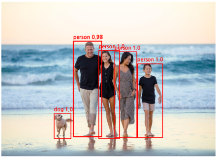
  - 입력 이미지를 받아 사람 등 객체를 바운딩 박스로 표시
  - `YOLOS`는 기존 CNN 기반 탐지기(YOLO 등)와 달리 **트랜스포머 구조**만 사용해 학습된 모델

### 이미지 생성: Diffusion + Transformer의 결합
- 텍스트를 입력하면 이미지를 그려주는 모델들도 대부분 트랜스포머 기반
- 대표적인 이미지 생성 방법: **Diffusion (확산 모델)**
  - 작동 원리
    - 학습 시: 이미지에 점점 노이즈를 추가하고, 그 노이즈를 예측함(어디에 얼마나 노이즈 추가했는지) -> 반복
    - 생성 시: 완전한 노이즈에서 시작해, 노이즈를 점차 제거하며 이미지 복원

      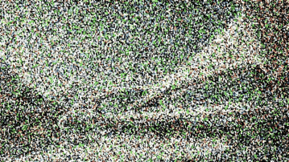
      
      

- 예시 코드
  ```python
  from diffusers import AutoPipelineForText2Image
  import torch
  import matplotlib.pyplot as plt

  pipe = AutoPipelineForText2Image.from_pretrained("stabilityai/sd-turbo", dtype=torch.float16, variant="fp16").to("cuda")

  # 프롬프트 입력
  prompt = "The puppy is eating a hamburger at McDonald's."

  # 이미지 생성
  image = pipe(prompt=prompt, num_inference_steps=2, guidance_scale=0.0).images[0]

  # 이미지 출력
  plt.figure(figsize=(8, 8))
  plt.imshow(image)
  plt.axis("off")
  plt.show()

  # 저장
  image.save("result.png")
  ```
  

  - YOLOS 객체 탐지:
    - 이미지 URL 불러오기 → YOLOS로 객체 인식 → 결과 시각화
  
  - Diffusion 이미지 생성:
    - 텍스트 프롬프트 → Diffusion 기반 모델(SD-Turbo)로 이미지 생성 → 시각화 및 저장
  
※ 예전에는 CNN 기반 U-Net 구조를 사용했지만, 요즘은 트랜스포머 구조로 대체되며 품질이 비약적으로 향상됨


## RAG
### LLM 기반 AI App
LangChain과 RAG 기술을 통해, 복잡한 AI 워크플로우도 쉽게 구현할 수 있음

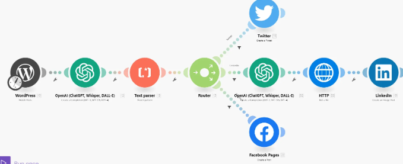
- ex. 사용자가 블로그 글을 작성하면 자동으로 요약하여 트위터, 페이스북, 링크드인에 업로드하는 작업을 LLM 기반으로 처리할 수 있음

### LangChain
LangChain은 LLM 기반 앱을 빠르고 효율적으로 구축할 수 있게 도와주는 파이썬 프레임워크

- 다양한 컴포넌트(모델, 프롬프트, 검색기, 툴 등)를 체인처럼 연결하여 복잡한 AI 워크플로우를 구성할 수 있게 해줌

- 특히 RAG, 챗봇, 멀티턴 대화, 툴 사용 등 다양한 LLM 응용 기능을 구현하기 쉽게 추상화해줌

- 즉, "질문 → 검색 → LLM → 답변"처럼 여러 단계를 하나의 체인으로 묶어주는 강력한 툴

### RAG (Retrieval-Augmented Generation)
LLM에게 질문을 바로 넣는 대신, 먼저 정보를 검색하고, 그 결과를 함께 넣는 방식

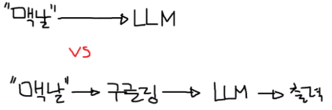
- 최신 정보나 LLM이 학습하지 못한 지식을 **외부 지식에서 가져와 정확도를 향상**시킴
- RAG는 꼭 임베딩 기반 벡터 검색이 아니더라도, 일반 검색 결과를 넣는 것만으로도 RAG라고 부름

### RAG 동작 구조
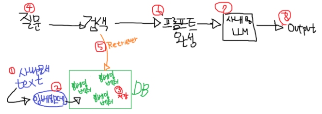

- 준비 단계
  - ① 사내 문서 Text로 추출하여, "Chunk" 라는 단락 단위로 나눔
  - ② "Chunk" 를 임베딩모델의 입력값으로 넣어, 벡터로 만들고 만듦
  - ③ 벡터를 DB에 저장

- Workflow 동작
  - ④ 질문 프롬프트를 입력 받음
  - ⑤ 임베딩 모델을 거쳐 벡터 값을 얻어낸 후, Retriever로 유사한 Chunk를 검색
  - ⑥ 기존 질문과, 검색결과를 합쳐 프롬프트 완성
  - ⑦ 프롬프트를 LLM에 입력으로 넣음
  - ⑧ 더 멋진 결과가 나옴!

### LangChain에서 구현한 RAG 체인 구조
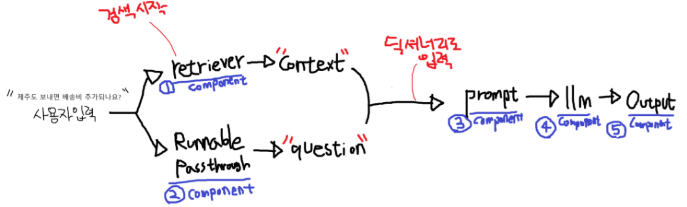

1. 사용자 질문이 입력되면,
2. `retriever` 컴포넌트가 관련 정보를 검색 (Context 생성)
3. 동시에 질문은 그대로 `RunnablePassthrough`를 통해 전달됨
4. 검색 결과 + 질문 → 프롬프트로 구성됨
5. 이 프롬프트를 LLM에게 전달
6. LLM이 답변을 생성 → 텍스트만 추출 (StrOutputParser)

### RAG 실습
- 라이브러리 설치 및 OpenAI API 준비
  ```python
  # 실습에 필요한 라이브러리들을 설치합니다.
  %%capture
  !pip install langchain-community langchain-chroma
  ```
  ```python
  %%capture
  !pip install langchain langchain-openai
  !pip install --upgrade langchain # 랭체인 공식 버전으로 설치됩니다

  import os
  from google.colab import userdata
  os.environ["OPENAI_API_KEY"] = userdata.get("OPEN_AI")
  ```

- 검색할 텍스트 준비 (ex. 배송 정책 문서)
  ```python
  # 예시로 사용할 '배송 정책' 문서를 만듭니다.
  %%writefile shipping_policy.txt

  ========================
  AI 온라인 서점 배송 정책
  ========================
  [일반 배송]
  평일 오후 3시 이전 주문 시 당일 발송됩니다.
  오후 3시 이후 주문 건은 익일 발송됩니다.
  주말 및 공휴일은 배송이 어렵습니다.
  도서 산간 지역 배송
  제주 및 도서 산간 지역은 추가 배송비 3,000원이 발생할 수 있습니다.

  [배송 조회]
  배송 관련 문의는 고객센터(1588-0000)로 연락 주시기 바랍니다.

  ==============
  배송 파손 정책
  ==============
  상품이 배송 중 파손된 경우, 즉시 새 상품으로 교환해드립니다.
  제품 이상이 확인되면 왕복 배송비는 전액 당사 부담입니다.
  수령 후 7일 이내에 고객센터로 연락해 주셔야 합니다.
  파손된 상품과 포장 상태 사진을 함께 제출해 주세요.
  확인 후, 새 상품을 발송하거나 환불 절차를 진행합니다.
  단순 변심이나 부주의로 인한 손상은 교환 대상이 아닙니다.
  ```

- Text 청킹
  ```python
  from langchain_community.document_loaders.text import TextLoader
  from langchain_text_splitters import RecursiveCharacterTextSplitter

  # 1. Load: 텍스트 파일 불러오기
  loader = TextLoader("./shipping_policy.txt", encoding="utf-8")
  documents = loader.load()

  print("--- 원본 문서 ---")
  print(documents[0].page_content)

  # 2. Split: 문서를 200자 단위로 자르기 (엔터 단위, 40자씩 겹치게)
  splitter = RecursiveCharacterTextSplitter(chunk_size=200, chunk_overlap=40)
  chunks = splitter.split_documents(documents)

  print("\n--- 200자 단위로 잘린 문서 조각(Chunk)들 ---")
  for i, chunk in enumerate(chunks):
      print(f"[Chunk {i+1}]")
      print(chunk.page_content)
      print()
      print()
  ```

- Text 벡터 임베딩 후 VectorDB에 저장
  ```python
  from langchain_openai import OpenAIEmbeddings
  from langchain_chroma import Chroma

  embeddings = OpenAIEmbeddings(model="text-embedding-3-small")

  # 잘라낸 문서 조각(chunks)들을 임베딩하여 Vector DB에 저장합니다.
  vector_store = Chroma(
      embedding_function=embeddings,
      persist_directory="./chroma_store",
  )

  vector_store.add_documents(chunks)
  print("Chunk들을 Vector DB에 저장 완료")
  ```

- 검색기 생성 후 테스트
  ```python
  retriever = vector_store.as_retriever()

  question = "주말에도 배송해주나요?"

  # retriever.invoke(질문) 을 실행하면, 질문과 가장 관련 높은 문서 조각을 찾아줍니다.
  # question을 임베딩벡터로 변환 후 검색을 시작합니다.
  retrieved_docs = retriever.invoke(question)

  print(f"[질문]: {question}")
  print(f"\n[검색 결과]:\n{retrieved_docs[0].page_content}")
  ```
  

- RAG 구현
  ```python
  from langchain.chat_models import init_chat_model
  from langchain_core.prompts import ChatPromptTemplate
  from langchain_core.runnables import RunnablePassthrough
  from langchain_core.output_parsers import StrOutputParser

  # LLM 모델을 준비합니다.
  model = init_chat_model("openai:gpt-4o-mini")

  # LLM에게 어떤 역할을 할지 알려주는 프롬프트(지시서)를 만듭니다.
  prompt = ChatPromptTemplate.from_messages([
      ("system", "당신은 AI 온라인 서점의 친절한 고객 서비스 담당자입니다. 주어진 정보를 바탕으로 사용자의 질문에 답변해주세요."),
      ("user", "[질문]: {question}\n\n[참고 정보]: {context}"),
  ])

  # RAG 체인(Chain)을 만듭니다.
  # 즉, 컴포넌트들이 순차적으로 연결되는 파이프라인 구조로 체인을 구성합니다.
  # {질문 → 검색 → 프롬프트 생성 → 모델 → 출력 파싱}
  rag_chain = (
      {
        "context": retriever,              # 컴포넌트 1 : 전달받은 입력값(question_input1, 2)을 vector db에 검색 후 검색결과를 반환
        "question": RunnablePassthrough()  # 컴포넌트 2 : 전달받은 입력값(question_input1, 2)을 그대로 반환
      }
      | prompt              # 컴포넌트 3 : {context, question} 딕셔너리가 입력되면, 완성된 프롬프트를 반환
      | model               # 컴포넌트 4 : 완성된 프롬프트를 LLM에 전달, 완성된 프롬프트를 반환
      | StrOutputParser()   # 컴포넌트 5. LLM이 반환한 정보 중, Text 답변만 문자열로 반환
  )

  print("RAG 체인 준비 완료!")
  print("----------------------------")
  print()

  # RAG 체인에 질문을 던져봅니다.
  question_input1 = "주말 배송에 대해 알려주세요."
  answer1 = rag_chain.invoke(question_input1)
  print(f"[질문 1]: {question_input1}")
  print(f"[답변 1]: {answer1}")

  print()
  print("----------------------------")
  print()

  question_input2 = "제주도로 보내면 배송비가 추가되나요?"
  answer2 = rag_chain.invoke(question_input2)
  print(f"[질문 2]: {question_input2}")
  print(f"[답변 2]: {answer2}")
  ```
  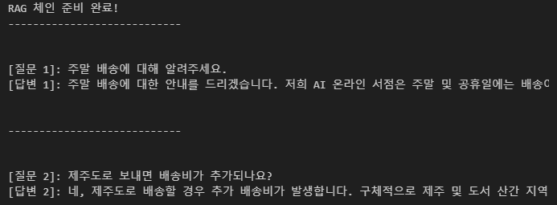

### 멀티턴 대화 (Multi-turn Conversation)
- 일반 챗봇은 사용자의 질문에 즉각적인 응답만을 반환함
- 하지만, **멀티턴 챗봇은 과거의 대화 이력(history)을 기억**하여 맥락 있는 대화를 이어갈 수 있음

- LangChain으로 멀티턴 챗봇 구현
  ```python
  from langchain.chat_models import init_chat_model
  from langchain_core.prompts import ChatPromptTemplate
  from langchain_core.output_parsers import StrOutputParser

  # =============================================
  # 2개의 체인 구성
  # =============================================
  prompt = ChatPromptTemplate.from_template(
      """
      넌 최고의 미식가야
      매우 사랑스럽고, 한 문장으로만 대답하지.

      [지금까지의 대화] :
      {history}

      [질문] :
      {input}
      """
  )

  model = init_chat_model("openai:gpt-4o-mini")
  parser = StrOutputParser()
  chain = prompt | model | parser

  # =============================================
  # 대화 히스토리 저장
  # =============================================

  history = []

  def chat(user_input):
      """한 턴의 대화를 수행하고 history에 추가"""

      # History List를 하나의 문자열로 변경
      formatted_history = "\n".join([f"{m['role']}: {m['content']}" for m in history])

      # Chain 시작! (LLM 답변 출력됨)
      response = chain.invoke({"input": user_input, "history": formatted_history})

      # History List에 질문과 대화 추가하기
      history.append({"role": "user", "content": user_input})
      history.append({"role": "assistant", "content": response})

      return response


  # =============================================
  # 대화 쉘
  # =============================================

  print("🍔 미식가 챗봇에 오신 걸 환영합니다!")
  print("대화를 종료하려면 'bye'를 입력하세요.\n")

  while True:
      user_input = input("👤 인간 : ")

      ai_reply = chat(user_input)
      print(f"🤖 미식가 AI : {ai_reply}\n")

      if user_input == 'bye':
          break
  ```
  

### ReAct 구조 (Reasoning + Acting)
ReAct는 LLM이 단순히 답변만 하는 게 아니라, **도구(tool)** 를 직접 사용하면서 문제를 해결하는 구조

- 필요할 때 툴을 실행하고, 그 결과를 바탕으로 다시 생각(Reason)하고, 최종적인 답변(Final Answer)을 도출함

- ReAct 구조 흐름

  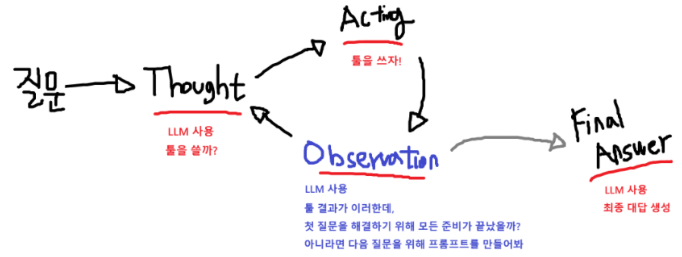
  - Thought: 툴을 쓸지 말지 결정 (LLM이 판단)
  - Action: 필요한 툴 호출
  - Observation: 툴의 실행 결과를 받아서 해석
  - Final Answer: 최종 답변 생성
  - 이 과정을 반복하면서 문제 해결에 접근함

- LangChain으로 ReAct 구현 예시
  ```python
  from dataclasses import dataclass
  from langchain.agents.middleware import SummarizationMiddleware    # 요약 기능추가
  from langchain.agents import create_agent
  from langchain.chat_models import init_chat_model
  from langchain.tools import tool
  from langgraph.checkpoint.memory import InMemorySaver

  # =====================================================
  # 시스템 프롬프트
  # =====================================================
  SYSTEM_PROMPT = """너는 최고의 미식가야, 항상 간결하게 말하지
  사용자가 요청하면 필요한 도구를 정확히 한 번만 사용하고

  너에게는 세 개의 도구가 있어:

  1. add_sum(a, b)
    - 두 수의 합을 구합니다.
  2. add_minus(a, b)
    - 두 수의 차를 구합니다.
  3. add_multiply(a, b)
    - 두 수의 곱을 구합니다.

  결과를 이용해 농담 섞인 대답으로 답해줘.
  """

  # =====================================================
  # 도구 정의
  # =====================================================
  @tool
  def add_sum(a: int, b: int) -> int:
      """두 수의 합을 구합니다."""
      return a + b

  @tool
  def add_minus(a: int, b: int) -> int:
      """두 수의 차를 구합니다."""
      return a - b

  @tool
  def add_multiply(a: int, b: int) -> int:
      """두 수의 곱을 구합니다."""
      return a * b

  @tool
  def get_weather() -> str:
      """오늘의 날씨를 반환합니다."""
      # API 호출 코드 삽입
      return "허리케인"

  tool = [add_sum, add_minus, add_multiply, get_weather]

  # =====================================================
  # 모델 설정
  # =====================================================
  model = init_chat_model("openai:gpt-4o-mini")

  # =====================================================
  # 최종 결과 포맷
  # =====================================================
  @dataclass
  class ResponseFormat:
      answer: str   # AI의 대답 문장

  # =====================================================
  # 멀티턴을 위한 InMemorySaver
  # =====================================================
  checkpointer = InMemorySaver()

  # =====================================================
  # Agent 생성 (이곳에 SummarizationMiddleware를 설치합니다.)
  # =====================================================
  agent = create_agent(
      model=model,
      system_prompt=SYSTEM_PROMPT,
      tools=tool,
      response_format=ResponseFormat,
      middleware=[
      SummarizationMiddleware(
          model="openai:gpt-4o-mini", # 요약을 담당할 모델
          max_tokens_before_summary=4000,  # 최대 4000 토큰으로 요약합니다.
          messages_to_keep=20,  # 요약 이후 최대 20 메세지는 유지합니다.
      )],
      checkpointer=checkpointer
  )

  # =====================================================
  # 실행 예시 (이쁘게 출력하려는 노력입니다.)
  # =====================================================
  def print_message(msgs):
      for msg in msgs:
          if hasattr(msg, "tool_calls") and msg.tool_calls:
              for tool_call in msg.tool_calls:
                  name = tool_call.get("name")
                  args = tool_call.get("args")
                  if name == "ResponseFormat":
                      continue
                  print(f"💭( 🛠️{name} 함수 호출 {args} )")

          if "AIMessage" not in str(type(msg)):
              print(f"💭( {type(msg).__name__} : {msg.content!r} )")

  # =============================================
  # 대화 루프 (멀티턴)
  # =============================================
  print("AI Agent 챗봇에 오신 걸 환영합니다!")
  print("대화를 종료하려면 'bye'를 입력하세요.\n")
  print(f"🤖 AI Agent : 무엇이든 질문하세요")

  # thread_id를 통해 대화 세션 유지 (필수)
  config = {"configurable": {"thread_id": "kfc_user"}}

  while True:
      print()
      user_input = input("👤 인간 : ")

      response = agent.invoke({
          "messages": [
              {"role": "user", "content": user_input}
          ]},config = config) # thread_id 단위로 대화 상태 저장

      print_message(response["messages"][1:-1])
      print(f"🤖 AI Agent : {response["structured_response"].answer}")

      if user_input == 'bye':
          break
  ```


## PEFT
### 효율적인 파인튜닝 (PEFT)
모든 파라미터를 변경하지 않고, 일부 파라미터만 변경하여 파인튜닝의 효율을 극대화 시킴

- **PEFT**
  - 일부 파라미터만 학습하여 효율적으로 미세 조정할 수 있는 방식
  - 대표적인 PEFT 기법: LoRA (Low-Rank Adaptation)

### LoRA
- ΔW (업데이트 파라미터)를 직접 학습하지 않고, 저랭크 행렬 A, B의 곱으로 근사
- 기존 모델의 성능을 유지하면서 파라미터 수, 연산량, 메모리를 대폭 줄임

  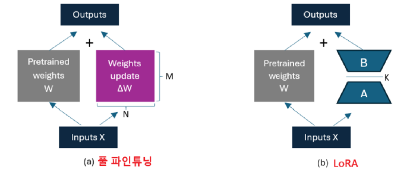
  - 기존 방식 (왼쪽): 전체 ΔW 학습
  - LoRA 방식 (오른쪽): 저랭크 행렬 A, B만 학습

### PEFT 실습 흐름 정리
※ 코드 너무 길어서 볼거면 `AI/99_Final_Summary/code/AI강의II_랩업_실습.ipynb`에서 확인

※ 아래 내용은 실습 코드를 gpt로 요약한 것 (참고용)

1. 환경 및 라이브러리 세팅
    - 실습에는 `Unsloth`라는 고속 LoRA 학습 라이브러리를 사용
    - HuggingFace보다 메모리 절약 + 빠른 학습 속도
    - Colab 환경에서는 GPU(T4 등)가 제한적이기 때문에, 4bit 양자화를 통해 효율적으로 모델을 다룸
    - 필요한 라이브러리들을 설치하고, GPU 사용을 설정함

2. 모델 로딩 및 추론 테스트
    - `Qwen3-4B-Instruct` 모델을 `Unsloth`를 통해 로드함
    - 4bit 양자화(quantization)를 적용하여 적은 VRAM에서도 실행 가능
    - 로딩된 모델이 정말 잘 작동하는지, 표준어 문장을 사투리로 번역 요청하여 테스트
    - 결과
      - 학습 전에는 사투리에 대해 잘 모르기 때문에 제대로 번역되지 않음

3. LoRA 어댑터 삽입 (PEFT 적용)
    - LoRA 구조는 파라미터 전체가 아닌, 일부 레이어(`q_proj`, `k_proj`, `v_proj` 등)에만 학습 가능한 어댑터(ΔW)를 삽입
    - 이 어댑터만 학습함으로써 메모리를 아끼고 효율적인 파인튜닝이 가능해짐
    - 이 구조는 기존의 Full Fine-Tuning과 대비해 학습 속도와 메모리 사용량 모두 절약됨

4. 데이터셋 준비 및 전처리
    - HuggingFace에서 제공하는 제주도 사투리 데이터셋 사용
      - `standard`: 표준어 문장
      - `dialect`: 해당 문장의 제주도 사투리 버전

    - 데이터 포맷 변환
      - 모델은 대화형 구조(`user` ↔ `assistant`)로 학습되기 때문에, 아래 형태로 포맷 변환
        ```json
        {
          "conversations": [
            {"role": "user", "content": "다음 문장을 제주도 사투리로 번역해줘:\n\n모르겠어"},
            {"role": "assistant", "content": "모크르다"}
          ]
        }
        ```
    - Chat Template 적용
      - 모델이 이해할 수 있도록, HuggingFace 포맷 (`<|im_start|>user`, `<|im_end|>`) 형식으로 변환
      - 이 과정을 위해 `apply_chat_template()` 함수 사용

5. 텍스트 학습용 필드 구성
    - 모델은 text 필드 하나를 기준으로 학습하기 때문에, 위에서 만든 구조를 모두 텍스트로 변환
    - 이후 HuggingFace `Trainer`에 전달할 수 있는 데이터셋 형식 완성

6. Trainer 설정 및 학습 구성
    - Unsloth의 `SFTTrainer`를 통해 학습 실행
    - 학습률, 배치 크기, Gradient Accumulation 등을 설정
    - `train_on_responses_only()`를 통해 모델이 오직 응답 부분만 학습하도록 지정
      - ex. user 질문은 그대로 두고, assistant의 응답만 생성하게 훈련

7. 학습 실행
    - 지정된 `max_steps` 동안 학습을 진행
    - Loss가 점진적으로 줄어드는 것을 확인
    - 전반적으로 줄어들지 않으면 학습이 잘 안되고 있는 것

8. 학습된 모델로 추론 테스트
    - 새로운 문장을 입력하고, 학습된 모델이 사투리로 잘 번역하는지 확인
    - Chat Template을 사용해 입력을 포맷팅하고, `generate()`로 응답 생성
    - 결과
      - 사투리 번역이 더 자연스럽고 자주 등장함
      - 학습량이 많을수록 더 좋아짐

