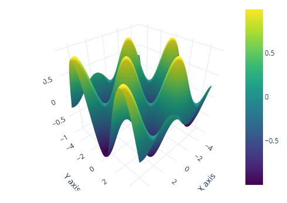

# AI강의Ⅱ Wrap Up
## AI를 위한 Python과 Math
- AI를 위한 준비과정  
  1. 파이썬 기본 문법
  2. 클래스  
  3. Numpy  
  4. Pandas  
  5. Matplot  
  6. Seabon  
  7. 선형회귀  
  8. 로지스틱회귀  
  9. Gradient Decent  

### 파이썬 기본 문법
- 함수
  ````python
  # 함수 기본 문법
  def sum1(a, b):
      return a + b

  # 파라미터 타입까지 표기
  def sum2(a: int, b: int):
      return a + b

  # 리턴 타입까지 표현 -> 디폴트
  def sum3(a: int, b: int) -> int:
      return a + b

  c = sum1(10, 20)
  print(c)
  ````
  - 현업에서는 리턴 타입까지 표현하는 함수 표기 방법을 주로 사용함

- 클래스
  ```python
  # 클래스 생성
  class Person:
    def __init__(self):
      self.name = 'HI' #instance attribute
      self.age = '30' #instance attribute

    def sayHi(self):
      print('안녕')

    def sayBye(self):
      print(f'잘가 {self.name} 님')


  # 객체 생성
  bts = Person()
  bts.sayHi()
  bts.sayHi()
  bts.sayBye()
  ```

### Numpy & 선형대수학 기본 내용
- 벡터 표현
  ```python
  import numpy as np

  v = np.array([[1, 2, 3],
                [1, 1, 5]])
  ```
  - Numpy를 이용해 `[1, 1]`, `[2, 1]`, `[3, 5]`와 같은 벡터를 표현함
  - 벡터는 **방향**과 **크기**를 가지는 값으로, 고정된 위치가 아니라 움직임이나 힘의 방향을 나타냄
    - 예를 들어, `(1, 1)`이라는 좌표는 고정 좌표계에서는 한 점을 의미하지만,
    - 벡터에서는 `(0, 0)`을 기준으로 `(1, 1)` 방향으로 힘을 가하는 것
    - ex. 권투 선수가 `(0, 0)` 위치에서 `(1, 1)` 방향으로 펀치를 뻗는 것이라고 이해할 수 있음
  - 이렇게 어떤 방향으로 얼마만큼의 영향을 주는지를 표현하는 단위가 바로 **벡터**

- 변환행렬
  ```python
  #변환행렬 1 : x축 방향 2배 스케일링
  S = np.array([[2, 0],
                [0, 1]])

  #변환행렬 2 : 90도 반시계 방향 회전
  R = np.array([[0, -1],
              [1, 0]])

  #변환행렬 합성
  RS = R @ S

  #합성된 변환행렬로 한방에 변환
  v_scaled = RS @ v

  print(v_scaled)
  ```
  - 선형적으로 공간을 변형하는 개념
    - 벡터에 **스케일링(크기 조정)** 이나 **회전(방향 변경)** 같은 선형 변환을 적용함

  - `S`: x축 방향으로 2배 스케일링
    - ex. 쨉하는 동영상을 가로로 늘리는 것처럼 벡터의 x성분을 2배로 키움

  - `R`: 90도 반시계 방향 회전
    - ex. 쨉을 왼쪽으로 틀어주는 것과 같음 (방향만 바뀌고 크기는 그대로)
  
  - `RS`: 변환행렬 두 개를 한 번에 적용한 것
    - 먼저 스케일링, 그다음 회전 순서
  
  - 이러한 변환행렬은 MLP(다층 퍼셉트론)에서 `y = Wx + b` 연산을 할 때 자주 사용됨
    - ex. 입력 벡터 x에 가중치 행렬 W를 곱하는 것이 바로 선형변환의 예시

### Pandas
- 용도: 파이썬으로 엑셀을 하는 것과 같음
  - 데이터 확인
  - 불필요한 데이터 삭제
  - EDA와 전처리
    - AI에서 주로 사용
  - csv 파일 불러오기

- 데이터 확인
  ```python
  import seaborn as sns
  import pandas as pd

  # 아이리스(꽃) 데이터셋 읽어오기 (Seaborn 공식 자료)
  df = pd.read_csv("https://raw.githubusercontent.com/mwaskom/seaborn-data/master/iris.csv")
  df.head(5) #상위 5줄만 가볍게 출력
  ```
  

- 불필요한 데이터 삭제 및 필터링
  ```python
  df_sub = df.drop(columns=['sepal_length', 'sepal_width']) # drop = 시리즈 제거
  df_filtered = df_sub[df_sub["petal_width"] >= 0.3] # 필터링
  df_sub.head(5)
  ```
  

### 시각화 (Matplot, Seaborn, Plotly)
- Matplot으로 시각화
  ```python
  import matplotlib.pyplot as plt
  import numpy as np

  # 데이터 준비
  x = np.linspace(0, 10, 15)   # 0 ~ 10 사이를 20등분
  y = np.sin(x)

  # 라인 그래프 생성
  plt.plot(x, y, label="sin(x)", color="blue")

  # 그래프 설정
  plt.title("Matplot Example")  # 제목
  plt.xlabel("x axis")          # x축 라벨
  plt.ylabel("y axis")          # y축 라벨
  print()
  ```
  

- Seaborn으로 시각화
  ```python
  import numpy as np
  import seaborn as sns

  # 데이터 준비
  x = np.linspace(0, 10, 20) # 0 ~ 10 까지 20 등분
  y = np.sin(x)

  # 라인 그래프 생성 후, 설정을 위한 객체 반환
  ax = sns.lineplot(x=x, y=y, label="sin(x)", color="blue")

  # 그래프 설정
  ax.set_title("Seaborn Example")
  ax.set_xlabel("x axis")
  ax.set_ylabel("y axis")
  print()
  ```
  
  - Matplot과 사용 방법 동일함

- Plotly으로 시각화
  ```python
  import numpy as np
  import plotly.graph_objects as go

  # 데이터 준비
  x = np.linspace(-5, 5, 100)
  y = np.linspace(-5, 5, 100)
  X, Y = np.meshgrid(x, y)
  Z = np.sin(X) * np.cos(Y)

  # 3D Surface 그래프 생성
  fig = go.Figure(data=[go.Surface(z=Z, x=X, y=Y, colorscale='Viridis')])

  # 그래프 설정
  fig.update_layout(
      title='3D Surface: sin(x) * cos(y)',
      scene=dict(
          xaxis_title='X axis',
          yaxis_title='Y axis',
          zaxis_title='Z axis'
      ),
      template='plotly_white',
      width=500,   # 가로 크기
      height=500   # 세로 크기
  )

  fig.show()
  ```
  

- 시각화 도구를 3가지(Matplot, Seaborn, Plotly)나 사용하는 이유
  1. Matplot
      - 데이터를 차트로 표현하는 기본 Library
      - 가장 많이 사용(가장 기본적)
  2. Seabon
      - Matplot 기반으로 만들어짐
      - Pandas와 함께 사용하면 코드를 한줄로 작성해 그래프 그릴 수 있음
  3. Plotly
      - 3D 표현 가능
      - 마우스 반응형(인터랙티브 그래프)

※참고: 시대의 흐름과 시작점
- 유비쿼터스 시대 -> IoT 시대 -> 빅데이터 시대 -> Data Science 시대를 거쳐 'AI 시대'가 찾아옴
- Data Science의 시작은 3개 Library 활용으로 정립됨
  - `Numpy`, `Pandas`, `Matplot`
    - Numpy에서 제공되는 타입으로 소수점 연산을 빠르게 계산하고
    - 그 값을 Pandas로 모아 분석하고, 필터링하고, 전처리함
    - 최종적으로 Matplot을 이용해 시각화까지 진행
- 이렇게 3개 라이브러리를 다루는 과정이
차후 EDA 학습의 빌드업이 됨

### 선형회귀모델
- 추세선 방정식을 의미함
  ```python
  import seaborn as sns
  import matplotlib.pyplot as plt

  # 예시 데이터 : 팁스
  tips = sns.load_dataset("tips")

  # 모델 에시 (선형 회귀 모델)
  # reg plot은 추세선을 그려주는 기능을 가지고 있습니다.
  sns.regplot(x="total_bill", y="tip", data=tips, ci=None, line_kws={"color": "red"})
  print()
  ```
  
  - 추세선을 찾아내면 '미래 데이터'를 예측할 수 있음

※ 선형회귀모델의 '회귀'는 값을 예측하는 방법을 의미함("과거로 돌아가다"는 의미XX)

- 추세선 알아내는 원리
  1. 실제 값과 추세선의 오차를 구함
      - 예측값 $y=ax+b$ 와 실제 데이터의 차이를 계산
  
        

  2. 오차 제곱의 합(MSE)을 계산
      - $MSE = 1/n \sum(y_{예측} - y_{실제})^2$
      - 오차를 제곱해 합한 값이 작을수록 모델이 데이터를 잘 맞춘다는 의미
  
  3. a, b 값을 반복하며 최소 MSE를 찾음 (완전 탐색)
      ```python
      for a in range(1, 100):
          for b in range(1, 100):
              y = a*x + b
              # 실제 데이터와의 MSE 계산
              # MSE가 최소가 되는 a, b 선택
      plot(y = min_a*x + min_b)
      ```
      - 이 방법은 계산량이 많아 시간이 오래 걸림
  
  4. Gradient Descent로 최적화
      - 임의의 a, b에서 시작해 MSE가 줄어드는 방향으로 조금씩 이동
      - 경사가 있는 그래프를 따라 점차 내려가며 최소값(최적 a, b)을 찾음
      - 훨씬 빠르고 효율적
      - a 값에 대한 MSE 변화를 나타낸 예시 그림

        
  
  5. 이동하는 크기 = 학습률 (learning rate)
      - 경사를 따라 이동할 때, 한 번에 **얼마만큼 이동할지** 결정하는 값
      - 이 값을 너무 크게 잡으면, 최소 지점을 지나쳐서 양쪽으로 계속 튀는 현상 발생
      - 이 값을 너무 작게 잡으면, 너무 느리게 이동해서 학습 속도가 매우 느려짐
      - 학습률은 사람이 직접 정하는 값 -> **하이퍼파라미터** (모델이 스스로 찾지 못하고, 사람이 직접 설정해줘야 하는 값)

- $y=ax+b$에서 MSE가 가장 작아지는 a, b 지점 시각화
  - a(기울기), b(절편)를 기준으로 계산된 MSE 손실곡면 위에서 최소값을 가지는 지점을 시각화한 그래프
    
    
    - 빨간 점은 Gradient Descent가 이동한 경로를 의미
    - $z$축 = MSE

### 로지스틱회귀


## EDA
## MLP
## 토큰화 / 임베딩
## 합성데이터와 데이터 증강
## CNN
## RNN / LSTM
## Attention과 Transformer 모델
## Transformer 기반 이미지 모델
## RAG
## PEFT


# EDA

## 실습: EDA
- EDA를 통해 데이터를 잘 이해한다.  
  - EDA : 데이터를 살펴보는 행동  
  - 데이터 샘플을 확인  
  - 필드 확인  
  - 기본 통계량 확인  
  - 분포 확인  
  - 상관계수 확인  
  - 등등

# MLP (Multi-Layer Perceptron)
- 하나 이상의 은닉층을 가진 신경망  
- 활성화 함수와 함께 복잡한 패턴을 학습하고 분류  
- 딥러닝 학습의 시작점

# 토큰화/임베딩

## 토큰화
- 문장을 토큰 단위로 나누는 과정

## 임베딩
- 각 토큰화된 단어들에게 의미를 부여하는 과정
- 의미공간의 Vector값을 갖게된다.

# 합성 데이터와 데이터 증강

## 합성데이터 (Synthetic Data)
- 실제 세계에 없는 새로운 데이터를 생성하는 것

## 데이터 증강 (Data Augmentation)
- 실제 데이터를 변형하여 데이터 셋을 확보하는 것

# CNN

## CNN (Convolutioonal Neural Network)
- 이미지, 영상에서 시각 데이터의 특징을 기반으로 사물을 인식할 수 있는 딥러닝 알고리즘
- 2012년 AI겨울을 끝내고, CNN 기반의 AlexNet을 통해 AI 시대를 다시 열게 되었음

# RNN / LSTM

## RNN (Recurrent Beural Network)
- AI에서 핵심 딥러닝 알고리즘 중 하나
- 시퀀스 데이터를 학습시키고, 추론시키는데 특화된 딥러닝
- Attention의 필요성을 이해하기 위해 학습했음

## LSTM(Long Short-Term Memory)
- RNN의 가장 큰 단점: 과거 정보를 오래 기억하지 못한다.
  - 과거 정보가 사라지는 이유: 이전 정보를 계속 곱하면서 진행하기 때문(기울기 소실 발생)
- LSTM은 입력/출력/망각 게이트를 통해 중요한 정보는 기억하고 필요 없는 정보는 버림
  - 긴 문맥도 이해할 수 있게 됨
- LSTM의 한계점: 문맥 내 모든 단어 간의 관계를 한 번에 파악하기 어려움

# Attention과 Transformer 모델

## Attention
- 입력데이터에 중요한 부분에 집중할 수 있게 돕는 기술
- 문맥을 이해하는 벡터를 만들어는 역할을 함

## Transformer
- 어텐션을 인코더, 디코더 형태로 활용하여 Foundation Medel 시대를 열게된 딥러닝 모델

## Transformer 기반 이미지 모델
- 트랜스포머는 Text, 이미지, 음성 등 여러 모달을 다루는 모델의 성능을 극대화 시킴

# RAG

## RAG (Retrieval-Augmented Generation)
- LLM이 신뢰성 있는 최신 정보를 참고하여 답변하게 하는 기술
- 환각 현상을 줄일 수 있음

## LangChain 사용방법과 함께 RAG 구현 방법을 실습

# PEFT

## 효율적인 파인튜닝 (PEFT)
- 모든 파라미터를 변경하지 않고, 일부 파라미터만 변경하여 파인듀닝의 효율을 극대화 시킴
- LoRA를 중심적으로 다룸

---
사실상 여기가 끝
---

# 관통 PJT에 AI 적용하기
- AI를 사용하기 위한 구조
- FastAPI 소개
- FastAPI 테스트
- Post 요청 해보기
- 허깅페이스 Local 테스트
- Fast API로 챗봇 만들기

# AI를 사용하기 위한 구조

## 추론 서버를 포함한 아키텍처
### AI를 사용하기 위한 기본 구조
- 추론서버 : AI 추론용 서버를 두고 REST API로 추론
- 백엔드에서 추론 서버를 호출

# FastAPI 소개

## FastAPI를 ML에서 가장 많이 사용되는 Web Framework 입니다.
- REST API 서버 용도로 사용됩니다.
````
from fastapi import FastAPI

app = FastAPI()

@app.get("/hello/lunch")
def get_lunch():

  # 이곳에 코드를 넣습니다.

  return {"lunch": "Big-mac"}

# 서버 실행
# uvicorn main:app --reload
````

# FastAPI 테스트

## PyCharm 환경에서 Fast API를 테스트합니다.
- SW역량평가 환경이므로, 모든 PC에 설치되어 있습니다.

# Post 요청 해보기

## FastAPI에서 Post 요청
- Post 요청시 응답을 받아 출력하는 코드를 작성해 봅니다.
  - HTML 파일에서 접근을 위한 CORS 설정이 필요합니다.
  - 우측 Front는 ChatGPT로 생성합니다.

# 허깅페이스 Local 테스트

## 허깅페이스의 Transformer Library 사용
- Qwen3-0.6B 모델을 사용합니다.
- CPU 환경에서 추론이 잘 되는지 테스트합니다.
````
while True:
  prompt = input("입력 : ")
  result = incoke(prompt)
  print(f"AI : {result}\n")
````

# Fast API로 챗봇 만들기

## Fast API로 간단한 챗봇을 만들어봅니다.
- Front
  - ChatGPT로 html 파일을 생성합니다.
  - 전송 버튼을 누를때마다 POST 요청을 합니다.
- Back
  - Fast API로 Local LLM을 동작시킵니다.

# 끝으로
- 관통 PJT 활용 아이디어
- 앞으로의 학습 방향

# 관통 PJT 활용 아이디어 1

## Image to TEXT
- 손글씨, 인쇄된 종이 문서 등 사진으로 부터 Text를 추출해주는 Application 제작

# 관통 PJT 활용 아이디어 2

## Image to Text + Voice to Text
- 영화 이미지와 음성을 Text로 출력해주는 서비스

# 관통 PJT 활용 아이디어 3

## Image to Image
- 이미지와 Mask를 넣어, 다른 이미지로 변경해주는 서비스 제작
- InstantX/Qwen-Image-ControlNet-Inpainting

# 관통 PJT 활용 아이디어 4

## Text to Image
- 나만의 이미지를 생성해주는 Web Application
- https://huggingface.co/stabilityai/stable-diffusion-sl-refiner-1.0

# 관통 PJT 활용 아이디어 5

## Text to Voice
- 텍스트를 음성으로 출력해주는 TTS 서비스
- https://huggingface.co/hexgrad/Kokoro-82M

## 허깅페이스에서 다양한 아이디어를 얻자

## 허깅페이스 모델과 데이터셋
- 다양한 AI Application을 제작할 수 있습니다.

# 앞으로의 학습 방향

## 앞으로의 학습 방향은?

## 이제부터는 프로젝트로 기술을 통합하고, Hugging Face 중심으로 포트폴리오를 만들어야 합니다.

## 추천 학습 방향
- 모달별 모델 사용해서 데모 서비스 만들기
- 모달별 파인튜닝 노하우 습득하기
- 파인튜닝과 RAG 서비스 운영하기
- Local LLM으로 지속적인 학습하기
- 나만의 모델서버 / 추론서버 운영