# AI 개발 프로세스
## AI 개발 라이프사이클
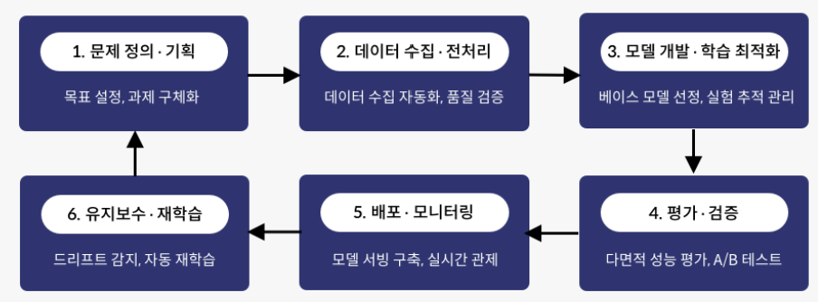

-> 각 단계는 유기적으로 연결되어 있음

-> 단순한 선형적 과정이 아닌, 지속적 개선이 핵심

- AI 개발 단계
    - `문제 정의 → 데이터 수집 → 모델 개발 → 학습 → 성능 형가 → 배포 → 모니터링`
    - 목표
        - AI 시스템 기획하여 운영 환경에 안착
        - 성능 저하나 데이터 드리프트 등 감시하여 유지보수
        - "앤드 투 앤드" 프로세스

# 머신러닝 파이프라인
- 전처리(Preprocessing): 원시 데이터를 모델이 학습할 수 있게 변환
- 추론(Inference): 학습된 모델이 실제 입력에 대해 결과 생성
- 후처리(Postprocessing): 모델 출력 결과를 사용자나 서비스가 쓸 수 있게 다듬음
- 학습(Learning): 모델이 데이터를 보고 가중치를 최적화
- 성능 평가(Evaluation): 학습된 모델 성능 측정

## 전처리 (Preprocessing)
원시(RAW) 데이터를 AI 모델이 처리(학습 또는 추론)할 수 있는 형태로 변환하는 과정

-> 데이터 품질 향상 & 모델 성능 최적화에 영향多

### 컴퓨터 비전
- 크기 조정(Resizing)
    - 모델이 요구하는 입력 크기(폭/높이)로 통일하기 위해 이미지 확대 or 축소

        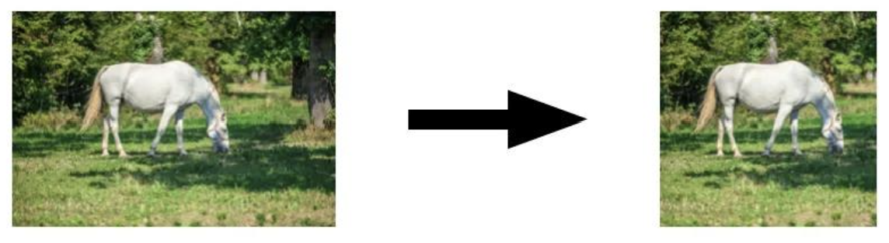
        - 종횡비가 같도록 다운 샘플링하여 이미지 리사이징

- 비율 유지 패딩(Letterbox padding)
    - 이미지의 원래 종횡비(aspect ratio)를 유지하면서 목표 크기로 조정하는 기법

        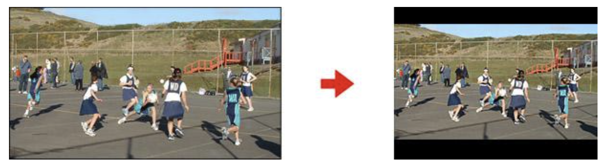
        - 리사이징과 달리 이미지 왜곡시키지XX
        - 대신 여백을 추가함

- 정규화(Normalization)
    - 픽셀 값을 일정 범위(0~1)로 정규화 하거나 표준 편차로 나누어 표준화함

        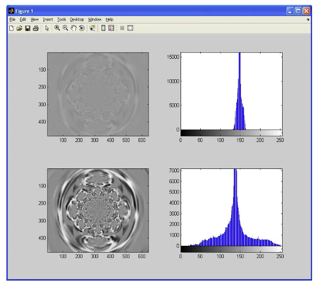
        - 위: 일반 이미지
        - 아래: 정규화된 이미지
    - 다른 이미지를 빠르게 비교 가능하게 만들어 알고리즘 성능 향상시킴
    - 또, 모델의 데이터 수렴 속도를 높여줌

- 색상 보정(Color Correction)
    - 이미지 색상을 조정하여 일관된 색상 표현을 제공하거나 특정 조건(조명, 대비 등)에 맞게 보정하는 기법

        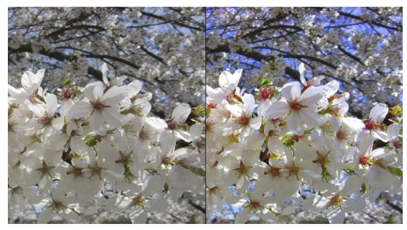
        - 대비와 채도 변경을 통한 색상 보정
    - 다양한 환경에서 촬영된 이미지의 일관성을 높여 모델이 색상 변화에 덜 민감하게 함

- 데이터 증강(Data Augmentation)
    - 회전, 반전, 자르기(Crop), 색 공간변환 등을 통해 원본 이미지를 다양하게 변형함으로써 데이터셋을 확장함

        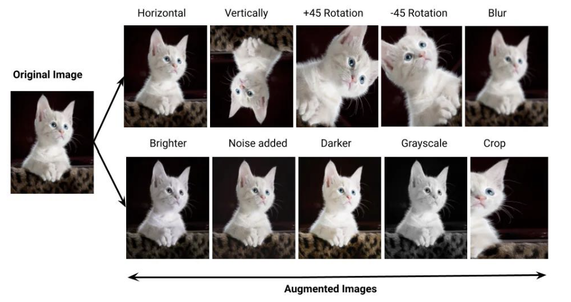
        - 데이터 증강 예시
    - 과적합(Over-fitting) 문제 줄임
    - 모델의 범용성 높임

- 노이즈 제거(Denoising)
    - 가우시안(Gaussian) 필터, 중간값(Median) 필터, 블러링(Blurring) 등을 사용하여 다양한 원인으로 발생하는 이미지의 노이즈를 제거하여 품질을 향상시킴

        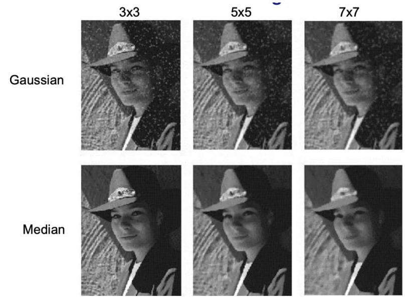

- 임계 값 처리(Thresholding)
    - 특정 임계 값을 기준으로 이미지 픽셀 값을 두가지(이진화)로 단순화하고 이미지의 배경과 객체로 분류

        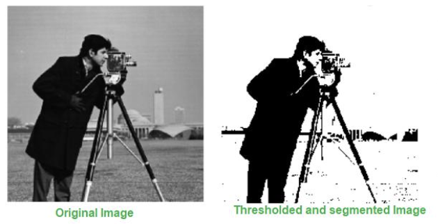

- 경계 감지(Edge Detection)
    - 이미지에서 객체의 경계를 나타내는 (밝기가 급격히 변하는) 지점을 찾아 이미지의 경계를 식별

        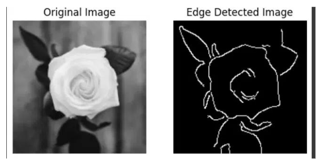

- 이미지 피라미드(Image Pyramid)
    - 원본 이미지의 다양한 해상도 버전을 계층적으로 생성하여 크기가 다른 객체들을 효과적으로 처리

        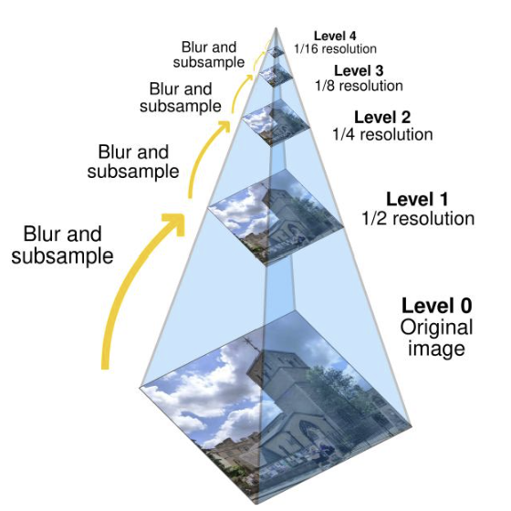

### 자연어 처리
※ 텍스트
- 토큰화(Tokenization)
    - 문장을 단어, 형태소, 서브 워드 또는 문자 수준으로 분할

        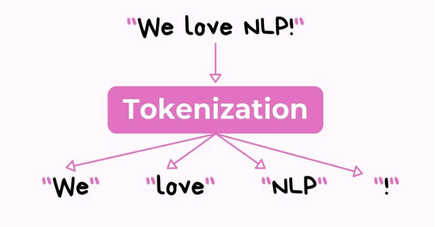
        - ex. "챗봇을 개발합니다" -> ["챗봇", "을", "개발", "합니다"]

- 정제(Cleaning)
    - 텍스트에서 HTML 태그, 이모지, 특수문자, 불용어 등 불필요한 텍스트나 공백을 제거하여 일관된 포맷 유지

        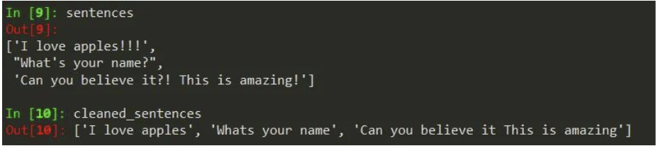

- 텍스트 정규화(Normalization)
    - 텍스트에서 대소문자 통일, 어간 추출(Stemming), 표제어 추출(Lemmatization) 등으로 단어의 기본 형태를 찾음

        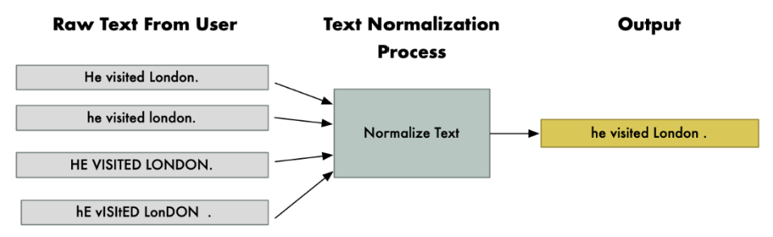
        - ex. '써요', '쓰세요', '썼어요' 등을 '쓰다'로 정규화

- 객체명 인식(Named Entity Recognition, NER)
    - 텍스트에서 인물, 장소, 기관, 날짜 등과 같은 고유 명사를 식별하고 분류함

        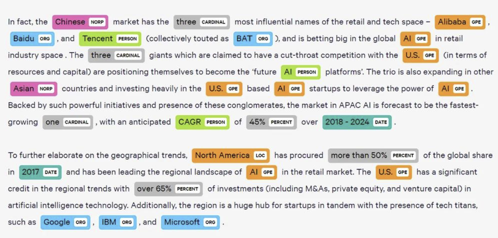
        - ex. "손흥민이 바르셀로나에서 5월 1일 경기를 했다" -> '손흥민'(인물), '바르셀로나'(장소), '5월 1일'(날짜)을 식별함

- 품사 태깅(Pos Tagging)
    - 텍스트의 각 단어에 품사 정보를 부여하여 정확도를 높이는 과정

        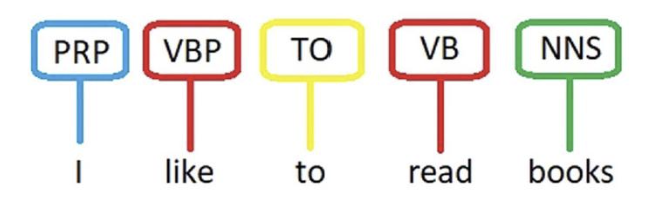
        - ex. '나는' -> '명사 + 조사' 인지 '동사'인지 구분할 수 있게 해줌

- 임베딩(Embedding)
    - RNN이나 Transformer 모델의 입력으로 사용하기 위해 단어나 토큰을 벡터로 변환함

        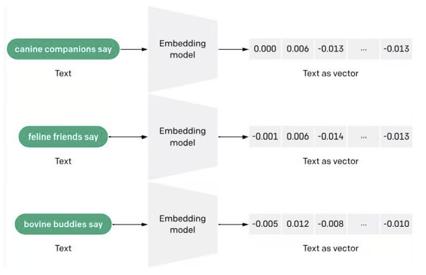

- 시퀀스 패딩(Padding)
    - 모든 문장이나 문서를 동일한 길이로 만들기 위해 길이가 부족한 텍스트에 패딩 토큰을 추가

        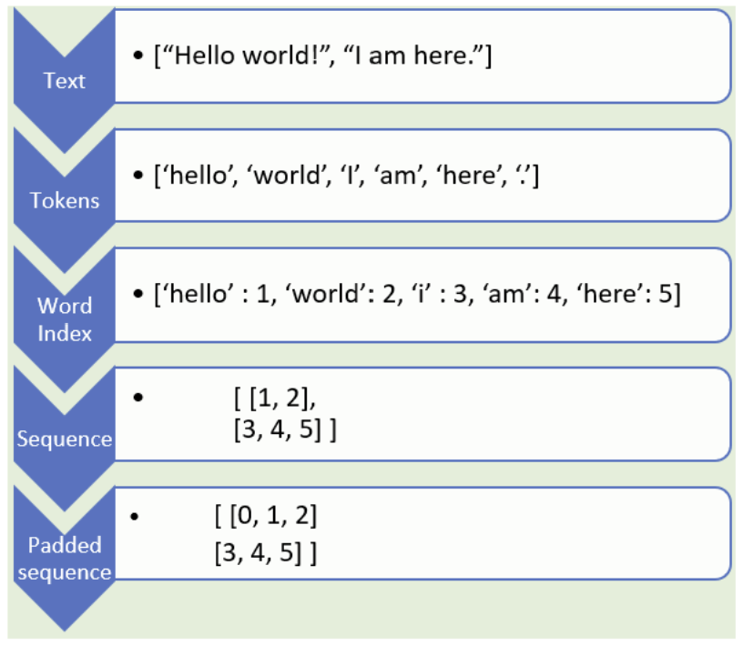

---
※ 음성
- 프레이밍(Framing)
    - 긴 음성 신호를 짧은 구간(프레임)으로 나눔

        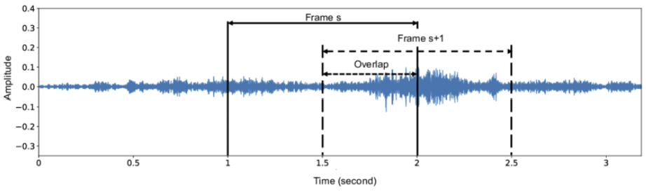
        - 일반적으로 20 ~ 40ms 길이의 프레임을 사용함

- 윈도윙(Windowing)
    - 각 프레임의 가장자리에서 발생하는 불연속성을 완화하기 위해 윈도우 함수를 적용

        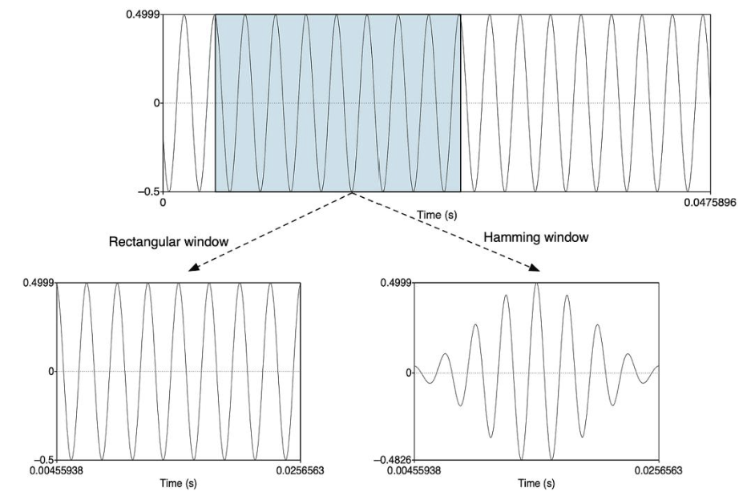
    - 프레임 가장자리의 신호를 부드럽게 감소시켜 스펙트럼 왜곡을 최소화함

- 노이즈 제거(Noise Reduction)
    - 배경 소음, 잡음 등을 제거하여 음성 품질을 향상시킴
    - 스펙트럼 차감법, 위너 필터링, 딥러닝 기반 노이즈 제거 등 다양한 방법이 사용됨

        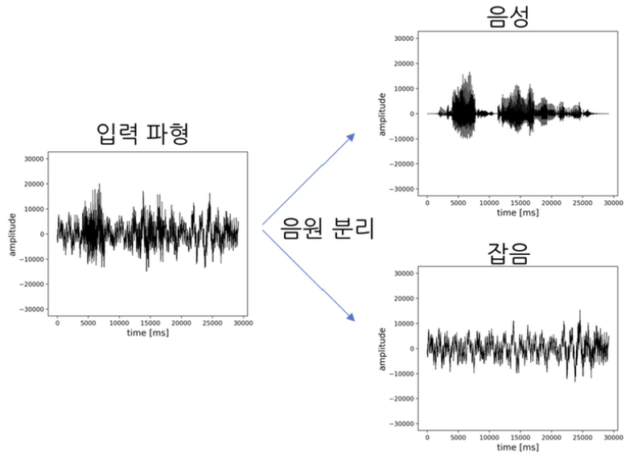

- 음성 정규화(Normalization)
    - 음성 신호의 진폭을 일정 범위로 조정
    - 다양한 녹음 환경과 장비로 인한 볼륨 차이를 보정하여 일관된 입력을 보장함

        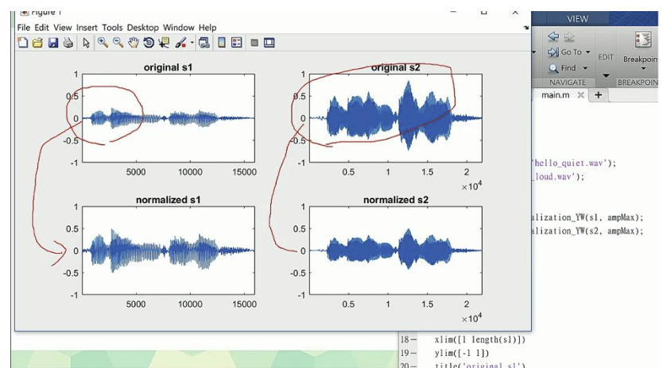

- 묵음 제거(Silence Removal)
    - 음성 신호에서 의미있는 발화가 없는 묵음 구간을 식별하고 제거하여 데이터 처리 효율성을 높이고 정확도를 개선

        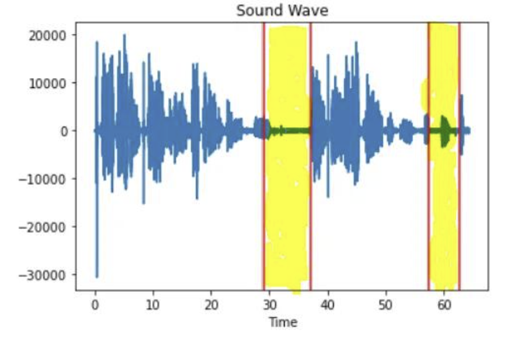
        - 임계값 설정을 통한 묵음 감지

- 특징 추출(Feature Extraction)
    - 음성 인식 모델의 입력을 위해 음성 신호로부터 중요한 특징을 추출
    - MFCC(Mel-Frequency Cepstral Coefficients), Mel-Spectrogram, STFT(Short-Time Fourier Transform)
    - 특히 MFCC는 사람의 청각 시스템을 모방하여 설계되어 음성 인식에 널리 사용됨

        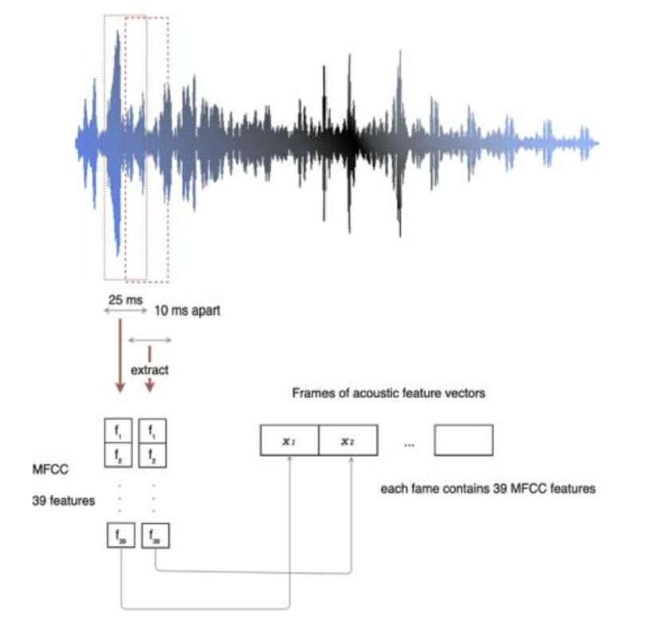
        - 음성 데이터의 특징 추출 과정
    
- 음성 증강(Audio Augmentation)
    - 제한된 음성 데이터셋의 다양성을 증가시키기 위해 시간단축, 피치변경, 노이즈 추가 등의 변형을 적용
    - 모델의 일반화 능력을 향상시키고 과적합을 방지하기 위함

        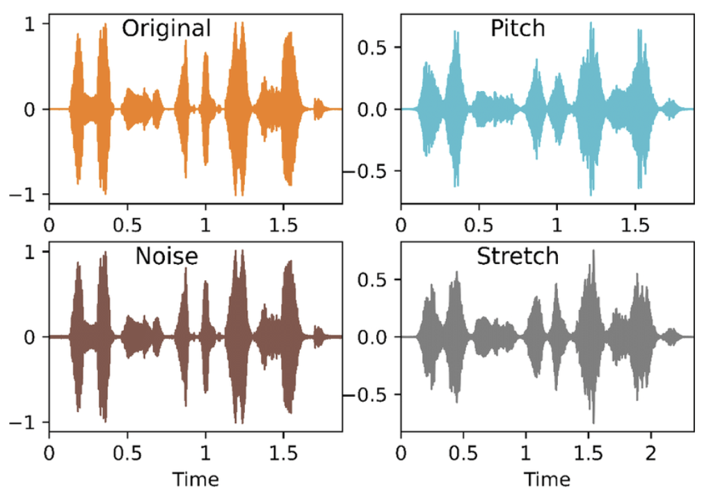

### 추천/예측
- 결측치 처리(Missing Value Imputation)
    - DB나 로그에서 수집된 원본에는 누락값(missing value)이 흔함
    - 결측치를 0 또는 평균으로 채우거나, 제외하거나 보간 또는 직전값으로 대체 

        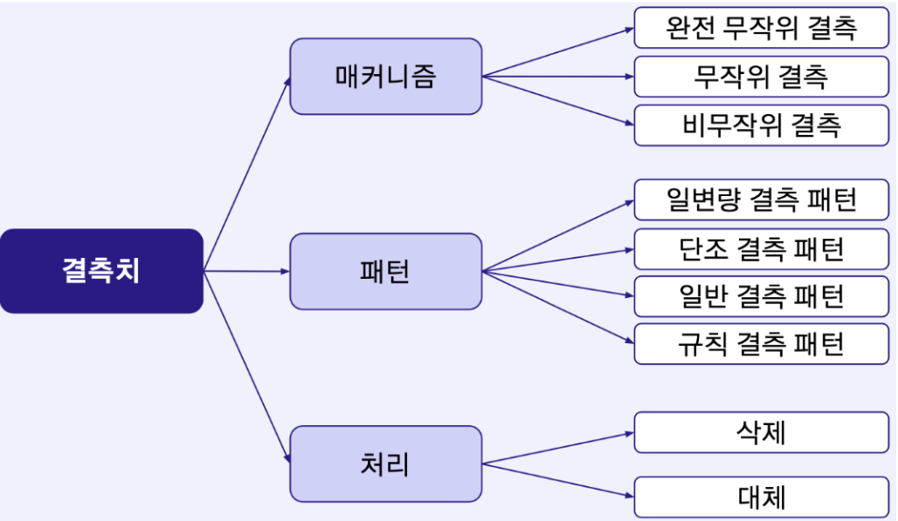
    
- 사용자-아이템 행렬 구성(User-Item Matrix)
    - 추천 알고리즘을 위해 누가(사용자) 무엇(아이템)에 어떤 평가를 했는지 행렬 형태로 구성

        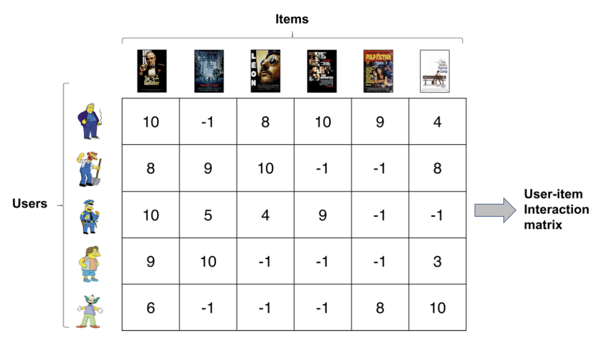
        - 행은 사용자, 열은 영화인 행렬
        - 각 칸에 평점(1~5점)을 기록
        - ex. "사용자 A가 '어벤져스'에 5점, '타이타닉'에 3점을 줌"을 행렬로 표현

- 정규화(Normalization)
    - 다양한 스케일의 특성들을 Min-Max, Z-Score 정규화를 적용하여 동일한 범위로 조정

        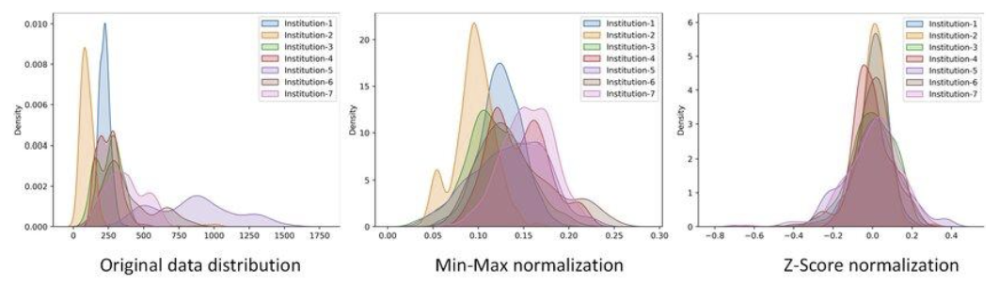
        - ex. 사용자마다 다른 평가 성향을 보정하거나 온도(20-30도)와 습도(30-90%)를 모두 0 ~ 1 사이 값으로 변환

- 차원 축소(Dimensionality Reduction)
21p