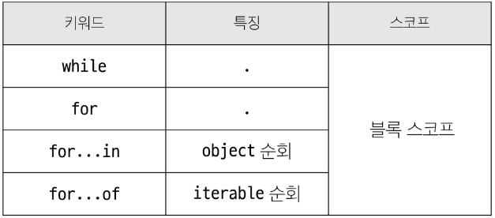
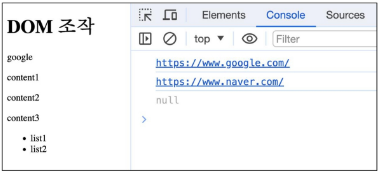

# DOM & Event
## History of JavaScript
### ECMAScript
Ecama International이 정의하고 있는 표준화된 스크립트 프로그래밍 언어 명세

- 스크립트 언어가 준수해야 하는 규칙, 세부사항 등 제공
- ECMAScript의 역사
    - ECMAScript 5(ES5)에서 안정성, 생산성 높임(2009)
    - ECMAScript 2015(ES6)에서 객체지향 프로그래밍 언어로써 많은 발전을 이룸(2018)

### JavaScript
JavaScript는 ECMAScript 표준을 구현한 구체적인 프로그래밍 언어
- ECMAScript의 명세를 기반으로, 웹 브라우저나 Node.js와 같은 환경에서 실행됨

※ ECMAScript와 JavaScript
1. JavaScript는 ECMAScript 표준을 따르는 구체적인 프로그래밍 언어
    - ECMAScript는 JavaScript의 표준
2. JavaScript는 ECMAScript 표준을 따라 구현된 언어로 사용됨
    - ECMAScript는 언어의 핵심을 정의

- JavaScript의 현재
    - 기존 JavaScript는 브라우저에서만 웹 페이지의 동적인 기능을 구현하는 데에만 사용되었음
    - 이후 Node.js로 인해 브라우저에서 벗어나 서버 사이드 분야 뿐만 아니라, 클라이언트 사이드 등 다양한 프레임워크와 라이브러리들이 개발되면서 웹 개발 분야에서 필수적인 언어로 자리 잡게 됨


## 변수
### 변수 선언 키워드
- 식별자(변수명) 작성 규칙
    - 반드시 `문자` , 달러 `$` , 밑줄 `_`로 시작
    - 대소문자 구분O
    - 예약어 사용 불가: for, if, function 등

- 식별자(변수명) Naming case
    - camelCase(카멜 케이스): 변수, 객체, 함수에 사용
    - PascalCase(파스칼 케이스): 클래스, 생성자에 사용
    - SNAKE_CASE(대문자 스네이크 케이스): 상수에 사용

- 변수 선언 키워드 3가지: `let` , `const` , `var`

※ var

-> ES6 이전에는 let, const가 존재하지 않았고, var만 이용해서 변수 선언할 수 있었음

-> 안쓸거얌

- let
    - 블록 스코프(block scope)를 갖는 지역 변수를 선언
    - **재할당 가능**
    - **재선언 불가능**
    ```javascript
    let number = 10     // 선언 및 초기값 할당
    number = 20         // 재할당 가능
    let number = 20     // 재선언 불가능!!!
    ```
    - 내가 선언한 변수가 다른 곳에서 선언되는 것을 방지할 수 있다는 장점 있음

- const
    - 블록 스코프를 갖는 지역 변수를 선언
    - **재할당 불가능**
    - **재선언 불가능**
    ```javascript
    const number = 10   // 선언 및 초기값 할당
    number = 10         // 재할당 불가능
    const numnrt = 20   // 재선언 불가능
    const number        // const' declarations must be initialized
    ```
    - 재할당, 재선언 불가능 하므로 선언 시 반드시 초기값 설정 해야함!

※ 블록 스코프(block scope)
- if, for, 함수 등의 **중괄호{} 내부**를 가리킴
- 블록스코프를 가지는 변수는 블록 바깥에서 접근 불가능

    
    - 블록 스코프 밖의 `let x = 1`은 블록스코프 밖의 영역에서만 영향을 미침 -> `console.log(x) // 1`
    - 블록 스코프 안의 `let x = 2`은 블록스코프 안의 영역에서만 영향을 미침 -> `console.log(x) // 2`
    - let은 재선언 불가능 하지만, 블록스코프에 의해 영역 안에서 선언된 변수는 영역 안쪽에서만 존재할 수 있음
    - 안쪽 영역의 변수가 바깥 영역에 영향을 못미치는 것이지, 바깥 영역에서 선언된 변수를 안쪽 영역에서 못찾는 것은 아님

**※ 기본적으로 const 사용 권장**

-> 재할당이 필요하다면 그때 let으로 변경해서 사용


## 데이터 타입
### 원시 자료형(Primitive type)
변수에 값이 직접 저장되는 자료형(불변, 값이 복사)

- 원시 자료형 종류
    - `Number`, `String`, `Boolean`, `null`, `undefined`

- Number
    - 정수 또는 실수형 숫자를 표현하는 자료형
    - 13(int), 3.14(float), 2.99e8(2.99 * 10^8), Infinity, -Infinity ..
    - NaN(Not a Number를 나타내는 값): 연산할 수 없는 연산을 진행해서 할당하려고 하면 나타남

- String
    - 텍스트 데이터를 표현하는 자료형
    - `+` 연산자를 사용해 문자열끼리 결합
    - 뺄셈, 곱셈, 나눗셈 불가능

    ※ Template literals(템플릿 리터럴)

    -> 내장된 표현식을 허용하는 문자열 작성 방식

    -> Backtick(``)을 이용

    -> 표현식: `$`와 중괄호로 표기. 즉, `${변수}`

    ```javascript
    const age = 100
    const message = `홍길동은 ${age}세 입니다.`
    console.log(message)    // 홍길동은 100세입니다.
    ```

- null
    - 변수의 값이 없음을 표기할 때 사용
    - python의 None처럼 사용하면 됨

- undefined
    - 변수 선언 이후 직접 값을 할당하지 않으면 자동으로 할당됨(할당조차 안됐음을 의미)

    ※ '값이 없음'에 대한 표현이 2가지인 이유

    -> null이 원시 자료형임에도 불구하고 **typeof null 입력하면 object로 출력**됨

    -> 즉, null의 타입은 객체!

    -> JavaScript 설계 당시 버그를 해결하지 않은 것

    -> 해결하지 못한 이유는 이미 null 타입에 의존성을 띄고 있는 수많은 프로그램들이 망가질 수 있기 때문(하위 호환 유지)

- Boolean
    - true / false (소문자)
    - 조건문 또는 반복문에서 boolean이 아닌 데이터 타입은 '자동 형변환 규칙'에 따라 true, false로 변환됨
    - 자동 형변환

        

- 원시 자료형 예시
    - 변수에 할당될 때 값이 복사됨
    - 변수 간 서로 영향을 미치지XX
    ```javascript
    const bar = 'bar'
    console.log(bar)    // bar
    bar.toUpperCase()
    console.log(bar)    // bar

    let a = 10
    let b = a
    b = 20
    console.log(a)  // 10
    console.log(b)  // 20
    ```


### 참조 자료형(Reference type)
객체의 주소가 저장되는 자료형(가변, 주소가 복사)

- `Objects`(Object, Array, Function)

- 참조 자료형 예시
    - 객체를 생성하면 객체의 메모리 주소를 변수에 할당
    - 변수 간에 서로 영향을 미침
    ```javascript
    const obj1 = {name: 'Alice', age: 30}
    const obj2 = obj1
    obj2.age = 40
    console.log(obj1.age)   // 40
    console.log(obj2.age)   // 40
    ```

※ 재할당이란? 어떠한 변수에 할당된 어떠한 데이터 자체를 바꿔 끼우는 것 

-> 처음에 숫자형 넣었다가 문자형 재할당 해버리면 데이터 타입이 바뀌므로 곤란함

-> 참조 자료형 특징을 보면 bar = [1,2,3]을 재할당 하여 bar = '123'은 불가능 하지만, bar[0] = 100은 가능. 즉, bar = [100,2,3]

-> const로 선언하면 재할당 불가능 하기 때문에 선언한 변수의 데이터 타입이 변할 일 없음(const로 선언된 변수는 다른 값을 가리킬 수 없음)

-> 그러나 참조하고 있는 대상의 값(내부)을 바꾸는 것은 가능하기 때문에 내가 원하는 값의 조작은 가능!

-> ex. const로 배열을 선언하면 해당 변수에는 배열의 주소를 가지고 있어서 다른 배열을 넣는 등의 주소값을 바꾸는 행위(재할당)는 불가능 하지만, 같은 배열 내의 값은 조작이 가능함


## 연산자
### 할당 연산자
오른쪽 연산자의 평과 결과를 왼쪽 피연산자에 할당하는 연산자
- 단축 연산자 지원: `+=` , `-=` , `*=` , `%=`

### 증가&감소 연산자
- 증가 연산자 `++`
    - 피연산자를 증가시키고 연산자 위치에 따라 증가하기 전이나 후의 값을 반환
- 감소 연산자 `--`
    - 피연산자를 감소시키고 연산자 위치에 따라 감소하기 전이나 후의 값을 반환

※ `+=` 또는 `-=`와 같이 더 명시적인 표현으로 작성 권장

### 비교 연산자
피연산자들(숫자, 문자, boolean 등)을 비교하고 결과 값을 boolean으로 반환하는 연산자
```javascript
3 > 2   // true
3 < 2   // false
'A' < 'B'   // true
'Z' < 'a'   // true
'가' < '나' // true
```

### 동등 연산자(==)
두 피연산자가 같은 값으로 평가되는지 비교 후 boolean 값 반환
- '암묵적 타입 변환'을 통해 타입을 일치시킨 후 같은 값인지 비교
- 두 피연산자가 모두 객체일 경우 메모리의 같은 객체를 바라보는지 판별
```javascript
console.log(1 == 1)     // true
console.log('hello' == 'hello')   // true
console.log('1' == 1)   // true
console.log(0 == false) // true
// 0 == [] -> true
// 0 == "0" -> true
// "0" == [] -> false
// 이런 이유로 동등 연산자보단 일치 연산자 사용 권장
```

### 일치 연산자(===)
두 피연산자의 값과 타입이 모두 같은 경우 true 반환
- 같은 객체 가리키거나, 같은 타입이면서 같은 값인지 비교
- 엄격한 비교 -> 암묵적 타입 변환 발생XX
- 특수한 경우를 제외하고는 동등 연산자가 아닌 일지 연산자 사용 권장
```javascript
console.log(1 === 1)     // true
console.log('hello' === 'hello')   // true
console.log('1' === 1)   // false
console.log(0 === false) // false
```

### 논리 연산자
- and 연산: `&&`
- or 연산: `||`
- not 연산: `!`
- 단축 평가 지원


## 조건문
### if - else if - else
조건 표현식의 결과값을 boolean 타입을 변환 후 참/거짓 판단
```javascript
const name = 'customer'

if (name === 'admin') {
    console.log('관리자님 환영해요')
} else if (name === 'customer') {
    console.log('고객님 환영해요')
} else {
    console.log(`반갑습니다. ${name}님`)
}
```

### 삼항 연산자
`condition ? expression1 : expression2`
- condition: 평가 조건(true 또는 false로 평가)
- expression1: 조건이 true일 경우 반환할 값 또는 표현식
- expression2: 조건이 false일 경우 반환할 값 또는 표현식
```javascript
const age = 20
const message = (age >= 18) ? '성인' : '미성년자'
console.log(message)    // '성인'
```


## 반복문
`while` , `for` , `for .. in` , `for .. of` 등이 있음

### while
조건문이 참이면 문장을 계속해서 수행
```javascript
let i = 0
while (i < 6) {
    console.log(i)
    i += 1
}
```

### for
특정 조건이 거짓으로 판별될 때까지 반복
```javascript
for (let i=0; i<6 ; i++){
    console.log(i)
}
```
- for문 안에 임시변수 i를 선언함
- i는 증가하니까 let 사용
- 최초 정의한 i를 '재할당'하면서 사용하기 때문에 **const 사용하면 에러!**

### for .. in
객체의 열거 가능한 **속성(property)**에 대해 반복
```javascript
const object = {a: 'apple', b: 'banana'}

for (const property in object) {
    console.log(property)
    console.log(object[property])
}
```
- object 순회 시에만 사용!
- python의 for in과 다름
- for in은 정수가 아닌 이름과 속성을 포함하여 열거 가능한 모든 속성을 반환함
    - 객체 관점에서 배열의 인덱스는 정수 이름을 가진 열거 가능한 속성
    - 내부적으로 for in은 배열의 반복자가 아닌 속성 열거를 사용하기 때문에 특정 순서에 따라 인덱스 반환하는 것을 보장할 수 없음
    - 그래서 인덱스 순서가 중요한 배열에서는 for in을 사용하지XX

### for ... of
반복 가능한 객체(배열, 문자열 등)에 대해 반복
```javascript
const numbers = [0, 1, 2, 3]

for (const number of numbers) {
    console.log(number) // 0, 1, 2, 3
}

const myStr = 'apple'

for (const str of myStr) {
    console.log(str) // a, p, p, l, e
}
```
- const str라는 임시변수에 할당되는 것은 index가 아니라, 배열의 요소 하나하나가 직접적으로 할당됨

※ 배열은 객체이니까 `for in`을 써도 되는거 아닐까?


-> 배열을 할당하면 0 이라는 속성에 a가 할당되고, 1 이라는 속성에 b가 할당되는 것임(딕셔너리 형태)

-> for in은 '속성'에 대해 반복하는 것이므로, for in을 사용하여 순회하면 0, 1, 2 (즉, index)가 출력됨

-> 딕셔너리는 순서가 보장되지 않음! 그래서 배열을 순회하면 index 순으로 순회하는 '것처럼' 보이지만 실제로 그렇지 않다

-> 때문에 객체를 순회할 때는 for of, 배열을 순회할 때는 for of를 사용해야 한다!


※ `for in` , `for of`은 재할당이 아니라, 매 반복마다 다른 속성 이름이 변수에 지정되는 것이므로 const를 사용해도 에러가 발생하지 않음

-> 단, const 특징에 따라 블록 내부에서 변수를 수정할 수 없다

### 반복문 종합



## DOM(The Document Object Model)
- 웹 브라우저에서의 JavaScript는 '웹 페이지의 동적인 기능을 구현'함
- JavaScript 실행 환경 종류
    1. HTML의 script 태그
    2. js 확장자 파일
    3. 개발자도구에 있는 브라우저 Console


### DOM
웹 페이지(Document)를 구조화된 객체로 제공하여 프로그래밍 언어가 페이지 구조에 접근할 수 있는 방법을 제공
- 예를 들어, HTML의 header 영역의 h1 태그, section 영역의 ul 태그, li 태그를 다 객체로 취급하는 것
- 문서 구조, 스타일, 내용 등을 변경할 수 있도록 함

- DOM API
    - 다른 프로그래밍 언어가 웹 페이지에 접근 및 조작 가능하도록 페이지 요소들을 객체 형태로 제공
    - 이에 따른 메서드 또한 제공

- DOM 특징
    - DOM에서 모든 요소, 속성, 텍스트는 하나의 객체
    - 모두 document 객체의 하위 객체로 구성됨

        

- DOM tree
    - 브라우저는 HTML 문서를 해석하여 DOM tree라는 객체 트리로 구조화
    - 객체 간 상속 구조 존재
    
        
    

※ 브라우저가 웹 페이지를 불러오는 과정

-> 웹 페이지는 웹 브라우저를 통해 해석되어 웹 브라우저 화면에 나타남


- DOM 핵심
    - 문서의 요소들을 객체로 제공하여 다른 프로그래밍 언어에서 접근, 조작할 수 있는 방법을 제공하는 API
    - 즉, HTML로 만들어놓은 문서의 요소를 객체로 만들어서 프로그래밍 언어인 JavaScript에서 자바 스크립트의 객체처럼 조작, 사용할 수 있다!
   

### document 객체
웹 페이지 객체(브라우저 열었을 때 보이는 화면 자체)

- DOM Tree의 진입점
- 페이지를 구성하는 모든 객체 요소를 포함

- console 창에서 HTML의 title 변경 가능

    
    - 콘솔창이 아닌, 자바스크립트 코드 형식으로는 어떻게 바꿀 수 있을까? '객체 선택'이 우선적


### DOM 선택
※ DOM 조작 시 기억해야 할 것

웹 페이지를 동적으로 만들기 == 웹 페이지를 조작하기

- 조작 순서
    1. 조작하고자 하는 요소 **선택(탐색)**
    2. 선택된 요소의 콘텐츠 또는 속성을 **조작**

    -> 선택, 조작을 위해서는 어떠한 행동(메서드) 필요
    
    -> 객체에 속해있는 함수를 '메서드'라고 하는데
    
    -> document를 조작하려면 document가 가진 메서드를 이용해야 함

- 선택 메서드
    - `document.querySelector(선택자)`
        - 제공한 선택자와 일치하는 요소 한 개 선택
        - 제공한 CSS selector를 만족하는 **첫 번째 element 객체를 반환**(없다면 null 반환)
    - `document.querySelectorAll(선택자)`
        - 제공한 선택자와 일치하면 요소 여러 개 선택
        - 제공한 CSS seletor를 만족하는 NodeList를 반환
    
    
    - 여러 p태그에 content가 존재하지만 querySelector 사용했으므로 첫 번째 요소인 content1만 선택됨


### DOM 조작
1. 속성(attribute) 조작
    - 클래스 속성 조작 'classList' property
        - 요소의 클래스 목록을 DOMTokenList(유사 배열) 형태로 반환
        
        ※ 태그에 클래스 작성할 때 그 클래스가 'classList'형태로 만들어 짐

        -> 왜 리스트인가? class는 여러 개를 담을 수 있고, 여러 개를 담을 수 있는 형태로 만들려면 list로 만들어야 하기 때문

    - classList 메서드
        - `element.classList.add()` : 지정한 클래스 값 추가
        - `element.classList.remove()` : 지정한 클래스 값 제거
        - `element.classList.toggle()` : 클래스가 존재한다면 제거하고 false 반환(존재하지 않으면 클래스 추가하고 true 반환)
    
        ```javascript
        const h1Tag = document.querySelector('.heading')
        console.log(h1Tag.classList)

        h1Tag.classList.add('red')
        console.log(h1Tag.classList)

        h1Tag.classList.remove('red')
        console.log(h1Tag.classList)
        ```
        

    - 일반 속성 조작 메서드
        - `Element.getAttribute()` : 해당 요소에 지정된 값 반환(조회)
        - `Element.setAttribute(name, value)` : 지정된 요소의 속성 값 설정(속성이 이미 있으면 기존 값 갱신)
        - `Element.removeAttribute()` : 요소에서 지정된 이름을 가진 속성 제거

        ```javascript
        const aTag = document.querySelector('a')
        console.log(aTag.getAttribute('href'))

        aTag.setAttribute('href', 'https://www.naver.com/')
        console.log(aTag.getAttribute('href'))

        aTag.removeAttribute('href')
        console.log(aTag.getAttribute('href'))
        ```
        

2. HTML 콘텐츠 조작
    - 'textContent' property
        - 요소의 텍스트 콘텐츠를 표현
        - `<p> lorem </p>`
        - 여는 태그와 닫는 태그 사이의 텍스트 콘텐츠 조작

        ```javascript
        const h1Tag = document.querySelector('.heading')
        console.log(h1Tag.textContent)

        h1Tag.textContent = '내용 수정'
        console.log(h1Tag.textContent)
        ```
        

3. DOM 요소 조작
    - `document.createElement(tagName)`
        - 작성한 태그 이름의 HTML 요소를 생성하여 반환
    - `Node.appendChild()`
        - 한 node를 특정 부모 node의 자식 nodelist 중 마지막 자식으로 삽입
        - 추가된 Node 객체를 반환
    - `Node.removeChild()`
        - DOM에서 자식 Node를 제거
        - 제거된 Node 반환
    ```javascript
    // 생성
    const h1Tag = document.createElement('h1')
    h1Tag.textContent = '제목'
    console.log(h1Tag)

    // 추가
    const divTag = document.querySelector('div')
    divTag.appendChild(h1Tag)
    console.log(divTag)

    // 삭제
    const pTag = document.querySelector('p')
    divTag.removeChild(pTag)
    ```

4. 스타일 조작
    - 'style' property
        - 해당 요소의 모든 style 속성 목록을 포함하는 속성
    
    ```javascript
    const pTag = document.querySelector('p')

    pTag.style.color = 'crimson'
    pTag.style.fontSize = '2rem'
    pTag.style.border = '1px solid black'

    console.log(pTag.style)
    ```
    - 이런 방식으로 스타일 지정하는 것은 인라인 스타일을 직접 지정하는 것과 같음
    - 브라우저 입장에서 보면 `<p style="color: crimson;"></p>` 이렇게 작성한 것
    - 우리는 이 방법 쓰지 않고 클래스를 추가, 제거하는 방식으로 제어하자
        ```html
        <style>
        .highlight {
            color: crimson;
            font-size: 2rem;
            border: 1px solid black;
        }
        </style>
        <p>문단입니다</p>
        ```
        ```javascript
        const pTag = document.querySelector('p');
        pTag.classList.add('highlight');
        ```


## 참고
### Node
DOM의 기본 구성 단위
- DOM 트리의 각 부분은 Node라는 객체로 표현됨
    - Document Node -> HTML 문서 전체를 나타내는 노드
    - Element Node -> HTML 요소를 나타내는 노드
    - Text Node -> HTML 텍스트(Element Node 내의 텍스트 컨텐츠)
    - Attribute Node -> HTML 요소의 속성을 나타내는 노드

### NodeList
DOM 메서드를 사용해 선택한 Node 목록
- 배열과 유사한 구조
- index로만 각 항목에 접근 가능
- JavaScript의 배열 메서드 사용 가능
- querySelectotAll()에 의해 반환되는 NodeList는 DOM의 변경 사항을 실시간으로 반영하지 않음
    - DOM이 나중에 변경되더라도 이전에 이미 선택한 NodeList 값은 변하지XX

### Element
DOM 트리에서 HTML 요소를 나타내는 특별한 유형의 Node
- Node의 하위 유형
- `<p>, <div>, <span>, <body>` 등 HTML 태그들이 Element 노드를 생성
- Node의 속성과 메서드를 모두 가지고 있으며, 추가적으로 요소 특화된 기능(className, innerHTML, id 등)을 가지고 있음
- 모든 Element는 Node이지만, 모든 Node가 Element인 것은 아님

※ DOM 속성 확인 Tip

개발자도구 -> Elements -> Properties로 해당 요소의 모든 DOM 속성 확인 가능함

### Parsing
브라우저가 문자열을 해석하여 DOM Tree로 만드는 과정


## 함수
**참조 자료형**에 속하며 **모든 함수는 Function object**

### 함수 구조
```javascript
function name ([param[, param, [..., param]]]){
    statements
    return value
}
```
- function 키워드
- 함수 이름
- 함수의 매개변수
- 함수의 body를 구성하는 statements
- return으로 반환
    - 단, return값이 없다면 undefined를 반환

### 함수 정의 2가지 방법
- 선언식
    ```javascript
    function funcName() {
        statements
    }
    ```
    - 함수를 할당하는 것이 아니라, 말 그대로 선언하는 것
    - python의 함수 선언 방식과 동일

- 표현식
    ```javascript
    const funcName = function() {
        statements
    }
    ```
    - 어떠한 평가에 의해 하나의 값으로 나타낼 수 있는 형식을 표현식이라고 함
    - 함수를 객체로써 다루어 함수 정의 방식을 하나의 값으로 나타날 수 있는 형태(표현식)로 만들어 변수에 할당하는 것

    - 함수 이름이 없는 '익명 함수'를 사용할 수 있음(함수 이름을 변수 명으로 대체하는 느낌)
    - 선언식과 달리 표현식으로 정의한 함수는 호이스팅 되지 않으므로 함수 정의 전에 먼저 사용할 수 없음
    - 선언식 보다 **표현식 사용 권장**

### 매개변수
1. 기본 함수 매개변수(Default function parameter)
    - 전달하는 인자가 없거나 undefined가 전달될 경우 이름 붙은 매개변수를 기본값으로 초기화(기본값 설정하는거)
    ```javascript
    const greeting = function (name = 'Anonymous') {
      return `Hi ${name}`
    }
    ```

2. 나머지 매개변수(Rest Parameters)
    - 임의의 수의 인자를 '배열'로 허용하여 가변 인자를 나타내는 방법
    ```javascript
    const myFunc = function (num1, num2, ...restArgs) {
      return [num1, num2, restArgs]
    }
    console.log(myFunc(1, 2, 3, 4, 5)) // [1, 2, [3, 4, 5]]
    console.log(myFunc(1, 2)) // [1, 2, []]
    ```
    - 함수 정의 시 나머지 매개변수는 하나만 작성할 수 있음
    - 나머지 매개변수는 함수 정의에서 매개변수 마지막에 위치해야 함

※ 매개변수와 인자 개수가 불일치할 때(매개변수 개수 > 인자 개수) -> 누락된 인자는 undefined로 할당

※ 매개변수와 인자 개수가 불일치할 때(매개변수 개수 < 인자 개수) -> 초과 입력한 인자는 사용하지XX

```javascript
    // 매개변수 개수 > 인자 개수
    const threeArgs = function (num1, num2, num3){
      return [num1, num2, num3]
    }
    console.log(threeArgs()) // [undefiend, undefiend, undefiend]
    console.log(threeArgs(1)) // [1, undefiend, undefiend]
    console.log(threeArgs(2, 3)) // [2, 3, undefiend]

    // 매개변수 개수 < 인자 개수
    const noArgs = function () {
      return 0
    }
    console.log(noArgs(1, 2, 3)) // 0

    const twoArgs = function (num1, num2) {
      return [num1, num2]
    }
    console.log(twoArgs(1, 2, 3)) // [1, 2]
```

### Spread syntax
`...` 전개구문

- 배열이나 문자열과 같이 반복 가능한 항목을 펼치는 것(확장, 전개)
- 전개 대상에 따라 역할이 다름
    - 배열이나 객체의 요소를 개별적인 값으로 분리하거나
    - 다른 배열이나 객체의 요소를 현재 배열이나 객체에 추가하는 등
- python의 패킹, 언패킹과 동일

- 전개 구문 활용처
    1. 함수와의 사용
        - 함수 호출 시 인자 확장
            ```javascript
            function myFunc(x, y, z) {
            return x + y + z
            }
            let numbers = [1, 2, 3]
            console.log(myFunc(...numbers)) // 6
            ```
        - 나머지 매개변수(압축)
            ```javascript
            function myFunc2(x, y, ...restArgs) {
            return [x, y, restArgs]
            }
            console.log(myFunc2(1, 2, 3, 4, 5)) // [1, 2, [3, 4, 5]]
            console.log(myFunc2(1, 2)) // [1, 2, []]
            ```
    2. 객체와의 사용(객체 파트에서 진행)
    3. 배열과의 사용(배열 파트에서 진행)


### 화살표 함수
함수 표현식의 간결한 표현법


1. **function 키워드 제거 후 매개변수와 중괄호 사이에 화살표 작성**
2. 함수의 매개변수가 하나 뿐이라면 매개변수의 소괄호 제거 가능(단, 생략하지 않는 것을 권장)
3. 함수 본문의 표현식이 한 줄이라면 중괄호와 return 제거 가능
    ```javascript
    const arrow1 = function (name){
        return `hello, ${name}`
    }

    // 1. function 키워드 삭제 후 화살표 작성
    const arrow2 = (name) => {return `hello, ${name}`}

    // 2. 인자의 소괄호 삭제 (인자가 1개일 경우에만 가능)
    const arrow3 = name => { return `hello, ${name}` }

    // 3. 중괄호와 return 삭제 (함수 본문이 return을 포함한 표현식 1개일 경우에만 가능)
    const arrow4 = name => `hello, ${name}`
    ```
    - 1번만 사용 예정! 2번 이후부터는 알고만 있을 것

4. 인자가 없다면 소괄호 또는 _ 로 표시 가능
5. object를 return 한다면 return을 명시적으로 작성해야 함
6. return을 작성하지 않으려면 객체를 소괄호로 감싸야 함

    

※ 화살표 함수 사용 이유

-> 화살표 함수의 장점은 단순히 키워드 지우는 것이 아니라, 객체(Object)를 다룰 때 신경써야 하는 부분을 없앨 수 있다는 압도적인 장점이 존재함


### 참고
- 세미콜론(semicolon)
    - 자바스크립트는 문장 마지막 세미콜론(;)을 선택적으로 사용 가능
    - 세미콜론이 없으면 ASI에 의해 자동으로 세미콜론 삽입됨
        - ASI(Automatic Semicolon Insertion, 자동 세미콜론 삽입 규칙)
    - JavaScript를 만든 Brendan Eich가 세미콜론 작성 반대했대. 안써~


## 이벤트
- 웹에서의 이벤트
    - 화면 스크롤
    - 버튼 클릭 시 팝업 창 출력
    - 마우스 커서 위치에 따라 드래그 앤 드롭하는 것
    - 사용자의 키보드 입력 값에 따라 새로운 요소를 생성하는 것
- **웹에서의 모든 동작은 이벤트 발생과 함께 한다!**

### event 객체
무언가 일어났다는 신호, 사건으로, DOM에서 이벤트 발생했을 때 생성되는 객체

- 모든 DOM 요소는 이러한 event를 만들어 냄
- 이벤트 종류
    - mouse, input, keyboard, touch ..
    - 외우지 말고 mdn 문서 활용하기
- DOM 요소는 event를 받고, 받은 event를 '처리'할 수 있음
    - 뭘로 처리하냐? event handler(이벤트 처리기)

※ 버튼을 만든다고 하자. 우리는 html로 코드 작성하고 CSS로 스타일 정의하고 JS로 동적인 코드 작성했을 때 브라우저에 의해 화면에 나타난 버튼을 볼 수 있다.

-> 버튼은 객체이고, 객체가 행동하려면 함수가 정의되어 있어야 함

-> 그 함수를 언제 호출할 것인가? "버튼이 클릭되는 시점"

-> 버튼에게 귀를 달아서 클릭되는 것을 듣고 핸들링할 수 있도록 할 것이다


### event handler
이벤트가 발생했을 때 실행되는 함수
- 사용자 행동에 어떻게 반응할지 JavaScript 코드로 표현한 것

- `.addEventListener()`
    - 특정 이벤트를 DOM 요소가 수신할 때마다 콜백 함수를 호출
    - event handler(이벤트 발생 시 실행되는 함수)를 실행시키기 위한 귀의 역할을 함
    
    
    - **대상(DOM요소)**에 **특정 Event(수신할 이벤트)**가 발생하면, **지정한 이벤트를 받아 할 일(콜백 함수)**을 등록한다!
    - addEventListener는 함수가 아닌, DOM 요소의 메서드이므로 '이벤트를 누구에게 부착할 것인지' 꼭 입력해야 함(DOM 요소 필수!)

- addEventListener의 인자
1. type
    - 수신할 이벤트 이름
    - 문자열로 작성(ex. 'click')
2. handler
    - 발생한 이벤트 객체를 수신하는 콜백 함수
    - 콜백 함수는 발생한 event object를 유일한 매개변수로 받음

- addEventListener 활용
    - 버튼 클릭하면 버튼 요소 출력하기
    ```html
    <button id="btn">버튼</button>
    ```
    ```javascript
    // 1. 버튼 선택
    const btn = document.querySelector('#btn')

    // 2. 콜백 함수
    const detectClick = function (event) {
      console.log(event) // PointerEvent
      console.log(event.currentTarget) // <button id="btn">버튼</button>
      console.log(this) // <button id="btn">버튼</button>
    }

    // 3. 버튼에 이벤트 핸들러를 부착
    btn.addEventListener('click', detectClick)
    ```
    - 버튼에 이벤트 처리기를 부착하여 클릭 이벤트가 발생하면 이벤트가 발생한 버튼 정보를 출력
    - 요소에 addEventListener를 부착하게 되면 내부의 this 값은 대상 요소를 가리키게 됨(event 객체의 currentTarget 속성 값과 동일)

- addEventListener의 콜백 함수 특징
    - 발생한 이벤트를 나타내는 event 객체를 유일한 매개변수로 받음
    - 반환 값 없음


### 버블링(Bubbling)
한 요소에 이벤트가 발생하면 이 요소에 할당된 핸들러가 동작하고, 이어서 부모 요소의 핸들러가 동작하는 현상

- 가장 최상단의 조상 요소(document)를 만날 때까지 이 과정이 반복되면서 요소 각각에 할당된 핸들러가 동작
- 이벤트가 제일 깊은 곳에 있는 요소에서 시작에 부모 요소를 거슬러 올라가며 발생하는 것이 거품과 닮아서 버블링이라 함

- 예시
    ```javascript
    const formElement = document.querySelector('#form')
    const divElement = document.querySelector('#div')
    const pElement = document.querySelector('#p')

    const clickHandler1 = function (event) {
      console.log('form이 클릭되었습니다.')
    }
    const clickHandler2 = function (event) {
      console.log('div가 클릭되었습니다.')
    }
    const clickHandler3 = function (event) {
      console.log('p가 클릭되었습니다.')
    }

    formElement.addEventListener('click', clickHandler1)
    divElement.addEventListener('click', clickHandler2)
    pElement.addEventListener('click', clickHandler3)
    ```
    - from > div > p 형태의 중첩된 구조에 각각 이벤트 핸들러가 있을 때 p 요소를 선택한다면
    - p만 클릭 했음에도 p -> div -> form 순서로 3개의 이벤트 핸들러가 모두 동작

    
    
    - 그렇다면 div 리스너와 p 리스너는 필요 없을 것임. 왜? p를 클릭해도, div를 클릭해도 부모를 타고 결국 form이 클릭됨을 알려주기 때문
    ```javascript
    const formElement = document.querySelector('#form')

    const clickHandler = function (event) {
    if (event.target.id === 'p') {
        console.log('p가 클릭되었습니다.')
    } else if (event.target.id === 'div') {
        console.log('div가 클릭되었습니다.')
    } else if (event.target.id === 'form') {
        console.log('form이 클릭되었습니다.')
    }
    }
    formElement.addEventListener('click', clickHandler)
    ```


### 이벤트가 정확히 어디서 발생했는지 접근할 수 있는 방법
- `event.currentTarget`
    - currentTarget 속성
    - '현재' 요소
    - 항상 이벤트 핸들러가 연결된 요소만을 참조하는 속성
    - 'this'와 같음

- `event.target`
    - target 속성
    - 이벤트가 발생한 가장 안쪽의 요소(target)를 참조하는 속성
    - 실제 이벤트가 시작된 요소
    - 버블링이 진행되어도 변하지 않음

    
    - 리스너가 outerouter에만 존재할 때
    - inner를 클릭하면 inner가 실제 이벤트 시작 요소(target)이고
    - inner의 부모 요소 중 리스너가 연결된 outerouter가 핸들러 연결된 요소(currentTarget)
        - 클릭 이벤트가 어디서 발생했든 outerouter까지 이벤트가 버블링되어 핸들러를 실행시키기 때문에
        - 핸들러는 outerouter에만 할당되어 있지만 하위 요소 inner, outer를 클릭해도 해당 핸들러가 동작함


### 캡처링(capturing)
이벤트가 하위 요소로 전파되는 단계(버블링과 반대)


- table 안에 td를 클릭하면 이벤트는 최상위 요소부터 아래로 전파
- 실제 이벤트 발생 지점(event.target)에서 실행된 후 다시 위로 전파
    - 이 과정에서 상위 요소에 할당된 이벤트 핸들러가 호출되는 것
- 캡처링까지 제어할 일은 거의 없음. 버블링에 집중하자

※ 버블링이 필요한 이유
1. 각자 다른 동작을 수행하는 버튼이 여러개 있다고 가정
2. 각 버튼마다 서로 다른 이벤트 핸들러를 할당하는 것이 아니라, 각 버튼의 공통 조상인 요소에 이벤트 핸들러 단 하나만 할당
3. 공통 조상에서 할당한 핸들러에서 `event.target` 이용하면 실제 어떤 버튼에서 이벤트가 발생했는지 알 수 있기 때문

※ `currentTarget` 주의사항
1. console.log()로 event 객체 출력 시 currentTarget 키의 값은 null
2. currentTarget은 이벤트가 처리되는 동안에만 사용할 수 있기 때문
3. 대신 `console.log(event.currentTarget)`을 사용하여 콘솔에서 확인 가능
4. currentTarget 이후의 속성 값들은 `target`을 참고해서 사용하기


### 이벤트의 기본 동작 취소하기
HTML의 각 요소가 기본적으로 가지고 있는 이벤트가 때로는 방해되는 경우가 있어 이벤트의 기본 동작을 취소할 필요가 있음

1. ex. from 요소의 제출 이벤트를 취소하여 페이지 새로고침 막을 수 있음
2. ex. a 요소 클릭 시 페이지 이동을 막고 추가 로직을 수행할 수 있음

- `.preventDefault()`
    - 해당 이벤트에 대한 기본 동작을 실행하지 않도록 지정

- 예시
    ```html
    <!-- copy 이벤트 동작 취소 -->
    <h1>중요한 내용</h1>
    <script>
        const h1Tag = document.querySeletor('h1')

        h1Tag.addEventListener('copy', function (event) {
            console.log(event)
            event.prevenDefault()
            alert('복사할 수 없음')
        })
    </script>
    
    <!-- form 제출 시 페이지 새로고침 동작 취소 -->
    <form id = "my-form">
        <input type="text" name="username">
        <button type="submit">Submit</button>
    </form>
    <script>
        const formTag = document.querySeletor('#my-form')

        const handleSubmit = function (event) {
            event.preventDefault()
        }
        formTag.addEventListener('submit', handleSubmit)
    </script>
    ```

