# Asynchronous JavaScript
## 객체(Object)
키로 구분된 데이터 집합(data collection)을 저장하는 자료형

### 객체 구조
```javascript
const user = {
    name: 'Alice',          // 문자형 key(평소에 사용)
    'key with space': true, // 문자열 key(공백 있을 때 사용)
    greeting: function () { // 함수 표현식 사용해서 할당 가능
    return 'hello'
    }
}
```
- 중괄호를 이용해 작성
- 중괄호 안에는 key: value 쌍으로 구성된 속성(property)를 여러 개 작성 가능
- key는 문자형만 허용(문자열 아니고 변수 정의하듯 정의)
- value는 모든 자료형 허용
    - 함수도 객체이므로 value에 함수 들어갈 수 있음
- 속성 참조
    - 점( `.` , chaining operator) 또는 대괄호로 객체 요소 접근
    - key 이름에 띄어쓰기와 같은 구분자가 있으면 대괄호 접근만 가능
    ```javascript
    // 조회
    console.log(user.name) // Alice
    console.log(user['key with space']) // true

    // 추가
    user.address = 'korea'
    console.log(user) // {name: 'Alice', key with space: true, address: 'korea', greeting: ƒ}

    // 수정
    user.name = 'Bella'
    console.log(user.name) // Bella

    // 삭제
    delete user.name
    console.log(user) // {key with space: true, address: 'korea', greeting: ƒ}
    ```

- in 연산자
    - 속성이 객체에 존재하는지 여부 확인
    ```javascript
    console.log('greeting' in user) // true
    console.log('country' in user) // false
    ```

### 객체와 함수
객체 속성에 정의된 함수 == **Method**
- object.method() 방식으로 호출
- 메서드는 객체를 '행동'할 수 있게 함
    ```javascript
    console.log(user.greeting())
    ```
- 우리는 클래스 인스턴스 메서드 정의했었음. 첫 인자를 self로 넘겨줌으로써 인스턴스의 속성을 호출하는 형식으로 사용했었다
- 'this' 키워드 사용해서 객체에 대한 특정 작업 수행 가능

### this
**함수나 메서드를 호출한 객체**를 가리키는 키워드
- 함수 내에서 객체의 속성 및 메서드에 접근하기 위해 사용
    ```javascript
    // Method & this 예시
    const person = {
      name: 'Alice',
      greeting: function () {
        return `Hello my name is ${this.name}`
      },
    }

    console.log(person.greeting()) // Hello my name is Alice
    ```
    - person 객체가 greeting 메서드를 호출했기 때문에 this는 person을 가리킴
    - 그래서 this.name이 person.name과 같은 것

- JavaScript에서 `this`는 함수를 **호출하는 방법**에 따라 가리키는 대상이 다름
    - **단순 호출 -> 전역 객체**를 가리킴
    - **메서드 호출 -> 메서드를 호출한 객체**를 가리킴
    ```javascript
    // 1.1 단순 호출
    const myFunc = function () {
      return this
    }
    console.log(myFunc()) // window

    // 1.2 메서드 호출
    const myObj = {
      data: 1,
      myFunc: function () {
        return this
      }
    }
    console.log(myObj.myFunc()) // myObj
    ```
    - 함수만 호출하는게 단순 호출
    - `.`을 통해 메서드를 호출한 객체가 있다면 메서드 호출

    ※ 단순 호출 vs 메서드 호출 주의

    

    1. obj 객체를 정의할 때 greeting 함수를 함께 정의함
    2. gr이라는 변수에 obj 객체의 메서드인 greeting을 할당
    3. gr() 함수를 실행시켰을 때 '단순 호출'이기 때문에 window를 가리키게 됨

    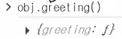
    - 메서드로서 obj가 가진 greeting함수를 호출하면 obj를 가리키게 됨


### 중첩된 함수에서의 this 문제점과 해걸책
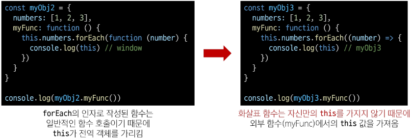

- 메서드(forEach)에 의해 호출될 함수(function(number))를 정의했을 때, 이 콜백 함수의 this는 Window를 가리킴

- this를 myFunc 내부에 정의했고, myObj2.myFunc()으로 메서드 호출한 것처럼 보이지만!!

- 실제로 myFunc은 메서드로 호출된 것이 맞지만 this에 해당하는 this.numbers 즉, numbers 배열이 가진 forEach라는 arrayhelper 메서드에 의해 콜백함수(익명함수)가 '단순 호출'되었기 때문에 this는 window를 바라본다!!!!

- 이 문제는 콜백함수를 arrow 함수로 정의하면 됨

- **Function 키워드 없애고 화살표로 만들어 주는 것이 중요!**

- 간단하게 "중첩 함수(콜백함수)가 호출될 때 콜백 함수는 단순 호출이기 때문에 this가 전역을 가리키기 때문에 이를 해결하기 위해 화살표 함수를 쓴다" 정도로 생각하기

※ arrowfunction의 실제 용도

-> 키워드를 없애는 것이 아닌, this를 호출했을 때 '나'를 가리키는 것이 아니라 **내가 속해있는 곳의 this(외부 함수의 this)를 따라가도록 되어있**기 때문에 이를 활용하려고 쓰는 것임


- JavaScript `this` 정리
    1. 자바 스크립트 함수는 호출될 때 this를 암묵적으로 전달받음
    2. 자바 스크립트에서 this는 함수 호출 방식에 따라 결정되는 현재 객체를 나타냄
    3. python의 self와 java의 this가 선언 시 이미 값이 정해지는 것에 비해 javascript의 this는 함수 호출 전까지 값이 할당되지 않고 호출 시에 결정됨(동적 할당)

-  this가 이미 정해지지 않고 호출 방식에 의해 결정되는 것은
    - 함수(메서드) 하나만 만들어 여러 객체에서 재사용할 수 있다는 장점과
    - 이런 유연함이 실수로 이어질 수 있다는 단점이 있다(실수 안하면 댐.)

### 추가 객체 문법
1. 단축 속성
    - 키 이름과 값으로 쓰이는 변수 이름이 같은 경우 '단축 구문' 사용 가능

        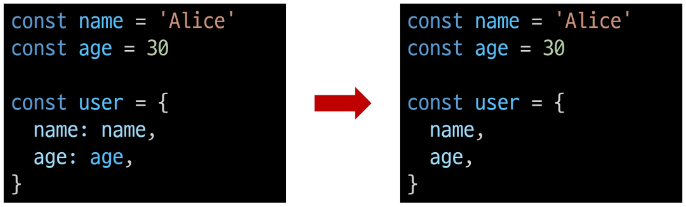

2. 단축 메서드
    - 메서드 선언 시 function 키워드 생략 가능

        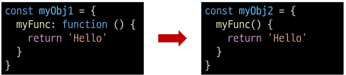
    
3. 계산된 속성
    - 객체의 key값 정의 시 연산 결과나 사용자 입력 값을 키 값으로 사용할 수 있음

        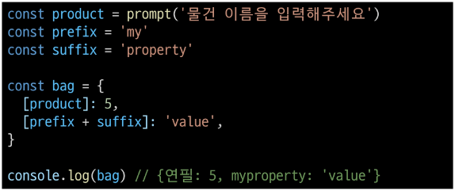

4. 구조 분해 할당
    - 배열 또는 객체를 분해하여 객체 속성을 쉽게 할당할 수 있는 문법
    - 변수 명이랑 key값 동일하면 생략할 수 있는 것처럼(단축 속성), 객체 속성 명이랑 정의하려는 변수 명이랑 동일하면 생략 가능

        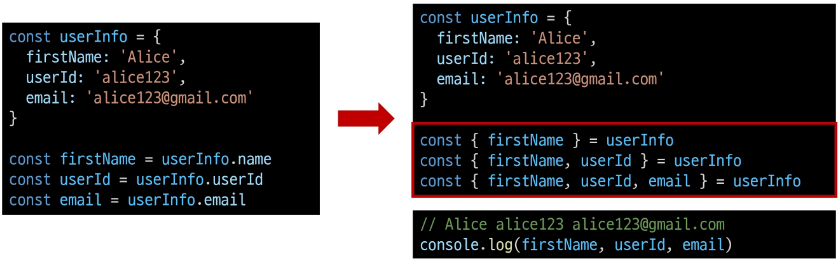
    
    - '함수의 매개변수'로 객체 구조 분해 할당 활용 가능

        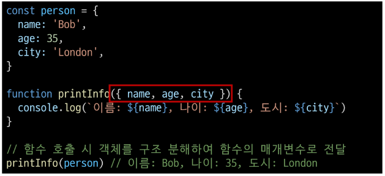

5. Object with '전개 구문'
    - 객체 복사: 객체 내부에서 객체 전개
    - 얕은 복사에 활용 가능
        ```javascript
        const obj = {b: 2, c: 3, d: 4}
        const newObj = {a: 1, ...obj, e: 5}
        console.log(newObj) // {a: 1, b: 2, c: 3, d: 4, e: 5}
        ```

    - 파이썬에서도 가능!
        ```python
        arr = [1, 2, 3]
        arr = [0, *arr]
        arr # [0, 1, 2, 3]
        ```
        - 리스트가 가진 값을 언패킹해서 0이 앞에 들어간 새로운 리스트를 만들어서 재할당한 것

6. 유용한 객체 메서드
    - Object.keys()
    - Object.values()
    ```JavaScript
    const profile = {
        name: 'Alice',
        age: 30,
    }
    console.log(Object.key(profile))    // ['name', 'age']
    console.log(Object.values(profile))    // ['Alice', 30]

7. Optional chaining `?.`
    - 속성이 없는 중첩 객체를 에러 없이 접근할 수 있는 방법
    - 만약 참조 대상이 null 또는 undefined라면 에러 발생 대신 평가를 멈추고 undefined 반환

        

    - 만약 Optional chaining 사용하지 않으면 && 연산자 사용해야 함
        ```javascript
        const user = {
            name: 'Alice',
            greeting: function () {
                return 'hello'
            }
        }
        console.log(user.address && user.address.street)    // undefined
        ```
    
    - Optional chaining 장점
        - 참조가 누락될 가능성이 있는 경우 연결된 속성으로 접근할 때 더 짧고 간단한 표현식 작성 가능
        - 어떤 속성이 필요한지에 대한 보증이 확실하지 않은 경우, 객체의 내용을 보다 편하게 탐색 가능
    
    - Optional chaining 주의사항
        - 존재하지 않아도 괜찮은 대상에만 사용해야 함(남용XX)
        - 즉, 객체 자체가 없는지 물어보는 방식에 사용하는 것은 Nope.
        - 왼쪽 평가 대상이 없어도 괜찮은 경우에만 선택적으로 사용
        - 중첩 객체를 에러 없이 접근하는 것이 사용 목적이기 때문
        ```javascript
        // 이전 예시 코드에서 user 객체는 논리상 반드시 있어야 하지만 address는 필수 값이 아님
        // user에 값을 할당하지 않은 문제가 있을 때 바로 알아낼 수 있어야 하기 때문

        user?.address?.street   // Bad
        user.address?.street    // Good
        ```
        - Optional chaining 앞의 변수는 반드시 선언되어 있어야 함
        ```javascript
        console.log(myObj?.address) // Uncaught ReferenceError: myObj is not defined
        ```

    - Optional chaining 정리
        1. `obj?.prop` : obj가 존재하면 obj.prop을 반환, 그렇지 않으면 undefined 반환
        2. `obj?.[prop]` : obj가 존재하면 obj[prop] 반환, 그렇지 않으면 undefined 반환
        3. `obj?.method()` : obj가 존재하면 obj.method() 호출, 그렇지 않으면 undefined 반환

### 참고
- `JSON`
    - Key-Value 형태로 이루어진 자료 표기법
    - "javaScript Object Notation" 자바 스크립트 객체 표기법
    - 자바 스크립트의 object와 유사한 구조를 가지고 있지만 JSON은 형식이 있는 **문자열**(자바 스크립트의 객체처럼 표기하겠다!)
    - JSON의 주 역할은 '서로 다른 프로그래밍에서 데이터를 주고받기 위한 것'
    - JSON 파일은 웹 상에서 API 형태로 주로 주고받기 때문에 Javascript가 주체가 되기 때문에 자바 스크립트 객체 표기법 활용
    - 자바 스크립트에서 JSON을 사용하기 위해서는 Object 자료형으로 변경해야 함
    - Object ↔ JSON 변환하기
    
        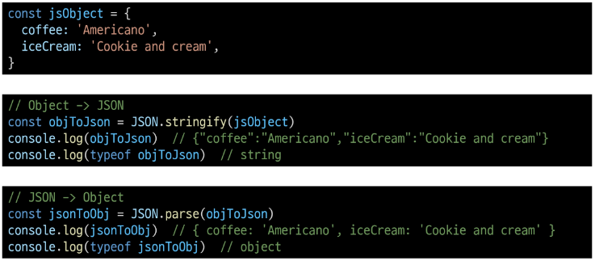

- `new 연산자`로 객체 여러 개 생성할 수 있음
    ```javascript
    new constructor[([arguments])]
    ```
    - 사용자 정의 객체 타입을 생성
    - 매개변수
        - `constructor` : 객체 인스턴스 타입을 기술하는 함수
        - `arguments` : constructor와 함께 호출될 값 목록

    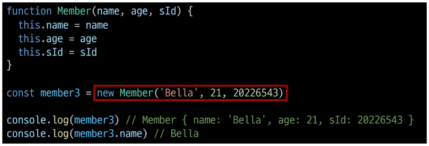


## 배열
순서가 있는 데이터 집합을 저장하는 자료구조

※ Object: 키로 구분된 데이터 집합을 저장하는 자료형 

-> for in 썼을 때 순서가 보장되지 않음을 기억할 것!

-> 따라서, 순서가 있는 collection을 순회해야할 땐 배열 형태로 만들어서 for of를 사용하자

### 배열 구조
```javascript
const names = ['Alice', 'Bella', 'Cathy']

console.log(names[0]) // Alice
console.log(names[1]) // Bella
console.log(names[2]) // Cathy

console.log(names.length) // 3
```
- 대괄호를 이용해서 작성
- 요소 자료형: 제약 없음
- length 속성을 사용해 배열에 담긴 요소가 몇 개인지 알 수 있음
    - arr = [1, 2, 3] -> `arr.length = 1` 입력하면 arr = [1]가 됨(배열이 가진 요소가 1개가 됨)
- 배열은 key-value로 이루어진 객체로서, type은 object

### 배열 메서드
- `push` / `pop`
    - 배열 끝 요소를 추가/제거
- `unshift` / `shift`
    - 배열 앞 요소를 추가/제거

### Array Helper Methods
배열 조작을 보다 쉽게 수행할 수 있는 특별한 메서드 모음
- ES6에 도입
- 배열의 각 요소를 순회하며 각 요소에 대해 함수(콜백함수)를 호출
    - `forEach()`, `map()`, `filter()`, `every()`, `some()`, `reduce()` 등
- 메서드 호출 시 인자로 함수(콜백함수)를 받는 것이 특징

- 주요 Array Helper Methods
1. `forEach` (★★★)
    - 배열의 각 요소를 반복하며, 배열 내의 모든 요소 각각에 대해 함수(콜백함수)를 호출
    - **반환 값 없음**(undefined)
        - 오로지 배열 순회 목적!!
    - forEach 구조
        
        
        - 어떤 배열(arr)이 가진 메서드인 forEach를 호출할 때 인자로 callback 함수를 함수 표현식으로 정의

    - 콜백함수는 3가지 매개변수로 구성
        - item : 처리할 배열의 요소를 가져오는 역할
        - index : 처리할 배열 요소의 인덱스 (선택사항)
        - array : forEach를 호출한 배열 (선택사항)

    - forEach 예시
        ```javascript
        const names = ['Alice', 'Bella', 'Cathy']

        // 일반 함수 표기
        names.forEach(function (name) {
        console.log(name)
        })

        // 화살표 함수 표기
        names.forEach((name) => {
        console.log(name)
        })

        names.forEach(function (name, index, array) {
        console.log(`${name} / ${index} / ${array}`)
        })
        // Alice / 0 / Alice, Bella, Cathy
        // Bella / 1 / Alice, Bella, Cathy
        // Cathy / 2 / Alice, Bella, Cathy
        ```

2. `map`
    - 배열의 모든 요소에 대해 콜백함수를 호출하고, 반환된 호출 결과 값을 모아 **새로운 배열 반환**
    - map 구조

        
    - forEach의 매개변수와 동일
    - 반환 값
        - 배열의 각 요소에 대해 실행한 '콜백함수의 결과를 모은 새로운 배열'
        - forEach와 동작 원리 같지만 forEach와 달리 새로운 배열을 반환함
    
    - map 예시

        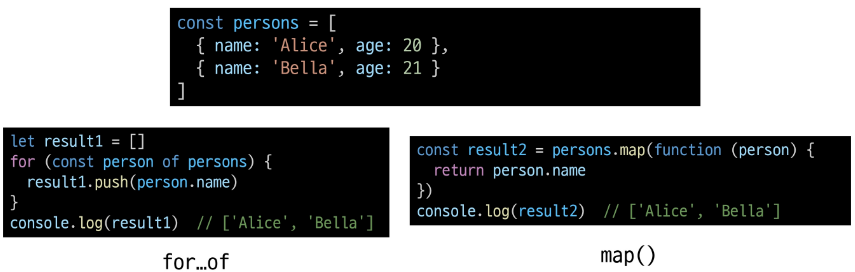
        - persons 배열 내부의 객체들 중 name들만 가져와서 배열을 만들고 싶다면?
        - `for of의 경우` -> 새로운 변수(result1) 만들어서 persons이 가진 각각의 요소를 직접적으로 person에 넣어서 person의 name들을 result에 push하는 형태로 만들어야 함
        - `map의 경우` -> persons 배열 자체를 직접적으로 순회하면서 person의 name을 반환하는 형태로 만들면 값들이 새로운 배열이 되어서 result2에 직접적으로 할당됨

    - map 활용(자주 쓰니까 기억해둘 것)
        ```javascript
        // 활용1
        const names = ['Alice', 'Bella', 'Cathy']
        const result3 = names.map(function (name) {
        return name.length
        })

        const result4 = names.map((name) => {
        return name.length
        })

        console.log(result3) // [5, 5, 5]
        console.log(result4) // [5, 5, 5]

        // 활용2
        const numbers = [1, 2, 3]
        const doubleNumber = numbers.map((number) => {
        return number * 2
        })

        console.log(doubleNumber) // [2, 4, 6]
        ```

※ python에서의 map 함수와 비교

- python의 map에 square 함수를 인자로 넘겨 numbers 배열의 각 요소를 square 함수의 인자로 사용

    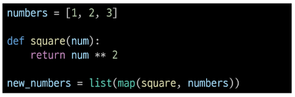

- map 메서드에 callBackFunc 함수를 인자로 넘겨 numbers 배열의 각 요소를 callBackFunc 함수의 인자로 사용

    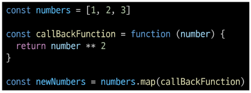

- 파이썬 map에서 square 부분이 함수라서 익명함수(lambda) 형식으로 처리할 수 있는데, 이런 부분이 자바 스크립트의 map에서 콜백함수 사용하는 것과 거의 똑같음

- 단, 파이썬의 map은 map object 자체가 반환이 되어 list 형변환 했어야 했고, 자바 스크립트의 map은 array가 가진 메서드이기 때문에 자체적으로 새로운 배열 반환함


### 배열 순회 종합
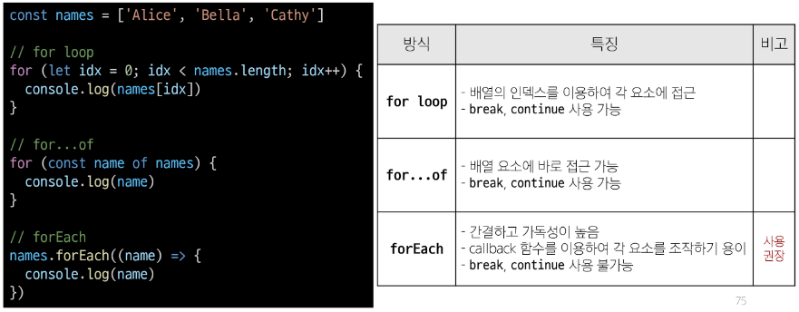

- forEach는 break, continue 사용 불가능 하지만, 간결 및 가독성 높음 때문에 사용 권장함

### 기타 Array Helper Methods
- filter(★)
    - 콜백 함수의 반환값이 참인 요소들만 모아서 새로운 배열 반환
    - return에 '조건에 해당하는 것'을 적을 것임
    - true면 그 item들을 모아서 
    - 배열이 가진 요소들 중에 조건을 만족하는 요소들을 반환하는 형식
- find(★)
    - 콜백함수의 반환 값이 참이면 해당 요소를 반환
    - filter와 달리 조건 만족하는 요소를 '한개' 찾으면 찾고 끝남

- some
    - 배열의 요소 중 적어도 하나라도 콜백 함수를 통과하면 true를 반환하여 즉시 배열 순회 중지
    - 반면에 모두 통과하지 못하면 false를 반환
- every
    - 배열의 모든 요소가 콜백 함수를 통과하면 true를 반환
    - 반면에 하나라도 통과하지 못하면 즉시 false를 반환하고 배열 순회 중지

### 참고
"배열은 객체다"

- 배열도 키와 속성들을 담고 있는 참조 타입의 객체
- 배열의 요소를 대괄호 접근법으로 접근하는 것은 객체 문법과 동일(배열의 키는 숫자)
- 숫자형 키를 사용함으로써 배열은 객체 기본 기능 이외에도 '순서가 있는 컬렉션'을 제어하게 해주는 특별한 메서드를 제공하는 것
- 배열은 인덱스를 key로 가지며 length 속성을 갖는 특수한 객체

    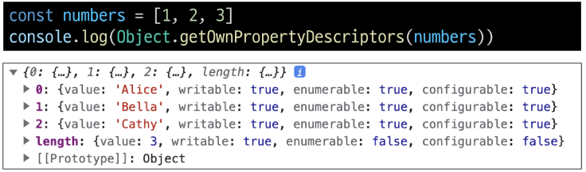


※ arr[-1] = 4로 마지막 요소의 값을 바꾸려는 의도였지만, **-1 속성에 4가 들어가버림** -> 배열은 객체이기 때문!!

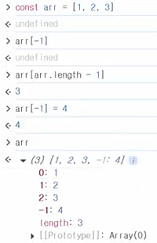

※ 생각해볼 문제!

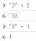

-> 자바 스크립트의 암묵적 형변환에 의한 상황!

-> 문자열에 문자열 더하는건 가능하지만, 문자열에 문자열 빼는건 안됨

-> 오류 방지를 위해 문자열을 정수로 바꿔서 뺄셈 진행된 상황(연산할 수 있도록 형변환 된 것)

-> (DB에 값 삽입 시 데이터타입을 엄격히 지켜야하는 이유)


## 비동기
### Synchronous(동기)
프로그램의 실행 흐름이 순차적으로 진행
- 하나의 작업이 완료된 후 다음 작업이 실행되는 방식
- 예시
    1. 메인 작업이 모두 수행되어야 마지막 작업이 수행됨
        ```javascript
        print('첫번째 작업')
        for i in range(10):
            print('메인 작업')
        print('마지막 작업')
        ```
    2. 함수의 작업이 완료될 때까지 기다렸다가 값을 반환해야 계속 진행 가능
        ```javascript
        const makeGreeting = function (name) {
            return `Hello, my name is ${name}!`
        }
        const name = 'Alice'
        const greeting = makeGreeting(name)
        console.log(greeting) // Hello, my name is Alice!
        ```

### Asynchronous(비동기)
프로그램의 실행 흐름이 순차적이지 않으며, 작업이 완료되기를 기다리지 않고 다음 작업이 실행되는 방식
- 작업 완료 여부를 신경쓰지 않고 **동시에 다른 작업들을 수행할 수 있음**
    1. ex. Gmail에서 메일 전송 누르면 목록 화면으로 전환되지만 실제로 메일 보내는 작업은 병렬적으로 별도로 처리됨
    2. ex. 브라우저는 웹 페이지를 먼저 처리되는 요소부터 그려 나가며 처리가 오래 걸리는 것들은 별도로 처리가 완료되는 대로 병렬적으로 진행

- Asynchronous 예시

    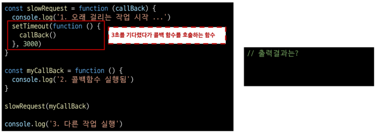

    
    - 만약 동기적으로 진행됐다면 slowRequest 호출 -> 오래 걸리는 작업 시작(1 출력) -> myCallBack을 넘겨받아 callBack함수 실행(2 출력) -> 3초 뒤 다른작업 실행(3 출력) 순으로 진행
    - 비동기니까
        - slowRequest 호출 -> 1 출력
        - setTimeout 호출 -> callBack함수 실행할 '거다' (3초뒤에)
        - slowRequest 함수가 일은 다 안끝났지만 다음 작업 진행 -> 3 출력
        - 3초 뒤 callback함수 실행 -> 2 출력
        
- Asynchronous 특징
    - 병렬적 수행
    - 당장 처리를 완료할 수 없고 시간이 필요한 작업들은 별도로 요청을 보낸 뒤 응답이 빨리 오는 작업부터 처리

        

### JavaScript와 비동기
**JavaScript는 Single Thread 언어**

※ Thread란? 작업을 처리할 때 실제 작업을 수행하는 주체로, multi-thread라면 업무를 수행할 수 있는 주체가 여러 개라는 의미

- 자바스크립트는 한번에 여러 일을 수행할 수 없다
    - 즉, 자바 스크립트는 하나의 작업을 요청한 순서대로 처리할 수밖에 없음
    - 그러면 어떻게 Single Thead인 JavaScript가 비동기 처리를 할 수 있을까?

- JavaScript Runtime
    - 자바 스크립트가 동작할 수 있는 환경(Runtime)
    - 자바 스크립트 자체는 Single Thread이므로 비동기 처리를 할 수 있도록 도와주는 환경이 필요함
    - 자바 스크립트에서 비동기 관련 작업은 "브라우저" 또는 "Node"와 같은 환경에서 처리
    - 즉, 브라우저와 같은 환경을 통해 브라우저에서 실행될 때 알아서 멀티 스레드 형식으로 여러 작업을 동시에 처리할 수 있음

- 브라우저 환경에서의 JavaScript 비동기 처리 관련 요소
    1. JavaScript Engine의 Call Stack
    2. Web API
    3. Task Queue
    4. Event Loop

- 런타임의 시각적 표현

    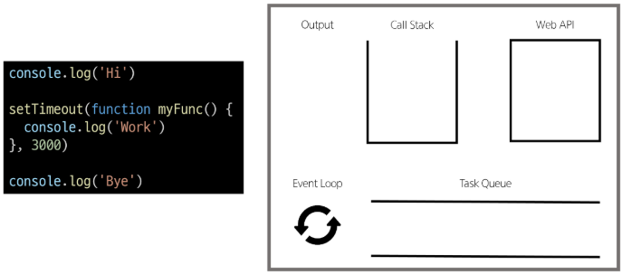
    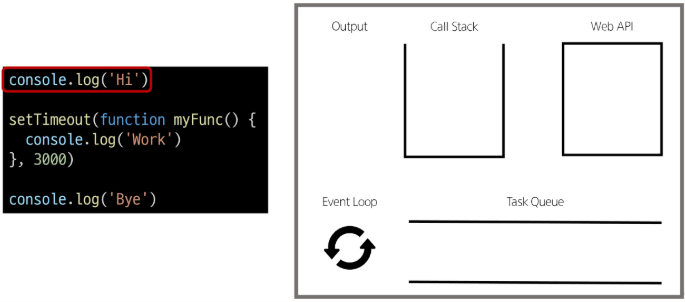
    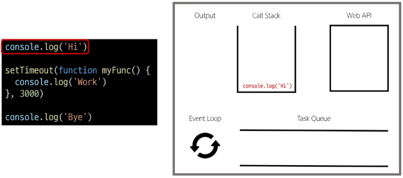
    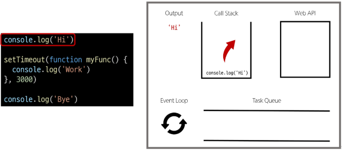
    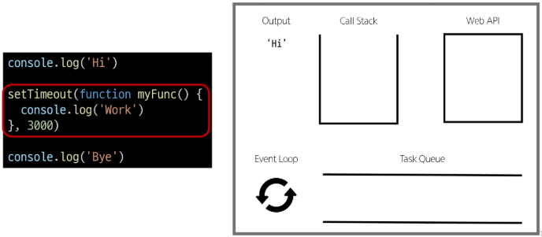
    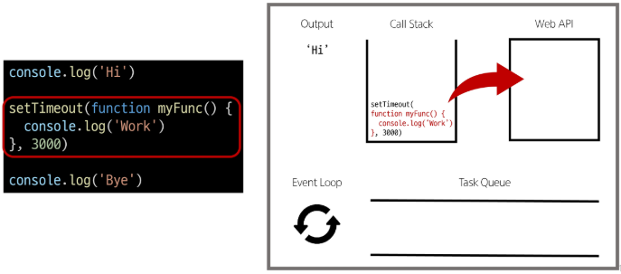
    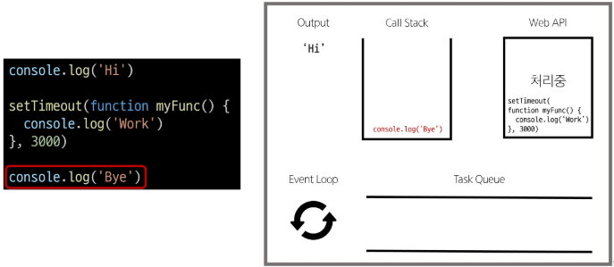
    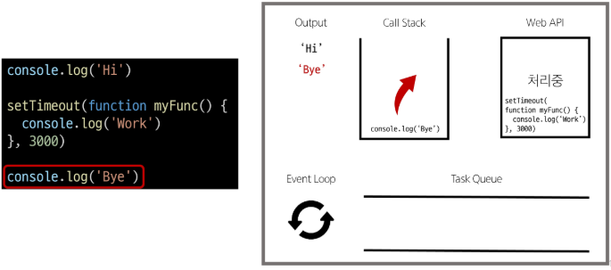
    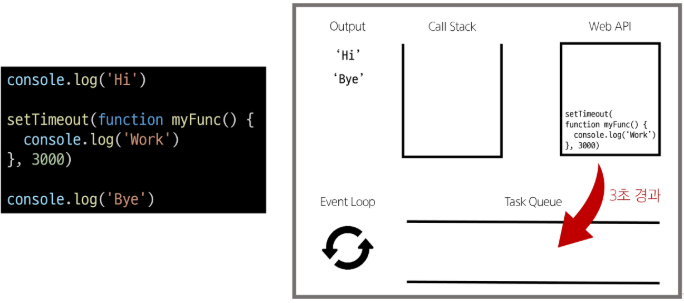
    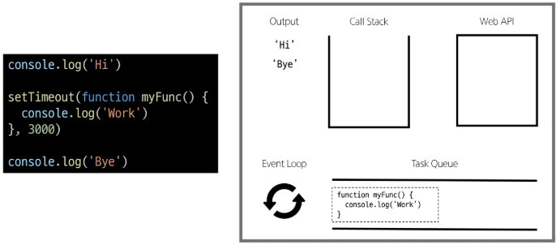
    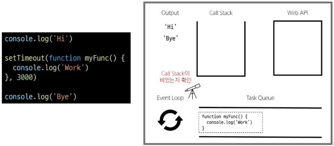
    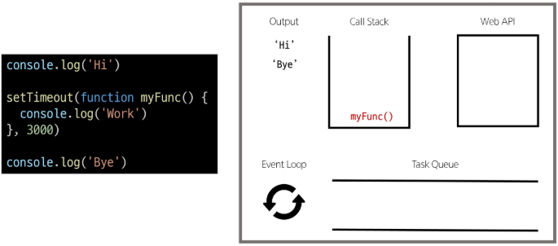
    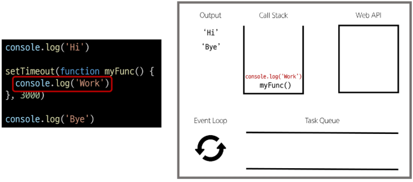
    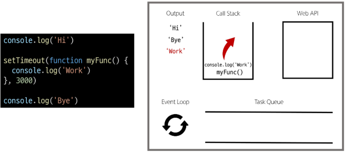
    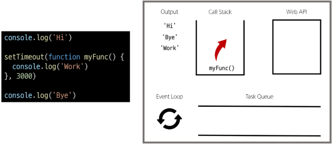
    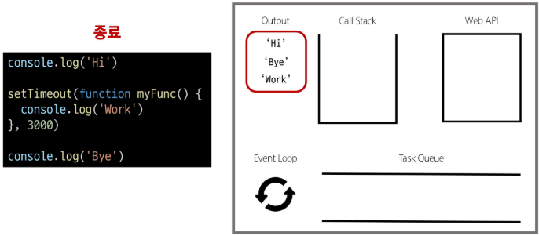

### 브라우저 환경에서의 JavaScript 비동기 처리 동작 방식
1. 모든 작업은 `Call Stack(LIFO)`으로 들어간 후 처리됨
2. 오래 걸리는 작업이 Call Stack으로 들어오면 **Web API로 보내 별도로 처리**하도록 함
3. Web API에서 처리가 끝난 작업들은 곧바로 Call Stack으로 들어가지 못하고 `Task Queue(FIFO)`에 순서대로 들어감
4. Event Loop가 Call Stack이 비어있는 것을 계속 체크하고 Call Stack이 빈다면 Task Queue에서 가장 오래된(가장 먼저 처리되어 들어온) 작업을 Call Stack으로 보냄

- 비동기 처리 동작 요소

    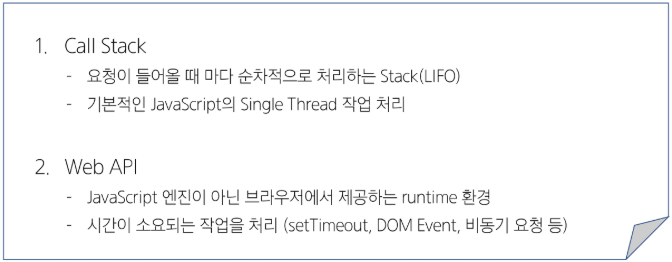
    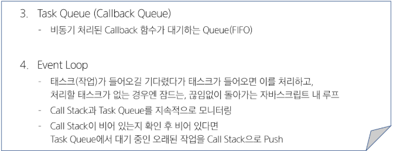

- 정리
    - JavaScript는 한 번에 하나의 작업을 수행하는 Single Thread 언어로 동기적 처리를 진행
    - 하지만 브라우저 환경에서는 Web API에서 처리된 작업이 지속적으로 Task Queue를 거쳐 Event Loop에 의해 Call Stack에 들어와 순차적으로 실행됨으로써 비동기 작업이 가능한 환경이 됨

## AJAX
XMLHttpRequest 기술을 사용해 복잡하고 동적인 웹 페이지를 구성하는 프로그래밍 방식(Asynchronous JavaScript and XML)

- 비동기적인 웹 애플리케이션 개발을 위한 기술
- 브라우저와 서버 간 데이터를 비동기적으로 교환하는 기술
- AJAX를 사용하면 페이지 전체를 새로고침 하지 않고도 동적으로 데이터를 불러와 화면 갱신 가능
- AJAX의 'x'는 XML이라는 데이터 타입을 의미하긴 하지만, 요즘은 더 가벼운 용량과 JavaScript 일부라는 장점 때문에 'JSON'을 더 많이 사용
- AJAX 목적
    - 전체 페이지가 다시 로드되지 않고 HTML 페이지 일부 DOM만 업데이트
    - 웹 페이지 일부가 다시 로드되는 동안에도 코드가 계속 실행되어, 비동기식으로 작업할 수 있음

### XMLHttpRequest 객체
서버와 상호작용할 때 사용하는 객체(XHR)

- XMLHttpRequest 특징
    - 브라우저와 서버 간 네트워크 요청을 전송할 수 있음
    - 사용자의 작업을 방해하지 않고 페이지의 일부를 업데이트할 수 있음
    - 요청의 상태와 응답을 모니터링할 수 있음
    - XML뿐만 아니라 모든 종류의 데이터를 가져올 수 있음

- XHR 구조
    ```html
    <script>
        const xhr = new XMLHttpRequest() // XHR 객체 인스턴스 생성
            xhr.open('GET', 'https://jsonplaceholder.typicode.com/posts')
            xhr.send() // 요청 전송

            xhr.onload = function () {  // 요청이 완료되었을 때 호출
            // 응답 상태 코드가 200이라면
            if (xhr.status == 200) {
                console.log(xhr.responseText)  // 응답 받은 결과 출력
            } else {
                console.error('Request failed')  // 200 이외 상태에 대한 예외 처리
            }
        }
    </script>
    ```
    - HTTP 요청을 생성하고 전송하는 기능 제공
    - AJAX 요청을 통해 서버에서 데이터를 가져와 웹 페이지에 동적으로 표시

※ 기존 기술과의 차이 - 기존 방식

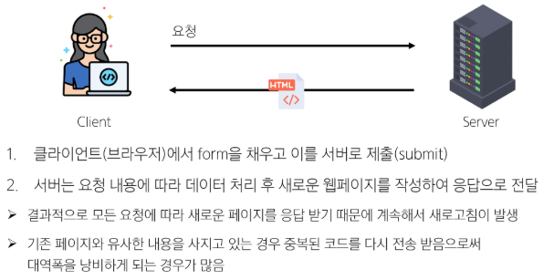

※ 기존 기술과의 차이 - AJAX

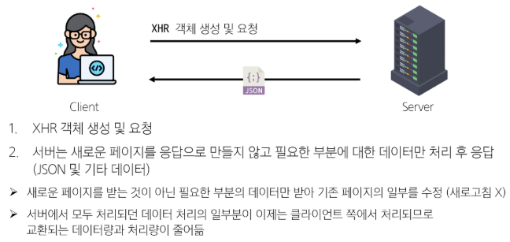
    
※ 이벤트 핸들러는 비동기 프로그래밍의 한 형태

-> 이벤트 발생할 때마다 호출되는 함수(콜백 함수)를 제공하는 것

-> HTTP 요청은 응답이 올 때까지의 시간이 걸릴 수 있는 작업이라 비동기이며, 이벤트 핸들러를 XHR 객체에 연결해 요청의 진행 상태 및 최종 완료에 대한 응답을 받음


## Callback과 Promise
- 비동기 처리의 단점
    - 비동기 처리의 핵심은 Web API로 들어오는 순서가 아니라, **작업이 완료되는 순서에 따라 처리**한다는 것
    - 개발자 입장에서 **코드의 실행 순서가 불명확**하다는 단점 존재(실행 결과 예상하면서 코드 작성하기 어려움)
    - 콜백 함수를 사용하자!

### 비동기 콜백
비동기적으로 처리되는 작업이 완료되었을 때 실행되는 함수
- 연쇄적으로 발생하는 비동기 작업을 순차적으로 동작할 수 있게 함
- 작업의 순서와 동작을 제어하거나 결과를 처리하는 데 사용
- 비동기 콜백의 한계
    - 비동기 콜백 함수는 보통 어떤 기능의 실행 결과를 받아서 다른 기능을 수행하기 위해 많이 사용됨
    - 이 과정을 작성하다 보면 비슷한 패턴이 계속 발생

        
    - 즉, `콜백 지옥` 발생

- 콜백 지옥(Callback Hell)
    - 비동기 처리를 위한 콜백을 작성할 때 마주하는 문제

        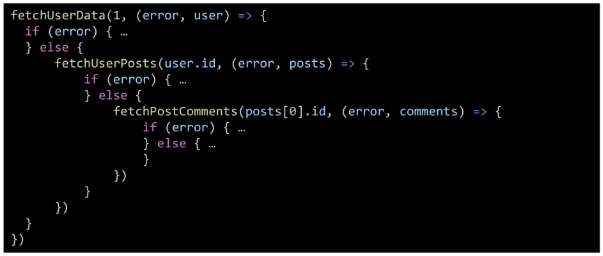

        - 콜백 함수는 비동기 작업을 순차적으로 실행할 수 있게 하는 반드시 필요한 로직
        - 비동기 코드를 작성하다 보면 콜백 함수로 인한 콜백 지옥이 빈번히 나타남
        - 코드 가독성 해치고 유지보수 어려워짐
    - 지옥에 빠지지 않는 다른 표기 형태 필요!

### 프로미스(Promise)
JavaScript에서 비동기 작업의 결과를 나타내는 객체

- 비동기 작업이 완료되었을 때 결과 값을 반환하거나, 실패 시 에러를 처리할 수 있는 기능 제공

- "Promise" object
    - 자바스크립트에서 비동기 작업을 처리하기 위한 객체
    - 비동기 작업의 성공 또는 실패와 관련된 결과나 값을 나타냄
    - 콜백 지옥 문제를 해결하기 위해 등장한 비동기 처리를 위한 객체
    - 작업이 끝나면 실행시켜 준다는 약속
        - 성공에 대한 약속 `then()`
        - 실패에 대한 약속 `catch()`

    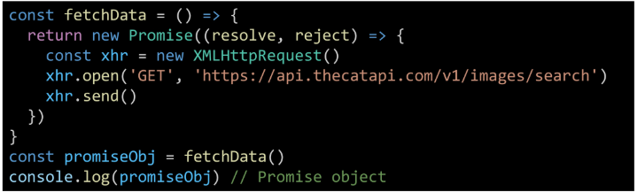
    - new 연산자로 프로미스 객체 만들어서 성공, 실패에 대해 각각 어떻게 처리할지 정의

※ 비동기 콜백 vs Promise

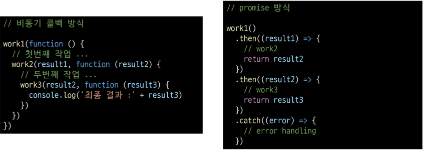

- then 메서드 chaining의 목적
    - 비동기 작업의 **순차적인** 처리 가능
    - 코드를 보다 직관적이고 가독성 좋게 작성할 수 있도록 도움

- then 메서드 chaining의 장점
    1. 가독성
        - 비동기 작업의 순서와 의존 관계를 명확히 표현할 수 있어 코드 가독성 향상됨
    2. 에러 처리
        - 각각의 비동기 작업 단계에서 발생하는 에러를 분할해서 처리 가능
    3. 유연성
        - 각 단계마다 필요한 데이터를 가공하거나 다른 비동기 작업을 수행할 수 있어, 더 복잡한 비동기 흐름을 구성할 수 있음
    4. 코드 관리
        - 비동기 작업을 분리하여 구성하면 코드 관리 용이

- Promise가 보장하는 것(vs 비동기 콜백)
    
    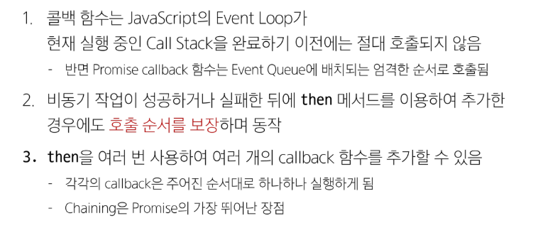
    - then 메소드로 호출 순서 보장!!!!!

## Axios
JavaScript에서 사용되는 HTTP 클라이언트 라이브러리

### Axios 정의
- 클라이언트 및 서버 사이에 HTTP 요청을 만들고 응답을 처리하는 데 사용되는 자바스크립트 라이브러리
- 서버와의 HTTP 요청과 응답을 간편하게 처리할 수 있도록 도와주는 도구
- 브라우저를 위한 XHR 객체 생성
- 간편한 API를 제공하며, Promise 기반의 비동기 요청을 처리
    - 주로 웹 애플리케이션에서 서버와 통신할 때 사용

### AJAX를 활용한 클라이언트 서버 간 동작

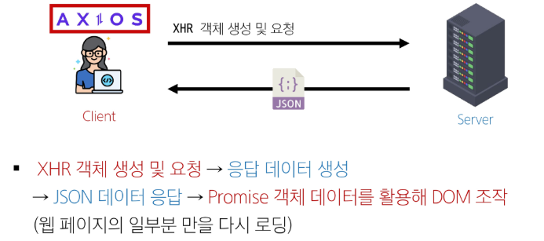

### Axios 사용
- CDN 방식으로 사용하기
    ```html
    <script src="https://cdn.jsdelivr.net/npm/axios/dist/axios.min.js"></script>
    ```

### Axios 구조
1. axios 객체를 활용해 요청을 보낸 후 응답 데이터를 promise 객체를 받음
2. promise 객체는 then과 catch 메서드를 활용해 각각 필요한 로직을 수행

    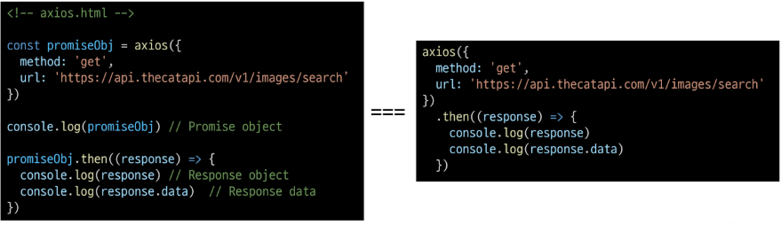

3. `then` 메서드 사용해서 "성공하면 수행할 로직" 작성
4. `catch` 메서드 사용해서 "실패하면 수행할 로직" 작성

    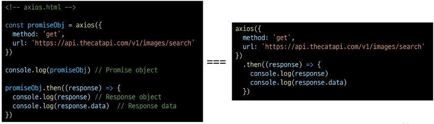

### then & catch의 chaining
- axios로 처리한 비동기 로직은 항상 promise 객체를 반환
- 즉, then과 catch는 모두 항상 promise 객체를 반환
    - 계속해서 chaining을 할 수 있음
- then을 계속 이어나가면서 작성할 수 있게 됨

    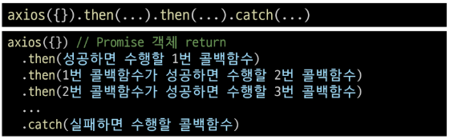

- then & catch
    - then(callback)
        - 요청한 작업이 성공하면 callback 실행
        - callback은 이전 작업의 성공 결과를 인자로 전달 받음
    - catch(callback)
        - then()이 하나라도 실패하면 callback 실행(남은 then 중단)
        - callback은 이전 작업의 실패 객체를 인자로 전달 받음

### 실습
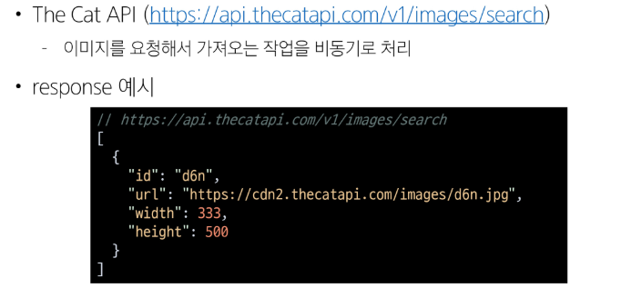
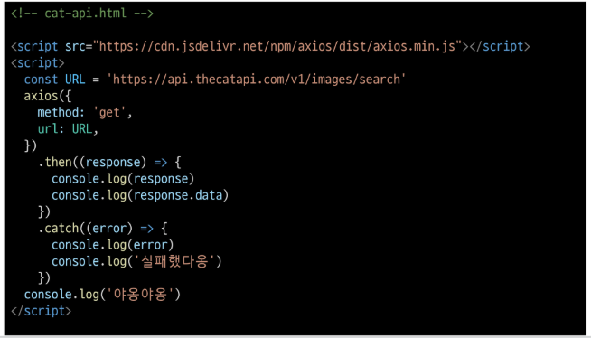
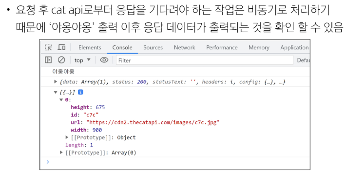

- 심화


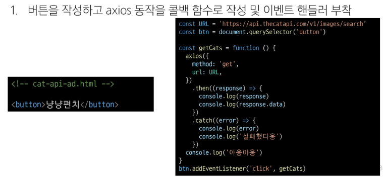
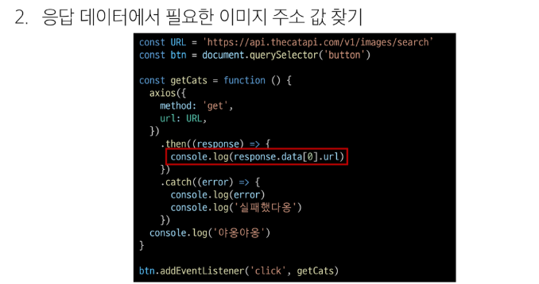


### 정리


### 참고
- 비동기를 사용하는 이유 - "사용자 경험"
    - ex. 아주 큰 데이터를 불러온 뒤 실행되는 앱이 있을 때, 동기식으로 처리한다면 데이터를 모두 불러온 뒤에야 앱의 실행 로직이 수행되므로 사용자들은 마치 앱이 멈춘 것과 같은 경험을 겪게 됨
    - 즉, 동기식 처리는 특정 로직이 실행되는 동안 다른 로직 실행을 차단하므로
    - 마치 프로그램이 응답하지 않는 듯한 사용자 경험을 만듦
    - 비동기로 처리한다면 먼저 처리되는 부분부터 보여줄 수 있으므로, 사용자 경험에 긍정적인 효과를 볼 수 있음
    - 이와같은 이유로 많은 웹 기능은 비동기 로직을 사용해서 구현됨

