# 스택과 큐
## 스택(stack)
물건을 쌓아 올리듯, 자료를 쌓아 올린 형태의 자료구조

- 스택에 저장된 자료는 선형 구조를 가짐
    - 선형구조: 데이터 요소들 사이에 순서가 존재
    - 비선형구조: 데이터 요소가 순차적으로 나열되지XX
- 스택에 자료를 삽입 또는 꺼낼 수 있음
- **후입선출** 구조(**LIFO**, Last-In-First-Out)
    - 마지막에 삽입한 자료를 가장 먼저 꺼냄
    - ex. 1, 2, 3 순으로 스택에 넣으면 3, 2, 1 순으로 꺼낼 수 있음

### 스택 주요 연산

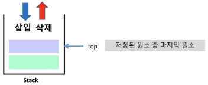
- `Push` : 저장소에 자료 저장(삽입)
- `Pop` : 저장소에서 자료를 꺼냄(삭제)
    - 꺼낸 자료는 삽입한 자료의 '역순'으로 꺼냄
- `InEmpty` : 스택이 공백인지 확인
    - `isfull` : 스택이 꽉 차면 삽입 불가능 하므로 확인 필요
    top의 위치로 자료 넣을 수 있는지 없는지 확인
- `Peek` : 스택의 top에 있는 자료를 반환

### 스택의 삽입/삭제 과정
빈 스택에 원소 A, B, C를 차례로 삽입 후 한번 삭제하는 연산과정

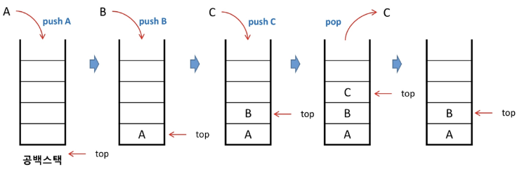


### 스택 구현
```python
class Stack:
    # 생성자 함수: 스택 자료구조 인스턴스 생성 시, 이 자료구조의 최대 크기도 함께 넘겨줘야 함
    def __init__(self, capacity=10):
        self.capacity = capacity    # 이 자료구조의 최대 수용 가능 공간(기본인자 사용해서 기본값 10 설정)
        self.item = [None] * capacity   # 내 최대 크기만큼 리스트를 None으로 채운다
        self.top = -1   # 왜 top이 0이 아닌 -1로 초기화 하느냐?
                        # 여기서 -1은 리스트의 마지막을 의미하는 것이 아닌
                        # push 연산 진행 시, top의 값을 1 증가시키고 그곳에 값을 삽입할 예정이므로 -1로 초기화해야 함

    # 삽입할 수 있는 공간을 생성자 함수로 만들어 놨으니, 이제 값을 삽입하자
    def push(self, item):
        
        # push를 계속 해서 스택이 가득 찼을 때 또 삽입하면 IndexError 발생
        # 스택이 가득 찼음을 확인해야 함 -> 예외처리
        if self.is_full():
            print('Stack is Full!!')
            return
            # 또는 에러 직접 발생시키기 가능 -> raise IndexError('Stack is Full')        
        
        self.top += 1   # 올바른 삽입 위치 찾기(top의 위치를 옮긴 후 그 자리에 삽입)
        self.items[self.top] = item
    
    def pop(self):
        if self.is_empty():
            print('Stack is Empty!!')
            return
        item = self.items[self.top]     # 제거할 값은 top위치에 있음
        self.items[self.top] = None     # None으로 바꿔주지 않으면 값을 제거했음에도 
                                        # 자료구조 상에 데이터가 여전히 존재하고 있는 형태로 보임
                                        # 그래서 None으로 실제로 비어있는 형태로 만들자
        self.top -= 1
        return item     # 제거한 값은 사용해야하니 반환해주기

    def is_full(self):
        # stack이 가득 찼음을 어떻게 알 수 있을까?
        # top의 최대 위치가 어디인지 확인해 봤을 때
        # 최대 용량의 -1에 top이 도달했다면 full
        # Why? top의 시작점은 -1이고, top은 push가 호출되면 1 증가 후 값이 삽입되는 방식
        # 만약 top이 1 증가한 뒤 full인지 확인(capacity == top)을 하면 top이 이미 범위를 벗어나서 다시 full 확인 후 범위 안쪽으로 top을 옮기는 작업 필요
        # 그래서 full을 먼저 확인(capacity-1 == top) 후 top을 1 증가시키도록 하자
        # 탑의 최대 위치를 생각해보기!
        return self.capacity -1 == self.top
        
    # 스택이 비었는지 확인
    # top이 -1일 때 스택이 비어있다고 판단할 수 있음
    def is_empty(self):
        return self.top == -1
            
stack = Stack()

stack.push(1)
stack.push(2)
stack.push(3)

print(stack.pop())
print(stack.pop())
print(stack.peek())
print(stack.is_empty())
print(stack.pop())
print(stack.pop())
```


### 스택 응용
- 괄호 검사
    - 괄호의 종류: 대괄호 `[]`, 중괄호 `{}`, 소괄호 `()`
    - 조건
        1. 왼쪽 괄호의 개수와 오른쪽 괄호의 개수가 같아야 함
        2. 같은 괄호에서 왼쪽 괄호는 오른쪽 괄호보다 먼저 나와야 함
        3. 괄호는 서로 짝이 맞아야 함
    - 잘못된 괄호 사용 예시
        - ( a ( b )
        - a ( b ) c )
        - a { b ( c [ d ] e } f )

- 괄호검사 solution

    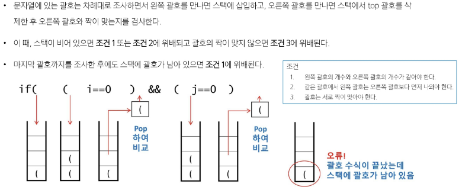

    ```python
    def check_match(expression):
        # 여는 괄호들을 일단 담아둘 스택
        # 여는 괄호들을 담아두다가 올바른 닫는 괄호가 나왔는지 확인하기 위함
        stack = []

        # 괄호의 짝을 매칭시킬 수 있어야 할 것 같다
        # 문자열도 시퀀스 타입이므로 리스트 아니어도 괜츈
        opening_bracket = '({['
        closing_bracket = ')]}'
        # 또는
        matching_dict = { ')':'(',
                        '}':'{',
                        ']':'['}

        for char in expression:
            if char in matching_dict.values():  #  matching_dict.values = ['(', '{', '[']
                # 여는 괄호라면 스택에 넣어랏
                stack.append(char)
            elif char in matching_dict.keys():  # 닫는 괄호인지 물어보기
                # 닫는 괄호라면?
                # 스택에서 나와 매칭되는 짝을 찾을 수 있다면, 그 괄호를 제거
                # 단, 스택이 비어있지 않아야 함!
                    # 스택이 비었거나, 마지막 요소 값이 내가 찾는 여는 괄호가 아니면 실패
                if not stack or stack[-1] != matching_dict[char]:
                    return False

                # 매칭 짝을 찾았으면 제거
                stack.pop()
        # 모든 문자를 다 순회했을 때, 스택이 비어있지 않다면 문제가 있는 것
        return not stack

    # 예시
    examples = ["(a(b)", "a(b)c)", "a{b(c[d]e}f)"]
    for ex in examples:
        if check_match(ex): 
            print(f"{ex} 는 올바른 괄호") 
        else:
            print(f"{ex} 는 올바르지 않은 괄호")  
    ```

- Function call
    - 프로그램에서 함수 호출과 복귀에 따른 수행 순서를 관리할 때 stack 사용
    - 가장 마지막에 호출된 하무가 가장 먼저 실행을 완료하고 복귀하는 후입선출 구조
    
    1. 함수 호출이 발생하면, 호출한 함수 수행에 필요한 지역변수, 매개변수, 수행 후 복귀 주소 등의 정보를 stack frame에 저장하여 시스템 스택에 삽입

        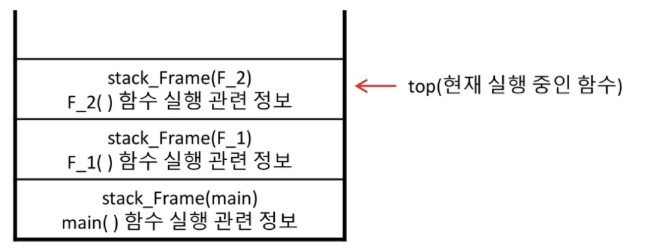

    2. 함수 실행이 끝나면 시스템 스택의 top원소를 삭제(pop)하면서 프레임에 저장되어있던 복귀주소를 확인하고 복귀

        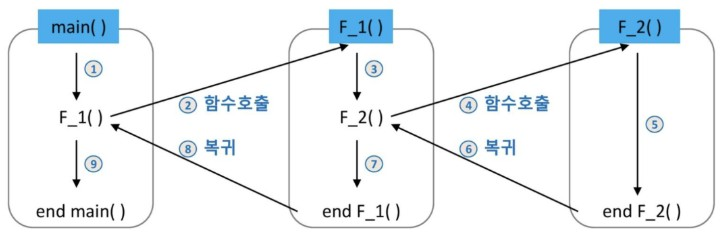
    
    3. 함수 호출과 복귀에 따라 이 과정을 반복하여 전체 프로그램 수행 중료되면 시스템 스택은 공백 스택이 됨

- 계산기
    - 문자열 수식 계산의 일반적인 방법
        1. 중위표기법 -> 후위표기법 변경(스택 이용)
        2. 후위표기법의 수식을 계산(스택 이용)
    
    - Step1. 중위표기식 -> 후위표기식 변환
        - 1단계: 수식의 각 연산자에 대해 우선순위에 따라 괄호를 사용하여 다시 표현
        - 2단계: 각 연산자를 그에 대응하는 오른쪽 괄호의 뒤로 이동
        - 3단계: 괄호 제거

        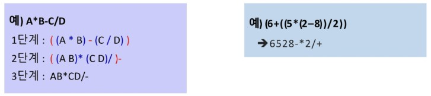
    
    - Step2. 후위 표기법의 수식을 스택 이용하여 계산
        - 1단계: 피연산자 만나면 스택에 push
        - 2단계: 연산자 만나면 필요한 만큼의 피연산자를 pop하여 연산하고, 연산 결과를 다시 스택에 push
        - 3단계: 수식이 끝나면 마지막으로 pop하여 출력

        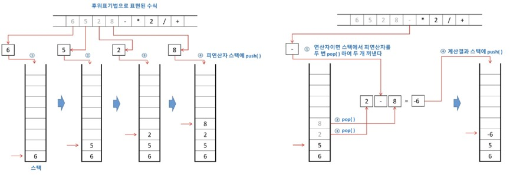
        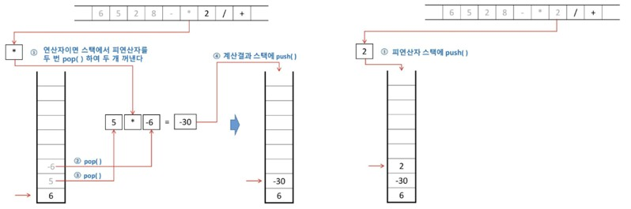
        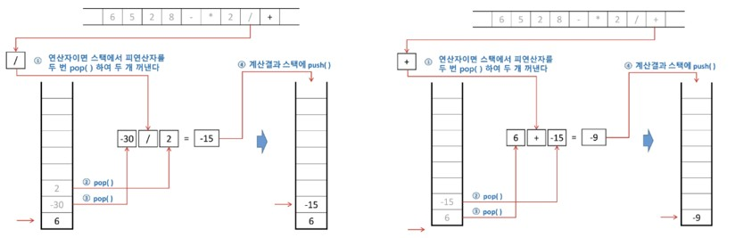
        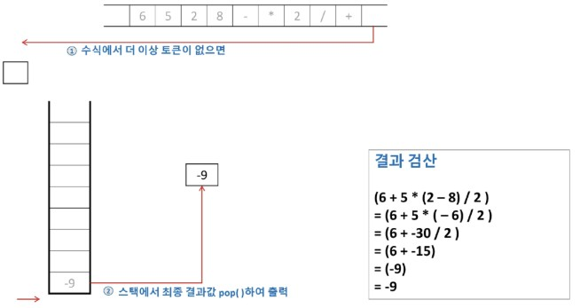

    - 중위 -> 후위 표기법 변환 코드
        ```python
        def infix_to_postfix(expression):
            # 연산자의 우선순위를 정의해야 함
            # 괄호가 제일 우선순위 낮고, +,- -> *, / 순으로 높아짐
            op_dict = {'+' : 1,
                    '-' : 1,
                    '*' : 2,
                    '/' : 2,
                    '(' : 0}      # 닫는 괄호는 나오는 순간 여는괄호와 닫는괄호 사이에 있는 연산자 다 빼내서 우선 연산 

            stack = []      # 연산자를 저장할 스택
            postfix = []    # 후위 표기식을 저장할 리스트

            for char in expression:     # 표현식 순회
                # 피연산자인 경우
                if char.isnumeric():    # 정수라면
                    postfix.append(char)    # 후위표기식에 삽입
                # 연산자인 경우
                elif char == '(':
                    stack.append(char)
                elif char == ')':               # 닫는 소괄호 만나면
                    top_token = stack.pop()     # 연산자들을 스택에서 뺄 것이다
                    while top_token != '(':     # 여는 소괄호 만날 때까지!
                        postfix.append(top_token)
                        top_token = stack.pop()
                # 연산자인 경우
                # 스택에 있는 연산자들이 지금 검사하는 연산자보다
                # 우선순위가 높거나 낮을 때 서로 다르게 처리해야 함
                else:   
                    while stack and op_dict[stack[-1]] >= op_dict[char]:
                    # 스택에 연산자가 있는 동안 계속 반복
                    # 스택의 마지막에 잇는 연산자가 지금 연산자보다 우선순위가 크거나 같을 때
                    # 스택의 마지막 연산자를 빼서 리스트에 추가
                        postfix.append(stack.pop())
                    stack.append(char)

            while stack:
                postfix.append(stack.pop())

            # postfix에 넣었던 값들을 공백 넣어서 합치기
            # 3 2 5 * + 8 4 / -
            return ' '.join(postfix)
        ```
        - 이렇게 만든 후위표기식을 계산하고 싶다면
        - 피연산자들을 스택에 넣다가 연산자를 만나면 스택에 들어있는 피연산자 2개를 빼내서 연산하고
        - 그 결과를 다시 스택에 넣는 방식으로 함수 작성하면 됨


## 큐(Queue)
스택과 마찬가지로 삽입과 삭제의 위치가 제한적인 자료구조
- 큐의 뒤에서는 삽입만 하고, 큐의 앞에서는 삭제만 이루어지는 구조
- **선입선출** 구조(**FIFO**, First-In-Fitst-Out)
    - 큐가 삽입한 순서대로 원소가 저장되어, 가장 먼저 삽입한(First In) 원소는 가장 먼저 삭제(First Out) 됨

### 큐의 주요 연산
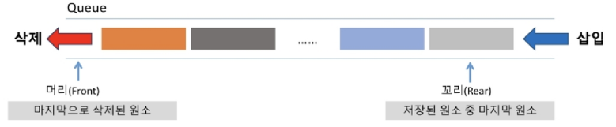
- 큐는 원소가 나갈 수 있는 머리(front)가 어딘지, 원소가 들어올 수 있는 꼬리(rear)가 어딘지에 대해 총 2군데 위치를 알아야 함
- `EnQueue` : 큐의 뒤쪽에 원소를 삽입
- `Dequeue` : 큐의 앞쪽에서 원소를 삭제하고 반환
- `IsEmpty` : 큐가 공백상태인지 확인
- `Peek` : 큐의 앞쪽에서 원소를 삭제 없이 반환

### 큐의 연산 과정
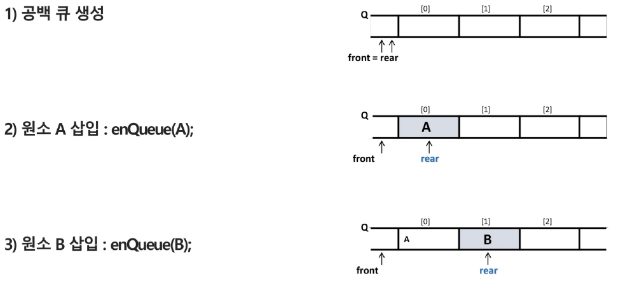
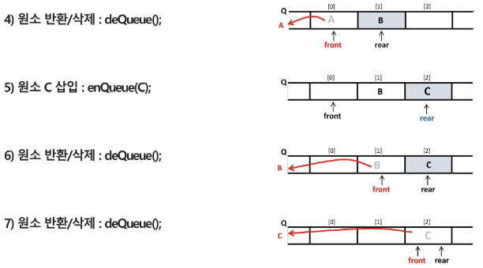


### 큐 구현
```python
class Queue:
    # 생성자 함수
    def __init__(self, capacity=5):
        self.capacity = capacity
        self.items = [None] * capacity
        self.front = -1     # 출구
        self.rear = -1      # 입구
    
    # 꽉 찼니?
    def is_full(self):
        return self.rear == self.capacity -1
        # stack의 top과 동일한 조건

    # 비었니?
    def is_empty(self):
        return self.front == self.rear
        # 삽입 시 rear가 움직이고
        # 삭제 시 front가 움직이므로
        # front가 rear 위치까지 갔다면 모든 값이 제거되었다는 뜻
    
    # 값 삽입
    def enqueue(self, item):
        if self.is_full():
            print('queue is full!!')
            return
        # 가득 안찼다면
        self.rear += 1
        self.items[self.rear] = item
    
    # 값 제거
    def dequeue(self):
        if self.is_empty():
            print('queue is empty!!')
            return
        # 값이 비어있지 않다면
        self.front += 1
        item = self.items[self.front]
        self.items[self.front] = None
        return item
    
queue = Queue()

queue.enqueue(1)
queue.enqueue(2)
queue.enqueue(3)
print(queue.dequeue())  # 1
print(queue.dequeue())  # 2
print(queue.items)      # [None, None, 3, None, None]
queue.enqueue(4)
queue.enqueue(5)
print(queue.items)      # [None, None, 3, 4, 5]
print(queue.is_full())  # True
queue.enqueue(11)       # queue is full!!
```
- 이렇게 작성하면 '거짓 포화 상태(false full)'가 발생함
    - Why? 큐가 비었는지(empty)는 front와 rear가 같은 위치인지로 판별하고,
    - 큐가 가득 찼는지(full)는 rear가 리스트의 끝(capacity - 1)에 도달했는지로 판별했기 때문
- 그런데 front와 rear가 독립적인 입출구를 갖는 구조에서
    - 요소를 dequeue해서 공간이 생겨도, rear가 끝에 도달하면 리스트 뒤쪽에 더 이상 삽입할 수 없다고 판단하게 됨
    - 예를 들어 앞쪽(front)에 빈 공간이 생겼는데도 rear가 끝에 있어서 더 이상 enqueue할 수 없는 '거짓 포화 상태'가 발생할 수 있음
- 이것은 큐가 선형구조 즉, 선형 배열로 구현되었기 때문에 생기는 문제
- 이를 해결하려면 rear와 front가 원형으로 도는 '원형 큐' 구조를 사용해야 함

### 큐 응용
- 버퍼
    - 데이터를 한 곳에서 다른 한 곳으로 전송하는 동안 일시적으로 그 데이터를 보관하는 메모리 영역
    - 순서대로 입력/출력/전달되어야 하므로 FIFO 방식의 큐 활용

- 마이쮸 나눠주기 시뮬레이션
    - 20개의 마이쮸가 있을 때 마지막 것은 누가 가져갈까?
    
        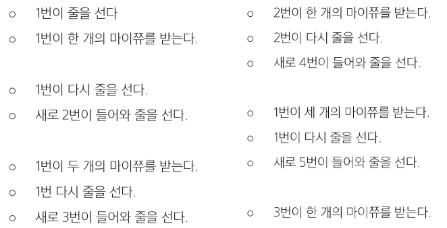

    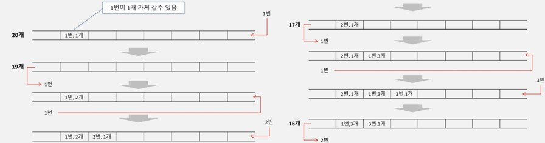
    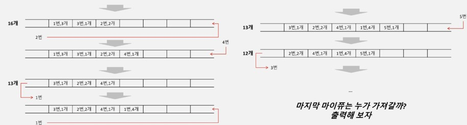


## 원형 큐(Circular Queue)
선형 큐를 이용한 삽입, 삭제는 리스트의 앞부분에 활용할 수 있는 공간이 있음에도 불구하고 rear = 최대용량 -1 에 다다르면 포화상태로 인식하여 더 이상의 삽입을 수행하지XX

-> 매 연산이 이루어질 때마다 저장된 원소들을 배열의 앞부분으로 모두 이동시킨다면?

-> 원소 이동에 많은 시간이 소요되어 큐의 효율성 떨어짐

-> 그렇다면 1차원 배열을 사용하되, 논리적으로는 배열의 처음과 끝이 연결되어 원형 형태의 큐를 이룬다고 가정하고 사용해보자

### 원형 큐의 연산과정
1. 초기 공백 상태
    - front = rear = 0
    - create Queue

        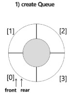

2. front 변수
    - 공백 상태와 포화 상태 구분을 쉽게 하기 위해 front가 있는 자리는 사용하지 않고 항상 빈 자리로 둠
    - enQueue(A)

        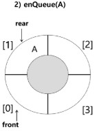

3. index의 순환
    - front와 rear의 위치가 배열의 마지막 인덱스인 n-1를 가리킨 후, 그 다음에는 논리적 순환을 이루어 리스트의 처음 인덱스인 0으로 이동해야 함
    - 이를 위해 나머지 연산자 `mod` 사용
    - enQueue(B) -> deQueue() -> enQueue(C) -> enQueue(D)

        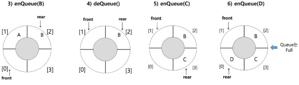

- 원형 큐 코드
    ```python
    class CircularQueue:
        # 원형 큐를 초기화하는 메서드
        def __init__(self, size=5):
            self.size = size  # 큐의 크기
            self.items = [None] * size  # 큐를 지정된 크기의 None 리스트로 초기화
            self.front = -1  # 큐의 앞쪽 인덱스 초기화
            self.rear = -1  # 큐의 뒤쪽 인덱스 초기화

        # 큐에 아이템을 추가하는 메서드
        def enqueue(self, item):
            if self.is_full():  # 큐가 가득 찬 경우
                print("큐가 가득 찼습니다.")  # 경고 메시지 출력
            else:
                if self.front == -1:  # 큐가 비어 있는 경우
                    self.front = 0  # front를 0으로 설정
                self.rear = (self.rear + 1) % self.size  # rear 인덱스를 순환하여 증가
                self.items[self.rear] = item  # rear 위치에 아이템 추가

        # 큐에서 아이템을 제거하고 반환하는 메서드
        def dequeue(self):
            if self.front == -1:  # 큐가 비어 있는 경우
                print("큐가 비었습니다.")  # 경고 메시지 출력
                return None
            else:
                dequeued_item = self.items[self.front]  # front 위치의 아이템 제거
                self.items[self.front] = None
                if self.front == self.rear:  # 큐에 하나의 아이템만 있는 경우
                    self.front = -1  # 큐를 비움
                    self.rear = -1
                else:
                    self.front = (self.front + 1) % self.size  # front 인덱스를 순환하여 증가
                return dequeued_item

        # 큐의 맨 앞 아이템을 반환하는 메서드
        def peek(self):
            if self.front == -1:  # 큐가 비어 있는 경우
                print("큐가 비었습니다.")  # 경고 메시지 출력
                return None
            else:
                return self.items[self.front]  # front 위치의 아이템 반환

        # 큐가 비어 있는지 확인하는 메서드
        def is_empty(self):
            return self.front == -1  # 큐가 비어 있는지 확인

        # 큐가 가득 찼는지 확인하는 메서드
        def is_full(self):
            return (self.rear + 1) % self.size == self.front  # rear 인덱스가 front 인덱스의 바로 앞에 있는지 확인
    ```
    - 원형 큐는 가득 찼는지 판단하는 기준을 `(self.rear + 1) % self.size == self.front`라고 정의함
    - ex. 나의 큐 사이즈가 5이고, rear가 index 4를 가리키고 있을 때 front가 0을 가리키고 있다면 가득 찼다고 판단!
    - 삽입 위치 또한 이 규칙을 따라서 `self.rear = (self.rear + 1) % self.size`로 정의

※ 우리는 Python의 deque(또는 list)를 사용할 예정이므로, 선형 큐에서 발생하는 '거짓 포화 상태' 문제는 생기지 않음

※ 또한, Python의 리스트는 가변 크기이기 때문에 별도로 최대 크기를 정할 필요도 없음. 따라서, 원형 큐의 구조적 복잡성은 생략하고, 큐의 동작 개념만 간단히 이해하고 넘어가도 충분하다~

-> `deque` 쓸거얌

-> deque가 어떻게 동작하기에 이것들이 한번의 연산으로 진행이 되는 것일까?

-> rear번째에 있는 위치에 값 삽입(1번)

-> front번째에 있는 위치에 값 삭제(1번)

-> 이런 형식으로 진행되기 때문에 deque의 pop이 리스트처럼 n번 연산이 아닌, 1번의 연산으로 실행 가능하다


### 리스트의 문제점
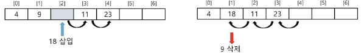
- 자료의 삽입/삭제 연산 과정에서 연속적인 메모리 배열을 위해 원소들을 이동시키는 작업이 필요함
- 원소의 개수가 많고, 삽입/삭제 연산이 빈번하게 일어날수록 작업 소요 시간이 크게 증가함

- 이를 어떻게 해결할 수 있을까?
    - 주소를 지정 안하면 됨
    - 그럼 순서를 어떻게 만드냐?
    - 내 다음은 OO이다. 하고 알려주는거임


## 연결 리스트(Linked List)
자료의 논리적인 순서와 메모리 상의 물리적인 순서가 일치하지 않고, 개별적으로 위치하고 있는 **각 원소를 연결**하여 **하나의 전체적인 자료구조**를 이룸

- **링크를 통해 원소에 접근**하므로, 리스트에서처럼 물리적인 순서를 맞추기 위한 작업이 필요XX
- 자료구조의 크기를 동적으로 조정할 수 있어, 메모리의 효율적인 사용이 가능함

### 연결 리스트의 기본 구조
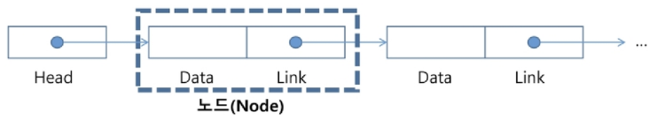
- 노드
    - 연결 리스트에서 하나의 원소를 표현하는 기본 구성 요소
    - 구성 요소
        1. 데이터 필드
            - 원소의 값을 저장
            - 저장할 원소의 종류나 크기에 따라 구조를 정의하여 사용
        2. 링크 필드
            - 다음 노드의 참조 값을 저장
- 헤드
    - 연결 리스트의 첫 노드에 대한 참조 값을 갖고 있음


### 단순 연결 리스트(Singly Linked List)
노드가 하나의 링크 필드에 의해 다음 노드와 연결되는 구조
- 헤드가 가장 앞의 노드를 가리키고, **링크 필드가 연속적으로 다음 노드를 가리킴**
- 링크필드가 Null인 노드가 연결 리스트의 가장 마지막 노드

    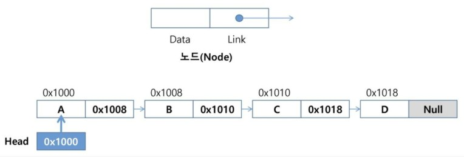

- 삽입 연산(첫 번째 노드로 삽입)
    - 공백 리스트의 첫 번째에 'A'노드 삽입할 때

        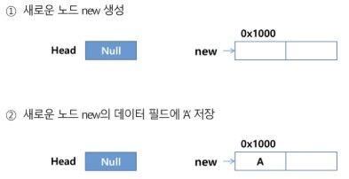
        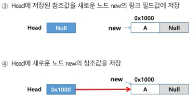

    - 'A'를 원소로 갖고 있는 리스트의 첫 번째에 'C'노드를 삽입할 때

        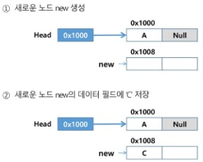
        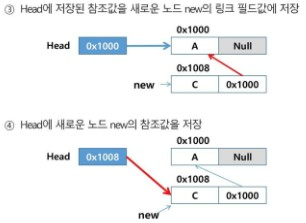

    ```python
    class Node:
        def __init__(self, data):
            self.data = data
            self.next = None
    
    class SinglyLinkedList:
        def __init__(self):
            self.head = None
        
        def insert(self, data, position):
            new_node = Node(data)
            if position == 0:
                new_node.next = self.head
                self.head = new_node
            else:
                current = self.head
                for _ in range(position -1):
                    if current is None:
                        print("범위를 벗어난 값")
                        return
                    current = current.next
                new_node.next = current.next
                current.next = new_node
    ```

- **삽입 연산(마지막 노드로 삽입)**
    - 'C', 'A'를 원소로 갖고 있는 리스트의 마지막에 'D' 노드 삽입할 때

        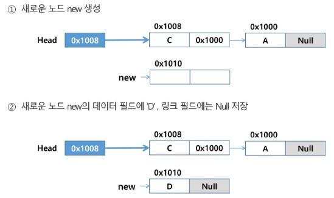
        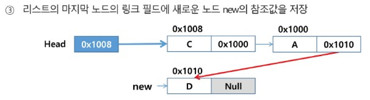
    

    ```python
    class Node:
        def __init__(self, data):
            self.data = data  # 노드의 데이터
            self.next = None  # 다음 노드를 가리키는 포인터

    class SinglyLinkedList:
        def __init__(self):
            self.head = None  # 링크드 리스트의 헤드 초기화

        # 리스트의 끝에 노드를 추가하는 메서드
        def append(self, data):
            # 삽입하려고 하는 데이터를 토대로 Node 생성
            new_node = Node(data)
            if self.is_empty():     # 비어있다면
                self.head = new_node
            else:
                current = self.head
                while current.next:   # 1번 객체의 next를 봤을 때 가리키고 있는 2번 객체가 있다면
                    current = current.next      # 2번 객체를 기준으로 next 확인
                current.next = new_node         # 새로운 노드를 마지막 노드의 next가 가리킬 수 있도록..

        # 리스트가 비어있는지 확인하는 메서드
        def is_empty(self):
            return self.head is None    # 헤드가 none이니?
            # linkedlist가 비어있을 땐 head에 노드 추가해야 하므로 확인 필요
    ```

- 삽입 연산(가운데 노드로 삽입)
    - 'C', 'A', 'D'를 원소로 갖고 있는 리스트의 두 번째에 'B'노드를 삽입할 때

        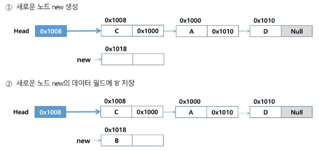
        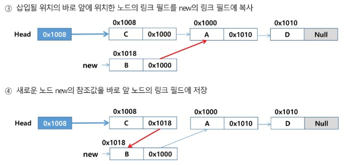
    
    ```python
    class Node:
        def __init__(self, data):
            self.data = data
            self.next = None

    class SinglyLinkedList:
        def __init__(self):
            self.head = None

        def insert(self, data, position):
            new_node = Node(data)
            if position == 0:
                new_node.next = self.head
                self.head = new_node
            else:
                current = self.head
                for _ in range(position -1):
                    if current is None:
                        print("범위를 벗어난 값")
                        return
                    current = current.next
                new_node.next = current.next
                current.next = new_node    
    ```

- 삭제 연산
    - 'A', 'B', 'C', 'D'를 원소로 갖고 있는 리스트의 'B'노드를 삭제할 때

        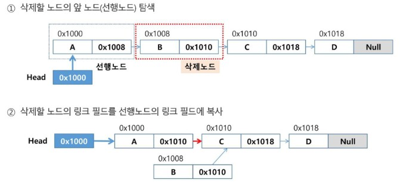
        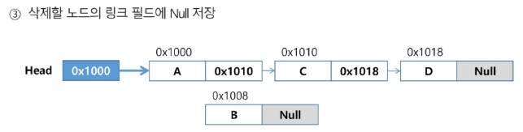

    - 'A', 'C', 'D' 원소를 갖고있는 리스트의 'A'노드 삭제할 때

        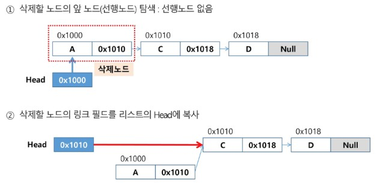
        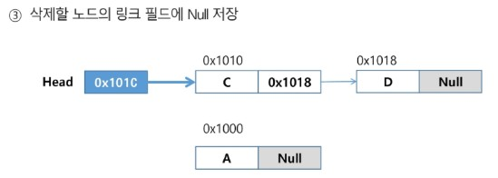
    
    ```python
    def is_empty(self):
        return self.head is None
    
    def delete(self, position):
        if self.is_empty():
            print("리스트가 비었습니다")
            return
        
        if position == 0:
            deleted_data = self.head.data
            self.head = self.head.next
        else:
            current = self.head
            for _ in range(position -1):
                if current is None or current.next is None:
                    print('범위를 벗어났습니다')
                    return
                current = current.next
            deleted_node = current.next
            deleted_data = deleted_node.data
            current.next = current.next.next
        return deleted_data
    ```

※ 단순 연결 리스트 최종 구현

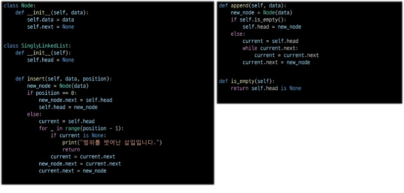
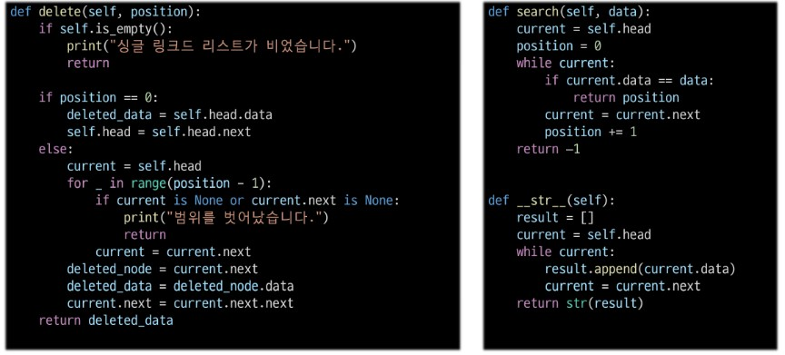

※ 단순 연결 리스트 장점

-> 필요한만큼 메모리 사용

※ 단순 연결 리스트 단점

-> 특정 요소에 접근하려면 순차적으로 탐색 `O(N)`

-> 역방향 탐색 불가


## 이중 연결 리스트(참고)
양쪽 방향으로 순회할 수 있도록 노드를 연결한 리스트
- 두 개의 링크 필드와 한 개의 데이터 필드로 구성
    
    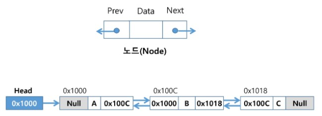

- 삽입 연산
    - cur이 가리키는 노드 다음으로 D 값을 가진 노드를 삽입하는 과정

        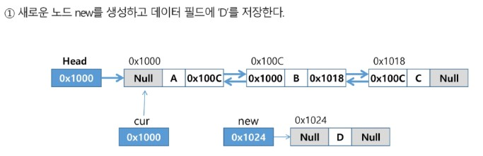
        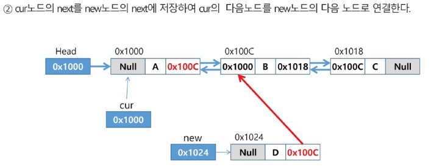
        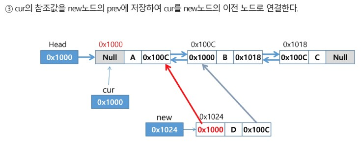
        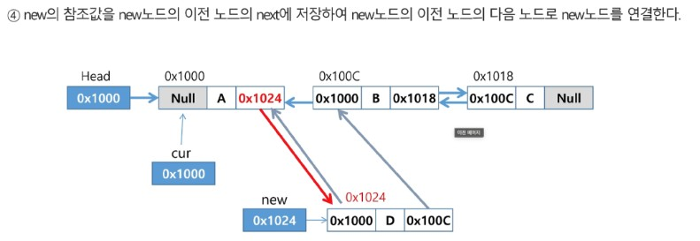
        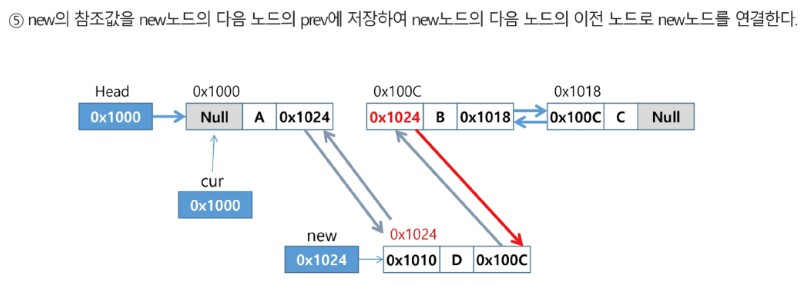

- 삭제 연산
    - cur이 가리키는 노드를 삭제하는 과정

        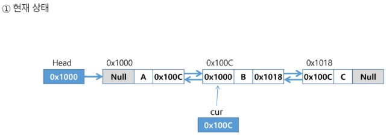
        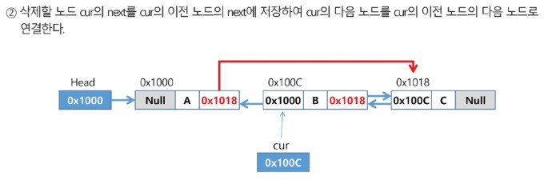
        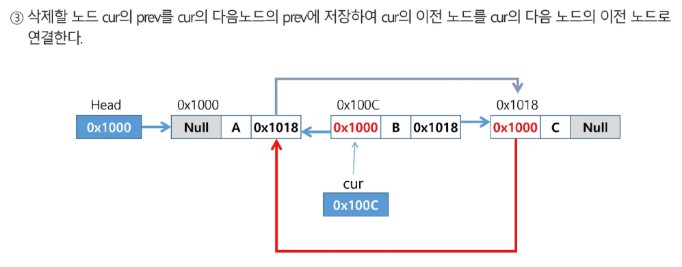
        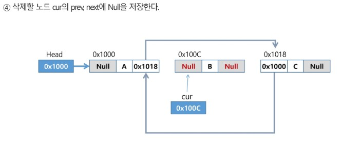


