# 트리와 그래프
## 트리
상위 원소에서 하위 원소로 내려가면서 확장되는 트리(나무)모양의 구조
- 비선형 구조
- 원소들 간에 1:N 관계를 가지는 자료구조
- 원소들 간에 계층관계를 가지는 계층형 자료구조
- 한 개 이상의 노드로 이루어진 유한 집합
    - 노드 중 최상위 노드를 **루트(root)**라고 함
    - 나머지 노드들은 n (>=0)개의 분리집합 `T1, .. , Tn`으로 분리될 수 있음
- T1, .., Tn은 각각 하나의 트리가 되며, 루트의 **부 트리(subtree)**라고 함

    

### 트리 용어
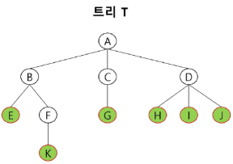

- **노드(node)**
    - 트리의 원소
    - A, B, .., K
- **간선(edge)**
    - 노드와 노드를 연결하는 선
    - 부모 노드와 자식 노드를 연결
- **루트 노드(root node)**
    - 트리의 시작 노드인 최상위 노드
    - 트리 T의 루트 노드 - A
- 형제 노드(sibling node)
    - 같은 부모 노드의 자식 노드들
    - B, C, D는 형제 노드
- 조상 노드(ancestor node)
    - 간선을 따라 루트 노드까지 이르는 경로에 있는 모든 노드들
    - K의 조상 노드: F, B, A
- 서브 트리(subtee)
    - 부모 노드와 연결된 간선을 끊었을 때 생성되는 트리
- 자손 노드(descendant node)
    - 서브 트리에 있는 하위 레벨의 노드들
    - B의 자손 노드: E, F, K
- 차수(degree)
    - 노드의 차수
        - 노드에 연결된 자식 노드 수
        - B의 차수 = 2, C의 차수 = 1
    - 트리의 차수
        - 트리에 있는 노드의 차수 중 가장 큰 값
        - 트리 T의 차수 = 3
    - 단말 노드(leaf node)
        - 차수가 0인 노드 즉, 자식 노드가 없는 노드
- 레벨
    - 루트에서 노드까지의 거리
    - 루트 노드의 레벨은 0, 자식 노드의 레벨은 부모 레벨 + 1

        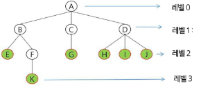
- 높이
    - 루트 노드에서 가장 먼 리프 노드까지의 간선 수
    - 트리의 높이는 최대 레벨(트리 T의 높이 = 3)


### 이진 트리(Binary Tree)
각 노드가 자식 노드를 최대한 2개까지만 가질 수 있는 트리(왼쪽/오른쪽 자식 노드)
- 차수가 2인 트리
- 모든 노드들이 최대 2개의 서브 트리를 갖는 특별한 형태의 트리
- 즉, `레벨 i에서 노드의 최대 개수는 2i`개
- 높이가 h인 이진 트리가 가질 수 있는 노드의 `최소 개수는 h+1`개가 되고, `최대 개수는 2^(n+1)-1`개가 됨

    


### 포화 이진 트리(Perfect Binary Tree)
모든 레벨에 노드가 포화 상태로 차 있는 이진 트리
- 높이가 h일 때 최대 노드 개수인 `2^(h+1)-1`의 노드를 가진 이진 트리
    - 높이가 3일 때 2^(3+1)-1 = 15개의 노드
- 루트를 1번으로 하여 `2^(h+1)-1`까지 정해진 위치에 대한 노드 번호를 가짐
    
    


### 완전 이진 트리(complete Binary Tree)
높이가 h이고 노드 수가 n일 때 (단, h+1 <= n < 2^(h+1)-1) 포화 이진 트리의 노드 번호 1번부터 n번까지 빈 자리가 없는 이진 트리
- ex. 노드가 10개인 완전 이진 트리

    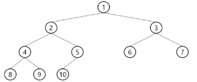


### 편향 이진 트리(Skewed Binary Tree)
높이 h에 대한 최소 개수의 노드를 가지면서 한쪽 방향의 자식 노드만을 가진 이진 트리


### 리스트를 이용한 이진 트리 표현

- 이진 트리에 각 노드 번호를 부여
- 루트 번호를 1로
- 레벨n에 있는 노드에 대해 왼쪽부터 오른쪽으로 2^n부터 2^(n+1)-1까지 차례로 부여
- 노드 번호가 i일 때
    
    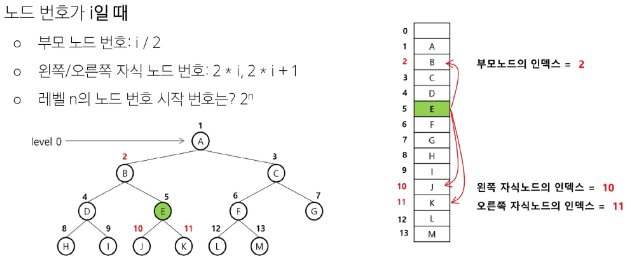
    - 노드 번호를 리스트의 인덱스로 사용

- 높이가 h인 이진 트리를 위한 배열 크기
    - 레벨 i의 최대 노드 수: `2^i`
    - 따라서 모든 노드의 수: `2^(h+1)-1`
    - 그러므로 리스트 크기: `2^(h+1)`
    
        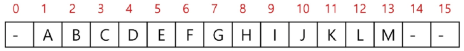

- 편향 이진 트리를 리스트로 표현한다면?
    
    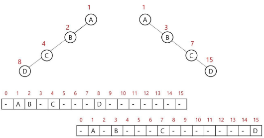

- 리스트를 이용한 이진 트리 코드1 (00_tree.py)
    ```python
    '''
    아래와 같은 이진 트리가 있다면,
            'A'
        /   \
        'B'     'C'
        /  
    'D'
    /
    'E'
    '''
    # 1번 index를 root로 설정하였을 때,
    # 'A'의 왼쪽, 오른쪽 자식은 각각 2, 3 index에 해당함
    # 'B'의 왼쪽, 오른쪽 자식은 각각 4, 5 index에 해당함

    # 위 이진트리를 리스트로 나타낸다면
    #        0     1    2    3    4    5     6     7    8
    tree = [None, 'A', 'B', 'C', 'D', None, None, None, 'E', None, None, None, None, None, None, None]
    # 계산하기 편하게 루트 노드를 index 1부터 배치
    # 값이 없는 노드 자리에 None 넣어야 나머지 자식 노드들의 순서가 맞음
    # 15번까지 None 삽입
    # 비선형 자료구조 tree를 선형 자료구조로 만들어서 사용 가능

    print('존재하는 모든 요소 출력하기')
    # root 노드를 기준으로, 모든 존재하는 자식들의 정보를 출력해야 함
    for index in range(1, 2**4):
        if tree[index]:
            print(tree[index])

    print('부모 찾기')
    # 'E' 노드를 기준으로, 조상 노드를 찾으로 가자
    index = 8
    # 2진 트리에서 부모는, 내 인덱스를 2로 나눈 몫이면 부모
    while index > 1:
        parent = tree[index // 2]
        print(parent, end=' ')
        index //= 2

    print()
    print('왼쪽 or 오른쪽 자식 찾기')
    index = 1
    while index < 8:
        #  왼쪽 자식은 내 인덱스 * 2
        # 오른쪽 자식은 내 인덱스 * 2 + 1
        left_child = tree[index * 2]
        right_child = tree[index * 2 + 1]
        print(left_child)
        print(right_child)
        index *= 2
    ```
- 리스트를 이용한 이진 트리 코드2 (01_make_tree.py)
    ```python
    # 본인 인덱스, 본인 값, 왼쪽 자식 인덱스, 오른쪽 자식 인덱스
    input_data = [
        [1, 'A', 2, 3],
        [2, 'B', 4, 0],
        [3, 'C', 0, 0],
        [4, 'D', 8, 0],
        [8, 'E', 15, 0],
    ]

    N = 16
    tree = [0] * (N+1)  # 0번 노드 사용하지 않음!
    print(tree)

    for idx in range(len(input_data)):
        print(input_data[idx])
        my_idx = input_data[idx][0]
        value = input_data[idx][1]
        tree[my_idx] = value
    print(tree)
    # 보통은 입력받는 데이터가 내 위치 잘 모름
    # 내 부모가 누구인지만 주어지는 경우가 일반적
    # 02_make_tree2.py
    ```
- 리스트를 이용한 이진 트리 코드3(02_make_tree.py)
    ```python
    # 부모의 정보만 주어질 때, 이진 트리 생성하기
    # 자신의 값, 부모 인덱스 (부모가 0인 경우, 루트)
    input_data = [
        ['A', 0],
        ['C', 1],
        ['B', 1],
        ['F', 3],
        ['G', 6],
        ['E', 2],
        ['D', 2]
    ]

    N = 16
    tree = [0] * (N+1)
    print(tree)

    for data in input_data:
        print(data)
        value = data[0]     # A
        parent = data[1]    # 0

        # 자식 인덱스 계산
        left_child = parent * 2
        right_child = parent * 2 + 1

        # 나에게 주어진 정보가 부모 노드의 index 뿐이니
        # 내가 이진 트리에서 어디에 삽입될 수 있는지를 보려면
        # 당연하게도 부모 노드의 왼, 오 자식 중 비어있는 곳을 찾아야 함

        # 내 부모가 없다 -> 0이다 -> 내가 루트 노드다
        if not parent:
            tree[1] = value     # 루트 노드 위치에 나를 삽입
            continue            # 다음 for문으로 넘김

        if not tree[left_child]:    # 왼쪽 자식이 비어있으면
            tree[left_child] = value    # 나를 삽입
        else:
            tree[right_child] = value   # 왼쪽 자식이 안비어있으면 오른쪽에 나 삽입
    print(tree)
    ```

- 편향 이진 트리의 경우 사용하지 않는 리스트 원소에 대한 메모리 공간 낭비 발생
    - 트리 중간에 새로운 노드 삽입 or 기존 노드 삭제할 경우 리스트 크기 변경이 어려워 비효율적
    - 연결 리스트 이용하자

### 연결 리스트를 이용한 이진 트리 표현
이진 트리의 모든 노드는 최대 2개의 자식 노드를 가지므로 일정한 구조의 이중 연결 리스트 노드를 사용하여 구현


## 이진 트리 순회(traversal)
- 순회(traversal): 트리의 노드들을 체계적으로 방문하는 것

    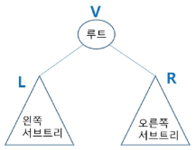
- 기본적인 순회 방법 3가지
    - 전위 순회(preorder traversal): VLR
        - **부모노드** -> 자식노드(좌) -> 자식노드(우) 순서로 방문
    - 중위 순회(inorder traversal): LVR
        - 자식(좌) -> **부모** -> 자식(우) 노드 순으로 방문
    - 후위 순회(postorder traversal): LRV
        - 자식(좌) -> 자식(우) -> **부모** 노드 순으로 방문

※ 방문한다는 것은 일의 처리를 그때 처리한다는 의미

### 전위 순회
- 수행 방법
    1. 현재 노드 T를 방문하여 처리 -> V
    2. 현재 노드 T의 왼쪽 서브 트리로 이동 -> L
    3. 현재 노드 T의 오른쪽 서브 트리로 이동 -> R
- 수행 순서
    1. A -> T1 -> T2
    2. A -> **B (T3) E** -> **C F G**
    3. A B **D H I** E C F G

    
```python
# 리스트 구현
def preorder_traversal(idx):
    # 어디까지 순회해야 하는지?
    # 순회 대상이 범위를 벗어나지 않았다면
    if idx <= N:    # 완전 이진 트리이므로 내가 조사해야 하는 노드 개수는 N개(뒤에 더 없음)
        # 전위 순회는 부모 노드를 먼저 조사
        print(tree[idx], end=' ')
        # 이제 왼쪽 서브 트리에 대해서도 동일한 조건
        preorder_traversal(idx * 2)
        # 이제 오른쪽 서브 트리에 대해서도 동일한 조건
        preorder_traversal(idx * 2 + 1)

tree = [0, 'A', 'B', 'C', 'D', 'E']
preorder_traversal(1)  # 'A' 'B' 'D' 'E' 'C'

# 연결리스트 구현
class TreeNode:
    def __init__(self, key):
        self.left = None  # 왼쪽 자식 노드
        self.right = None  # 오른쪽 자식 노드
        self.val = key  # 노드의 값

def preorder_traversal(root):
    if root:
        print(root.val)  # 현재 노드 방문
        preorder_traversal(root.left)  # 왼쪽 서브트리 방문
        preorder_traversal(root.right)  # 오른쪽 서브트리 방문
```

### 중위 순회
- 수행 방법
    1. 현재 노드 T의 왼쪽 서브 트리로 이동 -> L
    2. 현재 노드 T를 방문하여 처리 -> V 
    3. 현재 노드 T의 오른쪽 서브 트리로 이동 -> R
- 수행 순서
    1. T1 -> A -> T2
    2. **(T3) B E** -> A ->  **F C G**
    3. **H D I** B E A F C G

    
```python
# 리스트 구현
def inorder_traversal(idx):
    # 중위순회란, 부모 노드 차례가 중간인 순회 방식
    # 즉, 왼쪽 서브 트리에 대한 처리가 우선되어야 함

    # 전위 순회 코드에서 순서만 바꾸면 됨
    if idx <= N:
        # 왼쪽 서브 트리에 대해서도 동일한 조건
        inorder_traversal(idx * 2)
        # 중위 순회는 왼쪽 서브트리 순회 후 조사
        print(tree[idx], end=' ')
        # 오른쪽 서브 트리에 대해서도 동일한 조건
        inorder_traversal(idx * 2 + 1)

tree = [0, 'A', 'B', 'C', 'D', 'E']
inorder_traversal(1)  # 'D' 'B' 'E' 'A' 'C'

# 연결리스트 구현
class TreeNode:
    def __init__(self, key):
        self.left = None  # 왼쪽 자식 노드
        self.right = None  # 오른쪽 자식 노드
        self.val = key  # 노드의 값

def inorder_traversal(root):
    if root:
        inorder_traversal(root.left)  # 왼쪽 서브트리 방문
        print(root.val)  # 현재 노드 방문
        inorder_traversal(root.right)  # 오른쪽 서브트리 방문
```
- 리스트 구현 방식은 뭐 이진 트리6

### 후위 순회
- 수행 방법
    1. 현재 노드 T의 왼쪽 서브 트리로 이동 -> L
    2. 현재 노드 T의 오른쪽 서브 트리로 이동 -> R
    3. 현재 노드 T를 방문하여 처리 -> V 
- 수행 순서
    1. T1 -> T2 -> A
    2. **(T3) E B** -> **F G C** -> A   
    3. **H I D** E B F G C A

    
```python
# 리스트 구현
def postorder_traversal(idx):
    if idx <= N:
        # 왼쪽 서브 트리에 대해서도 동일한 조건
        postorder_traversal(idx * 2)
        # 오른쪽 서브 트리에 대해서도 동일한 조건
        postorder_traversal(idx * 2 + 1)
        # 후위 순회는 모든 서브트리 순회 후 조사
        print(tree[idx], end=' ')

tree = [0, 'A', 'B', 'C', 'D', 'E']
postorder_traversal(1)  # 'D' 'E' 'B' 'C' 'A'

# 연결리스트 구현
class TreeNode:
    def __init__(self, key):
        self.left = None  # 왼쪽 자식 노드
        self.right = None  # 오른쪽 자식 노드
        self.val = key  # 노드의 값
        '''
        키 값의 형태가 딕셔너리 형태로 생겼을 수도 있음
        key = {
            name: '홍길동'
            age: 16
        }
        '''

def postorder_traversal(root):
    if root:
        postorder_traversal(root.left)  # 왼쪽 서브트리 방문
        postorder_traversal(root.right)  # 오른쪽 서브트리 방문
        print(root.val)  # 현재 노드 방문
```


### 수식 트리(Expression Tree)
수식을 표현하는 이진 트리
- 수식 이진 트리(Expression binary Tree)라고 부르기도 함
- 연산자는 루트 노드이거나 가지 노드
- 피연산자는 모두 잎 노드

    

- 수식 트리 순회

    
    - 전위 순회: `+ * * / A B C D E`
    - 중위 순회: `A / B * C * D + E`
    - 후위 순회: `A B / C * D * E +`
    - 후위 표기법이랑 다른거임
    - 자식 노드는 정수인데, 부모 노드는 문자열인 서브트리가 있을 수 있음
        - 문자열을 루트로 하는 서브트리는 다른 서브트리의 자식임에도 불구하고 문자열일 수 있음
    - 이 값들은 입력받는 데이터로서 전부 문자열 형태로 오게 됨 -> 연산 시 형변환 잘 해줘야 함!!

- 함수 반환값의 데이터타입 중요성 슬슬 알게 될지도?


## 그래프
아이템(사물 또는 추상적 개념)들과 이들 사이의 연결 관계를 표현
- 그래프는 정점(Vertex)들의 집합과 이들을 연결하는 간선(Edge)들의 집합으로 구성된 자료 구조
    - V: 정점의 개수
    - E: 그래프에 포함된 간선 개수
    - V개의 정점을 가지는 `그래프는 최대 V * (V-1) / 2` 간선이 가능(암기XX)
    - ex. 5개의 정점이 있는 그래프의 최대 간선 수는 (5*4/2) = 10개
- 선형 자료구조나 트리 자료구조로 표현하기 어려운 **N:M 관계를 가지는 원소들을 표현하기에 용이**함

### 그래프 용어
- 정점(Vertax): 그래프의 구성요소로 하나의 연결점
- 간선(Edge): 두 정점을 연결하는 선
- 차수(Degree): 정점에 연결된 간선 수

### 그래프 유형
- 무방향 그래프(Undirected Graph)
    - 간선에 방향성이 존재하지 않을 때

        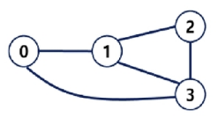

- 방향 그래프(Directed Graph)
    - 간선에 방향성이 존재할 때

        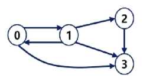
        - 차수의 개념이 조금 달라짐
        - '진출차수', '진입차수'
        - 0번 노드는 2개의 진출 차수(1번, 3번), 1개의 진입 차수(1번)를 가짐

- 가중치 그래프(Weighted Graph)
    - 간선에 가중치 정보를 나타냈을 때

        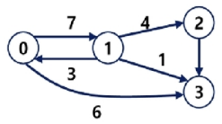
        - 무방향 그래프일 때도 가중치 가능

- 사이클이 없는 방향 그래프(DAG, Direct Acyclic Graph)
    - 무방향 그래프는 언제든지 사이클 돌 수 있어서 방향 그래프에 대해서만 생각

        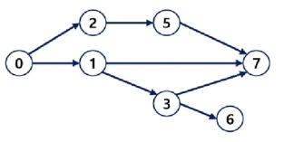

- 트리(Tree)
    - 각 노드는 최대 하나의 부모 노드가 존재할 수 있음
    - 각 노드는 자식 노드가 없거나 하나 이상 존재할 수 있음
    - 두 노드 사이에는 유일한 경로 존재
    - **트리도 그래프이다!!**

        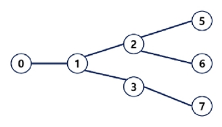


- 완전 그래프
    - 정점들에 대해 가능한 모든 간선들을 가진 그래프

        

- 부분 그래프
    - 원래 그래프에서 일부의 정점이나 간선을 제외한 그래프

**※ 인접(Adjacency)**

-> 두 개의 정점에 간선이 존재(연결됨)하면 서로 인접해 있다고 함

-> 완전 그래프에 속한 임의의 두 정점들은 서로 인접해있음

**※ 그래프 경로**

-> 어떤 정점 A에서 시작하여 다른 정점 B로 끝나는 순회로, 두 정점 사이를 잇는 간선들을 순서대로 나열한 것

-> 즉, 같은 정점을 거치지 않는 간선들의 Sequence

-> 어떤 정점에서 다른 정점으로 가는 경로는 여러가지일 수 있음

-> 0 ~ 6 경로 예시

    -> 정점들: 0 - 2 - 4 - 6
    -> 간선들: (0,2), (2,4), (4,6)

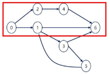

**※ 싸이클(Cycle)**

-> 경로의 시작 정점과 끝 정점이 같음

-> 즉, 시작한 정점에서 끝나는 경로

-> 1 - 3 - 5 - 1 예시


### 그래프 표현
간선의 정보를 저장하는 방식으로, 메모리나 성능을 고려해서 결정
1. 인접 행렬(Adjacent matrix)
    - V * V 크기의 2차원 배열을 이용해서 간선 정보 저장
2. 인접 리스트(Adjacent List)
    - 각 정점마다 다른 정점으로 나가는 간선의 정보를 저장
3. 간선 리스트(Edge List)
    - 간선(시작 정점, 끝 정점)의 정보를 객체로 표현하여 리스트에 저장

- 인접 행렬
    ```python
    adj_matrix = [
        [0, 1, 1, 0, 0, 1, 1],  # 0번 정점: 0번에서 1번으로 진출 가능해? (1: 응)
        [1, 0, 0, 1, 0, 0, 0],  # 1번 정점: 1번에서 0번으로 진출 가능해? (1: 응)
        [1, 0, 0, 1, 0, 0, 0],  # 2번 정점: 2번에서 1번으로 진출 가능해? (0: 아니)
        [0, 1, 1, 0, 1, 1, 1],  # 3번 정점: 3번에서 1, 2, 4, 5, 6번으로 진출 가능해? (1: 응)
        [0, 0, 0, 1, 0, 0, 1],  # 4번 정점: 4번에서 3, 6번으로 진출 가능해? (1: 응)
        [1, 0, 0, 1, 0, 0, 0],  # 5번 정점
        [1, 0, 0, 1, 1, 0, 0]   # 6번 정점
    ]
    ```
    - 두 정점을 연결하는 간선의 유무를 행렬로 표현
    - V * V 정방 행렬(행의 수와 열의 수 같음)
    -  행 번호와 열 번호는 그래프의 정점에 대응
    - 두 정점이 인접되어 있으면 1, 그렇지 않으면 0으로 표현
    - 무향 그래프
        - `i번째 행의 합 = i번째 열의 합 = Vi의 차수`
    - 유향 그래프
        - `행 i의 합 = Vi의 진출 차수`
        - `열 i의 합 = Vi의 진입 차수`
    - 장점
        - 두 정점 사이에 간선이 있는 지 확인하는 연산이 `O(1)`로 빠름
        - 구현 단순
        - **정적 그래프**에 적합(정점과 간선 개수가 변하지 않는 그래프에 적합)
    - 단점
        - 많은 메모리 차지(공간복잡도: `O(V^2)`)
        - 간선 수 확인하거나 인접한 정점을 나열하는 연산이 느림
    - 사용하기 좋은 상황
        - Dense Graph(밀집그래프)에 적합
        - 두 정점 사이에 간선이 있는지 빠르게 확인해야 하는 경우

    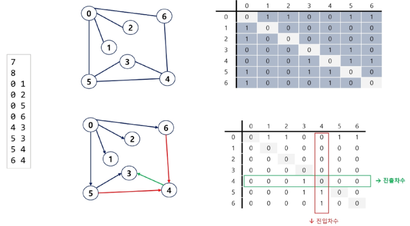

- 인접 리스트
    ```python
    adj_list = {
        0: [1, 2, 5, 6],
        1: [0, 3],
        2: [0, 3],
        3: [1, 2, 4, 5, 6],
        4: [3, 6],
        5: [0, 3],
        6: [0, 3, 4]
    }
    ```
    - 각 정점에 대한 인접 정점들을 순차적으로 표현
    - 하나의 정점에 대한 인접 정점들을 각각 노드로 연결하는 연결 리스트로 저장
    
        
    - 장점
        - 필요한 공간만 사용하므로 공간 복잡도 `O(V+E)`
        - 인접한 정점을 나열하는 연산이 빠름
    - 단점
        - 두 정점 사이에 간선이 있는지 확인하는 연산이 느림 `O(V)`
        - LinkedList로 구현이 복잡함
    - 사용하기 좋은 상황
        - Sparse Graph(희소 그래프)에 적합
        - 그래프가 동적으로 변하는 경우(정점과 간선이 자주 추가/삭제)
        - 인접한 정점을 자주 순회해야 하는 경우

    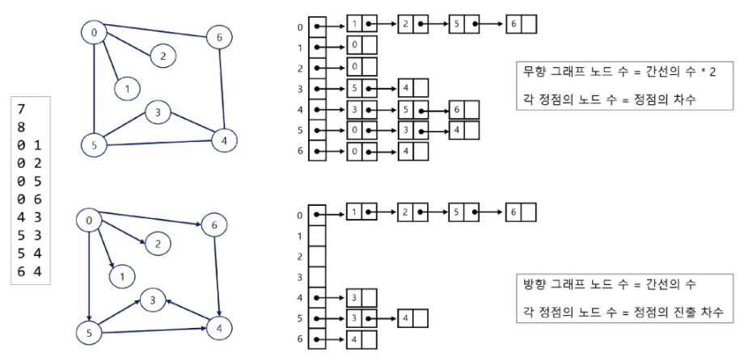

- 간선 리스트
    ```python
    edges = [
        (0, 1),
        (0, 2),
        (0, 5),
        (0, 6),
        (1, 3),
        (2, 3),
        (3, 4),
        (3, 5),
        (3, 6),
        (4, 6)
    ]
    ```
    - 두 정점에 대한 간선 그 자체를 객체로 표현하여 리스트로 저장
    - 간선을 표현하는 두 정점의 정보를 나타냄(시작 정점, 끝 정점)
    - 장점
        - 필요한 간선만 저장하므로 공간 복잡도 `O(E)`
        - 간선을 직접 다루는 연산에 효율적
    - 단점
        - 두 정점 사이에 간선이 있는 지 확인하는 연산이 느림 `O(E)`
        - 특정 정점에 인접한 정점을 찾는 연산이 느림 `O(E)`
    - 사용하기 좋은 상황
        - 간선 중심 연산을 자주 수행해야 하는 경우(ex. MST)

    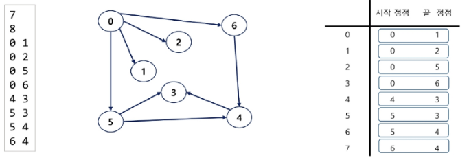


## 참고(BST)
### 빠른 탐색의 필요성
대량의 데이터를 다루게 되면서 데이터를 효율적으로 저장, 검색, 수정하는 것이 중요
- 선형 데이터 구조의 한계
    - 배열: 데이터 삽입/삭제 비효율적 `O(n)`
    - 연결 리스트: 검색이 비효율적 `O(n)`
    - 데이터 양이 많아질수록 성능 저하됨

### BST(Binary Search Tree)
데이터의 저장, 검색, 삽입, 삭제를 효율적으로 처리하기 위한 자료구조

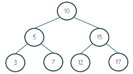

- 특징
    - 각 노드가 최대 2개의 자식을 가짐
    - 데이터를 정렬된 형태로 저장하여 탐색/삽입/삭제를 효율적으로 수행

- 구조
    - 이진트리의 속성을 가짐 + 순서 속성도 추가로 가짐
        - 왼쪽 자식 노드의 키 값이 부모 노드의 키 값보다 작다
        - 오른쪽 자식 노드의 키 값이 부모 노드의 키 값보다 크다

- 장점
    - 배열 또는 LinkedList와 달리, 삽입/삭제 후에도 데이터가 정렬된 상태 유지
    - 데이터가 균형있게 분포되어 있을 때 평균적으로 탐색/삽입/삭제 연산의 시간 복잡도가 `O(logN)`
    - 동적으로 크기 조정 가능 -> 크기가 고정된 배열에 비해 유연성 높다

- 단점
    - 트리가 한쪽으로 치우치면 최악의 경우엔 시간 복잡도가 `O(n)`이 될 수 있음
    - 각 노드는 두 개의 자식 포인터를 저장해야 하므로 큰 데이터 집합의 경우 메모리 오버헤드가 발생할 수 있음

### BST 속성
- 높이
    - 특정 노드에서 가장 깊은 리프 노드까지의 경로에 있는 간선 개수
    - 트리의 높이는 루트 노드의 높이와 동일
    - 리프 노드의 높이는 0
    - 균형 트리 높이 `O(logN)` , 불균형 트리 높이 `O(N)`
- 깊이
    - 루트 노드에서 해당 노드까지의 경로에 있는 간선 수
    - 루트 노드의 높이는 0

### BST 주요연산 - 탐색
순서 속성을 이용하여 루트 노드에서부터 시작해 왼쪽 또는 오른쪽 자식으로 이동하면서 **키 값을 비교**하며 주어진 키 값을 찾는 과정

1. 루트 노드부터 탐색
    - 현재 노드(10)와 찾고자 하는 키(12)를 비교
    - 10 < 12 이므로 오른쪽 자식으로 이동하여 비교
2. 현재 노드(15)와 찾는 키(12)를 비교
    - 15 > 12 이므로 왼쪽 자식으로 이동하여 비교
3. 현재 노드(12)와 찾는 키(12)를 비교
    - 12 == 12 이므로 탐색 종료

    

- 탐색 코드: `99_3_binary_search_tree.py`의 search 함수

### BST 주요연산 - 삽입
새로운 노드 삽입 시 **BST의 특징(자식노드 최대 2개)를 유지**하며, 삽입할 위치를 찾기 위해 루트 노드에서부터 적절한 위치까지 내려감
- 트리의 순서 속성 유지를 위해 새로운 노드는 리프 노드로 삽입

1. 루트 노드에서부터 삽입 위치 탐색
    - 현재 노드(10)와 삽입 노드(16) 비교
    - 10 < 16 이므로 오른쪽 자식으로 이동하여 삽입 위치 탐색
2. 현재 노드(15)와 삽입 노드(16)을 비교
    - 15 < 16 이므로 오른쪽 자식으로 이동하여 삽입 위치 탐색
3. 현재 노드(17)와 삽입 노드(16)을 비교
    - 17 > 16 이고 리프 노드이므로 오른쪽 자식 노드로 삽입

        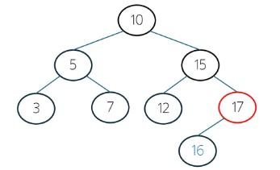

- 삽입 코드: `99_3_binary_search_tree.py`의 insert 함수

### BST 주요연산 - 삭제
삭제하려는 노드 위치와 자식 노드의 유무에 따라 세 가지 경우로 나누어 처리
- 삭제할 노드가 **리프** 노드인 경우
- 삭제할 노드가 **한 개의 자식 노드**를 가질 경우
- 삭제할 노드가 **두 개의 자식 노드**를 가질 경우

1. 루트 노드에서부터 삭제할 노드 탐색
    - 탐색 과정은 탐색 연산과 동일

2. 삭제할 노드(16)가 리프 노드인 경우 -> 단순 제거

    
3. 삭제할 노드(5)가 한 개의 자식을 가진 경우 -> 삭제할 노드의 자식 노드를 부모 노드에 연결
    - 각 서브트리는 독립적으로 존재하여, BST 속성이 유지됨

    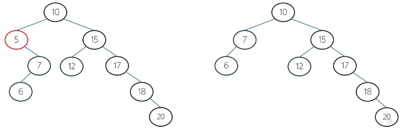
4. 삭제할 노드(15)가 두 개의 자식을 가진 경우 -> 중위 후속자 또는 중위 전임자 찾기
    - 중위 후속자: 삭제할 노드의 오른쪽 서브 트리에서 가장 작은 값(일반적으로 씀)
    - 중위 전임자: 삭제할 노드의 왼쪽 서브 트리에서 가장 큰 값
    - BST 구조 유지를 위해 삭제할 노드와 가장 가까운 값을 찾는 것!
5. 중위 후속자(17)의 값을 삭제할 노드(15)에 복사

    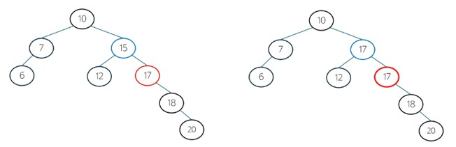
6. 중위 후속자(17)을 삭제하고, 중위 후속자의 노드 상태에 따라 재귀적으로 반복
    - 중위 후속자는 무조건 리프 노드이거나 하나의 자식만을 가짐

    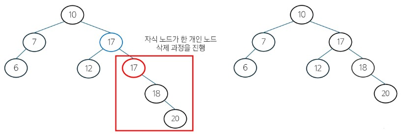

- 삭제 코드: `99_3_binary_search_tree.py`의 delete 함수
