# DFS
## 비선형 자료구조
비선형구조인 트리, 그래프의 각 노드(정점)를 중복되지 않게 전부 방문(visit)하는 것을 말함
- 비선형구조는 선형 구조에서와 같이 선후 연결 관계를 알 수 없음
    - 특별한 방법 필요
        1. 깊이 우선 탐색(Depth First Search, DFS)
        2. 너비 우선 탐색(Breadth First Search, BFS)

## DFS(트리)
루트 노드에서 출발하여 한 방향으로 갈 수 있는 경로가 있는 곳까지 **깊이 탐색**해 가다가 더이상 갈 곳이 없으면, 가장 마지막에 만났던 갈림길 간선이 있는 노드로 되돌아와서 다른 방향의 노드로 탐색을 계속 반복하여 결국 모든 노드를 방문하는 순회 방법

- 가장 마지막에 만났던 갈림길의 노드로 되돌아가서 다시 깊이 우선 탐색을 반복해야 함
    - 재귀적으로 구현
    - 또는 **후입선출 구조의 스택**으로 구현

- 재귀로 구현

    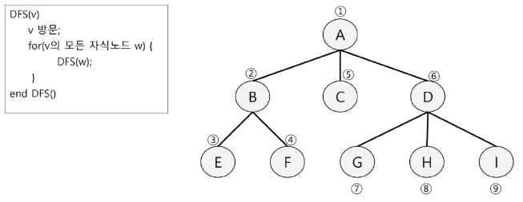

- 스택으로 구현
    1. 루트노드 A를 시작으로 깊이 우선 탐색 시작

        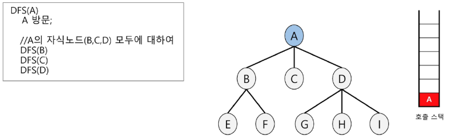
        - DFS(A)가 호출되며 스택에 A 삽입
        - A의 자식 B, C, D에 대해 모두 동일한 함수가 호출되어야 하므로 스택에서 나가지 않고 있어야 함(A는 할 일이 남아있다)
        - 다음 작업 대상인 DFS(B) 호출
    2. 노드B에서 깊이 우선 탐색을 처리

        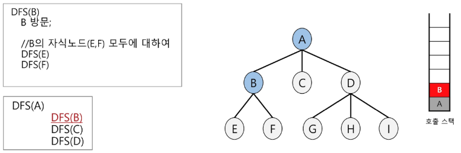
        - DFS(B)가 호출되며 스택에 B 삽입
        - B의 자식 E, F에 대한 함수가 호출되어야 하므로(B도 할일 남았다) 스택에서 나가지 않고 있어야 함
        - 다음 작업 대상인 DFS(E) 호출
    3. 노드E에서 깊이 우선 탐색을 처리

        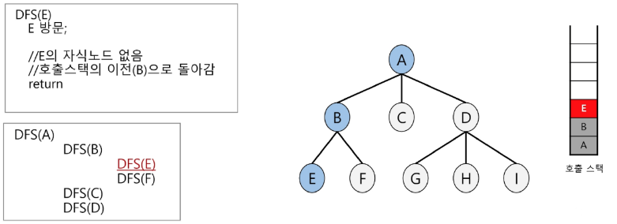
        - DFS(E) 호출되며 스택에 E 삽입
        - E는 자식이 없으므로 호출할 함수 없음
        - 즉, E는 할 일이 끝났으므로 스택에서 빠짐
        - DFS(B)로 돌아간 뒤 DFS(F) 호출

    4. 노드F에서 깊이 우선 탐색을 처리

        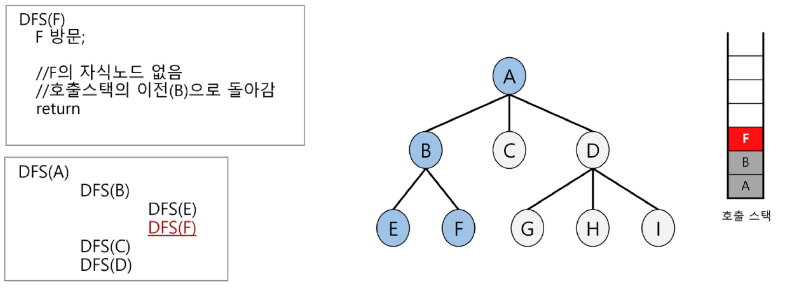
        - DFS(F) 호출되며 스택에 F 삽입
        - F도 자식 없으므로 스택에서 제거
        - DFS(B)로 돌아갔는데 B도 할일 끝났으므로 스택에서 B 제거하고 DFS(A)로 돌아감
        - 다음 작업 대상인 DFS(C) 호출
    5. 노드C에서 깊이 우선 탐색을 처리

        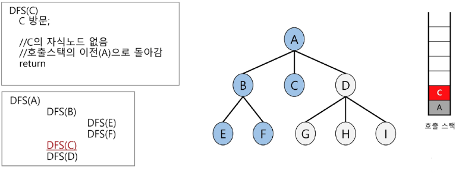

    6. 노드D에서 깊이 우선 탐색을 처리

        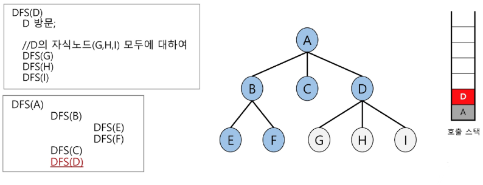
    7. 노드G에서 깊이 우선 탐색을 처리

        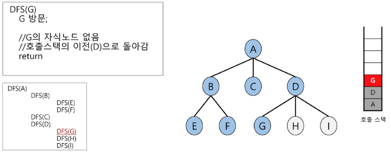
    8. 노드H에서 깊이 우선 탐색을 처리

        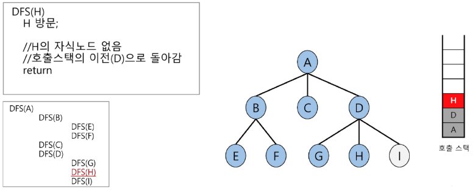
    9. 노드I에서 깊이 우선 탐색을 처리

        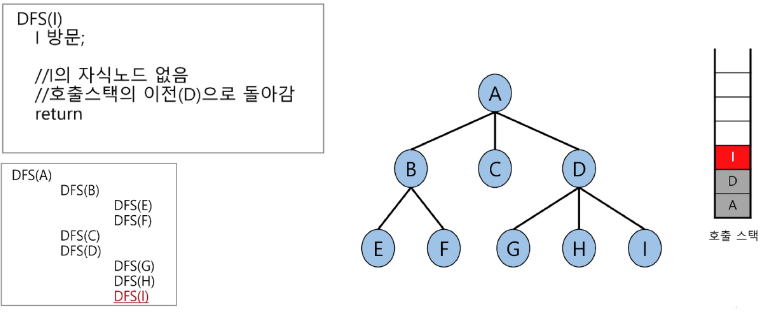

```python
# 이진 트리는 자료구조로 나타낼 줄 알지만
# 지금 구현하려는 트리는 이진 트리가 아님
# 자료구조로 어떻게 나타내지?
# 딕셔너리 & 인접리스트 형태
# 인접 행렬도 가능. but, 트리 입장에서 인접 리스트가 좀 더 수월함
adj_list = {
    'A': ['B', 'C', 'D'],   # A와 인접해있는 노드들
    'B': ['E', 'F'],
    'C': [],
    'D': ['G', 'H', 'I']
}

def depth_first_search(node):
    '''
        node: 현재 방문 노드
    '''
    # 내 자식들 순회 전에 내 노드 출력
    print(node)

    # node가 가진 모든 자식들에 대해서 순회하여
    # 동일한 깊이 우선 탐색
    # for next in adj_list[node]: # 대괄호 접근법으로 하니까 에러
                                  # 왜? 노드가 없을 때 처리가 안됐음
    
    # 자식 노드가 없으면 순회하지 않도록 처리하면 됨
    if node not in adj_list:
        return

    for next in adj_list[node]:
        depth_first_search(next)

depth_first_search('A')
```

**※ DFS를 위해 알아야 하는 것**

1. 스택이 어떻게 동작하는지 이해
2. 비선형 자료구조를 어떻게 나타낼 것인지(ex. 인접리스트)에 대한 이해
3. 순회 과정을 깊이 우선 탐색으로 진행하기 위해 재귀 함수를 이해


## DFS(그래프)
**시작 정점**에서 출발하여 한 방향으로 갈 수 있는 경로가 있는 곳까지 깊이 탐색해 가다가 더 이상 갈 곳이 없게 되면, 가장 마지막에 만났던 갈림길 간선이 있는 정점으로 되돌아와서 다른 방향의 정점으로 탐색을 계속 반복하여 결국 모든 정점을 방문하는 순회방법

- 트리와 그래프의 명확한 차이점
    - 트리는 뿌리 확인 가능
        - 트리는 계층 구조이므로 위로 다시 되돌아갈 일이 없음
        - 즉, 자식 노드에서 부모 노드를 탐색 후보군으로 넣지 않음
    - 그래프는 뿌리 확인 불가능
        - 그래프는 계층 구조가 아니므로 인접한 노드에 대해 탐색 시 무한 반복될 수 있음
        - 즉, 이미 방문했던 이전 노드도 후보군에 넣을 수 있음
        - ex. A의 인접노드 B, C와 B의 인접노드 A, E가 있다면 A와 B가 탐색을 반복하게 됨
        - 때문에 모든 노드를 방문하는 것이 불가능해짐
        - 그래서 이전에 방문한 적 있는지 체크 필수!!

- 이전에 방문했는지 어떻게 나타낼까?
    - 정점들의 모음을 만들고,
    - 이 모음과 동일한 인덱스를 가진 선형 자료구조를 만들어서
    - 정점들에 대해 인덱스를 적절히 부여해서 방문했다면 그 자료구조에 첵흐

- DFS(그래프) 구현
    1. 초기상태: Visited 리스트 생성 및 False로 초기화
        
        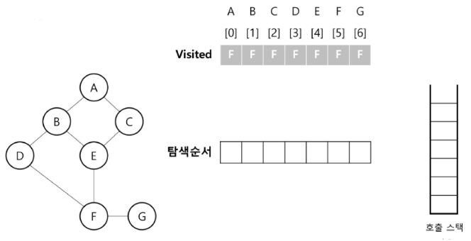
    2. DFS(A) 탐색진행

        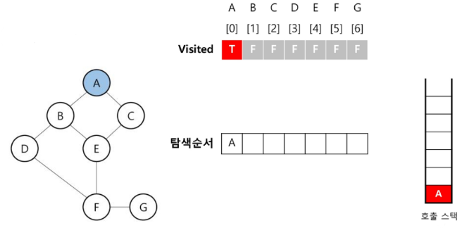
        - visited에서 A에 부여한 index 0번을 True로 변경하고 스택에 삽입
        - 이전에 방문하지 않은 인접 정점(B, C)에 대해 탐색 진행
        - 먼저 호출되는 DFS(B) 호출
    3. DFS(B) 탐색진행

        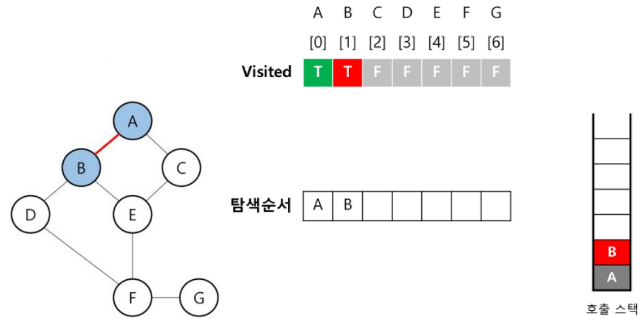
        - B에 부여한 visited[1] = True 변경, 스택에 B 삽입
        - 이전에 방문하지 않은 인접 정점(D, E)에 대해 탐색 진행
        - DFS(D) 호출
    4. DFS(D) 탐색

        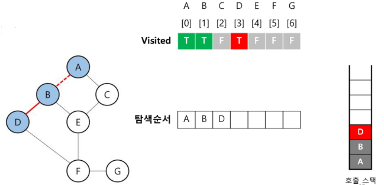
        - visited[3] = True
        - 스택에 D 삽입
        - D의 인접 노드(F)에 대해 탐색 진행
        - DFS(F) 호출
    5. DFS(F) 탐색

        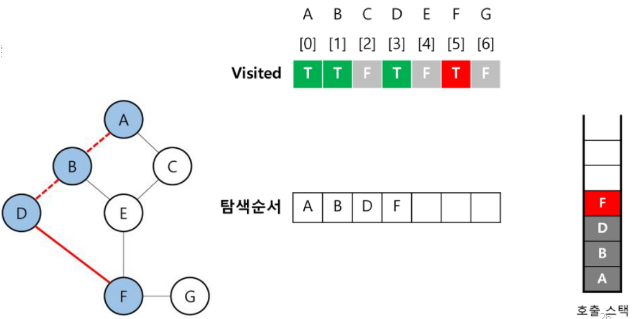
        - visited[5] = True
        - 스택에 F 삽입
        - F의 인접 노드(E, G)에 대해 탐색 진행
        - DFS(E) 호출
    6. DFS(E) 탐색

        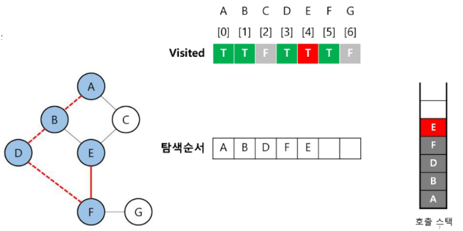
        - visited[4] = True
        - 스택에 E 삽입
        - E의 인접 노드(C)에 대해 탐색 진행
        - DFS(C) 호출
    7. DFS(C) 탐색

        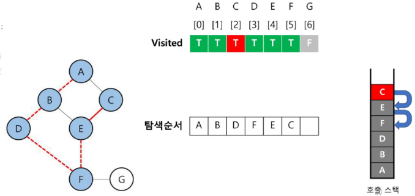
        - visited[3] = True
        - 스택에 C 삽입
        - 방문하지 않은 인접 노드 탐색하려니까 없음
        - **스택에서 C 빼낸 후 이전 호출 스택으로 리턴 DFS(E)**
        - DFS(C)를 호출했던 DFS(E)에서도 더이상 방문하지 않은 인접 노드가 없음
        - **스택에서 E 빼낸 후 DFS(F)로 리턴**
    8. DFS(F)로 돌아옴

        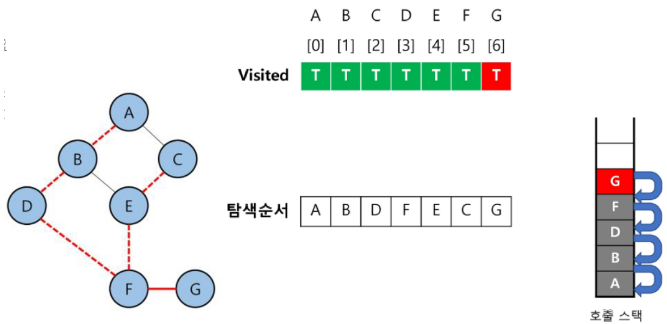
        - 방문하지 않은 인접 노드 G 있으므로 DFS(G) 호출 -> visited[6] -> 스택에 G 삽입
        - 더이상 방문하지 않은 인접 노드가 없으므로 이전 호출 스택으로 리턴
        - DFS(F) -> FDS(D) -> DFS(B) -> DFS(A)
    9. 탐색 종료: 탐색 시작 정점의 모든 인접 정점을 모두 방문하여 탐색 종료

        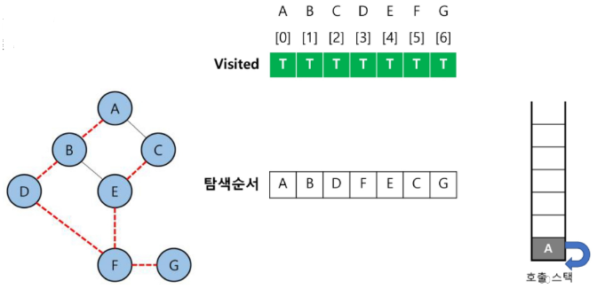

- DFS 그래프 재귀로 구현
    ```python
    def depth_first_search(vertex):
        '''
            vertex: 현재 방문 정점의 index
        '''
        # global에 있는 visited를 방문할 때마다, 해당 idx번째를 True로 바꾸고 싶다
        # 그러려면 함수는 기본적으로 LEGB룰을 따르기 때문에
        # 로컬 visited가 선언되는 것을 막기 위해
        # global visited를 선언해야 하는건지 고민해봐야 함

        # global visited 선언하지 않아도 작동함
        # visited[vertex] = True로만 가능
        # visited는 False를 담고 있는 리스트(참조 자료형)을 참조 중이고
        # visited 안의 값을 바꾸는 것이 아닌, 
        # visited가 참조하고 있는 vertax번째의 값을 true로 바꾸는 것이기 때문에
        # 글로벌을 쓰지 않아도, 메모리 상의 인덱스를 찾아가서 바꾸는 것이라 안적어도 되지만?
        # 그치만 글로벌에 있는 visited 사용한다고 명시하기
        global visited
        visited[vertex] = True

        # 정점 방문
        print(graph[vertex])

        # 현재 정점이 진출할 수 있을, 후보군을 찾자!
        # 인접 행렬의 vertax번째 리스트를 순회
    #    for candidate in adj_matrix[vertex]:
    #        # 진출 후보군 A~G 중에, 가능한 경우에 대해서만(1)
    #        if candidate:
    #            # 서치 작업 진행하려고 했더니
    #            # A후보군 0 1 1 0 0 0 0만으로는 곤란할 것 같다
    #            depth_first_search()

        # 모든 정점의 인덱스 번호를 가지고 순회
        for idx in range(N):
            # 인접 행렬에서, 내 번호(내가 진출 가능한 후보군)
                # 내가 진출 가능한 idx인지 확인하고,
                # 그 idx번째가 이전에 방문한적이 있는지 확인 
                # (방문한 적 없다면 다음 후보군 방문)
            if adj_matrix[vertex][idx] and visited[idx] == False:
                depth_first_search(idx)


            # 0    1    2    3    4    5    6
    graph = ['A', 'B', 'C', 'D', 'E', 'F', 'G']
    # 각 정점들을 나열한 리스트를 통해서
    # 0번에는 A가 있다, 1번에는 B가 있다 라는 형식의 고유한 키 값으로 사용할 예정
    # 그래서 dfs 함수의 vertex에 인덱스(정수값)를 넣을 것임


    # 정점 수: N
    N = 7

    # 해당 정점 방문 여부 표시: False로 초기화
    visited = [False] * N

    # 인접 행렬
    adj_matrix = [

    #   진입 차수
    #    A  B  C  D  E  F  G
                                # 진출 차수
        [0, 1, 1, 0, 0, 0, 0],  # A
        [1, 0, 0, 1, 1, 0, 0],  # B
        [1, 0, 0, 0, 1, 0, 0],  # C
        [0, 1, 0, 0, 0, 1, 0],  # D
        [0, 1, 1, 0, 0, 1, 0],  # E
        [0, 0, 0, 0, 1, 0, 1],  # F
        [0, 0, 0, 0, 0, 1, 0],  # G
    ]

    # 시작 정점을 이번엔 0번인 A부터 시작
    depth_first_search(0)
    ```

**※ 깊이 우선 탐색**

-> 내가 방문할 수 있는 후보군에 도달하자 마자 그 후보군을 방문하는 것이 아니라!!!!(재귀)

-> 내가 방문할 수 있는 후보군들에 대해 방문하게 된다면, 그 후보군이 가진 다음 방문 대상에 바로 (후보군의 후보군 순으로) 이동해서 '깊이 우선'으로 탐색하는 것

- DFS 그래프 구현(재귀XX)
    ```python
    def DFS(now):
        '''
        now: 현재 방문한 정점 정보
        '''
        # 방문 대상 후보군들을 stack에 삽입해서 관리
        stack = []
        visited.add(now)    # 현재 지점 방문
        stack.append(now)   # 현재 위치 추가

        # 순회: 언제까지? stack이 빌 때까지(=더이상 방문할 정점이 없다)
        while stack:
            target = stack.pop()    # 이번 방문 대상
            print(target)           # LIFO 방문

            # 이번 방문 대상의 인접 리스트 순회
            for next in graph[target]:
                # 그 대상(target: A 일 때, next = B, C) 을 방문한 적 없다면
                if next not in visited:
                    visited.add(next) # 방문처리는 위에서 프린트(print(target)) 하는데 
                                      # 왜 visited 처리를 여기서 하나?
                                        # 한번 방문한 곳 다시 방문하지 않으려고 visited 씀
                                        # '방문'을 하는 행위를 하는 시점이 언제인지 생각해보자
                                        # 내 후보군들을 스택에 다 넣고난 '후'에
                                        # 돌아가서 스택 마지막에 있는 요소 빼냄(방문)

                    # 만약 방문 표시를 실제 방문한 시점에 한다면
                    # stack = [A, B] -> [A, B, C] -> [A, B, D] -> [A, B, B]
                    # D에서 호출 가능한 후보군이 더이상 없을 때 그제서야 방문했다고 표기
                    # 표기 후 B를 출력하면 최종적으로 A C D B가 출력 되겠지만
                    # 코드는 스택이 빌 때까지 돌아가므로 (스택에는 [A, B] 남아있음)
                    # A C D B B -> B가 또나옴
                    stack.append(next)


    # 그래프 인접 리스트
    graph = {
        'A': ['B', 'C'],
        'B': ['A', 'D', 'E'],
        'C': ['A', 'E'],
        'D': ['B', 'F'],
        'E': ['B', 'F'],
        'F': ['D', 'E', 'G'],
        'G': ['C']
    }

    start_vertex = 'A'
    visited = set()     # 방문한 정점을 저장할 집합
                        # 왜 집합?
                        # 정점 정보를 인덱스로 처리하지 않기 때문에,
                        # 정점이 가진 정보 자체가 방문 여부를 확인하는 집합에 '포함되어 있는지' 확인
    DFS(start_vertex)
    ```

※ DFS 그래프 구현 `반복문(스택) vs 재귀 호출`

-> 스택을 사용하는 반복문 DFS는 후입선출(LIFO)의 특성때문에

-> 스택은 `'A': ['B', 'C']`이면 'C'가 스택에 나중에 들어가므로 **먼저 꺼내짐**

-> 재귀를 이용한 DFS는 호출 순서대로 탐색되므로 인접 정점을 오름차순 순회

-> 재귀는 `'A': ['B', 'C']`이면 'B'먼저 호출

-> 그래서 DFS 그래프 구현하는 두 코드의 출력 결과가 다르게 나왔던 것(둘 다 깊이 우선 탐색이긴 함)


### 연습문제
1. 다음은 연결되어 있는 두 개의 정점 사이의 간선을 순서대로 나열해놓은 것이다
    - 모든 정점을 DFS하여 깊이 우선 탐색 경로를 출력하시오
    - 인접 리스트로 접근해서 문제를 풀 것
    - 단, 시작 정점을 'A'로 시작해라
    
        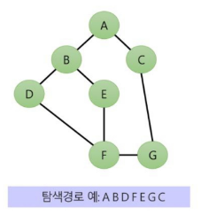
        ```
        7
        8
        0 1
        0 2
        1 3
        1 4
        3 5
        4 5
        5 6
        2 6
        ```

2. [SWEA 1486] 장훈이의 높은 선반

    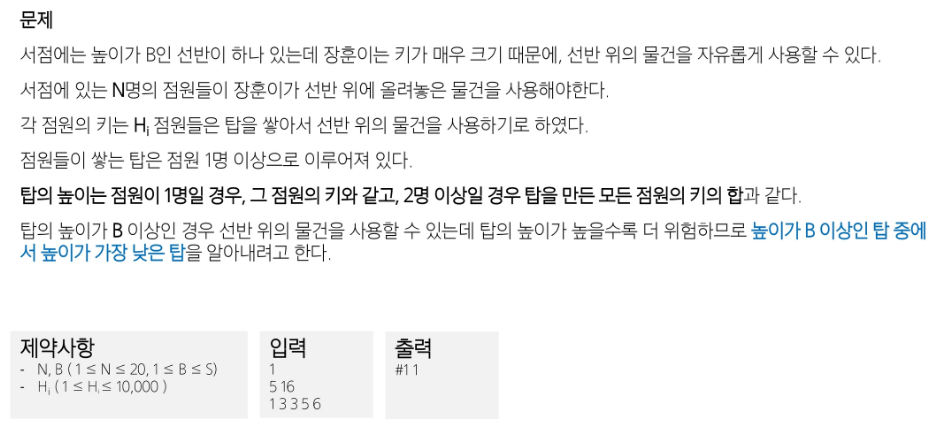

- DFS 풀이
    ```python
    import sys
    sys.stdin = open("input.txt")

    def dfs(idx, total):
        # 현재 탐색 중인 점원의 index
        # 지금까지 선택한 점원들의 키 total

        global min_height

        # 내 최종 결과가 min_height가 작아지길 바라는건데
        # 이미 지금까지 더해 나간 총합이 min_height보다 크면...
        # 아직 점원이 남았어도 점원의 키를 더해볼 필요가 있을까?
        # => 점원의 키가 음수일 가능성은 없으니 남은 점원 키는 더할 필요가 없다
        if total >= min_height:
            return

        # idx가 얼마가 되면 종료? N (즉, 모든 정점들에 대해 다 탐색할 때까지 탐색)
        if idx == N:
            # 지금까지 선택된 점원들의 키의 총합이 선반 보다는 커야함
            if total >= B:
                min_height = min(min_height, total)
            return

        # idx != N 이면    
        # 아직 모든 점원에 대해서 탐색하지 않았으므로
        # 현재 점원을 포함해서 다음 진행
        # -> 이번 점원의 키를 더한다
        dfs(idx+1, total + arr[idx])

        # 현재 점원을 제외하고 다음 진행하는 경우도 있을 것 
        # -> 이번 점원의 키는 더하지 않는다
        dfs(idx+1, total)


    T = int(input())
    for tc in range(1, T + 1):
        # N: 사람 수, B: 목표 높이
        N, B = map(int, input().split())
        # 각 사람의 키를 입력 받아 리스트로 저장
        arr = list(map(int, input().split()))

        # 직원당 키는 최대 10000이므로, 최대 높이는 10000 * N
        min_height = 10000 * N 

        dfs(0, 0)

        # 목표 높이 B를 빼서 실제로 초과된 부분만 출력
        print(f"#{tc} {min_height - B}")
    ```


3. [SWEA 1865] 동철이의 일 분배

    

