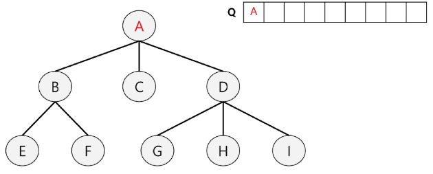
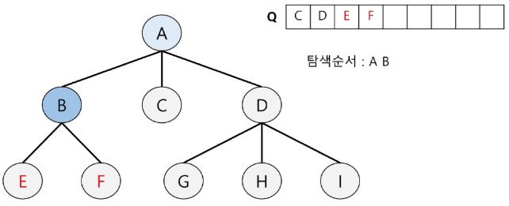
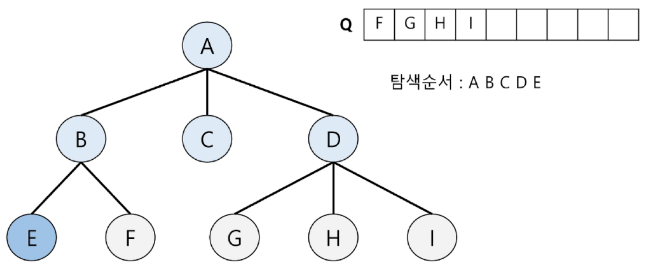
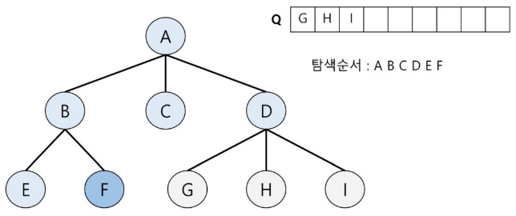
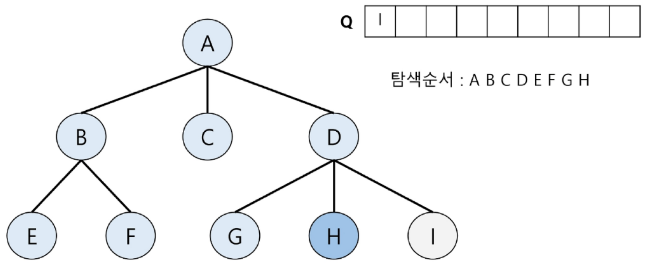
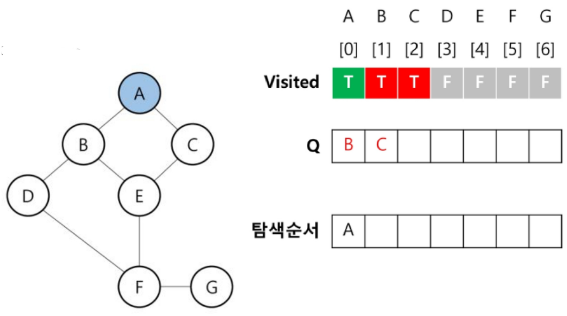
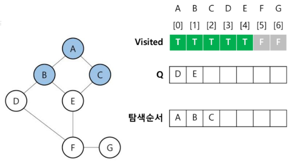
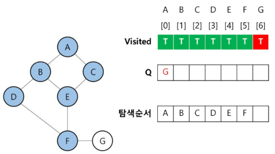
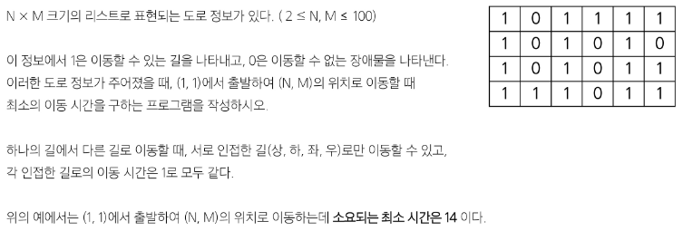

# BFS
## BFS(트리)
루트 노드의 자식 노드들을 먼저 모두 차례로 방문한 후에, 방문했던 자식 노드들을 기준으로 하여 다시 해당 노드의 자식 노드들을 차례로 방문하는 방식

- 인접한 노드들에 대해 탐색 후 차례로 다시 너비 우선 탐색을 진행해야 함
    - 선입선출 형태의 자료구조 `Queue` 활용

### BFS 알고리즘


- A를 시작으로 너비 우선 탐색 시작
- A의 인접 노드 [B, C, D] 중 B로 가서, B의 자식을 탐색하는 것이 아니라(그건 DFS) A의 자식인 B, C, D를 다 순회하고 난 뒤에 그 아래 자식들을 순회할 것임
- 그렇다면 언제 순회할 것인가?
    - 내가 가진 후보군들을 어딘가에 담아두고, 담은 후보들은 모두 다음 순회 대상에 들어가야 함
    - A가 가진 [B, C, D]에 대한 순회가 다 끝났다면
    - 순회 대상이었던 B를 꺼내서 B의 자식들 [E, F]를 순회하도록 [C, D, E, F] 후보군 리스트 추가
    - 그러고 C를 조사하러 가는 순서로 진행

- BFS(트리) 탐색 순서
    1. 큐 생성 & 루트노드(A) enqueue

        
    2. dequeue(A) & A의 자식 노드 enqueue

        
    3. dequeue(B) & B의 자식노드 enqueue

        
    4. dequeue(C) & C의 자식노드 enqueue(없음)

        
    5. dequeue(D) & D의 자식노드 enqueue

        
    6. dequeue(E) & E의 자식노드 enqueue(없음)

        
    7. dequeue(F) & F의 자식노드 enqueue(없음)

        
    8. dequeue(G) & G의 자식노드 enqueue(없음)

        
    9. dequeue(H) & H의 자식노드 enqueue(없음)

        
    10. dequeue(I) & I의 자식노드 enqueue(없음)

        
    11. Queue가 비었으므로 탐색 종료

- BFS(트리) 구현 코드
    ```python
    def BFS(root_node):
        '''
        :param root_node: 너비우선 탐색을 시작할 서브 트리의 루트
        :return: 완성된 경로
        '''
        # 탐색 경로를 저장할 리스트(바로 print 안하고 append)
        result = []     

        # 이번에 조사할 노드와 앞으로 조사할 노드들(후보군)을 담을 자료구조
        data_structure = [root_node]    # 처음 시작 노드 넣어놓기

        # 탐색이라는 행위는 언제까지 할 것이냐?
        # 모든 노드를 다 탐색해서 더 이상 탐색할 후보군이 없을 때까지!
        while data_structure:   # 후보군이 남아있으면 계속 조사
            # node = data_structure.pop()     # LIFO 해버려서 DFS가 됨
            node = data_structure.pop(0)    # FIFO
            result.append(node)

            # 내 자식 노드들(인접 노드들)을 인접 리스트 목록에서 찾아와서
            for child in graph.get(node, []):   # 디폴트 값 [] 설정(디폴트값 없으면 None 반환)
                                                # 찾는 키가 없으면 빈 리스트 반환
                # 다음 조사 후보군 목록에 자식을 추가함
                data_structure.append(child)

        return result
    # BFS ------------------------------------------

    # 그래프 인접 리스트
    graph = {
        'A': ['B', 'C', 'D'], 
        'B': ['E', 'F'],
        'C': [],
        'D': ['G', 'H', 'I'], 
        'E': [],
        'F': [],
        'G': []
    }

    start_node = 'A'
    print(BFS('A'))
    ```


## BFS(그래프)
탐색 시작점의 인접한 정점들을 모두 차례로 방문한 후에, 방문했던 정점을 시작점으로하여 다시 인접한 정점들을 차례로 방문하는 방식

- BFS(그래프) 탐색 순서
    1. Visited 리스트 생성 및 False 초기화 & 큐 생성 & 시작 정점(A) 방문처리 및 enqueue

        
    2. dequeue(A) & A의 인접 정점(B, C) 방문처리 및 enqueue

        
    3. dequeue(B) & B의 인접 정점(D, E) 방문처리 및 enqueue

        
    4. dequeue(C) & C의 인접 정점 방문처리 및 enqueue(없음)

        
    5. dequeue(D) & D의 인접 정점 방문처리(F) 및 enqueue

        
    6. dequeue(E) & E의 인접 정점 방문처리 및 enqueue(없음)

        
    7. dequeue(F) & F의 인접 정점 방문처리(G) 및 enqueue

        
    8. dequeue(G) & G의 인접 정점 방문처리 및 enqueue(없음)

        
    9. 큐가 비었으므로 탐색 종료

- BFS(그래프) 구현 코드
    ```python
    from collections import deque

    def BFS(start_vertax):  # 인접 리스트는 시작 '정점(노드)' 넣어줌
        # 해당 정점 방문 여부 표시할 배열 필요함
        # visited = [0] * len(nodes)
        # 또는
        visited = set()

        # 후보군 저장
        # deque는 첫번째 인자로 iterable 객체를 받음
        queue = deque([start_vertax]) # 그냥 넣지말고 리스트로 만들어서 넣자

        # 조사 시작할 때 시작정점 넣어주기
        visited.add(start_vertax)

        # 최종 결괏값
        result = []

        while queue:
            node = queue.popleft()
            result.append(node)

            # 내 인접 리스트에서 인접 정점 찾아서 순회
            for neighbor in adj_list.get(node, []):
                # 해당 정점 아직 방문한 적 없다면
                if neighbor not in visited:
                    visited.add(neighbor)   # 방문 예정 표시
                    queue.append(neighbor)  # 다음 후보군에 추가
        return result


    # BFS2 --------------------------------------

    # 인접 리스트와 달리 인접 행렬은 시작 '인덱스' 넣어줌
    def BFS2(start_index):  
        '''
        인접 행렬로 순회 시 -> 정점의 index
        인접 리스트로 순회 시 -> 정점의 값
        '''
        visited = set()
        queue = deque([start_index])
        visited.add(start_index)
        result = []

        while queue:
            node = queue.popleft()
            result.append(node)

            # 모든 노드들에 대해 인덱스 조사
            for next_index in range(len(nodes)):
                # 내가 찾으려는 다음 정점은 인접 행렬에서 내 위치(현재노드)의 next_index번째에 있음
                if next_index not in visited and adj_matrix[node][next_index]:
                    visited.add(next_index)
                    queue.append(next_index)
        return result


    # 정점&간선 정보 -----------------------------

    # 정점 정보
    #         0    1    2    3    4    5    6
    nodes = ['A', 'B', 'C', 'D', 'E', 'F', 'G']

    # 간선 정보
    edges = [
        '0 1',  # A - B 무방향 그래프
        '0 2',  # A - C 무방향 그래프
        '1 3',  # B - D
        '1 4',  # B - E
        '2 4',  # C - E
        '3 5',  # D - F
        '4 5',  # E - F
        '5 6'   # F - G
    ]
    # 문제 풀 때는 간선 정보를 받는 경우가 많으니
    # 간선 정보를 토대로 인접 리스트 or 인접 행렬을 만드는 연습 해보기


    # 인접 리스트 --------------------------------
    
    # 간선 정보를 보기 쉬운 인접 리스트 형태로 만들어보자
    '''
    adj_list = {'A':['B','C']}
    '''
    adj_list = {                         # dict comprehension
        node: [] for node in nodes
        # key: value
    }

    # 간선 정보와 정점의 index 정보로 adj_list 채워주기
    for edge in edges:
        u, v = edge.split()     # 시작 정점, 도착 정점
        # print(f'{u}: {nodes[int(u)]}, {v}: {nodes[int(v)]})

        # 'A'에 'B', 'C' 추가 -> 'A': ['B', 'C']
        adj_list[nodes[int(u)]].append(nodes[int(v)])
        # 현재 간선 정보는 '무방향' 그래프
        # -> 양쪽 다 갈 수 있다는 뜻
        # 반대방향도 넣어주자
        adj_list[nodes[int(v)]].append(nodes[int(u)])

    # 인접 리스트 완성
    # print(adj_list)

    print(BFS('A'))


    # 인접 행렬 ----------------------------------

    # 인접 행렬 -> [[], [], [], ...]
    # 비어있는 리스트를 node 개수만큼 만들고, node 개수만큼 반복
    adj_matrix = [[0] * len(nodes) for _ in range(len(nodes))]
                # 모든 정점에 못간다고 가정해두고(0)
                # 갈 수 있는 정점을 1로 변경하자(아니면 나중에 0 다 채워야함)

    for edge in edges:
        u, v = edge.split()
        u_index, v_index = int(u), int(v)
        adj_matrix[u_index][v_index] = 1
        adj_matrix[v_index][u_index] = 1    # 무방향이므로 반대쪽도 해주기

    print(BFS2(0))
    ```

**※  deque는 첫번째 인자로 iterable 객체를 받는 것에 대하여**

-> deque는 원래 초기화 시 첫번째 인자로 iterable 객체를 받는다

-> 즉, `queue = deque([요소1, 요소2])` 이런식으로 deque를 만들면

-> `queue = [요소1, 요소2]`와 같이 큐에 요소1, 요소2가 각각 한칸씩 차지하도록 큐가 구성됨

-> 여기서 오해하면 안되는 것! [요소1, 요소2]가 통으로 한 칸에 들어가는 것이 아님 

-> `queue = [[요소1, 요소2], [요소3?]]` 아님XXXX

-> 초기화할 때 iterable 객체를 넣어야 하는데, 넣으려는 요소가 1개 뿐이라면 리스트에 감싸라는 뜻 `deque([요소1])`

-> 또는

-> `queue = deque()` -> `queue.append(요소1)` 이렇게 따로 작성하면 

-> `queue = [요소1]` 요소1이 큐의 첫번째 칸에 요로콤 들어감

-> 주의!! `queue = deque()` -> `queue.append([요소1])` 이렇게 넣으면XX 

-> `queue = [[요소1]]` 요소1이 큐의 첫번째 칸에 리스트에 감싸진 채 들어감

-> deque 초기화할 때만 iterable 객체로 넣는 것이지,

-> append할 때 리스트로 감싸버리면 append 특징 상 통째로 queue에 추가하기 때문에

-> `queue = [ 원래 있던 요소 , [요소1]]` 이렇게 들어가버림을 주의해라!!!


###  연습문제
- 도로 이동시간

    
    - 최단 거리를 구하는 문제에서는 너비 우선 탐색이 깊이 우선 탐색보다 평균적으로 더 빠르게 목적지에 도달하는 경우가 많음

    - BFS Solution 1
        ```python
        import sys
        sys.stdin = open('input.txt')
        from collections import deque

        #    상  하  좌  우
        dx = [-1, 1, 0, 0]
        dy = [0, 0, -1, 1]

        def get_road_move_time(row, col):

            # 너비 우선 탐색 -> queue
            # deque의 첫 번째 인자는 iterable 객체이고,
            # 내가 지금 queue에 넣고 싶은 후보군은 (0,0)
            # queue = deque((0,0)) -> queue = deque[0,0] 이렇게 됨
            # queue = deque([(0,0)]) -> 이렇게 해야 올바르게 (0,0)
            # 헷갈리니까 아래와 같이 하자
            queue = deque()
            queue.append((0,0)) # 시작 정점 후보군에 삽입
            distance[0][0] = 0  # 시작 위치까지 이동거리는 0

            # BFS 탐색
            while queue:    # 후보군이 있는 동안
                row, col = queue.popleft()

                # 이 위치에서 4방향에 대한 탐색
                # for k in [(-1,0), (1,0), ..] 가능
                for k in range(4):
                    nx = row + dx[k]
                    ny = col + dy[k]

                    # 이제 그 다음 탐색지 data[nx][ny]번째가 이동 가능한지 판별
                    # 그럴려면 1. 리스트 범위를 벗어나지 않아야 함
                        # 2. 이전에 방문한 적 없어야 함 -> -1로 초기화 해 두었음
                        # 3. 그 위치가 '길' 이어야 함 -> 1은 길, 0은 벽
                    if 0 <= nx < N and 0 <= ny < M and distance[nx][ny] == -1 and data[nx][ny]:           
                        # 위 조건을 모두 만족하면 후보군에 들 수 있음
                        queue.append((nx, ny))

                        # 다음 위치까지 도달하는 비용은, 내 위치 비용 + 1
                        distance[nx][ny] = distance[row][col] + 1
                        
                        # 도착지점에 도착하면, BFS 특성상 가장 빠르게 도착한 길이니
                        # 그때까지의 비용을 할당하고 종료
                        if nx == N-1 and ny == N-1: # 도착지
                            return
            # 모든 후보군을 다 탐색했지만, return 되어서 함수가 종료된 적이 없다면??
            # 코드가 이곳까지 도달했다면? 도착할 수 없다는 의미
            return -1


        # 데이터 입력 --------------------------------------------
        # row: N, col: M
        N, M = map(int, input().split())
        data = [list(map(int, input())) for _ in range(N)]
            # map에 넣는 요소는 iterable한 요소
            # 문자열도 iterable
            # 문자열 자체를 받아서 차례대로 순회하여 int로 변경

        # 방문 표시를 할거야 -> 우리의 최종 목적이 무엇이냐?
        # 해당 위치까지 도달하는 데 걸린 비용이 얼마인지 기록하는 것!
        distance = [[-1] * M for _ in range(N)]
            # 내가 N-1, M-1 위치에 도달했을 때
            # distance에 기록되어 있는 누적값이 최종 결과값이 됨
            # 방문한 적이 없으면 -1, 방문했으면 방문하면서 든 비용이 얼마인지 가지고와서 누적

        # 시작지점(0,0)은 distance를 0으로 초기화해주면 좋겠다
        # (0,0) -> (0,1)로 이동했을 때 발생하는 1 이라는 비용을 어떻게 알까
        # (0,0) -> (0,2)로 이동했을 때 발생하는 2 라는 비용을 어떻게 알까
            # (0,1)로 갈 때 발생했던 비용 + 1
            # 즉, 내 위치까지 도달하는 데 들었던 비용 + 1

        get_road_move_time(0, 0)
        print(distance[N-1][M-1])
        ```
    
    - BFS Solution 2
        - solution 1과의 차이점: 함수에 거리값(누적합)도 넣어주고, visited 만들어줌
        ```python
        import sys
        sys.stdin = open('input.txt')

        from collections import deque

        dx = [-1, 1, 0, 0]
        dy = [0, 0, -1, 1]

        def get_road_move_time(road, N, M):
            # sol1에서는 후보군에 단순 좌표만 넣었다면,
            # 이번에는 후보군에, 그 후보군이 얼만큼의 누적시간을 가지고 있는지도 기록

            queue = deque()

            # x, y, cnt(누적합)
            queue.append((0, 0, 0))
            
            # 물론, 후보군에 cnt 넣는거랑 별개로 visited는 필요함
            visited = [[0] * M for _ in range(N)]
            visited[0][0] = 1    # 시작정점 방문처리

            while queue:
                row, col, dist = queue.popleft()

                for k in range(4):
                    nx = row + dx[k]
                    ny = col + dy[k]

                    # 범위를 벗어났으면 조사 못함
                    if nx < 0 or nx >= N or ny < 0 or ny >= M:
                        continue

                    # 이미 방문한 경우에도 넘어감
                    if visited[nx][ny]:
                        continue

                    # 길이 아닌 경우에도 넘어감
                    if road[nx][ny] == 0:
                        continue

                    # 도착 지점인 경우
                    if nx == N-1 and ny == M-1:
                        return dist + 1  # 지금까지 도달한 거리 + 1 해서 반환

                    # 위 조건들을 다 통과하고 여기까지 왔다면
                    # 다음 후보군에 등록해주자
                    visited[nx][ny] = 1
                    queue.append((nx, ny, dist+1))

            return -1   # 도달할 수 없는 경우

        # 도로의 크기 N * M 입력 받기
        N, M = map(int, input().split())
        road = [list(map(int, input())) for _ in range(N)]
        result = get_road_move_time(road, N, M)     # 길 정보, 가로크기, 세로크기
        print(result)
        ```
    
    - DFS Solution
        ```python
        import sys
        sys.stdin = open('input.txt')

        dx = [-1, 1, 0, 0]
        dy = [0, 0, -1, 1]

        def dfs(row, col, acc):     # 행, 열, 누적값
            global min_count

            # 가지치기
            if acc >= min_count:
                return

            if row == N-1 and col == M-1:   # 도착지이면
                min_count = min(min_count, acc) # 여기까지 도달하는 데 든 비용과 최소값 비교
                return

            # 4방향 탐색
            for k in range(4):
                nx, ny = row + dx[k], col + dy[k]

                # 범위를 벗어나거나, 방문한 적 있거나, 길이 아니면 넘어가자
                if nx < 0 or nx >= N or ny < 0 or ny >= M:
                    continue
                if visited[nx][ny]: continue
                if not road[nx][ny]: continue

                # 갈 수 있으면 방문 표시하고 이동
                visited[nx][ny] = 1
                dfs(nx, ny, acc + 1)    # 조사를 떠났다가 돌아왔으면(백트래킹)
                                        # 다음 조사 후보군을 조사해야 함
                # 그러므로, 이전에 nx, ny 조사했던 시점은 없었던 일로 해야함
                # 갔었던 적 없는 깨끗한 길로 만들어줘야 함
                visited[nx][ny] = 0


        # 입력 처리
        N, M = map(int, input().split())
        road = [list(map(int, input())) for _ in range(N)]

        # 방문 배열 및 최소 이동 횟수 초기화
        visited = [[False] * M for _ in range(N)]
        min_count = float('inf')

        # 시작점 방문처리 후 탐색 시작
        visited[0][0] = True
        dfs(0, 0, 0) # x, y, 누적값

        print(min_count)  # 결과 출력
        ```
