# heap과 백트래킹
## 힙(heap)
**완전 이진 트리에 있는 노드 중**에서 키 값이 가장 큰 노드나 키 값이 가장 작은 노드를 찾기 위해서 만든 자료구조

- 최대 힙(max heap)
    - 키 값이 가장 큰 노드를 찾기 위한 완전 이진 트리
    - 부모 노드의 키 값 > 자식 노드의 키 값
    - 루트 노드: 키 값이 가장 큰 노드
- 최소 힙(min heap)
    - 루트 노드: 키 값이 가장 작은 노드

    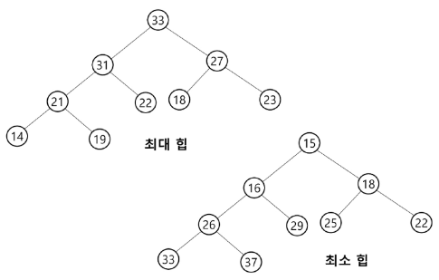
    - 자식 노드 간의 크고 작음은 상관 없음
    - 서브 트리로 잘라서 봤을 때에도 루트 노드가 가장 크거나 가장 작으면 됨

- 힙이 아닌 이진 트리 예시

    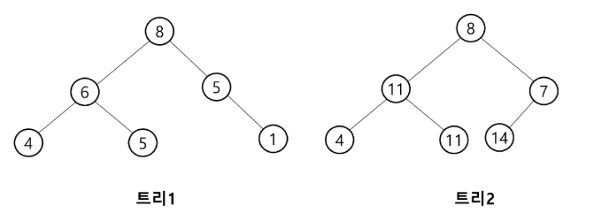
    - 트리1은 완전 이진 트리가 아니므로 힙XX
    - 트리2는 가장 큰 값도, 가장 작은 값도 아닌 애가 루트 노드에 위치해 있으므로 힙XX

### 힙 연산
- 삽입
    - 삽입했던 노드가 부모 노드보다 크다면(최소힙일 땐 작다면) 부모 노드와 swap하며 최대/최소 힙 조건 맞을 때까지 반복
    - 최대 힙에서 17 삽입
    
        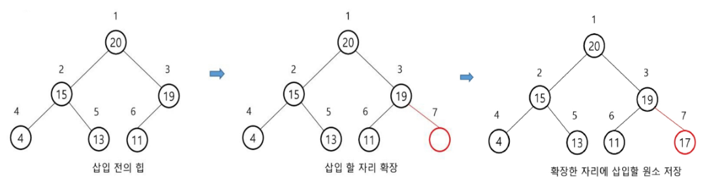

    - 최대 힙에서 23 삽입

        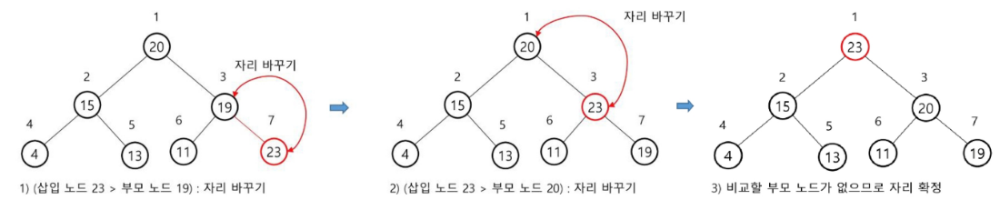
        - 내가 부모 노드보다 크다면 부모(루트) 노드와 swap

- 삭제
    - 힙에서는 루트 노드의 원소만을 삭제할 수 있음
    - 루트 노드의 원소를 삭제하여 반환함
    - 힙의 종류에 따라 최대값 또는 최소값 구할 수 있음
    
    - 루트의 원소 값 삭제 과정
        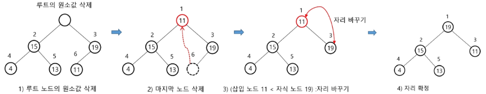
        - 루트 노드 삭제 후 힙의 규칙을 위해 마지막 노드를 루트 노드 자리에 배치
        - 힙 규칙에 맞게 자리 바꾸기

- heap 생성/삽입/삭제 구현
    ```python
    class MinHeap:
        def __init__(self):
            self.heap = []  # 힙을 저장할 빈 리스트 초기화(완전 이진 트리 구현을 위함)
            self.length = 0  # 힙의 길이 초기화

        # 힙에 새로운 요소를 추가
        def heappush(self, item):
            self.heap.append(item)  # 새로운 요소를 리스트의 끝에 추가
            self.length += 1  # 힙의 길이 증가

            self._siftup(self.length - 1)  # 가장 마지막에 삽입된 요소의 index를 넘김


        # 힙에서 최소 요소를 제거하고 반환
        def heappop(self):
            if self.length == 0:
                raise IndexError("힙이 비었습니다.")  # 힙이 비어 있는 경우 예외 발생
            if self.length == 1:
                self.length -= 1
                return self.heap.pop()  # 힙에 요소가 하나만 있는 경우 그 요소를 반환

            # 루트 노드의 원소를 반환!
            root = self.heap[0]
            # 마지막 요소를 루트로 이동
            self.heap[0] = self.heap.pop()
            # 내 길이를 1 감소
            self.length -= 1
            # 힙의 속성 유지를 위해 siftdown 진행
            # 힙은 정렬을 보장하지 못하므로
            # pop 했다면 siftdown 필수!!
            self._siftdown(0)   # shifdown에 들어갈 인덱스는 항상 0(루트 인덱스)
            return root


        # 주어진 리스트를 힙으로 변환
        def heapify(self, array):
            self.heap = array[:]  # 리스트의 복사본을 힙으로 사용
            self.length = len(array)

            for i in range(self.length // 2 - 1, -1, -1):   # 리프 노드는 siftdown 할 수 없으므로
                # range 이용해서 말단 노드 제외한 요소들을 siftdown
                self._siftdown(i)   # i번째부터 siftdown


        # 삽입 후 힙 속성을 유지하기 위해 사용되는 보조 메서드
        def _siftup(self, idx):
            # 마지막에 삽입된 노드와 부모 노드의 크기를 비교
            # 그러기 위해선, 부모 노드의 인덱스를 얻어야 함
            # 부모 인덱스를 0부터 사용하고 있다면 (index -1) // 2으로 부모 인덱스 구할 수 있음
            parent = (idx -1) // 2

            '''
            지금 '최소 힙'을 구현하고 있는 중
            언제까지 siftup이 이루어져야 할까?
                1. 내 idx가 0이 되기 전까지
                2. 내 값이 부모 노드의 값보다 작은 동안
            '''
            # 자식이 부모보다 작은 경우 -> 교환
            while idx > 0 and self.heap[idx] < self.heap[parent]:
                # while문 들어왔다는 것은 부모보다 내가 크다는 의미이므로 swap
                self.heap[idx], self.heap[parent] = self.heap[parent], self.heap[idx]
                idx = parent    # 내 위치를 부모와 바꿨으니 갱신하자
                parent = (idx -1) // 2      # 부모 정보 갱신


        # 삭제 후 힙 속성을 유지하기 위해 사용되는 보조 메서드
        def _siftdown(self, idx):
            '''
            1. 가장 작은 요소를 무엇으로 볼 것인지 담을 수 있는 변수 초기화
                - 첫 시작 과정에서는 일단 루트를 smallest로 지정
            2. 왼쪽 자식 인덱스 계산
            3. 오른쪽 자식 인덱스 계산
            (왼쪽이 나보다 작은지, 오른쪽이 나보다 작은지 알기 위함)
            '''
            smallest = idx          # 0 일때
            left = 2 * idx + 1      # 1
            right = 2 * idx + 2     # 2

            # 왼쪽 자식의 index가 내 전체 크기를 벗어나지 않고
            # 왼쪽 자식 값이 부모보다 작다면 -> 왼쪽 자식의 인덱스 저장(지금 바로 바꾸지X)
            if left < self.length and self.heap[left] < self.heap[smallest]:
                smallest = left
            # 오른쪽 자식도 동일하게 비교
            if right < self.length and self.heap[right] < self.heap[smallest]:
                smallest = right
            '''
                - 완전 이진 트리라서 왼쪽 자식은 있고 오른쪽 자식은 없는 경우는 있지만
                - 오른쪽 자식은 있는데 왼쪽 자식은 없는 경우는 없기 때문에
                - 왼쪽부터 비교했는데, 오른쪽 자식이 없는 경우를 처리해주면
                - 오른쪽부터 비교해도 상관은 없음
                
                # 위에서 바로 swap하지 않는 이유
                # 위에서 바로 swap해버리면 
                # 루트와 왼쪽 자식 swap 후 루트가 된 왼쪽 자식과 오른쪽 자식을 비교하게 되므로
                # 내가 원하는 대로 swap되지 않을 수 있음
            '''
            # 내가 가장 작지 않다면? swap
            if smallest != idx:
                self.heap[smallest], self.heap[idx] = self.heap[idx], self.heap[smallest]

                # 그렇게 스왑한 자리의 자식보다 내가 충분히 클 수 있으니
                # 지금 작업을 계속 반복
                self._siftdown(smallest)

        def __str__(self):
            return str(self.heap)  # 힙의 문자열 표현 반환

    min_heap = MinHeap()    # 최소 힙 -> 루트 노드가 제일 작아야 한다!
    min_heap.heappush(3)
    min_heap.heappush(1)
    min_heap.heappush(2)

    print(min_heap)  # [1, 3, 2]
    print(min_heap.heappop())  # 1
    print(min_heap)  # [2, 3]

    min_heap.heapify([5, 4, 3, 2, 1])
    print(min_heap)  # [1, 2, 3, 5, 4]
    print(min_heap.heappop())  # 1
    print(min_heap)  # [2, 4, 3, 5] 
    print(min_heap.heappop())  # 2
    print(min_heap)  # [3, 4, 5]
    ```

※ 메서드 앞에 `_` 하나 붙이는 이유

-> 내가 내부적으로 사용할 메서드임을 명시하는 것(약조)

-> `__` 두개 붙이면 매직 메서드

-> 하나 붙이는 것과 두개 붙이는 것은 분명히 기능적인 차이가 있음(더블 __이 더 엄격함)

-> 근데 두개 붙였다고 해서 파이썬이 다른데서 해당 메소드 호출 못하게 막지는 않음

**※ 힙은 정렬되있음을 보장하지 못한다는 것을 기억하기**

- 최소 힙 구현(heapq 라이브러리 사용)
    ```python
    import heapq

    numbers = [10, 1, 5, 3, 8, 7, 4]  # 초기 리스트

    # 리스트를 최소 힙으로 변환
    heapq.heapify(numbers)
    print(numbers)

    heapq.heappush(numbers, -1)
    print(numbers)

    smallest = heapq.heappop(numbers)
    print(smallest)
    print(numbers)

    # 단, 주의사항
    # 이렇게 heap으로 만든 numbers를 리스트처럼 그냥 append하면 곤란함
    numbers.append(-1)
    print(numbers)
    ```

- 최대 힙 구현(heapq 사용)
    ```python
    import heapq

    numbers = [10, 1, 5, 3, 8, 7, 4]  # 초기 리스트

    max_heap = []
    for number in numbers:
        heapq.heappush(max_heap, -number)
    print(max_heap)

    largest = -heapq.heappop(max_heap)
    print(largest)
    ```
    - heapq의 메소드는 최소 힙 기준
    - 최대 힙 구현하고 싶으면 리스트 전체에 `-` 마이너스 붙여서 최소 힙 구현 후 마이너스 제거하기


## 우선순위 큐(Priority Queue)
우선순위를 가진 항목들을 저장하는 큐

- FIFO 순서가 아니라 우선순위가 높은 순서대로 먼저 나가게 됨
- 우선순위 큐를 구현하는 가장 효율적인 방법은 '힙을 사용'하는 것
- 노드 하나의 추가/삭제의 시간 복잡도가 O(logN)이며, 최대값/최소값을 O(1)에 구할 수 있음

- 우선순위 큐 구현
    ```python
    import heapq

    # 빈 우선순위 큐 생성
    priority_queue = []

    # 우선순위 큐에 요소 추가 (우선순위, 작업)
    heapq.heappush(priority_queue, (3, "3 priority task"))  # 우선순위 3인 작업 추가
    heapq.heappush(priority_queue, (1, "1 priority task"))  # 우선순위 1인 작업 추가
    heapq.heappush(priority_queue, (2, "2 priority task"))  # 우선순위 2인 작업 추가

    # 현재 우선순위 큐의 상태 출력
    print(priority_queue)  
    # [(1, '1 priority task'), (3, '3 priority task'), (2, '2 priority task')]
    # 우선순위가 낮은 숫자일수록 더 높은 우선순위를 가짐

    # 우선순위 큐에서 요소를 하나씩 꺼내어 출력
    while priority_queue:
        task = heapq.heappop(priority_queue)  # 우선순위가 가장 높은 요소를 꺼냄
        print(task)  # 꺼낸 요소 출력
    ```
    - 우선순위 큐에 요소 넣을 때 `(우선순위, 작업)` 형태의 튜플로 넣을 수 있음
    - 우선순위에 정수말고 문자열 넣어도 아스키코드로 변환해서 알아서 비교함
    - `from queue import PriorityQueue`라는 라이브러리가 있긴 한데, 일반적인 연산에 사용하기 보단 '멀티 스레딩'에 씀(알고만 있으셍)

### 연습문제
- [SWEA 9280] 진용이네 주차타워 

    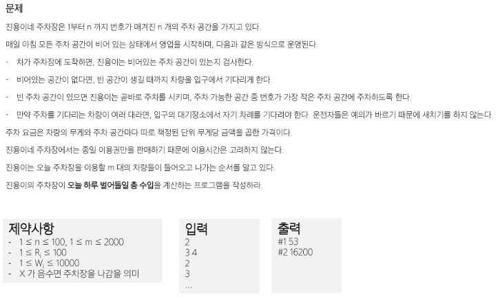


## 백트래킹
1. 여러 가지 선택지(옵션)들이 존재하는 상황에서 한가지를 선택
    - 아무거나 선택하는거 아님
    - 내가 선택할 수 있는 선택지 중 첫번째 선택지(어쨌든 완전탐색 할거니까)
2. 선택이 이루어지면 새로운 선택지들의 집합이 생성됨
3. 이런 선택을 계속하면 목표 상태(goal state)에 도달함

- 당첨 리프 노드 찾기
    - 루트에서 갈 수 있는 노드를 선택
    - 꽝 노드까지 도달하면 최근 선택으로 되돌아와서 다시 시작함
    - 더 이상의 선택지가 없다면 이전의 선택지로 돌아가서 다른 선택을 함
    - 루트까지 돌아갔을 경우 더 이상 선택지가 없다면 찾는 답이 없다는 것

        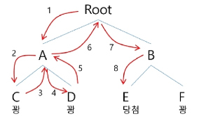

- 8-Queens 문제

    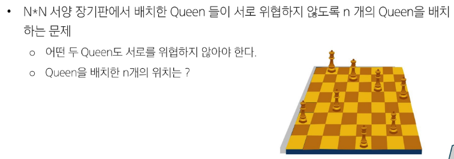
    - 퀸 8개를 크기 8의 체스판 안에 서로를 공격할 수 없도록 배치하는 모든 경우를 구하는 문제
        - 후보 해의 수: `64C8` = 4,426,165,368
        - 실제 해의 수: 이 중에서 실제 해는 **92개** 뿐
        - 즉, 44억개가 넘는 후보 해의 수 속에서 92개를 최대한 효율적으로 찾아내는 것이 관건
    
- 4-Queens 문제로 축소하여 생각
    - 같은 행에 위치할 수 없음
    - 모든 경우의 수: 4 * 4 * 4 * 4 = 256

        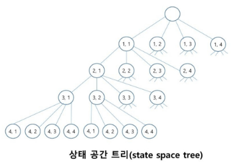

-> root 노드에서 leaf 노드까지 경로는 해답후보(candidate solution)가 되는데, 완전 탐색으로 그 해답후보 중에서 해답을 찾을 수 있음

-> 해답 가능성이 없는 노드의 후손 노드들도 모두 검색해야 하므로 **비효율적**

-> 모든 후보를 검사하지 말자!!!

### 백트래킹 기법
어떤 노드의 유망성을 점검한 후 유망하지 않다고 결정되면 그 노드의 부모로 되돌아가(backtraking) 다음 자식 노 드로 감

- 유망(promising)하다
    - 어떤 노드를 방문하였을 때 그 노드를 포함한 경로가 해답이 될 수 있으면 '유망하다'고 함
- 가지치기(pruning)
    - 유망하지 않은 노드가 포함되는 경로는 더 이상 고려하지 않음

- 백트래킹 알고리즘 절차
    1. 상태 공간 트리의 깊이 우선 탐색 실시
    2. 각 노드가 유망한지 점검
    3. 만일 그 노드가 유망하지 않으면, 그 노드의 부모 노드로 돌아가서 다른 노드로의 검색을 계속함

**※ 백트래킹과 DFS 차이**

-> 어떤 노드에서 출발하는 경로가 해결책으로 이어질 것 같지 않으면 더 이상 그 경로를 따라가지 않음으로써 시도의 횟수를 줄임(Punning 가지치기)

-> DFS는 모든 경로를 추적

-> 백트래킹은 불필요한 경로를 조기 차단

-> 백트래킹 알고리즘을 적용하면 일반적으로 경우의 수가 줄어들지만, 최악의 경우에는 여전히 지수함수 시간을 요하므로 처리 불가능

- 일반 백트래킹 알고리즘

    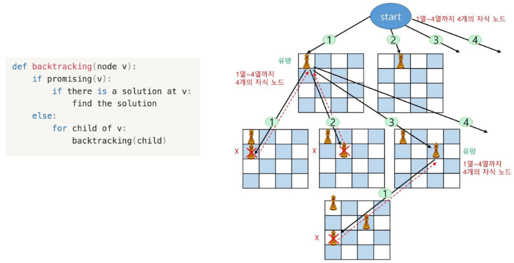


### N-Queen
- 그림으로 룰 설명

    
    - 퀸은 자신의 위치에서 상, 하, 좌, 우, 모든 대각선 방향으로 체스판 끝까지 도달 가능함

- N-Queen 구현
    - N-Queen에서 만족해야 할 조건
        - 같은 행에 두 개 이상의 퀸이 위치할 수XX
        - 같은 열에 두 개 이상의 퀸이 위치할 수XX
        - 같은 대각선에 두 개 이상의 퀸이 위치할 수XX

    ```python
    # 현재 위치에 퀸을 놓아도 되는지 판별하는 함수
    def is_vaild_pos(board, row, col):
        # 현재 열에 다른 퀸이 있는지 검사
        for idx in range(row):
            if board[idx][col] == 1:  # 현재 내가 위치한 행을 기준으로
                                      # 내 위쪽에(나랑 같은 열) 말이 있으면
                                      # 그 위치엔 내가 있을 수 없음
                return False
                # 내 왼쪽에(나랑 같은 행) 말이 있는지는 검사 따로 안함
                # why?
                # 이전에 말을 놓지 못해서 col을 이동한 것이므로
                # 지금 위치의 내 왼쪽엔 말이 없는게 당연

        # 현재 위치의 왼쪽 대각선 위로 퀸이 있는지 검사
        '''
        row = col = 2 라고 가정하면
        row, col = [2, 1, 0], [2, 1, 0]
        row, col = zip(range(row, -1, -1), range(col, -1, -1))
        -> (2, 2), (1, 1), (0, 0)
        '''
        for i, j in zip(range(row, -1, -1), range(col, -1, -1)):
            if board[i][j] == 1:
                return False

        # 현재 위치의 오른쪽 대각선 위
        for i, j in zip(range(row, -1, -1), range(col, n)):
            if board[i][j] == 1:
                return False

        # 모든 검증이 끝났는데 return False가 아니다?
        # 그럼 이 위치에 퀸을 놓을 수 있따!
        return True


    def n_queens(row, board):
        # row가 내 모든 행에 대해서 조사를 했다면
        if row == n:
            # 어떠한 일을 하고 종료
            solutions.append([r[:] for r in board])
            return

        # 아직 모든 행에 대해 조사하지 않았다면
        # 모든 열에 대해서 현재 행에 퀸을 놓아 볼 것이다
        for col in range(n):
            # 현재 위치에 퀸을 놓아도 되는지 판별
            if is_vaild_pos(board, row, col):    # True or False
                board[row][col] = 1     # 이번 row, col 위치에 말을 놓음
                n_queens(row + 1, board)    # 다음 조사 보내기
                                            # 근데 row+1 위치에 모든 경로가 다 막혔다면
                                            # 여기로 백트래킹 함
                board[row][col] = 0         # 그럼 원상복귀

    # ----------------------------------

    n = 4
    board = [[0] * n for _ in range(n)]  # 4*4 2차원 배열 생성
    solutions = []  # 모든 솔루션을 저장할 리스트

    # n-queens라는 함수를 호출했을 때, 언제까지 조사할 것인가?
    # 퀸 4개를 모두 놓았고, 그게 solution이라면, ... 어떠한 일을 할 것이다
        # 그러기 위해서, 퀸을 현재 조사 위치에 놓을 수 있을지도 판별

    n_queens(0, board)

    for solution in solutions:
        print(solution)
    ```

- N-Queen 상태 공간 트리
    
    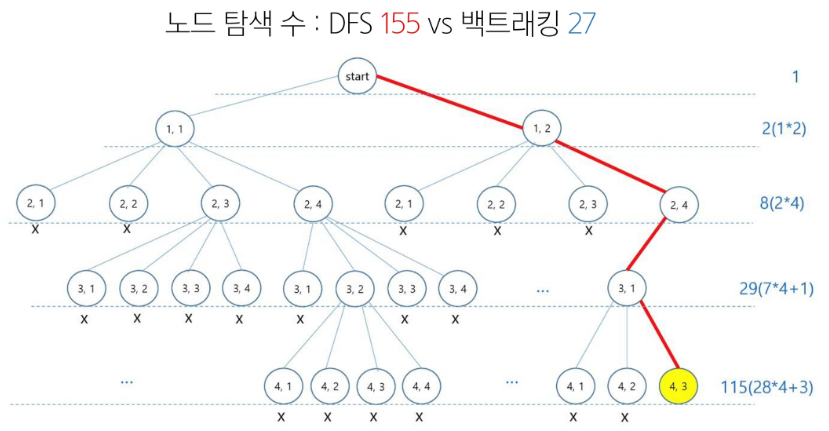
    - 백트래킹이 DFS에 비해 탐색 횟수 현저히 적음

※ 백트래킹은 모든 가능한 경우의 수 중 **특정한 조건**을 만족하는 경우에만 살펴보는 것

-> 답이 될 만한지 판단하고 그렇지 않으면 그 부분까지 탐색하는 것을 하지 않고 **가지치기** 하는 것

-> 주로 문제 풀이에서는 DFS로 모든 경우의 수를 탐색하는 과정에서, 조건으로 절대 답이 될 수 없는 상황을 정의하여 체크하고, 그런 상황일 경우 탐색 중지시킨 뒤 그 이전으로 돌아가서 다른 경우를 탐색하게끔 구현함

### 연습문제
- 부분 집합의 합
    - {1, 2, 3, 4, 5, 6, 7, 8, 9, 10}의 부분집합 중 원소의 합이 10인 부분집합을 모두 출력해라

- 부분 집합 solution
    ```python
    def find_subset(start, current_subset, current_sum):
        global cnt  # 함수 실행 횟수 기록
        cnt += 1

        # 가지치기 하나 더 추가
        if current_sum > target_sum:
            return # 더이상 조사할 의미 없음

        # 현재 부분집합의 합이 target_sum과 일치하면 result에 추가
        if current_sum == target_sum:
            # 원본 그대로 넣으면 복제본이 들어가서 곤란하므로
            # 새로운 리스트 만들어서 집어넣기
            # result.append(current_subset[:]) XX
            result.append(list(current_subset))
            return

        # 'start부터' 전체 수를 다 순회
        # 0부터 순회하면 다음 조사하러 갔을 때 이전 조사에서 선택 여부 골랐는데
        # 다시 중복해서 선택하게 되버림(중복조합, 중복순열)
    for idx in range(start, len(nums)):
            num = nums[idx]
            # 현재 선택한 수를 집합에 넣고, 값도 추가해서 다음 작업
            current_subset.append(num)
            find_subset(idx + 1, current_subset, current_sum + num)

            # 현재 와있는 수를 넣지 않고 다음 선택으로 넘어가는 경우의 수도 체크해주기
            # 지금 [1, 2]까지 넣었다면
            # 위에서 3을 넣은 [1, 2, 3]을 만들고 4를 보는거
            # 3을 안넣는 경우도 있을테니까 [1, 2, 4]라는 경우의 수를 만들기 위해 3을 pop하는 과정
            current_subset.pop()

    # ------------------------------------

    nums = [1, 2, 3, 4, 5, 6, 7, 8, 9, 10]
    target_sum = 10
    result = []
    cnt = 0

    # 필요한 인자들은?
    # 1. 재귀를 중단시킬 파라미터 (총합이 10이 되면 종료) -> 기준점
    # 2. 누적해서 가야할 파라미터 -> 만들어지는 부분집합
    # + 그 선택할 집합의 index 파라미터
    find_subset(start=0, current_subset=[], current_sum=0)
    ```
    - 어려운 부분은 재귀 함수의 basis rule을 어떻게 작성할 것인지가 문제(가지치기 하는 부분)
    - 내 목표와 할 일을 먼저 작성하고 `current_sum == target_sum` 처럼!
    - 작업이 너무 오래 걸린다는 생각이 들 때! `current_sum > target_sum`과 같은 조건을 생각 (이 부분이 백트래킹의 핵심)

- 부분집합 solution2
    ```python
    nums = [1, 2, 3, 4, 5, 6, 7, 8, 9, 10]
    target_sum = 10
    result = []
    n = len(nums)

    for i in range(1 << n):  # 모든 경우의 수에 대해
        current_subset = []
        current_sum = 0
        for j in range(10): # j번째 요소가 선택되었는지 확인하기
            if i & (1 << j):
                current_subset.append(nums[j])
                current_sum += nums[j]
            if current_sum > target_sum:    # 가지치기(결과 달라지지X, 조사 횟수만 줄어듦)
                break
        if current_sum == target_sum:
            result.append(current_subset)

    print(result)
    ```

