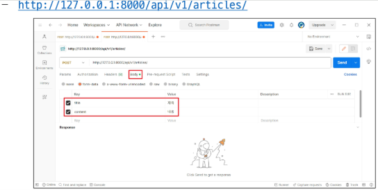
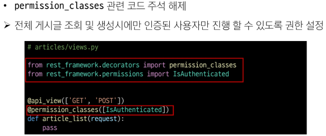

# Django Authentication System
## Cookie & Session

※ 우리가 서버로부터 받은 페이지를 둘러볼 때 우리는 서버와 서로 연결되어 있는 상태가 아님

- HTTP
    - HTML 문서와 같은 리소스들을 가져올 수 있도록 해주는 규약
        - 웹(WWW)에서 이루어지는 모든 데이터 교환의 기초
    
- HTTP 특징
    - 비 연결 지향(connectionless)
        - 서버는 요청에 대한 응답을 보낸 후 연결을 끊음
    - 무상태(stateless)
        - 연결을 끊는 순간 클라이언트와 서버 간의 통신이 끝나며 상태 정보가 유지되지 않음
    
※ 상태가 없다는 것은,

-> 장바구니에 담은 상품을 유지할 수 없음

-> 로그인 상태를 유지할 수 없음

-> 따라서 '상태를 유지하기 위한 기술'이 필요함

### 쿠키(Cookie)
서버가 사용자의 웹 브라우저에 전송하는 작은 데이터 조각

-> **클라이언트 측에서 저장되는** 작은 데이터 파일이며, 사용자 인증, 추적, 상태 유지 등에 사용되는 데이터 저장 방식

- 쿠키 사용 에시

    
    1. 브라우저가 웹서버에 웹 페이지 요청
    2. 서버가 단순히 JSON 등의 웹페이지만 전송하는 것이 아닌, **쿠키**도 같이 보냄
    3. 최초 요청에 대해 서버가 쿠키를 보내주면 브라우저가 쿠키를 가지고 있다가 다음번 요청에 쿠키를 함께 보냄

- 쿠키 사용 원리
    1. 브라우저(클라이언트)는 쿠키를 KEY-VALUE의 데이터 형식으로 저장
    2. 이렇게 쿠키를 저장해 놓았다가, 동일한 서버에 재요청 시 저장된 쿠키를 함께 전송
        - 쿠키는 두 요청이 동일한 브라우저에서 들어왔는지 아닌지를 판단할 때 주로 사용됨
        - 서버는 전에 보냈던 쿠키의 key값만 가지고 있으면 됨 -> 브라우저가 다음에 쿠키를 같이 보내줬을 때 서버는 자기가 가진 키값과 일치하는 키값을 찾아내서 value를 뽑아낼 수 있는 형태
        - 이를 이용해 사용자 로그인 상태 유지 가능
        - 상태가 없는(stateless) HTTP 프로토콜에서 상태 정보를 기억 시켜 주기 때문

- 쿠키를 이용한 장바구니 예시
    1. 장바구니에 상품 담기
    2. 개발자 도구 - Network 탭 - cartView.pang 확인
        - 서버는 응답과 함께 Set-Cookie 응답 헤더를 브라우저에게 전송
        - 이 헤더는 클라이언트에게 쿠키를 저장하라고 전달하는 것

        
    3. Cookie 데이터 자세히 확인

        
    4. 메인 페이지 이동 - 장바구니 유지 상태 확인

        
    5. 개발자 도구 - Application 탭 - Cookies
        - 마우스 우측 버튼 - Clear - 새로고침 -> 장바구니 빈 것 확인
    
        

- 쿠키 사용 목적
    1. 세션 관리(Session management)
        - 로그인, 아이디 자동완성, 공지 하루 안 보기, 팝업 체크, 장바구니 등의 정보관리
    2. 개인화(Personalization)
        - 사용자 선호, 테마 등의 설정
    3. 트래킹(Tracking)
        - 사용자 행동을 기록 및 분석

### 세션(Session)
서버 측에서 생성되어 클라이언트와 서버 간의 상태를 유지 

-> 상태 정보를 저장하는 데이터 저장 방식

-> 쿠키에 세션 데이터를 저장하여 매 요청시마다 세션 데이터를 함께 보냄

- 세션 작동 원리
    1. 클라이언트가 로그인을 하면 서버가 session 데이터를 생성 후 저장
        - 로그인하는 행위는 결국 POST 요청하는 것!
        - 왜? DB에 '나'라는 유저가 '로그인' 이라는 인증 행위를 시작했으니 그에 대한 세션 데이터를 생성해달라는 POST 요청을 하는 것
    2. 생성된 session 데이터에 인증할 수 있는 session id를 발급
    3. 발급한 session id를 클라이언트에게 응답
    4. 클라이언트는 응답받은 session id를 **쿠키에 저장**
    5. 클라이언트가 다시 동일한 서버에 접속하면 요청과 함께 쿠키(session id가 저장된)를 서버에 전달
    6. 쿠키는 요청 때마다 서버에 함께 전송되므로 서버에서 session id를 확인해 로그인 되어있다는 것을 알도록 함
        - 넘겨받은 쿠키에서 확인한 session id로 아까 요청보낸 그 유저구나! 하는 것을 세션 DB에서 찾아내 로그인 됨을 알도록 하게되는 것

    -  서버 측에서는 세션 데이터를 생성 후 저장하고 이 데이터에 접근할 수 있는 세션 ID를 생성
    -  이 ID를 클라이언트 측으로 전달하고, 클라이언트는 쿠키에 이 ID를 저장

- Session 생성 및 변환 예시

    
    
    

    

    

    - 이후 클라이언트가 같은 서버에 재요청 시마다 저장해 두었던 쿠키도 요청과 함께 전송
        - ex. 로그인 상태 유지를 위해 로그인 되어있다는 사실을 입증하는 데이터를 매 요청마다 계속해서 보내는 것
    
- 쿠키와 세션의 목적
    - 서버와 클라이언트 간의 '상태'를 유지

**※ 정리(클라이언트/서버/사용자로 인격을 나눠보자)**

-> 클라이언트 개발자(프론트)는 '요청을 보내는 유저'로서 id, password를 입력하여 요청 보냄(지금은 아이디, 비번만 보내면 됨)

-> 서버 개발자는 프론트엔드 개발자로부터 id, password를 받았으니 사용자에게 발급해줘야 될 쿠키 정보에 들어갈 세션 데이터를 생성해서 DB에 저장하고 그에 대한 ID를 프론트 개발자에게 반환해줌

-> 프론트 개발자는 발급받은 데이터를 쿠키에 저장

-> 쿠키에 저장할 세션ID값이 있다는 것은 '로그인이 성공했구나'를 의미하고, 이것을 사용자(진짜 클라이언트)에게 알려야함

-> 사용자는 화면 어딘가에 있던 로그인 버튼이 사라지고 본인의 이름이 보이는 등의 UI를 보고 로그인 됐음을 확인함

-> 그렇다면 프론트 개발자는 사용자 입장에서 로그인이 되었음을 알 수 있는 방법도 구현해놔야 함

-> 사용자가 '내 정보' 페이지로 이동하려고 하면, 프론트 개발자는 내 정보가 들어있는 데이터가 있는 곳으로 서버에게 다시 요청 보냄(**이때 session id도 같이 보냄!!!!**)

-> 그럼 서버 개발자는 응답받아온 요청이 식별자는 어디어디고, 행위가 뭐고(ex. GET), session id에 있는 값이 무엇인지 보고 무슨 유저인지 알아내서 그 유저에 대한 정보를 응답하면서 함께 보냄

-> 프론트 개발자는 응답받은 데이터로 내 정보를 화면에 그림(이때의 로그인은 계속 유지되고 있어야 함)

-> 그런데 인증 정보(세션, 쿠키 정보)가 영원히 DB에 저장되어 있을까? NO!!!

**※ 세션 만료**

-> 은행, swea 사이트 등 일정 시간이 지나면 다시 로그인 해야하는 상황 발생

-> 정보 보호를 위함

-> 서버측에서 session id에 대한 데이터베이스를 주기적으로 삭제함

-> 그러면 내 pc에 아무리 세션id에 대한 파일이 물리적으로 저장되어있어도 서버에 보내봤자 서버가 니 누군데? 인증해! 하는거

-> 그래서 로그인 갱신 누르면 기존 session id 삭제하고 새로운 session id 만들어서 그 세션id를 클라이언트에게 다시 주고, 클라이언트는 기존 쿠키 데이터를 지우고 다시 받은 세션 정보를 가지고 다음 요청을 할 수 있게 됨

-> 이런식으로 보안에 신경쓸 필요가 있음


### 참고
- 쿠키 종류별 Lifetime(수명)
    1. Session cookie
        - 현재 세션(current session)이 종료되면 삭제됨
        - 브라우저 종료와 함께 세션이 삭제됨
    2. Persistent cookies
        - Expires 속성에 지정된 날짜 혹은 Max-Age 속성에 지정된 기간이 지나면 삭제됨
    
- 세션 in Django
    - Django는 `database-backed-sessions` 저장 방식을 기본 값으로 사용
    - session 정보는 DB의 `django_session` 테이블에 저장됨
    - Django는 요청 안에 특정 session id를 포함하는 쿠키를 사용해서 각각의 브라우저와 사이트가 연결된 session 데이터를 알아냄
    - Django는 우리가 session 메커니즘(복잡한 동작원리)에 대부분을 생각하지 않게끔 많은 도움을 줌

### 실습
※ 05_DJANGO/04-drf-auth

- 기본 설정
    - `python -m venv venv`
    - `source venv/Scripts/activate`
    - `pip install -r requirments.txt`
        - django-5.2.4 설치 확인

- 코드 둘러보기
    - 앱 2개 보임(accounts, articles)
        - 장고는 기본 제공하는 기능이 많다보니, 강제되는 부분이 몇가지 있음
        - 어플리케이션 이름 accounts 아니어도 상관없는데, 되도록 accounts로 만드는걸 권장
        - 프로젝트 폴더 `my_api/urls.py`를 살펴보면
            ```python
            urlpatterns = [
                path('admin/', admin.site.urls),
                path('api/v1/', include('articles.urls')),
                path('accounts/', include('accounts.urls')),
            ]
            ```
        - `accounts/` 말고 다른 이름으로 해도 상관없지만, 장고가 이미 유저에 대한 기능을 많이 만들어놨는데 그걸 accounts/ 경로로 요청 들어왔을 때 처리하도록 만들어놓음
        - 그래서 경로가 accounts/로 설정되는 것이 강제되는 부분이 있다~
        - 직접 다 구현할거면 이름 얼마든지 바꿔도 상관XX
    
    - 장고가 유저에 대한 기능을 만들어줬을 때 신경써야할 부분
        - User 정보를 저장할 table을 만들려면 models.py에 class 정의해야함
        - 그런데 지금까지 우리는 User 클래스를 정의한 적이 없음
        - 그럼에도 테이블이 만들어져서 admin이라는 수퍼 유저 계정을 생성했고, 실제로 로그인이 된 것도 확인함
        - 왜? 장고는 자기가 유저 정보를 관리하기 위한 클래스를 이미 만들어놨기 때문
        - 그래서 auth라는 테이블이 이미 만들어져 있음
        - 그대로 사용해도 상관없지만 우리는 우리나라에서 기본적으로 필요한 주민등록번호, 전화번호 등을 추가할 필요도 있음
        - 그럼 `class AbstractUser`를 상속 받아서 쓰겠지. 즉, 커스텀 유저 만들기
            ```python
            # accounts/models.py
            from django.db import models
            from django.contrib.auth.models import AbstractUser

            class User(AbstractUser):
                # 인증과 관련된 테이블을 설정할 때,
                # 장고가 기본으로 제공해주는 필드들 (username, password, email 등)을
                # 수정 없이 그대로 사용한다고 하더라도,
                # 장고는 User 모델을 custom해서 등록하기를 `강력히 권장`한다.
                    # 이때, 단순히 accounts 앱에 User 모델을 만들기만 한다고해서,
                    # 기존의 django가 제공해주는 그 인증, 권한, auth 모델과의
                    # 복잡한 연관 관계가 모두 한번에 수정되는 것은 아님!
                # 우리는 django에게, 이 class가 기존의 auth class를 대체할 것임을 설정한다.
                # 설정? 어디서? -> settings.py
                pass
            ```
        
        - 인증 유저 모델을 accounts.User(내가 커스텀한 모델)로 사용할 것이라는 것을 장고에게 알려주기
            ```python
            # my_api/settings.py
            AUTH_USER_MODEL = 'accounts.User'
            ```
    
    - 로그인 행위가 어떻게 이루어지는지 확인
        - accounts/로 요청 보내면 accounts.urls가 나머지를 처리한다고 입력했으니
        - `accounts/urls.py`에서 로그인 행위 확인. 로그인 행위 하게되면 login view함수가 실행됨
            ```python
            path("login/", views.login)
            ```
        - `accounts/views.py`에서 로그인 함수 확인
            ```python
            from rest_framework.decorators import api_view
            from rest_framework import status
            from rest_framework.response import Response
            from django.contrib.auth.forms import AuthenticationForm  # 장고 내장 로그인 폼
            from django.contrib.auth import login as auth_login  # 장고 내장 로그인 함수

            @api_view(["POST"])
            def login(request):
                form = AuthenticationForm(request, request.POST)  # 사용자가 입력한 데이터를 폼에 넣음
                if form.is_valid():  # 유효성 검사
                    user = form.get_user()  # form에서 user 객체를 가져옴
                    auth_login(request, user)  # 로그인 함수 실행
                    session_id = request.session.session_key  # 세션 키를 가져옴
                    response_data = {
                        'message': 'Login successful',
                        'session_id': session_id
                    }
                    return Response(response_data, status=status.HTTP_200_OK)
                return Response(form.errors, status=status.HTTP_400_BAD_REQUEST)
            ```

    - migration하고 POST 요청 보내보면

        
        - 이 세션id를 통해 방금 요청보냈던 관리자 계정임을 나타낼 수 있음
        - 그럼 내 DB에는 세션id가 저장되어 있을 것임!
        - DB 파일 열어보면 django_session 테이블에 세션 정보가 들어있음을 확인 가능

- 매번 요청 보낼 때마다 세션 정보를 요청 보내는 형태로 만들어야 하는데
    - 복잡 & 불편
    - 또, 나중에 서버가 확장됐을 때 서버를 여러대 사용하는 분산 시스템의 경우 관리하기 힘든 경우가 생김
        - DB가 여러개이다 보니, 세션id를 넘겨받았을 때 모든 DB를 돌아다니며 session id를 찾아야함
    - 그래서 인증방식을 세션 방식이 아닌 토큰 방식으로 바꿀 것임
    

## Authentication with DRF
- 시작하기 전에
    - 인증 로직 진행을 위해 User 모델 관련 코드 활성화
        - `user ForeignKey` 주석 해제

            
            - 우리는 누가 작성했는지에 대한 유저 정보를 포함한 게시글을 작성하고 싶음
            - 그럼 1명의 유저는 N개의 게시글을 만들 수 있어야 함
            - 게시글은 유저에 대한 정보를 참조할 수 있어야 함
            - 즉, FK를 이용해 1:N 관계를 만들어주자
            ```python
            # articles/models.py
            from django.conf import settings
                # 장고의 설정에 있는 settings를 가지고 옴

            class Article(models.Model):
                # user = models.ForeignKey(
                #     'accounts.User', on_delete=models.CASCADE
                # )     # 이렇게 쓰는거랑 밑에 쓴거랑 동일함
                # 그러면 그냥 문자열로 적으면 되지 왜 귀찮구로...?
                # django가 기본적으로 User에 대한 Auth 모델을 지원
                # User 모델이란 내용은, 매우 복잡한 관계를 가지고 있으므로
                # 우리는 현재 `활성화` 된 유저 모델에 대한정보를
                # 장고 개발자들 끼리는 AUTH_USER_MODEL에 적기로 `약속`
                user = models.ForeignKey(
                    settings.AUTH_USER_MODEL, on_delete=models.CASCADE
                )
            ```

        - serializer의 `read_only_fields` 주석 해제

            
            - 게시글 생성할 때 쓰는 ArticleSerializer에 `fields = '__all__'`로 모든 필드를 추가하도록 하면
            - 사용자가 게시글 생성할 때 내가 누군지 선택해서 보내야함
            - 그러니 유저는 읽기 전용 필드로 만들어주기
            - 표현방식만 바꾸는거 아니고 로직도 바꿔야 함 -> views.py

         - article_list view 함수에서 게시글 생성 시 user 정보도 저장될 수 있도록 주석 해제

            
            - 게시글 생성 즉, POST하는 시점에 그냥 저장하는 것이 아니라 유저 정보 가지고 저장하도록 함
            - 쿠키에 세션id 넣어서 보내므로 요청 정보(request 객체)에 유저 데이터 들어가도록 장고가 넣어놓음

        - session 테스트용 요청 주소 주석처리
            
    - DB 초기화
        - `db.sqlite3` 삭제
        - `migrations` 파일 삭제
    - migration 과정 재진행
        - 변동사항 생겼으니 `python manage.py makemigrations`

### 인증(Authentication)
수신된 요청을 해당 요청의 사용자 또는 자격 증명과 연결하는 메커니즘

-> 누구인지를 확인하는 과정

- 권한(Permissions)
    - 요청에 대한 접근 허용 또는 거부 여부를 결정

- 인증과 권한
    - 순서상 인증이 먼저 진행되어 수신 요청을 해당 요청의 사용자 또는 해당 요청이 서명된 **토큰(token)**과 같은 자격 증명 자료와 연결
    - 그런 다음 권한 및 제한 정책은 인증이 완료된 해당 자격 증명을 사용하여 요청을 허용해야 하는 지를 결정

- DRF에서의 인증
    - 인증은 항상 view 함수 시작 시, 권한 및 제한 확인이 발생하기 전, 다른 코드의 진행이 허용되기 전에 실행됨
        - 즉, 사용자가 식별자로 요청 보냈을 때 ① 행위 판단하고 ② 인증 여부 판단하고 ③ 권한 확인하고 ④ 그 후에 view 실행시킴
    - 인증 자체로는 들어오는 요청을 허용하거나 거부할 수 없으며, **단순히 요청에 사용된 자격 증명만 식별**한다는 점에 유의

- 승인되지 않은 응답 및 금지된 응답
    - 인증되지 않은 요청이 권한을 거부하는 경우 해당되는 두 가지 오류 코드를 응답
    1. `HTTP 401 Unauthorized`
        - 요청된 리소스에 대한 유효한 **인증 자격 증명이 없**기 때문에 클라이언트 요청이 완료되지 않았음을 나타냄
        - 누구인지를 증명할 자료가 없음
        - 즉, 401이 왔으면 인증되지 않았다 -> 아 로그인 안했구나
    2. `HTTP 403 Forbidden (Permission Denied)`
        - 서버에 요청이 전달되었지만, **권한 때문에 거절**되었다는 것을 의미
        - 401과 다른 점은 서버는 클라이언트가 누구인지 알고 있음
        - 즉, 403이 왔으면 로그인 했는데 권한이 없다 -> 내 레포지토리에 왜 내 권한이 없을까 -> 내 계정이 아니구나

### 참고
- session 대신 token 인증을 사용하는 이유
    - 세션 기반 인증은 서버에 세션 데이터를 저장함 -> 상태 저장 방식(stateful)
    - 서버가 사용자의 상태를 유지해야 하므로 여러 대의 서버를 사용하는 분산 시스템 구축과 서버 간의 부하 분산이 어려움
    - 토큰 기반 인증은 RESTful한 방식으로 클라이언트와 서버 간의 독립성을 유지하면서 인증을 처리할 수 있음
        - **RESTful 원칙에 더 부합함**

### 인증 체계 설정
- 인증 체계 설정 방법 2가지
    1. 전역 설정
    2. View 함수 별 설정

※ DRF 공식문서 -> API Guide -> Authentication -> DRF에서 인증을 위한 사용 방법이 상세히 적혀있음!

- 전역 설정
    - 공식문서에 인증에 대한 설정을 하려면 어떻게 구조 짜야하는지 나와있음
        
        
        - 전역으로 사용하고 싶다면 REST_FRAMEWORK라는 딕셔너리에 기본 인증 클래스들을 뭘로 설정할건지 settings.py에 적어라
    - `DEFAULT_AUTHENTICATION_CLASSED` 사용
    - 사용 예시

        

- View 함수 별 설정
    - view 함수를 꾸미는 것! '데코레이터' 형식으로 설정하면 됨
    - `authentication_classes` 데코레이터 사용
    - 사용 예시

        
        - rest_framework의 데코레이터 중에는 authentication_classes라는 데코레이션이 있고
        - rest_framework의 인증방식(authentication)에는 토큰방식, 베이직 인증, 세션방식 등등이 있음
        - 공식 문서에 각 방식에 대한 내용들이 있음

- DRF가 제공하는 인증 체계
    1. `BasicAuthentication`
    2. `TokenAuthentication` -> 지금은 이거 사용할거얌
    3. `SessionAuthentication`
    4. `RemoteUserAuthentication`

- TokenAuthentication
    - 토큰 기반 HTTP 인증 체계
    - 기본 데스크톱 및 모바일 클라이언트와 같은 클라이언트-서버 설정에 적합함
    - 서버가 인증된 사용자에게 토큰을 발급하고, 사용자는 매 요청마다 발급받은 토큰을 요청과 함께 보내 인증 과정을 거침

- TokenAuthentication 적용 과정
    1. 인증 클래스 설정
        - TokenAuthentication 활성화 코드 주석 해제
        - 기본적으로 모든 view 함수가 토큰 기반 인증이 진행될 수 있도록 설정하는 것

            

    2. INSTALLED_APPS 추가
        - rest_framework.authtoken 주석 해제

            

    3. Migrate 진행
        - `python manage.py migrate`
        - 토큰이라는 것도 DB에 저장해야 하는 것
        - migrate 하면 토큰과 관련된 migrate작업이 진행됨

            

    4. 토큰 생성 코드 작성
        - `accounts/signals.py` 주석 해제
        - 인증된 사용자에게 자동으로 토큰 생성해주는 역할

            
            - post 요청이 들어왔을 때를 '감지'
            - 만약 유저와 관련된 post_save 요청이 들어오면 토큰을 생성하도록 작성
            - 응답받은 값들을 views.py에서 처리 방법을 세션이 아닌 다른 형식으로 바꾸도록 처리해야하는데
            - 그럼 로직 바꿔야함 -> 복잡쓰 -> dj-rest-auth 쓰자

### Dj-Rest-Auth 라이브러리
회원가입, 인증(소셜미디어 인증 등), 비밀번호 재설정, 사용자 세부 정보 검색, 회원 정보 수정 등 다양한 인증 관련 기능을 제공하는 라이브러리

- Dj-Rest-Auth 설치 및 적용
    - `pip install dj-rest-auth`
        - 우리는 requirments.txt에 있어서 함께 설치됐을 것임
    
    - REST_FRAMEWORK 설정 수정
        - 인증 처리 방식 변경하자
        ```python
        REST_FRAMEWORK = {
            # Authentication
            'DEFAULT_AUTHENTICATION_CLASSES': [
                'rest_framework.authentication.TokenAuthentication',
            ],
        }
        ```
        - 기본 인증 방식이 토큰 방식으로 바뀌게 될 것이다!
    
    - 추가 App 주석 해제

        

    - 추가 URL 주석 해제
        
        
        - 이제 accounts.urls가 처리XX
        - accounts로 요청 갔을 때 나머지는 dj_rest_auth.urls가 처리할 것임
    
    - 주석 해제 완료했으면 `python manage.py migrate`
    - 서버 실행 `python manage.py runserver`
        - 127.0.0.1:8000/accounts/
        - accounts로 요청 보냈을 때 Dj-Rest-Auth가 처리할 것임
        - Dj-Rest-Auth가 처리해주는 기능들

            
        - 비밀번호 리셋, 비번 리셋 확인, 로그인, 로그아웃, 유저 정보 보여주는 기능, 비번 변경 기능
    - postman으로 요청 보내보면 응답이 session_id -> key(토큰)으로 바뀐거 확인 가능

        
        - 요 토큰이 DB에 저장됨
    
- 그렇다면 게시글 생성 요청 보내보자

    
    - Article의 유저가 저장하려는 정보가 AnonymousUser라는 정체를 알 수 없는 객체다!
        - AnonymousUser: 장고가 기본 제공하는 비회원(인증이 안된 상태의 유저)을 AnonymousUser라는 객체로 주고있음
    - User 객체를 넣어줘야 한다!

        
        - 유저에 대한 정보를 안넣어줬더니 저장이 안되고 있음

- 관리자 계정 만들자 `python manage.py createsuperuser`
    - Username: admin
    - Password: 암거나
    - 그리고 서버 실행 `python manage.py runserver`

        
    - 토큰 값 복사
    - 복사한 토큰을 게시글 생성 요청하는 곳에 Headers
        - key: Authorization 
        - value: Token (토큰 글자 뒤에 복사한 토큰 붙여넣기)
        
    
- 결과

    
    - settings.py에 인증 방식을 토큰 인증 방식으로 바꿨고
    - 전역 설정으로 모든 뷰 함수들은 인증 방식을 토큰 방식이라 하겠다고 설정했고
    - 로그인 행위를 통해 토큰 생성, 발급, 응답하는 것은 dj-rest-auth에게 맡겼고
    - dj-rest-auth에게 맡긴 정보를 토대로 토큰을 발급 받았고
    - 게시글 생성 요청을 보낼 때 발급받은 토큰을 보냈고
    - 서버는 인증받은 토큰 정보를 토대로 request.user 객체(유저 정보)를 장고가 알아서 어느 유저인지 알아내고
    - 어느 유저인지 알아냈으니 저장이 가능하고(`serializer.save(user=request.user)`)
    - 저장한 응답 데이터를 반환하면 user의 pk값이 포함된 정상적으로 생성된 게시글이 만들어짐을 확인할 수 있음

**※ 우리가 해야하는 것(정리)**

-> settings.py에서 인증 방식 결정하기 

-> 토큰이 만들어져야 하니까 App에 `rest_framework.authtoken` 추가

-> 토큰이 저장될 table이 필요하니 migrate 진행해서 테이블 생성

-> 로그인, 회원가입시 토큰이 생성되어야 하므로, 토큰 생성 및 반환 방식은 dj-rest-auth에게 위임(App에 `dj-rest-auth` 추가)

-> dj-rest-auth에게 위임하려면 사용자가 로그인 요청을 보낼 식별자가 필요한데,

-> dj-rest-auth에게 시켰으니까 경로를 설정해줘야 함 `path('accounts/', include('dj_rest_auth.urls'))`

-> 그럼 우리는 accounts에 있는 view함수, signals, urls 다 필요없음

-> 단, accounts 앱과 User 모델(models.py)은 만들어줘야 함

-> 게시글 생성할 때 유저랑 1:N 관계를 맺는 테이블을 만들어 놨으면(articles/models.py)

-> 유저 정보를 저장할 수 있어야 함(articles/views.py)

```python
@api_view(['GET', 'POST'])
# @authentication_classes([SessionAuthentication])
@permission_classes([IsAdminUser])
def article_list(request):
    # if request.user.is_authenticated: True or False
    if request.method == 'GET':
        articles = get_list_or_404(Article)
        serializer = ArticleListSerializer(articles, many=True)
        return Response(serializer.data)

    elif request.method == 'POST':
        serializer = ArticleSerializer(data=request.data)
        if serializer.is_valid(raise_exception=True):
            # serializer.save()
            # 유저 정보 저장하려면, 
            # 요청 보내는 시점에, 본인이 누구인지를 밝힐 토큰을 전송
            # 인증을 위한 토큰이므로, form-data가 아닌
            # headers 영역에 Authorization 키에, 벨류로 토크을 보내고
                # 그 벨류는 'Token 실제토큰' 형식으로 전송한다.
                # 이때, 실제 토큰은? 로그인 or 회원가입시
                # dj-rest-auth가 발급해준 그 토큰 (내 DB에 저장된)
            serializer.save(user=request.user)
            return Response(serializer.data, status=status.HTTP_201_CREATED)
```

-> 토큰 안보내도 게시글 조회는 됨

-> 권한 설정 필요하다! `@permission_classes([IsAdminUser])`

-> 이제 인증 안하면(토큰 안보내면) 401 Unauthorized가 옴

-> 전체 조회는 권한 없지만 상세 조회는 권한 없어도 조회 가능(설정 안해서)

-> 매번 view함수에 권한 달기 귀찮으니까 '전역 설정'하자

```python
REST_FRAMEWORK = {
    # Authentication
    'DEFAULT_AUTHENTICATION_CLASSES': [
        'rest_framework.authentication.TokenAuthentication',
    ],
    # permission
    'DEFAULT_PERMISSION_CLASSES': [
        # 'rest_framework.permissions.AllowAny',
        'rest_framework.permissions.IsAuthenticated',
            # 기본적으로 IsAuthenticated하게 만들어주자!
            # 전역 권한 설정!
    ],
}
```

-> 만약 기본 권한 설정은 인증 필요하게 해놓고, 상세 조회만 인증 없게 하고싶다면?

```python
from rest_framework.permissions import IsAuthenticated, AllowAny

@api_view(['GET'])
@permission_classes([AllowAny])     # 이거 추가!
def article_detail(request, article_pk):
    article = get_object_or_404(Article, pk=article_pk)

    if request.method == 'GET':
        serializer = ArticleSerializer(article)
        return Response(serializer.data)
```

-> 일반 유저 로그인 방식과 관리자 유저 로그인 방식이 다르게 처리될 수도 있음

-> 관리자일 때만 게시글 전체 조회, 생성이 가능한데 관리자 인증 방식이 세션 방식이라면? 인증 방식 바꿔줄 수 있음

```python
from rest_framework.permissions import IsAuthenticated, AllowAny, IsAdminUser

@api_view(['GET', 'POST'])
@authentication_classes([SessionAuthentication])
@permission_classes([IsAdminUser])
def article_list(request):
    if request.method == 'GET':
        # ...
```

- Dj-Rest-Auth의 Registration(등록) 기능 추가 설정 -> 회원가입!
    1. 패키지 추가 설치
        - `pip install 'dj-rest-auth[with-social]'`
        - 패키지 의존 버전 다운그레이드 `pip install django-allauth==64.0`
    2. 추가 App 등록

        
    3. 관련 설정 코드 주석 해제

        
        - dj-rest-auth의 회원가입 기능은 소셜 로그인 (구글, 카카오 처럼) 기능을
        - 제공해주는 django-OAuth를 사용하는 django AllAuth를 씀
    4. 추가 URL 등록

        
    5. Migrate
        - `python manage.py migrate`

※ 외부 프레임워크 사용할 땐 반드시 공식 문서 확인

### Token 발급 및 활용
※ 위에서 했던 내용 정리

- 회원가입 및 로그인 진행해서 토큰 발급 테스트하기
    - 라이브러리 설치로 인해 추가된 URL 목록 확인

        
    - 회원가입 진행(DRF 페이지 하단 회원가입 form 사용)

        
    - 로그인 진행

        
    - 로그인 성공 후 DRF로부터 발급받은 Token 확인
        - 이제 발급받은 Token을 매 요청마다 함께 보내야 함

        

- Token 활용
    - Postman을 활용해 게시글 작성 요청
    - Body에 게시글 제목과 내용 입력

        
    - Headers에 발급 받은 Token 작성 후 요청 성공 확인

        

    - 클라이언트가 Token으로 인증받는 방법

        
    - Django DB 확인

        

- 발급받은 Token을 인증이 필요한 요청마다 함께 보내야 함

### 권한 설정 방법
※ 위에서 했던 내용 정리

1. 전역 설정
    - `DEFAULT_PERMISSION_CLASSES` 사용
    - 사용 예시

        
2. View 함수별 설정
    - `permission_classes` 데코레이터 사용
    - 사용 예시

        

- DRF가 제공하는 권한 정책
    1. `IsAuthenticated`
        - 인증되지 않은 사용자에 대한 권한 거부하고 그렇지 않은 경우 권한 허용
        - 등록된 사용자만 API에 액세스할 수 있도록 하는 경우에 적합
        - IsAuthenticated 권한 설정

            
            

    2. `IsAdminUser`
    3. `IsAuthenticate0rReadOnly`
    4. ...

### 참고
- Django Signals
    - 이벤트 알림 시스템
    - 애플리케이션 내에서 특정 이벤트가 발생할 때, 다른 부분에게 신호를 보내어 이벤트가 발생했음을 알릴 수 있음
    - 주로 모델의 데이터 변경, 저장, 삭제와 같은 작업에 반응하여 추가적인 로직을 실행하고자 할 때 사용
        - ex. 사용자가 새로운 게시글 작성할 때마다 특정 작업(이베일 알림 보내기 등)을 수행하려는 경우

        

### DRF 학습 이유


