# Introduction of Vue
## Frontend Development
웹사이트와 웹 애플리케이션의 사용자 인터페이스(UI)와 사용자 경험(UX)을 만들고 디자인하는 것

-> HTML, CSS, JavaScript 등을 활용하여 사용자가 직접 상호작용하는 부분을 개발

-> 여기서의 '디자인'은 예술과 같은 미적인 부분XX, 설계나 기획하는 기계적인 부분에 있어서의 디자인임

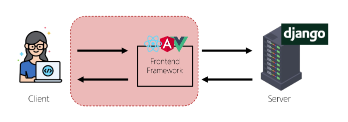


### Client-side framework
클라이언트 측에서 UI와 상호작용을 개발하기 위해 사용되는 JavaScript 기반 프레임워크


- Client-side frameworks가 필요한 이유 : **웹에서 하는 일이 많아짐**
  1. 단순히 무언가를 읽는 곳 -> 무언가를 하는 곳
      - 사용자는 웹에서 문서를 읽는 것이 아닌 음악 스트리밍, 영화 시청, 영상 채팅을 통해 즉시 통신하고 있음
      - 이처럼 현대적이고 복잡한 대화형 웹 사이트를 **웹 애플리케이션(web applications)**이라 부름
      - JavaScript 기반의 Client-side frameworks가 등장하면서 매우 **동적인 대화형 애플리케이션**을 훨씬 더 쉽게 구축할 수 있게 됨

  2. 다루는 데이터가 많아짐
      - ex. 인스타에서 친구가 이름을 변경했다면?
        - 친구 목록, 스토리 등 친구 이름이 출력되는 모든 곳이 함께 변경되어야 함
      - 애플리케이션의 기본 데이터를 안정적으로 추적하고 업데이트(랜더링, 추가, 삭제 등)하는 도구가 필요함
      - **애플리케이션의 상태를 변경할 때마다 일치하도록 UI를 업데이트해야 함**
      - Vanilla JS만으로는 쉽지 않음

        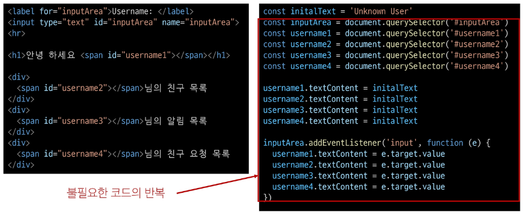
        - 직접적으로 DOM조작 활용해서 특정 요소를 메서드 직접 지정할 필요가 있고, 지정한 모든 요소에 대해 데이터를 일일이 수정하는 과정도 생김


### SPA (Single Page Application)
단일 페이지로 구성된 애플리케이션으로, 하나의 HTML 파일로 시작하여 사용자가 상호작용할 때마다 페이지 전체를 새로 로드하지 않고 화면의 필요한 부분만 동적으로 갱신함

- 대부분 JavaSctipt 프레임워크를 사용하여 클라이언트 측에서 UI와 랜더링을 관리
- CSR 방식 사용

### Client-side Rendering
클라이언트에서 화면을 렌더링하는 방식

- CSR 동작 과정

  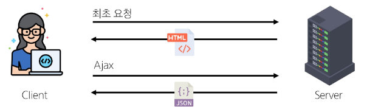
  1. 브라우저는 서버로부터 최소한의 HTML 페이지와 해당 페이지에 필요한 JavaScript 응답 받음
  2. 그 다음 클라이언트 측에서 JavaScript 사용하여 DOM을 업데이터하고 페이지를 렌더링
  3. 이후 서버는 더이상 HTML을 제공하지 않고 요청에 필요한 데이터만 응답
      - Google Maps, Instagram 등의 서비스에서 페이지 갱신 시 새로고침이 없는 이유

※ 클라이언트 사이드 렌더링(CSR) vs 서버 사이드 렌더링(SSR)

- CSR 장점
  - 빠른 페이지 전환
    - 페이지가 처음 로드된 후에는 필요한 데이터만 가져오면 되고, JavaScript는 전체 페이지를 새로 고칠 필요 없이 페이지의 일부를 다시 랜더링할 수 있기 때문
    - 서버로 전송되는 데이터의 양을 최소화(서버 부하 방지)
  - 사용자 경험(UX)
    - 새로고침이 발생하지 않아 네이티브 앱과 유사한 사용자 경험을 제공
  - Frontend와 Backend의 명확한 분리
    - Frontend는 UI 랜더링 및 사용자 상호 작용 처리를 담당 & Backend는 데이터 및 API 제공을 담당
    - 대규모 애플리케이션을 더 쉽게 개발하고 유지 관리 가능
  
- CSR 단점
  - 느린 초기 로드 속도
    - 전체 페이지를 보기 전에 약간의 지연을 느낄 수 있음
    - JavaScript가 다운로드, 구문 분석 및 실행될 때까지 페이지가 완전히 랜더링되지 않았기 때문
  - **SEO(검색 엔진 최적화)** 문제
    - 페이지를 나중에 그려 나가는 것이기 때문에 검색에 잘 노출되지 않을 수 있음
    - 검색엔진 입장에서 HTML을 읽어서 분석해야 하는데 아직 콘텐츠가 모두 존재하지 않기 때문
  
### SPA vs MPA / CSR vs SSR
- MPA (Multi Page Application)
  - 여러 개의 HTML 파일이 서버로부터 각각 로드
  - 사용자가 다른 페이지로 이동할 때마다 새로운 HTML 파일이 로드됨
- SSR (Server-side Renering)
  - 서버에서 화면을 랜더링하는 방식
  - 모든 데이터가 담긴 HTML을 서버에서 완성 후 클라이언트에게 전달


## Vue
### Vue.js
사용자 인터페이스 구축을 위한 JavaScript 프레임워크

- Vue 체험하기
  ```html
  <div id="app">
    <h1>{{ message }}</h1>
    <button v-on:click="count++">
      Count is: {{ count }}
    </button>
  </div>

  <script src="https://unpkg.com/vue@3/dist/vue.global.js"></script>
  <script>
    const { createApp, ref } = Vue

    const app = createApp({
      setup() {
        const message = ref('Hello vue!')
        const count = ref(0)

        return {
          message,
          count
        }
      }
    })

    app.mount('#app')
  </script>
  ```

  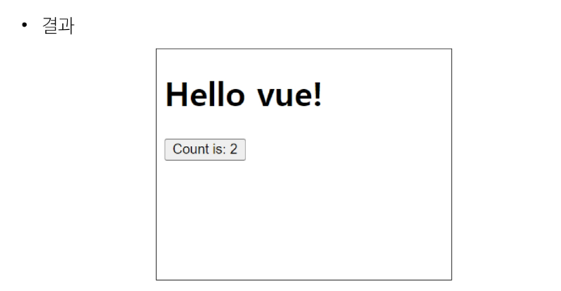

- Vue의 2가지 핵심 기능
  1. 선언적 렌더링(Declarative Rendering)
      - 표준 HTML을 확장하는 "템플릿 구문"을 사용하여 JavaScript 상태(데이터)를 기반으로 화면에 출력될 HTML을 **선언적**으로 작성
  2. **반응성(Reactivity)**
      - JavaScript 상태(데이터) 변경을 추적하고, 변경사항이 발생하면 자동으로 DOM을 업데이트


### Vue Style Guide
Vue의 스타일 가이드 규칙은 우선순위에 따라 4가지 범주로 나눔

- 규칙 범주
  - 우선순위 A: 필수(Essential)
    - 오류를 방지하는 데 도움이 되므로 어떤 경우에도 규칙을 학습하고 준수
  - 우선순위 B: 적극 권장(Strongly Recommended)
    - 가독성 또는 개발자 경험을 향상시킴
    - 규칙을 어겨도 코드는 실행되겠지만, 정당한 사유가 있어야 규칙을 위반할 수 있음
  - 우선순위 C: 권장(Recommended)
    - 일관성을 보장하도록 임의의 선택을 할 수 있음
  - 우선순위 D: 주의 필요(Use with Caution)
    - 잠재적 위험 특성을 고려함

## Vue tutorial
- Vue 사용 방법
  1. `CDN` 방식
      - Vue는 프로젝트가 아니어도 진행할 수 있으며, 한 장의 HTML만으로도 구성할 수 있음
      - 그러기 위해 HTML 안에 Vue 객체를 사용해야 하기 때문에 CDN 방식으로 뷰 개발자들이 만들어놓은 JS파일을 가지고 와서 사용하는 방법! 사용
  2. `NPM` 설치 방식
      - 직접 뷰 설치, 프로젝트 만드는 방식

- Vue Application 생성하기
  ```html
  <!-- html 화면 구성을 위한 기본 틀 -->
  <!DOCTYPE html>
  <html lang="en">

  <head>    <!-- html 문서를 위한 정보 -->
    <meta charset="UTF-8">
    <meta name="viewport" content="width=device-width, initial-scale=1.0">
    <title>Document</title>
  </head>
  <!-- 위에 애들은 내 서비스를 위해 수정이 필요하면 그때 수정하기(뷰를 위해 건드릴 필요XX) -->

  <body>
    <!-- div영역에 화면 선언(템플릿 영역) -->
    <div id="app">
      <!-- 영역 내에 내가 가진 변수(message)를 활용해 화면에 렌더링 -->
          <!-- (setup을 통해 객체가 가지게 될 속성인 message라는 변수를 쓸 수 있게 만들어 줌) -->
      <h1>{{ message }}</h1>
      <h1>{{ message.split('').reverse().join('') }}</h1>
    </div>

    <!-- body 영역에서 가장 먼저 처리해야할 부분: CDN 가져오는 부분(스크립트 영역) -->
    <script src="https://unpkg.com/vue@3/dist/vue.global.js"></script>
    <script>
      const { createApp, ref } = Vue
      // Vue가 가진 createApp 메서드를 가져와서 더 쉽게 사용하기 위해 할당해둔 상태
      // JS는 객체의 구조를 분해해서 할당 가능
      // 할당하고자 하는 변수명과 객체의 메소드 이름이 동일하다면 다른 객체에게 다시 할당하는 느낌으로 작성해준거
      // 한줄로 작성해놓은 이 방법이 '구조분해할당' 문법
      
      // createApp 내부에는 객체를 하나 전달할 것임
      // 즉, 인자로 객체를 하나 전달한다는 것

      // setup 메서드를 아래와 같이 정의 가능
      // const obj = {
      //   setup: function () {

      //   }
      // }
      // createApp(obj)

      // setup 메서드를 다른 객체를 만들어서 일일이 전달하는 방식이 아니라
      // 직접적으로 객체 만들어서 전달하는 방식으로 작성
      // setup 메서드는 객체 내부에 메서드 정의 시 function 키워드 생략 가능
      const app = createApp({
        setup() {
          const message = ref('Hello vue!')
          console.log(message.value)
          return {
            message   // setup 메서드 역할: 객체 하나를 반환하는 형태
          }
        }
      })

      // createApp을 통해 만들어진 인스턴스(app)가 mount라는 행위를 진행하면
      // 객체가 가진 상태(ref)에 들어있는 값을 활용해(message) 화면을 선언함
      app.mount('#app')   // app 이라는 객체가 템플릿 영역(body 내부의 사용자에게 보여질 DOM 영역)에 
                          // 올라타려면(mount)
                            // id가 필요하다
                            // DOM 내부의 많은 요소 중 정확히 id가 app인 div에 올라탈 것이다! 
                              // 를 알려야 하므로 선택자 # 사용
    </script>
  </body>

  </html>
  ```
  - CDN 작성

    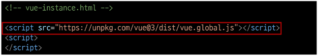
    - `"https://unpkg.com/vue@3/dist/vue.global.js"` 주소로 들어가보자
    - Vue 객체가 어떻게 만들어 져있는지 확인 가능
    - Vue 라는 어떤 객체가 정의되어 있고, function 형식으로 만들어서 이 객체가 가진 메서드를 가지고 와서 쓸 수 있겠구나 생각할 수 있음

      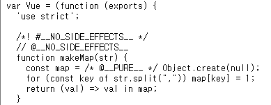

  - Application instance
    - CDN에서 Vue를 사용하는 경우 전역 Vue 객체를 불러오게 됨
    - 구조분해할당 문법으로 Vue 객체의 `createApp` 함수를 할당
    
      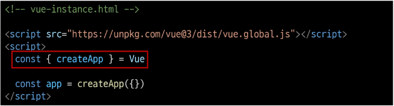
    - 모든 Vue 애플리케이션은 createApp 함수로 새 Application instance를 생성하는 것으로 시작함
      
      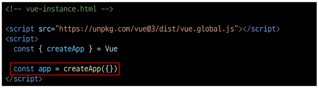
  
  - Root Component
    - createApp 함수에는 객체(컴포넌트)가 전달됨
    - 모든 App에는 다른 컴포넌트들을 하위 컴포넌트로 포함할 수 있는 Root(최상위) 컴포넌트가 필요(현재는 단일 컴포넌트)
      
      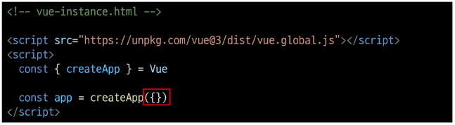
  
  - Mounting the App (앱 연결)
    - HTML 요소에 Vue Application instance를 탑재(연결)
    - 각 앱 인스턴스에 대해 `mount()`는 한 번만 호출할 수 있음
    
      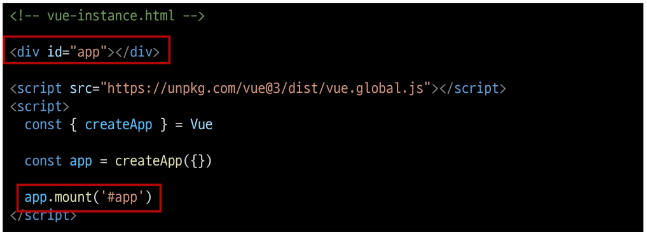

  - setup 함수
    - 컴포넌트가 동작하기 전에 미리 준비하는 "시작점", "초기 설정용 함수"
    - 이 함수 안에서 데이터를 정의하거나, 화면에 표시할 값을 계산하거나, 각종 로직(함수)을 준비할 수 있음
    - setup에서 준비한 값들은 이후 템플릿이나 컴포넌트의 다른 부분에서 바로 사용 가능

      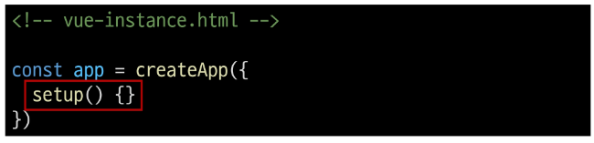

- ref 함수
  - 반응형 상태(데이터)를 선언하는 함수(Declaring Reactive State)
  - `.value` 속성이 있는 ref 객체로 래핑(wrapping)하여 반환하는 함수
  - ref로 선언된 변수의 값이 변경되면, 해당 값을 사용하는 템플릿에서 자동으로 업데이트
  - 인자는 어떠한 타입도 가능

    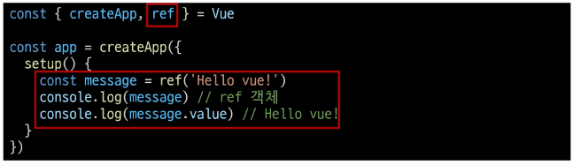
  - 템플릿의 참조에 접근하려면 setup 함수에서 선언 및 반환 필요
  - 편의상 템플릿에서 ref 사용할 때는 .value 작성할 필요XX (automatically unwrapped)

    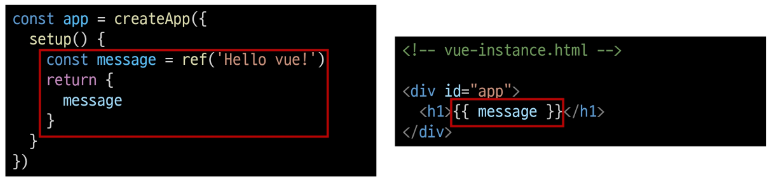

※ `ref()` : 반응형 상태를 선언하는 함수 -> 반응형을 가지는 참조 변수를 만드는 것 (ref === reactive reference)

**※ ref 사용하는 이유**

-> 데이터를 const (상수로 정의한 변수)에 할당하면 재할당이 불가능함!

-> ex. 사용자가 클릭했을 때 count값이 1 증가하는 것이 가능하게 된 것은 ref때문

-> 우리는 사용자가 이벤트를 발생시켰을 때 const로 정의했던 값들을 바꿀 수 있어야 함

-> `const numbers = [1, 2, 3]`은 값 변경 불가능

-> `const numbers`이고 numbers가 `[1, 2, 3]`을 참조하고 있다면? `[1, 2, 3]`은 값 변경 가능

-> 재할당 하고싶다고 `let`으로 선언하면 XX. 분명 같은 이름의 변수에 다른 데이터 타입 할당해서 데이터 흐름 깨지는 경우가 발생함

-> 그래서 const로 선언하되 객체 형태로 할당!

-> ref라는 반응형 상태 선언 함수로 객체 형태로 할당했고, 그 안의 value라는 곳에 실제 값을 넣었다면

-> 객체 내의 value라는 key 값에 할당된 값 `{value: 값}`은 사용자의 행위에 의해 변경 가능해짐 


### Vue 기본 구조
- `createApp()`에 전달되는 객체는 Vue 컴포넌트
- 컴포넌트의 상태는 `setup()` 함수 내에서 선언되어야 하며 **객체를 반환해야 함**

  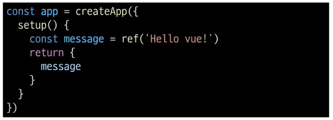

- 템플릿 렌더링
  - 반환된 객체의 속성은 템플릿에서 사용할 수 있음
  - Mustache syntax (콧수염 구문)을 사용하여 메시지 값을 기반으로 동적 텍스트를 렌더링

    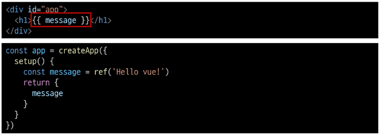
  - 콘텐츠는 식별자나 경로에만 국한되지 않으며 유효한 JavaScript 표현식을 사용할 수 있음

    

- Event Listeners in Vue
  - `v-on` directive를 사용하여 DOM 이벤트를 수신할 수 있음
  - 함수 내에서 반응형 변수를 변경하여 구성 요소 상태를 업데이트

    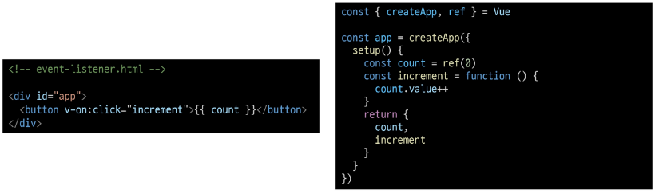
    - 인스턴스 내에 increment 메서드 정의해서 사용자가 버튼 클릭했을 때 호출될 수 있도록 작성


### 참고
- ref 객체가 필요한 이유
  - Vue는 템플릿에서 ref를 사용하고 나중에 ref 값을 변경하면 자동으로 변경 사항을 감지하고 그에 따라 DOM을 업데이트 함
    - 의존성 추적 기반의 반응형 시스템
  - Vue는 렌더링 중에 사용된 모든 ref를 추적하며, 나중에 ref가 변경되면 이를 추적하는 구성 요소에 대해 다시 렌더링
  - 이를 위해서 참조 자료형의 객체 타입으로 구현한 것
    - JavaScript에서는 일반 변수의 접근 또는 변형을 감지할 방법이 없기 때문에 일반적인 변수가 아닌 객체 데이터 타입으로 사용!

- Ref Unwrap 주의사항
  - 템플릿에서의 unwrap은 ref가 최상위 속성인 경우에만 적용가능

    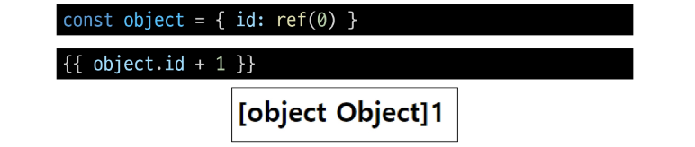
    - object는 최상위 속성이지만 `object.id`는 그렇지 않음
    - 표현식을 평가할 때 `object.id`가 unwrap 되지 않고 ref 객체로 남아있기 때문
    - 이 문제를 해결하기 위해서는 **id를 최상위 속성으로 분해**해야 함

      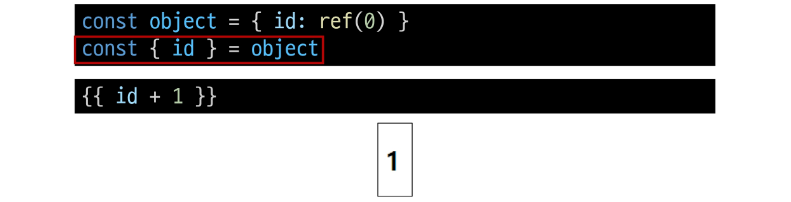

  - 단, ref가 `{{ }}`의 최종 평가 값인 경우는 unwrap 가능

    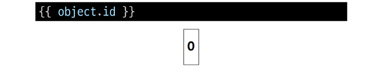
    - `{{ object.id.value }}` 와 동일
  
- 반응형 변수 vs 일반 변수
  
  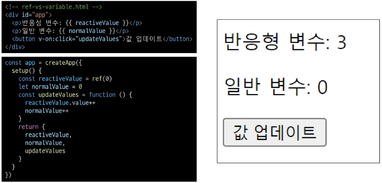


## Single-File Components
### Component
재사용 가능한 코드 블록

- Component 특징
  - UI를 독립적이고 재사용 가능한 일부분으로 분할하고 각 부분을 개별적으로 다룰 수 있음
  - 자연스럽게 애플리케이션은 중첩된 Component의 트리 형태로 구성됨

    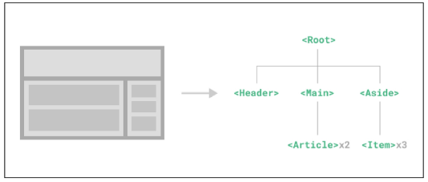

- Component 예시
  - 웹 서비스는 여러 개의 Component로 이루어져 있음

    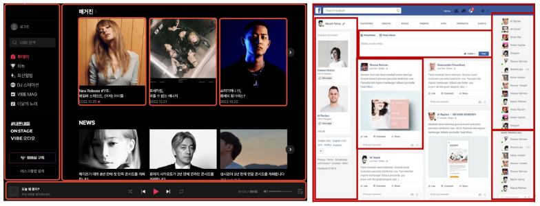

### Single-File Components (SFC)
컴포넌트의 템플릿, 로직 및 스타일을 하나의 파일로 묶어낸 특수한 파일 형식 ( `*.vue` 파일)

- SFC 파일 예시
  - Vue SFC는 HTML, CSS 및 JavaScript를 단일 파일로 합친 것
  - `<template>`, `<script>`, `<style>` 블록은 하나의 파일에서 컴포넌트의 뷰, 로직 및 스타일을 독립적으로 배치

    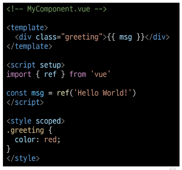
    - 요 이미지 전체가 vue 객체 하나임!

- SFC 문법
  - 각 `*.vue` 파일은 세 가지 유형의 최상위 언어 블록 `<template>`, `<script>`, `<style>`으로 구성됨
  - 언어 블록의 작성 순서는 상관없으나, 일반적으로 template -> script -> style 순서로 작성

  - 언어블록 - `<template>`
    -  각 `*.vue` 파일은 최상위 `<template>` 블록을 하나만 포함할 수 있음
      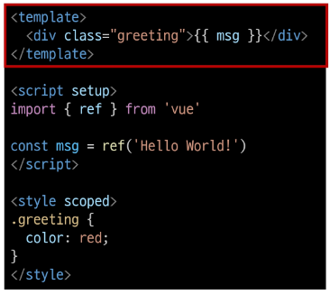

  - 언어블록 - `<script>`
    -  각 `*.vue` 파일은 최상위 `<script setup>` 블록을 하나만 포함할 수 있음(일반 `<script>` 제외)
    - 컴포넌트의 setip() 함수로 사용되며 컴포넌트의 각 인스턴스에 대해 실행
    - 변수 및 함수는 동일한 컴포넌트의 템플릿에서 자동으로 사용 가능

      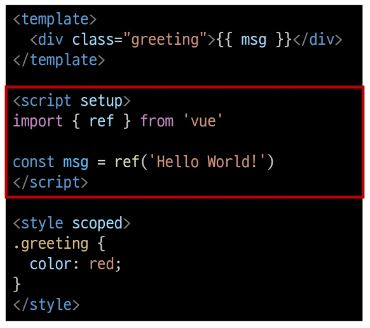

  - 언어블록 - `<style>`
    - `*.vue` 파일에는 여러 `<style>` 태그가 포함될 수 있음
    - scoped가 지정되면 CSS는 현재 컴포넌트에만 적용됨

      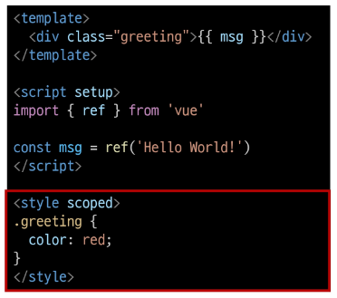

- 컴포넌트 사용하기
  - Vue SFC는 일반적인 방법으로 실행할 수 없으며, 컴파일러를 통해 컴파일된 후 빌드 되어야 함
  - 실제 프로젝트에서는 Vite와 같은 공식 빌드(Build) 도구를 사용

    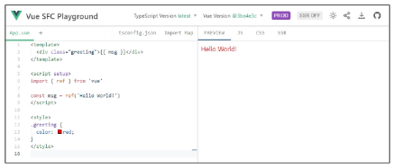
  

## Node.js
Chrome의 V8 JavaScript 엔진을 기반으로 하는 Server-Side 실행 환경

  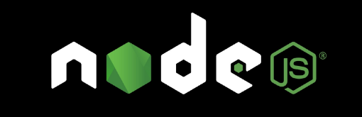

- Node.js의 영향
  - 기존 브라우저 안에서만 동작할 수 있었던 JavaScript를 브라우저가 아닌 서버 측에서도 실행할 수 있게 함
    - 프론트엔드와 백엔드에서 동일한 언어로 개발할 수 있게 됨
  - NPM을 활용해 수많은 오픈 소스 패키지와 라이브러리를 제공하여 개발자들이 손쉽에 코드를 공유하고 재사용할 수 있게 함

- Node Package Manager (NPM)
  - Node.js의 기본 패키지 관리자

### 모듈과 번들러
- Module
  - 프로그램을 구성하는 독립적인 코드 블록( `*.js` 파일)

- Module의 필요성
  - 개발하는 애플리케이션의 크기가 커지고 복잡해지면서 파일 하나에 모든 기능을 담기가 어려워 짐
  - 따라서 자연스럽게 파일을 여러 개로 분리하여 관리를 하게 되었고, 이때 분리된 각 파일이 바로 모듈(module)
    - `*.js` 파일 하나가 하나의 모듈

- Module의 한계
  - 하지만 애플리케이션이 점점 더 발전함에 따라 처리해야 하는 JavaScript 모듈의 개수도 극적으로 증가
  - 성능 병목 현상이 발생하고 모듈 간 의존성(연결성)이 깊어지면서 특정한 곳에서 발생한 문제가 어떤 모듈 간의 문제인지 파악하기 어려워 짐
  - 복잡하고 깊은 모듈 간 의존성 문제를 해결하기 위한 도구 필요 -> `Bundler`

- Bundler
  - 여러 모듈과 파일을 하나(또는 여러개)의 번들로 묶어 최적화하여 애플리케이션에서 사용할 수 있게 만들어주는 도구

- Bundler 역할
  - 의존성 관리, 코드 최적화, 리소스 관리 등
  - Bundler가 하는 작업을 Bundling이라 함
    - (참고) Vite는 Rollup이라는 Bundler를 사용하며 개발자가 별도로 기타 환경설정에 신경쓰지 않도록 모두 설정해두고 있음


## SFC build tool
### Vite
프론트 엔드 개발 도구


-> 빠른 개발 환경을 위한 빌드 도구와 개발 서버를 제공

- Build
  - 프로젝트의 소스 코드를 최적화하고 번들링하여 배포할 수 있는 형식으로 변환하는 과정
  - 개발 중에 사용되는 여러 소스 파일 및 리소스(JavaScript, CSS, 이미지 등)를 최적화된 형태로 조합하여 최종 소프트웨어 제품을 생성하는 것
    - Vite는 이러한 빌드 프로세스를 수행하는 데 사용되는 도구
  
- Vite 사용해서 Vue 프로젝트 생성하기
  - `02-single-file-component`에서 vscode 실행
  - 터미널 켜기
  - `npm create vue@latest` 
    - npm에게 뷰 최신버전 프로젝트 만들어달라

      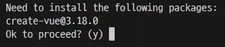
    - 뷰 최신버전 3.18.0인 것 같은데 이 패키지를 설치해야할 것 같아. 설치해줄까? -> `y`

      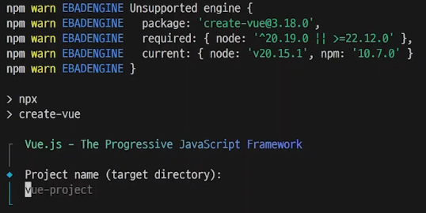
    - 글로벌에 설치되었기 때문에 내 pc 어디에서든 앞으로는 설치과정 없이 실행됨
    - 뷰 이름 뭘로할래? 기본값은 vue-project야 -> 그대로 사용

      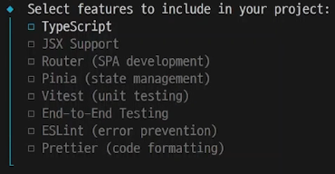
    - 뷰 프로젝트에 추가적인 기능 쓸거야? (자주 쓰는 기능들 모아놓음) -> 지금은 필요없음

      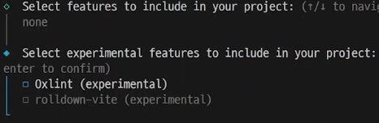
    - 또또 기능 쓸건지 물어봄 -> 필요없음

      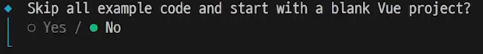
    - 예시 필요없어? -> 필요함(NO)

      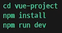
    - vue 프로젝트 생성 완! 뭐 해야하는지 친절히 알려주니 그대로 실행하자
  - `cd vue-project/`
  - `npm install`
  - `npm run dev`

    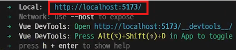
    - 주소와 함께 프로젝트 서버 실행됨
    - 링크 들어가면 뷰 프로젝트 완성되어 있는거 확인 가능

      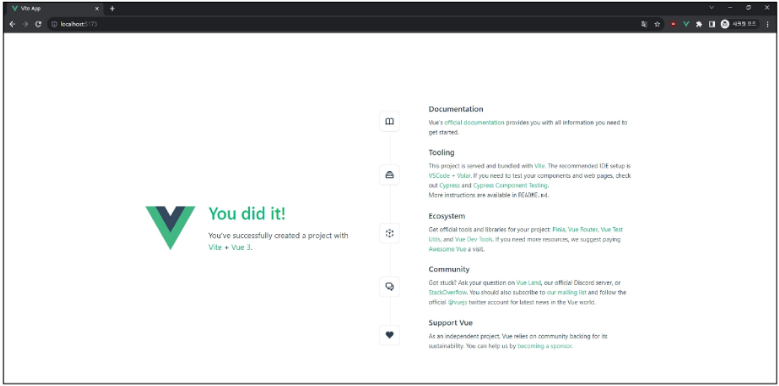

## Vue 프로젝트 구조
- vue-project 구조 확인

  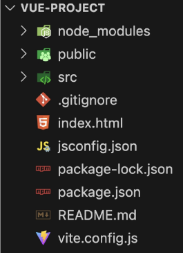
  - `node_modules`
    - Node.js 프로젝트에서 사용되는 외부 패키지들이 저장되는 디렉토리
    - 프로젝트의 의존성 모듈을 저장하고 관리하는 공간
    - .gitignore에 작성됨

  - `package.json`
    - 패키지들의 실제 설치 버전, 의존성 관계, 하위 패키지 등을 포함하여 패키지 설치에 필요한 모든 정보를 포함
    - npm install하면 package.json에 있는, 즉 의존하고 있는 목록들을 `node_modules` 폴더에 알아서 설치해줌
    - 때문에 가상환경 만들 필요XX
  - 그렇다면 `node_modules`는 깃허브에 push할 필요XX
    - 내가 추가적인 의존 패키지를 설치하면 package.json이라는 영역에 기록만 하면 되니까!
    - node_modules에 들어있는 각종 JavaScript 코드들을 깃으로 관리할 필요가 없음
    - `.gitignore` 만들어주자
      ```python
      # Logs
      logs
      *.log
      npm-debug.log*
      yarn-debug.log*
      yarn-error.log*
      pnpm-debug.log*
      lerna-debug.log*

      node_modules
      .DS_Store
      dist
      dist-ssr
      coverage
      *.local

      /cypress/videos/
      /cypress/screenshots/

      # Editor directories and files
      .vscode/*
      !.vscode/extensions.json
      .idea
      *.suo
      *.ntvs*
      *.njsproj
      *.sln
      *.sw?

      *.tsbuildinfo
      ```
  
  - public 디렉토리
    - 소스코드에서 참조되지 않는
    - 항상 같은 이름을 갖는
    - import 할 필요 없는
    - 정적 파일을 위치 시킴!
    - 항상 root 절대 경로를 사용하여 참조
      - `public/icon.png`는 소스 코드에서 `/icon.png`로 참조할 수 있음

  - src 디렉토리
    
    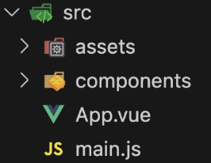
    - 프로젝트의 주요 소스 코드를 포함하는 곳
    - 컴포넌트, 스타일, 라우팅 등 프로젝트의 핵심 코드를 관리
  
  - `src/assets`

    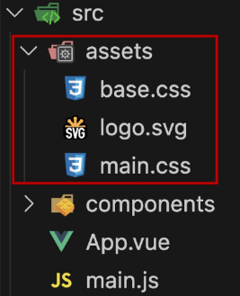
    - 프로젝트 내에서 사용되는 자원(이미지, 폰트, 스타일 시트 등)을 관리
    - 컴포넌트 자체에서 참조하는 내부 파일을 저장하는데 사용
    - 컴포넌트가 아닌 곳에서는 public 디렉토리에 위치한 파일을 사용
  
  - `src/components`

    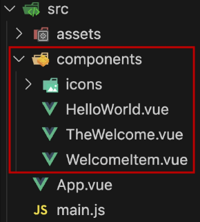
    - Vue 컴포넌트들을 작성하는 곳
  
  - `src/App.vue`

    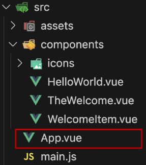
    - Vue 앱의 최상위 Root 컴포넌트
    - 다른 하위 컴포넌트들을 포함
    - 애플리케이션 전체의 레이아웃과 공통적인 요소를 정의
    ```html
    <script setup>
    import HelloWorld from './components/HelloWorld.vue'
    // .vue의 역할
    // vue 인스턴스 만들어서 가지고 있는 component라는 특별한 친구..
    // 그 인스턴스 정보 하나를 꺼내와서 Helloword 변수에 할당해서
    // Helloword을 템플릿 영역에 작성해서 화면에 랜더링
    import TheWelcome from './components/TheWelcome.vue'
    </script>

    <template>
      <header>
        

        <div class="wrapper">
          <!-- components폴더 내의 HelloWorld.vue 파일에 있는 객체 정보를 태그처럼 사용 -->
          <HelloWorld msg="You did it!" />
        </div>
      </header>

      <main>
        <TheWelcome />
      </main>
    </template>

    <style scoped>
    header {
      line-height: 1.5;
    }

    .logo {
      display: block;
      margin: 0 auto 2rem;
    }

    @media (min-width: 1024px) {
      header {
        display: flex;
        place-items: center;
        padding-right: calc(var(--section-gap) / 2);
      }

      .logo {
        margin: 0 2rem 0 0;
      }

      header .wrapper {
        display: flex;
        place-items: flex-start;
        flex-wrap: wrap;
      }
    }
    </style>
    ```
    - HelloWorld.vue 파일의 내용이 logo 밑에 위치하게 됨
    - 크고 다양한 화면이 필요할 때 하나의 HTML에 다 작성하는게 아니라 필요한 영역만 똑 떼서 가져다 쓰는 '모듈화'가 가능하다
  
  - `src/main.js`
    - Vue 인스턴스 생성하고, 애플리케이션을 초기화하는 역할
    - 필요한 라이브러리를 import하고 전역 설정 수행

    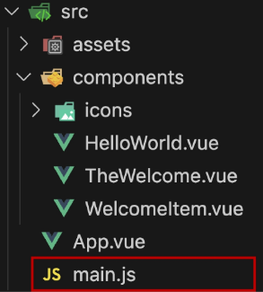
    ```javascript
    import './assets/main.css'

    import { createApp } from 'vue'
    import App from './App.vue'

    createApp(App).mount('#app')
    ```
    - CDN으로 뷰 객체 가져온게 아니라, 모듈 형식으로!
    - creatApp 메서드 사용해서 app 인스턴스 만들건데,
    - setup()로 머 이래저래해서 return했던 객체 하나를 createApp에 넣는 방식이었음
    - 이 정보는 `App.vue`에 있는 것을 가지고 오겠다 -> `import App from './App.vue'`

  - 뷰를 통해 기대하는 것
    - Single-File Component이자 Single Page Application
    - 그래서 `index.html`에 div영역 만들어서 id가 app인 곳에 vue 인스턴스 만들어서 붙이면 그 안의 내용물이 화면에 보이게됨
  
  - `index.html`
    - Vue 앱의 기본 HTML 파일
    - 앱의 진입점(entry point)
    - Root 컴포넌트인 App.vue가 해당 페이지에 마운트(mount) 됨
      - Vue 앱이 SPA인 이유
    - 필요한 스타일 시트, 스크립트 등의 외부 리소스를 로드할 수 있음(ex. bootstrap CDN)
    ```html
    <!DOCTYPE html>
    <html lang="">
      <head>
        <meta charset="UTF-8">
        <link rel="icon" href="/favicon.ico">
        <meta name="viewport" content="width=device-width, initial-scale=1.0">
        <title>Vite App</title>
      </head>
      <body>
        <div id="app"></div>
        <script type="module" src="/src/main.js"></script>
        <!-- 모듈 형태의, src 폴더에 있는 자바스크립트 파일을 불러와서 화면이 보이게 함 -->
      </body>
    </html>
    ```
    - 이 파일은 수정할 일이 별로 없음
    - title 바꿀때나 head 영역에 웹 서비스 설먕 코드나 적는 정도? 
  
  - 기타 설정 파일

    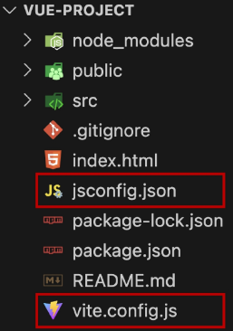
    - `jsconfig.json` : 컴파일 옵션, 모듈 시스템 등 설정
    - `vite.config.js` : Vite 프로젝트 설정 파일(플러그인, 빌드 옵션, 개발 서버 설정 등)


## Vue Component 활용
- 컴포넌트 사용 방법(2단계)
  1. 컴포넌트 파일 생성
  2. 컴포넌트 등록 (import)

- 사전준비
  1. 초기에 생성된 모든 컴포넌트 삭제 (App.vue 제외)
  2. `App.vue` 초기화

  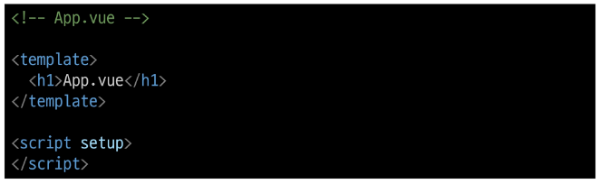

- 컴포넌트 파일 생성
  - `MyComponent.vue` 생성

    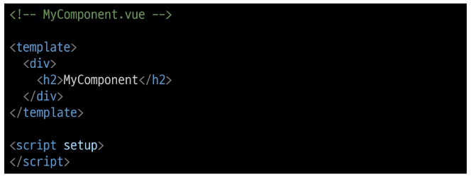

- 컴포넌트 등록
  - App 컴포넌트에 MyComponent를 등록

    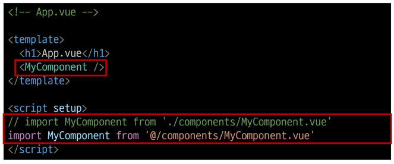
  - App(부모) - MyComponent(자식) 관계 형성
    - `"@" - "src/"` 경로를 뜻하는 약어

- 결과 확인
  - Vue dev tools를 사용해 컴포넌트 관계 형성 확인

    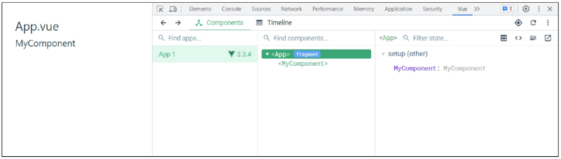

**※ 만약 명령어에 yes 눌러서 다 없애버렸으면 components 폴더도 없을 것임**

-> components 폴더 이름이 중요한 것XX

-> 컴포넌츠 이름의 폴더가 만들어지는 이유는 내가 쓸 컴포넌트들을 모아놓는 영역 구분을 위해 만들어지는 폴더인 것! 이름은 중요하지 않음

-> 폴더 없으면 src 하위에 components 폴더 만들면 되고, 아니면 articles 이름으로 만들어도 됨

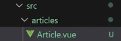

-> 이렇게 vue 파일 만들어놓고!

```html
<!-- Article.vue -->
<template>
  <h1>템플릿 영역 안에 내가 쓰고싶은 태그</h1>
  <p>{{ message }}</p>
  <!-- 이렇게 하면 Article.vue라는 컴포넌트 랜더링할 때 message에 들어있는 값을 그대로 보여줄 수 있게 된다 -->
</template>

<!-- ref로 반응형 데이터 만들어서 그거 가져와서 쓰고싶으면 import -->
<script setup>  // setup 영역만 지정해놓고!
                // 그 밑에 자바스크립트 문법 쓰면 됨
                // 그럼 메시지로 만든거 return 안해도 된다!
import { ref } from 'vue'   // import from 순서주의!!
const message = ref('hello')

</script>
```

-> Article.vue라는 컴포넌트 만들었으니 App.vue에서 보여주고 싶다
```html
<!-- App.vue -->
<script setup> 
import Article from '@/articles/Article.vue'
</script>

<template>
  <!-- Article.vue 불러와서 화면에 보여주기 -->
  <Article />
</template>
```

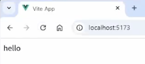

**※ 자동완성**

-> `ctrl + shift + p` -> snippets 입력 -> `Snippets: Configure Snippets` -> vue 입력 -> `vue.json`

-> "vue" 입력하면 자동완성 되도록 작성해주기

```json
"Vue for SSAFY": {
        "prefix": "vue",
        "body": [
            "<template>",
            "  <div>",
            "    $1",
            "  </div>",
            "</template>",
            "",
            "<script setup>",
            "",
            "</script>",
            "",
            "<style scoped>",
            "",
            "</style>",
        ],
        "description": "vue 수업용 vue3 기본 snippet"
    },
```

- 추가 하위 컴포넌트 등록 후 활용
  - MyComponentItem은 MyComponent의 자식 컴포넌트

    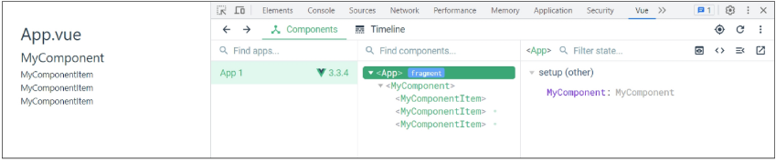
  - 컴포넌트의 재사용성 확인하기

    

### Composition API & Option API
- Vue를 작성하는 2가지 스타일
  - Composition API
    - import해서 가져온 API 함수들을 사용하여 컴포넌트의 로직을 정의
    - Vue3에서의 권장 방식
    - 자바스크립트 문법 쓰듯이 쓰면 됨

    
  - Option API
    - data, methods 및 mounted 같은 객체를 사용하여 컴포넌트의 로직을 정의
    - Vue2에서의 작성방식(Vue3에서도 지원)
    - 뷰 객체가 가진 많은 기능들 중 내가 필요한 것만 덮어쓰기하는 방식

    

- API 별 권장사항
  - Composition API + SFC
    - 규모가 있는 앱의 전체를 구축하려는 경우
  - Option API
    - 빌드 도구를 사용하지 않거나 복잡성이 낮은 프로젝트에서 사용하려는 경우

## 참고
### SEO (Search Engine Optimization)
google, bing과 같은 검색 엔진 등에 내 서비스나 제품 등이 효율적으로 검색 엔진에 노출되도록 개선하는 과정을 일컫는 작업

- 정보의 대상은 주로 HTML에 작성된 내용
- 검색
  - 각 사이트가 운용하는 검색 엔진에 의해 이루어지는 작업
- 검색 엔진
  - 웹 상에 존재하는 가능한 모든 정보들을 긁어 모으는 방식으로 동작
- 최근에는 SPA, 즉 CSR로 구성된 서비스의 비중이 증가
- SPA 서비스도 검색 대상으로 넓히기 위해 JS를 지원하는 방식으로 발전하는 중

### CSR & SSR
- 애플리케이션의 목적, 규모, 성능 및 SEO 요구 사항에 따라 달라질 수 있음
  - 내 서비스에 적합한 렌더링 방식을 적절하게 활용할 수 있어야 함
- SPA 서비스에도 SSR을 지원하는 Framework가 발전하고 있음
  - Vue의 Next.js
  - React의 Next.js

### Single Root Element
- 모든 컴포넌트에는 최상단 HTML 요소가 작성되는 것이 권장
  - 가독성, 스타일링, 명확한 컴포넌트 구조를 위해 각 컴포넌트에는 최상단 HTML 요소를 작성해야 함(Single Root Element)

  

### CSS scoped
- scoped 속성
  - `<style scoped>`를 사용하면 해당 컴포넌트 내부의 스타일이 현재 컴포넌트 내부 요소에게만 적용되도록 범위를 제한하는 기능
  - 즉, 스타일이 컴포넌트 바깥으로 유출되거나, 다른 컴포넌트에서 정의한 스타일이 현재 컴포넌트를 침범하지 않도록 막아줌

    

- scoped를 사용하지 않을 경우
  - `<style>`에 scoped를 붙이지 않으면, 해당 스타일은 전역(모든 컴포넌트)에 영향을 미침
  - 예를들어, 다른 컴포넌트에서도 div 태그를 사용했다면 그 스타일이 함께 적용됨

- 부모-자식 관계에서의 스타일 전파
  - 일반적으로 scoped 스타일은 부모 컴포넌트의 스타일이 자식 컴포넌트에 영향을 미치지 않음
  - 하지만 예외적으로 자식 컴포넌트의 **최상위 요소(root element)**에는 부모 컴포넌트의 scoped 스타일도 영향을 줄 수 있음
  - 이는 부모가 자식 컴포넌트를 레이아옷 할 때(ex. 자식 컴포넌트의 외곽 박스 크기나 마진 조정) 필요한 경우가 있기 때문
  - 즉, 자식 컴포넌트의 가장 바깥쪽을 감싸는 요소에 한해서는 부모의 scoped 스타일 적용이 의도적으로 허용되어 있음
  - 아래와 같이 App(부모) 컴포넌트에 적용한 스타일에 scoped가 작성되어 있지만
    - **MyComponent(자식)의 최상위 요소(div)는 부모와 본인의 CSS 모두의 영향을 받기 때문**에 부모 컴포넌트에 지정한 스타일이 적용됨

      
  - Why?
    - Vue는 부모 컴포넌트가 자식 컴포넌트의 최상위 요소 스타일을 제어할 수 있어야 레이아웃(배치) 목적을 쉽게 달성할 수 있다고 판단했기 때문
    - 이로 인해 자식 컴포넌트의 root element는 부모와 자식 모두의 scoped 스타일이 영향을 미칠 수 있음
  - 최상위 App 컴포넌트에서 레이아웃 스타일을 전역적으로 구성할 수 있지만, 다른 모든 컴포넌트는 범위가 지정된 스타일을 사용하는 것을 권장

### Scaffolding (스캐폴딩)
새로운 프로젝트나 모듈을 시작하기 위해 초기 구조와 기본 코드를 자동으로 생성하는 과정

- 개발자들이 프로젝트 시작하는 데 도움을 주는 틀이나 기반을 제공하는 작업
- 초기 설정, 폴더 구조, 파일 템플릿, 기본 코드 등을 자동으로 생성하여 개발자가 시작할 때 시간과 노력을 절약하고 일관된 구조를 유지할 수 있도록 도와줌

  

### 패키지 관리 주의사항
1. `npm install` 입력 위치
    - 항상 프로젝트 루트 디렉토리(프로젝트 생성한 폴더)에서 실행

2. `node_modules` 폴더 관리 주의
    - 필요할 때마다 npm install을 통해 재생성할 수 있으므로, 직접 수정하거나 Git으로 관리할 필요XX

3. `package.json`과 `package-lock.json` 직접 편집 자제
    - npm install 패키지명 명령을 통해 자동 업데이트하는 것이 안전함

4. 문제가 발생했을 때 재설치 고려
    - 패키지 버전 충돌이나 이상 동작이 의심될 때는 `node_modules` 폴더를 삭제한 뒤 다시 npm install을 실행
