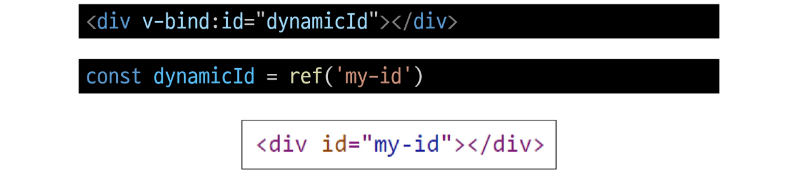
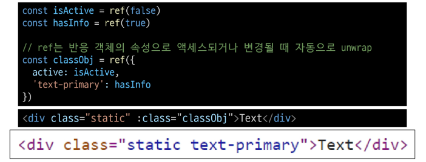
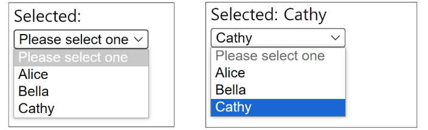
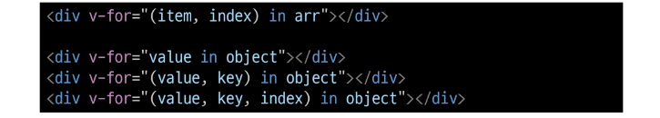
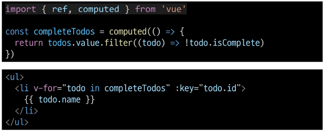

# Basic Syntax
## Template Syntax
DOM을 기본 구성 요소 인스턴스의 데이터에 **선언적으로 바인딩(Vue Instance와 DOM을 연결)**할 수 있는 HTML 기반 **템플릿 구문(확장된 문법 제공)**을 사용

- Template Syntax 종류
  1. Text Interpolation

      
      - 데이터 바인딩의 가장 기본적인 형태
      - 이중 중괄호 구문(콧수염 구문)을 사용
      - 콧수염 구문은 해당 구성 요소 인스턴스의 msg 속성 값으로 대체
      - msg 속성이 변경될 때마다 업데이트 됨
  2. Raw HTML

      
      - 콧수염 구문은 데이터를 일반 텍스트로 해석하기 때문에 실제 HTML을 출력하려면 `v-html`을 사용해야 함
  3. Attribute Bindings

      
      - 콧수염 구문은 HTML 속성 내에서 사용할 수 없기 때문에 `v-bind`를 사용
      - HTML의 **id** 속성 값을 vue의 **dynamicId** 속성과 동기화 되도록 함
      - 바인딩 값이나 **null**이나 **undefind**인 경우 렌더링 요소에서 제거됨
  4. JavaScript Expressions

      
      - Vue는 모든 데이터 바인딩 내에서 JavaScript 표현식의 모든 기능을 지원함
      - Vue 템플릿에서 JavaScript 표현식을 사용할 수 있는 위치: ① 콧수염 구문 내부, ② 모든 directive의 속성값(`v-`로 시작하는 특수 속성)

- Expressions 주의사항
  - 각 바인딩에는 하나의 단일 표현식만 포함될 수 있음
    - 표현식은 값으로 평가할 수 있는 코드 조각
    - 즉, return 뒤에 사용할 수 있는 코드여야 함
  
  - 작동하지 않는 경우

    
  

### Directive
`v-` 접두사가 있는 특수 속성

- Directive 특징
  - Directive의 속성 값은 단일 JavaScript 표현식이어야 함(`v-for`, `v-on` 제외)
  - 표현식 값이 변경될 때 DOM에 반응적으로 업데이트를 적용
  - 예시
    ```html
    <p v-if="seen">Hi There</p>
    ```

- Directive 전체 구문

  

- Directive - "Arguments"
  - 일부 directive는 directive 뒤에 콜론으로 표시되는 인자를 사용할 수 있음
  - 예시
    - 아래 href는 HTML `<a>` 요소의 href 속성값을 myUrl 값에 바인딩하도록 하는 v-bind의 인자
      ```html
      <a v-bind:href ="myUrl">Link</a>
      ```
    - 아래 click은 이벤트 수신할 이벤트 이름 작성하는 v-on 인자
      ```html
      <button v-on:click="doSomething">Button</button>
      ```

- Directive - "Modifiers"
  - `.` (dot)으로 표시되는 특수 접미사로, directive가 특별한 방식으로 바인딩되어야 함
  - 아래 `.prevent`는 발생한 이벤트에서 `event.preventDefault()`를 호출하도록 v-on에 지시하는 modifier
    ```html
    <from @submit.prevent="onSubmit">...</from>
    ```

- Built-in Directives
  - `v-text`
  - `v-show`
  - `v-if`
  - `v-for`  

## Dynamically data binding
### v-bind
하나 이상의 속성 또는 컴포넌트 데이터를 표현식에 동적으로 바인딩

- v-bind 사용처
  1. Attribute Bindings
  2. Class and Style Bindings

- Attribute Bindings
  - HTML의 속성 값을 Vue의 상태 속성값과 동기화 되도록 함

    
  - v-bind shorthand(약어)
    - `:` (콜론)

      
  - Dynamic attribute name(동적 인자 이름)
    - 대괄호로 감싸서 directive argument에 JavaScript 표현식을 사용할 수도 있음
    - JavaScript 표현식에 따라 동적으로 평가된 값이 최종 argument 값으로 사용됨

      

  - Attribute Bindings 예시
    
    
    

### Class and Style Bindings
class와 style은 모두 HTML 속성이므로 다른 속성과 마찬가지로 v-bind를 사용하여 동적으로 문자열 값을 할당할 수 있음

-> Vue는 class 및 style 속성 값을 v-bind로 사용할 때 **객체** 또는 **배열**을 활용하여 작성할 수 있도록 함

-> 단순히 문자열 연결을 사용하여 이러한 값을 생성하는 것은 번거롭고 오류가 발생하기 쉽기 때문

- Class and Style Bindings가 가능한 경우
  1. Binding HTML Classes
      - Binding to Objects
      - Binding to Arrays
  2. Binding Inline Styles
      - Binding to Objects
      - Binding to Arrays
  
- Binding HTML Classes - Binding to Objects
  - 객체를 `:class`에 전달하여 클래스를 동적으로 전환할 수 있음
    - 예시: isActive의 Boolean값에 의해 active 클래스의 존재가 결정됨

      
  - 객체에 더 많은 필드를 포함하여 여러 클래스를 전환할 수 있음
    - 예시: `:class` directive를 일반 클래스 속성과 함께 사용 가능

      
  - inline 방식이 아닌 반응형 변수를 활용해 객체를 한번에 작성하는 방법
    - 예시

      

- Binding HTML Classes - Binding to Arrays
  - `:class`를 배열에 바인딩하여 클래스 목록을 적용할 수 있음
    - 예시

      
  - 배열 구문 내에서 객체 구문을 사용하는 경우
    - 예시

      

- Binding Inline Styles - Binding to Objects
  - `:style`은 javaScript 객체 값에 대한 바인딩을 지원(HTML style 속성)
    - 예시

      
  - 실제 CSS에서 사용하는 것처럼 `:style`은 kebab-cased 키 문자열도 지원(단, cameCase 작성을 권장)
    - 예시

      
  - inline 방식이 아닌 반응형 변수를 활용해 객체를 한번에 작성하는 방법

    

- Binding Inline Styles - Binding to Arrays
  - 여러 스타일 객체를 배열에 작성해서 `:style`을 바인딩할 수 있음
  - 작성한 객체는 병합되어 동일한 요소에 적용
    - 예시

      


## Event Handlig
### v-on
DOM 요소에 이벤트 리스너를 연결 및 수신

- v-on 구성

  

- handler 종류
  ```
  v-on:event="handler"
  ```
  1. Inline handlers : 이벤트가 트리거될 때 실행될 JavaScript 코드
  2. Method handlers : 컴포넌트에 정의된 메서드 이름

- **v-on** shorthand(약어)
  - `@`

    ```
    @event="handler"
    ```

- Inline handlers
  - 주로 간단한 상황에 사용

    

- Method handlers
  - Inline Handlers로는 불가능한 대부분의 상황에서 사용

    
  - **Method handlers**는 이를 트리거하는 기본 DOM **Event 객체를 자동으로 수신**함

    

- 사용자 지정 인자 전달
  - 기본 이벤트 대신 사용자 지정 인자를 전달할 수도 있음

    

- Inline Handlers에서의 event 인자 접근
  - Inline Handlers에서 원래 DOM 이벤트에 접근하기 위해 `$event` 변수를 사용하여 메서드에 전달함

    
  - `$event` 변수를 전달하는 위치는 상관XX

    

### Modifiers
- Event Modifiers
  - Vue는 v-on에 대한 Event Modifiers를 제공해 `event.preventDefault()`와 같은 구문을 메서드에 작성하지 않도록 함
  - `stop`, `prevent`, `self` 등 다양한 modifiers를 제공
    - 메서드는 DOM 이벤트에 대한 처리보다는 데이터에 관한 논리를 작성하는 것에 집중할 것

    

- Key Modifiers
  - Vue는 키보드 이벤트를 수신할 때 특정 키에 관한 별도 modifiers를 사용할 수 있음
    - 예시: Key가 Enter일 때만 onSubmit 이벤트 호출하기
      ```html
      <input @keyup.enter="onSubmit">
      ```


## Form Input Bindings 
### Form Input Bindings (폼 입력 바인딩)
form을 처리할 때 사용자가 input에 입력하는 값을 실시간으로 JavaScript 상태에 동기화해야 하는 경우(**양방향 바인딩**)

- 양방향 바인딩 방법
  1. `v-bind`와 `v-on`을 함께 사용
  2. `v-model` 사용

### v-bind with v-on
1. `v-bind`를 사용하여 input요소의 value 속성 값을 입력 값으로 사용
2. `v-on`을 사용하여 input이벤트가 발생할 때마다 input요소의 value값을 별도 반응형 변수에 저장하는 핸들러를 호출

    
    

### v-model
form input 요소 또는 컴포넌트에서 양방향 바인딩을 만듦

- 사용자 입력 데이터와 반응형 변수를 실시간 동기화

  
  - IME가 필요한 언어(한국어, 중국어, 일본어 등)의 경우 v-model이 제대로 업데이트되지 않음
  - 해당 언어에 대해 올바르게 응답하려면 v-bind와 v-on 방법을 사용해야 함

- v-model과 다양한 입력(input) 양식
  - v-model은 단순 text input뿐만 아니라 `Checkbox`, `Radio`, `Select` 등 다양한 타입의 사용자 입력 방식과 함께 사용 가능
  - Checkbox 활용
    1. 단일 체크박스와 boolean 값 활용

        
    2. 여러 체크박스와 배열 활용
        - 해당 배열에는 현재 선택된 체크박스의 값이 포함됨

        
        
  - Select 활용
    - select에서  v-model 표현식의 초기 값이 어떤 option과도 일치하지 않는 경우 select 요소는 "선택되지 않은(unselected)" 상태로 렌더링 됨

      
      

### 참고
- `$` 접두어가 붙은 변수
  - Vue 인스턴스 내에서 제공되는 내부 변수
  - 사용자가 지정한 반응형 변수나 메서드와 구분하기 위함
  - 주로 Vue 인스턴스 내부 상태를 다룰 때 사용

- IME (Input Method Editor)
  - 사용자가 입력 장치에서 기본적으로 사용할 수 없는 문자(비영어권 언어)를 입력할 수 있도록 하는 운영 체제 구성 프로그램
  - 일반적으로 키보드 키보다 자모가 더 많은 언어에서 사용해야 함
  - IME가 동작하는 방식과 Vue의 양방향 바인딩(v-model) 동작 방식이 상충하기 때문에 한국어 입력 시 예상대로 동작하지 않았던 것


## conditional Rendering
### v-if
표현식 값의 `true/false`를 기반으로 요소를 조건부로 렌더링

- v-if 예시
  - `v-else` directive를 사용하여 v-if에 대한 else 블록을 나타낼 수 있음

    
    
  - `v-else-if` directive를 사용하여 v-if에 대한 else if 블록을 나타낼 수 있음 
    
    

- 여러 요소에 대한 v-if 적용
  - HTML template 요소에 v-if를 사용하여 하나 이상의 요소에 대해 적용할 수 있음 
    - `v-else` , `v-else-if` 모두 적용 가능

    

- HTML `<temlplate>` element
  - 페이지가 로드될 때 렌더링 되지 않지만 JavaScript를 사용하여 나중에 문서에서 사용할 수 있도록 하는 HTML을 보유하기 위한 메커니즘
    - 보이지 않는 wrapper 역할

### v-show
표현식 값의 `true/false`를 기반으로 요소의 가시성(visibility)을 전환

- v-show 예시
  - `v-show` 요소는 항상 DOM에 렌더링 되어있음
  - CSS display 속성만 전환하기 때문

    

※ v-if와 v-show의 적절한 사용처
- v-if (cheap initial load, expensive toggle)
  - 초기 조건이 false인 경우 아무 작업도 수행하지 않음
    - 렌더링을 아예 하지XX
    - v-if가 적힌 div태그 안쪽의 많은 노드들 자체를 렌더링하지XX
  - 토글 비용이 높음
    - 토글: 렌더링 했다 안했다 반복하는거
- v-show (expensive initial load, cheap toggle)
  - 초기 조건에 관계 없이 항상 렌더링
  - 초기 렌더링 비용이 더 높음

-> 콘텐츠를 매우 자주 전환해야 하는 경우에는 v-show를, 실행 중에 조건이 변경되지 않는 경우에는 v-if를 권장


## List Rendering
### v-for
소스 데이터(Array, Object, Number, String, Iterable)를 기반으로 요소 또는 템플릿 블록을 여러번 렌더링

- v-for 구조
  - v-for는 `alias in expression` 형식의 특수 구문을 사용

    
  - 인덱스(객체에서는 key)에 대한 별칭을 지정할 수 있음

    

- v-for 예시
  - 배열 반복

    
  - 객체 반복

    

- 여러 요소에 대한 v-for 적용
  - HTML template 요소에 v-for를 사용하여 하나 이상의 요소에 대해 반복 렌더링 할 수 있음

    

- 중첩된 v-for
  - 각 v-for 범위는 상위 범위에 접근할 수 있음

    

### v-for with key
**"반드시 v-for와 key를 함께 사용한다"**

-> 내부 컴포넌트의 상태를 일관되게 하여 데이터의 예측 가능한 행동을 유지하기 위함

- v-for와 key
  - key는 반드시 각 요소에 대한 **고유한 값을 나타낼 수 있는 식별자**여야 함

    

- 내장 특수 속성 key
  - number 혹은 string으로만 사용해야 함
  - Vue의 내부 가상 DOM 알고리즘이 이전 목록과 새 노드 목록을 비교할 때 각 node를 식별하는 용도로 사용
  - Vue 내부 동작 관련된 부분이기에 최대한 작성하려고 노력할 것

- 올바른 key 선택 기준
  - 권장되는 key 값
    - 데이터베이스의 고유 ID
    - 항목 고유 식별자 (ex. UUID)
  - 피해야 할 key 값
    - 배열 인덱스(index)
    - 객체 자체

### v-for with v-if
**"동일 요소에 v-for와 v-if를 함께 사용하지 않는다"**

-> 동일한 요소에서 v-if가 v-for보다 우선순위가 더 높기 때문

-> v-if에서의 조건은 v-for 범위의 변수에 접근할 수 없음

- v-for와 v-if 문제상황
  - todo 데이터 중 이미 처리한(`isComplate===true`) todo만 출력하기

    
  - v-if가 더 높은 우선순위를 가지므로 v-for 범위의 todo 데이터를 v-if에서 사용할 수 없음

    

- v-for과 v-if 해결법 2가지
  1. computed 활용
    - **computed를 활용해 필터링 된 목록을 반환하여 반복**하도록 설정

      

  2. v-for와 `<template` 요소 활용
    - v-for와 template 요소를 사용하여 **v-if 위치를 이동**

      


## 참고
### 배열과 v-for 관련
- 배열 변경 관련 메서드
  - v-for와 배열을 함께 사용 시 배열의 메서드를 주의해서 사용해야 함
  1. 변화 메서드
      - 호출하는 원본 배열을 변경
      - `push()`, `pop()`, `shift()`, `unshift()`, `splice()`, `sort()`, `reverse()`
  2. 배열 교체
      - 원본 배열을 수정하지 않고 항상 새 배열을 반환
      - `filter()`, `concat()`, `slice()`

- v-for와 배열을 활용해 "필터링/정렬" 활용하기
  - 원본 데이터를 수정하거나 교체하지 않고 필터링하거나 정렬된 새로운 데이터를 표시하는 방법
    1. computed 활용
        - 원본 기반으로 필터링 된 새로운 결과를 생성

          
    2. method 활용 (computed가 불가능한 중첩된 v-for의 경우에 사용)
        - computed가 불가능한 중첩된 v-for에 경우

          

**※ 주의 ※** 배열의 인덱스를 v-for의 key로 사용하지 말 것


-> 인덱스는 식별자가 아닌 배열의 항목 위치만 나타내기 때문

-> 만약 새 요소가 배열의 끝이 아닌 위치 삽입되면 이미 반복된 구성 요소 데이터가 함께 업데이트되지 않기 때문

-> 직접 고유한 값을 만들어내는 메서드를 만들거나 외부 라이브러리 등을 활용하는 등 식별자 역할을 할 수 있는 값을 만들어 사용


## 실습
※ 남이 만들어둔 프로젝트 내려받아서 서버 키는 상황

-> 다른 사람이 생성한 프로젝트를 내려 받는다는 것은

-> 해당 뷰 프로젝트를 진행하기 위해 필요한 각종 모듈들을 모아둔 package.json에 있는 정보를 토대로

-> 의존중인 모듈들, 라이브러리들, 패키지들을 설치할 필요가 있음

- `ls`
  - 내 작업 위치가 `package.json`이 있는 위치인지 확인

- `npm install`
  - 필요한 모듈이 설치되어서 node_modules 에 들어감
  - 동시에 package-lock.json 파일이 생기는데, package.json에 있는 모듈들을 정상 실행하기 위해서 필요한 모듈들에 대한 의존 관계가 적혀있음

- 파일 구조 살펴보기
  - jsconfig.json
    ```javascript
    {
      "compilerOptions": {
        "paths": {
          "@/*": ["./src/*"]
          // '@'의 역할
          // 루트 폴더의 src 폴더 안의 모든 폴더라는 형식으로 경로 지정해둠
          // 
        }
      },
      "exclude": ["node_modules", "dist"]
    }
    ```
  - vite.config.js
    ```javascript
    import { fileURLToPath, URL } from 'node:url'

    import { defineConfig } from 'vite'
    import vue from '@vitejs/plugin-vue'
    import vueDevTools from 'vite-plugin-vue-devtools'

    // https://vite.dev/config/
    export default defineConfig({
      plugins: [
        vue(),  
        // Vite에서 Vue 프레임워크를 사용하도록 하기 위해 vue 플러그인을 등록함
        // 이 플러그인을 통해 Vite가 Vue 파일(.vue)을 인식하고 처리할 수 있게 됨

        vueDevTools(),
        // 개발 단계에서 Vue DevTools를 사용할 수 있도록 해주는 플러그인
        // 브라우저 개발자 도구와 연동되어 
        // 컴포넌트 상태, props, 이벤트 흐름 등을 직관적으로 확인할 수 있음
            // Vue DevTools는 Vue.js 애플리케이션을 브라우저에서 디버깅하고 
            // 분석할 수 있도록 도와주는 개발자 도구
      ],
      resolve: {
        alias: {
          '@': fileURLToPath(new URL('./src', import.meta.url))
        },
      },
    })
    ```
    - 이 프로젝트는 vite를 통해 관리되고 있음
  
  - src/main.js
    ```javascript
    import { createApp } from 'vue'
    import App from './App.vue'

    createApp(App).mount('#app')
    ```
    - index.html에 내가 만든 뷰 인스턴스가 mount될 수 있도록 main.js에 설정되어 있음
  
  - App.vue
    ```html
    <template>
      <div class="wrapper">
        <header class="sidebar">
          <div class="nav" v-for="item in componentsList" :key="item.name">
            <button @click="selected = item.name">{{item.name}}</button>
          </div>
        </header>

        <section class="content">
          <component :is="currentComponent" v-if="currentComponent"></component>
        </section>
      </div>
    </template>

    <script setup>
    import { defineAsyncComponent, ref, computed } from 'vue'

    const componentsList = [
      // 컴포넌트들이 무슨 내용을 가지고 있는지만 확인하기! name: '얘네들~~'
      { directoryName: '01_basic_syntax', name: 'TemplateSyntax' },
      { directoryName: '02_bind', name: 'VBind' },
      { directoryName: '02_bind', name: 'BindingHTMLClasses' },
      { directoryName: '02_bind', name: 'BindingInlineStyles' },
      { directoryName: '03_event', name: 'EventHandling' },
      { directoryName: '03_event', name: 'FormInputBinding' },
      { directoryName: '04_v_model', name: 'VModel' },
      { directoryName: '05_conditional_rendering', name: 'ConditionalRendering' },
      { directoryName: '06_list_rendering', name: 'ListRendering' },
      { directoryName: '06_list_rendering', name: 'RenderingWithKey' },
      { directoryName: '06_list_rendering', name: 'RenderingWithIf' }
    ]

    const selected = ref('TemplateSyntax')

    
    const currentComponent = computed(() => {   
      const selectedComponent = componentsList.find(item => item.name === selected.value)
      if (selectedComponent) {  

        // computed 사용해서 비동기적으로, 컴포넌트들이 필요해졌을 때 랜더링하는 방식
        // 언제? 내가 특정 링크를 클릭해서 그 컴포넌트가 필요해졌을 때!
        return defineAsyncComponent(() => import(`./components/${selectedComponent.directoryName}/${selectedComponent.name}.vue`))
      }
      return null
    })
    </script>

    <style scoped>
    </style>
    ```

- `npm run dev`
  - 화면 구성

    
  
- Template Syntax
  - TemplateSyntax.vue

    
    ```html
    <template>
      <div>
        <!-- template syntax -->
        <p>Message: {{ msg }}</p>
            <!-- msg 변수에 들어있는 값은
              <script setup>에 작성해서
              즉, 뷰 컴포넌트에서 스크립트 옆에 속성으로 지정해줌으로써
              뷰 인스턴스의 내부 구성을 어떻게 할 것인지 나타냄 -->

        <div v-html="rawHtml"></div>
            <!-- html 속성을 작성하는 여기서는 {{}} 표현 방식 불가능함
              중괄호 표현 방식은 어디까지나 '텍스트 컨텐츠'에서만 사용 가능
              <p>{{ rawHtml }}</p> 이렇게 쓰면
              화면에 <span style="color:red">This should be red.</span> 그대로 출력됨 --> 
            <!-- v-html -->
                <!-- html 문법 inline 형식으로 글자를 색 변경해서 보여주고 있음
                  html 문법 자체를 그대로 적용시켜 보여주는 것
                  절!대! 클라이언트(사용자가) 입력한 값을 v-html에 할당하면XXX
                  (악성코드 들어올 수도 있기 때문) -->

        <div v-bind:id="dynamicId"></div>
            <!-- id 넣고싶은 객체 있으면 v-bind 사용 -->
                <!-- id 객체에 넣고싶은 값 뭔데? dynamicId 변수에 들어있는 값!
                    요론 방식으로 할당 -->
            <!-- 내가 원하는 속성값을 html 속성에 쓸 수 있는 방법 -> v-bind -->
        {{ number + 1 }}
        <!-- {{ ok ? 'YES' : 'NO' }} -->
        {{ ok ? dynamicId : number }}
        {{ msg.split('').reverse().join('') }}
        <!-- template syntax에는 심플한 형태의 표현식만 적을 것! -->

        <!-- directive -->
        <!-- 뷰가 제공하는, 'v-'로 시작하는 애들을 directive라고 함 -->
        <div v-bind:id="`list-${id}`"></div>
        <p v-if="seen">Hi there</p>
        <a v-bind:href="myUrl">Link</a>
        <!-- 특별 기능이 있다면 <v-뭐시기:속성>이 아니라 <v-뭐시기:인자.제어='값할당'> 가능 -->
        <button v-on:click="doSomething">button</button>
        <form v-on:submit.prevent="onSubmit">
          <!-- submit하면 새 페이지로 가는 기능이 기본적인데, prevent 작성해서 새 페이지로 가지XX-->
          <!-- prevent 지우면 '제출' 눌렀을 때 새로고침 됨 -->
          <input type="submit">
        </form>
      </div>
    </template>

    <script setup>
      import { ref } from 'vue'
      
      const msg = 'Hello'
      const rawHtml = ref('<span style="color:red">This should be red.</span>')
      const dynamicId = ref('my-id')
            // 반응형! 이므로 내가 Vue DevTools 패널에서 'my-id'를 'tset'로 변경하면
            // 템플릿에 즉각 반영됨!
      const number = ref(1)
      const ok = ref(true)
      const seen = ref(true)
      const id = ref(100)
      const myUrl = 'https://www.google.co.kr/'

      const doSomething = function () {
        console.log('button clicked')
      }
      const onSubmit = function () {
        console.log('form submitted')
      }
    </script>

    <style scoped>

    </style>
    ```

- Binding
  - VBind.vue

    
    ```html
    <template>
      <div>
        <!-- 바인드 할 수 있다. 어디에? -->
        <!-- 속성 또는 컴포넌트가 가지고 있는 데이터 등을 표현식 형태로 만들어서 바인딩 해주는 것 -->
        <!-- v-bind 생략 가능 -->
        <!-- html이 가진 속성 앞에 콜론 붙인다 == 바인드 하겠다 -->
        <!-- 그래서 아래 속성은 일반 속성과 달리 vue의 영향을 받음 -->
        
        <a :href="myUrl">Move to url</a>
        <p :[dynamicattr]="dynamicValue">Dynamic Attr</p>
        <!-- 여러 속성에 대해 한번에 값 부여하고 싶으면 dynamicattr 사용
            대괄호로 감싸고 변수 넣어서 바인딩(:)해주면
            속성명 조차도 내가 가진 값으로 처리 가능 -->
      </div>
    </template>

    <script setup>
      import { ref } from 'vue'

      const imageSrc = ref('https://picsum.photos/200')
      const myUrl = ref('https://www.google.com/')
      const dynamicattr = ref('title')
      const dynamicValue = ref('Hello Vue.js')
    </script>

    <style scoped>

    </style>
    ```
    - 결국 내가 가진 데이터로 화면을 통제할 때 보통은 같은 속성을 가진 태그들끼리 제어하는 형식이 많을 것임
    - 뭘 기준으로 속성이 같은지? 동일한 그룹으로 묶는지?
    - 클래스 기반으로!! 묶을 때 사용
    - HTML이 가지는 속성인 Class에다가 내가 가진 자바스크립트의 value를 바인딩하는 방법을 알아보자
      
- BindingHTMLClasses.vue

  
  ```html
  <template>
    <div>
      <!-- Binding to Objects -->
      <div :class="{ 'active': isActive }">Text</div>
          <!-- 클래스에 속성들을 바인딩하는데, 
              아까는 변수명 달랑 있었으면 지금은 object가 있음 -->
      <div class="static" :class="{ active: isActive, 'text-primary': hasInfo }">Text</div>
          <!-- 객체니까 원소 여러개 쓸 수 있음! -->
          <!-- v-bind로 클래스 바인딩 되어있는 형식으로 속성 부여하는 것과
              그냥 클래스 부여하는 것은 따로 쓸 수 있음 -->
          <!-- 가변형인 클래스 부여하고 싶으면 바인딩, 고정적인 클래스는 그냥 클래스에 부여하면 됨 -->
      <div class="static" :class="classObj">Text</div>
          <!-- 바인딩 클래스에 객체를 넣을 수 있다는 것은 그 객체를 변수에 넣어서 쓸 수도 있다!는 것 -->


      <!-- Binding to Arrays -->
      <div :class="[activeClass, infoClass]">Text</div>
          <!-- 클래스는 속성 여러개 있을 수 있으므로 배열 형태 OK -->
      <div :class="[{ active: isActive }, infoClass]">Text</div>
          <!-- 배열 안에 객체 넣을 수 있음!! -->
    </div>
  </template>

  <script setup>
    import { ref } from 'vue'
    const isActive = ref(false)
    const hasInfo = ref(true)
    
    // ref는 반응 객체의 속성으로 액세스되거나 변경될 때 자동으로 래핑 해제
    const classObj = ref({
      active: isActive,
      'text-primary': hasInfo
    })
    const activeClass = ref('active')
    const infoClass = ref('text-primary')
  </script>

  <style scoped>
    .active {
      color: crimson;
    }

    .text-primary {
      color: blue;
    }
  </style>
  ```
  - `<div :class="{ active: isActive }">Text</div>`
    
    - isActive를 false -> true로 하면 글자 색 바뀌면서 "active"라는 class가 부여됨
    - object에서 중요한 부분은 key
    - `{ active: isActive }`에서 키값인 'active'가 class에 부여될 어떠한 속성의 값이 됨
    - 즉, 문자열!!
    - 그래서 `{ 'active': isActive }` 이렇게 써도 됨
    - 지금은 클래스 속성을 바인딩하고 싶음(:class)
    - 뭘 바인딩 할거냐? 'active' 클래스를 바인딩 하고싶음
    - 뭘 기준으로? value에 들어있는 true/false 값을 기준으로!
    - value에 들어있는 값이 true면 앞에 있는 클래스를 부여, false면 클래스를 부여하지 않음
  
  - 내가 가진 모든 속성 바인딩 가능 -> 스타일도 바인딩 가능
    - BindingInlineStyles.vue
    - 파일 이름만 봐도 알 수 있는 것 -> inline 방식
    - 명시도 박살나니까 inline 방식 안쓰기로 했지용?
    - 쓰 지 마 셍 !
  
- Event Handling
  - 기본적으로 서비스가 사용자와의 상호작용이 메인이기 때문에 바인딩과 함께 이벤트 핸들링 자주 사용할 예정
  - EventHandling.vue
    ```html
    <template>
      <div>
        <!-- Inline Handlers -->
        <!-- <button v-on:click="count++">Add 1</button> -->
            <!-- 기본 형태는 v-on 붙이는 것이지만 @로 약어사용 가능 -->
            <!--   v-b'i'nd -> i -> : 
                   v-'o'n -> o -> @    -->
        <button @click="count++">Add 1</button>
            <!-- 클릭을 기다리다가 클릭 발생하면 뒤에 적힌 표현을 평가함 -->
        <p>Count: {{ count }}</p>
            <!-- Template Syntax에서는 value 생략 가능하지만
                자바 스크립트 영역에서는 JS문법 맞춰야 하므로 .value 써야함 -->

        <!-- Method Handlers -->
        <button @click="myFunc">Hello</button>
            <!-- addEventListner로 클릭 이벤트 발생했을 때 무언가 행위를 진행한다면
                 당연히 callback funcion 정의해줄 수 있음 -->

        <!-- Calling Methods in Inline Handlers -->
        <button @click="greeting('hello')">Say hello</button>
        <button @click="greeting('bye')">Say bye</button>

        <!-- Accessing Event Argument in Inline Handlers -->
        <button @click="warning('경고입니다.', $event)">Submit</button>
            <!-- 내가 인자도 전달하고싶고 이벤트 객체도 넘기고 싶으면 $event 사용-->
            <!-- 여기서 event는 어디서 나온 객체냐? 
                 원래 event라는 객체는 윈도우 객체가 가지고 있는 객체임
                 현재 창에서 벌어지는 모든 이벤트에 대한 것을 처리하는 객체 -->
            <!-- $event는 뭐냐?
                 이벤트 핸들러로 사용할 콜백함수(warning)의 첫번째 인자를
                 이벤트가 아닌 다른 값으로 넣기로 했으니, 
                 원래 윈도우가 가진 이벤트를 넘겨줄 수 있는 창구가 없어짐
                 window.event라고 하기엔 이 템플릿은 아직 렌더링이 되지 않은 것!!이라 이벤트를 모름 
                 $ 가 붙은건 대체로 '전역변수'라고 생각하면 됨
                 뷰에 정의했거나, 윈도우에 정의해놨거나, 
                 자바스크립트의 변수명은 $로부터 시작할 수 있도록 만들어짐
                 개발자들이 혹시나 변수명 헷갈려서 원래 기능용으로 만든 변수들이 오버라이드 되지 않도록
                 덮어쓰기 되지 않도록하기 위해 $ 붙인거임. 구분용! -->
            <!-- '$' 붙은 변수들은 뷰가 기능용으로 따로 만들어놓은 친구구나 정도로 기억해두기 -->


        <!-- event modifiers -->
        <form @submit.prevent="onSubmit">...</form>
        <a @click.stop.prevent="onLink">...</a>
            <!-- 클릭을 통해 특별한 이벤트가 발생해야 하는 a 태그에서는 stop.prevent 사용-->

        <!-- key modifiers -->
        <input @keyup.enter="onSubmit">
            <!-- enter 키보드가 keyup 됐을 때 onsubmit을 하겠다 -->
            <!-- 사람이 키보드를 눌렀다가(down), 떼는(up) 시점은 구분해야 함
                  + 누르고 있는 것은 press -->
      </div>
    </template>

    <script setup>
      import { ref } from 'vue'

      const count = ref(0)

      const name = ref('Alice')
      const myFunc = function (event) {
        // event를 실행시키기 위한 콜백함수이므로 첫번째 인자는 항상 event여야함
        console.log(event)
        console.log(event.currentTarget)
        console.log(`Hello ${name.value}!`)
        // name은 ref형태로 만든 문자열 Alice이지만
        // 자바 스크립트 영역에서 쓸 땐 
            // 객체 안에 들어있는 value 영역에 있는 Alice를 가져와야 하므로 name.value!! 
      }

      const greeting = function (message) {
        console.log(message)
        // console.log(event)
        // 이벤트 핸들러에 의한 콜백함수이지만 이 함수 안에서 이벤트 정보 불러올 수 없음
        // 왜? 정의된 적 없기 때문
        // <button @click="greeting('bye')">Say bye</button>
          // @는 엄밀히 말하면 add이벤트리스너는 아님
          // event를 첫번째 인자로 넘겨줬던건 add이벤트리스너가 해줬던 일인데
          // 그걸 없애고 첫 인자에 bye라는 문자열을 넘겨줌
          // 인자가 따로 있네? 이벤트 안쓸건가? 해서 첫번째 인자에 bye 넣어지는 것
      }
      
      const warning = function (message, event) {
        // 매개변수 아무거나 써도 되는데 이벤트 전달 받을거라서 event로 작성한 것
        console.log(message)
        console.log(event)
      }

      const onSubmit = function() {
        console.log('on Submit!!')
      }
    </script>

    <style scoped>

    </style>
    ```

  - FormInputBinding.vue

    
    - 사용자가 값을 입력하면, 실시간으로 화면에 랜더링되면 좋겠다
    ```html
    <template>
      <div>
        <p>{{ inputText1 }}</p>
        <input :value="inputText1" @input="onInput">
        <!-- 첫번째 방법: v-bind로 inputText1에 들어있는 값을 input 태그에 바인딩하는 방법 -->
            <!-- 사용자가 값을 입력할 때마다 onInput로 inputText1.value에 할당
                값을 입력할 때마다 onInput 메서드 실행돼서 input태그의 value를 inputText1.value에 -->
        <!-- 바인딩 방식은 '단방향 바인딩' 방식으로,
             내가 가진 속성을 템플릿 영역에 반영하는 방식임 -->

        <p>{{ inputText2 }}</p>
        <input v-model="inputText2">
        <!-- v-model 사용하면, '양방향 바인딩'이 가능해짐 -->
      </div>
    </template>

    <script setup>
      import { ref } from 'vue'
      
      const inputText1 = ref('')
      const inputText2 = ref('')
      
      const onInput = function (event) {
        inputText1.value = event.currentTarget.value
      }
    </script>

    <style scoped>

    </style>
    ```

- v-model
  - VModel.vue

    
    ```html
    <template>
      <div>
        <!-- single checkbox -->
        <input type="checkbox" id="checkbox" v-model="checked">
            <!-- 체크박스 html 태그가 동작하는 방식 때문에 특이하게 동작함 -->

        <label for="checkbox">{{ checked }}</label>

        <!-- multiple checkbox -->
        <div>Checked names: {{ checkedNames }}</div>

        <input type="checkbox" id="alice" value="Alice" v-model="checkedNames">
        <label for="alice">Alice</label>

        <input type="checkbox" id="bella" value="Bella" v-model="checkedNames">
        <label for="bella">Bella</label>
            <!-- 동일한 형태의 값들을 가진 경우
                즉, checkedNames라는 동일한 배열을 v-model로 묶어두게 되면
                Alice와 Bella 값들이 배열에 추가되면서, 추가된 순서대로 인덱스 맞춰서 들어감 -->

        <!-- single select -->
        <div>Selected: {{ selected }}</div>

        <select v-model="selected">
          <option disabled value="">Please select one</option>
          <option>Alice</option>
          <option>Bella</option>
          <option>Cathy</option>
        </select>
      </div>
    </template>

    <script setup>
      import { ref } from 'vue'

      const checked = ref(false)
      const checkedNames = ref([])
      const selected = ref('')
    </script>

    <style scoped>

    </style>
    ```
    - 항상 화면을 보여줄 것인가? Nope
    - 조건에 따라 보여주자!

- ConditionalRendering.vue

  
  ```html
  <template>
    <div>
      <!-- if else -->
      <p v-if="isSeen">true일때 보여요</p>
      <p v-else>false일때 보여요</p>
      <button @click="isSeen = !isSeen">토글</button>

      <!-- else if -->
      <div v-if="name === 'Alice'">Alice입니다</div>
      <div v-else-if="name === 'Bella'">Bella입니다</div>
      <div v-else-if="name === 'Cathy'">Cathy입니다</div>
      <div v-else>아무도 아닙니다.</div>

      <!-- v-if on <template> -->
      <template v-if="name === 'Cathy'">
        <div>Cathy입니다</div>
        <div>나이는 30살입니다</div>
      </template>

      <!-- v-show -->
      <div v-show="isShow">v-show</div>
    </div>
  </template>

  <script setup>
    import { ref } from 'vue'

    const isSeen = ref(true)

    const name = ref('Cathy')
    
    const isShow = ref(false)
  </script>

  <style scoped>

  </style>
  ```
  - `v-show`는 사용자에게만 렌더링하지 않았을 뿐, `display: none`로 요소 자체는 만들어져 있음

    
    - HEML로 화면을 구성한다는 것은 DOM(Document object model)을 구성한다는 것
    - DOM을 구성한다는 것은 각각의 요소를 node로 보겠다는 것
    - 각각의 노드를 최상단이 Window인 트리 형태로 보겠다
      ```
      Window
       ㄴ doc
          ㄴ head
          ㄴ body
               ㄴ div
                   ㄴ div
                   ㄴ p
                   ㄴ li
      ```
    - 트리형태로 보는 노드(show)는 존재하는데, display가 none인 속성을 가진 노드로서 존재함
  - `v-if`는 주석만 남아있음

    
    - DOM 트리 구조 상 노드 자체가 없어지는 것!!
    - 즉, 렌더링 자체가 불가함

- 리스트 렌더링
  - ListRendering.vue
    ```html
    <template>
      <div>
        <div v-for="(item, index) in myArr">
            <!-- 배열로부터 객체 가지고옴 -->
            <!-- 배열 언패킹해서 쓸 때 item 먼저, 뒤에가 index -->
            <!-- 개발자한테나 인덱스 중요하지 사용자는 인덱스 별로..? -->
          {{ index }} / {{ item.name }}
        </div>
        <div v-for="(value, key, index) in myObj">
             <!-- 언패킹 순서: value -> key -> index -->
          {{ index }} / {{ key }} / {{ value }}
        </div>

        <!-- v-for on <template> -->
        <ul>
          <template v-for="item in myArr">
            <li>{{ item.name }}</li>
            <li>{{ item.age }}</li>
            <hr>
          </template>
        </ul>

        <!-- nested v-for -->
        <ul v-for="item in myInfo">
          <li v-for="friend in item.friends">
            {{ item.name }} - {{ friend }}
          </li>
        </ul>
      </div>
    </template>

    <script setup>
      import { ref } from 'vue'

      const myArr = ref([
        { name: 'Alice', age: 20 },
        { name: 'Bella', age: 21 }
      ])
      
      const myObj = ref({
        name: 'Cathy',
        age: 30
      })

      // nested v-for
      const myInfo = ref([
        { name: 'Alice', age: 20, friends: ['Bella', 'Cathy', 'Dan'] },
        { name: 'Bella', age: 21, friends: ['Alice', 'Cathy'] }
      ])
    </script>

    <style scoped>

    </style>
    ```
  - RenderingWithKey.vue
    ```html
    <template>
      <div>
        <!-- Maintaining State with key -->
        <div v-for="item in items" :key="item.id">
          <!-- 필수 사항 -->
          <!-- for문 실행 시 key라는 특수 속성을 바인딩 해야함.
            vue의 내부 동작 상 for문을 통해 '순서대로' 화면이 랜더링 되어야 하는데,
            중간에 뭐가 빠지면 뒷 순서에 있는 애가 와서 새로 렌더링 해야함
            이때 순서가 꼬이면 안되기 때문에 key들을 만들어 놓으면
            vue가 동작할 때 key를 기준으로 없어진 애를 누군지 찾아서 렌더링에 반영함
              -->
            <!-- key에는 복잡한 참조형이나 객체XX, 인덱스XXXX
              오로지 number, string이어야 하고, 고유한 값이어야 함 -->
            <!-- 우리는 DB에서 데이터 받아와서 쓸거니 PK로 하면 됨 -->
          <p>{{ item.id }}</p>
          <p>{{ item.name }}</p>
        </div>
      </div>
    </template>
    ```
  
  - RenderingWithIf.vue
    - for랑 if 같이 쓰고싶음
    ```html
    <template>
      <div>
        <!-- [Bad] v-for with v-if -->
        <!-- <ul>
          <li v-for="todo in todos" v-if="!todo.isComplete" :key="todo.id">
            {{ todo.name }}
          </li>
        </ul> -->

        <!-- [Good] v-for with v-if (computed)-->
        <ul>
          <li v-for="todo in completeTodos" :key="todo.id">
            {{ todo.name }}
          </li>
        </ul>

        <!-- [Good] v-for with v-if -->
        <ul>
          <template v-for="todo in todos" :key="todo.id">
            <li v-if="!todo.isComplete">
              {{ todo.name }}
            </li>
          </template>
        </ul>
      </div>
    </template>
    ```
    - for랑 if를 같은 열에 적으려면 두 객체가 상관관계 없거나, 이미 계산 가능한 상황에서만 가능함
      - v-if를 먼저 봄! 우선순위 높음!
      - 그래서 todo.isComplete 조건을 먼저 보지만, todo가 누군지 모름
      - 왜? todo는 for문 순회할 때 쓰는 임시 변수고, for문은 아직 보지 않았으니까
    - v-if가 false면 for문 아예 돌지 않아도 됨 -> 최적화
    