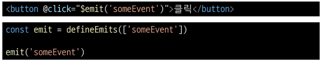

# Component State Flow
## Passing Props
- 같은 데이터 but 다른 컴포넌트
  - 동일한 사진 데이터가 한 화면에 다양한 위치에서 여러번 출력되고 있음
  - 하지만 해당 페이지를 구성하는 컴포넌트가 여러개라면 각 컴포넌트가 개별적으로 동일한 데이터를 관리해야 할까?
  - 그렇다면 사진 변경할 때 모든 컴포넌트에 대해 변경 요청을 해야함
  - 공통된 부모 컴포넌트에서 관리하자!!

  

-> 부모는 자식에게 데이터를 전달(Pass Props)하며, 자식은 자신에게 일어난 일을 부모에게 알림(Emit event)

### Props
부모 컴포넌트로부터 자식 컴포넌트로 데이터를 전달하는 데 사용되는 속성

- Props 특징
  - 부모 속성이 업데이트되면 자식으로 전달되지만, **그 반대는 안됨**
  - 즉, 자식 컴포넌트 내부에서 props를 변경하려고 시도해서는 안되며 불가능
  - 또한 부모 컴포넌트가 업데이트 될 때마다 이를 사용하는 자식 컴포넌트의 모든 props가 최신 값으로 업데이트 됨
  - 부모 컴포넌트에서만 변경하고 이를 내려받는 자식 컴포넌트는 자연스럽게 갱신

- One-Way Data Flow
  - 모든 props는 자식 속성과 부모 속성 사이에 **하향식 단방향 바인딩**(one-way-down binding)을 형성
  - 단방향인 이유
    - 하위 컴포넌트가 실수로 상위 컴포넌트 상태를 변경하여 앱에서의 데이터 흐름을 이해하기 어렵게 만드는 것을 방지하기 위함
    - 데이터 흐름의 일관성 및 단순화

### Props 선언
- 사전준비
  1. vue 프로젝트 생성
  2. 초기 생성된 컴포넌트 모두 삭제(`App.vue` 제외)
  3. `src/assets` 내부 파일 모두 삭제
  4. `main.js` 해당 코드 삭제
    ```javascript
    // main.js
    import './assets/main.css'
    ```
  5. App > Parent > ParentChild 컴포넌트 관계 작성
      - App 컴포넌트 작성

        
      - Parent 컴포넌트 작성

        
      - ParentChild 컴포넌트 작성

        

- Props 선언
  - 부모 컴포넌트에서 내려보낸 props를 사용하기 위해서는 자식 컴포넌트에서 명시적인 props 선언이 필요함
  - Props 작성
    - 부모 컴포넌트 Parent에서 자식 컴포넌트 ParentChild에 보낼 props 작성

      
  - Props 선언
    - `defineProps()`를 사용하여 props를 선언
    - `defineProps()`에 작성하는 인자의 데이터 타입에 따라 선언 방식이 나뉨

      
  
- Props 선언 2가지 방식
  1. "문자열 배열"을 이용한 선언
      - 배열의 문자열 요소로 props 선언
      - 문자열 요소의 이름은 전달된 props의 이름

        
  2. "객체"를 사용한 선언
      - 각 객체 속성의 키가 전달받은 props 이름이 되며, 객체 속성의 값은 값이 될 데이터의 타입에 해당하는 생성자 함수(Number, String ..)여야 함
      - **객체 선언 문법 사용 권장**

        

- props 데이터 사용
  - props 선언 후 템플릿에서 반응형 변수와 같은 방식으로 활용

    
  - props를 객체로 반환하므로 필요한 경우 JavaScript에서 접근 가능

    
  - props 출력 결과 확인

    

- 한 단계 더 props 내려 보내기
  - ParentChild 컴포넌트를 부모로 갖는 ParentGrandChild 컴포넌트 생성 및 등록

    
  - ParentChild 컴포넌트에서 Parent로부터 받은 props를 myMsg를 ParentGrandChild에게 전달

    
  - ParentGrandChild가 받아서 출력하는 props는 Parent에 정의되어 있는 props이며, Parent가 props를 변경할 경우 이를 전달받고 있는 ParentChild, ParentGrandChild에서도 모두 업데이트됨

    

### Props 세부사항
1. Props Name Casing (Props 이름 컨벤션)
    - 자식 컴포넌트로 전달시(→kebab-case)

      
    - 선언 및 템플릿 참조시(→camelCase)

      
2. Static Props & Dynamic Props
    - 지금까지 작성한 것은 Static(정적) props
    - v-bind를 사용하여 **동적으로 할당된 props**를 사용할 수 있음
    - ① Dynamic props 정의

      
    - ② Dynamic props 선언 및 출력

      
    - ③ Dynamic props 출력확인

      
  
### Props 활용
- 다른 디렉티브와 함께 사용하기
  - v-for와 함께 사용하여 반복되는 요소를 props로 전달하기
  - ParengItem 컴포넌트 생성 및 Parent의 하위 컴포넌트로 등록

    
  - 데이터 정의 및 v-for 디렉티브의 반복 요소로 활용
  - 각 반복 요소를 props로 내려보내기

    
  - props 선언 및 출력 결과 확인

    
    - items를 순회하여 얻어낸 객체 item을 key에 바인딩
    - item 객체의 name 속성을 props로 전달하여 출력함
    - my-info가 넘겨받는 "info" 변수에 들어있는 객체는 object이므로,
    - `<script setup>` 내부에서 `defineProps()` 함수로 선언할 때도 객체 타입으로 선언하여 props 받음

※ Prop 받아온 데이터 정보는 그 데이터의 '주체'가 변경할 수 있도록 그 주체가 제어권을 가지고 있게 해야함

-> 즉, 부모가 상속해준 데이터를 자식이 바꿀 수 있도록 해서는 안됨!!


## Component Events
### Emit
자식은 자신에게 일어난 일을 부모에게 알리는데(Emit event ; 에밋 이벤트), **부모가 props 데이터를 변경하도록 소리쳐야 함**

- `$emit()`
  - 자식 컴포넌트가 이벤트를 발생시켜 부모 컴포넌트로 데이터를 전달하는 역할의 메서드
    - `$` 표기는 Vue 인스턴스의 내부 변수들을 가리킴
    - Life cycle hooks, 인스턴스 메서드 등 내부 특정 속성에 접근할 때 사용
  - emit 메서드 구조: `$emit(event, ...args)`
    - event: 커스텀 이벤트 이름
      - ex. 엄마 용돈 올려줘
    - args: 추가 인자
      - ex. 엄마 용돈 "10만원" 올려줘

### 이벤트 발신 및 수신 (Emitting and Listening to Events)
- `$emit`을 사용하여 템플릿 표현식에서 직접 사용자 정의 이벤트를 발신

  
  - 자식 컴포넌트에서 `$emit` 사용하여, 클릭 이벤트가 발생했을 때 'someEvent'라는 이벤트를 정의하여 이벤트 발신
  - 클릭이 되는 순간 즉석해서 someEvent를 발신하는 것
    - JS는 컨벤션을 '케밥 케이스' 사용 불가!!
    - '카멜 케이스' 사용해야 함 ex. someEvent
- 그런 다음 부모는 v-on을 사용하여 수신할 수 있음

  
  - someEvent라는 문자열 형태로 이벤트 생성 후 발생 시키면,
    - 즉, `<button>`에서 이벤트가 발생되면
  - 버블링되어 `<button>`가 속해있던 컨포넌트 `<ParentComp>`로 올라감
  - 그럼 부모가 `@some-event`로 수신하여 이벤트가 발생함을 알아채고, 함수(someCallback) 실행

- 이벤트 발신 및 수신하기
  - ParentChild에서 someEvent라는 이름의 사용자 정의 이벤트를 발신

    
  - ParentChild의 부모 Parent는 v-on을 사용하여 발신된 이벤트를 수신
    - 수신 후 처리할 로직 및 콜백함수 호출

    
  - 이벤트 수신 결과

    

### emit 이벤트 선언
- `defineEmits()`를 사용하여 발신할 이벤트를 선언
- props와 마찬가지로 `defineEmits()`에 작성하는 인자의 데이터 타입에 따라 선언 방식이 나뉨(배열, 객체)
- `defineEmits()`는 $emit 대신 사용할 수 있는 동등한 함수를 반환
  - script에서는 $emit 메서드를 접근할 수 없기 때문

  

- 이벤트 선언 활용
  - 이벤트 선언 방식으로 추가 버튼 작성 및 결과 확인  

    

### 이벤트 전달
- 이벤트 인자(Event Arguments)
  - 이벤트 발신 시 추가 인자를 전달하여 값을 제공할 수 있음

- 이벤트 인자 전달 활용
  - ParentChild에서 이벤트를 발신하여 Parent로 추가 인자 전달하기

    
  - ParentChild에서 발신한 이벤트를 Parent에서 수신

    
  - 추가 인자 전달 확인

    

### 이벤트 세부사항
- Event name Casing
  - 선언 및 발신 시(→camelCase)

    
  - 부모 컴포넌트에서 수신 시(→kebab-case)

    

### emit 이벤트 활용
- emit 이벤트 실습
  - 최하단 컴포넌트 ParentGrandChild에서 Parent 컴포넌트의 name변수 변경 요청하기

    
- emit 이벤트 실습 구현
  - ParentGrandChild에서 이름 변경 요청하는 이벤트 발신

    
  - 이벤트 수신 후 이름 변경 요청하는 이벤트 발신

    
  - 이벤트 수신 후 이름 변수 변경 메서드 호출
    - 해당 변수를 props으로 받는 모든 곳에서 자동 업데이트

      
  - 버튼 클릭후 결과 확인

    

### 참고
- ※주의※ : 정적 & 동적 props 

  
  - 첫 번째는 정적 props로 문자열 `"1"`을 전달
  - 두 번째는 동적 props로 숫자 `1`을 전달

- Props 선언 시 “객체 선언 문법”을 권장하는 이유  
  - 컴포넌트를 가독성이 좋게 문서화하는 데 도움이 됨  
  - 다른 개발자가 잘못된 유형을 전달할 때 브라우저 콘솔에 경고를 출력하도록 함
  - 추가로 props에 대한 **유효성 검사**로 활용 가능함

    

- emit 이벤트도 “객체 선언 문법”으로 작성 가능 
  - emit 이벤트 또한 객체 구문으로 선언된 경우 유효성을 검사할 수 있음

    
    - 객체 형태로 진행할 때 타입 여러 개 지정 가능(배열 형태로 선언)
    - 필수 항목에 대해서는 `required: true`
    - 기본 값에 대해서는 `default: 값`


## Computed Properties
### `computed()`
- "계산된 속성"을 정의하는 함수  
- 미리 계산된 속성을 사용하여 템플릿에서 표현식을 단순하게 하고 불필요한 반복 연산을 줄임

### computed 기본 예시
- 할 일이 남았는지 여부에 따라 다른 메시지를 출력하기

  
  - todos가 심플한 배열이 아니라, `add`, `delete` 등 어떠한 기능을 넣으면
  - 화면에 랜더링 되어야 할 내용 중 복잡한 조건을 달아야할 수 있음 (ex. 0보다 크면 '아직 남았다' 반환, false면 '퇴근' 반환)
  - 그럼 우리 템플릿 영역에 표현식을 길~게 써야 함
  - 즉, 템플릿이 복잡해지며 `todos`에 따라 계산을 수행하게 됨  
  - 만약 이 계산을 템플릿에 여러 번 사용하는 경우에는 반복이 발생함
    - 시간 복잡도 커짐
    - 불필요한 연산이 커짐
    - 계산 해놓자!! (computed)
      - 종속되어있는 데이터의 값이 변경될 때 한 번 연산되면 되게끔

- computed 적용  
  - `07_vue\03-component-state-flow\extra\src\components\Computed.vue` 참고
  - 반응형 데이터를 포함하는 복잡한 로직의 경우 `computed`를 활용하여 미리 값을 계산하고 계산된 값을 사용할 수 있음

    
    - computed를 import 받고
    - todos 객체의 배열의 길이가 0 이상인지에 따라 문자열 반환하는 `computed()` 함수의 반환값을 restOfTodos에 담아둠
    - 변수에 담은 것은 템플릿에서 몇번씩 불러도 됨! (문자열이 담겨있으므로, 연산을 계속 하는 것이 아님!!)
  
  - computed 함수는 콜백함수(`()`) 내부에서 의존하고 있는 (종속되어있는) 속성 데이터가 변경되면 '그 때' 콜백함수가 실행됨
  - 일반적으로 '함수에 의해 실행되는 결과값이 반환되는 형태'는 보통 '메서드' 형태로 만듦
    - 그래야 내 속성이 변경되었을 때 계산된 결과를 반환받으므로!
    - 콘솔에 찍히는거나 결과 반환되는건 computed와 동일함

      

    - 그러나, 계산된 결과값을 3번 부르는 것과 함수를 3번 호출하는 것은 다름!!

         
      
    - computed는 처음에 한번만 계산되고,  
      그 이후에는 종속된 데이터가 변경될 때만 다시 계산됨 (콘솔에 한번만 찍힘)
    - method는 호출할 때마다 계산됨 (콘솔에 호출할 때마다 찍힘)
  
  - 그러니 불필요한 로직을 여러번 실행하지 말고 computed로 한번만 계산해서 사용하자


### computed 특징  
- 반환되는 값은 computed ref이며, 일반 ref와 유사하게 계산된 결과를 `.value`로 참조할 수 있음 (템플릿에서는 `.value` 생략 가능)  
- computed 속성은 의존된 반응형 데이터를 자동으로 추적  
- 의존하는 데이터가 변경될 때만 재평가  
- `restOfTodos`의 계산은 `todos`에 의존하고 있으며, 따라서 `todos`가 변경될 때만 `restOfTodos`가 업데이트됨
  ```python
  const restOfTodos = computed(() => {
    return todos.value.length > 0 ? '아직 남았다' : '퇴근!'
  })
  ```

### Computed vs. Methods
- computed와 동일한 로직을 처리할 수 있는 method  
- computed 속성 대신 method로도 동일한 기능을 정의할 수 있음  

  ```vue
  <!-- Computed.vue -->
  const getRestOfTodos = function () {
    return todos.value.length > 0 ? '아직 남았다' : '퇴근!'
  }
  ```
  ```
  <p>{{ getRestOfTodos() }}</p>
  ```

### computed와 method 차이  
- computed 속성은 의존된 반응형 데이터를 기반으로 캐시(cached) 됨  
  - 의존하는 데이터가 변경된 경우에만 재평가됨  
  - 즉, 의존된 반응형 데이터가 변경되지 않는 한 이미 계산된 결과에 대한 여러 참조는 다시 평가할 필요 없이 이전에 계산된 결과를 즉시 반환  
  - 반면, method 호출은 다시 렌더링이 발생할 때마다 항상 함수를 실행

※ Cache (캐시)  

-> 데이터나 결과를 일시적으로 저장해두는 임시 저장소  

-> 이후 같은 데이터나 결과를 다시 계산하지 않고 빠르게 접근할 수 있도록 함

-> 웹 페이지의 캐시 데이터


-> 과거 방문했던 웹 페이지의 데이터를 임시로 저장하여, 다음에 동일한 페이지를 방문할 때 빠르게 로드할 수 있도록 함

- computed와 method의 적절한 사용처  
  - computed  
    - 의존하는 데이터에 따라 결과가 바뀌는 계산된 속성을 만들 때 유용  
    - 동일한 의존성을 가진 여러 곳에서 사용할 때 계산 결과를 캐싱하여 중복 계산 방지  

  - method  
    - 단순히 특정 동작을 수행하는 함수를 정의할 때 사용  
    - 데이터 의존 여부와 관계없이 항상 동일한 결과를 반환하는 함수

- method와 computed 정리  
  - computed  
    - 의존된 데이터가 변경되면 자동으로 업데이트  
  - method  
    - 호출해야만 실행됨  
  
  - 무조건 computed만 사용하는 것이 아니라, 사용 목적과 상황에 맞게 computed와 method를 적절히 조합하여 사용


## Watchers
### `watch() ` 
하나 이상의 반응형 데이터를 감시하고, 감시하는 데이터가 변경되면 콜백 함수를 호출

※ Computed는 바라보는 대상이 바뀌면 바뀐 결과값을 활용해 새로운 배열을 만드는 등 '계산된 값'을 반환하는 데 중점

※ Watchers는 어떤 데이터를 감시하고 있다가 그 데이터가 변경되면 '부수 효과(side-effects)'를 발생시키는 데 중점

-> 즉, watch는 데이터 변경에 따른 특정 작업 수행에 적합

### watch 구조  

- 첫 번째 인자 (source)  
  - watch가 감시하는 대상 (반응형 변수, 값을 반환하는 함수 등)

- 두 번째 인자 (callback function)  
  - source가 변경될 때 호출되는 콜백 함수  
  1. newValue
      - 감시하는 대상이 변화된 값  
  2. oldValue (optional)
      - 감시하는 대상의 기존 값
      - 선택사항

### watch 기본 동작  


### watch 예시
`07_vue\03-component-state-flow\extra\src\components\Watcher.vue` 참고

- 감시하는 변수에 변화가 생겼을 때 연관 데이터 업데이트하기  

  

  
  - 내가 종속되고 있는 대상을 watch로 감시하다가 얘로 인해 바뀌어야 하는 다른 변수가 있으면, 그 변수를 처리하는 것

### 여러 source를 감시하는 watch  
- 배열을 활용  

  
  - 배열 내부에 감시할 여러 source를 넣어주면, 해당 source들 중 하나라도 변경되면 콜백 함수가 실행됨
  - 즉, 여러 source를 한꺼번에 감시 가능

### computed vs. watch


### 참고
- computed 주의사항
  - **※주의※** computed의 반환 값은 변경하지 말 것  
    - computed의 반환 값은 의존하는 데이터의 파생된 값  
    - 즉, 이미 의존하는 데이터에 의해 계산이 완료된 값임 
    - 일종의 snapshot이며, 의존하는 데이터가 변경될 때만 새 snapshot이 생성됨  
    - 계산된 값은 읽기 전용(read-only) 으로 취급되어야 하며 변경되어서는 안 됨  
    - 대신 새 값을 얻기 위해서는 의존하는 데이터를 업데이트해야 함

  - **※주의※** computed 사용 시 원본 배열 변경하지 말 것 
    - computed에서 `reverse()` 및 `sort()` 사용 시 원본 배열을 변경하기 때문에 원본 배열의 복사본을 만들어서 진행해야 함  

      

## 추가 주제
### Lifecycle Hooks
Vue 인스턴스 생애주기 동안 특정 시점에 실행되는 함수

- Lifecycle Hooks Diagram
  - 인스턴스의 생애 주기 중간 중간에 함수를 제공하여 개발자가 특정 단계에서 원하는 로직을 작성할 수 있도록 함

    

### Lifecycle Hooks 예시
1. Vue 컴포넌트 인스턴스가 초기 렌더링 및 DOM 요소 생성이 완료된 후 특정 로직을 수행하기  

    
  
2. 반응형 데이터의 변경으로 인해 컴포넌트의 DOM이 업데이트된 후 특정 로직을 수행하기  

    

    

### Lifecycle Hooks 특징  
- Vue는 Lifecycle Hooks에 등록된 콜백 함수들을 인스턴스와 자동으로 연결함  
- 이렇게 동작하려면 hooks 함수들은 반드시 동기적으로 작성되어야 함  
- 인스턴스 생애 주기의 여러 단계에서 호출되는 다양한 hooks가 존재하며, 가장 일반적으로 사용되는 것은 `onMounted`, `onUpdated`, `onUnmounted`  
- [Vue Lifecycle Hooks 공식 문서](https://vuejs.org/api/composition-api-lifecycle.html)

### Virtual DOM
가상의 DOM(Virtual DOM) 을 메모리에 저장하고 실제 DOM과 동기화하는 프로그래밍 개념  

- 실제 DOM과의 변경 사항을 비교하여 변경된 부분만 실제 DOM에 적용하는 방식  
- 웹 애플리케이션의 성능을 향상시키기 위한 Vue의 내부 렌더링 기술

  

- 내부 렌더링 과정
  
  

### Virtual DOM 패턴의 장점  
- 효율성  
  - 실제 DOM 조작을 최소화하고, 변경된 부분만 업데이트하여 성능을 향상  

- 반응성  
  - 데이터의 변경을 감지하고 Virtual DOM을 효율적으로 갱신하여 UI를 자동으로 업데이트  

- 추상화  
  - 개발자는 실제 DOM 조작을 Vue에게 맡기고, 컴포넌트와 템플릿을 활용하는 추상화된 프로그래밍 방식으로 원하는 UI 구조를 구성하고 관리할 수 있음

### Virtual DOM 주의사항  
- 실제 DOM에 직접 접근하지 말 것  
  - JavaScript에서 사용하는 DOM 접근 관련 메서드 사용 금지  
  - querySelector, createElement, addEventListener 등  

- Vue의 `ref()`와 **Lifecycle Hooks 함수**를 사용해 간접적으로 접근하여 조작할 것

- 직접 DOM 엘리먼트에 접근해야 하는 경우  
  - `ref` 속성을 사용하여 특정 DOM 엘리먼트에 직접적인 참조를 얻을 수 있음  

  
