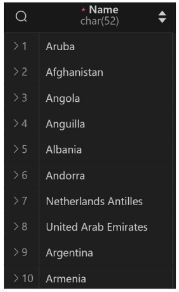
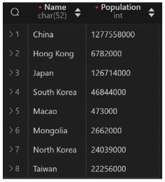

# Basic SQL
## DML (Data Manipulation Language)
테이블 내의 데이터를 추가, 수정, 삭제, 조회를 위한 언어

-> 데이터 조회는 기능이 많아 Data Query Language로 구분하기도 함


- 사전 준비
  - 실습 테이블 생성
    ```SQL
    CREATE TABLE articles (
      id INT PRIMARY KEY AUTO_INCREMENT,
      title VARCHAR(100) NOT NULL,
      content VARCHAR(200) NOT NULL,
      createdAt DATE NOT NULL
    );
    USE articles;
    ```

### INSERT
테이블 레코드 삽입

- INSERT syntax
  ```SQL
  INSERT INTO table_name (c1, c2, ...)
  VALUES (v1, v2, ...);
  ```
  - INSERT INTO절 다음에 테이블 이름과 괄호 안에 필드 목록 작성
  - VALUES 키워드 다음 괄호 안에 해당 필드에 삽입할 값 목록 작성

- INSERT 활용
  - articles 테이블에 아래와 같은 데이터 입력

    
    ```SQL
    INSERT INTO 
      articles (title, content, createdAt)
    VALUES 
      ('hello', 'world', '2000-01-01');
    -- id 컬럼을 AUTO_INCREMENT로 설정했기 때문에
    -- id 적지 않아도 삽입됨
    INSERT INTO 
      articles
    VALUES 
      (3, 'hello', 'world', '2000-01-01');
    -- 모든 컬럼 순서대로 값 잘 입력하면 INSERT INTO절 뒤에 필드 목록 생략 가능
    -- 웬만하면 적기(지금은 간단한 코드지만 나중에 힘들어질지도?)
    ```
  - articles 테이블에 데이터 추가 입력

    
    ```SQL
    INSERT INTO 
      articles (title, content, createdAt)
    VALUES 
      ('title1', 'content1', '1900-01-01'),
      ('title2', 'content2', '1800-01-01'),
      ('title3', 'content3', '1700-01-01');
    -- 세미콜론 적힌 줄까지가 한 줄로 취급되므로
    -- 한번에 여러개 삽입 가능
    ```
  - NOW 함수 사용해서 articles 테이블에 데이터 추가 입력

    
    ```SQL
    INSERT INTO 
      articles (title, content, createdAt)
    VALUES 
      ('mytitle', 'mycontent', NOW());
    ```


### UPDATE
테이블 레코드 수정

- UPDATE syntax
  ```SQL
  UPDATE table_name
  SET column_name = expression,
  [WHERE
    condition];
  -- 대괄호는 optionable한 애들. 넣어도되고 안넣어도 되고
  ```
  - SET 절에 다음 수정할 필드와 새 값을 지정
  - WHERE 절에서 수정할 레코드를 지정하는 조건 작성
  - WHERE 절을 작성하지 않으면 모든 레코드를 수정

- UPDATE 활용
  - articles 테이블 1번 레코드의 title 필드 값을 'update Title'로 변경

    
    ```SQL
    UPDATE 
      articles
    SET
      title = 'update Title'
    WHERE
      id = 1;
    ```
  - articles 테이블 2번 레코드의 title, content 필드 값을 각각 'update Title', 'update Content'로 변경

    
    ```SQL
    UPDATE 
      articles
    SET
      title = 'update Title',
      content = 'update Content'
    WHERE
      id = 2;
    ```


### DELETE
테이블 레코드 삭제

- DELETE syntax
  ```SQL
  DELETE FROM table_name
  [WHERE
    condition];
  ```
  - DELETE FROM절 다음에 테이블 이름 작성
  - WHERE 절에서 삭제할 레코드를 지정하는 조건 작성
  - WHERE 절을 작성하지 않으면 모든 레코드를 삭제

- DELETE 활용
  - articles 테이블의 1번 레코드 삭제

    
    ```SQL
    DELETE FROM 
      articles
    WHERE 
      id = 1;
    ```

### 참고
- DDL의 Truncate와 DML의 Delete 비교
  - Truncate와 Delete 모두 테이블의 모든 데이터 삭제 가능
  - **Delete는 데이터만 삭제**하기 때문에 PK값이 초기화되지 않음
  - **Truncate은 Table을 DROP 후 재생성**하기 때문에 **PK도 초기화** 됨

- DDL 언어인 TRUNCATE과 DELETE 동작 차이
  - DELETE 동작

    
    ```SQL
    DELETE articles;

    INSERT INTO 
      articles (title, content, createdAt)
    VALUES 
      ('hello', 'world', '2000-01-01');
      
    SELECT * FROM articles;
    ```
  - TRUNCATE 동작

    
    ```SQL
    TRUNCATE articles;

    INSERT INTO 
      articles (title, content, createdAt)
    VALUES 
      ('hello', 'world', '2000-01-01');
      
    SELECT * FROM articles;
    ```

## DQL
- 사전준비
  - USE
    - 사용할 database 선택
    ```SQL
    USE world;
    ```
    - 앞으로 진행할 실습은 MySQL 설치시 제공되는 world DB 사용

### SELECT
테이블에서 데이터 조회

- SELECT syntax
  ```SQL
  SELECT
    select_list
  FROM
    table_name;
  ```
  - SELECT 키워드 이후 데이터를 선택하려는 필드를 하나 이상 지정
  - FROM 키워드 이후 데이터를 선택하려는 테이블의 이름을 지정

- SELECT 활용
  - 테이블 country에서 Name 필드의 모든 데이터를 조회

    
    ```SQL
    SELECT 
      Name
    FROM 
      country;
    ```
  - 테이블 country에서 Code, Name 필드의 모든 데이터를 조회
    
    
    ```SQL
    SELECT 
      Code, Name 
    FROM 
      country;
    ```
  - 테이블 country에서 모든 필드 데이터 조회

    
    ```SQL
    SELECT *
    FROM country;
    ```
  - 테이블 country에서 Name 필드의 모든 데이터를 조회
    - 단, 조회 시 Name이 아닌 '국가'로 출력될 수 있도록 변경

      
      ```SQL
      SELECT 
        Name AS '국가'
      FROM 
        country;
      ```
  - 테이블 country에서 Name, Population 필드의 모든 데이터를 조회
    - 단, Population 필드는 1000으로 나눠 k단위 값으로 출력

      
      ```SQL
      SELECT
        Name,
        Population / 1000 AS '인구 (k)'
      FROM
        country;
      ```

- SELECT 정리
  - 테이블의 데이터를 조회 및 반환
  - `*` (asterisk) 사용하여 모든 필드 선택
  - `AS` 키워드를 통해 컬럼명 임시 네이밍 가능


## Filtering Data
### DISTINCT
조회 결과에서 중복된 레코드 제거

- DISTINCT syntax
  ```SQL
  SELECT DISTINCT
    select_list
  FROM
    table_name;
  ```
  - SELECT 키워드 바로 뒤에 작성해야 함
  - SELECT DISTINCT 키워드 다음에 고유한 값을 선택하려는 하나 이상의 필드를 지정

- DISTINCT 활용
  - 테이블 county에서 Continent 필드의 데이터를 중복없이 조회

    
    ```SQL
    SELECT 
      DISTINCT Continent
    FROM 
      country;
    ```


### WHERE
조회 시 특정 검색 조건을 지정

- WHERE syntax
  ```SQL
  SELECT
    select_list
  FROM
    table_name
  WHERE
    search_condition;
  ```
  - FROM clause 뒤에 위치
  - search_condition은 비교연산자 및 논리연산자(AND, OR, NOT 등)를 사용하는 구문이 사용됨

- WHERE 활용
  - 테이블 country에서 Region 필드 값이 'Eastern Asia'인 데이터의 Name, Population 조회

    
    ```SQL
    SELECT 
      Name, Population
    FROM 
      country
    WHERE Region = 'Eastern Asia';
    ```

  - 테이블 country에서 IndepYear 필드 값이 Null이 아닌 데이터의 Name, Region, Population, IndepYear 조회

    
    ```SQL
    SELECT 
      Name, Region, Population, IndepYear
    FROM 
      country
    WHERE
      IndepYear IS NOT NULL;
    -- NULL은 '=' 사용XX 'IS' 사용함
    -- 왜 NULL은 특별취급?
    -- NULL은 값이 아닌 '상태'이므로 0과 빈 문자열처럼 특정한 값이 아닌 NULL은 어떠한 값과도 비교대상이 되어서는 안됨
    ```
  
  - 테이블 country 에서 Population 필드 값이 천 만 이상이고 LifeExpectancy 필드가 78 이상인 데이터의 Name, Region, LifeExpectancy 조회

    
    ```SQL
    SELECT
      Name, Region, LifeExpectancy
    FROM 
      country
    WHERE
      Population >= 10000000 
      AND LifeExpectancy >= 78;
    ```


### Database Operator
- Logical Operator (논리 연산자)
  - AND (`&&`), OR (`||`), NOT (`!`)

- Comparison Operators (비교 연산자)
  - `=`, `>=`, `<=`, `!=`
  - `BETWEEN...AND`, `IN`, `LIKE`, `IS`

- BETWEEN Operator
  - 컬럼의 데이터가 A와 B 사이에 있는지 확인
    ```SQL
    Column BETWEEN A AND B
    ```
  - BETWEEN 활용
    - 테이블 country 에서 Poputation 필드 값이 백만이상 오백만 이하이고 GNPOld가 GNP 보다 큰 데이터의 Name, Region, Population 그리고 GNPOld와 GNP 차이를 GNP diff로 작성하여 조회

      
      ```SQL
      SELECT
        Name, Region, Population, 
        GNP - GNPOld AS 'GNP Diff' 
      FROM 
        country
      WHERE
        Population BETWEEN 1000000 AND 5000000
        -- Population >= 1000000 AND Population <= 5000000
        AND GNP < GNPOld;
      ```

- IN Operator
  - 값이 특정 목록 안에 있는지 확인
  - IN 활용
    - 테이블 country 에서 Continent 필드 값이 'North America' 또는 'Asia' 인 데이터의 Code, Name, Continent 조회

      
      ```SQL
      SELECT
        Code, Name, Continent
      FROM
        country
      WHERE
        Continent IN ('North America', 'Asia');
      -- WHERE
      --   Continent = 'North America' OR Continent = 'Asia';
      ```

- LIKE Operator
  - 값이 특정 패턴에 일치하는지 확인(Wildcards와 함께 사용)

  - Wildcard Characters
    - `%` : **0개 이상의 문자열**과 일치하는지 확인
    - `_` : **단일 문자**와 일치하는지 확인
  
  - LIKE 활용
    - 테이블 country에서 Name 필드 값이 ‘South’으로 시작하는 데이터의 Name, Region, Population, GNP 조회

      
      ```SQL
      SELECT 
        Name, Region, Population, GNP
      FROM 
        country
      WHERE
        Name LIKE 'South%';
      ```
    - 테이블 country에서 Name 필드 값이 ‘South’으로 시작하고, 공백을 포함하여 6자리를 가지는 데이터의 Name, Region, Population, GNP 조회

      
      ```SQL
      SELECT 
        Name, Region, Population, GNP 
      FROM 
        country
      WHERE
        Name LIKE 'South______'; -- 공백도 한자리 차지함
      ```

- IS Operator
  - NULL 값은 `=` 연산자를 활용하여 비교 불가

    
  - IS 연산자를 통해 NULL인지 확인
    ```SQL
    SELECT 
      Name, GNPOld, IndepYear
    FROM 
      country
    WHERE
      GNPOld IS NULL
      AND IndepYear IS NOT NULL;
    ```

- 연산자 우선순위
  1. 괄호
  2. NOT 연산자
  3. 비교 연산자
  4. AND 
  5. OR
  - **우선순위 고려하지 않고 작성하면 의도치 않은 동작 발생**
  - 연산자 우선순위 관련 동작 예시
    - 테이블 country에서 IndepYear가 1901이거나 1981이고, LifeExpectancy가 75 이하인 데이터의 Name, IndepYear, LifeExpectancy를 조회
      ```SQL
      -- 우선순위 신경 안썼을 때
      
      -- Ver. Wrong 1
      -- AND 연산자의 우선순위가 OR보다 높으므로,
      -- LifeExpectancy가 75보다 높은 경우도 조회된다.
      SELECT 
        Name, IndepYear, LifeExpectancy
      FROM 
        country
      WHERE
        IndepYear = 1901 OR IndepYear = 1981 
        AND LifeExpectancy <= 75;
      
      -- Ver. Wrong 2
      -- 현재는 정상적으로 조회되는 듯 보일 수 있으나, 
      -- 데이터에 따라 달라질 수 있다.
      SELECT 
        Name, IndepYear, LifeExpectancy
      FROM 
        country
      WHERE
        IndepYear = 1981 OR IndepYear = 1901 
        AND LifeExpectancy <= 75;
      ```
      


## MySQL Built-in Function
- MySQL 내장 함수

  

### 문자형 함수
- `CONCAT(str1, str2, ...)` ★자주씀★
  - 인자로 들어오는 문자열을 하나로 연결해주는 함수
    ```SQL
    SELECT CONCAT('FirstName', '_', 'LastName');

    SELECT CONCAT(Name, ': ', Code) AS 'Name: Code' 
    FROM country;
    ```

- `TRIM([[BOTH|LEADING|TRAILING] remove_str] target_str)`
  - 왼쪽 혹은 오른쪽의 특정 문자를 삭제하는 함수
  - remove_str을 생략한 경우 공백 문자를 삭제함
    ```SQL
    SELECT TRIM('   PHONE   ');   -- 공백 제거 -> PHONE
    SELECT TRIM('-' FROM '---TITLE---');   -- 없애려는 문자 다 제거 -> TITLE
    SELECT TRIM(LEADING '-' FROM '---TITLE---');    -- 앞쪽 문자들만 제거 -> TITLE---
    SELECT TRIM(TRAILING '-' FROM '---TITLE---');    -- 뒤쪽 문자들만 제거 -> ---TITLE
    ```

- `REPLACE(target_str, from_str, to_str)`
  - 문자열을 수정하기 위해 사용하는 함수
    ```SQL
    SELECT REPLACE('$10000', '$', '￦');
    ```

- `LOCATE(sub_str, target_str [, pos])`
  - 찾으려는 문자가 있다면, 그 문자의 첫 번째 위치를 반환
  - 찾으려는 문자가 없으면, 0을 반환
  - pos에 숫자를 작성하면 해당 위치부터 탐색
    ```SQL
    SELECT LOCATE('path', 'www.web-path-site.com/path/');
    SELECT LOCATE('path', 'www.web-path-site.com/path/', 10);
    ```


### 숫자형 함수
- `ABS(x)`
  - x의 절댓값 반환
    ```SQL
    SELECT ABS(-12);
    ```

- `MOD(n,m)`
  - n을 m으로 나누었을 때 나머지를 반환
  - n % m 도 동일
    ```SQL
    SELECT MOD(10, 7);
    SELECT 10%7;   -- MOD와 동일함
    ```

- `POW(n,m)`
  - n의 m승의 결과를 반환(제곱근 구하기)
    ```SQL
    SELECT POW(2, 6);   -- 단축어
    SELECT POWER(2, 6); -- POW와 동일함 
    ```

- `CELI(x)`
  - x의 올림 값을 반환
    ```SQL
    SELECT CEIL(3.7);
    SELECT CEIL(3.3);
    ```

- `FLOOR(x)`
  - x의 내림 값을 반환
    ```SQL
    SELECT FLOOR(3.7);
    SELECT FLOOR(3.2);
    ```

- `ROUND(x[, d])`
  - x의 반올림 값을 반환
  - d는 소수점 자리수를 의미
    ```SQL
    SELECT ROUND(3.7);
    SELECT ROUND(3.2);
    ```


### 날짜형 함수
- `CURDATE()`
  - 현재 날짜를 반환
    ```SQL
    SELECT CURDATE();
    ```

- `CURTIME()`
  - 현재 시간을 반환
    ```SQL
    SELECT CURTIME();
    ```

- `NOW()`
  - 현재 날짜와 시간을 반환
    ```SQL
    SELECT NOW();
    ```

- `DATE_FORMAT(data, format)`
  - 날짜 정보를 원하는 format 형태로 변환

    
    ```SQL
    SELECT DATE_FORMAT ('2024-08-23 13:35:20', '%b-%d (%a) %r');
    ```

### NULL 관련 함수
- `IFNULL(expr1,expr2)`
  - expr1이 NULL이면 expr2 반환
  - expr1이 NULL이 아니면 expr1이 반환
    ```SQL
    SELECT IFNULL(NULL, 'expr1 is NULL');
    SELECT IFNULL('expr1', 'expr1 is NULL');
    ```
  - IFNULL 활용
    - 'North America'에 속한 국가의 이름과 독립년도 조회
    - 만약 독립연도 없으면 'no_data'가 출력될 수 있도록 조회

      
      ```SQL
      SELECT 
        Name,
        -- IndepYear,  
        IFNULL(IndepYear, 'no_data') 
      FROM 
        country
      WHERE 
        Continent = 'North America'; 
      ```

- `NULLIF(expr1,expr2)`
  - expr1이 expr2와 동일한 경우 NULL을 반환
  - expr1이 expr2와 동일하지 않다면 expr1을 반환
    ```SQL
    -- NULL과의 비교에서 유용하게 사용된다.
    SELECT NULLIF('expr1', 'expr1');
    SELECT NULLIF('expr1', 'expr2');
    ```
  - NULLIF 함수 활용
    - 모든 국가의 정보 중 인구가 0인 경우 NULL로 표시되도록 조회

      
      ```SQL
      SELECT 
        Name, 
        -- Population,
        NULLIF(Population, 0)
      FROM country;
      ```
    - 모든 국가의 정보 중 독립 연도가 NULL인 경우 NULL로 표시되도록 조회
      ```SQL
      SELECT NULLIF(IndepYear, NULL) FROM country;
      ```

- `COALESCE(value1, value2, ..., valueN)`
  - 첫번째 인자 value1부터 순서대로 확인하여 NULL이 아닌 값을 반환
  - 모두 NULL인 경우 NULL 반환
    ```SQL
    SELECT COALESCE('expr1', 'expr2', NULL);  -- expr1
    SELECT COALESCE(NULL, 'expr2', NULL);   -- expr2
    SELECT COALESCE(NULL, NULL, NULL);    -- NULL
    ```
  - COALESCE 활용
    - Africa의 기대 수명이 70 미만인 국가의 GNP 정보를 조회
    - GNP가 0이면 GNPOld 값을 사용하고, GNPOld도 NULL인 경우 'No data'를 표시

      
      ```SQL
      SELECT
        -- Name, GNP, GNPOld,
        Name,
        COALESCE(NULLIF(GNP, 0), GNPOld, 'No data') AS gnp_data
      FROM country
      WHERE
        Continent = 'Africa'
        AND LifeExpectancy < 70;
      ```


## Sorting data
### ORDER BY
조회 결과의 레코드를 정렬

- ORDER BY syntax
  ```SQL
  SELECT
    select_list
  FROM
    table_name
  ORDER BY
    column1 [ASC|DESC],
    column2 [ASC|DESC],
    ...;
  ```
  - FROM절 뒤에 위치
  - 하나 이상의 컬럼을 기준으로 결과를 오름차순(ASC, 기본값), 내림차순(DESC)으로 정렬

- ORDER BY 활용
  - 테이블 country에서 GovernmentForm 필드의 모든 데이터를 오름차순으로 조회

    
    ```SQL
    SELECT 
      GovernmentForm
    FROM 
      country
    ORDER BY
      GovernmentForm;
    ```
  - 테이블 country에서 GovernmentForm 필드의 모든 데이터를 내림차순으로 조회

    
    ```SQL
    SELECT 
      GovernmentForm
    FROM 
      country
    ORDER BY
      GovernmentForm DESC;
    ```
  - 테이블 country에서 GovernmentForm 필드를 기준으로 내림차순 정렬한 다음 SurfaceArea 필드 기준으로 오름차순 정렬하여 조회

    
    ```SQL
    SELECT 
      GovernmentForm, SurfaceArea
    FROM 
      country
    ORDER BY
      GovernmentForm DESC, SurfaceArea ASC;
    ```

- 정렬에서의 NULL
  - NULL값이 존재할 경우 오름차순 정렬 시 결과에 NULL이 먼저 출력됨
  - 예시
    - 테이블 country에서 Continent 필드가 'Asia'인 데이터 중 IndepYear 기준으로 오름차순 정렬한 다음 Name, IndepYear 필드의 모든 데이터를 조회

      
      ```SQL
      -- NULL 값이 존재할 경우 오름차순 정렬 시 결과에 NULL이 먼저 출력
        -- NULL은 알 수 없는 상태로, 크기 비교가 불가능 하므로
        -- 모든 값보다 작다고 처리됨
      SELECT
        Name, IndepYear
      FROM
        country
      WHERE
        Continent = 'Asia'
      ORDER BY 
        IndepYear;
      ```
    - 테이블 country에서 Continent 필드가 'Asia'인 데이터 중 IndepYear 기준으로 오름차순 정렬할 때 **NULL 데이터는 마지막에 위치**하도록 Name, IndepYear 필드의 모든 데이터를 조회

      
      ```SQL
      -- NULL 데이터는 마지막에 위치하도록 하고싶다면?
        -- IS NULL의 결과 NULL인 경우, -> TRUE -> 1
        -- IS NULL의 결과 NULL이 아닌 경우, -> FALSE -> 0
          -- 1은 0보다 크므로, NULL이 아닌 데이터가 먼저 오게 됨
      SELECT
        Name, IndepYear
      FROM
        country
      WHERE
        Continent = 'Asia'
      ORDER BY 
        IndepYear IS NULL, IndepYear;
      -- NULL을 먼저 뒤로 보낸 다음
      -- 진짜 하고싶었던 IndepYear 정렬하기
      ```


### LIMIT
조회하는 레코드 수를 제한

- LIMIT syntax
  ```SQL
  SELECT
    select_list
  FROM
    table_name
  LIMIT [offset,] row_count;
  -- LIMIT row_count OFFSET offset;
  ```
  - 하나 또는 두 개의 인자를 사용(0 또는 양의 정수)
  - row_count는 조회하는 최대 레코드 수를 지정

- LIMIT & OFFSET 예시
  ```SQL
  SELECT
    ..
  FROM
    ..
  LIMIT 2, 5;   -- offset, row_count
  ```
  

- LIMIT 활용
  - 테이블 country에서 IndepYear, Name, Population 필드 데이터를 Population 기준 내림차순으로 7개만 조회

    
    ```SQL
    SELECT 
      IndepYear, Name, Population
    FROM 
      country
    ORDER BY 
      Population DESC
    LIMIT 7;
    ```
  - 테이블 country에서 IndepYear, Name, Population 필드 데이터를 Population 기준 내림차순으로 5번째부터 12번째 데이터만 조회

    
    ```SQL
    SELECT 
      IndepYear, Name, Population
    FROM 
      country
    ORDER BY 
      Population DESC
    LIMIT 4, 7;   -- 앞에 4개 빼고 5번째부터 7개
                  -- LIMIT 7 OFFSET 4;
    ```

※ SELECT statement 실행 순서


## Grouping data
### Aggregate Function (집계 함수)
값에 대한 계산을 수행하고 단일한 값을 반환하는 함수

-> GROUP BY 절과 많이 사용함

- `COUNT(*)`
  - **NULL값을 포함**한 행의 수 출력
    ```SQL
    SELECT COUNT(*) FROM country;
    ```
    

- `COUNT(expr)`
  - NULL 값을 제외한 행의 수 출력
    ```SQL
    SELECT COUNT(IndepYear) FROM country;
    ```
    

- `SUM(expr)`
  - NULL값을 제외한 합계 출력
    ```SQL
    SELECT SUM(GNP) FROM country WHERE Continent = 'Asia';
    ```

- `AVG(expr)`
  - NULL값을 제외한 합계 출력
    ```SQL
    SELECT AVG(GNP) FROM country WHERE Continent = 'Asia';
    ```

- `MAX(expr)`
  - NULL값을 제외한 최대값 출력
    ```SQL
    SELECT MAX(GNP) FROM country WHERE Continent = 'Asia';
    ```

- `MIN(expr)`
  - NULL값을 제외한 최소값 출력
    ```SQL
    SELECT MIN(GNP) FROM country WHERE Continent = 'Asia';
    ```

- `STDDEV(expr)`
  - NULL값을 제외한 표준편차 출력
    ```SQL
    SELECT STDDEV(GNP) FROM country WHERE Continent = 'Asia';
    ```

- `VARIANCE(expr)`
  - NULL값을 제외한 분산 출력
    ```SQL
    SELECT VARIANCE(GNP) FROM country WHERE Continent = 'Asia';
    ```

### GROUP BY
레코드를 그룹화하여 요약본 생성

-> '집계 함수'와 함께 사용

- GROUP BY syntax
  ```SQL
  SELECT
    c1, c2, ..., cn, aggregate_function(ci)
  FROM
    table_name
  GROUP BY
    c1, c2, ..., cn;
  ```
  - FROM 및 WHERE절 뒤에 배치
  - GROUP BY절 뒤에 그룹화 할 필드 목록 작성

- GROUP BY 예시
  - Continent 필드 그룹화
    ```SQL
    SELECT
      Continent
    FROM
      country
    GROUP BY
      Continent;
    ```
    
  - COUNT 함수가 각 그룹에 대한 집계된 값을 계산
    ```SQL
    SELECT
      Continent, COUNT(*)
    FROM
      country
    GROUP BY
      Continent;
    ```
    

- GROUP BY 활용
  - 테이블 country에서 Continent 필드를 그룹화하여, 각 그룹에 대한 GNP의 평균을 소수점 2자리로 반올림하여 조회하고, 컬럼 이름을 avg_gnp로 변경

    
    ```SQL
    SELECT
      Continent, 
      ROUND(AVG(GNP), 2) AS avg_gnp
    FROM
      country
    GROUP BY
      Continent;
    ```
  - 테이블 country에서 Region필드를 그룹화하여, 각 그룹에 대한 개수가 15이상 20이하인 데이터를 내림차순으로 조회

    
    
    - 집계 항목에 대한 조건은 Having절 사용해야 함
    - 집계항목이 아닌 원 컬럼에 대한 조건은 WHERE

- **HAVING** 절
  - 집계 항목에 대한 세부 조건 지정
  - 주로 GROUP BY와 함께 사용되며 GROUP BY가 없다면 WHERE처럼 동작함
    - 그렇게 쓸 수 있다는 거지, 쓰라는건 아님;;
    - GROUP BY 없을 때 WHERE 대신 HAVING절 쓰는 파렴치한짓 하지말것

     

※ SELECT statement 실행 순서


1. 테이블에서 `FROM`
2. 특정 조건에 맞추어 `WHERE`
3. 그룹화하고 `GROUP BY`
4. 만약 그룹 중에서 조건이 있다면 맞추고 `HAVING`
5. 조회하여 `SELECT`
6. 정렬하고 `ORDER BY`
7. 특정 위치의 값을 가져옴 `LIMIT`

