# SQL Advanced
## JOIN
- 관계
  - **여러** 테이블 간의 (논리적) 연결

- 관계의 필요성
  - 커뮤니티 게시판에 필요한 데이터 생각해보기

    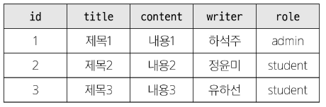
    - '하석주'가 작성한 모든 게시글 조회하기
      ```SQL
      SELECT * FROM 테이블 WHERE writer = '하석주';
      ```
    - 이 테이블을 그대로 두면 안될 '수도' 있는 이유
    - 제 1 정규화 상으론 문제 없음
      - 모든 칼럼이 원자값으로 구성되어 있음
    - 제 2 정규화 상으로도 문제 없음
      - 기본키가 id인데, 모든 속성이 id에 종속되어 있음(완전 함수 종속)
    - 그렇다면 제 3 정규화는?
      - role이 id에 직접 종속되는게 아니라, writer에 종속되고, writer는 id에 종속된 상태
      - 즉, role은 id에 이행적으로 종속되어 있음
      - `id -> writer -> role`
    - id에 종속되어 있는 것은 게시글 정보이고, 게시글이 종속 되었을 때 작성자 또한 종속이 될 것임
    - 작성자에 의해 role의 정보도 처리가 될 수 있어야 할 것 같은데, 현재 테이블 구조로는 문제가 생길 수 있는 구조
    - 왜냐하면 동일 작성자가 여러 게시글을 쓸 경우, 매번 role 정보를 반복해서 저장해야 하기 때문
    - 예: `id: 4, writer: 하석주, role: admin` 을 추가했는데, 누군가 실수로 role을 student로 잘못 입력하면
      - -> 동일 인물임에도 불구하고 role 정보가 일관되지 않게 됨 (**갱신 이상** 발생)
    - 즉, 작성자 기준으로 role 정보가 **일관되게 관리**되어야 함
    - 이처럼 조회 시 혼란이 생기거나, 갱신 이상이 발생할 수 있음
    - 딱히 갱신할 일이 없다면 불필요한 정규화 하지 않고 비정규화 상태로 둘 수도 있음

  - 동명이인이 있거나 특정 데이터가 수정된다면? => 테이블을 나누어서 분류하자

    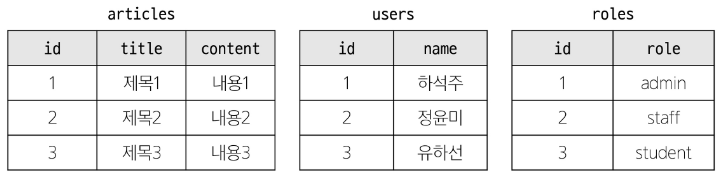
    - 각 게시글은 누가 작성했는지 알 수 있을까?
    - 작성자들의 역할은 무엇일까?
  - articles와 users 테이블에 각각 userId, roleId 외래 키 필드 작성

    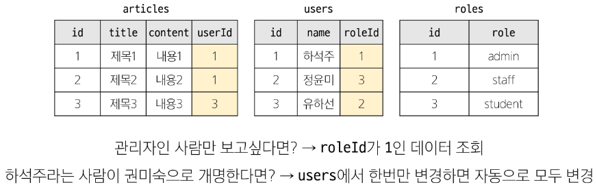

- JOIN이 필요한 순간
  - 테이블을 분리하면 데이터 관리는 용이해질 수 있으나 출력시에는 문제가 있음
  - 테이블 한 개 만을 출력할 수 밖에 없어 **다른 테이블과 결합하여 출력**해야 함
  - 이때 사용하는 것이 `JOIN`

### JOIN
둘 이상의 테이블에서 데이터를 검색하는 방법

- JOIN 종류
  1. `INNER JOIN`
  2. `LEFT JOIN`
  3. `RIGHT JOIN`
  4. `SELF JOIN`

- 사전준비
  - db_adv 데이터베이스 생성 및 연결
    ```SQL
    CREATE DATABASE db_adv
      DEFAULT CHARACTER SET 'utf8mb4';
    
    USE db_adv;
    ```

  - users 테이블 생성
    ```SQL
    CREATE TABLE users (
      id INTEGER PRIMARY KEY AUTO_INCREMENT,
      name VARCHAR(50) NOT NULL,
      age INTEGER,
      parent_id INTEGER, -- 정수형 parent_id 만들고
      FOREIGN KEY (parent_id) REFERENCES users(id)
      -- parent_id를 외래키로 지정하는데, 자기 자신과 동일한 테이블의 id를 참조
    );
    ```

  - 각 테이블에 데이터 입력
    ```SQL
    INSERT INTO 
      users (name, age, parent_id)
    VALUES 
      ('하석주', 50, NULL), -- FK 값은 NULL일 수 있음
      ('정윤미', 48, NULL),
      ('유하선', 46, NULL),
      ('하민성', 24, 1),
      ('정아인', 22, 2),
      ('송민', 19, 1),
      ('정지민', 22, 2);
    ```

  - articles 테이블 생성
    ```SQL
    CREATE TABLE articles (
      id INTEGER PRIMARY KEY AUTO_INCREMENT,
      title VARCHAR(50) NOT NULL,
      content VARCHAR(100) NOT NULL,
      userId INTEGER,
      FOREIGN KEY (userId) REFERENCES users(id)
    );
    ```

  - 각 테이블에 데이터 입력
    ```SQL
    INSERT INTO
      articles (title, content, userId)
    VALUES 
      ('제목1', '내용1', 1),
      ('제목2', '내용2', 2),
      ('제목3', '내용3', NULL),
      ('제목4', '내용4', 3),
      ('제목5', '내용5', 1),
      ('제목6', '내용6', NULL),
      ('제목7', '내용7', 5);
    ```

### INNER JOIN
두 테이블에서 **값이 일치하는 레코드**에 대해서만 결과를 반환

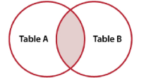

- INNER JOIN syntax
  ```SQL
  SELECT
    select_list
  FROM
    table_a
  INNER JOIN table_b
    ON table_b.fk = table_a.pk;
  ```
  - FROM 절 이후 메인 테이블 지정 (table_a)
  - INNER JOIN 절 이후 메인 테이블(왼쪽 테이블, 즉 table_a)과 조인할 테이블 지정 (오른쪽 테이블, table_b)
  - ON 키워드 이후 조인 조건을 작성
  - 조인 조건은 table_a와 table_b간의 레코드를 일치시키는 규칙을 지정

- INNER JOIN 예시

  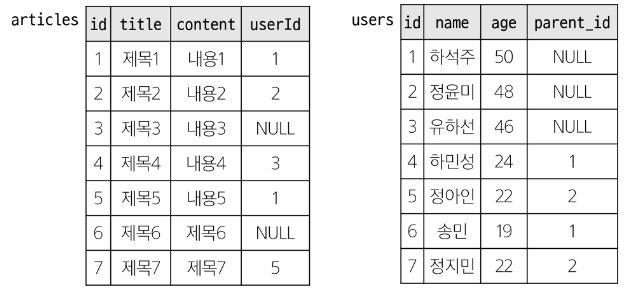
  - 작성자가 존재하는 모든 게시글을 작성자 정보와 함께 조회
    ```SQL
    SELECT articles.*, users.id, users.name FROM articles
    INNER JOIN users 
      ON users.id = articles.userId;

    -- INNER JOIN은 교집합이므로, 메인 테이블이 달라져도 결과는 동일
      -- 단, 메인 테이블을 기준으로 조회하므로 조회 순서가 달라질 수 있으므로 유의
    SELECT articles.*, users.id, users.name FROM users
    INNER JOIN articles 
      ON users.id = articles.userId;
    -- 이제 SELECT할 때 어느 테이블의 컬럼인지 명시해야 함
    ```
    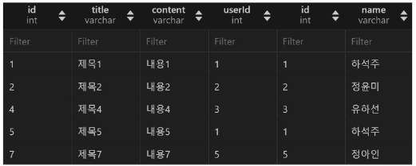

- INNER JOIN 활용
  - 1번 회원(하석주)가 작성한 모든 게시글의 제목과 작성자명을 조회
    ```SQL
    SELECT articles.title, users.name
    FROM articles
    INNER JOIN users 
      ON users.id = articles.userId
    -- 순서 상관없이 FK, PK만 테이블 잘 맞춰서 적으면 됨
    WHERE users.id = 1;
    ```
    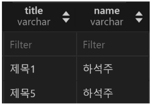

### LEFT JOIN
오른쪽 테이블의 일치하는 레코드와 함께 왼쪽 테이블의 모든 레코드 반환

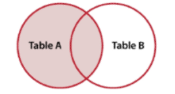

- LEFT JOIN syntax
  ```SQL
  SELECT
    select_list
  FROM
    table_a
  LEFT JOIN table_b
    ON table_b.fk = table_a.pk;
  ```
  - FROM절 이후 왼쪽 테이블 지정 (table_a)
  - LEFT JOIN절 이후 오른쪽 테이블 지정 (table_b)
  - ON 키워드 이후 조인 조건을 작성
    - 왼쪽 테이블의 각 레코드를 오른쪽 테이블의 모든 레코드와 일치시킴

- LEFT JOIN 예시

  
  - 모든 게시글을 작성자 정보와 함께 조회
    ```SQL
    SELECT articles.*, users.id, users.name FROM articles
    LEFT JOIN users 
      ON users.id = articles.userId;
      -- 정렬 명시하지 않으면 순서 보장할 수 없지만
      -- 왼쪽 테이블의 기본키(현재 articles.id) 순서대로 나올 가능성이 높음
    ```
    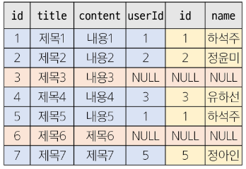
    - 왼쪽 테이블의 모든 레코드를 표기
    - 오른쪽 테이블과 매칭되는 레코드가 없으면 NULL 표시

- LEFT JOIN 활용
  - 게시글 작성한 이력이 없는 회원의 name 조회
    ```SQL
    SELECT users.name FROM users
    LEFT JOIN articles 
      ON articles.userId = users.id
    WHERE articles.userId IS NULL;
    -- 왼쪽 테이블은 users로 보고있지만
    -- 유저 테이블은 '역참조'되고 있는 테이블
      -- users 입장에서, 자신을 참조하고 있는 테이블이 있다는 의미
    -- 즉, 유저 테이블에는 게시글 정보가 일절 없음
    -- 따라서 관계를 맺고있는 articles에 있는 FK정보를 가지고 필터링(조건) 진행 가능

    -- 얘도 왼쪽 테이블이 users니까 users.id 순서대로 나올 가능성이 높음(보장XX)
    ```
    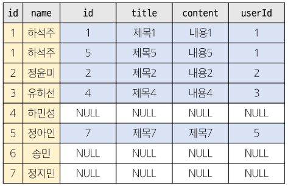
    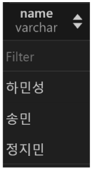

### RIGHT JOIN
- RIGHT JOIN syntax
  ```SQL
  SELECT
    select_list
  FROM
    table_a
  RIGHT JOIN table_b
    ON table_b.fk = table_a.pk;
  ```
  - FROM절 이후 왼쪽 테이블 지정 (table_a)
  - RIGHT JOIN절 이후 오른쪽 테이블 지정 (table_b)
  - ON 키워드 이후 조인 조건을 작성
    - 오른쪽 테이블의 각 레코드를 왼쪽 테이블의 모든 레코드와 일치시키킴

- RIGHT JOIN 예시

  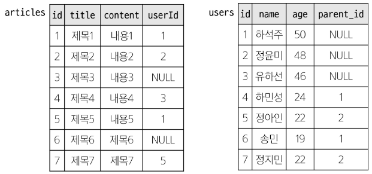
  - 모든 사용자가 작성한 글을 조회
    ```SQL
    SELECT articles.*, users.id, users.name FROM articles
    RIGHT JOIN users 
      ON users.id = articles.userId;
    ```
    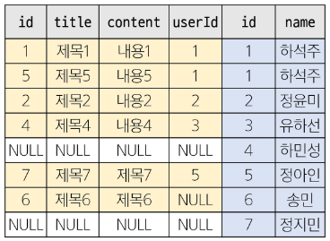

**※ RIGHT JOIN 언제씀?**

-> 쿼리가 굉장히 복잡해졌을 때
```markdown
- articles: 게시글
- users: 작성자
- categories: 카테고리

ex. 모든 게시글은 반드시 가져와야 하며, 작성자와 카테고리 정보를 함께 붙이되, 카테고리는 name = '공지사항' 인 경우만 보여주고 싶음
```
✅ LEFT JOIN 방식 (조건 위치 주의 필요)
```SQL
SELECT a.*, u.name AS user_name, c.name AS category_name
FROM articles a
LEFT JOIN users u ON a.userId = u.id
LEFT JOIN categories c ON a.categoryId = c.id AND c.name = '공지사항';
-- articles를 메인 테이블로 유지하면서,
-- categories.name = '공지사항' 조건을 JOIN 안에 넣음
-- 이렇게 해야 모든 게시글을 유지하면서 카테고리는 선택적으로 조인됨
-- 즉, 모든 게시글을 유지하면서, 카테고리가 '공지사항'이면 c.name이 채워지고, 아니면 NULL이 됨
```
❌ 잘못된 LEFT JOIN 사용 (WHERE 절에서 필터링하면 안 됨)
```SQL
SELECT a.*, u.name AS user_name, c.name AS category_name
FROM articles a
LEFT JOIN users u ON a.userId = u.id
LEFT JOIN categories c ON a.categoryId = c.id
WHERE c.name = '공지사항';
-- 이렇게 하면 결과가 INNER JOIN처럼 동작
-- '공지사항' 카테고리를 가진 게시글만 조회됨
```
✅ RIGHT JOIN 방식 (구조를 뒤집어서 더 읽기 쉽게)
```SQL
SELECT a.*, u.name AS user_name, c.name AS category_name
FROM categories c
RIGHT JOIN articles a ON c.id = a.categoryId AND c.name = '공지사항'
LEFT JOIN users u ON a.userId = u.id;
-- articles를 오른쪽 테이블에 두고 기준으로 사용
-- categories.name = '공지사항' 조건을 JOIN 안에 명확하게 표현 가능
-- 복잡한 구조일수록 논리 흐름이 더 잘 보임
```

-> 즉, 복잡한 조인 쿼리에서

-> 조건을 걸고 싶은 테이블이 **왼쪽**에 있어야 할 때

-> 하지만 기준(메인)이 되는 테이블은 **오른쪽**일 때

-> RIGHT JOIN을 쓰면 쿼리가 더 깔끔하고 읽기 쉬움

### SELF JOIN
동일한 테이블의 컬럼을 비교하여 일치하는 데이터를 추가로 붙여 반환

-> 주로 **계층적** 데이터 구조를 표현하거나 동일 테이블 내에서 특정 관계를 찾을 때 사용

- SELF JOIN syntax
  ```SQL
  SELECT
    select_list
  FROM
    table_a
  [INNER] JOIN table_a t_a
    ON table_a.column = t_a.column;
  ```
  - FROM 절 이후 본 테이블 지정 (table_a)
  - JOIN 절 이후 본 테이블 지정 (table_a)
    - **이때 반드시 별칭 설정 (t_a)**
  - ON 키워드 이후 조인 조건을 작성
    - 본 테이블의 컬럼과 별칭 테이블의 컬럼을 이용하여 비교

- SELF JOIN 예시

  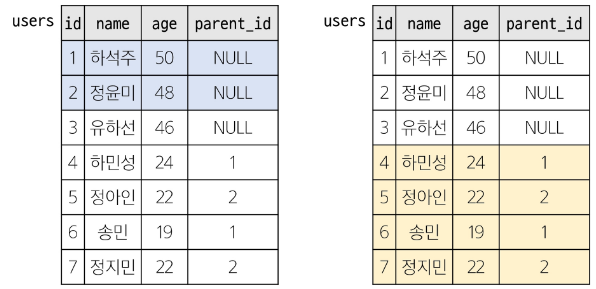
  - users 테이블의 부모 자식 관계 조회
    ```SQL
    SELECT 
      parent.id AS parent_id, 
      parent.name AS parent_name, 
      child.id AS child_id, 
      child.name AS child_name
    FROM 
      users parent
    INNER JOIN users child 
      ON parent.id = child.parent_id;
    ```
    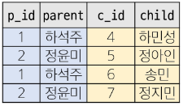

- SELF JOIN 활용
  - 서로의 형제자매가 누구인지 id와 이름 조회
    ```SQL
    SELECT 
      users.id AS user_id, 
      users.name AS user_name, 
      sibling.id AS sibling_id, 
      sibling.name AS sibling_name
    FROM 
      users
    JOIN 
      users sibling ON users.parent_id = sibling.parent_id
    WHERE 
      users.id != sibling.id;
    ```
    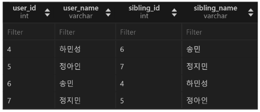


## Subquery
하나의 SQL문 안에 포함되어 있는 또 다른 SQL문

-> 복잡한 데이터를 이용하여 검색하거나 값을 비교할 때 사용

- Subquery 사용 방법
  - 서브 쿼리는 괄호를 감싸서 사용
  - 서브쿼리 사용이 가능한 곳
    - `SELECT` 절
      - 일반적으로 계산된 값을 하나 이상의 컬럼으로 변환해야 할 때 사용
    - `FROM` 절
      - 중간 집계나 계산, 결과 재사용, 조인 조건 단순화 할 때 사용
    - `WHERE` 절
      - 특정 조건을 만족하는 데이터를 필터링하거나 검색할 때 사용
    - 그 외 `HAVING`절, INSERT문의 `VALUES`절, UPDATE문의 `SET`절에서 사용 가능
  
- Subquery 종류
  - 단일 행 서브쿼리 (Single-row Subquery)
  - 다중 행 서브쿼리 (Multi-row Subquery)
  - 다중 열 서브쿼리 (Multi-column Subquery)

### Single-row Subquery (단일 행 서브쿼리)
실행 결과가 항상 1건 이하인 서브쿼리

-> 비교연산자(`=`, `<`, `>`, `<=`, `>=`, `<>`)와 함께 사용

- Single-row Subquery 활용
  - 'North America' 대륙의 평균 인구보다 인구가 많은 국가의 이름과 인구 조회
    ```SQL
    -- 'North America' 대륙의 평균 인구
    SELECT AVG(Population) FROM country WHERE Continent = 'North America';

    SELECT 
      Name, Population
    FROM 
      country
    WHERE 
      Population > (
        SELECT AVG(Population) 
        FROM country
        WHERE Continent = 'North America'
        -- 서브쿼리 결과: 13053864.86 -> 단일행
      );

    -- 단일행이 아닐 때 에러 발생

    -- SELECT 
    --   Name, Population
    -- FROM 
    --   country
    -- WHERE 
    --   Population > (
    --     SELECT Population
    --     FROM country
    --     WHERE Continent = 'North America'
    --   );
    ```
    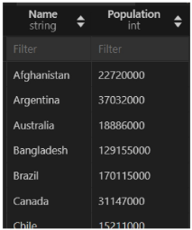

  - country 테이블의 ‘Benin’ 이라는 국가의 국가 코드를 이용하여, city 테이블에 등록된 ‘Benin’의 모든 도시 정보를 조회
    ```SQL
    -- country 테이블의 ‘Benin’ 이라는 국가의 국가 코드
    SELECT Code FROM country WHERE Name = 'Benin';

    SELECT
      * 
    FROM 
      city
    WHERE 
      CountryCode = (
        SELECT Code FROM country WHERE Name = 'Benin'
      );
    ```
    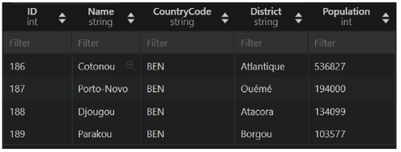

  - country 테이블의 각 국가 마다 해당 국가 소속의 평균 도시 인구를 ​city 테이블을 이용하여 조회​
    ```SQL
    -- Single-row Subquery
    -- 아래 쿼리는 country 정보를 얻을 수 없으므로 실행 불가
    -- SELECT AVG(city.Population) FROM city WHERE city.CountryCode = country.Code;

    -- 메인 쿼리의 country 테이블 정보를 활용하여
      -- 서브 퀴리에서 필요 정보 집계하여 평균 값 1개를 반환
    SELECT 
      country.Name AS CountryName,
      (
        SELECT AVG(city.Population) 
        FROM city 
        WHERE city.CountryCode = country.Code
      ) AS AvgCityPopulation
    FROM country;
    ```

- 단일 행 서브쿼리 정리
  - 단일 행 서브쿼리는 항상 단일 값을 반환
    - WHERE절이나 SELECT절에 사용하는 것이 일반적
  - 비교 연산자 사용 시 단일 행 서브 쿼리 사용
    - 비교 대상인 서브 쿼리의 값이 여러 개가 나올 시 에러 발생
  
### Multi-row Subquery (다중 행 서브쿼리)
실행 결과가 여러 개의 결과 행을 반환할 수 있는 서브쿼리

-> `IN`, `ANY`, `ALL` 연산자와 함께 사용

- Multi-row Subquery 활용
  - Asia에 속하는 모든 도시 조회
    ```SQL
    -- 대륙 정보가 Asia인 국가의 코드
    SELECT Code FROM country WHERE Continent = 'Asia';

    -- Asia 에 소속된 모든 도시를 조회
    SELECT * 
    FROM city
    WHERE 
      CountryCode IN (  -- CountryCode = (SELETE..) 처럼 비교 연산자 쓰면 에러발생
        SELECT Code
        FROM country
        WHERE Continent = 'Asia'
      )
    ```
    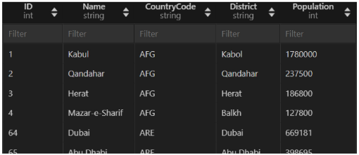
  
  - 인구가 10,000,000명 이상인 국가들의 국가 코드, 도시 이름, 지구, 인구를 조회
    ```SQL
    -- 인구가 10,000,000명 이상인 국가들의 국가 코드
    SELECT Code FROM country WHERE Population >= 10000000;

    SELECT co.Code, c.Name, c.District, c.Population
    FROM 
      city c
      JOIN (SELECT Code
            FROM country
            WHERE Population >= 10000000) co
        ON c.CountryCode = co.Code;
    ```
    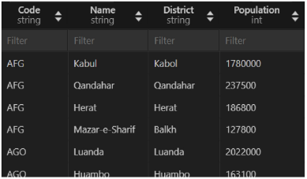
  
- 다중 행 서브쿼리 정리
  - 다중 행 서브쿼리는 **2개 이상의 값**을 반환
    - 단순 비교 연산자 사용할 수 없음
  - `IN`, `ANY`, `ALL` 연산자와 함께 사용
    - WHERE과 HAVING절에서 주로 사용됨
  
### Multi-column Subquery (다중 컬럼 서브쿼리)
실행 결과가 하나 이상의 컬럼을 반환하는 서브쿼리

-> 주로 비교 연산자나 `EXISTS`, `IN` 연산자와 함께 사용

- Multi-column Subquery 활용
  - 각 대륙별 독립 연도가 최근인 국가의 이름, 대륙, 독립 연도를 조회
    ```SQL
    -- 각 대륙별 독립 연도
    SELECT Continent, MAX(IndepYear)
    FROM country
    GROUP BY Continent;

    SELECT 
      Name, Continent, IndepYear
    FROM country
    WHERE (Continent, IndepYear) IN (
        SELECT Continent, MAX(IndepYear)
        FROM country
        GROUP BY Continent
    );
    ```
    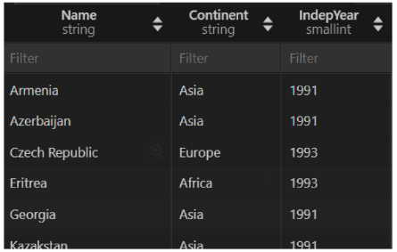

  - Africa에서 가장 땅이 넓은 국가의 이름, 대륙, 면적을 조회
    ```SQL
    SELECT 
      Name, Continent, SurfaceArea
    FROM country
    WHERE (Continent, SurfaceArea) = (
        SELECT Continent, MAX(SurfaceArea)
        FROM country
        GROUP BY Continent
        HAVING Continent = 'Africa'
    );
    ```
    

- 다중 컬럼 서브쿼리 정리
  - 다중 컬럼 서브쿼리의 결과로 여러 개의 컬럼이 반환됨
    - 주로 메인 쿼리의 조건과 동시에 비교됨


## Database Index
### INDEX
데이터베이스에서 데이터를 보다 빠르게 찾기 위해 사용되는 **자료구조**

-> 책에서 원하는 부분을 처음부터 찾는 것이 아닌, 목차를 보고 빠르게 찾을 수 있는 방식과 유사함

- Index 사용 장점
  - 조회하는 속도가 전반적으로 빠름
  - 시스템의 부하가 적음

- Index 사용 단점
  - 인덱스 정보를 추가로 저장하기 위한 저장 공간이 필요
  - 삽입, 수정, 삭제가 빈번한 테이블인 경우 성능이 오히려 떨어짐

- Index 종류
  - 기본 인덱스
    - 일반적으로 선언했을 때의 인덱스
    - 인덱스로 설정된 컬럼의 데이터에 NULL값이 존재할 수 있음
    - 인덱스가 설정된 컬럼의 데이터에 중복이 있을 수 있음
    - ex. city 테이블의 CountryCode 컬럼을 Index로 설정했을 때 KOR 데이터가 중복될 수 있음

  - 유니크 인덱스
    - `UNIQUE` 키워드와 함께 선언했을 때의 인덱스
    - 인덱스를 설정할 컬럼의 데이터들은 각각 고유한 값이어야 함
    - 중복된 데이터가 존재할 시 `Duplicate entry` 에러 발생
      - 컬럼을 추가로 구성하여 고유한 값으로 구성하면 해결
    
### Index 생성/추가
- 사전준비
  ```SQL
  USE world;

  -- DROP INDEX code_idx ON city;
  ```

- Index 생성하기
  ```SQL
  -- Index 생성하기
  CREATE TABLE table_name (
    column1 INT PRIMARY KEY AUTO_INCREMENT,
    column2 VARCHAR(150) DEFAULT NULL,
    column3 VARCHAR(30),
    -- 생성하기 1 (INDEX 키워드 사용)
    INDEX index_name (column2),
    -- 생성하기 2 (KEY 키워드 사용)
    KEY index_name2 (column3)
  );
  ```
  - 어떤 컬럼을 인덱스로 설정하는 것이 좋을까?
    - 자주 검색되는 컬럼
    - 중복 데이터가 적은 컬럼

- Index 추가하기
  - CREATE INDEX 구문을 이용해서 추가하는 방법
    ```SQL
    CREATE INDEX index_name
    ON table_name (column1, column2, ...);
    ```
  
  - ALTER TABLE 구문을 이용해서 추가하는 방법
    ```SQL
    ALTER TABLE table_name
    ADD INDEX index_name (column1, column2, ...);
    ```

- INDEX 생성과 INDEX 추가의 차이점
  - 둘 다 INDEX를 설정하는 것은 동일하지만
  - **테이블 생성 시 인덱스를 정의하는 것이 좀 더 효율적**
    - 데이터가 없기 때문에 Index 설정하는 시간이 적음
    - 이미 테이블에 많은 데이터가 존재하는 상태에서 index를 추가한다면
    - 추가된 Index 설정을 위해 일시적으로 데이터베이스 시스템에 영향이 있을 수 있음
  
### Index 사용
- 이미 생성된 city 테이블에는 **Name 컬럼**과 **CountryCode 컬럼**이 인덱스로 설정되어 있음
  ```SQL
  SHOW CREATE TABLE city;
  ```
  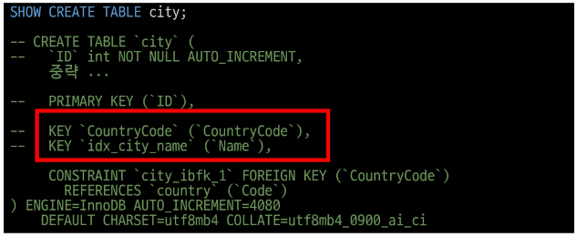

- WHERE 절에서 사용
  ```SQL
  SELECT * FROM city
  WHERE Name = 'Seoul';
  ```
  - 기존 WHERE절 사용하는 것과 동일
  - 내부적으로 INDEX를 통해 빠르게 데이터 접근하게 됨

- ORDER BY에서 사용
  ```SQL
  SELECT * FROM city
  ORDER BY Name;
  ```
  - Name 컬럼에 인덱스가 있어 정렬도 효과적으로 수행됨

- JOIN에서 사용
  ```SQL
  SELECT city.Name, country.Name 
  FROM city
  JOIN country ON city.CountryCode = country.Code
  WHERE city.Name = 'Seoul';
  ```
  - city 테이블의 CountryCode 컬럼이 인덱스로 설정되어 있어 JOIN 실행 시 빠르게 수행됨

### Index 삭제
- ALTER TABLE을 이용하여 INDEX 삭제 가능
  ```SQL
  ALTER TABLE table_name
  DROP INDEX index_name;
  ```
  - 다른 데이터베이스 객체(열 추가, 삭제)와 일관된 구문을 유지할 수 있어 일반적으로 사용되어짐

- DROP INDEX를 이용하여 INDEX 삭제 가능
  ```SQL
  DROP INDEX index_name
  ON table_name;
  ```
  - 작업의 명확성을 높이고 싶을 때 사용

- 인덱스 정리
  - 데이터를 주로 탐색, 정렬할 때 매우 효율적
    - 단, 데이터 양이 적은 경우는 이점이 크지 않을 수 있음
  - 인덱스는 주로 유일한 값을 가진 컬럼을 사용할수록 유리
  - 과도한 인덱스 사용은 데이터의 추가, 수정, 삭제가 일어날 때마다 성능 저하가 발생할 수 있음
  - 추가 공간을 필요로 하기 때문에 비용적인 측면도 같이 고려해야 함


## 참고
### VIEW
데이터베이스 내에서 저장된 쿼리의 결과를 가상으로 나타내는 객체로, 가상 테이블이라고도 함

-> 실제 데이터를 가지고 있지 않고, 실행 시점에 쿼리를 실행하여 결과를 생성하여 보여줌

-> 클라이언트들이 이 가상 테이블에 접근하는 것!

- VIEW 장점
  - 편리성
    - 복잡한 쿼리를 미리 정의된 뷰로 만들어 단순화 가능
  - 보안성
    - 사용자가 데이터베이스 일부만 볼 수 있도록 제한 가능
  - 재사용성
    - 동일한 뷰를 여러 쿼리에서 사용 가능
  
- VIEW 생성하기
  ```SQL
  CREATE VIEW
    view_name
  AS
    select_statement;
  ```
  - CREATE VIEW 이후 뷰 이름 설정
    - 뷰 이름은 `v_`와 같은 접두사를 이용하여 일반 테이블과 구분
  - AS 키워드 이후 데이터는 SELECT 구문을 이용
  - view 사용 방법은 설정한 view_name을 이용

- VIEW 활용
  - 국가 코드와 이름을 v_simple_country라는 이름의 view로 생성
    ```SQL
    CREATE VIEW v_simple_country AS
    SELECT Code, Name
    FROM country;
    ---
    SELECT *
    FROM v_simple_country;
    ---
    DROP VIEW v_simple_country;
    ```
    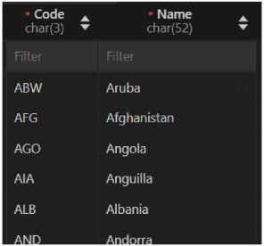

  - 각 국가별 가장 인구가 많은 도시를 조인한 뷰를 v_largest_city_per_country 라는 이름의 view로 생성
    ```SQL
    CREATE VIEW v_largest_city_per_country AS
    SELECT 
      c.Name AS CountryName, 
      ci.Name AS LargestCity, 
      ci.Population AS CityPopulation,
      c.Population AS CountryPopulation
    FROM country c
    JOIN city ci ON c.Code = ci.CountryCode
    WHERE (ci.CountryCode, ci.Population) IN (
        SELECT CountryCode, MAX(Population)
        FROM city
        GROUP BY CountryCode
    );
    ---
    SELECT * FROM V_largest_city_per_country;
    ```
    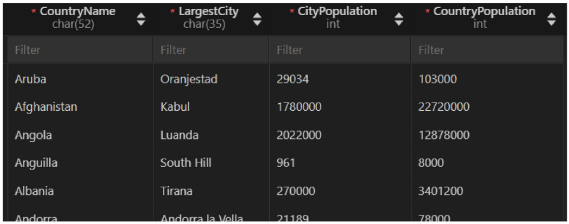
  
  - v_largest_city_per_country 뷰를 이용하여 Asia 국가 중 가장 인구가 작은 곳 보다 인구가 많은 모든 도시의 개수를 조회
    ```SQL
    -- 생성한 View 활용
    SELECT COUNT(*) AS CountCity
    FROM v_largest_city_per_country
    WHERE CityPopulation >= (
      SELECT MIN(Population)
      FROM country
      GROUP BY Continent
      HAVING Continent = 'Asia'
    );
    ---
    DROP VIEW v_largest_city_per_country;
    ```
    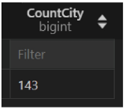
  
- VIEW 삭제하기
  ```SQL
  DROP VIEW
    view_name;
  ```
  - DROP VIEW 이후 삭제할 뷰 작성


### B-tree
- B-tree 구조
  - 가장 일반적으로 사용하는 Index 구조

    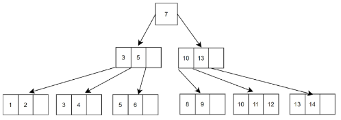
  - 이진 탐색 트리의 한계 (최악의 경우 `O(N)`)를 보완한 것이 B-tree
  - B-tree는 하나의 레벨에 많은 자료를 저장할 수 있어 높이가 낮음
    - Tree의 높이가 낮다는 의미는 leaf node까지의 거리가 짧아 탐색 성능이 좋다는 의미
    - B-tree는 항상 `O(logN)`의 성능을 가짐
  