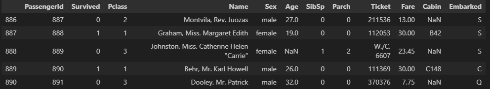

# Pandas 기초
## 데이터 분석 개론
### 데이터 분석의 중요성 및 역할
- 데이터 분석은 왜 하나요?
  - ex. 카페를 차리고 싶은데 어느 지역에 차려야 할까?
    - 대학가에 열면 장사가 더 잘될까? -> 대학별 거주인구와 지역별 카페의 폐업률 분석
  - ex. 새로운 음식 배달 서비스를 시작하고 싶은데 어느 시간대에 집중할까?
  - ex. 어떤 마케팅 캠페인을 실행할지 결정하고 싶은데 어떤 전략이 효과적일까?
  - 등등
  - **즉, 합리적인 의사 결정을 위해 데이터 분석이 필요함**
    - 갖고 있는 자원에서 최적의 선택을 하는 것이 중요함!
  - 데이터 기반 의사결정

### 데이터 분석 프로세스 이해
- 데이터 분석은 어떻게 하나요?
  - 가설 설정 및 데이터 만들기(가설 검증을 위해)
    - 인터뷰, 리서치, 데이터 설계 후 수집
  - 쌓인 데이터에서 필요한 데이터를 선별 및 조회 
    - 쿼리 조회, 데이터 가공, 인프라 구축
  - 데이터 기반 가설 검증
    - 통계적 분석, 수학적 모델링
  - 결과 공유
    - 데이터 시각화, PPT 작성, PT

- 데이터 분석 절차
  - Step1. 문제 정의
    - ex. 신규 공동주택 단지에 초등돌봄센터의 규모는 얼마가 되어야 할까?
    - ex. 도서지역의 헬기를 통한 응급환자 이송 중단율이 너무 높아! 대책이 필요햇
  - Step2. 데이터 기획
    - ex. 전입/전출 현황, 동별인구 현황, 초/중학교 수 , 연령대별 인구, 인근 병원 수
    - ex. 섬별/월별 헬기 이송 건수, 섬별 이송 거리/시간, 건강검진 및 진료내역
  - Step3. 데이터 수집
  - Step4. 데이터 전처리
  - Step5. 데이터 시각화
  - Step6. 분석 및 인사이트 도출

### 데이터 분석의 역할
- 서비스 현황을 수치로 표현하고 인사이트 도출
- 어느 서비스가 더 좋은지 가설 검증을 위한 A/B 테스트 진행
- 고객에 대한 데이터에서 의미 있는 결과를 뽑아내기 위해 보고서 작성

※ 현업의 사례

-> 마케팅 분석 / 고객 인사이트 / 비즈니스 성과

- 구체적인 분석 업무 사례
  - 비즈니스 성과
    - 어떤 가격이 가장 매출을 높일 수 있는 가격일까?
    - 알라미: Pricing 실험, 연구독 vs 월구독 어떤걸 더 많이 팔아야 효과적일까?
    - 쏘카: 10시간 이상 빌리는 경우 요금 10% 이상 인하 실험, 차량 가동률 2배 상승

  - 마케팅
    - 지난주 유입은 왜 떨어졌을까? 쿠폰을 몇퍼센트 제공해야 할까?
  
  - 고객 인사이트
    - 고객은 왜 이탈할까?

※ 이런식으로 데이터 분석 하는 것이 중요한 이유는 **기업이 중요한 의사 결정을 데이터 기반으로 정확하고 효과적으로 할 수 있기 때문**

  - 예시
    - 업무: 코로나 시절 쏘카 대여존 모니터링, 대여존 별 증차량/감차량 결정하는 업무
    - 현상: 한양대존에 쏘카존 이용시간 감소 포착 but, 매출은 오히려 증가
      - 매출이 증가했으니 차량수를 늘려야 할까?
      - 매출은 왜 급격히 오른걸까?

        
    - 과거 분석 결과: 연령별로 시간 당 매출이 많아 차이가 난다는 것을 알게됨(과거 데이터 기반)
    - 한양대존의 매출을 연령별로 나누어 본 결과
      - 비대면 수업으로 20대 감소, 30대 이상 증가

        
    - 한양대존의 30대 수요가 증가한 곳은 한양대존 근처 뚝섬지역에서 발생했을 것이라 추측(가정)
    - 예약 위치 살펴보니, 뚝섬 근처 업무 지구였고, 뚝섬의 쏘카존은 차량이 매우 부족한 상태임을 확인
      - 뚝섬의 차량이 부족해져서 한양대까지 와서 쏘카를 빌리는 것이었음
    - 결론: 증차가 필요한 곳은 뚝섬이고, 한양대존의 차량도 뚝섬으로 옮겨야 함
  
### 데이터 관련 직무
- 데이터 분석가
  - 정형화된 데이터 기반으로 통계적 분석, 시각화, 인사이트 도출하는 역할

- 데이터 사이언티스트
  - 수학적 모델 (머신러닝, 인동지능)을 다루는 역할
  - 데이터 분석가가 하는 업무도 포함해서 함

- 데이터 엔지니어
  - 데이터 수집, 정제, 저장 등 파이프라인 구축하고 자동화하는 역할

- ML/DL 엔지니어
  - 머신러닝, 딥러닝 모델을 실제 서비스에 적용하게 만들어주는 역할

- PM
  - 데이터 활용하여 기획, 전략


### 데이터 계열 직무의 필요 역량


### 파이썬 머신러닝 생태계


## Pandas 개념 및 활용
### Pandas
관계형(relational) 혹은 레이블(labeling)된 데이터를 효율적으로 다루기 위해 설계된 Python 기반의 데이터 분석 라이브러리

- Pandas 특징
  1. 빠르고 유연하며 표현력이 풍부한 데이터 구조 제공
  2. 다양한 데이터 분석 작업을 손쉽게 처리할 수 있도록 고수준의 빌딩 블록(high-level building blocks) 제공
  3. 오픈소스 라이브러리이므로 누구나 자유롭게 사용
  4. NumPy 기반으로 개발되었기 때문에, 과학 계산 및 머신러닝 라이브러리들과의 호환성과 통합성을 갖춤

- Pandas에서 다룰 수 있는 데이터 타입
  1. SQL table, Excel spreadsheet 와 같이 '유형이 다른 열들을 포함할 수 있는 표 형식의 데이터(Tabular data)'
  2. 순서가 있거나(Ordered) 없는(Unordered) 데이터
  3. 시계열(Time series) 데이터
  4. 행 및 열이 있는 임의의 행렬 데이터
      - 행렬의 각 구성요소가 다른 유형의 데이터들도 가능
  5. 다른 유형의 관찰/통계 데이터셋
      - 명시적인 레이블이 없어도 유연하게 처리 가능
      - 즉, 정형화된 데이터는 웬만하면 다룰 수 있음
  
- Pandas에서 제공하는 Data structure
  - Series (1차원)
    - 한 줄 짜리 데이터 목록으로 모든 값이 같은 타입
  
  - DataFrame (2차원)
    - 각 열(column)의 데이터 타입이 다를 수 있으며, 크기를 자유롭게 조절할 수 있는 형태
    - RDB에서 테이블 형태와 동일

    

- Pandas 장점
  - 결측치 처리 용이
    - NaN 값으로 결측치 표현, `dropna`, `fillna` 등 제공
  - 행/열 추가, 삭제 간편함
    - `append`, `drop` 등으로 손쉽게 조작
  - 정렬 기능
    - 자동 또는 `sort_values`, `sort_index`로 명시적 정렬 가능
  - GroupBy 제공
    - SQL처럼 그룹 단위 집계 가능
  - 다양한 객체 변환
    - 리스트, 딕셔너리, NumPy 등에서 DataFrame 생성 가능
  - Merge/Join 지원
    - `merge`, `join`, `concat` 등으로 데이터 결합
  - 파일 입출력 지원
    - `CSV`, `Excel`, `DB`, `JSON` 등 다양한 포맷 읽기/쓰기 가능

### DataFrame, Series, Index
Pandas의 주요 구성 요소

- DataFrame
  - `Columms X Rows` 2차원 데이터

    
  
- Series
  - 1개의 `Column` 값으로만 구성된 1차원 데이터

    


## 데이터 프레임 생성 및 조작
### Pandas 주요 메서드
- `read_csv()` : CSV 파일을 데이터프레임으로 불러옴
- `head()` : 데이터프레임의 상위 몇 개의 행을 불러옴
- `shape` : 데이터프레임의 행과 열 개수 출력
- `info()` : 데이터프레임의 컬럼, 데이터타입, 결측치 정보를 출력
- `describe()` : 수치형 데이터의 요약 통계 제공
- `value_counts()` : 특정 컬럼의 값 개수를 세어 출력
- `sort_values()` : 특정 컬럼 기준으로 정렬

### Pandas를 이용한 테이블 데이터 처리
- DataFrame 생성
  ```python
  import pandas as pd

  d1 = {
      'Name': ['Jiwon', 'YuJeong', 'Minwoo', 'Jihoon'],
      'Year': [2021, 2024, 2025, 2023],
      'Class': ['Java', 'Data', 'AI', 'Data']
  }

  # 딕셔너리를 DataFrame으로 변환
  data_df = pd.DataFrame(d1)
  print(data_df)
  print("*"*30)

  # 새로운 컬럼명을 추가
  data_df = pd.DataFrame(d1, columns=["Name", "Year", "Class", "Age"])
  print(data_df)
  print("*"*30)

  # 인덱스를 새로운 값으로 할당
  data_df = pd.DataFrame(d1, index=['one', 'two', 'three', 'four'])
  print(data_df)
  print("*"*30)
  ```
  

- 표 형태 데이터 읽기(file 읽기)

  
  - csv, excel file 읽기
    ```python
    import pandas as pd

    # Titanic 데이터 CSV 파일 로드
    titanic = pd.read_csv("./data/titanic.csv")
    
    # Titanic 데이터 excel 파일 로드
    titanic = pd.read_excel("titanic.xlsx", sheet_name="passengers")

    # DataFrame 출력
    titanic.head()
    ```
    

- DataFrame의 컬럼명과 인덱스
  ```python
  # 데이터프레임의 컬럼명 출력
  print("columns:", titanic.columns)

  # 데이터프레임의 인덱스 출력
  print("index:", titanic.index)

  # 인덱스 값을 배열 형태로 출력
  print("index value:", titanic.index.values)
  ```
  

- head와 tail
  - `head()`
    - 데이터프레임의 맨 앞에서부터 일부 데이터만 추출
      ```python
      titanic.head()
      ```
      
  
  - `tail()`
    - 데이터프레임의 맨 뒤에서부터 일부 데이터만 추출
      ```python
      titanic.tail()
      ```
      

- Sheap
  - 데이터프레임의 행과 열 크기를 가지고 있는 속성
    ```python
    print('dataframe 크기: ', titanic.shape)
    # dataframe 크기: (891, 12)
    ```

- `info()`
  - 데이터프레임 내의 컬럼명, 데이터타입, Null 갯수, 데이터 개수 정보를 제공
    ```python
    # 데이터프레임의 기본 정보 출력
    titanic.info()
    ```
    

- `describe()`
  - 데이터 값들의 평균, 표준편차, 4분위 분포도를 제공
  - **숫자형** 컬럼들에 대해서만 해당 정보를 제공
    ```python
    # 데이터프레임의 요약통계 정보 출력
    titanic.describe()
    ```
    

- `value_counts()`
  - 동일한 개별 데이터 값이 몇 건 있는지 확인
  - Null값을 무시하고 결과값 리턴
    - 기본 인자값 `dripna = True`
    ```python
    # 데이터프레임의 개별 데이터 값이 몇 건이 있는지에 대한 정보
    titanic.value_counts()
    ```
    ```python
    print("titanic 데이터 건수:", titanic.shape[0])  # 총 데이터 개수 출력

    print ("기본 설정인 dropna=True로 value_counts()")
    print(titanic["Embarked"].value_counts())  # 기본 설정

    print("\n dropna=False로 value_counts()") 
    print(titanic["Embarked"].value_counts(dropna=False))  # NaN 포함
    ```
    

- DataFrame의 새로운 컬럼 생성 및 수정
  - 새로운 컬럼 'Age_new'를 생성하고 일괄적으로 0을 할당
    ```python
    # 새로운 컬럼 `Age_new`를 생성
    titanic["Age_new"]=0
    titanic.head()
    ```
    

- DataFrame 데이터 삭제 `drop()`
  - `drop(labels=None, axis=0, index=None, columns=None, level=None, inplace=False, errors='raise')`

  - 로우 삭제 시 `axis = 0` (기본값) / 컬럼 삭제 시 `axis = 1`로 설정

  - 컬럼 'Age_new' 삭제
    ```python
    # 행 삭제시axis = 0 / 컬럼 삭제시 axis = 1으로 설정
    titanic.drop("Age_new", axis=1, inplace=True)
    titanic.head()
    ```

  - 여러 행을 삭제하는 경우 리스트로 삭제할 행 입력
    ```python
    # 삭제 전 데이터 출력
    print("### before axis=0 drop ###")
    titanic.head(6)  # 상위 6개 행 출력

    # 특정 행 삭제 (index 0, 1, 2 삭제)
    titanic.drop([0, 1, 2], axis=0, inplace=True)

    # 삭제 후 데이터 출력
    print("### after axis=0 drop ###")
    titanic.head(3)  # 상위 3개 행 출력
    ```

    

    
  
  - inplace
    - `inplace = False`
      - 원본 데이터프레임은 유지하고, 드롭된 df를 새롭게 객체 변수로 받고싶은 경우 설정
    - `inplace =True`
      - 원본 데이터프레임에 드롭된 결과를 적용할 경우 설정
  

## 데이터 정제 및 전처리
### 데이터의 처리
데이터 수집이 완료되면 데이터를 모델에 넣기 전에 알맞게 가공하는 과정

- 분석 결과의 질을 높이기 위해 데이터를 변형하는 과정
- 어떤 전처리를 적용하느냐에 따라 원본 데이터가 다르게 변형되므로, 결과도 달라질 수 있음

  

- 데이터 처리 방법
  - 데이터 형식 맞추기

    
  - 빈 칸 채우기(Null값 채우기)

    
  - 데이터 열 추가 (연관 데이터 추가)
    - ex. 기존 데이터를 계산을 통해 의미있는 변수로 만드는 방식

    

    
  - 데이터 열 추가 (이상치 제거)
    - 이상치

      
    
- missing 데이터 처리
  - `isna()`
    - 데이터프레임 또는 배열에서 결측값(NaN)이 있는지 여부를 True/False로 반환
  - `fillna()`
    - 결측값(NaN)을 지정한 값으로 대체
  - `dropna()`
    - 결측값(NaN)이 포함된 행 또는 열 제거

- 빈칸 채우기
  - missing 데이터 확인
    ```python
    df1 = df.reindex(index=dates[0:4], columns=list(df.columns) + ["E"])
    df1.loc[dates[0] : dates[1], "E"] = 1
    print(df1)
    ```
    

    ```python
    # 결측치가 있는 모든 행 제거
    df1.dropna(how="any")

    # 결측치를 5로 채우기
    df1.fillna(value=5)
    ```
    

    ```python
    pd.isna(df1)
    ```
    


## 데이터 인덱싱과 필터링
1. `[]`
    - 컬럼 단일 선택
      - `df['col1']` -> Series 객체 반환
    - 컬럼 여러개 선택
      - `df['col1', 'col2']` -> DataFrame 객체 반환

      
    - Boolean Indexing과 함께 사용 가능
      - `df[df['col1'] > 10]` -> 조건에 맞는 행 필터링

2. `loc[]` / `iloc[]`
    - loc
      - 행/열 이름으로 접근
    - iloc
      - 정수 위치 기반 인덱싱 (숫자 인덱스 사용)

3. Boolean Indexing
    - 조건식에 따른 필터링
  
※ DataFrame의 부분집합을 추출할 수 있을까? (열 추출)


※  DataFrame의 부분집합을 추출할 수 있을까? (행 추출)


※  DataFrame의 부분집합을 추출할 수 있을까? (행과 열 추출)


### loc / iloc
- 명칭(Label) 기반 인덱싱 `loc[]`
  - 컬럼을 추출하는 경우
    - '컬럼명' 같이 이름(label)으로 열 지정
  - 행을 추출하는 경우
    - 행의 인덱스 이름(label)을 사용해 지정
  - 행과 열 함께 지정하는 경우
    - `df.loc[행이름, 열이름]` 형식 사용

- 위치(Position) 기반 인덱싱 `iloc[]`
  - 레이블(이름)이 아닌 정수 위치로 데이터 지정
  - 가로축(행), 세로축(열)의 좌표를 기반으로 행과 열 추출
  - 행, 열의 위치값을 정수로 입력하여 선택(0부터 시작)
    - ex. `df.iloc[0, 1]` -> 첫 번째 행, 두 번째 열
  
    

- 예시
  ```python
  # 인덱스 5번 행의 "Pclass" 열 데이터 출력
  value = titanic.loc[5, "Pclass"]
  value # 3
  ```
  ```python
  # 인덱스 5번 행에서 "Name"과 "Age" 선택
  subset = titanic.loc[5, ["Name", "Age"]]
  print(subset)
  ```
  
  ```python
  # 인덱스 5~7번 행에서 "Name", "Age", "Embarked" 선택
  subset = titanic.loc[5:7, ["Name", "Age", "Embarked"]]
  print(subset)
  ```
  
  ```python
  # titanic_df의 첫 번째 행(5번 인덱스), 두 번째 열(1번 인덱스) 데이터 출력
  value = titanic.iloc[5, 1]
  value # 1
  ```
  ```python
  # 0번 행에서 1~3번째 열 선택 -> Series로 반환
  subset = titanic.iloc[0, [1, 2, 3]]
  subset
  ```
  
  ```python
  # 0~2번 행에서 1~3번째 열 선택 -> DataFrame으로 반환
  subset = titanic.iloc[0:3, 1:4]
  subset
  ```
  


### Boolean Indexing
조건식을 `[]` 안에 기입하여 간편하게 필터링 수행

- 예시
  ```python
  # 35살보다 나이가 많은 승객 추출
  titanic_boolean = titanic[titanic['Age'] >= 35]
  titanic_boolean.head()
  ```
  

  ```python
  # 'Pclass' 값이 2 또는 3인 승객만 선택
  class_23 = titanic[titanic["Pclass"].isin([2, 3])]

  # 결과 확인
  class_23.head()
  ```
  

  ```python
  # 'Pclass'가 2 또는 3인 데이터 추출 (OR 연산)
  class_23 = titanic[(titanic["Pclass"] == 2) | (titanic["Pclass"] == 3)]

  # 결과 확인
  class_23.head()
  ```
  

  ```python
  # titanic DataFrame에서 "Age" 컬럼이 NaN이 아닌(값이 존재하는) 행만 필터링
  age_no_na = titanic[titanic["Age"].notna()]
  age_no_na.head()
  ```
  

  ```python
  age_no_na.shape  # (711, 12)
  ```

  ```python
  # 조건을 사용한 행과 열 동시 추출 (loc[])
  adult_names = titanic.loc[titanic["Age"] > 35, "Name"]
  adult_names.head()
  ```
  

  ```python
  # 추가: 특정 행과 열의 값을 변경하는 코드
  titanic.iloc[0:3, 3] = "anonymous"
  ```

## 추가 개념 및 정리
### 파일 경로

```python
import pandas as pd  # Pandas 라이브러리 불러오기

# 1. Titanic 데이터셋 불러오기
df = pd.read_csv("../data/titanic.csv")
```
- 스켈레톤 파일이 csv와 동일한 경로에 있지 않으므로 경로 설정해야함
  - 만약 스켈레톤 폴더 없이, data 폴더와 스켈레톤 파일이 같은 경로에 있었다면?
    - `./data/titanic.csv`
  - 스켈레톤 파일이 스켈레톤 폴더 안에 들어있으므로 한단계 상위 폴더인 data_analysis_ws..로 옮겨가야함
    - `../data/titanic.csv`

### 데이터셋 기본 탐색
```python
# 데이터프레임의 전체적인 정보를 확인 (컬럼, 데이터 타입, 결측치 개수 등)

print(df.info())  # 데이터프레임의 전체 구조를 확인하는 함수 
print(df.shape)  # 데이터의 행과 열 개수를 확인하는 속성 
print(df.head())  # 데이터의 처음 몇 개 행을 미리 확인하는 함수
```

### 결측치
```python
# 결측치 확인
print(df.isna().sum())  # 각 컬럼별 결측치 개수를 확인하는 함수

# 결측치 처리
# (1) Age 컬럼의 결측치를 중앙값(median)으로 대체
age_median = df["Age"].median()  # 중앙값을 구하는 함수 
df["Age"] = df["Age"].fillna(age_median)  # 결측치를 중앙값으로 채우는 함수 

# (2) Embarked 컬럼의 결측치를 최빈값(mode)으로 대체
embarked_mode = df["Embarked"].mode()[0]  # 최빈값을 구하는 함수
df["Age"] = df["Embarked"].fillna(embarked_mode)  # 결측치를 최빈값으로 채우는 함수
```

### 범주형 데이터 값 분포 확인
```python
print("\n객실 등급(Pclass)별 승객 수:")
print(df["Pclass"].value_counts())  # Pclass 값 개수를 세는 함수

print("\n성별(Sex)별 승객 수:")
print(df["Sex"].value_counts())  # Sex 값 개수를 세는 함수 

print("\n탑승 항구(Embarked)별 승객 수:")
print(df["Embarked"].value_counts())  # Embarked 값 개수를 세는 함수
```

### 특정 조건에 따른 필터링
```python
# (1) 1등석 승객만 필터링
first_class_passengers = df[df['Pclass'] == 1]

# (2) 3등석에 탑승한 20세 이하 여성 승객 필터링
young_female_3rd_class = df[(df['Pclass'] == 3) & (df['Age'] <= 20) & (df['Sex'] == 'female')] 

# (3) 2등석 또는 3등석에 탑승한 남성 승객 필터링
second_or_third_class_male = df[(df["Pclass"].isin([2, 3])) & (df['Sex'] == 'male')]  
```

### 특정 분위수
```python
# 고액 요금 승객 필터링
# 요금이 상위 10%에 해당하는 값 찾기
fare_threshold = df["Fare"].quantile(0.9)  # 상위 10%의 기준값 설정

# 고액 요금 승객 필터링 (요금이 fare_threshold 이상인 승객)
high_fare_passengers = df[df['Fare'] >= fare_threshold]
print(f"\n고액 요금 승객 데이터 (상위 5개) - 기준 요금: {fare_threshold:.2f}")
high_fare_passengers.head()  # 고액 요금 승객 상위 5개 데이터 확인
```
- quantile() 함수
  - 데이터에서 특정 분위수(퍼센트) 값을 구하는 데 사용
  - ex. `quantile(0.90)`은 상위 10%에 해당하는 값의 기준을 의미합니다.
  - 기본 문법:
    - `df["컬럼명"].quantile(퍼센트)`

### loc
```python
# Pclass(선실 등급)별 요금 비교
# 각 Pclass별 승객 수 확인
print("\n선실 등급(Pclass)별 승객 수:")
print(df["Pclass"].value_counts())  # Pclass별 승객 수 출력

# Pclass별 요금(Fare) 통계 분석
# (1) 1등석 승객의 평균 및 중앙값 요금 확인
first_class_fare = df.loc[df['Pclass'] == 1, 'Fare']
first_class_fare_mean = first_class_fare.mean()  # 평균 요금 계산
first_class_fare_median = first_class_fare.median()  # 중앙값 요금 계산
print(f"\n1등석 평균 요금: {first_class_fare_mean:.2f}, 중앙값 요금: {first_class_fare_median:.2f}")

# (2) 2등석 승객의 평균 및 중앙값 요금 확인
second_class_fare = df.loc[df['Pclass'] == 2, 'Fare']
second_class_fare_mean = second_class_fare.mean()  # 평균 요금 계산
second_class_fare_median = second_class_fare.median()  # 중앙값 요금 계산
print(f"\n2등석 평균 요금: {second_class_fare_mean:.2f}, 중앙값 요금: {second_class_fare_median:.2f}")

# (3) 3등석 승객의 평균 및 중앙값 요금 확인
third_class_fare = df.loc[df['Pclass'] == 3, 'Fare']
third_class_fare_mean = third_class_fare.mean()  # 평균 요금 계산
third_class_fare_median = third_class_fare.median()  # 중앙값 요금 계산
print(f"\n3등석 평균 요금: {third_class_fare_mean:.2f}, 중앙값 요금: {third_class_fare_median:.2f}")
```

### 정렬
```python
# 승객 데이터를 요금(Fare) 기준으로 내림차순 정렬
df_sorted_fare = df.sort_values(by="Fare", ascending=False)  # Fare 기준으로 내림차순 정렬
print("\n요금(Fare) 기준 내림차순 정렬된 승객 데이터 (상위 5개):")
df_sorted_fare.head()  # 정렬된 데이터 상위 5개 확인


# 승객 데이터를 나이(Age) 기준으로 오름차순 정렬
df_sorted_age = df.sort_values(by="Age", ascending=True)  # Age 기준으로 오름차순 정렬
print("\n나이(Age) 기준 오름차순 정렬된 승객 데이터 (상위 5개):")
df_sorted_age.head()  # 정렬된 데이터 상위 5개 확인
```
- sort_values() 함수
  - 특정 컬럼을 기준으로 데이터프레임을 정렬하는 데 사용
  - 오름차순(`ascending=True`) 또는 내림차순(`ascending=False`) 정렬이 가능
  - 기본 문법:
    - `df.sort_values(by="컬럼명", ascending=True or False)`

### 가중 평균
```python
# 가중 평균 요금(Fare) 계산

# 가중 평균을 사용하는 이유:
# - 일반 평균(mean)은 모든 데이터를 동일한 가중치로 다룹니다.
# - 하지만 Pclass(선실 등급)에 따라 요금이 다르고, 1등석 승객이 더 비싼 요금을 지불하는 경향이 있음.
# - 따라서 선실 등급별 가중치를 고려하여 가중 평균을 계산하면, 보다 현실적인 요금의 중심 값을 얻을 수 있음.

# Pclass의 역수를 가중치로 사용 (1등석은 가중치가 가장 큼, 3등석은 가장 작음)
df["Pclass_weight"] = 1 / df["Pclass"]  

# 가중 평균 공식:
# Σ(Fare × 가중치) / Σ(가중치)
weighted_fare_avg = (df['Fare'] * df["Pclass_weight"]).sum() / df["Pclass_weight"].sum()
print(f"\n가중 평균 요금(Fare): {weighted_fare_avg:.2f}")
```

