# Pandas 심화
## Pandas와 Numpy
### Pandas
주로 2차원 데이터(표 형태, DataFrmae)를 다룰 때 유용

- 데이터 분석, 전처리, 조작이 편함
- 엑셀, CSV, SQL 결과 같은 표 형식의 데이터 처리에 최적화되어 있음

### NumPy
다차원 배열(1D, 2D, 3D 이상)을 다루는 데 특화됨

- 특히 딥러닝과 고성능 연산을 위해 주로 사용됨
- 3차원 이상 데이터(이미지, 시계열, 텐서 연산 등) 처리에 적합함

  

- `ndarray` 
  - N 차원(Dimension) 배열(Array) 객체

    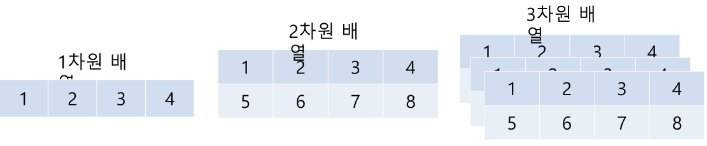
  - ndarray 생성 - `array()`
    - 인자로 주로 파이썬 list 또는 ndarray 입력
      ```python
      import numpy as np

      # 1차원 배열 생성
      array1 = np.array([1, 2, 3])

      # 2차원 배열 생성
      array2 = np.array([[1, 2, 3],
                        [4, 5, 6]])
      ```
      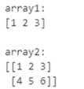
  
  - ndarray 생성 - `arange()`
    - 0부터 9까지 숫자를 순차적으로 생성
      ```python
      sequence_array = np.arange(10)
      print(sequence_array)
      print(sequence_array.dtype, sequence_array.shape)
      ```
      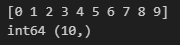

  - ndarray 생성 - `zeros()` / `ones()`
    - (3, 2) shape를 가지는 모든 원소가 0, dtype은 int32인 ndarray 생성
      ```zero_array = np.zeros((3, 2), dtype='int32')
      print(zero_array)
      print(zero_array.dtype, zero_array.shape)
      ```
      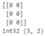
  
  - 데이터 타입 - `ndarray.dtype`
    - ndarray 내 데이터 타입은 같은 데이터 타입만 가능 -> ndarray.dtype 속성
    - 즉, 한 개의 ndarray 객체에 int와 float 함께 불가능 -> `astype()` 활용하여 형변환
      ```python
      list1 = [1, 2, 3]
      print(type(list1))

      array1 = np.array(list1)
      print(type(array1))
      print(array1, array1.dtype)
      # array1.astype(float)
      ```
      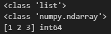
    
    - ※ Series와 데이터 타입
      - Pandas의 Series는 기본적으로 ndarray를 기반으로 함
      - 배열은 각각 타입이 같을 수도 있고 다를 수도 있음
      - 원칙적으로는 하나의 타입만 가지는 것이 이상적이지만, 실제로는 서로 다른 타입의 데이터가 섞여있을 수 있음
      - 만약 배열에 다른 타입이 섞이면, 자동 형 변환(upcasting)이 일어나거나, 최종적으로 object 타입으로 통합됨
        ```python
        import numpy as np

        # int와 float 혼합
        arr = np.array([1, 2.5, 3])
        print(arr, arr.dtype)
        # 결과: [1.  2.5  3. ] float64
        # int가 float으로 자동 변환(upcast)되어, 전체가 float64 타입으로 맞춰짐.

        # int와 문자열 혼합
        arr = np.array([1, "hello", 3])
        print(arr, arr.dtype)
        # 결과: ['1' 'hello' '3'] <U11
        # 전부 문자열(str)로 바뀜.

        # 타입이 완전히 제각각일 때
        arr = np.array([1, 3.14, "hello", [1,2]])
        print(arr, arr.dtype)
        # 결과: [1 3.14 'hello' list([1, 2])] object
        # 이 경우에는 더 이상 공통 타입으로 묶기 어렵기 때문에 object 타입으로 저장됨

        # 결론
        # 가능하다면 자동 형변환(upcasting) → int → float → complex → str 순서.
        # 불가능하면 object → 파이썬 객체 그대로 담음.
        ```
  
    - ※ Object 타입의 의미
      - object 타입은 사실상 "파이썬 객체"를 담는 형태로, 여러 타입이 섞여 있을 때 이를 수용하기 위한 장치
      - 그러나 object 타입은 NumPy의 고속 연산 최적화를 제대로 활용하지 못함
      - 즉, 연산 성능이 떨어지므로 데이터 처리를 효율적으로 하기 위해서는 가급적 하나의 명확한 데이터 타입으로 변환해 두는 것이 좋음


  - 형태(shape)와 차원(ndim)
    - 형태 - `ndarray.shape` 속성
    - 차원 - `ndarray.ndim` 속성

      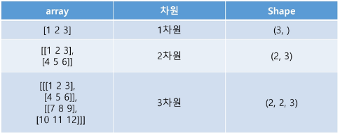

    - (2, 3) shape을 가지는 모든 원소가 1, dtype은 int32인 ndarray 생성
      ```python
      array2 = np.array([[1, 2, 3],
                        [4, 5, 6]])

      print("array2:")
      print(array2)
      print("Shape:", array2.shape)
      print("차원 수 (ndim):", array2.ndim)
      ```
      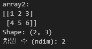
    
  - 차원과 크기 변경 - `reshape()`
    - 즉, 배열의 모양을 바꾼다
      ```python
      
      array1 = np.arange(10)
      print('array1:\n', array1)

      # (2, 5)로 reshape
      array2 = array1.reshape(2, 5)
      print('array2:\n', array2)

      # (5, 2)로 reshape
      array3 = array1.reshape(5, 2)
      print('array3:\n', array3)

      # (4, 3)으로 reshape 시도 - 오류 발생
      # array1.reshape(4, 3)  # ValueError 발생
      ```
      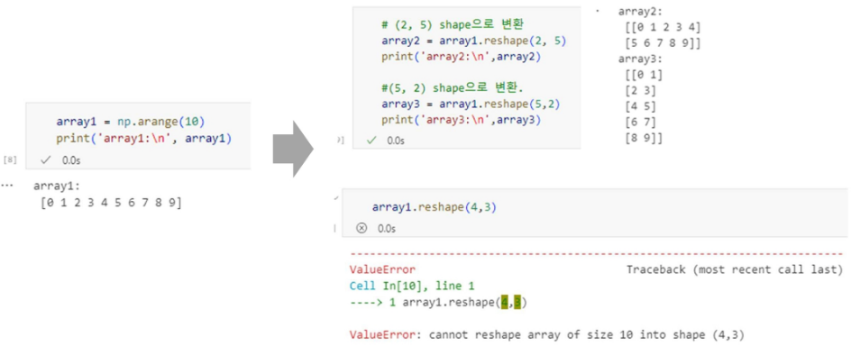
    
  - 차원과 크기 변경 - `reshape(-1, N)`
    - -1에 해당하는 axis의 크기는 가변적
    - -1이 아닌 인자 값에 해당하는 axis 크기는 인자 값으로 고정하여 shape 변환
      ```python
      array1 = np.arange(10)

      # 자동 계산 가능한 경우
      array2 = array1.reshape(-1, 5)
      print('array2 shape:', array2.shape)

      array3 = array1.reshape(5, -1)
      print('array3 shape:', array3.shape)

      # 자동 계산 불가능한 경우 - 오류 발생
      # array4 = array1.reshape(-1, 4)  # ValueError 발생
      ```
      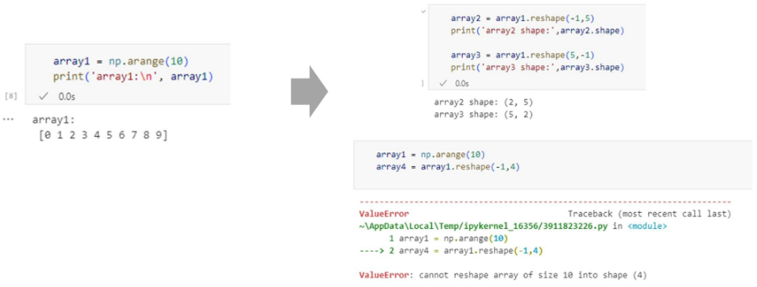

      에러 이유 설명
    
  - axis (축)
    - 행, 열, 높이 단위 XX
    - axis0, axis1, axis2와 같이 axis 단위로 부여
      - 차원 추가될 때마다 axis 늘어나고, axis0이 가장 바깥쪽 축이 됨
      - 즉, 1차원일 땐 axis0이 x축, 2차원일 땐 axis1이 y축, 3차원일 땐 axis0이 z축

      
    
    - (2, 3) shape을 가지는 모든 원소가 1, dtype은 int32인 ndarray 생성

- DataFrame과 Numpy/List/Dictionary 상호변환
  - `Numpy/List/Dictionary -> DataFrame`
    - List -> DataFrame
      ```python
      list2_df = pd.DataFrame(list, columns = col_name)
      ```
    - Numpy(ndarray) -> DataFrame
      ```python
      np2_df = pd.DataFrame(ndarray, columns=col_name)
      ```
    - Dictionary -> DataFrame
      ```python
      dict = {'col1': [1, 11], 'col2': [2, 22]}
      dict2_df = pd.DataFrame(dict)
      ```
  
  - `DataFrame -> Numpy/List/Dictionary`
    - DataFrame -> List
      ```
      DataFrame 객체의 values 속성을 이용하여 먼저 ndarray로 변환 후 tolist()를 이용하여 list로 변환
      ```
    - DataFrame -> Numpy(ndarray)
      ```
      DataFrame 객체의 values 속성을 이용하여 ndarray로 변환
      ```
    - DataFrame -> Dictionary
      ```
      DataFrame 객체의 to_dict()를 이용하여 변환
      ```


## 데이터 처리와 집계
### 데이터 처리
- 객체 생성
  - Default index인 `RangeIndex`를 사용한 객체 생성
    ```python
    import numpy as np
    import pandas as pd

    s = pd.Series([1, 3, 5, np.nan, 6, 8])
    print(s)
    ```
    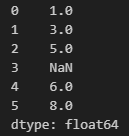
  
  - datetime index를 사용한 객체 생성
    ```python
    dates = pd.date_range("20130101", periods=6)
    print(dates)

    df = pd.DataFrame(np.random.randn(6, 4), index=dates, columns=list("ABCD"))
    print(df)
    ```
    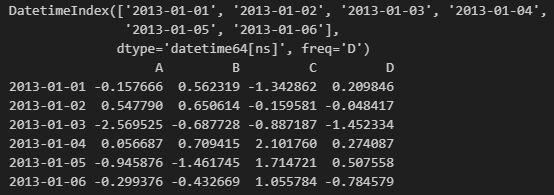

  - 딕셔너리를 사용한 객체 생성
    ```python
    df2 = pd.DataFrame({
        "A": 1.0,
        "B": pd.Timestamp("20130102"),
        "C": pd.Series(1, index=list(range(4)), dtype="float32"),
        "D": np.array([3] * 4, dtype="int32"),
        "E": pd.Categorical(["test", "train", "test", "train"]),
        "F": "foo"
    })
    print(df2)
    ```
    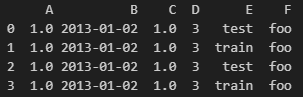

- 데이터 확인
  - 타입 확인
    ```python
    print(df2.dtypes)
    ```
    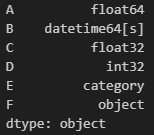

  - 데이터프레임 확인
    ```python
    print(df.head())     # 상위 5개 행
    print(df.tail(3))    # 하위 3개 행
    ```
    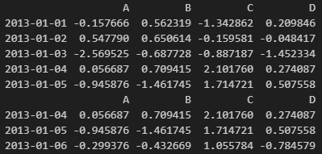

  - index, column 확인
    ```python
    print(df.index)
    print(df.columns)
    ```
    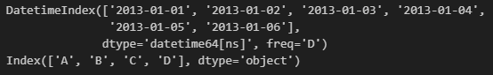

  - DataFrame을 numpy로 변환
    ```python
    print(df.to_numpy())
    ```
    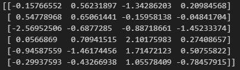
  
  - 통계 정보 확인
    ```python
    print(df.describe())
    ```
    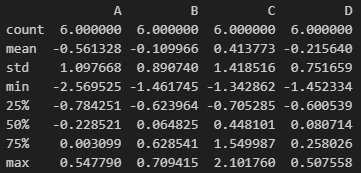
  
  - `Transpose` 연산
    - 행과 열을 바꾸는 기능
    ```python
    print(df.T)
    ```
    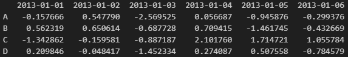

### 데이터 선택
- label을 활용한 데이터 선택
  - DataFrame에서 Series 데이터 추출
    ```python
    print(df["A"])
    ```
    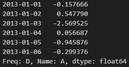

  - DataFrame에서 slice 사용하여 행들 추출
    ```python
    df[0:3]

    df["20130102":"20130104"]
    ```
    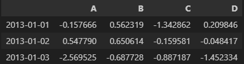
    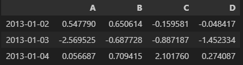
  
  - DataFrame에서 slice 사용하여 행들 추출 (label slice)
    ```python
    df.loc["20130102":"20130104", ["A", "B"]]
    ```
    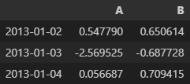
  
  - 특정 행과 열에 있는 scalar 값 추출
    ```python
    df.loc[dates[0], "A"]       # 위치 기반 접근
    df.at[dates[0], "A"]        # 가장 빠른 방식
    ```
    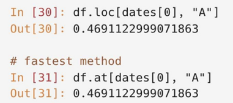

- position을 활용한 데이터 선택
  ```python
  df.iloc[3]                  # 4번째 행 전체
  df.iloc[3:5, 0:2]           # 4~5번째 행, 1~2번째 열
  df.iloc[[1, 2, 4], [0, 2]]  # 특정 행/열 조합
  df.iloc[1:3, :]             # 2~3번째 행, 전체 열
  df.iloc[:, 1:3]             # 전체 행, 2~3번째 열
  df.iloc[1, 1]               # 2행 2열 값
  df.iat[1, 1]                # 빠른 2행 2열 접근
  ```
  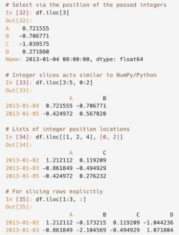

  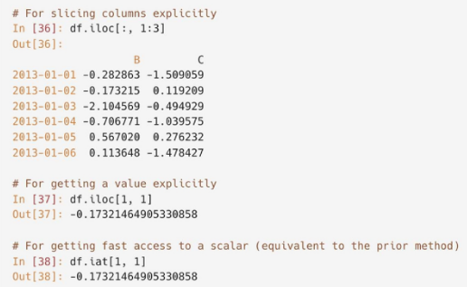

- boolean을 활용한 indexing
  ```python
  df[df["A"] > 0]             # A 열이 0보다 큰 행만

  df[df > 0]                 # 전체 DataFrame에서 양수만 표시, 나머지는 NaN
  ```
  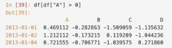

  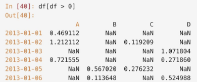

  ```python
  df2 = df.copy()
  df2["E"] = ["one", "one", "two", "three", "four", "three"]

  df2[df2["E"].isin(["two", "four"])]
  ```
  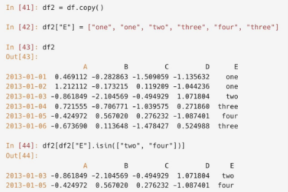

### 데이터 정렬
- `sort_values()`
  - 오름차순이 기본 (`ascending=True`)
  - 내림차순 정렬 시 `ascending=False` 설정
    ```python
    # 이름 기준 오름차순 정렬
    titanic_sorted = titanic_df.sort_values(by=['Name'])
    titanic_sorted.head(3)

    # Pclass와 Name 기준 내림차순 정렬
    titanic_sorted = titanic_df.sort_values(by=['Pclass', 'Name'], ascending=False)
    titanic_sorted.head(3)
    ```
    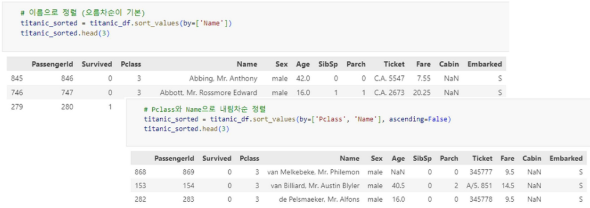

### 데이터 고유값 파악
- `unique()`
  - 컬럼 내 몇건의 고유값이 있는지 파악
    ```python
    print(titanic_df['Pclass'].nunique())
    print(titanic_df['Survived'].nunique())
    print(titanic_df['Name'].nunique())
    ```
    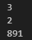    

### 데이터 집계
- DataFrame, Series에서 집계(Aggregation) 수행
  - `count()`
    ```python
    titanic_df.count()
    ```
    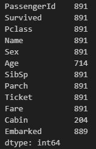

  - `mean()`
    ```python
    # 평균
    titanic_df[['Age', 'Fare']].mean()
    ```
    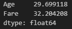
  
  - `sum()`
    ```python
    # 합계
    titanic_df[['Age', 'Fare']].sum()
    ```
    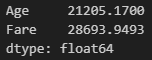
  
  - `min()`
    ```python
    # 최솟값
    titanic_df[['Age', 'Fare']].min()
    ```
    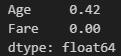

- DataFrame 그룹화
  - `groupby()`
    - 데이터를 특정 컬럼을 기준으로 묶은 후, 해당 그룹에 대해 집계 연산 수행

    - groupby() 수행 후 DataFrameGroupBy 객체 반환
      ```python
      # groupby 객체 생성
      titanic_groupby = titanic_df.groupby('Pclass')
      ```
    - 반환된 DataFrameGroupBy 객체에 대해 다양한 집계함수 적용
      ```python
      # Age와 Fare에 대해 count
      titanic_groupby[['Age', 'Fare']].count()
      ```
      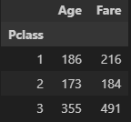
    
  - 동일한 컬럼에 대해 서로 다른 집계함수를 적용하고 싶은 경우 `agg()` 활용
    ```python
    # 최대값과 최소값을 나란히 출력
    titanic_df.groupby('Pclass')['Age'].max(), titanic_df.groupby('Pclass')['Age'].min()

    # max, min 함께 보기
    titanic_df.groupby('Pclass')['Age'].agg([max, min])
    ```
    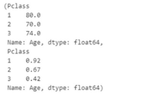
    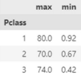

    ```python
    titanic_df.groupby(['Pclass']).agg(
        age_max=('Age', 'max'),
        age_mean=('Age', 'mean'),
        fare_mean=('Fare', 'mean')
    )      
    ```
    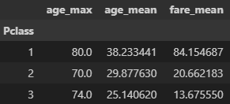
    
  - 여러 컬럼에 여러 집계함수 적용 시 **`agg()` 내에 딕셔너리 형태로** 전달
    ```python
    agg_format = {
        'Age': 'max',
        'SibSp': 'sum',
        'Fare': 'mean'
    }
    titanic_df.groupby('Pclass').agg(agg_format)
    ```
    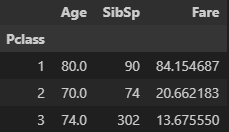

### 데이터 가공
- lambda 식 이해
  ```python
  # 일반 함수
  def get_double(a):
    return a * 2
  
  # 람다식
  lambda_double = lambda x : x * 2
  ```

- `apply()`
  - lambda식을 결합하여 데이터를 일괄적으로 가공
    - 'Name_lem' -> 이름의 길이를 일괄 계산하여 추가
      ```python
      titanic_df['Name_len'] = titanic_df['Name'].apply(lambda x: len(x))
      titanic_df[['Name', 'Name_len']].head(3)
      ```
      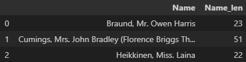
    
    - 'Child_Adult' -> 나이가 15세 이하이면 Child, 그렇지 않으면 Adult
      ```python
      # 나이 기준으로 아동/성인 구분
      titanic_df['Child_Adult'] = titanic_df['Age'].apply(lambda x: 'Child' if x <= 15 else 'Adult')
      titanic_df[['Age', 'Child_Adult']].head(8)
      ```
      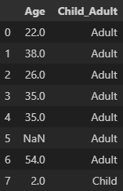

  - 일반 함수를 통해 데이터 일괄적으로 가공
    - 나이에 따라 연령대 분류하는 함수
      ```python
      def categorize_age(age):
          """
          나이에 따라 연령대를 분류하는 함수
          """
          if age <= 5:
              return 'Baby'
          elif age <= 12:
              return 'Child'
          elif age <= 18:
              return 'Teenager'
          elif age <= 25:
              return 'Student'
          elif age <= 35:
              return 'Young Adult'
          elif age <= 60:
              return 'Adult'
          else:
              return 'Elderly'

      # 'Age' 컬럼의 값을 기반으로 연령대 분류 후 'Age_cate' 컬럼에 저장
      # categorize_age(x)는 'Age'값을 입력받아 해당 연력대 카테고리를 반환함
      titanic_df['Age_cate'] = titanic_df['Age'].apply(categorize_age)

      # 'Age'와 'Age_cate' 컬럼 확인
      titanic_df[['Age', 'Age_cate']].head()
      ```
      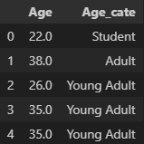

## 데이터 병합 및 변환
### 데이터 병합
- concat
  ```python
  import pandas as pd

  df1 = pd.DataFrame({'A': ['A0', 'A1', 'A2'],
                      'B': ['B0', 'B1', 'B2']})

  df2 = pd.DataFrame({'C': ['C0', 'C1', 'C2'],
                      'D': ['D0', 'D1', 'D2']})

  df3 = pd.concat([df1, df2], axis=0)  # 행 병합
  df4 = pd.concat([df1, df2], axis=1)  # 열 병합

  print(df1)
  print('\n')
  print(df2)
  print('\n')
  print(df3)
  print('\n')
  print(df4)
  ```
  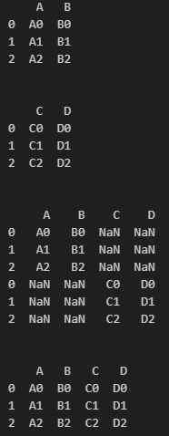


※ Merge: 공통된 key(열)을 기준으로 데이터 병합
- Inner Merge
  ```python
  import pandas as pd

  df1 = pd.DataFrame({'key': ['K0', 'K1', 'K2', 'K3'],
                      'A': ['A0', 'A1', 'A2', 'A3'],
                      'B': ['B0', 'B1', 'B2', 'B3']})

  df2 = pd.DataFrame({'key': ['K0', 'K1', 'K2'],
                      'C': ['C0', 'C1', 'C2'],
                      'D': ['D0', 'D1', 'D2']})

  df_merged = pd.merge(df1, df2, on='key', how='inner') # 교집합

  print(df1)
  print('\n')
  print(df2)
  print('\n')
  print(df_merged)
  ```
  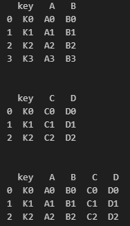

- Outer Merge 
  ```python
  import pandas as pd

  df1 = pd.DataFrame({'key': ['K0', 'K1', 'K2', 'K3'],
                      'A': ['A0', 'A1', 'A2', 'A3'],
                      'B': ['B0', 'B1', 'B2', 'B3']})

  df2 = pd.DataFrame({'key': ['K0', 'K1', 'K2'],
                      'C': ['C0', 'C1', 'C2'],
                      'D': ['D0', 'D1', 'D2']})

  df_merged = pd.merge(df1, df2, on='key', how='outer')   # 합집합

  print(df1)
  print('\n')
  print(df2)
  print('\n')
  print(df_merged)
  ```
  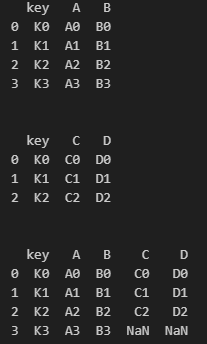

- Left Merge
  ```python
  import pandas as pd

  df1 = pd.DataFrame({'key': ['K0', 'K1', 'K2', 'K3'],
                      'A': ['A0', 'A1', 'A2', 'A3'],
                      'B': ['B0', 'B1', 'B2', 'B3']})

  df2 = pd.DataFrame({'key': ['K0', 'K1', 'K2'],
                      'C': ['C0', 'C1', 'C2'],
                      'D': ['D0', 'D1', 'D2']})

  df_merged = pd.merge(df1, df2, on='key', how='left')

  print(df1)
  print('\n')
  print(df2)
  print('\n')
  print(df_merged)
  ```
  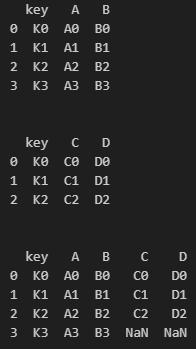

- Right Merge
  ```python
  import pandas as pd

  df1 = pd.DataFrame({'key': ['K0', 'K1', 'K2', 'K3'],
                      'A': ['A0', 'A1', 'A2', 'A3'],
                      'B': ['B0', 'B1', 'B2', 'B3']})

  df2 = pd.DataFrame({'key': ['K0', 'K1', 'K2'],
                      'C': ['C0', 'C1', 'C2'],
                      'D': ['D0', 'D1', 'D2']})

  df_merged = pd.merge(df1, df2, on='key', how='right')

  print(df1)
  print('\n')
  print(df2)
  print('\n')
  print(df_merged)
  ```
  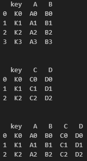

- join
  ```python
  import pandas as pd

  df1 = pd.DataFrame({
      'A': ['A0', 'A1', 'A2'],
      'B': ['B0', 'B1', 'B2']
  }, index=['K0', 'K1', 'K2'])

  df2 = pd.DataFrame({
      'C': ['C0', 'C1', 'C2'],
      'D': ['D0', 'D1', 'D2']
  }, index=['K0', 'K2', 'K3'])

  df_merged = df1.join(df2, how='left')

  print(df1)
  print('\n')
  print(df2)
  print('\n')
  print(df_merged)
  ```
  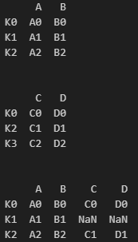

  - join 추가 예시
    ```python
    sales = pd.DataFrame({
        'customer_id': [1, 2, 3, 4],
        'product_id': [101, 102, 103, 104],
        'quantity': [5, 2, 3, 1]
    })

    customers = pd.DataFrame({
        'customer_id': [1, 2, 3, 5],
        'name': ['Alice', 'Bob', 'Charlie', 'David'],
        'city': ['Seoul', 'Busan', 'Daegu', 'Incheon']
    })

    sales = sales.set_index('customer_id')
    customers = customers.set_index('customer_id')

    merged_data = sales.join(customers, how='left')

    print(sales)
    print('\n')
    print(customers)
    print('\n')
    print(merged_data)
    ```
    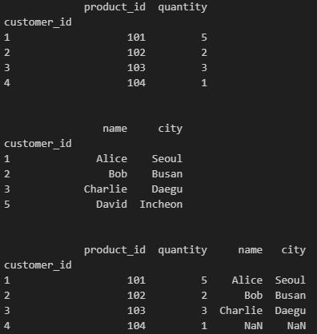

- 열 이름 변경
  ```python
  df1 = pd.DataFrame({
      'key': ['K0', 'K1', 'K2', 'K3'],
      'A': ['A0', 'A1', 'A2', 'A3'],
      'C': ['C0', 'C1', 'C2', 'C3']   # C열 추가
  })

  df2 = pd.DataFrame({
      'key': ['K0', 'K1', 'K2'],
      'C': ['C4', 'C5', 'C6'],    # C열 중복
      'D': ['D0', 'D1', 'D2']
  })

  df_merged = pd.merge(df1, df2, on='key', how='inner', suffixes=('_left', '_right'))
  # 합칠껀데 열 이름 중복되므로
  # suffixes 사용해서 _left, _right 접미사를 붙임

  print(df1)
  print('\n')
  print(df2)
  print('\n')
  print(df_merged)
  ```
  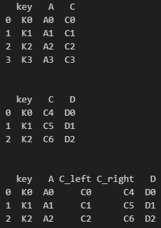

- 불필요한 열 제거
  ```python
  df1 = pd.DataFrame({
      'key': ['K0', 'K1', 'K2', 'K3'],
      'A': ['A0', 'A1', 'A2', 'A3'],
      'B': ['B0', 'B1', 'B2', 'B3']
  })

  df2 = pd.DataFrame({
      'key': ['K0', 'K1', 'K2'],
      'C': ['C0', 'C1', 'C2'],
      'D': ['D0', 'D1', 'D2']
  })

  df_merged = pd.merge(df1, df2, on='key', how='inner')
  df_merged = df_merged.drop('B', axis=1)

  print(df1)
  print('\n')
  print(df2)
  print('\n')
  print(df_merged)
  ```
  

- 여러 열 기준 병합
  ```python
  df1 = pd.DataFrame({
      'key1': ['K0', 'K1', 'K2', 'K3'],
      'key2': ['K4', 'K5', 'K6', 'K7'],
      'A': ['A0', 'A1', 'A2', 'A3'],
      'B': ['B0', 'B1', 'B2', 'B3']
  })

  df2 = pd.DataFrame({
      'key1': ['K0', 'K1', 'K2'],
      'key2': ['K4', 'K5', 'K6'],
      'C': ['C0', 'C1', 'C2'],
      'D': ['D0', 'D1', 'D2']
  })

  df_merged = pd.merge(df1, df2, on=['key1', 'key2'], how='inner')

  print(df1)
  print('\n')
  print(df2)
  print('\n')
  print(df_merged)
  ```
  

### 데이터 변환
- `replace()`
  - 원본 값을 특정 값으로 대체
    ```python
    import numpy as np

    # 예: Titanic 데이터
    replace_test_df['Sex'] = replace_test_df['Sex'].replace({'male': 'Man', 'female': 'Woman'})
    print(replace_test_df.head(10))
    ```
    
  
  - 결측값 처리시에도 사용됨
    ```python
    # NaN을 특정 값으로 대체
    replace_test_df['Cabin'] = replace_test_df['Cabin'].replace(np.nan, 'CXXX')

    # Cabin별 값 개수 확인
    print(replace_test_df['Cabin'].value_counts(dropna=False))
    ```
    


## 추가 개념 및 정리
### 이상치 탐지 및 처리
- 이상치 탐지
  ```python
  # IQR(Interquartile Range)을 사용하여 이상치 경계값 구하는 함수
  def get_iqr_bounds(series):
      """
      IQR(사분위 범위) 방법을 이용하여 이상치 경계값 반환
      - IQR = Q3(75%) - Q1(25%)
      - 이상치 기준: Q1 - 1.5*IQR 이하 또는 Q3 + 1.5*IQR 이상
      """
      Q1 = series.quantile(0.25)
      Q3 = series.quantile(0.75)
      IQR = Q3 - Q1
      lower_bound = Q1 - 1.5 * IQR  # 하한선
      upper_bound = Q3 + 1.5 * IQR  # 상한선
      return lower_bound, upper_bound

  # 이상치 경계값 계산
  age_low, age_high = get_iqr_bounds(df['Age'])

  # 이상치 개수 확인
  outliers_age = df[(df['Age'] < age_low) | (df['Age'] > age_high)]

  print(f"'Age' 이상치 개수: {len(outliers_age)}개")
  ```

- 이상치 처리
  ```python
  # 이상치를 평균값으로 대체 (단, 평균값은 정상 범위 내 값으로 계산)
  # 이상치를 제외한 평균값 계산
  age_mean = int(df[(df['Age'] >= age_low) & (df['Age'] <= age_high)]['Age'].mean())

  # 이상치를 평균값으로 대체
  df.loc[df['Age'] < age_low, 'Age']  = age_mean
  df.loc[df['Age'] > age_high, 'Age'] = age_mean

  # 이상치 처리 후 다시 확인
  print(f"최소/최대 Age: {df['Age'].min()} ~ {df['Age'].max()}")
  ```

### groupby 함수
- `groupby()`
  - 예시
    - "CustomerID"를 기준으로 데이터를 그룹화
    - 각 고객별 'PurchaseAmount' 값을 합산하여 총 소비 금액(TotalSpent) 계산
  - `reset_index()`: 그룹화된 데이터를 다시 일반 데이터프레임 형태로 변환
    ```python
    df_total_spent = df.groupby("CustomerID")["PurchaseAmount"].sum().reset_index()
    ```

### 데이터프레임 데이터 타입 확인 방법
- `df.info()`

  
- `df.dtypes`

  

### 컬럼명 변경
- `rename()`
  ```python
  df_total_spent.rename(columns={"PurchaseAmount": "TotalSpent"}, inplace=True)
  ```
  - "PurchaseAmount" -> "TotalSpent"로 변경

### cut 함수
- `cut()`
  - 예시
    - df["Age"]: 나이(Age) 데이터를 기반으로 연령대를 구분
  - `bins`: 연령 구간 설정 (0-18, 19-30, 31-50, 51-100)
  - `labels`: 각 구간에 할당할 라벨(Teen, Young Adult, Adult, Senior)
  - `right=False`: 오른쪽 경계값(예: 18)은 포함하지 않도록 설정 (0 ≤ x < 18은 Teen)
    ```python
    df["AgeGroup"] = pd.cut(df["Age"], bins=bins, labels=labels, right=False)
    ```
  - 실제 적용
    ```python
    # 연령대별 평균 소비 금액 계산
    # 연령대를 나누는 기준을 설정 (Pandas의 cut() 사용)
    bins = [0, 18, 30, 50, 100]  # 연령대 구간 (0-18세, 19-30세, 31-50세, 51세 이상)
    labels = ["Teen", "Young Adult", "Adult", "Senior"]  # 각 구간에 대한 라벨 지정
    df["AgeGroup"] = pd.cut(df["Age"], bins=bins, labels=labels, right=False)  # 연령대 구분
    ```

### map 함수
- `map()`
  - 예시
    - df["Gender"]: 기존 성별 데이터 (0 또는 1)
  - `.map({0: "Female", 1: "Male"})`: 0 → "Female", 1 → "Male"로 변환
    ```python
    # Gender 값을 남/녀로 변환 (0: 여성, 1: 남성)
    df_gender_spent["Gender"] = df_gender_spent["Gender"].map({0: "Female", 1: "Male"})  # 성별 변환
    ```

### 인덱스
- 인덱스 재색인(reindex)
  - `reindex()`
  - 기존 DataFrame을 새로운 인덱스(index)나 컬럼(columns) 기준에 맞춰 재배치하는 것
  - 지정한 인덱스나 컬럼이 원래 없으면 NaN이 들어감
    ```python
    df1 = df.reindex(index=dates[0:4], columns=list(df.columns) + ["E"])
    df1.loc[dates[0] : dates[1], "E"] = 1
    print(df1)
    ```
    - `index=dates[0:4]` → 기존 df에서 `dates[0:4]`까지만 인덱스를 가져옴 (없는 인덱스면 NaN 들어감)
    - `columns=list(df.columns) + ["E"]` → 기존 컬럼들에 "E"라는 새 컬럼을 추가 (처음엔 NaN으로 채워짐)

- 인덱스 재설정(reset)
  - `reset_index()`
  - 현재 인덱스를 일반 컬럼으로 옮기고, 새로 0,1,2… 형태의 기본 인덱스를 다시 부여하는 것


### 결측치
- 결측치 제거 - `dropna`
  - `dropna()`: 결측치(NaN)가 있는 행을 제거하여 데이터 정제
- 결측치 채우기 - `fillna`
  ```python
  # 결측치가 있는 모든 행 제거
  df1.dropna(how="any")

  # 결측치를 5로 채우기
  df1.fillna(value=5)
  ```

