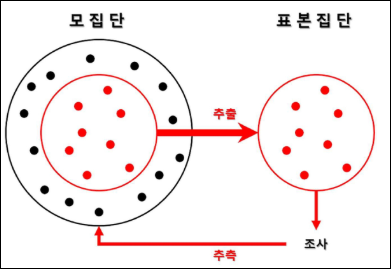

# 데이터 분석을 위한 기초 수학
## 임의표본 추출과 표본 편향, 선택 편향
### 모집단과 표본
- 모집단
  - 연구 대상이 되는 전체 집단
- 표본
  - 모집단에서 일부를 선택한 것

  

※ 모든 사람(**모집단**)을 조사할 수 없으므로, **일부를 뽑아서(표본)** 조사한 후 이를 바탕으로 **모집단의 특성을 추정**

- 표본 조사의 필요성
  - 인구조사 -> `모집단 조사`
    - 전체 국민을 조사하는 방법
    - 가장 정확하지만 시간과 비용 많이 소모함
    - ex. 대한민국의 인구 총 조사
  - 여론조사 -> `표본 조사`
    - 모든 사람을 조사하는 것이 어렵기 때문에 **일부만 조사**
    - 정확한 결과를 위해 **표본을 신중히 선택**
    - ex. 대선 후보 지지율 조사 -> 유권자가 4000만명이라면, 약 1000~2000명을 표본으로 선정해 조사
    - 만약 표본이 특정 지역이나 연령대에 편향된다면, 전체 국민의 의견을 제대로 반영하지 못하게 되니 주의할 것 (**표본 편향 발생**)

※ 표본 편향: 모집단을 잘못 대표하는 표본을 의미

### 표본 추출
모집단에서 **일부를 선택(추출)**하는 과정

- 예시
  - 떡국 맛보기
    - 떡국 전체: 모집단
    - 한 숟가락: 표본
    - 맛 보기 위해 한 숟가락을 떠서 먹어보면 대략적으로 떡국의 맛을 앎 -> 떡국 전체를 맛보면 시간이 오래 걸림
    - ※ 주의점 ※ : 잘 섞인 국물 먹어야 함 (**표본 편향 발생**)

- 표본 추출 방법

  

### 임의 추출(무작위 추출)
모집단에서 특정한 규칙 없이 **무작위**로 표본을 선택하는 방법

- 표본추출 종류
  - 복원 추출
  - 비복원 추출

- 임의 추출이 필요한 이유
  1. 공정성 유지
      - 모든 대상이 **동일한 확률**로 선택될 기회 제공
  2. 대표성 확보
      - 특정 그룹에 치우치지 않고 모집단 전체를 반영
  3. 편향 방지
      - 의도적인 선택(ex. 특정 지역, 특정 연령대만 조사)을 막아 객관적인 데이터 확보
  4. 통계 분석의 신뢰도 증가
      - 모집단을 잘 반영한 표본이면, 정확한 결론을 도출할 가능성이 높아짐
  
  

- 임의 추출(무작위 추출)과 표본 평균 비교
  - 예제 데이터: '펭귄 데이터셋'
  - 실험 내용
    - 전체 데이터에서 펭귄의 몸무게 평균
    - 여러 개의 랜덤 표본(크기=30)을 추출하여 각 표본 평균 계산
    - 모집단 평균과 표본 평균들의 차이를 히스토그램으로 표현
      ```python
      import matplotlib.pyplot as plt
      import seaborn as sns

      # 임의 표본 추출과 표본 평균 비교
      # Seaborn의 penguins 데이터셋을 불러오고 결측값 제거
      penguins = sns.load_dataset("penguins").dropna()

      # 모집단의 몸무게(body_mass_g) 평균을 계산 -> 그림의 빨간 선
      population_mean = penguins["body_mass_g"].mean()

      # 30개씩 랜덤 샘플을 1000번 추출하여 표본 평균을 구함
      sample_means = [penguins["body_mass_g"].sample(30, replace=True).mean() for _ in range(1000)]

      # 표본 평균의 분포를 시각화
      plt.figure(figsize=(8, 5))
      sns.histplot(sample_means, kde=True, bins=30, color='blue', label='Sample Means')
      plt.axvline(population_mean, color='red', linestyle='dashed', linewidth=2, label='Population Mean')  # 모집단 평균 표시

      plt.legend()
      plt.title("Distribution of Sample Means vs Population Mean")  # 그래프 제목 설정
      plt.show()
      ```
      
  
  - 해석
    - **표본 평균의 분포는 정규 분포를 따름**
    - 모집단 평균(빨간 점선)과 표본 평균의 중심(파란 히스토그램 중심)이 비슷함
    - **표본 크기가 클수록** 표본 평균의 변동성이 줄어들며, **모집단 평균과 더욱 가까워짐**
  
### 표본 편향
모집단을 대표하지 못하는 **잘못된 표본**을 선택하여 조사 결과가 왜곡된 현상

-> 대표성을 담보하는 방법은 여러가지 있지만, **핵심은 임의 표본 추출**

- 예시
  - 루즈벨트의 당선 예측 (조지 갤럽)
    - 당시 여론 조사 기관 "리터러리 다이제스트"는 240만명을 대상으로 여론조사하여, 루즈벨트는 패배할 것이라고 예상
    - 실제 선거에서는 루즈벨트의 압도적 승리
  - 왜?
    - 부유한 사람들만 표본으로 함
    - 미국 대공황 시기로 서민층은 배체했으나, 실제로는 서민층이 많았고 이들이 루즈벨트를 지지했음
  - **결과적으로 표본이 모집단을 제대로 반영하지 못함 (잘못된 여론조사)**

### 표본 편향 줄이는 방법
- 임의 추출 강화
  - **무작위**로 표본을 선택하여 **공정성**을 높이는 방법
  - 모든 개체가 동일한 확률로 선택될 기회를 가져야 함
  - 예시: 대통령 지지율 조사
    - 전국에서 유권자를 무작위 선택
    - 특정 나이대, 지역을 대상으로만 조사하면 편향 발생
  - 장점
    - 모집단을 공정하게 대표할 가능성 증가
  - 단점
    - 모집단이 크면 랜덤으로 뽑기 어려움
  - 방법
    - 제비뽑기
    - 난수 생성기 활용

- 층화 추출 활용
  - 모집단을 **그룹(층)**으로 나눈 후, 각 층에서 무작위로 표본 추출
  - 모집단 내 **특정 특성(성별, 연령, 지역, 직업 등)에 따라 그룹을 나눈 후**, 각 그룹에서 무작위로 표본 추출
  - 예시: 선거 여론 조사
    - 유권자를 성별, 나이대, 지역별로 나눈 후, 각 그룹에서 비율에 맞게 표본 추출
  - 장점
    - 모집단의 다양한 특성을 고려할 수 있고, 과소/과대 대표되는 문제를 방지
  - 단점
    - 모집단을 층화하는 과정에서 시간과 비용 소요
  - 방법
    - 모집단을 비슷한 특성으로 가진 그룹으로 나눔
    - 각 그룹에서 비율에 맞게 표본 추출

      

- 계통 추출 적용
  - **일정한 간격**으로 표본을 추출하는 방법
  - 예시: 공장 품질 검사
    - 생산된 1000개의 제품 중 처음 제품을 무작위로 선택 후, 이후 매 100번째 제품마다 품질 검사 진행
  - 장점
    - 쉽고 빠르게 표본 추출 가능
  - 단점
    - 모집단의 특정 패턴이 있다면, 편향 발생 가능
  - 방법
    - 모집단 크기 `N`, 표본 크기 `n`, `k(간격) = N / n`
    - 첫 번째 표본을 무작위 선택
    - 이후 k 간격마다 표본 선택

      

- 표본 크기 확대
  - **표본 크기를 늘려** 모집단을 더 정확히 반영
  - 예시: 대선 여론 조사
    - 표본이 500명 일 때보다 5000명일 때 더 정확한 결과 예측 가능
  - 장점
    - 표본이 클수록 결과의 신뢰도 증가
  - 단점
    - 표본이 너무 크면, 시간과 비용 많이 소요
  - 방법
    - 가능하면 더 많은 표본 확보
    - 비용과 시간을 고려하여 적절한 표본 크기 선정

      

- 편향을 보정하는 가중치 적용
  - 특정 그룹이 과소/과대 대표된 경우, **보정**하는 방법
  - 예시: 대선 여론 조사
    - 만약 여론 조사에서 20대 남성의 표본이 부족하다면, 결과 해석 시 20대 남성의 응답 비율을 더 높게 반영
  - 장점
    - 모집단을 더 정확하게 반영 가능
  - 단점
    - 가중치가 잘못 설정되면 오히려 결과 왜곡될 가능성 발생
  - 방법
    - 부족한 그룹의 응답을 보정하기 위해 가중치를 적용해 결과 반영

    
    

### 선택 편향
관측 데이터를 **선택하는 방식** 때문에 생기는 **편향**

-> 즉, 특정한 선택으로 표본이 모집단을 대표하지 못해 연구 결과가 왜곡되는 문제

- 중요한 이유
  - 선택 편향이 있으면, 연구 결과를 모집단 전체에 적용하기 어려움
  - 특정 그룹의 과소/과대 평가될 위험이 있음
  - 특히 의학연구, 사회과학 연구, 정책 결정 등에는 큰 영향을 미침

- 특정 사례
  - 사례1: 신약 임상 시험에서 선택 편향
    - 어떤 신약을 건강한 사람들만 임상 시험을 진행했다면
    - 실제로 약이 필요한 고령자, 만성질환 환자에게 효과가 다를 수 있음
  - 사례2: 병원 방문자를 대상으로 한 연구
    - 병원에서 오는 환자를 대상으로만 질병 위험 요인을 분석한다면
    - 병원을 방문하지 않는 사람들은 포함되지 않아 연구 결과가 편향될 가능성 있음

- 선택 편향이 발생하는 이유
  - 특정 그룹만 포함되는 경우
    - 연구 설계 과정에서 특정 특성을 가진 사람들만 표본으로 포함
  - 자발적 참여
    - 연구에 참여하는 사람이 스스로 결정하면, 연구에 적극적으로 참여하는 사람만 포함될 가능성이 높음
  - ex. 건강검진
    - 건강검진 연구에서 건강에 관심 있는 사람만 참여한다면 편향 발생

      

- 선택 편향 예제
  - 예제 데이터: '타이타닉'
  - 실험 내용
    - 전체 승객 데이터를 사용하여 생존율 계산
    - 특정 조건(ex. 1등석 승객만 선택)으로 필터링한 후 생존율을 다시 게산
    - 두 결과를 비교하여 선택 편향이 생기는 원리 이해
      ```python
      import matplotlib.pyplot as plt
      import seaborn as sns

      # Titanic 데이터셋을 불러오고 결측값 제거
      titanic = sns.load_dataset("titanic").dropna()

      # 전체 승객의 평균 생존률 계산
      overall_survival_rate = titanic["survived"].mean()

      # 각 등급별 생존률 계산
      survival_rates_by_class = titanic.groupby("class", observed=False)["survived"].mean()

      # 생존률 출력
      print(f"Overall Survival Rate: {overall_survival_rate:.2f}")
      print(survival_rates_by_class)

      # 시각화: 좌석 등급별 생존률 막대 그래프
      plt.figure(figsize=(8, 5))
      sns.barplot(
          x=survival_rates_by_class.index,
          y=survival_rates_by_class.values,
          palette="coolwarm"
      )
      plt.axhline(
          overall_survival_rate,
          color='black',
          linestyle='dashed',
          label="Overall Survival Rate"
      )
      plt.title("Survival Rate by Class")
      plt.ylabel("Survival Rate")
      plt.legend()
      plt.show()
      ```
      

  - 해석
    - 1등석과 전체 생존율이 거의 동일 -> 즉, 현재 데이터에서는 1등석 선택이 생존율을 바꾸는 요인XX
    - 2등석 생존율이 전체보다 훨씬 높음(80%) -> 즉, 2등석 승객만을 표본으로 석택하는 것이 생존율을 **과대 평가할 가능성이 있음**
    - 3등석 생존율이 전체 평균보다 낮음(50%) -> 즉, 3등석 승객만 포함한다면 생존율이 **과소평가되는 편향이 발생할 수 있음**

※ 선택 편향 vs 표준 편향 차이점


## 분포에 대한 이해
### 분포(Distribution)
데이터가 어떤 값 주변에 어떻게 **퍼져 있는지(흩어져 있는지)**를 나타내는 것

- 예시
  - 키 조사
    - 모든 친구의 키가 170cm라면? -> 데이터가 한 곳에 집중되어 있음(변동이 적음)
    - 친구들의 키가 150 ~ 190cm로 다양하다면? -> 데이터가 넓게 퍼져 있음(변동이 큼)
  
- 즉, 분포를 보면 데이터가 어떻게 생겼는지(좁게 모여 있는지, 넓게 퍼져 있는지)를 알 수 있음

  

- 분포의 필요성
  - 데이터의 패턴 파악
    - 데이터가 대체로 **어디에 몰려 있는지(중심경향)** 확인
  - 이상치 발견
    - 데이터를 분석할 때 극단적으로 **크거나 작은 값(이상치)**을 찾는 것이 중요
    - ex. 평균 몸무게가 60kg인데, 120kg이 포함되어 있다면 이상치 가능성
  - 비교와 예측 가능
    - 두 개 이상의 그룹을 비교할 때 **어떤 차이**가 있는지 시각적으로 확인 가능
    - ex. 남학생과 여학생의 키 분포 비교
  - 적절한 분석 방법 선택
    - 데이터의 분포 형태에 따라 **평균, 중앙값 등을 선택**하여 분석 가능
    - ex. 정규분포(대칭형)라면 평균을 사용, 왜곡된 분포라면 중앙값이 더 적절
  
- 분포 시각화 방법
  - 히스토그램
    - 데이터를 막대 그래프로 나타낸 것
    - 데이터의 전체적인 분포를 쉽게 확인 가능

      

  - 박스 플롯(Box Plot)
    - 데이터의 범위, 중앙값, 이상치를 한눈에 볼 수 있는 그래프
    - 데이터의 최소값, 최대값, 중앙값(50%), 1사분위(25%), 3사분위(75%)를 표현
    - **데이터의 퍼짐 정도(분산)**와 이상치를 확인하는 데 유용

      

  - 밀도 곡선(Density Plot)
    - 데이터를 연속적인 곡선 형태로 나타내어 데이터의 분포를 부드럽게 표현한 그래프
    - 히스토그램처럼 데이터를 나누지 않고 **연속적인 곡선으로 표현**
    - **데이터 중심**과 **분포의 형태**를 더 부드럽게 볼 수 있음

       

### 기술 통계량
데이터의 특징을 요약한 것

1. 중앙값
    - 데이터를 크기 순으로 정렬했을 때 중앙에 있는 값
2. 평균값
    - 데이터 값들의 평균 값
3. 분산
    - 데이터 평균을 기준으로 얼마나 퍼져 있는지를 나타내는 값
4. 표준 편차
    - 분산의 제곱근으로, 데이터의 필요성을 나타냄

- 이상치 발견
  - 데이터를 분석할 때 극단적으로 **크거나 작은 값(이상치)**을 찾는 것이 중요
  - 평균 몸무게가 60kg인데, 120kg이 포함되어 있다면 이상치 가능성

- 비교와 예측 가능
  - 두 개 이상의 그룹을 비교할 때 **어떤 차이**가 있는지 시각적으로 확인 가능
  - ex. 남학생과 여학생의 키 분포 비교

- 적절한 분석 방법 선택
  - 데이터의 분포 형태에 따라 **평균, 중앙값 등을 선택**하여 분석 가능
  - ex. 정규분포(대칭형)라면 평균을 사용, 왜곡된 분포라면 중앙값이 더 적절

- 실제 데이터로 본 분포 사례: 키와 몸무게 분석
  - 분석 목표
    - 남성과 여성의 키 분포 비교
    - 몸무게의 평균, 중앙값, 표준편차 분석
    - 이상치 탐색

      

      
      
  
### 확률분포 (Probability Distribution)
데이터가 특정 값 주위에 어떻게 분포하는지를 설명하는 개념

-> 데이터 패턴 분석하고 예측 모델을 선택하는 데 유용


- 표본분포
  - 같은 모집단에서 동일한 크기 n의 표본을 많이 추출 했을 때, 어떤 통계량이 만들어내는 확률 분포

  - 특징
    - 단일 표본 하나만 봤을 때는 샘플 평균이 모집단의 평균에 가까울 수도 아닐 수도 있음
    - 많은 표본 평균을 모으면 **특정한 패턴**을 띠게 됨
  
  - 예시
    - 전국 고등학생의 평균 키를 알고 싶다면, 모든 학생의 키를 조사해야 함 -> 시간과 비용이 많이 소모됨
    - **랜덤하게 100명씩 뽑아서 평균을 구하는 것을 여러번 반복**하여 평균값들이 따르는 분포가 만들어지게 함

### 정규분포 (Normal Distribution)
데이터가 평균을 중심으로 **대칭적인 종 모양**을 띠는 분포


- 특징
  - 평균(`μ`)과 표준편차(`δ`)로 정확히 모양이 결정됨
  - 가운데 값이 가장 많고 양 옆으로 갈수록 빈도가 적어짐
  - 현실에서 가장 흔히 나타내는 분포
  - 많은 자연 현상과 금융 데이터가 이 분포를 따르는 경우가 많음

     

- 정규분포의 주요 특성
  - 대칭성
    - 평균(`μ`)을 중심으로 좌우 대칭
    - 평균(`μ`) = 중앙값(median) = 최빈값(mode)
  - 68-95-99.7 법칙
    - 데이터의 68%가 ±1 표준편차(`δ`) 내에 존재
    - 데이터의 95%가 ±2 표준편차(`δ`) 내에 존재
    - 데이터의 99.7%가 ±3 표준편차(`δ`) 내에 존재

      
  - 즉, 정규분포는 많은 자연적/사회적 현상에서 발견되며 데이터 분석에서 필수적인 개념

- 정규분포 에시
  - 인구 통계학
    - 인구 통계학에서는 사람들의 키나 체중과 같은 데이터를 분석하는 데 정규분포 활용
    - 한국 성인 남성 평균 키는 약 172cm -> 이 값이 정규분포의 '평균'값에 해당
    - 키의 분포는 평균 주변에서 가장 높은 빈도를 보임
    - 평균에서 멀어질수록 사람 수가 줄어들며 이는 정규분포의 특징을 따른다는 것을 알 수 있음
  
  - 공학분야(머신러닝)
    - 머신러닝 알고리즘은 일반적으로 데이터의 분포를 학습
    - 많은 알고리즘에서는 정규분포를 기본적인 가정으로 활용
    - 분류문제에서는 각 클래스에 속할 확률을 계산하여 가장 높은 확률을 가진 클래스를 예측 결과로 선택
    - 회귀 문제에서는 확률분포를 사용하여 예측값의 불확실성을 표현하고, 이를 통해 모델의 신뢰도를 평가
    - 따라서 확률 분포를 통해 **데이터의 복잡성과 불확실성을 효과적으로 관리하고, 보다 정확한 예측을 수행**할 수 있음

- 정규분포 실습
  - 정규분포를 확인하는 예제
    - 평균이 0이고 표준편차가 1인 표준정규분포에서 생성된 데이터 1000개의 분포를 나타냄
    - 정규 분포는 평균을 중심으로 대칭적인 종 모양을 가짐
      ```python
      import numpy as np
      import matplotlib.pyplot as plt
      import seaborn as sns

      # 1. 정규 분포를 따르는 랜덤한 데이터 생성
      data_normal = np.random.normal(loc=0, scale=1, size=1000)

      """
      - np.random.normal(loc=0, scale=1, size=1000)
        → 평균(loc=0)이고 표준편차(scale=1)인 정규 분포에서 랜덤한 숫자 1000개 생성
      즉, 평균이 0이고 표준편차가 1인 정규 분포를 따르는 데이터 1000개를 생성하는 코드.
      """

      # 2. 그래프 크기 설정
      plt.figure(figsize=(12, 8))  # 가로 12, 세로 8 크기의 그래프 설정

      # 3. 히스토그램을 통해 데이터 분포 시각화
      sns.histplot(data_normal, kde=True, color='lightgreen')

      """
      - data_normal 데이터를 히스토그램(histogram)으로 표현 (막대그래프 형태)
      - kde=True: 부드러운 확률 밀도 함수(Kernel Density Estimation, KDE) 곡선을 추가
        (정규 분포의 모양을 더 잘 볼 수 있도록 해줌)
      - color='lightgreen': 그래프 색상을 연두색(lightgreen)으로 설정
      """

      # 4. 그래프 제목 및 축 라벨 설정
      plt.title('Normal Distribution')  # 그래프 제목 설정
      plt.xlabel('Value')  # X축 라벨 (데이터 값)
      plt.ylabel('Frequency')  # Y축 라벨 (빈도수)

      # 5. 그래프 출력
      plt.show()  # 그래프를 화면에 출력

      """
      이 그래프는 정규 분포(Normal Distribution) 의 예시를 보여줌.

      - 평균이 0이고 표준편차가 1인 정규 분포에서 생성된 데이터 1000개의 분포를 나타냄.
      - 히스토그램(막대그래프)은 실제 데이터의 빈도를 보여줌.
      - KDE 커브(부드러운 선)는 이 데이터가 정규 분포를 따른다는 것을 더 명확하게 표현해 줌.
      - 정규 분포는 평균을 중심으로 대칭적인 종 모양(Bell curve)을 갖는 특징이 있음.
      """
      ```
      

### QQ-plot
데이터의 **실제 분포가 정규분포와 얼마나 가까운지** 그래프상으로 확인하는 방법

- QQ-plot 보는 방법
  - x축은 이론적인 정규분포, Y축은 실제 데이터 분포를 의미
  - 점들이 직선 위에 가까이 있으면 정규분포에 가까운 것

- 예시: 반 학생들 키
  - 반 학생들의 키가 정규분포인지 궁금하다면
  - 키 데이터를 QQ-plot으로 확인했을 때 점들이 직선을 잘 따라가면 정규분포라고 판단
  - 만약 특정 구간에서 크게 벗어난다면, 정규 분포가 아닐 가능성이 높음

    

    

- QQ-plot 실습
  - QQ-plot을 확인하는 예제
    - 데이터가 특정 분포를 따르는지를 판단하는 그래프
    - 데이터가 정규 분포를 따른다면, 점들이 직선 형태(대각선)으로 정렬됨
      ```python
      import numpy as np
      import matplotlib.pyplot as plt
      import scipy.stats as stats

      # 1. 정규 분포를 따르는 랜덤한 데이터 생성
      data_normal = np.random.normal(loc=0, scale=1, size=1000)

      """
      - np.random.normal(loc=0, scale=1, size=1000)
        → 평균(loc=0)이고 표준편차(scale=1)인 정규 분포에서 랜덤한 숫자 1000개 생성
        → 즉, 평균이 0이고 표준편차가 1인 정규 분포를 따르는 데이터 1000개를 생성
      """

      # 2. 그래프 크기 설정
      plt.figure(figsize=(12, 8))  # 그래프 크기를 가로 12, 세로 8로 설정

      # 3. QQ 플롯(QQ Plot) 생성
      stats.probplot(data_normal, dist="norm", plot=plt)

      """
      - stats.probplot(data_normal, dist="norm", plot=plt)
        → data_normal 데이터가 정규 분포("norm")를 따르는지 시각적으로 확인하는 QQ 플롯을 그림

      - QQ 플롯(QQ Plot, Quantile-Quantile Plot)이란?
        → "데이터가 특정 분포(여기선 정규 분포)를 따르는지를 판단하는 그래프"
        → X축: 정규 분포의 이론적인 분위(Quantile) 값
        → Y축: 실제 데이터 분위 값
        → 데이터가 정규 분포를 따른다면, 점들이 직선 형태(대각선)로 정렬됨
      """

      # 4. 그래프 제목 설정
      plt.title('QQ Plot for Normal Distribution')

      # 5. 그래프 출력
      plt.show()  # 그래프를 화면에 출력

      """
      QQ 플롯(Quantile-Quantile Plot)이 하는 일:
      - 데이터가 특정 분포(정규 분포)를 따르는지 검증할 때 사용됨.
      - 만약 데이터가 정규 분포를 따른다면, QQ 플롯의 점들이 대각선 직선 형태로 정렬됨.
      - 데이터가 정규 분포에서 벗어난다면, 점들이 직선에서 크게 벗어나는 모양을 보임.
      - 즉, 정규성 검정을 위한 좋은 시각화 도구임.
      """
      ```
      

### 중심극한정리 (Central Limit Theorem, CLT)
표본의 크기 n이 충분히 크다면, **모집단의 분포 형태와 관계 없이** 표본평균의 분포는 정규분포를 따르는 원리

- 특징
  - 모집단이 어떤 모양이라도 상관없음(정규분포 아니어도 상관XX)
  - 표본 크기 n이 커질수록 표본평균의 분포가 정규분포에 가까워짐
  - **다양한 모집단**에서도 **정규 분포를 활용한 분석**이 가능함

    
    

- 중심극한정리의 중요성
  - 현실에서의 중요성
    - 금융, 경제, 데이터 분석에서는 모집단의 분포를 알 수 없음
    - but, 표본 평균을 사용하면 정규 분포를 가정할 수 있음
    - 주식 수익률, 경제 지표 분석, 리스크 평가 등에서 **정규 분포를 가정하여 확률을 계산**할 수 있어 유용함
  
  - 사례: 주식 수익률 분석(금융)
    - 어떤 회사의 하루 수익률은 일정하지 않고 들쑥날쑥(비정규분포)한 상태
    - 30일간의 평균 수익률을 여러번 구하면, 그 평균값들은 정규분포를 따르게 됨
    - 표본 크기를 키우면서 시각적으로 어떻게 정규분포에 가까워지는지 보여주면 효과적
  
  - 즉, **중심극한정리를 활용하면 불규칙한 데이터도 정규분포를 가정하여 예측이 가능해짐**

- 중심극한정리 실습
  - 중심극한정리를 확인하는 예제
    - 원래 지수 분포는 비대칭적
    - 하지만 여러번 표본을 뽑아 평균을 구하면 정규 분포에 가까움
    - 표본의 크기가 커지면 정규 분포 형태에 가까워짐
      ```python
      import numpy as np
      import matplotlib.pyplot as plt
      import seaborn as sns

      # 1. 샘플 추출 횟수 설정
      sample_size = 1000  # 표본을 1000번 추출할 예정

      # 2. 각 표본에서 평균을 계산하여 저장할 리스트 생성
      sample_means = [np.mean(np.random.exponential(scale=2, size=1000)) for _ in range(sample_size)]

      """
      - np.random.exponential(scale=2, size=5) : 평균이 2인 지수 분포에서 크기가 5인 표본을 생성
      - np.mean(...) :  위에서 생성된 5개의 표본 데이터의 평균을 계산
      - 이 과정을 1000번 반복하여 sample_means 리스트에 저장
      """

      # 3. 그래프 크기 설정
      plt.figure(figsize=(12, 8))  # 가로 12, 세로 8 크기의 그래프 설정

      # 4. 샘플 평균의 히스토그램을 그림
      sns.histplot(sample_means, kde=True, color='skyblue')

      """
      - sample_means 데이터를 히스토그램 형태로 시각화
      - kde=True 옵션을 주면 커널 밀도 추정(KDE) 곡선을 추가하여 분포 형태를 부드럽게 보여줌
      - color='skyblue'로 그래프 색상을 하늘색으로 지정
      """

      # 5. 그래프 제목 및 축 레이블 설정
      plt.title('Central Limit Theorem: Distribution of Sample Means')  # 그래프 제목
      plt.xlabel('Sample Mean')  # X축 라벨 (표본 평균 값)
      plt.ylabel('Frequency')  # Y축 라벨 (빈도수)

      # 6. 그래프 출력
      plt.show()  # 그래프를 화면에 표시

      """
      이 그래프는 중심극한정리(Central Limit Theorem, CLT)를 확인하는 예제.
      - 원래 지수 분포는 비대칭적이지만, 여러 번 표본을 뽑아 평균을 구하면 정규 분포에 가까운 모양이 됨.
      - 표본 크기(size=5)는 작지만, 그래도 평균들의 분포가 종 모양을 띄는 걸 확인할 수 있음.
      - 만약 size 값을 더 크게 하면 정규분포 형태가 더욱 명확해짐.
      """
      ```
      

### 균등분포 (Uniform Distribution)
특정 범위 내에서 **모든 값이 같은 확률**을 가짐

- 확률 밀도 함수
  - 연속형 균등 분포에서는 **구간 `[a, b]`에서 모든 값이 동일한 확률로 나타남

    

- 사례: 로또 번호 추첨 (이산형 균등분포)
  - 로또(1 ~ 45번)에서 특정 숫자가 나올 확률
  - 각 숫자는 동일한 확률 `1/45`로 나옴

- 즉, **랜덤하게 숫자를 추천할 때, 모든 숫자가 같은 확률로 선택된다면 "균등 분포"**

### 이항분포 (Binomial Distribution)
성공/실패와 같이 **이진(두 가지) 결과**를 다루는 확률 모델

- 확률 질량 함수

  

- 조건
  - 독립적인 실험이 반복
  - 각 실험은 성공 또는 실패(두 가지 결과) 중 하나만 가능
    - ex. 동전 앞, 뒤
  - 각 실험의 성공 확률은 일정함
  - 실험을 여러번 반복하면서 성공 횟수를 세는 것

- 즉, **이항분포는 여러 번의 독립적인 실험에서 성공하는 횟수의 분포를 나타냄**

- 이항분포 주요 특성
  - 평균(기대값, Expected Value)
    - `E(X) = n * p`
  - 분산(Variance) 및 표준편차(Standart Deviation)
    - 실험 횟수(n)가 커질수록 분산도 커짐
    - 성공 확률(p)이 0.5일 때 분산이 가장 큼

    
  
  - 이항분포의 그래프 모양 변화
    - `P = 0.5`일 때 대칭적인 분포를 가짐
    - P가 작거나 크면 비대칭적인 형태를 가짐
  
  - 즉, **실험 횟수(n)와 성공 확률(p)에 따라 이항분포의 형태가 달라짐**

- 이항분포 사례
  - 동전 던지기 실험
    - 동전을 10번 던졌을 때 앞면이 나오는 횟수(이항분포를 따름)
    - 앞면이 나올 확률 `p = 0.5`, 시행횟수 `n = 10`

      

      
  
  - 주사위 굴리기 실험
    - 주사위를 10번 던졌을 때 특정 숫자(ex. 6)가 나오는 횟수
    - 특정 숫자가 나올 확률 `P = 1/6`, 시행횟수 `n = 10`

      

      

### 포아송 분포 (Poisson Distribution)
**일정한 시간** 또는 **공간에서 사건이 발생하는 횟수를 모델링하는 확률분포**

- 확률 질량 함수

  

- 조건
  - 사건 발생이 **독립적**이어야 함
    - ex. 은행 방문자가 서로 영향을 주지 않음
  - 일정한 단위에서 사건이 발생할 확률이 일정함
    - ex. 1시간 동안 발생하는 전화 문의 수
  - 즉, **포아송 분포는 "어떤 사건이 몇 번 발생할지"를 예측하는 데 사용**

- 포아송 분포의 주요 특성
  - 평균과 분산이 같음
    - `E(X) = λ`, `Var(X) = λ`
  - λ(람다)에 따른 그래프 모양 변화
    - λ(평균 사건 수)가 작으면 -> 그래프가 왼쪽에 치우침(비대칭)
    - λ가 커지면 -> 그래프가 정규분포와 비슷해짐
  - 이항분포와의 관계
    - 사건 발생할 확률이 매우 작고, 시행 횟수가 많다면 `이항분포 ≒ 포아송분포`
    - ex. 1000명 중 극소수만 특정 질병에 걸리는 경우 -> 포아송 분포로 근사 가능
  - 즉, **포아송 분포는 희귀한 사건(낮은 확률)의 발생 횟수를 모델링하는 데 적합**

- 포아송 분포 사례
  - 1시간 당 은행자 방문 수
    - 한 은행에 평균적으로 10명의 고객이 1시간에 방문
    - 1시간동안 방문하는 고객 수는 포아송 분포를 따름

      

      
  
  - 특정 웹사이트의 1시간당 방문자 수
    - 특정 웹사이트에 평균적으로 1분에 3개의 전화가 걸려온다고 가정
    - 이 경우 1분동안 들어오는 전화 수는 포아송 분포를 따름(`λ = 3`)

      

      

