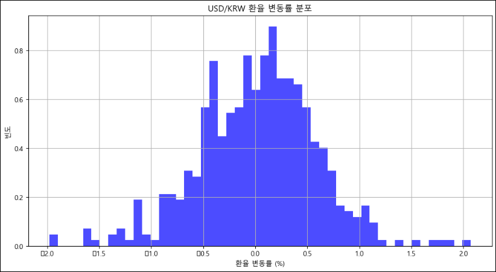

# 데이터 분석을 위한 기초 수학
## 긴꼬리 분포, t분포
### 정규분포와 꼬리분포
- 정규 분포 한계점
  - 금융 데이터에서 정규 분포 가정의 한계점
    - 현실 금융 데이터(주식, 환율 등)는 완벽히 정규분포를 따르지 않음
    - 특히 금융 시장에서는 극단적인 상황(급등/급락)이 발생할 확률이 정규분포가 예측하는 것보다 더 높음
    - 이를 **긴 꼬리 현상**이라고 함

      
      
      - QQ-plot 보면 각도 자체가 틀어져있음
      - 양 극단 점들이 직선에서 크게 벗어나있음 -> 정규성 위반 신호

### 긴 꼬리 분포
데이터 분포가 특정 방향으로 **길게 늘어져 있는 것**을 의미

-> 데이터는 일반적으로 정규분포를 따르지 않고, 긴 꼬리분포를 따르는 경우가 많음

- 꼬리(tail)
  - 적은 수의 극단값이 주로 존재하는, 도수분포의 길고 좁은 부분
- 왜도(skewness)
  - 분포의 한쪽 꼬리가 반대쪽 다른 꼬리보다 긴 정도

    
    - 오른쪽으로 꼬리가 긴 분포 -> 양의 왜도

- 긴 꼬리 분포 예시
  - 유튜브 조회수
    - 영상이 대부분 낮은 조회수지만, 가끔씩 매우 높은 조회수가 나타내는 것과 비슷함
  - 주식 시장의 붕괴(Black Swan Theory)
    - 주식 시장의 붕괴와 같은 이례적인 사건이, 정규분포로 예측되는 것보다 훨씬 더 자주 일어날 수 있다고 예측

      

- 긴 꼬리분포 실습
  - 긴 꼬리 분포의 형태를 확인하는 예제
    ```python
    # 1. 지수 분포를 따르는 데이터 1000개 생성
    data_long_tail = np.random.exponential(scale=2, size=1000)

    """
    np.random.exponential(scale=2, size=1000)
    - 평균(기대값)이 2인 지수 분포에서 1000개의 난수를 생성함.
    - 지수 분포는 긴 꼬리를 가지는(right-skewed) 비대칭적인 분포를 형성함.
    - "Long-tail Distribution"이란 데이터를 보면 극단적으로 큰 값이 나올 확률이 낮지만, 완전히 배제되지 않는 특징을 가짐.
    """

    # 2. 그래프 크기 설정
    plt.figure(figsize=(12, 8))

    # 3. 지수 분포 데이터 히스토그램을 시각화
    sns.histplot(data_long_tail, kde=True, color='salmon')

    """
    - sns.histplot(): 데이터의 히스토그램을 그리는 함수.
    - kde=True: 부드러운 확률 밀도 곡선(Kernel Density Estimation, KDE)을 추가.
      (분포를 부드럽게 시각적으로 표현하기 위함)
    - color='salmon': 그래프 색상을 연한 빨강(연어색)으로 설정.
    """

    # 4. 그래프 제목 및 축 라벨 설정
    plt.title('Long-tail Distribtuion (Exponential)') # 그래프 제목
    plt.xlabel('Value') # X축 라벨 (데이터 값)
    plt.ylabel('Frequency') # Y축 라벨 (빈도수)

    # 5. 그래프 출력
    plt.show() # 그래프를 화면에 출력

    """
    - 지수 분포는 오른쪽으로 꼬리가 길게 늘어지는(우측 비대칭, Right-skewed) 형태를 가짐.
    - 대부분의 데이터가 작은 값 근처에 분포하지만, 일부 데이터는 매우 큰 값으로 나타남 (Long-tail 효과).
    - 예시: 인터넷 트래픽, 금융 시장 변동성, 고객 대기 시간 등 여러 현실 세계 데이터에서 발견됨.
    """
    ```
    
    - 지수 분포는 오른쪽으로 꼬리가 길게 늘어지는 형태를 가짐
    - 대부분 데이터가 작은 값 근처에 분포하지만, 일부 데이터는 매우 큰 값으로 나타남
      
  - 긴 꼬리 분포의 정규성을 검토하는 예제
    ```python
    # 지수 분포(Exponential Distribution)를 따르는 데이터 1000개 생성
    data_long_tail = np.random.exponential(scale=2, size=1000)
    """
    np.random.exponential(scale=2, size=1000)
    - 평균(기대값)이 2인 지수 분포에서 1000개의 난수를 생성함.
    - 지수 분포는 긴 꼬리를 가지는(right-skewed) 비대칭적인 분포를 형성함.
    - 데이터가 정규 분포를 따르는지 확인하기 위해 QQ-Plot을 사용하여 시각적으로 검토할 예정.
    """

    # 그래프 크기 설정
    plt.figure(figsize=(12, 8)) # 가로 12, 세로 8 크기의 그래프 설정


    # QQ-Plot 그리기 (정규성 확인)
    stats.probplot(data_long_tail, dist='norm', plot=plt)

    """
    - stats.probplot(data_long_tail, dist='norm', plot=plt)
      → data_long_tail 데이터를 정규 분포("norm")와 비교하는 QQ-Plot을 그림.

    - QQ-Plot(Quantile-Quantile Plot)이란?
      → "데이터가 특정 분포(여기서는 정규 분포)를 따르는지를 확인하는 그래프"
      → X축: 정규 분포의 이론적인 분위(Quantile) 값
      → Y축: 실제 데이터의 분위 값
      → 만약 데이터가 정규 분포를 따른다면, 점들이 대각선 직선 형태로 배열됨.
      → 정규 분포가 아닐 경우, 점들이 직선에서 벗어나거나 곡선을 형성함.

    - 지수 분포(Exponential Distribution)의 특징:
      → 긴 꼬리(long-tail)를 가지므로 QQ-Plot에서 점들이 직선에서 벗어나게 됨.
      → 특히 오른쪽(상위 분위)에서 직선을 크게 벗어나며, 이는 데이터가 정규 분포보다 오른쪽으로 치우쳐(skewed) 있음을 의미.
    """

    # 4. 그래프 제목 설정
    plt.title('QQ Plot for Long-tail Distribution (Exponential Distribution)')

    # 5. 그래프 출력
    plt.show()
    ```
    
    - 지수 분포는 오른쪽으로 길게 늘어진(long-tail) 형태를 가짐
    - QQ-Plot에서 점들이 상위 분위(X축 오른쪽 끝부분)에서 직선에서 크게 벗어나는 패턴을 보일 것
    - 지수 분포가 정규 분포를 따르지 않는다는 명확한 증거

- 긴 꼬리 분포 사례
  - 금융 시장에서의 긴 꼬리 현상 사례
    - 주식 시장 급락 (ex. 2008년 금융위기, 코로나19 충격)
    - 암호화폐 가격 폭등 및 폭락
    - 갑작스러운 환율 급등
    
    

- 긴 꼬리분포 실습
  - 실제 금융 데이터를 통한 비교 시각화
    - 환율(예 : USD/KRW 환율 변동률) 데이터 사용
    - 환율 데이터 로드 -> 일별 변동률 계산 -> 그래프 표현
  
  - 금융 데이터 불러오기
    ```python
    !pip install finance-datareader
    ```
  - FinanceDataReader API 패키지
    - FinanceDataReader 이용해 3년간의 달러-원 환율 데이터를 불러옴
    ```python
    import FinanceDataReader as fdr  # 금융 데이터를 쉽게 불러오는 라이브러리
    import matplotlib.pyplot as plt
    import numpy as np
    import scipy.stats as stats
    plt.rcParams["font.family"] = "Malgun Gothic"
    ```
    ```python
    # 1. USD/KRW 환율 데이터 불러오기
    df = fdr.DataReader('USD/KRW', '2023-07-10', '2025-07-10') # 3년치 데이터 가져오기
    #df.describe()
    ```
    
    - Open : 시가 (시작 가격)
    - High : 고가 (최고 가격)
    - Low : 저가 (최저 가격)
    - Close : 종가 (마감 가격)
    - Volume : 거래량
    - Adj Close : 수정 종가 (조정 종가)
    - Count(개수) : 데이터가 총 몇 개 있는지 개수를 나타냄
    - Mean(평균) : 각 열의 데이터의 평균 값
    - Std(표준 편차) : 데이터가 평균에서 얼마나 퍼져있는지
    - Min(최소값) : 가장 작은 값
    - 25% : 하위 25% 지점 값
    - 50% (중앙값) : 중간값(median)
    - 75% : 상위 75% 지점 값
    - Max(최대값) : 가장 큰 값    

  - **종가(Close)가 환율의 대표값**이기 때문에 이 값만 분석 대상으로 사용
    - 종가(Close) 데이터만 선택
    - 편하게 사용하기 위해 rename을 통해 컬럼명 변경
    ```python
    df = df[['Close']] # 종가 (Close) 데이터만 사용
    df = df.rename(columns={'Close' : '환율'}) # 컬럼명 변경
    ```

  - 일일 환율 변동률(수익률) 계산
    - 환율이 전일 대비 몇 % 올랐거나 내렸는지 변화율을 계산함 (pct_change() 활용)
    - `Dropna()`로 첫 번째 NaN 값 제거 -> 환율의 변화율은 **전날 데이터가 있어야만 계산이 가능**하기 때문에(첫 번째 데이터는 이전 값이 없음)
    ```python
    # 2. 환율 변동률(수익률) 계산
    df['환율 수익률'] = df['환율'].pct_change() * 100 # 퍼센트(%) 변동률로 변환
    df = df.dropna() # 첫 번째 NaN 값 제거
    ```
    

  - 환율 변동률이 **어떤 범위에서 얼마나 자주 나타나는지 분포**를 시각적으로 보여줌
    - `hist()` 함수로 히스토그램 생성
    - `bins`를 높이면 더 세밀한 분포를 볼 수 있음
    - `density=True`로 하면 확률 밀도를 나타냄
    ```python
    # 3. 히스토그램 그리기
    plt.figure(figsize=(12, 6))
    plt.hist(df['환율 수익률'], bins=50, density=True, alpha=0.7, color='blue')
    plt.title('USD/KRW 환율 변동률 분포')
    plt.xlabel('환율 변동률 (%)')
    plt.ylabel('빈도')
    plt.grid(True)
    plt.show()
    ```
    
  
  - **환율 변동률이 정규 분포인지** 시각화
    - `probplot()` 함수로 QQ-Plot 생성
    ```python
    # 4. QQ-Plot 그리기 (정규성 확인)
    plt.figure(figsize=(8, 8))
    stats.probplot(df['환율 수익률'], dist='norm', plot=plt)
    plt.title("USD/KRW 환율 QQ-Plot")
    plt.show()
    ```
    

  - 해석 방법
    - **달러/원 환율의 일일 변동률을 분석**하여, **분포 형태와 정규성 여부**를 **시각적으로 판단**하는 것이 핵심 목적

  - 히스토그램 해석

    
    - **중앙값 근처에 데이터 집중**
      - 대부분 변동률 값이 0% 근처에 몰려 있음
    - **분포의 대칭성 (정규성 확인)**
      - 그래프가 비대칭으로 보임
      - 오른쪽을 길게 늘어난 꼬리가 긴 분포로 보임
    - **극단적인 변동 (아웃라이어 존재 여부)**
      - 극단적인 변동률이 존재함 (2~3% 환율 변동)
      - 이를 분석할 가치가 있음
    - **금융 시장과의 관계 해석**
      - 보통 환율은 경제 이벤트로 인해 변동이 생김
      - 이를 분석할 가치가 있음    

  - QQ-Plot 해석

    
    - **빨간색 직선**
      - 이론적인 정규 분포의 분위수를 나타낸 것으로 만약 데이터가 정규 분포를 따른다면, 파란색 점을 따라 배열
    - **파란색 직선**
      - 실제 환율 변동률 데이터의 분위 값을 나타냄 정규 분포를 따른다면 직선 위에 대부분 위치해야 함
    - **중앙 부분(0 근처)은 직선을 잘 따름**
      - 환율 변동률의 대부분은 정규 분포와 비슷한 형태를 가짐
    - **양쪽 끝부분(꼬리, 극단값)이 직선에서 크게 벗어남**
      - 극단적인 환율 변동률이 정규 분포보다 더 자주 발생함

### t분포
정규분포와 유사하지만 **꼬리 부분이 더 두꺼운 확률분포**


- 특징
  - 표본의 개수(표본의 크기)가 작거나 모집단의 표준 편차를 정확히 모를 때 자주 사용
  - **꼬리가 더 두꺼움**
    - 정규분포보다 극단값이 나타날 가능성을 더 현실적으로 반영함
    - 즉, 극단적인 값이 나올 확률이 정규분포보다 높음
  - 표본 개수가 많아지면 t분포 자체가 정규분포형태에 가까워짐

※ 자유도

-> 자유도란, 간단히 말해 데이터를 가지고 얼마나 **자유롭게 움직일 수 있는지를 나타내는 수**

-> **자유도가 작을수록 꼬리가 두꺼워지고, 자유도가 커질수록 정규분포와 비슷**해짐

-> 데이터 안에서 진짜로 선택할 수 있는 자유

- t-분포를 시각화하는 예제
  - t-분포는 정규 분포와 유사하지만, 자유도가 낮을 때 꼬리가 두꺼움
  - 자유도에 따라 모양이 달라짐
  - 자유도 ↑ : 정규 분포와 유사
  - 자유도 ↓ : 꼬리가 두꺼워짐
    ```python
    # 1. t-분포를 따르는 난수 생성
    data_t = np.random.standard_t(df=10, size=1000) #  표본 개수가 11

    """
    np.random.standard_t(df=10, size=1000)
    - 자유도(df=10)를 가지는 t-분포에서 1000개의 난수를 생성함.
    - t-분포는 정규 분포와 비슷하지만, 양쪽 꼬리가 더 두꺼움 (극단값이 더 많이 발생).
    - 자유도(df, degree of freedom)가 클수록 정규 분포와 가까워짐.
    """

    # 2. 그래프 크기 설정
    plt.figure(figsize=(12, 8))

    # 3. 히스토그램을 통해 t-분포 데이터 시각화
    sns.histplot(data_t, kde=True, color='purple')

    """
    - sns.histplot(): 데이터의 히스토그램을 그리는 함수.
    - kde=True: 부드러운 확률 밀도 곡선(Kernel Density Estimation, KDE)을 추가하여 분포 형태를 더 잘 보여줌.
    - color='purple': 그래프 색상을 보라색으로 설정.
    """

    # 4. 그래프 제목 및 라벨 설정
    plt.title('T-Distribution (df=10)') # 그래프 제목
    plt.xlabel('Value') # X축 라벨 (데이터 값)
    plt.ylabel('Frequency') # Y축 라벨 (빈도수)

    # 5. 그래프 출력
    plt.show() # 그래프를 화면에 출력
    ```
    

- 금융 분석에서 t 분포의 중요성
  - 표본 크기가 작은 경우가 많음
    - ex. 최근 한 달 간의 수익률 데이터 등
  - 극단적인 수익률(큰 폭락, 폭등 등)이 빈번하게 나타남

- T 분포의 금융적 활용
  - 작은 표본에서의 신뢰구간
    - 데이터를 적게 가지고 있을 때, 정규분포를 가정하면 신뢰구간이 정확하지 않음 
    - 그래서, t분포를 이용하면 현실적인 신뢰구간을 구할 수 있음
  - 가설 검정
    - "최근 시장 변동성이 과거에 비해 유의하게 증가했냐?" 같은 금융시장 분석에서도 t분포를 이용하면 정확한 판단 가능
  - 리스크 관리
    - 시장이 급등락하는 상황에서 t분포를 이용하면 리스크를 더 현실적으로 평가 가능

- 실제 금융 데이터를 통한 비교 시각화
  - 환율(달러/원)의 최근 20일 수익률 데이터(작은 표본) 사용

  - 표본 데이터 생성
    - **환율 수익률 데이터를 20개 샘플로 생성**
    - 이 데이터는 평균이 0에 근처이고, **약간의 변동성**을 가지는 분포
      ```python
      import numpy as np
      import matplotlib.pyplot as plt
      import scipy.stats as stats
      plt.rcParams["font.family"] = "Malgun Gothic"

      # 1. 데이터 설정
      data = np.array([0.1, -0.05, 0.03, -0.02, 0.12, -0.09, 0.07, -0.04, 0.03, 0.11,
                      -0.15, 0.2, -0.13, 0.05, -0.03, 0.08, -0.07, 0.1, -0.06, 0.04])
      ```

  - 평균과 표준편차 계산
    - 평균(Mean)은 표본의 대표값
    - 표준편차(std)는 데이터의 퍼짐 정도
    - `Ddof=1` 옵션은 표본 표준편차를 계산할 때 사용되며, 샘플 크기가 작을 때 보정하는 역할을 함
      ```python
      # 2. 평균(mean)과 표준편차(std) 계산
      mean = np.mean(data) # 샘플 평균
      std = np.std(data, ddof=1) # 샘플 표준편차 (ddof=1 : 자유도 보장)
      n = len(data) # 샘플 개수 (n=20)
      ```
  
  - 신뢰구간 계산
    - 신뢰구간은 **데이터의 평균이 특정 구간 안에 있을 확률이 95%**라는 의미
    - `stats.norm.interval()` -> 정규분포 기반 신뢰구간
    - `stats.t.interval()` -> t-분포 기반 신뢰구간
      ```python
      # 3. 신뢰구간 계산 (95%)
      normal_interval = stats.norm.interval(0.95, mean, std/np.sqrt(n)) # 정규분포 신뢰 구간
      t_interval = stats.t.interval(0.95, df=n-1, loc=mean, scale=std/np.sqrt(n)) # t-분포 신뢰 구간
      ```

  - 정규분포(실선)와 t-분포(점선) 비교하여 그래프 표시
    - 신뢰구간 부분을 색칠하여 시각적 강조
    - **t-분포는 정규분포보다 더 넓은 신뢰구간**을 가짐
    - Why? 표본 크기가 작을 때 불확실성이 커지므로 신뢰구간이 더 넓어짐
      ```python
      # 4. x축 범위 설정
      x = np.linspace(mean - 0.08, mean + 0.08, 500)

      # 5. 정규분포 및 t-분포 PDF 계산
      normal_pdf = stats.norm.pdf(x, mean, std/np.sqrt(n)) # 정규분포 PDF
      t_pdf = stats.t.pdf(x, df=n-1, loc=mean, scale=std/np.sqrt(n)) # t-분포 PDF

      # 6. 그래프 그리기
      plt.figure(figsize=(10, 6))

      # 정규분포 PDF 그래프
      plt.plot(x, normal_pdf, label='정규분포 PDF', linewidth=2)

      # t 분포 PDF 그래프 (점선 스타일)
      plt.plot(x, t_pdf, label='t 분포 PDF', linewidth=2, linestyle='--')

      # 7. 신뢰구간 시각화 (정규분포 신뢰구간)
      plt.fill_between(x, normal_pdf,
                      where=(x >= normal_interval[0]) & (x <= normal_interval[1]),
                      color='blue', alpha=0.2, label='정규분포 95% 신뢰구간')

      # t 분포 신뢰구간 색칠 (정확히 t 분포 구간만)
      plt.fill_between(x, t_pdf,
                      where=(x >= t_interval[0]) & (x <= t_interval[1]),
                      color='orange', alpha=0.2, label='t 분포 95% 신뢰구간')
      ```
  
  - 그래프 설정 및 출력
    ```python
    # 8. 그래프 설정 및 출력
    plt.legend() #범례 추가
    plt.xlabel('환율 수익률') # X축 라벨
    plt.ylabel('확률밀도') # Y축 라벨
    plt.title('정규분포와 t 분포의 확률밀도 및 신뢰구간 비교') # 그래프 제목
    plt.grid(True) # 그리드 추가
    plt.show() # 그래프 출력
    ```
    
  
  - 가상 금융 데이터를 통한 비교 시각화
    - 주황색(t 분포)의 신뢰 구간이 파란색(정규분포)의 신뢰구간보다 조금 더 넓음
    - 금융 데이터는 **극단적인 수익률이 자주 나타나므로**, t분포를 활용한 분석이 더 적합하고 안전함
    - 이를 통해 **t분포는 작은 표본을 이용할 때 더 넓고 현실적인 신뢰구간 제공** 


## 가설 검정과 신뢰 구간
※ 차이가 진짜 있냐 없냐, 숫자를 얼마나 신뢰할 수 있는지 보여주는 방법

- 통계적 실험의 중요성
  - 왜 통계적 실험이 필요한가?
  - 데이터를 분석하지 않고 의사 결정을 내릴 경우 발생하는 문제
    - 많은 사람들이 직관이나 경험을 기반으로 결정
    - 이로 인해 잘못된 결론을 내릴 위험이 큼

  - 예제1: 신약 개발
    - 신약의 효과를 확인하려면 임상 실험(통계적 실험)을 통해 비교 검증
  
  - 예제2: 마케팅 광고 효과 분석
    - 통계적 실험(A/B 테스트)을 통해 광고 효과를 검증해야 정확한 결론을 내림

- 유의성 검정의 중요성
  - 유의성 검정(Significance Testing)은 **"우리가 관측한 차이가 우연히 발생했을 확률"**을 계산하는 과정
  - 즉, 우리가 관측한 차이가 의미 있는지 없는지를 보는 것
  - 예제: 신약 개발
    - "신약이 효과가 좋다"는 주장을 하기 위해서 단순 평균 비교로는 차이가 크지 않아 보임
    - 이 차이가 **우연이 아닐 확률**을 계산해야 함
    - 유의성 검정을 수행해서 **p-value가 0.05보다 작다면, "우연이 아닐 확률이 높음"**
    - 즉, 신약이 효과가 있다고 판단

      

- 가설 설정 개념
  - 가설(Hypothesis)
    - **특정한 주장을 검증하기 위한 가정**
    - 통계적 검정의 핵심은 "이 가설이 맞는지 아닌지 검증 하는 과정"
    - 관측한 데이터에서 "차이가 유의미한가?"를 검증하는 과정에서 가설을 설정해야 함

  - 가설의 종류
    - 귀무가설(Null Hypothesis, H₀)
    - 대립가설(Alternative Hypothesis, H₁)

### 신뢰 구간 (Confidence Interval, CI)
모집단의 참된 평균(모수)을 포함할 것으로 예상되는 값의 범위

- 표본에서 얻은 평균을 기반으로, 모집단의 평균이 어느 범위 안에 있을지를 추정하는 방법

- 예제 (95% 신뢰구간)
  - "새로운 마케팅 전략이 고객 구매율을 평균 2~5% 증가시킬 것이다."
  - "즉, 95% 확신을 가지고 "구매율 증가 범위는 2~5% 사이"라고 말할 수 있음

- 신뢰 구간과 가설 검정 관계
  - 만약 신뢰구간이 0을 포함하지 않으면, 차이가 유의미하다고 판단
  - 신뢰구간이 [2%, 5%] -> 0%가 포함되지 않음 -> 유의미한 차이 O
  - 신뢰구간이 [-1%, 3%] -> 0%가 포함됨 -> 유의미한 차이 X

    

### 귀무가설과 대립 가설
- 귀무가설(Null Hypothesis, H₀)
  - "차이가 없다" 또는 "효과가 없다"는 기본 가설
- 대립가설(Alternative Hypothesis, H₁)
  - 대립 가설은 "차이가 있다" 또는 "효과가 있다"는 가설
  - 대립가설이 맞다고 증명하는 형태XX
    - 귀무가설을 부정할 수 있을 만큼의 증거가 있는지를 보는 형태

    

- 귀무가설(H₀)과 대립가설(H₁)의 예제
  - 귀무 가설 예제
    - 신약 개발: "신약이 기존 약과 효과 차이가 없다."
    - "A/B 테스트:" 기존 웹사이트와 새로운 웹사이트의 클릭률이 차이가 없다."
    - "교통 연구:" 특정 지역의 승용차 이용률이 다른 지역과 차이가 없다."
  - 대립 가설 예제
    - 신약 개발: "신약이 기존 약보다 효과가 더 좋다."
    - "A/B 테스트:" 새로운 웹사이트가 기존 웹사이트보다 클릭률이 높다."
    - "교통 연구:" 특정 지역의 승용차 이용률이 다른 지역과 다르다."

- 유의수준(α)
  - **우리가 허용할 "우연한 결과"의 최대 확률**
    - 보통 `0.05` (5%) 또는 `0.01` (1%)를 사용
    - 즉, "5%의 확률로 우연한 결과를 허용하겠다"라는 의미
  - 유의수준(`α = 0.05`)의 해석
    - 검정 결과가 귀무가설이 맞더라도, 5% 확률로 틀린 결론을 내릴 수 있음
    - 즉, 1종 오류를 5% 이내로 제한하겠다는 의미
    - **유의수준을 낮출수록 (`α = 0.01`) 더 엄격한 검정을 수행하지만, 2종 오류위험 증가**

    
    - 제 1종 오류를 조심해야 하는 경우: 안정성이 중요한 경우
    - 제 2종 오류를 조심해야 하는 경우: 대안이 없을 때 뭐라도 해봐야하는 경우

### p-value
귀무가설이 참이라고 가정했을 때, 현재 관측된 결과보다 극단적인 결과가 나올 확률

-> **이 차이가 단순한 우연일 가능성이 얼마나 되는지**를 나타냄

-> **p-value가 작을수록** 우리가 관측한 차이가 우연일 가능성이 낮아짐

- 해석 기준 (유의 수준 `α = 0.05`일 때)
  - ` p-value ≤ 0.05` -> 귀무가설 기각 -> "차이가 유의미하다"
  - `p-value > 0.05` -> 귀무가설 유지 -> "차이가 우연일 가능성이 크다"
  - 즉, **p-value가 작으면, "이건 우연이 아니다. 실제 차이가 있는 것이다" 라고 결론**을 내림

- p-value 해석 예제
  - 신약 실험 예제
    - 기존 약의 평균 효과: 70점
    - 새로운 약의 평균 효과: 75점
    - t-검정 수행 -> `p-value = 0.03`
    -` p-value = 0.03 <= 0.05` -> 귀무가설 기각
    - "이 차이는 단순한 우연일 가능성이 3%밖에 안된다"라는 의미
    - 즉, **신약 효과가 유의미**하다는 것
  
  - 결론적으로 p-value를 통해 관측한 차이가 단순한 우연인지 아닌지 판단할 수 있음

### 가설 검정(Hypothesis Testing)
데이터를 기반으로 특정 가설이 맞는지 판단하는 과정

-> 즉, **표본 데이터를 이용해 모집단의 특성을 추론**하는 방법

  
- 예제
  - 새로운 다이어트 약이 체중 감량에 효과가 있는가?
  - 광고 A와 광고 B 중 어느 것이 더 높은 클릭률을 기록하는가?
  - 두 개의 마케팅 전략이 고객 구매율에 차이를 만드는가?

- 가설 검정(Hypothesis Testing)의 흐름
  - 데이터를 기반으로 통계적 결론을 도출하는 과정

    
  
  - 가설 검정 프로세스

    

- 유의성 검정의 유형
  - 단측 검정 vs 양측 검정

    

    

- 단측 검정과 양측 검정 실습
  - A구와 B구의 승용차 이용률 비교 (단측 vs 양측 검정 수행)
    ```python
    import numpy as np
    import pandas as pd
    import scipy.stats as stats
    import matplotlib.pyplot as plt
    import seaborn as sns
    import matplotlib.pyplot as plt
    import matplotlib.font_manager as fm
    plt.rcParams['font.family'] = 'Malgun Gothic'

    # 랜덤 시드 설정
    np.random.seed(42)

    # 가상의 승용차 이용률 데이터 생성 (평균 35%, 40%)
    a_district = np.random.normal(loc=35, scale=5, size=30)  # A구
    b_district = np.random.normal(loc=40, scale=5, size=30)  # B구

    # 데이터프레임 생성
    df = pd.DataFrame({'승용차 이용률': np.concatenate([a_district, b_district]),
                      '자치구': ['A구'] * 30 + ['B구'] * 30})

    # 데이터 시각화 (박스플롯)
    plt.figure(figsize=(8, 5))
    sns.boxplot(x='자치구', y='승용차 이용률', data=df)
    plt.title("A구와 B구의 승용차 이용률 비교")
    plt.show()
    ```
    

    - 양측 검정
      ```python
      # 양측 검정 (두 집단 평균 비교)
      t_stat, p_value = stats.ttest_ind(a_district, b_district, equal_var=True)

      print(f"양측 검정 결과:")
      print(f"t-통계량: {t_stat:.4f}, p-value: {p_value:.4f}")

      # p-value 해석
      if p_value <= 0.05:
          print("귀무가설 기각 → A구와 B구의 승용차 이용률 차이가 유의미함")
      else:
          print("귀무가설 유지 → A구와 B구의 승용차 이용률 차이가 우연일 가능성이 큼")
      ```
      
    
    - 단측 검정
      ```python
      # 단측 검정 (A구가 B구보다 작은지 검정)
      t_stat, p_value_one_sided = stats.ttest_ind(a_district, b_district, alternative='less', equal_var=True)

      print(f"단측 검정 결과 (A구 < B구):")
      print(f"t-통계량: {t_stat:.4f}, p-value: {p_value_one_sided:.4f}")

      # p-value 해석
      if p_value_one_sided <= 0.05:
          print("귀무가설 기각 → A구의 승용차 이용률이 B구보다 유의미하게 낮음")
      else:
          print("귀무가설 유지 → A구와 B구의 승용차 이용률 차이가 우연일 가능성이 큼")
      ```
      

  - 양측 검정 결과
    - 귀무가설(H₀): A구와 B구의 승용차 이용률에는 차이가 없음
    - 대립가설(H₁): A구와 B구의 승용차 이용률에는 유의미한 차이가 있음
    - t-통계량: -4.5129
    - p-value = 0.0000 (`p-value < 0.05`) -> 귀무가설 기각
    - 결론: A구와 B구의 승용차 이용률 차이는 우연이 아니라 실제 차이일 가능성이 높음

  - 단측 검정 결과
    - 귀무가설(H₀): A구의 승용차 이용률이 B구보다 낮지 않다
    - 대립가설(H₁): A구의 승용차 이용률이 B구보다 유의미하게 낮다
    - t-통계량: -4.5129
    - p-value = 0.0000 (`p-value < 0.05`) -> 귀무가설 기각
    - 결론: A구의 승용차 이용률이 B구보다 유의미하게 낮음


### 정규성 검정(Normality Test)
정규성 검정은 데이터가 **정규분포를 따르는지 확인**하는 과정

-> 통계적 검정(t-검정, ANOVA)을 수행하기 전에 정규성 가정을 만족하는지 확인하기 위한 작업

- 정규성을 검증하는 대표적인 방법
  - Shapiro-Wilk Test
    - 소규모 표본(50개 이하)에 적합
  - Kolmogorov-Smirnov Test 
    - 정규성과 다른 분포 간 차이를 검정
  - Anderson-Darling Test
    - 정규성을 검정할 때 민감도가 높음
  - QQ-Plot(Quantile-Quantile Plot)
    - 정규성을 시각적으로 확인

※ 가장 널리 사용되는 Shapiro-Wilk Test를 중심으로 실습 진행

- Shapiro-Wilk Test
  - 정규성을 검정하는 가장 대표적인 방법
    - 귀무가설(H₀): 데이터는 정규분포를 따름
    - 대립가설(H₁): 데이터는 정규분포를 따르지 않음
  - p-value 해석
    - `p-value ≤ 0.05` -> 귀무가설 기각 -> 정규성이 없음
    - `p-value > 0.05` -> 귀무가설 유지 -> 정규성을 만족함
    - 즉, p-value가 0.05보다 크면 **데이터가 정규성을 만족한다고 판단할 수 있음**

- 정규성 검정 Shapiro-Wilk test 실습
  - 두 지역(A구, B구)의 승용차 이용률 데이터를 생성하고 정규성 검정
    ```python
    import numpy as np
    import pandas as pd
    import scipy.stats as stats
    import matplotlib.pyplot as plt
    import seaborn as sns
    import matplotlib.pyplot as plt
    import matplotlib.font_manager as fm
    plt.rcParams['font.family'] = 'Malgun Gothic'

    # 랜덤 시드 설정
    np.random.seed(42)

    # A구와 B구의 승용차 이용률 데이터 생성
    a_district = np.random.normal(loc=35, scale=5, size=30)  # A구 (평균 35%, 표준편차 5%)
    b_district = np.random.normal(loc=40, scale=5, size=30)  # B구 (평균 40%, 표준편차 5%)

    # 데이터프레임 생성
    df = pd.DataFrame({'승용차 이용률': np.concatenate([a_district, b_district]),
                      '자치구': ['A구'] * 30 + ['B구'] * 30})

    # 데이터 시각화 (히스토그램 & KDE)
    plt.figure(figsize=(10, 5))
    sns.histplot(a_district, kde=True, label="A구", color="blue", alpha=0.6)
    sns.histplot(b_district, kde=True, label="B구", color="red", alpha=0.6)
    plt.title("A구 vs B구 승용차 이용률 분포")
    plt.xlabel("승용차 이용률 (%)")
    plt.legend()
    plt.show()
    ```
    

    ```python
    # 정규성 검정 수행 (Shapiro-Wilk Test)
    shapiro_a = stats.shapiro(a_district)
    shapiro_b = stats.shapiro(b_district)

    # 결과 출력
    print(f"Shapiro-Wilk test (A구): W-statistic = {shapiro_a.statistic:.4f}, p-value = {shapiro_a.pvalue:.4f}")
    print(f"Shapiro-Wilk test (B구): W-statistic = {shapiro_b.statistic:.4f}, p-value = {shapiro_b.pvalue:.4f}")

    # p-value 해석
    if shapiro_a.pvalue > 0.05:
        print("A구 데이터는 정규성을 만족함")
    else:
        print("A구 데이터는 정규성을 만족하지 않음")

    if shapiro_b.pvalue > 0.05:
        print("B구 데이터는 정규성을 만족함")
    else:
        print("B구 데이터는 정규성을 만족하지 않음")
    ```
    

  - 그래프 결과 (A구 vs B구 승용차 이용률 분포)
    - A구(파란색)와 B구(빨간색)의 승용차 이용률 데이터 분포를 시각화
    - A구는 평균 35% 정도의 분포, B구는 평균 40% 정도의 분포를 보임
    - A구와 B구 모두 대체로 종형 분포(정규분포 모양)에 가까움

  - 정규성 검정 결과 (Shapiro-Wilk Test)
    - 귀무가설(H₀): 데이터는 정규분포를 따른다.
    - 대립가설(H₁): 데이터는 정규분포를 따르지 않는다.
    - 검정 결과

      

### t-검정 (t-test)
두 집단의 평균 차이가 통계적으로 유의미한지를 검정하는 방법

- 특징
  - 모집단의 **평균을 비교**하는 검정 방법
  - 데이터가 **정규성**을 만족해야 함
  - 표본 수가 적더라도 비교적 정확한 결과를 제공

- t-검정의 가설 설정 예시
  - 귀무가설(H₀): 두 집단의 평균이 같다 (차이가 없다)
  - 대립가설(H₁): 두 집단의 평균이 다르다 (차이가 있다)

- 독립 표본 t-검정
  - t-검정 종류의 일종으로, **서로 독립적인 두 집단의 평균 비교**
  - 사용 목적
    - 서로 다른 집단의 평균 차이를 비교하고 싶을 때
    - 두 집단이 서로 독립적이며, 관측 값이 중복되지 않을 때
    - 데이터가 정규성을 만족할 때
  - 예시
    - A구와 B구 주민들의 승용차 이용률이 차이가 있는지 검정
    - 새로운 교육 프로그램이 남학생과 여학생의 성적에 차이를 미치는지 검정
    - 두 개의 브랜드에서 제공하는 고객 서비스 만족도가 차이가 있는지 검정

- 독립 표본 t-검정 실습
  - A구와 B구의 승용차 이용률 평균을 비교하여 유의미한 차이가 있는지 검정
    - 데이터 생성
      ```python
      import numpy as np
      import pandas as pd
      import scipy.stats as stats
      import matplotlib.pyplot as plt
      import seaborn as sns

      plt.rcParams['font.family'] = 'Malgun Gothic'


      # 마이너스 부호 깨짐 방지
      plt.rcParams['axes.unicode_minus'] = False

      # 랜덤 시드 설정
      np.random.seed(42)

      # A구와 B구의 승용차 이용률 데이터 생성
      a_district = np.random.normal(loc=35, scale=5, size=30)  # A구 (평균 35%, 표준편차 5%)
      b_district = np.random.normal(loc=40, scale=5, size=30)  # B구 (평균 40%, 표준편차 5%)

      # 데이터프레임 생성
      df = pd.DataFrame({'승용차 이용률': np.concatenate([a_district, b_district]),
                        '자치구': ['A구'] * 30 + ['B구'] * 30})

      # 데이터 시각화 (박스플롯)
      plt.figure(figsize=(8, 5))
      sns.boxplot(x='자치구', y='승용차 이용률', data=df)
      plt.title("A구 vs B구 승용차 이용률 비교")
      plt.show()
      ```
      
    
    - 정규성 검정
      ```python
      # 정규성 검정 수행 (Shapiro-Wilk Test)
      shapiro_a = stats.shapiro(a_district)
      shapiro_b = stats.shapiro(b_district)

      print(f"Shapiro-Wilk test (A구): p-value = {shapiro_a.pvalue:.4f}")
      print(f"Shapiro-Wilk test (B구): p-value = {shapiro_b.pvalue:.4f}")

      # 정규성 판정
      if shapiro_a.pvalue > 0.05 and shapiro_b.pvalue > 0.05:
          print("두 그룹 모두 정규성을 만족함")
      else:
          print("정규성이 만족되지 않음, 비모수 검정 필요")
      ```
      
    
    - 등분산 검정
      ```python
      # 등분산 검정 (Levene’s Test)
      levene_test = stats.levene(a_district, b_district)

      # 결과 출력
      print(f"Shapiro-Wilk test (A구): p-value = {shapiro_a.pvalue:.4f}")
      print(f"Shapiro-Wilk test (B구): p-value = {shapiro_b.pvalue:.4f}")
      print(f"Levene’s test: p-value = {levene_test.pvalue:.4f}")
      ```
      
    
    - t 검정
      ```python
      # t-검정 수행 (등분산 여부에 따라 결정)
      if levene_test.pvalue > 0.05:
          print("등분산을 가정한 독립표본 t-검정 수행")
          t_stat, p_value = stats.ttest_ind(a_district, b_district, equal_var=True)
      else:
          print("등분산을 가정하지 않는 Welch’s t-test 수행")
          t_stat, p_value = stats.ttest_ind(a_district, b_district, equal_var=False)

      print(f"t-통계량 = {t_stat:.4f}, p-value = {p_value:.4f}")

      # 결과 해석
      if p_value < 0.05:
          print("두 집단의 평균 차이가 유의미함 (귀무가설 기각)")
      else:
          print("두 집단의 평균 차이가 유의미하지 않음 (귀무가설 유지)")
      ```
      
    
  - 결과 해석

    

- 대웅 표본(Paired) t-검정
  - t-검정 종류의 일종으로, **같은 집단에서 두 시점 또는 두 조건에서의 평균 차이를 비교**

  - 특징
    - 같은 개체(그룹)에서 두 번 측정된 데이터를 비교할 때 사용
    - 이전 상태와 이후 상태 사이의 평균 차이가 유의미한지 검정
    - 집단 간 비교가 아니라, 같은 개체에서 변화가 있는지 분석

  - 예시
    - A구 주민들의 교통 정책 시행 전과 후 승용차 이용률 변화 비교
    - 동일한 학생들의 새로운 교육 프로그램 수강 전후 성적 차이 분석
    - 한 브랜드의 서비스 개선 전후 고객 만족도 차이 검정

- 대웅 표본(Paired) t-검정 실습
  - 교통 정책 시행 전후, 같은 도로에서 승용차 평균 속도가 유의미하게 변화했는지 검정
    - 데이터 생성
      ```python
      import numpy as np
      import pandas as pd
      import scipy.stats as stats
      import matplotlib.pyplot as plt
      import seaborn as sns
      plt.rcParams['font.family'] = 'Malgun Gothic'


      # 랜덤 시드 설정
      np.random.seed(42)

      # 정책 시행 전후의 평균 속도 데이터 생성
      before_policy = np.random.normal(loc=50, scale=5, size=30)  # 시행 전 평균 속도 50km/h
      after_policy = before_policy + np.random.normal(loc=-3, scale=2, size=30)  # 시행 후 속도 감소

      # 데이터프레임 생성
      df_paired = pd.DataFrame({'속도': np.concatenate([before_policy, after_policy]),
                                '시점': ['정책 시행 전'] * 30 + ['정책 시행 후'] * 30})

      # 박스플롯 시각화
      plt.figure(figsize=(8, 5))
      sns.boxplot(x='시점', y='속도', data=df_paired)
      plt.title("정책 시행 전후 승용차 속도 비교")
      plt.show()
      ```
      
    
    - 정규성 검정
      ```python
      # 정규성 검정 수행 (Shapiro-Wilk Test)
      shapiro_before = stats.shapiro(before_policy)
      shapiro_after = stats.shapiro(after_policy)

      print(f"Shapiro-Wilk test (정책 시행 전): p-value = {shapiro_before.pvalue:.4f}")
      print(f"Shapiro-Wilk test (정책 시행 후): p-value = {shapiro_after.pvalue:.4f}")

      if shapiro_before.pvalue > 0.05 and shapiro_after.pvalue > 0.05:
          print("두 그룹 모두 정규성을 만족함")
      else:
          print("정규성이 만족되지 않음, 비모수 검정 필요")
      ```
      
    
    - 대응표본 t-검정
      ```python
      # 대응표본 t-검정 수행
      t_stat, p_value = stats.ttest_rel(before_policy, after_policy)

      print(f"t-통계량 = {t_stat:.4f}, p-value = {p_value:.4f}")

      # 결과 해석
      if p_value < 0.05:
          print("정책 시행 전후 속도 차이가 유의미함 (귀무가설 기각)")
      else:
          print("정책 시행 전후 속도 차이가 유의미하지 않음 (귀무가설 유지)")
      ```
      
    
  - 결과 해석

    

- Welch’s t-test
  - 독립 t-검정 변형의 일종으로, **두 집단의 분산이 다를 때(이분산)** 사용

  - 특징
    - 일반적인 독립표본 t-검정은 등분산 가정이 필요함
    - Welch’s t-test는 등분산을 가정하지 않고, 각 집단의 표준편차를 따로 고려하여 계산

  - 필요한 상황
    - 두 집단의 표본 크기가 다를 때
    - **두 집단의 분산이 다를 때 (Levene’s test p-value < 0.05 인 경우)**

- Welch’s t-test 실습
  ```python
  import numpy as np
  import scipy.stats as stats

  # 랜덤 데이터 생성
  np.random.seed(1)
  group1 = np.random.normal(loc=50, scale=10, size=30)  # 평균 50, 표준편차 10
  group2 = np.random.normal(loc=55, scale=15, size=30)  # 평균 55, 표준편차 15 (이분산)

  # Levene’s test로 등분산 확인
  levene_test = stats.levene(group1, group2)
  print(f"Levene’s test p-value: {levene_test.pvalue:.4f}")

  # Welch’s t-test 수행 (equal_var=False)
  t_stat, p_value = stats.ttest_ind(group1, group2, equal_var=False)
  print(f"Welch’s t-test: t-statistic = {t_stat:.4f}, p-value = {p_value:.4f}")

  if p_value < 0.05:
      print("두 그룹의 평균 차이가 유의미함 (귀무가설 기각)")
  else:
      print("두 그룹의 평균 차이가 유의미하지 않음 (귀무가설 유지)")
  ```
  


## 추가 개념 및 정리
### 정규분포와 파레토 분포의 이상치 비교 시각화
1. csv파일 확인

    

2. 분포별 이상치 특성 분석 (정규분포 vs 파레토 분포)
    ```python
    import pandas as pd
    import numpy as np
    import matplotlib.pyplot as plt
    import seaborn as sns

    df = pd.read_csv('../data/data.csv')

    # "normal_outliers" 열만 추출해 Series로 만듦
    normal_outliers = df['normal_outliers']
    # "pareto_outliers" 열만 추출해 Series로 만듦 (pareto 분포는 긴꼬리 분포의 일종)
    pareto_outliers = df['pareto_outliers']

    # 시각화
    plt.figure(figsize=(8, 5))
    sns.histplot(normal_outliers, bins=30, kde=True, color='blue', label='Normal with Outliers')
    sns.histplot(pareto_outliers, bins=30, kde=True, color='red', label='Pareto with Outliers', alpha=0.6)
    plt.title('Normal distribution with outliers vs Pareto distribution')
    plt.xlabel('Value')
    plt.ylabel('Frequency')
    plt.legend()
    plt.grid(True)
    plt.show()
    ```
    


### 정규성 검정
1. 데이터 불러오기
    ```python
    import pandas as pd
    import numpy as np
    import scipy.stats as stats
    import matplotlib.pyplot as plt
    import seaborn as sns

    # 데이터 불러오기
    file_path = "../data/data.csv"
    # 파일 경로 입력

    df = pd.read_csv(file_path)  
    # CSV 파일 읽기

    # 데이터 확인 (상위 5개 행 출력)
    df.head()
    ```
    

2. 데이터 확인
    ```python
    df.info()
    ```
    

3. 데이터 전처리 및 구조 변환
    ```python
    # 특정 세 자치구(예: 강남구, 종로구, 서초구) 데이터 필터링
    df_filtered = df[df['자치구별(2)'].isin(['강남구', '종로구', '서초구'])]  
    # 원하는 자치구만 선택

    # 필요한 컬럼 선택 (2023년 1월~12월)
    df_filtered = df_filtered[['자치구별(2)', '2023.1', '2023.2', '2023.3', '2023.4', '2023.5', '2023.6', 
                              '2023.7', '2023.8', '2023.9', '2023.10', '2023.11', '2023.12']]

    df_filtered.columns = ['자치구', 'car_1', 'car_2', 'car_3', 'car_4', 'car_5', 'car_6', 
                          'car_7', 'car_8', 'car_9', 'car_10', 'car_11', 'car_12']

    # 데이터 타입 변환 (문자 → 숫자)
    df_filtered.iloc[:, 1:] = df_filtered.iloc[:, 1:].apply(pd.to_numeric, errors='coerce')  
    # 숫자로 변환 (문자열이 있으면 NaN 처리)

    # 데이터 변형: 자치구 데이터를 개별적인 관측값으로 변환
    data_list = []
    for idx, row in df_filtered.iterrows():
        for col in df_filtered.columns[1:]:
            data_list.append([row['자치구'], row[col]])

    df_long = pd.DataFrame(data_list, columns=['자치구', '승용차 이용 비율'])

    df_long
    ```
    

4. 데이터 분포 시각화
    ```python
    plt.figure(figsize=(12, 6))  
    # 그래프 크기 설정

    sns.histplot(data=df_long, x='승용차 이용 비율', hue='자치구', kde=True, bins=10, element='step', common_norm=False)  
    # 히스토그램 및 KDE 그래프

    plt.title('Distribution of passenger car use rates in Gangnam-gu, Jongno-gu, and Seocho-gu')  
    plt.xlabel('Passenger car usage rate (%)')  
    plt.ylabel('Frequency')  
    plt.legend()  
    plt.show()
    ```
    

5. 정규성 검정 (Shapiro-Wilk test)
    ```python
    for region in ['강남구', '종로구', '서초구']:  
        # 검정할 자치구 리스트 입력
        stat, p = stats.shapiro(df_long[df_long['자치구'] == region]['승용차 이용 비율'].dropna())  
        # 정규성 검정 수행
        print(f"Shapiro-Wilk test ({region}): p-value = {p:.4f}")
        if p >= 0.05:
            print(f" → {region}의 데이터는 정규성을 만족합니다.")
        else:
            print(f" → {region}의 데이터는 정규성을 만족하지 않습니다.")
    ```
    

