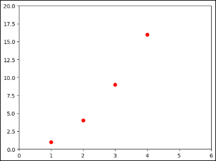
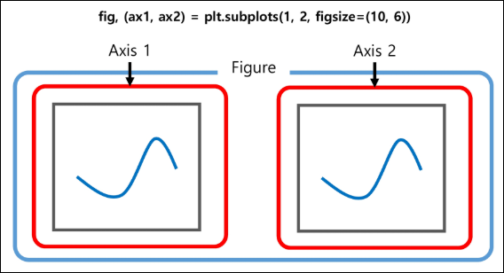
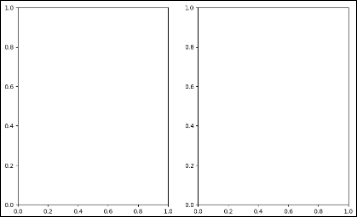
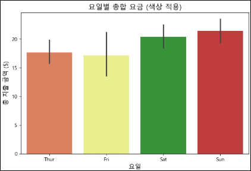
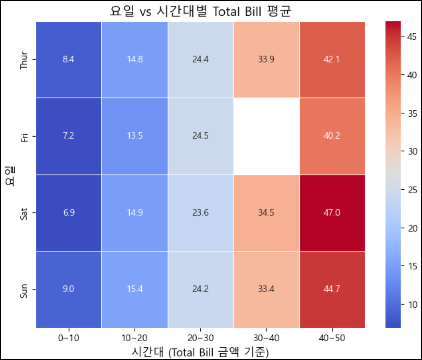
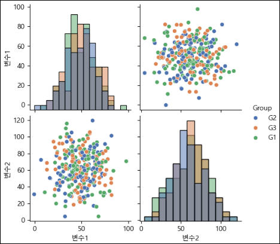

# 데이터 시각화
- 통계적인(Statistical) 시각화
  - 데이터 특성 파악, 분석 목적
    1. 히스토그램
    2. 바이올린 플롯
    3. 산점도
    4. 바 차트
    5. 분위
    6. 상관 히트맵

- 업무 분석(Business Analysis) 시각화
  - 의사결정, 해석 목적
    1. 바 차트
    2. 라인 플롯
    3. 파이 차트
    4. 영역 차트
    5. 산점도
    6. 방사형 차트
    7. 버블 차트
    8. 깔때기 차트

  

- 데이터 시각화의 주요 목적
  - 데이터를 쉽게 이해할 수 있도록 돕기 위함
  - 데이터 간 패턴과 추세를 발견하기 위함
  - 탐색적 데이터 분석에 도움되기 때문

### 데이터 유형에 따른 시각화 그래프


- 히스토그램
  - 분포 확인, 특정 값이 많이 나타나는지 분석할 때 주로 사용

    

- 막대 그래프
  - 가로 막대 그래프
    - 항목별 차이를 비교할 때 주로 사용
    - 긴 텍스트 라벨을 가독성 좋게 표시

      

  - 세로 막대 그래프
    - 항목별 차이를 나타낼 때 주로 사용
    - 시간 흐름이나 순차적인 데이터를 표현

      

- 산점도
  - 복수의 변수를 비교하거나
  - 상관관계를 파악할 때 자주 사용

    

- 선 그래프(line plot)
  - 시계열의 변화를 나타낼 때 자주 사용

    

### 다양한 그래프


- 박스 플롯
  - 하나 이상의 연속형 변수의 분포와 이상값을 시각화

    

- 바이올린 플롯
  - 박스 플롯 + 커널 밀도 추정(KDE)를 합친 형태
  - 분포의 형태와 밀도를 함께 시각화함

    

- 히트맵
  - 이차원 형태의 데이터 값의 크기를 색상 농도로 시각화해 패턴 및 상관관계 파악

    

- 버블 차트
  - 산포도(Scatter Plot)에 크기라는 차원(변수)을 추가한 형태

    


## Matplotlib
### Matplotlib 장단점
- 장점
  - 유연성
    - 모든 종류의 플롯 가능, 세밀한 커스터마이징
  - 넣은 사용자층과 문서
    - 풍부한 자료와 커뮤니티 지원
  - 정교한 제어
    - 그래프의 모든 요소 조정 가능

- 단점
  - 복잡성
    - 간단한 작업도 많은 코드 필요
  - 기본 스타일
    - 추가 스타일링 필요할 수 있음

### Matplotlib 시각화 구성요소


### pyplot
- pyplot의 중요 요소
  - Figure
    - 그림을 그리기 위한 Canvas 역할(도화지)
    - 그림판의 크기 등을 조절
  - Axes
    - 실제 그림을 그리는 메소드들을 가짐(실제 그려지는 영역)
    - x축, y축, Title 등의 속성 설정

    

- pyplot 모듈
  - 기본
    ```python
    import matplotlib.pyplot as plt

    # 선 그래프를 그리는 함수
    plt.plot([1, 2, 3], [2, 4, 6])  # x 값 [1, 2, 3]과 y 값 [2, 4, 6]을 이용하여 그래프를 그림

    # 그래프의 제목 설정
    plt.title("Hello plot")

    # 그래프 출력
    plt.show()
    ```
    
  
  - 레이블 설정
    ```python
    import matplotlib.pyplot as plt

    plt.plot([1, 2, 3, 4]) # 하나만 넣으면 x축은 자동입력 [0,1,2,3,...]
    plt.ylabel('some numbers')  # y축 라벨 설정
    plt.show()
    ```
    

  - 그래프 fomatting 변경
    ```python
    import matplotlib.pyplot as plt

    plt.plot([1, 2, 3, 4], [1, 4, 9, 16], 'ro')  # 빨간색 원형 마커 (r - red, o - 원형)
    plt.axis([0, 6, 0, 20])  # 축 범위 설정 (x축: 0~6, y축: 0~20)
    plt.show()
    ```
    
  
- 여러 개의 plot을 가지는 Figure

  

  - 기본 구조
    ```python
    import matplotlib.pyplot as plt

    fig, (ax1, ax2) = plt.subplots(nrows=1, ncols=2, figsize=(10, 6))
    ```
    

- pyplot을 활용한 시각화
  - 여러 axes를 하나의 figure로 추출
    - Figure: matplotlib에서 전체 플롯이 그려지는 "캔버스"와 같은 역할
    - Axes: matplotlib에서 실제 데이터가 그려지는 영역을 의미

    ```python
    import numpy as np
    import matplotlib.pyplot as plt

    def f(t):
        return np.exp(-t) * np.cos(2 * np.pi * t)

    t1 = np.arange(0.0, 5.0, 0.1)
    t2 = np.arange(0.0, 5.0, 0.02)

    plt.figure()

    plt.subplot(211) # 2행 1열의 그리드로 나누고, 그 중 첫 번째 위치(위쪽)에 플롯
    plt.plot(t1, f(t1), 'bo', t2, f(t2), 'k') 

    plt.subplot(212) # 2행 1열의 그리드로 나누고, 그 중 두 번째 위치(아래쪽)에 플롯
    plt.plot(t2, np.cos(2 * np.pi * t2), 'r--')

    plt.show()
    """
    만약 2x2 형태로 그리고 싶다면?   
    plt.subplot(221)  # 2행 2열 중 첫 번째(왼쪽 위)
    plt.subplot(222)  # 2행 2열 중 두 번째(오른쪽 위)
    plt.subplot(223)  # 2행 2열 중 세 번째(왼쪽 아래)
    plt.subplot(224)  # 2행 2열 중 네 번째(오른쪽 아래) 
    """
    ```
    
    
  - y축의 scale 변경
    ```python
    import numpy as np
    import matplotlib.pyplot as plt

    # 재현성을 위해 시드 설정
    np.random.seed(42)

    # [0,1] 구간에서 1000개의 정규 분포 난수 생성
    y = np.random.normal(loc=0.5, scale=0.4, size=1000)
    y = y[(y > 0) & (y < 1)]
    y.sort()
    x = np.arange(len(y))

    # 다양한 축 스케일을 적용한 그래프
    plt.figure()

    # Linear Scale
    plt.subplot(221)
    plt.plot(x, y)
    plt.yscale('linear')
    plt.title('Linear')
    plt.grid(True)

    # Log Scale
    plt.subplot(222)
    plt.plot(x, y)
    plt.yscale('log')
    plt.title('Log')
    plt.grid(True)

    # Symmetric Log Scale
    plt.subplot(223)
    plt.plot(x, y - y.mean())
    plt.yscale('symlog', linthresh=0.01)
    plt.title('Symmetric log')
    plt.grid(True)

    # Logit Scale
    plt.subplot(224)
    plt.plot(x, y)
    plt.yscale('logit')
    plt.title('Logit')
    plt.grid(True)

    # 여백 자동 조정
    plt.subplots_adjust(top=0.85, bottom=0.1, left=0.1, right=0.95, hspace=0.35, wspace=0.35)

    plt.show()
    ```
    

- 여러 구성 요소 활용
  - color, marker, linestyle, linewidth, marksize
    ```python
    import matplotlib.pyplot as plt

    # x_value, y_value 선언
    x_value = [1, 2, 3, 4]  # x 좌표
    y_value = [2, 4, 6, 8]  # y 좌표

    # 그래프 스타일 설정 및 플로팅
    plt.plot(x_value, y_value, color='red', marker='o', linestyle='dashed', linewidth=2, markersize=10)

    # x축, y축 라벨 추가
    plt.xlabel('x axis')
    plt.ylabel('y axis')

    # 그래프 출력
    plt.show()
    ```
    
  
  - x축과 y축 tick값 회전
    ```python
    import numpy as np
    import matplotlib.pyplot as plt

    x_value = np.arange(0, 100)
    y_value = 2 * x_value

    plt.plot(x_value, y_value, color='green')
    plt.xlabel('x axis')
    plt.ylabel('y axis')

    plt.xticks(ticks=np.arange(0, 100, 5), rotation=90)  # x축 눈금을 5 간격으로 설정 & 90도 회전
    plt.yticks(rotation=45)  # y축 눈금 45도 회전

    plt.title('Hello Ssafy')
    plt.show()
    ```
    

  - x축 값을 0에서 50으로, y축 값을 0에서 100으로 제한
    ```python
    import numpy as np
    import matplotlib.pyplot as plt

    x_value = np.arange(0, 100)
    y_value = 2 * x_value

    plt.plot(x_value, y_value, color='green')
    plt.xlabel('x axis')
    plt.ylabel('y axis')

    plt.xlim(0, 50)  # x축 범위 설정 (0~50)
    plt.ylim(0, 100)  # y축 범위 설정 (0~100)

    plt.title('Hello Ssafy')
    plt.show()
    ```
    
  
  - 범례 설정
    ```python
    import numpy as np
    import matplotlib.pyplot as plt

    x_value = np.arange(1, 100)
    y_value = 5 * x_value

    plt.plot(x_value, y_value, color='purple', label='LINE1')
    plt.xlabel('x Axis')
    plt.ylabel('y Axis')

    plt.legend()  # 범례 추가
    plt.title('Hello Ssafy')
    plt.show()
    ```
    

- pyplot을 활용한 시각화(그래프 formatting 변경)
  - 하나의 figure에 여러 graph를 표현
    ```python
    import numpy as np
    import matplotlib.pyplot as plt

    # 0.2 간격으로 0~5까지 생성
    t = np.arange(0, 5., 0.2)

    # 여러 스타일의 그래프
    plt.plot(t, t, 'r--',  # 빨간색 점선
            t, t**2, 'bs',  # 파란색 사각형 마커
            t, t**3, 'g^')  # 녹색 삼각형 마커
    plt.show()
    ```
    
  
  - 하나의 figure에 여러 graph를 표현
    ```python
    import numpy as np
    import matplotlib.pyplot as plt

    # x값 생성
    x_value_01 = np.arange(1, 100)
    x_value_02 = np.arange(1, 200)

    # y값 생성
    y_value_01 = 2 * x_value_01
    y_value_02 = 4 * x_value_01

    # 두 개의 선 그래프 그리기
    plt.plot(x_value_01, y_value_01, color='blue', label='Line1')
    plt.plot(x_value_01, y_value_02, color='red', label='Line2')

    # x축, y축 라벨 설정
    plt.xlabel('x axis')
    plt.ylabel('y axis')

    # 범례 추가
    plt.legend()

    # 그래프 제목 추가
    plt.title('Hello Ssafy')

    # 그래프 출력
    plt.show()
    ```
    
  
  - 하나의 figure에 여러 graph를 표현
    ```python
    import numpy as np
    import matplotlib.pyplot as plt

    # x값 생성
    x_value_01 = np.arange(1, 10)

    # y값 생성
    y_value_01 = 2 * x_value_01

    # 선 그래프 추가
    plt.plot(x_value_01, y_value_01, color='cyan', marker='v', linestyle='dashed',
            linewidth=2, markersize=6, label='Dashed1')

    # 막대 그래프 추가
    plt.bar(x_value_01, y_value_01, color='gray', label='Bar1')

    # x축, y축 라벨 설정
    plt.xlabel('x axis')
    plt.ylabel('y axis')

    # 범례 추가
    plt.legend()

    # 그래프 제목 추가
    plt.title('Hello Ssafy')

    # 그래프 출력
    plt.show()
    ```
    
 

## Seaborn
### seaborn의 장단점
- 장점
  - 간결함: 적은 코드로 세련된 시각화 가능
  - 기본 스타일: 매력적인 스타일 제공
  - 데이터프레임 친화적: Pandas와 잘 통합됨
  - 고급 통계 기능: 통계적 시각화 쉽게 구현

- 단점
  - 제한된 커스터마이징: 세부적인 조정이 어려움
  - 유연성 부족: 특정 그래프나 기능에 한계

### seaborn을 사용한 시각화
- Figure level 함수와 Axes level 함수
  - Figure-level
    - Figure 전체를 관리
  - Axes-level
    - 개별 Axes에서 하나의 플롯을 그리는 데 사용

    

- 히스토그램
  ```python
  import seaborn as sns
  import matplotlib.pyplot as plt
  plt.rcParams['font.family'] = 'Malgun Gothic'
  # seaborn의 tips 데이터셋 불러오기
  df = sns.load_dataset("tips")

  # 그래프 크기 설정
  plt.figure(figsize=(8, 5))

  # 전체 total_bill 분포를 히스토그램으로 표현
  sns.histplot(df["total_bill"],    # 데이터
                bins=20,     # 막대 몇개로 나눌지 결정
                kde=True,    # 커널 밀도 추정 곡선 함께 그리기
                             # 데이터 분포를 부드러운 곡선으로 표현해줌
                             # False하면 곡선 없이 히스토그램만 표시됨
                color="#f1774c")

  # 그래프 제목 및 축 레이블 설정
  plt.title("Total Bill 분포 히스토그램", fontsize=14)
  plt.xlabel("Total Bill ($)", fontsize=12)
  plt.ylabel("빈도 (Frequency)", fontsize=12)

  # 그래프 출력
  plt.show()
  ```
  

- bar 그래프
  ```python
  import seaborn as sns
  import matplotlib.pyplot as plt

  # seaborn의 tips 데이터셋 불러오기
  df = sns.load_dataset("tips")

  # 요일별 색상 지정
  colors = {"Thur": "#f1774b", "Fri": "#f7fe7e", "Sat": "#2ca02c", "Sun": "#d62728"}

  # 그래프 크기 설정
  plt.figure(figsize=(8, 5))

  # 요일별 total_bill 막대 그래프
  sns.barplot(x="day", y="total_bill", data=df, palette=colors)

  # 그래프 제목 및 축 레이블 설정
  plt.title("요일별 총합 요금 (색상 적용)", fontsize=14)
  plt.xlabel("요일", fontsize=12)
  plt.ylabel("총 지출 금액 ($)", fontsize=12)

  # 그래프 출력
  plt.show()
  ```
  

- Heatmap
  - 요일 vs 시간대별 Total bill 평균을 히트맵으로 표현
  ```python
  import seaborn as sns
  import matplotlib.pyplot as plt
  import pandas as pd

  # seaborn의 tips 데이터셋 불러오기
  df = sns.load_dataset("tips")

  # 'hour' 컬럼 생성 (총 지출 금액을 구간별로 분류)
  df["hour"] = pd.cut(df["total_bill"], bins=[0, 10, 20, 30, 40, 50], 
                      labels=["0~10", "10~20", "20~30", "30~40", "40~50"])

  # 피벗 테이블 생성 (요일 vs 시간대별 평균 total_bill)
  pivot_table = df.pivot_table(values="total_bill", index="day", columns="hour", aggfunc="mean")

  # 그래프 크기 설정
  plt.figure(figsize=(8, 6))

  # Heatmap 생성
  sns.heatmap(pivot_table, cmap="coolwarm", annot=True, fmt=".1f", linewidths=0.5)

  # 그래프 제목 및 축 레이블 설정
  plt.title("요일 vs 시간대별 Total Bill 평균", fontsize=14)
  plt.xlabel("시간대 (Total Bill 금액 기준)", fontsize=12)
  plt.ylabel("요일", fontsize=12)

  # 그래프 출력
  plt.show()
  ```
  

- Figure level 함수와 Axes level 함수
  - 예제1
    ```python
    import seaborn as sns
    import matplotlib.pyplot as plt

    # seaborn의 tips 데이터셋 불러오기
    tips = sns.load_dataset("tips")

    # Figure-level 함수 relplot
    sns.relplot(data=tips, x="total_bill", y="tip", hue="smoker", style="time", kind="scatter")
    plt.show()

    # Axes-level 함수 사용 (scatterplot 활용)
    plt.figure(figsize=(8, 6))
    sns.scatterplot(data=tips, x="total_bill", y="tip", hue="smoker", style="time")
    plt.show()

    # Figure-level 함수 (복수 subplot)
    sns.relplot(data=tips, x="total_bill", y="tip", hue="sex", col="time", row="smoker", kind="scatter")
    plt.show()
    ```
    
    

    

  - 예제2
    ```python
    import seaborn as sns
    import matplotlib.pyplot as plt

    # seaborn의 titanic 데이터셋 불러오기
    titanic = sns.load_dataset("titanic")

    # Figure-level 함수 catplot
    sns.catplot(data=titanic, x="class", y="age", kind="violin", hue="sex", split=True)
    plt.show()

    # 같은 작업을 Axes-level 함수로 수행
    plt.figure(figsize=(8, 6))
    sns.violinplot(data=titanic, x="class", y="age", hue="sex", split=True)
    plt.show()
    ```
    
    


## Plotly
### plotly의 장단점
- 장점
  - 상호작용성: 상호작용 가능한 그래프 기본 제공
  - 웹 통합: 웹 기반 시각화에 최적화
  - 3D 및 지리적 시각화: 고급 시각화를 간단히 구현
  - 시각적 미학: 세련된 기본 그래프 제공

- 단점
  - 학습 곡선: 고급 기능 활용을 위해 학습 필요
  - 대규모 데이터 처리 한계: 성능 문제 발생 가능
  - 복잡한 커스터마이징: 세밀한 조정이 복잡할 수 있음

### plotly을 사용한 시각화
- 기본
  ```python
  import plotly.express as px
  import plotly.io as pio

  # 환경에 맞게 설정
  pio.renderers.default = "browser"  # vscode를 위해선 따로 설정 필요

  # 데이터 불러오기 (Oceania 대륙 데이터 필터링)
  df = px.data.gapminder().query("continent=='Oceania'")

  # 그래프 그리기
  fig = px.line(df, x="year", y="lifeExp", color="country")

  # 마커 추가 (점 + 선)
  fig.update_traces(mode="markers+lines")

  # 그래프 출력
  fig.show()
  ```
  

- plotly 제공 템플릿 활용
  ```python
  import plotly.express as px
  import plotly.io as pio
  # pio.renderers.default = "browser"  # vscode를 위해선 따로 설정 필요

  # gapminder 데이터 로드 (국가별 통계 및 건강 지표 포함)
  df = px.data.gapminder()

  # 2007년 데이터 필터링
  df_2007 = df.query("year==2007")

  # 다양한 Plotly 템플릿을 적용하여 시각화
  for template in ["plotly", "plotly_white", "plotly_dark", "ggplot2", "seaborn", "simple_white", "none"]:

      # 산점도 (scatter plot) 생성
      fig = px.scatter(df_2007, 
                      x="gdpPercap",  # x축: 1인당 GDP (log 스케일 적용)
                      y="lifeExp",     # y축: 기대수명
                      size="pop",      # 원 크기: 인구수(Population)
                      color="continent",  # 색상: 대륙별 구분
                      log_x=True,  # x축을 로그 스케일로 변환
                      size_max=60,  # 원의 최대 크기 지정
                      template=template,  # 템플릿 적용
                      title=f"Gapminder 2007 - {template}")  # 제목에 템플릿 이름 포함

      # 그래프 출력
      fig.show()
  ```
  

  ```python
  import plotly.io as pio

  # pio.renderers.default = "notebook"  # 기본 렌더러 변경
  pio.renderers.default = "browser"  # 브라우저에서 그래프를 열도록 설정

  fig.show()
  ```

## 추가 개념 및 정리
### groupby
- 형태: `data.groupby("컬럼명")["집계할컬럼"].집계함수()`

- 예시
  - 요일별 및이용객 수 집계
    ```python
    weekday_agg = data.groupby('DayOfWeek')['PassengerCount'].sum()
    ```

- `agg()`
  - 여러 통계 함수를 한 번에 적용해서 집계 결과를 낼 때 사용
  - `df.groupby("그룹컬럼")["대상컬럼"].agg(함수목록)`
    - 그룹컬럼(범주형 변수, ex. 성별, 지역, 요일 등)
    - 대상컬럼(수치형 변수, ex. 키, 몸무게, 매출 등)
    - `agg([...])`: 여러 개의 집계 함수를 동시에 적용
  - 예시
    ```python
    # 성별별 평균, 중앙값, 표준편차, 최소/최대 값을 계산하여 통계적 차이 확인
    stats = df.groupby("Gender")["Height"].agg(["mean", "median", "std", "min", "max"])

    # 성별별 키의 통계 데이터를 출력
    print("\n성별별 키의 기초 통계:")
    print(stats)
    ```
    

### plot
- 가로 막대 그래프
  ```python
  # 요일별 이용객 수 가로 막대 그래프 시각화
  plt.figure(figsize=(10, 6))
  weekday_agg.plot(kind='barh', color='skyblue')
  plt.title('Total Passengers by Day of the Week')
  plt.xlabel('Passenger Count')
  plt.ylabel('Day of the Week')
  plt.show()
  ```
  

- 선 그래프
  ```python
  # 시간대별 이용객 수 꺾은선 그래프 시각화
  plt.figure(figsize=(10, 6))
  time_agg.plot(kind='line', color='blue', marker='o')
  plt.title('Total Passengers by Time of Day')
  plt.xlabel('Time')
  plt.ylabel('Passenger Count')
  plt.xticks(rotation=45)
  plt.grid(True)
  plt.show()
  ```
  

### bar Chart
- 카테고리별 데이터 분포 시각화
  ```python
  plt.figure(figsize=(12, 6))
  sns.countplot(data=df, x='Category', palette='viridis')  # 카테고리별 개수 시각화
  plt.title('카테고리별 데이터 분포')
  plt.xticks(rotation=45)  # X축 라벨 가독성 개선
  plt.xlabel('카테고리')
  plt.ylabel('개수')
  plt.show()

  # **해석**
  # - 데이터가 각 카테고리에 어떻게 분포하는지 한눈에 파악할 수 있음.
  # - 특정 카테고리에 데이터가 치우쳐 있거나 부족한 경우 데이터 수집 전략을 조정할 필요가 있음.
  ```
  

- 카테고리별 수치 데이터 합계 비교
  ```python
  if 'Value' in df.columns:  # '값' 컬럼이 존재하는 경우
      plt.figure(figsize=(12, 6))
      sns.barplot(data=df, x='Category', y='Value', estimator=sum, palette='coolwarm')
      plt.title('카테고리별 값 합계')
      plt.xticks(rotation=45)
      plt.xlabel('카테고리')
      plt.ylabel('합계 값')
      plt.show()

      # **해석**
      # - 각 카테고리에서 총합을 비교하여 상대적인 중요도를 파악 가능.
      # - 특정 카테고리의 값이 유난히 크거나 작은 경우 데이터 이상치를 검토해야 함.
  ```
  

### Box plot
- 카테고리별 분포
  ```python
  # 3. 카테고리별 분포 (Boxplot)

  plt.figure(figsize=(12, 6))
  sns.boxplot(data=df, x='Category', y='Value', palette='pastel')
  plt.title('카테고리별 값 분포')
  plt.xticks(rotation=45)
  plt.xlabel('카테고리')
  plt.ylabel('값')
  plt.show()

  # **해석**
  # - 각 카테고리별 값의 중앙값, 범위 및 이상치를 시각적으로 확인할 수 있음.
  # - 특정 카테고리에서 이상치가 많이 발견된다면 데이터 정제 작업이 필요할 수 있음.
  ```
  

### Heatmap
- 변수 간 상관 행렬 및 히트맵
  ```python
  correlation_matrix = df[['변수1', '변수2']].corr()
    # 상관 행렬 계산 (숫자형 변수만 자동 선택)
    # correlation_matrix = df.corr(numeric_only=True)

  plt.figure(figsize=(6, 5))
  sns.heatmap(correlation_matrix, annot=True, cmap="coolwarm", fmt=".2f", linewidths=0.5)
  plt.title("변수 간 상관 행렬")
  plt.show()

  # 해석:
  # - 변수1과 변수2의 상관 계수를 확인
  # - 1에 가까울수록 양의 상관관계, -1에 가까울수록 음의 상관관계
  # - 0에 가까우면 상관성이 낮음
  ```
  - `sns.heatmap()`은 **숫자형 행렬(2차원 배열 형태)**을 입력받아야 함
    - 그냥 df 전체를 넣으면 문자열(ex. 그룹명 등) 때문에 에러남
  - 따라서 **상관행렬(correlation matrix)**을 먼저 만들어서 그 결과를 히트맵에 전달해야 함!

### pairplot
여러 변수 쌍의 산점도를 자동으로 그려주는 함수

- n개의 수치형 변수가 있으면, `n*n` 격자 형태의 그림이 생성됨
- 각 셀에는 두 변수의 산점도, 대각선에는 히스토그램이 표시됨

```python
sns.pairplot(df,          # 여러 수치형 변수 포함된 dataFrame
            hue="Group",  # 그룹 컬럼 기준으로 색상 다르게 지정
            palette="deep",   # 색상 팔레트 설정
            diag_kind="hist"  # 대각선에 히스토그램 표시(기본은 KDE 커브)
)
plt.show()

# 해석:
# - 여러 변수 간의 관계를 한눈에 보기 위한 시각화 기법
# - 같은 변수 간의 히스토그램을 대각선(diagonal)에 표시
# - 산점도와 히스토그램을 함께 제공하여 데이터 패턴을 쉽게 파악 가능
  # 산점도
    # 변수 간 관계 확인
    # 직선에 가까우면 선형관계 가능성 ↑
    # 원형/흩어진 형태면 상관 약함
  # 히스토그램
    # 각 변수의 분포 확인
    # 그룹별 색상이 분리되면 그룹 차이가 뚜렷함
```


### 이동 평균(Moving Average) - `rolling`
이동 평균(Moving Average)은 **시계열 데이터에서 단기 변동을 줄이고 추세(Trend)를 확인**하기 위한 방법

-> 일정 구간(window)의 데이터를 묶어서 평균을 내고, 이 윈도우를 한 칸씩 옮겨가며 계산함

- 기본 문법
  ```python
  df["이동평균컬럼"] = df["대상컬럼"].rolling(window=윈도우크기).mean()
  ```
  - window
    - 이동 평균을 계산할 구간 크기 (예: 3 → 3개 값 기준)
  - .mean() 
    - 해당 구간의 평균을 계산
  - 동작 예시

    


