# 탐색적 데이터 분석(EDA)
## 탐색적 데이터 분석
### EDA (Exploratory Data Analysis)
데이터를 살펴보고 데이터를 이해하기 위한 첫 과정

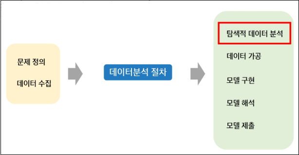

-> 어떤 문제를 해결하고자 하는지 명확하게 정의

-> 문제 해결에 필요한 데이터 확보

-> 이후 탐색적 데이터 분석 단계로 진입!

- 고전적인 통계학 vs EDA
  - 고전적인 통계학
    - 적은 표본(샘플)을 가지고 더 큰 모집단에 대한 결론을 도출하기 위한 일련의 복잡한 과정

  - 탐색적 데이터 분석(EDA)
    - **데이터의 본질 이해**하고, 데이터 **숨겨진 패턴을 찾기** 위해 데이터를 **시각화하고 요약**하는 과정
    - 데이터 시각화(Matplotlib, seaborn ..)
    - 가정에 얽매이지 않음(고전적 통계학에서는 주로 가정을 세움)
    - 이상치 탐지(특이한 값)
    - 기술 통계 수행(고전적 통계와 비슷)

- EDA
  - 데이터를 탐색하고 가설을 세우고 증명하는 과정
  - 데이터를 이해하고 특징을 찾아내는 과정
  - 데이터 종류, 사용 모델에 따라 EDA 방향성이 다양함

    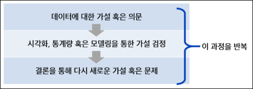
    - 탐색을 확장시켜 나가자

- EDA 과정에서 파악할 요소
  - 데이터 크기는 어느 정도인지
  - 학습 데이터와 테스트 데이터는 어떻게 분리가 되어있는지
  - 결측값은 어느 정도인지
  - 라벨이 있는 데이터라면 분포는 어떻게 되어있는지
  - 데이터의 특이점이 있는지
  - (기본적인 데이터를 이해하는 과정임 -> 구조, 특성 파악)


## 위치, 변이와 관계 추정
※ 데이터를 표현하는 변수들은 여러 다른 값을 가지고 있는데, 처음 데이터를 살펴볼 때 어떻게 접근하면 좋을까?

-> 각 변수가 대표하는 값을 구해 데이터를 살펴보자

-> 또, 데이터가 얼마나 퍼져있는지 확인해보자

### 위치 추정
각 변수를 대표하는 값을 구하여 데이터를 살펴봄

- 위치 추정하는 다양한 방법
  - 평균 (mean)
  - 절사평균 (trimmed mean)
    - 양 끝단을 제외한 평균(극단값의 영향을 줄인 평균)
  - 가중평균 (weighted mean)
    - 데이터마다 중요도에 따라 기여도를 다르게하여 평균 계산
  - 중간값 (median)
  - 가중 중간값 (weighted median)
  - 백분위수 (percentile)

  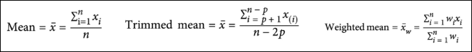

### 변이 추정
데이터가 얼마나 퍼져 있는지 확인

- 변이를 추정하는 다양한 방법
  - 분산 (Variance)
    - 평균으로부터 얼마나 퍼져 있는지를 나타내는 지표
  - 표준편차 (Standard deviation)
    - 데이터의 편차(각 값에서 평균을 뺀 값)의 기준이 되는 값
  - 사분할 범위 (IQR)
    - 25번째 백분위수와 75번째 백분위수의 차이를 보는 것
  
  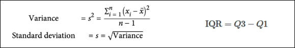

### 상관관계
- 양의 상관관계
  - X가 큰 가지면 Y도 큰 값을 갖고, X가 작은 값을 가지면 Y도 작은 값을 갖는 경우
  - 변수 X와 Y는 서로 양의 상관관계를 갖는다고 함
- 음의 상관관계
  - X가 큰 값을 갖게 될 때, Y가 작은 값을 갖는 경우
  - 변수 X와 Y는 서로 음의 상관관계를 갖는다고 함

- 용어
  - 상관계수
    - 수치적 변수들 간에 어떤 관계가 있는지 나타내기 위해 사용되는 특정량
    - 범위: `-1 <= x <= 1`
      - `r = 1` : 완벽하게 양의 상관관계 따름
      - `r = -1` : 완벽하게 음의 상관관계 따름
      - `r = 0` : 관계XX

    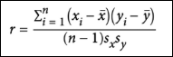

  - 상관 행렬
    - 행과 열이 변수들을 의미하는 표를 말함
    - 각 셀은 그 행과 열에 해당하는 변수들 간의 상관관계를 의미

    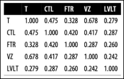
    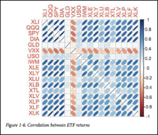

  - 산점도(Scatter plot)
    - x축과 y축이 서로 다른 두 개의 변수를 나타내는 도표

    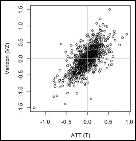    

### 데이터 분포 탐색
데이터 분포는 **다양한 시각화 도구를 사용하여 확인**함

- 시각화 도구
  - 상자그림 (box plot)

    

  - 도수 분포표 (frequency table)

    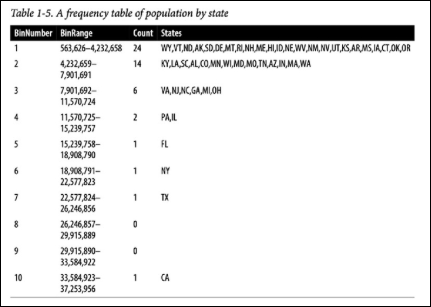

  - 히스토그램 (histogram)

    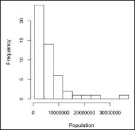

  - 밀도 그림 (density plot)

    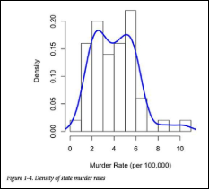


## 정형화된 데이터, 테이블 데이터의 이해
### 정형화된 데이터
- 수치형 데이터
  - 연속형 데이터
    - **무한한 값**을 가질 수 있는 수치데이터
    - ex. 풍속, 지속시간 등
  - 이산형 데이터
    - **특정한 정수 값**을 가질 수 있는 수치데이터
    - ex. 사건의 발생 빈도 등

- 범주형 데이터
  - 명목형 데이터
    - **순서의 의미가 없**는 범주데이터
    - ex. TV 스크린 종류(플라즈마, LCD, LED 등)
    - ex. 도시명(대전, 부산 등)
  - 순위형 데이터
    - **순서의 의미가 있**는 범주데이터
    - ex. 수치로 나타낼 수 있는 평점(1, 2, 3, 4, 5점 등)
    - ex. 선호도(좋음, 중립, 싫음)

※ 굳이 데이터 종류를 분리해야 하는 이유

-> 데이터를 분석하고 예측을 모델링 할 때

-> 시각화, 해석, 모델결정 등에 데이터 종류가 중요한 역할을 하기 때문!

### 테이블 데이터
데이터 분석에서 가장 대표적으로 사용하는 데이터

- 용어
  - DataFrame
    - 통계와 머신러닝 모델에서 가장 기본이 되는 테이블 형태의 데이터 구조
  - Feature
    - 테이블의 각 열을 의미
  - Output
    - 데이터 과학 프로젝트의 목표는 대부분 어떤 결과를 예측하는 것에 있음
    - 그 결과를 예측하기 위해 피처를 사용
  - Record
    - 테이블에서 하나의 행을 의미

  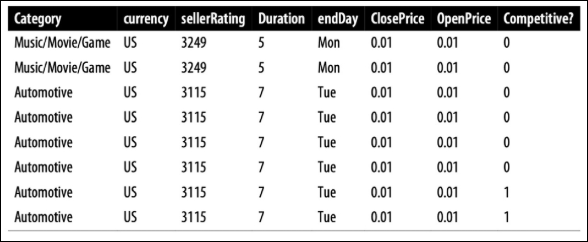

### 테이블 데이터가 아닌 데이터 구조
- 시계열 데이터
  - 동일한 변수 안에 연속적인 측정값을 갖는 데이터
  - 즉, 시간이 축이 되는 데이터
  - 변수가 시간에 따라 기록되는 데이터로, 주기성, 변화, 흐름을 중점으로 봄

- 공간 데이터
  - 지도 제작과 위치 정보 분석에 사용됨

  - 테이블 데이터보다 좀 더 복잡하고 다양함
    - 객체를 표현할 때는, 공간 좌표가 데이터의 중심이 됨
    - 필드 정보는 공간을 나타내는 작은 단위들과 적당한 측정 기준 값에 중점을 둠

- 그래프 데이터
  - 물리적 관계, 사회적 관계, 다소 추상적인 관계들을 표현하기 위해 사용
  - ex. 페이스북이나 링크드인 값은 소셜 네트워크의 그래프
  - ex. 도로의 연결된 물류 중심지


## 정형 데이터 EDA 과정
### 타이타닉 데이터를 사용하여 EDA 진행
0. 개별 변수 분포(Variation) 파악 -> 변수간 분포 관계(Covariation) 파악

    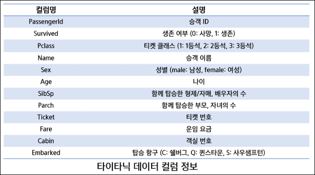

1. 데이터 확인
    ```python
    import pandas as pd
    import seaborn as sns
    import matplotlib.pyplot as plt
    
    # 한글 사용 준비
    plt.rcParams['font.family'] = 'Malgun Gothic'

    train_dt = pd.read_csv('titanic.csv')
    train_dt.head()

    train_dt.info()
    ```
    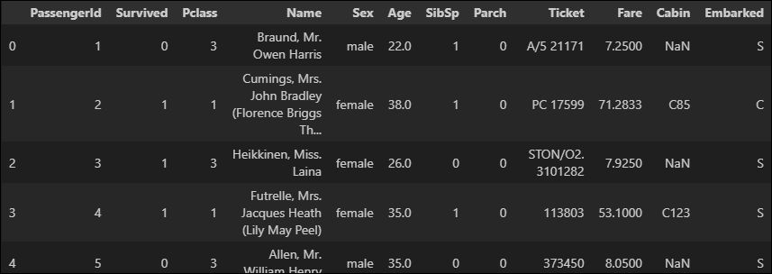

    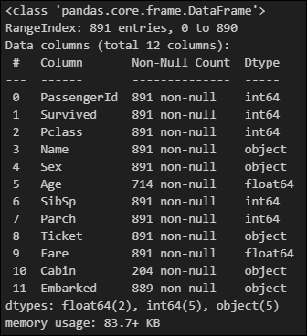
    - `Age`, `Cabin`, `Embarked`에 결측치가 있는 것 확인
    - 특히 `Cabin`의 결측치가 상당히 많이 존재함
      - Feature로 사용하기 힘들 것 같음
    - PassengerId는 승객 번호이므로 생존 유무와 연관성 없어보임

2. Feature Exploration
    - 각 피처별로 분석 진행
      - seaborn 사용하여 피처에 대한 시각화 진행
      - 정보를 얻을 수 있는 데이터와 아닌 데이터를 구별
    
    - 수치형 변수(`age`, `sibsp`, `parch`, `fare`)에 대한 분포 확인
      ```python
      # 수치형 변수 선택
      continuous_vars = ["Age", "SibSp", "Parch", "Fare"]

      # 그래프 스타일 설정
      plt.figure(figsize=(12, 4))
      plt.suptitle("수치형 데이터 개별 변수 분포(Variation)", fontsize=14, fontweight="bold")

      # 각 변수에 대한 분포 플롯 생성
      for i, var in enumerate(continuous_vars):
          plt.subplot(1, 4, i+1)
          sns.histplot(train_dt[var], bins=30, kde=True)
          plt.title(var.capitalize())
          plt.xlabel(var)
          plt.ylabel("Count")

      plt.tight_layout(rect=[0, 0, 1, 0.9])
      plt.show()
      ```
      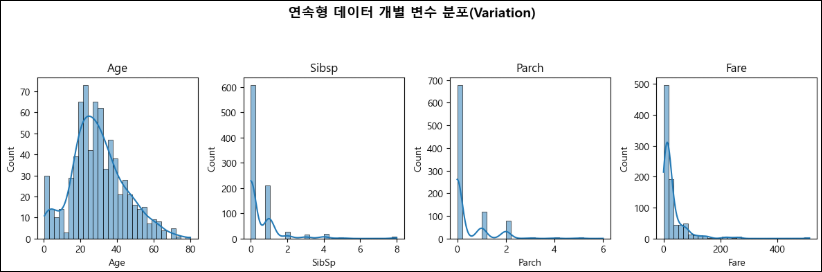
      - Age를 제외한 나머지는 왼쪽에 치우친 포아송 형태
      - Age는 20 ~ 40 구간이 많음
      - 이런 분포를 파악하는 이유는 '어떤 변수는 스케일링 필요할 수도 있고', '어떤 것은 범주형으로 변환하거나', '이상치 처리를 해주거나' 하는 등을 파악할 수 있기 때문
      - 그래서 EDA 초반에 분포 확인해보는게 좋음

    - 범주형 변수(`Pclass`, `Sex`, `Embarked`)에 대한 분포 확인
      ```python
      # 범주형 변수 선택
      categorical_vars = ["Pclass", "Sex", "Embarked"]

      # 그래프 스타일 설정
      plt.figure(figsize=(12, 4))
      plt.suptitle("범주형 데이터 개별 변수 분포", fontsize=14, fontweight="bold")

      # 각 변수에 대한 카운트 플롯 생성
      for i, var in enumerate(categorical_vars):
          plt.subplot(1, 3, i+1)
          sns.countplot(x=train_dt[var], palette="muted")
          plt.title(var.capitalize())
          plt.xlabel(var)
          plt.ylabel("Count")

      plt.tight_layout(rect=[0, 0, 1, 0.9])
      plt.show()
      ```
      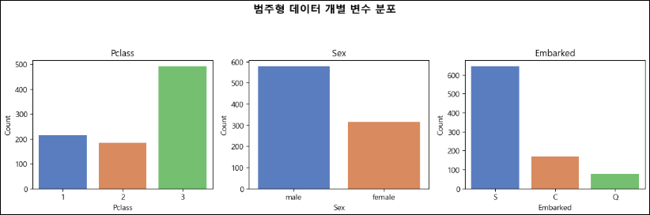

    - Feature Exploration - `Survived`
      ```python
      train_dt['Survived'].value_counts()
      ```
      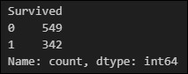
      - 생존 유뮤를 나타내는 Feature
      - 전체 데이터의 생존유무 수치화 진행
      - 0은 사망, 1은 생존을 나타냄
      - 한눈에 볼 수 있게 pie와 bar plot을 사용해 시각화
      ```python
      train_dt_copy = train_dt.copy()
      # Survived 변수 매핑 (0: 사망, 1: 생존)
      train_dt_copy["Survived"] = train_dt_copy["Survived"].map({0: "사망", 1: "생존"})

      # 생존자 및 사망자 수 계산
      survived_counts = train_dt_copy["Survived"].value_counts()
      labels = survived_counts.index
      sizes = survived_counts.values
      colors = ["#1f77b4", "#ff7f0e"]
      explode = [0, 0.1]  # 생존자 부분만 분리

      # 그래프 설정
      fig, axes = plt.subplots(1, 2, figsize=(8, 4))  # 크기 조정
      fig.suptitle("", fontsize=14, fontweight="bold")

      # 파이 차트 (조각 분리)
      axes[0].pie(
          sizes, labels=labels, autopct="%1.1f%%", colors=colors, explode=explode, shadow=True
      )
      axes[0].set_title("")

      # 바 차트
      sns.barplot(x=labels, y=sizes, ax=axes[1], palette=colors)
      axes[1].set_ylabel("Count")

      plt.tight_layout()
      plt.show()
      ```
      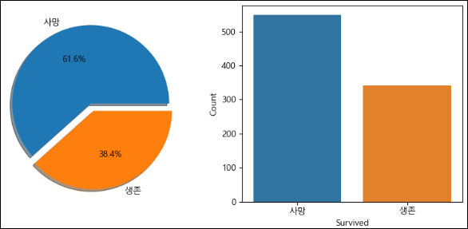
      - 수치상으로 사망자의 수가 더 많은 것을 알 수 있음
      - 사망자 비율이 엄청 높음
      - **탑승객의 다른 정보와 생존 유무가 어떠한 상관관계가 있는지 확인 필요**

    - Feature Exploration - `Name`
      - 탑승객의 이름을 나타내는 Feature
      - 이름 때문에 생존 유무가 갈리지는 않겠지만, 데이터 확인
        ```python
        train_dt['Name'].unique()
        ```
        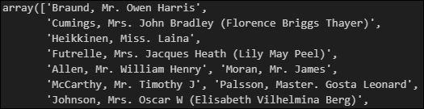

    - Feature Exploration - `Pclass`
      - 티켓의 클래스(등급)을 나타내는 Feature
      - 1, 2, 3클래스 (1등석, 2등석, 3등석)으로 나누어져 있음
      - 클래스별로 인원 비율 확인 필요
        ```python
        train_dt['Pclass'].value_counts()
        ```
        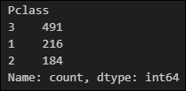
        ```python
        # 그래프 스타일 설정
        plt.figure(figsize=(6, 5))

        # 막대 그래프 생성
        ax = sns.barplot(x=train_dt["Pclass"].value_counts().index, 
                        y=train_dt["Pclass"].value_counts().values, 
                        palette=["#76b7b2", "#f28e75", "#a5add9"])  # 색상 설정

        # 제목 설정
        plt.title("Feature Exploration - Pclass", fontsize=14, fontweight="bold", color="#1f3b7a")
        plt.xlabel("Pclass", fontsize=12)
        plt.ylabel("Count", fontsize=12)

        # y축 눈금 설정
        plt.ylim(0, 550)

        plt.show()
        ```
        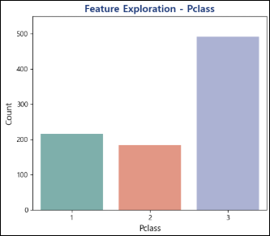
        - 1, 2 클래스에 비해 3 클래스가 많음
        - 이제 Pclass와 Survived가 어떤 관계가 있는지 확인 필요
        - 클래스 별로 생존율 구해보자
        ```python
        # 그래프 스타일 설정
        plt.figure(figsize=(6, 5))
        sns.set(font="Malgun Gothic", rc={"axes.unicode_minus": False})  

        # 막대 그래프 생성 (Pclass별 Survived 분포)
        ax = sns.countplot(data=train_dt, x="Pclass", hue="Survived", palette=["#4c72b0", "#dd8452"])

        # 제목 및 축 설정
        plt.title("Feature Exploration - Pclass", fontsize=14, fontweight="bold", color="#1f3b7a")
        plt.xlabel("Pclass", fontsize=12)
        plt.ylabel("Count", fontsize=12)

        # 범례 설정
        plt.legend(title="", labels=["사망", "생존"])

        # y축 제한 설정
        plt.ylim(0, 400)

        plt.show()
        ```
        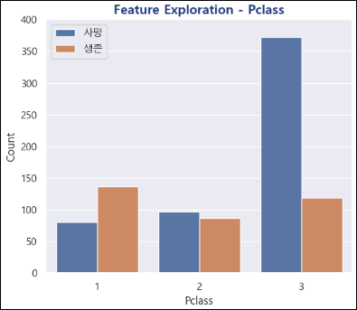
        - 가장 눈에 띄는 3클래스
        - 3클래스 탑승객들의 사망 인원이 가장 많음

        ```python
        # 생존자와 사망자 그룹별 Pclass 비율 계산
        dead_pclass = train_dt[train_dt["Survived"] == 0]["Pclass"].value_counts(normalize=True) * 100
        survived_pclass = train_dt[train_dt["Survived"] == 1]["Pclass"].value_counts(normalize=True) * 100

        # 파이 차트에 표시할 레이블 (Pclass 값)
        labels = ["1", "2", "3"]
        colors = ["#4c72b0", "#dd8452", "#55a868"]

        # 그래프 생성
        fig, axes = plt.subplots(1, 2, figsize=(8, 4))

        # 사망자 파이 차트
        axes[0].pie(dead_pclass.sort_index(), labels=labels, autopct="%1.1f%%", colors=colors)
        axes[0].set_title("사망 - Pclass")

        # 생존자 파이 차트
        axes[1].pie(survived_pclass.sort_index(), labels=labels, autopct="%1.1f%%", colors=colors)
        axes[1].set_title("생존 - Pclass")

        plt.show()
        ```
        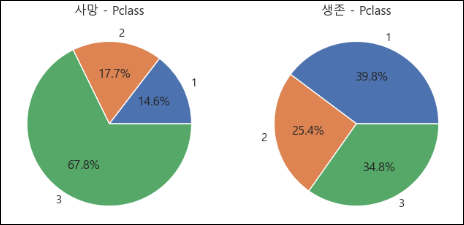
        - 1, 2, 3클래스 순으로 생존율 높음
        - 사망한 탑승객 그래프에서 3 클래스의 비율이 67.8%
        - "3등석이 생존에 불리해 보인다"는 등의 가설 설정 가능
        - 3등석이 인원도 많고 사망자도 많다는 점에서 Pclass가 중요한 피처임을 알 수 있음

    - Feature Exploration - `Sex`
      - 성별을 나타내는 Feature
      - male, female로 나누어짐
        ```python
        # 성별 분포 계산
        sex_counts = train_dt["Sex"].value_counts()
        sex_percent = train_dt["Sex"].value_counts(normalize=True) * 100

        # 성별 한글 변환
        labels = ["남성", "여성"]
        colors = ["#4c72b0", "#dd8452"]
        explode = [0.1, 0]  # 여성 부분만 분리

        # 그래프 생성
        fig, axes = plt.subplots(1, 2, figsize=(8, 4))

        # 파이 차트
        axes[0].pie(sex_percent, labels=labels, autopct="%1.1f%%", colors=colors, shadow=True)
        axes[0].set_title("")

        # 바 차트
        sns.barplot(x=labels, y=sex_counts, ax=axes[1], palette=colors)
        axes[1].set_ylabel("Count")

        plt.show()
        ```
        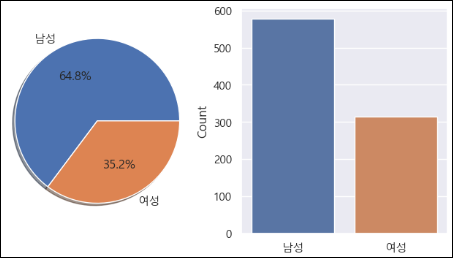
        - 여성보다 남성 탑승객이 더 많음
        - Sex와 Survived 관계 확인 필요
        
        ```python
        # 그래프 크기 설정
        plt.figure(figsize=(5, 4))

        # 성별에 따른 생존 여부 카운트 플롯
        ax = sns.countplot(data=train_dt, x="Sex", hue="Survived", palette=["#4c72b0", "#dd8452"])

        # 한글 라벨 적용
        plt.xlabel("")
        plt.ylabel("Count")
        plt.xticks(ticks=[0, 1], labels=["남성", "여성"], fontsize=11)

        # 범례 설정
        plt.legend(title="", labels=["사망", "생존"], loc="upper right")

        plt.show()
        ```
        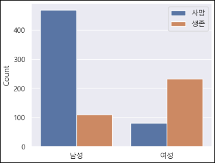
        - 성별에 따른 생존율 차이가 심함
        - 남성의 생존율이 굉장히 낮음
      
        ```python
        fig, ax = plt.subplots(1,2,figsize=(10,6), constrained_layout=True)
        labels = ['여성', '남성']
        
        #Survived 가 0인 데이터를 이용한 Pie Plot
        train_dt[train_dt['Survived'] == 0]['Sex'].value_counts().sort_index().plot.pie(ax=ax[0], shadow=True, autopct='%1.1f%%', labels=labels)
        ax[0].set(ylabel='', title='사망 - Sex')
        
        #Survived 가 1인 데이터를 이용한 Pie Plot
        train_dt[train_dt['Survived'] == 1]['Sex'].value_counts().sort_index().plot.pie(ax=ax[1], shadow=True, autopct='%1.1f%%', labels=labels)
        ax[1].set(ylabel='', title='생존 - Sex')
        
        plt.show()
        ```
        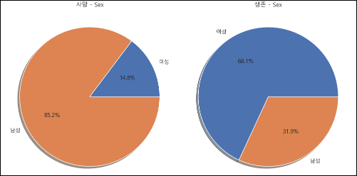
        - 생존-사망을 나누어보니 확연한 차이가 보임
        - 남자 탑승객이 더 많았지만 엄청난 사망률을 보였음
        - 여성은 상대적으로 많은 인원이 생존
        - 위급상황에서 여성을 우선으로 대피시켰을 것으로 추축
    
    - Feature Exploration - `Age`
      - 나이를 나타내는 Feature
      - Age에는 결측값 존재
      - 나이는 수치형으로 주어졌기 때문에 분포를 볼 수 있는 그래프로 표현
        ```python
        fig, ax = plt.subplots(figsize=(10,6))
        
        sns.histplot(train_dt["Age"], bins=30, kde=True, stat="density", color="steelblue", alpha=0.4)
        
        plt.show()
        ```
        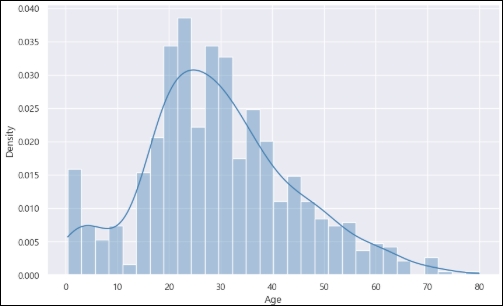
        - 탑승객 나이 분포를 보니 20~40대가 대부분
        - N살의 생존 인원수를 N살의 전체 인원수로 나누어 나이와 생존율 관계 살펴보자

        ```python
        # 생존율을 저장할 리스트 생성
        age_range_survival_ratio = []

        # 1살부터 80살까지 생존율 계산 (해당 나이 이하인 데이터 활용)
        for i in range(1, 80):
            subset = train_dt[train_dt["Age"] < i]  # i살 이하 데이터 필터링
            survival_rate = subset["Survived"].mean() if len(subset) > 0 else 0  # 생존율 계산
            age_range_survival_ratio.append(survival_rate)

        # 그래프 크기 설정
        plt.figure(figsize=(6, 5))

        # 생존율 선 그래프 생성
        plt.plot(range(1, 80), age_range_survival_ratio, color="steelblue")

        # 제목 및 축 레이블 설정
        plt.title("나이별 생존률")
        plt.xlabel("나이", fontsize=12)
        plt.ylabel("생존율", fontsize=12)

        plt.show()
        ```
        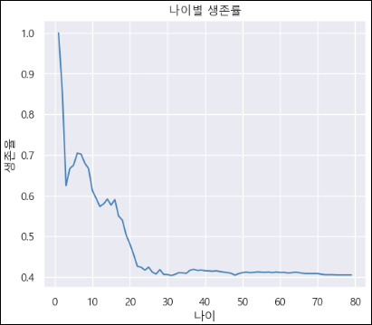
        - 20세 이하의 생존율이 높음
        - 이전 그래프에서 탑승객은 대부분 20~40대가 많았지만, 생존율은 매우 낮음
        - 구조 원칙에서 20~40대가 우선순위에 들진 못했을 것이다는 추측 가능
        - 나이 또한 생존율에 중요한 요소가 될 수 있을 것이라 추측 가능(어릴수록 생존율up)
    
    - Feature Exploration - `Sibsp`
      - 함께 탑승한 형제자매, 배우자의 총합을 나타내는 Feature
      - 본인을 포함하고 있지 않음
        ```python
        # 그래프 크기 설정
        fig, ax = plt.subplots(figsize=(5, 6))

        # SibSp 분포를 나타내는 막대 그래프 (Seaborn 기본 색상 사용)
        sns.countplot(data=train_dt, x="SibSp", palette="muted")

        # 제목 및 축 설정
        plt.xlabel("SibSp", fontsize=12)
        plt.ylabel("Count", fontsize=12)

        plt.show()
        ```
        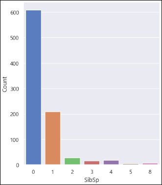
        - 0 (혼자 탄 사람)이 많음
        - 생존 유무와 관련있는지 살펴보자

        ```python
        fig, ax = plt.subplots(figsize=(5,6))
        
        sns.countplot(data=train_dt, x='SibSp', hue='Survived', ax=ax)
        
        #범례 한글로 변경
        labels=['사망', '생존']
        ax.legend(labels=labels)
        
        plt.show()
        ```
        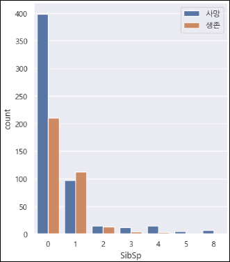
        - 0 (혼자 탄 사람)이 인원이 많아서 그런지 사망과 생존수가 높음
        - 혼자 탄 사람의 생존 수보다는 동승자가 있는 탑승객은 표본이 많지 않아서 유의미하다고 볼 수도 있지만 확실하다고 말하기 어려움
    
    - Feature Exploration - `Parch`
      - 함께 탑승한 부모, 자녀 수 총합을 나타내는 Feature
        ```python
        fig, ax = plt.subplots(figsize=(5,6))
        
        sns.countplot(data=train_dt, x='Parch', palette="muted")
        
        plt.show()
        ```
        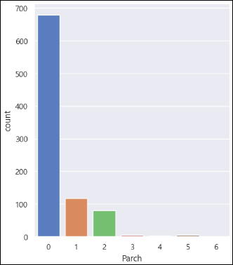
        - 앞서 살펴본 Sibsp과 유사한 데이터

        ```python
        fig, ax = plt.subplots(figsize=(5,6))
        
        sns.countplot(data=train_dt, x='Parch', hue='Survived', ax=ax)
        
        #범례 한글로 변경
        labels=['사망', '생존']
        ax.legend(labels=labels)
        
        plt.show()
        ```
        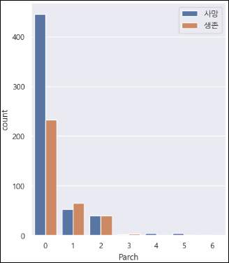
        - 0 (혼자 탄 사람)의 생존율이 높지 않음을 확인 가능
        - 이전 그래프(Sibsp: 형제 자매 수)와 비슷해 보임
        - Sibsp와 Parch는 하나의 데이터로 합쳐서 사용할 수 있을 것 같음

    - Feature Exploration - `Embarked`
      - 탑승한 항구를 나타내는 Feature
      - S항구, C항구, Q항구 3종류의 항구가 있으며 결측값이 존재함
        ```python
        fig, ax = plt.subplots(1,2,figsize=(14,5))
        
        train_dt['Embarked'].value_counts().plot.pie(ax=ax[0], shadow=True, autopct='%1.1f%%')
        ax[0].set(title='Embarked', ylabel='')
        
        sns.countplot(data=train_dt, x='Embarked', palette='muted', ax=ax[1])
        
        plt.show()
        ```
        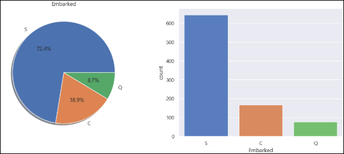
        - S항구의 탑승객이 제일 많음
        - 탑승 항구와 생존유무의 관계를 살펴보자
        
        ```python
        fig, ax = plt.subplots(figsize=(5,6))
        
        sns.countplot(data=train_dt, x='Embarked', hue='Survived', ax=ax)
        
        #범례 한글로 변경
        labels=['사망', '생존']
        ax.legend(labels=labels)
        
        plt.show()
        ```
        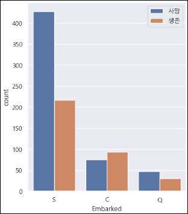
        - 탑승 항구와 생존유무는 관련이 없을 것 같았지만, 이상하게 S항구 탑승객들의 사망률이 높았음

        ```python
        # Pclass 별로 데이터를 나눠줍니다
        Pclass1 = train_dt[train_dt['Pclass']==1]['Embarked'].value_counts()
        Pclass2 = train_dt[train_dt['Pclass']==2]['Embarked'].value_counts()
        Pclass3 = train_dt[train_dt['Pclass']==3]['Embarked'].value_counts()
        
        # DataFrame으로 만들어서 그래프
        fig, ax = plt.subplots(figsize=(5,7))
        df = pd.DataFrame([Pclass1, Pclass2, Pclass3])
        df.index = ['1st class','2nd class','3rd class']
        df.plot(kind='bar', stacked=True, ax=ax)
        
        # xlabel 회전
        plt.xticks(rotation=45)
        
        plt.show()
        ```
        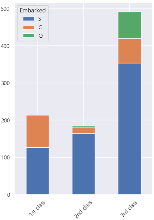
        - S항구에서 탄 탑승객 중 3클래스가 많은 것을 알 수 있음
        - 또, 1등석 사람들은 주로 C항구에서 탑승한 것 확인 가능

        - S항구의 사망률이 높은 이유와 연관 지을 수 있음

    - 항구와 동승자와의 관계
      ```python
      fig, ax = plt.subplots(1,2,figsize=(10,6))
      
      sns.countplot(data=train_dt, x='SibSp', hue='Embarked', ax=ax[0])
      sns.countplot(data=train_dt, x='Parch', hue='Embarked', ax=ax[1])
      
      # 범례 위치조정
      ax[0].legend(loc='upper right')
      ax[1].legend(loc='upper right')
      
      plt.show()
      ```
      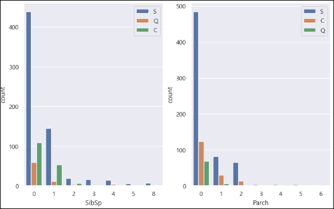
    
    - 클래스와 동승자와의 관계
      ```python
      fig, ax = plt.subplots(1,2,figsize=(10,6))
      
      sns.countplot(data=train_dt, x='SibSp', hue='Pclass', ax=ax[0])
      sns.countplot(data=train_dt, x='Parch', hue='Pclass', ax=ax[1])
      
      # 범례 위치조정
      ax[0].legend(loc='upper right')
      ax[1].legend(loc='upper right')
      
      plt.show()
      ```
      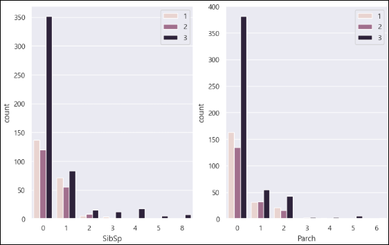
      - **S항구**에서 **나홀로** **3클래스**에 탄 탑승객의 사망률이 높음
      - S항구에서는 3등석이 많이 탔고, 3등석에는 혼자 탄 사람들이 많았고, 혼자 탄 사람들은 구조 우선순위가 낮기 때문에, 특히 이들 중 남성 & 20~40대 승객들의 생존율은 매우 낮을 것이라는 간접적인 인사이트 도출 가능
    
    - Feature Exploration - `Fare`
      - 탑승 요금을 나타내는 Feature
      - 요금은 Pclass와 연관 있을 것으로 추측
        ```python
        fig, ax = plt.subplots(figsize=(10,6))
        
        # 분포확인
        sns.distplot(train_dt['Fare'], bins=25, ax=ax)
        
        plt.show()

        # -- 생존자, 사망자 분포
        fig, ax = plt.subplots(figsize=(8,6))
 
        sns.kdeplot(train_dt[train_dt['Survived']==1]['Fare'], ax=ax)
        sns.kdeplot(train_dt[train_dt['Survived']==0]['Fare'], ax=ax)
        
        # 가장 높은 가격까지 범위 확대
        ax.set(xlim=(0, train_dt['Fare'].max()))
        ax.legend(['생존', '사망'])
        
        plt.show()
        ```
        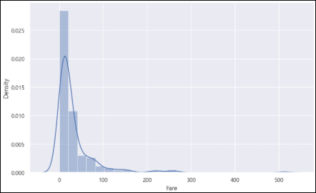
        
        - 3클래스 탑승객이 많아서 그런지 낮은 가격대에 분포되어 있음
      
    - Feature Exploration - `Ticket`
      - 티켓 번호를 나타내는 Feature
        ```python
        train_dt['Ticket'].unique()
        ```
        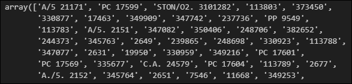
        - 티켓 번호에 대한 패턴은 찾기 어려음
    
    - Feature Exploration - `Cabin`
      - 객실 번호를 나타내는 Feature
        ```python
        train_dt['Cabin'].unique()
        ```
        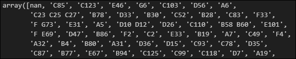
        - 총 891개의 데이터 중 204개의 데이터만 보유하고 있음
        - 결측치가 많고 객실 번호에 대한 패턴은 찾기 어려움
      

## 추가 내용 및 정리
### 간단 EDA 실습
```python
import pandas as pd
import matplotlib.pyplot as plt
plt.rcParams['font.family'] = 'Malgun Gothic'

# 1. 데이터 로드 및 기본 정보 확인
# 주어진 주식 데이터 파일을 불러옴
file_path = "../data/stock_data.csv"  # 실제 데이터 파일 경로
df = pd.read_csv(file_path)  # 데이터 파일을 불러오는 코드 작성

# 데이터의 첫 5행 출력 (EDA의 첫 단계)
print("데이터 미리보기")
df.head()

# 데이터의 기본 정보 확인 (컬럼명, 데이터 타입, 결측값 확인)
print("\n데이터 정보")
df.info()

# 2. 필요한 컬럼 선택 및 데이터 변환
# 'Date' 컬럼을 날짜 형식으로 변환
df['Date'] = pd.to_datetime(df['Date'])  # 날짜 데이터를 datetime 타입으로 변환

# 'Close' 컬럼의 결측값 제거
df = df[['Date', 'Close']].dropna()  # 종가 값이 없는 경우 제거()

# 3. 월별 종가 평균 계산
# Date 컬럼을 기준으로 연-월 형태의 새로운 컬럼 생성 (YYYY-MM 형식)
df['YearMonth'] = df['Date'].dt.to_period('M')

# 각 월별 종가의 평균 계산
monthly_avg_close = df.groupby('YearMonth')['Close'].mean().reset_index()

# 4. 데이터 시각화 (월별 평균 종가)
plt.figure(figsize=(12, 6))  # 그래프 크기 설정
plt.plot(monthly_avg_close['YearMonth'].astype(str), 
          monthly_avg_close['Close'], 
          marker='o', 
          linestyle='-', 
          color='b', 
          label='월별 평균 종가')

# 그래프 제목 및 라벨 설정
plt.title('주식 데이터 월별 평균 종가 분석')
plt.xlabel('연-월')
plt.ylabel('평균 종가')
plt.xticks(rotation=45)  # X축 라벨 회전
plt.legend()
plt.grid(True)  # 격자 추가

# 그래프 출력
plt.show()
```
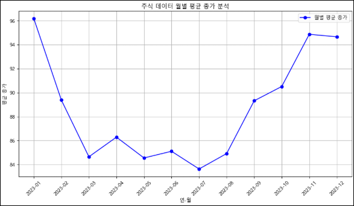
```python
# 5. 결과 해석

# 1. 주어진 데이터를 활용하여 월별 평균 종가를 계산하였음
# 2. 시각화를 통해 시간에 따른 평균 종가 변화를 파악할 수 있음
# 3. 특정 월에 급격한 상승 또는 하락이 있다면, 외부 요인(예: 경제 이벤트, 시장 변동성 등)을 고려해야 함
# 4. 평균 종가 변동이 일정하다면, 해당 주식은 안정적인 패턴을 보이는 것으로 해석 가능
```

### Pandas `.dt`
`.dt` 는 Pandas의 datetime 속성 접근자로, `df['Date']`가 datetime64 타입일 때 날짜/시간 관련 속성이나 메서드(연, 월, 일, 요일 등)를 쉽게 꺼내 쓸 수 있도록 해주는 기능을 함

- 특징
  - 문자열에 쓰는 `.str` 과 비슷하게, datetime 전용 속성/메서드에 접근하는 용도
  - `df['Date']`가 문자열(string) 타입이면 사용할 수 없고, 반드시 `datetime64[ns]` 또는 `timedelta64[ns]` 타입이어야 함
  - 만약 문자열이라면 `pd.to_datetime(df['Date'])`로 변환 필요

- Pandas `.dt` 속성 & 메서드 
  #### 🗓️ 날짜 관련
  | 속성/메서드        | 설명 | 예시 (`2025-09-18 14:35:20`) |
  |--------------------|------|-----------------------------|
  | `.year`            | 연도 | `2025` |
  | `.month`           | 월(숫자) | `9` |
  | `.month_name()`    | 월 이름 | `"September"` |
  | `.day`             | 일(숫자) | `18` |
  | `.day_name()`      | 요일 이름 | `"Thursday"` |
  | `.weekday`         | 요일(월=0, 일=6) | `3` (목요일) |
  | `.quarter`         | 분기 | `3` (7~9월) |

  #### ⏰ 시간 관련
  | 속성/메서드 | 설명 | 예시 |
  |-------------|------|------|
  | `.hour`     | 시 | `14` |
  | `.minute`   | 분 | `35` |
  | `.second`   | 초 | `20` |

  #### 📅 기간/주차
  | 속성/메서드            | 설명 | 예시 |
  |------------------------|------|------|
  | `.date`                | 날짜만 추출 (`datetime.date`) | `2025-09-18` |
  | `.time`                | 시간만 추출 (`datetime.time`) | `14:35:20` |
  | `.dayofyear`           | 연중 며칠째인지 | `261` |
  | `.week` (구버전)       | 주차 번호 (이제는 비권장) | `38` |
  | `.isocalendar().year`  | ISO 연도 | `2025` |
  | `.isocalendar().week`  | ISO 주차 | `38` |
  | `.isocalendar().day`   | ISO 요일(월=1) | `4` |

  #### 📊 변환 메서드
  | 메서드              | 설명 | 예시 |
  |---------------------|------|------|
  | `.normalize()`      | 시각을 00:00:00으로 맞춤 | `2025-09-18 00:00:00` |
  | `.floor('D')`       | 단위별 내림 | `2025-09-18` |
  | `.ceil('H')`        | 단위별 올림 | `2025-09-18 15:00:00` |
  | `.round('15min')`   | 단위별 반올림 | `2025-09-18 14:30:00` |
  | `.to_period('M')`   | 월 단위 Period 변환 | `2025-09` |
  | `.to_period('Q')`   | 분기 단위 Period 변환 | `2025Q3` |
  | `.to_period('A')`   | 연 단위 Period 변환 | `2025` |

### `.astype()` 함수
Pandas의 **형 변환 메서드**

- 기본 구조
  ```python
  Series.astype(dtype, copy=True, errors='raise')
  ```
  - dtype
    - 변환할 자료형 (예: str, int, float, 'category' 등)
  - copy
    - 기본값 True. 새 객체를 반환. False면 가능하다면 원본에 덮어씀.
  - errors
    - 변환할 수 없는 값이 있으면 기본은 raise(에러 발생)
    - ignore로 하면 변환 실패해도 원본 유지

- 예시
  ```python
  df['YearMonth'] = df['Date'].dt.to_period('M')

  monthly_avg_close = df.groupby('YearMonth')['Close'].mean().reset_index()

  plt.plot(monthly_avg_close['YearMonth'].astype(str), monthly_avg_close['Close'], marker='o', linestyle='-', color='b', label='월별 평균 종가')
  ```
  - `.astype(str)`가 필요한 이유
    - `monthly_avg_close['YearMonth']`는 Period 타입(Period[M])이 됨
    - `.dt.to_period('M')`로 만든 값이기 때문
    - `matplotlib.pyplot.plot()`의 x축 레이블은 **문자열이나 숫자**일 때 더 직관적으로 표시됨
    - 그래서 astype(str)로 바꿔서 "2025-09" 같은 문자열로 변환한 뒤 그리는 것

