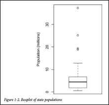

# 탐색적 데이터 분석(EDA)
## 탐색적 데이터 분석
### EDA (Exploratory Data Analysis)
데이터를 살펴보고 데이터를 이해하기 위한 첫 과정


- 고전적인 통계학 vs EDA
  - 고전적인 통계학
    - 적은 표본(샘플)을 가지고 더 큰 모집단에 대한 결론을 도출하기 위한 일련의 복잡한 과정

  - 탐색적 데이터 분석(EDA)
    - **데이터의 본질 이해**하고, 데이터 **숨겨진 패턴을 찾기** 위해 데이터를 **시각화하고 요약**하는 과정
    - 데이터 시각화(Matplotlib, seaborn ..)
    - 가정에 얽매이지 않음(고전적 통계학에서는 주로 가정을 세움)
    - 이상치 탐지(특이한 값)
    - 기술 통계 수행(고전적 통계와 비슷)

- EDA
  - 데이터를 탐색하고 가설을 세우고 증명하는 과정
  - 데이터를 이해하고 특징을 찾아내는 과정
  - 데이터 종류, 사용 모델에 따라 EDA 방향성이 다양함

  

- EDA 과정에서 파악할 요소
  - 데이터 크기는 어느 정도인지
  - 학습 데이터와 테스트 데이터는 어떻게 분리가 되어있는지
  - 결측값은 어느 정도인지
  - 라벨이 있는 데이터라면 분포는 어떻게 되어있는지
  - 데이터의 특이점이 있는지
  - (기본적인 데이터를 이해하는 과정임 -> 구조, 특성 파악)


## 위치, 변이와 관계 추정
※ 데이터를 표현하는 변수들은 여러 다른 값을 가지고 있는데, 처음 데이터를 살펴볼 때 어떻게 접근하면 좋을까?

-> 각 변수가 대표하는 값을 구해 데이터를 살펴보자

-> 또, 데이터가 얼마나 퍼져있는지 확인해보자

### 위치 추정
각 변수를 대표하는 값을 구하여 데이터를 살펴봄

- 위치 추정하는 다양한 방법
  - 평균 (mean)
  - 절사평균 (trimmed mean)
  - 가중평균 (weighted mean)
  - 중간값 (median)
  - 가중 중간값 (weighted median)
  - 백분위수 (percentile)

  

### 변이 추정
데이터가 얼마나 퍼져 있는지 확인

- 변이를 추정하는 다양한 방법
  - 분산 (Variance)
    - 평균으로부터 얼마나 퍼져 있는지를 나타내는 지표
  - 표준편차 (Standard deviation)
    - 데이터의 편차(각 값에서 평균을 뺀 값)의 기준이 되는 값
  - 사분할 범위 (IQR)
    - 25번째 백분위수와 75번째 백분위수의 차이를 보는 것
  
  

### 상관관계
- 양의 상관관계
  - X가 큰 가지면 Y도 큰 값을 갖고, X가 작은 값을 가지면 Y도 작은 값을 갖는 경우
  - 변수 X와 Y는 서로 양의 상관관계를 갖는다고 함
- 음의 상관관계
  - X가 큰 값을 갖게 될 때, Y가 작은 값을 갖는 경우
  - 변수 X와 Y는 서로 음의 상관관계를 갖는다고 함

- 용어
  - 상관계수
    - 수치적 변수들 간에 어떤 관계가 있는지 나타내기 위해 사용되는 특정량
    - 범위: `-1 <= x <= 1`

    

  - 상관 행렬
    - 행과 열이 변수들을 의미하는 표를 말함
    - 각 셀은 그 행과 열에 해당하는 변수들 간의 상관관계를 의미

    
    

  - 산점도(Scatter plot)
    - x축과 y축이 서로 다른 두 개의 변수를 나타내는 도표

        

### 데이터 분포 탐색
데이터 분포는 **다양한 시각화 도구를 사용하여 확인**함

- 시각화 도구
  - 상자그림 (box plot)

    

  - 도수 분포표 (frequency table)

    

  - 히스토그램 (histogram)

    

  - 밀도 그림 (density plot)

    


## 정형화된 데이터, 테이블 데이터의 이해
### 정형화된 데이터
- 수치형 데이터
  - 연속형 데이터
    - **무한한 값**을 가질 수 있는 수치데이터
    - ex. 풍속, 지속시간 등
  - 이산형 데이터
    - **특정한 정수 값**을 가질 수 있는 수치데이터
    - ex. 사건의 발생 빈도 등

- 범주형 데이터
  - 명목형 데이터
    - **순서의 의미가 없**는 범주데이터
    - ex. TV 스크린 종류(플라즈마, LCD, LED 등)
    - ex. 도시명(대전, 부산 등)
  - 순위형 데이터
    - **순서의 의미가 있**는 범주데이터
    - ex. 수치로 나타낼 수 있는 평점(1, 2, 3, 4, 5점 등)
    - ex. 선호도(좋음, 중립, 싫음)

※ 굳이 데이터 종류를 분리해야 하는 이유

-> 데이터를 분석하고 예측을 모델링 할 때

-> 시각화, 해석, 모델결정 등에 데이터 종류가 중요한 역할을 하기 때문!

### 테이블 데이터
데이터 분석에서 가장 대표적으로 사용하는 데이터

- 용어
  - DataFrame
    - 통계와 머신러닝 모델에서 가장 기본이 되는 테이블 형태의 데이터 구조
  - Feature
    - 테이블의 각 열을 의미
  - Output
    - 데이터 과학 프로젝트의 목표는 대부분 어떤 결과를 예측하는 것에 있음
    - 그 결과를 예측하기 위해 피처를 사용
  - Record
    - 테이블에서 하나의 행을 의미

  

### 테이블 데이터가 아닌 데이터 구조
- 시계열 데이터
  - 동일한 변수 안에 연속적인 측정값을 갖는 데이터

- 공간 데이터
  - 지도 제작과 위치 정보 분석에 사용됨
  - 테이블 데이터보다 좀 더 복잡하고 다양함
    - 객체를 표현할 때는, 공간 좌표가 데이터의 중심이 됨
    - 필드 정보는 공간을 나타내는 작은 단위들과 적당한 측정 기준 값에 중점을 둠

- 그래프 데이터
  - 물리적 관계, 사회적 관계, 다소 추상적인 관계들을 표현하기 위해 사용
  - ex. 페이스북이나 링크드인 값은 소셜 네트워크의 그래프
  - ex. 도로의 연결된 물류 중심지


## 정형 데이터 EDA 과정
### 타이타닉 데이터를 사용하여 EDA 진행
0. 개별 변수 분포(Variation) 파악 -> 변수간 분포 관계(Covariation) 파악

    

1. 데이터 확인
    ```python
    import pandas as pd
    import seaborn as sns
    import matplotlib.pyplot as plt
    
    # 한글 사용 준비
    plt.rcParams['font.family'] = 'Malgun Gothic'

    train_dt = pd.read_csv('titanic.csv')
    train_dt.head()

    train_dt.info()
    ```
    

    
    - `Age`, `Cabin`, `Embarked`에 결측치가 있는 것 확인
    - 특히 `Cabin`의 결측치가 상당히 많이 존재함
      - Feature로 사용하기 힘들 것 같음
    - PassengerId는 승객 번호이므로 생존 유무와 연관성 없어보임

2. Feature Exploration
    - 각 피처별로 분석 진행
      - seaborn 사용하여 피처에 대한 시각화 진행
      - 정보를 얻을 수 있는 데이터와 아닌 데이터를 구별
    
    - 연속형 변수(`age`, `sibsp`, `parch`, `fare`)에 대한 분포 확인
      ```python
      # 연속형 변수 선택
      continuous_vars = ["Age", "SibSp", "Parch", "Fare"]

      # 그래프 스타일 설정
      plt.figure(figsize=(12, 4))
      plt.suptitle("연속형 데이터 개별 변수 분포(Variation)", fontsize=14, fontweight="bold")

      # 각 변수에 대한 분포 플롯 생성
      for i, var in enumerate(continuous_vars):
          plt.subplot(1, 4, i+1)
          sns.histplot(train_dt[var], bins=30, kde=True)
          plt.title(var.capitalize())
          plt.xlabel(var)
          plt.ylabel("Count")

      plt.tight_layout(rect=[0, 0, 1, 0.9])
      plt.show()
      ```
      
      - Age를 제외한 나머지는 왼쪽에 치우친 포아송 형태
      - Age는 20 ~ 40 구간이 많음

    - 범주형 변수(`Pclass`, `Sex`, `Embarked`)에 대한 분포 확인
      ```python
      # 범주형 변수 선택
      categorical_vars = ["Pclass", "Sex", "Embarked"]

      # 그래프 스타일 설정
      plt.figure(figsize=(12, 4))
      plt.suptitle("범주형 데이터 개별 변수 분포", fontsize=14, fontweight="bold")

      # 각 변수에 대한 카운트 플롯 생성
      for i, var in enumerate(categorical_vars):
          plt.subplot(1, 3, i+1)
          sns.countplot(x=train_dt[var], palette="muted")
          plt.title(var.capitalize())
          plt.xlabel(var)
          plt.ylabel("Count")

      plt.tight_layout(rect=[0, 0, 1, 0.9])
      plt.show()
      ```
      

    - Feature Exploration - `Survived`
      ```python
      train_dt['Survived'].value_counts()
      ```
      
      - 생존 유뮤를 나타내는 Feature
      - 전체 데이터의 생존유무 수치화 진행
      - 0은 사망, 1은 생존을 나타냄
      - 한눈에 볼 수 있게 pie와 bar plot을 사용해 시각화
      ```python
      train_dt_copy = train_dt.copy()
      # Survived 변수 매핑 (0: 사망, 1: 생존)
      train_dt_copy["Survived"] = train_dt_copy["Survived"].map({0: "사망", 1: "생존"})


      # 생존자 및 사망자 수 계산
      survived_counts = train_dt_copy["Survived"].value_counts()
      labels = survived_counts.index
      sizes = survived_counts.values
      colors = ["#1f77b4", "#ff7f0e"]
      explode = [0, 0.1]  # 생존자 부분만 분리

      # 그래프 설정
      fig, axes = plt.subplots(1, 2, figsize=(8, 4))  # 크기 조정
      fig.suptitle("", fontsize=14, fontweight="bold")

      # 파이 차트 (조각 분리)
      axes[0].pie(
          sizes, labels=labels, autopct="%1.1f%%", colors=colors, explode=explode, shadow=True
      )
      axes[0].set_title("")

      # 바 차트
      sns.barplot(x=labels, y=sizes, ax=axes[1], palette=colors)
      axes[1].set_ylabel("Count")

      plt.tight_layout()
      plt.show()
      ```
      
      - 수치상으로 사망자의 수가 더 많은 것을 알 수 있음
      - 사망자 비율이 엄청 높음
      - **탑승객의 다른 정보와 생존 유무가 어떠한 상관관계가 있는지 확인 필요**

    - Feature Exploration - `Name`
      - 탑승객의 이름을 나타내는 Feature
      - 이름 때문에 생존 유무가 갈리지는 않겠지만, 데이터 확인
        ```python
        train_dt['Name'].unique()
        ```
        

    - Feature Exploration - `Pclass`
      - 티켓의 클래스(등급)을 나타내는 Feature
      - 1, 2, 3클래스 (1등석, 2등석, 3등석)으로 나누어져 있음
      - 클래스별로 인원 비율 확인 필요
        ```python
        train_dt['Pclass'].value_counts()
        ```
        
        ```python
        # 그래프 스타일 설정
        plt.figure(figsize=(6, 5))

        # 막대 그래프 생성
        ax = sns.barplot(x=train_dt["Pclass"].value_counts().index, 
                        y=train_dt["Pclass"].value_counts().values, 
                        palette=["#76b7b2", "#f28e75", "#a5add9"])  # 색상 설정

        # 제목 설정
        plt.title("Feature Exploration - Pclass", fontsize=14, fontweight="bold", color="#1f3b7a")
        plt.xlabel("Pclass", fontsize=12)
        plt.ylabel("Count", fontsize=12)

        # y축 눈금 설정
        plt.ylim(0, 550)

        plt.show()
        ```
        
        - 1, 2 클래스에 비해 3 클래스가 많음
        - 이제 Pclass와 Survived가 어떤 관계가 있는지 확인 필요
        - 클래스 별로 생존율 구해보자
        ```python
        # 그래프 스타일 설정
        plt.figure(figsize=(6, 5))
        sns.set(font="Malgun Gothic", rc={"axes.unicode_minus": False})  

        # 막대 그래프 생성 (Pclass별 Survived 분포)
        ax = sns.countplot(data=train_dt, x="Pclass", hue="Survived", palette=["#4c72b0", "#dd8452"])

        # 제목 및 축 설정
        plt.title("Feature Exploration - Pclass", fontsize=14, fontweight="bold", color="#1f3b7a")
        plt.xlabel("Pclass", fontsize=12)
        plt.ylabel("Count", fontsize=12)

        # 범례 설정
        plt.legend(title="", labels=["사망", "생존"])

        # y축 제한 설정
        plt.ylim(0, 400)

        plt.show()
        ```
        
        - 가장 눈에 띄는 3클래스
        - 3클래스 탑승객들의 사망 인원이 가장 많음

        ```python
        # 생존자와 사망자 그룹별 Pclass 비율 계산
        dead_pclass = train_dt[train_dt["Survived"] == 0]["Pclass"].value_counts(normalize=True) * 100
        survived_pclass = train_dt[train_dt["Survived"] == 1]["Pclass"].value_counts(normalize=True) * 100

        # 파이 차트에 표시할 레이블 (Pclass 값)
        labels = ["1", "2", "3"]
        colors = ["#4c72b0", "#dd8452", "#55a868"]

        # 그래프 생성
        fig, axes = plt.subplots(1, 2, figsize=(8, 4))

        # 사망자 파이 차트
        axes[0].pie(dead_pclass.sort_index(), labels=labels, autopct="%1.1f%%", colors=colors)
        axes[0].set_title("사망 - Pclass")

        # 생존자 파이 차트
        axes[1].pie(survived_pclass.sort_index(), labels=labels, autopct="%1.1f%%", colors=colors)
        axes[1].set_title("생존 - Pclass")

        plt.show()
        ```
        
        - 1, 2, 3클래스 순으로 생존율 높음
        - 사망한 탑승객 그래프에서 3 클래스의 비율이 67.8%

    - Feature Exploration - `Sex`
      - 성별을 나타내는 Feature
      - male, female로 나누어짐
        ```python
        # 성별 분포 계산
        sex_counts = train_dt["Sex"].value_counts()
        sex_percent = train_dt["Sex"].value_counts(normalize=True) * 100

        # 성별 한글 변환
        labels = ["남성", "여성"]
        colors = ["#4c72b0", "#dd8452"]
        explode = [0.1, 0]  # 여성 부분만 분리

        # 그래프 생성
        fig, axes = plt.subplots(1, 2, figsize=(8, 4))

        # 파이 차트
        axes[0].pie(sex_percent, labels=labels, autopct="%1.1f%%", colors=colors, shadow=True)
        axes[0].set_title("")

        # 바 차트
        sns.barplot(x=labels, y=sex_counts, ax=axes[1], palette=colors)
        axes[1].set_ylabel("Count")

        plt.show()
        ```
        
        - 여성보다 남성 탑승객이 더 많음
        - Sex와 Survived 관계 확인 필요
        
        ```python
        # 그래프 크기 설정
        plt.figure(figsize=(5, 4))

        # 성별에 따른 생존 여부 카운트 플롯
        ax = sns.countplot(data=train_dt, x="Sex", hue="Survived", palette=["#4c72b0", "#dd8452"])

        # 한글 라벨 적용
        plt.xlabel("")
        plt.ylabel("Count")
        plt.xticks(ticks=[0, 1], labels=["남성", "여성"], fontsize=11)

        # 범례 설정
        plt.legend(title="", labels=["사망", "생존"], loc="upper right")

        plt.show()
        ```
        
        - 성별에 따른 생존율 차이가 심함
        - 남성의 생존율이 굉장히 낮음
      
        ```python
        fig, ax = plt.subplots(1,2,figsize=(10,6), constrained_layout=True)
        labels = ['여성', '남성']
        
        #Survived 가 0인 데이터를 이용한 Pie Plot
        train_dt[train_dt['Survived'] == 0]['Sex'].value_counts().sort_index().plot.pie(ax=ax[0], shadow=True, autopct='%1.1f%%', labels=labels)
        ax[0].set(ylabel='', title='사망 - Sex')
        
        #Survived 가 1인 데이터를 이용한 Pie Plot
        train_dt[train_dt['Survived'] == 1]['Sex'].value_counts().sort_index().plot.pie(ax=ax[1], shadow=True, autopct='%1.1f%%', labels=labels)
        ax[1].set(ylabel='', title='생존 - Sex')
        
        plt.show()
        ```
        
        - 생존-사망을 나누어보니 확연한 차이가 보임
        - 남자 탑승객이 더 많았지만 엄청난 사망률을 보였음
        - 여성은 상대적으로 많은 인원이 생존
        - 위급상황에서 여성을 우선으로 대피시켰을 것으로 추축
    
    - Feature Exploration - `Age`
      - 나이를 나타내는 Feature
      - Age에는 결측값 존재
      - 나이는 수치형으로 주어졌기 때문에 분포를 볼 수 있는 그래프로 표현
        ```python
        fig, ax = plt.subplots(figsize=(10,6))
        
        sns.histplot(train_dt["Age"], bins=30, kde=True, stat="density", color="steelblue", alpha=0.4)
        
        plt.show()
        ```
        
        - 탑승객 나이 분포를 보니 20~40대가 대부분
        - N살의 생존 인원수를 N살의 전체 인원수로 나누어 나이와 생존율 관계 살펴보자

        ```python
        # 생존율을 저장할 리스트 생성
        age_range_survival_ratio = []

        # 1살부터 80살까지 생존율 계산 (해당 나이 이하인 데이터 활용)
        for i in range(1, 80):
            subset = train_dt[train_dt["Age"] < i]  # i살 이하 데이터 필터링
            survival_rate = subset["Survived"].mean() if len(subset) > 0 else 0  # 생존율 계산
            age_range_survival_ratio.append(survival_rate)

        # 그래프 크기 설정
        plt.figure(figsize=(6, 5))

        # 생존율 선 그래프 생성
        plt.plot(range(1, 80), age_range_survival_ratio, color="steelblue")

        # 제목 및 축 레이블 설정
        plt.title("나이별 생존률")
        plt.xlabel("나이", fontsize=12)
        plt.ylabel("생존율", fontsize=12)

        plt.show()
        ```
        
        - 20세 이하의 생존율이 높음
        - 이전 그래프에서 탑승객은 대부분 20~40대가 많았지만, 생존율은 매우 낮음
    
    - Feature Exploration - `Sibsp`
      - 함께 탑승한 형제자매, 배우자의 총합을 나타내는 Feature
      - 본인을 포함하고 있지 않음
        ```python
        # 그래프 크기 설정
        fig, ax = plt.subplots(figsize=(5, 6))

        # SibSp 분포를 나타내는 막대 그래프 (Seaborn 기본 색상 사용)
        sns.countplot(data=train_dt, x="SibSp", palette="muted")

        # 제목 및 축 설정
        plt.xlabel("SibSp", fontsize=12)
        plt.ylabel("Count", fontsize=12)

        plt.show()
        ```
        
        - 0 (혼자 탄 사람)이 많음
        - 생존 유무와 관련있는지 살펴보자

        ```python
        fig, ax = plt.subplots(figsize=(5,6))
        
        sns.countplot(data=train_dt, x='SibSp', hue='Survived', ax=ax)
        
        #범례 한글로 변경
        labels=['사망', '생존']
        ax.legend(labels=labels)
        
        plt.show()
        ```
        
        - 0 (혼자 탄 사람)이 인원이 많아서 그런지 사망과 생존수가 높음
        - 혼자 탄 사람의 생존 수보다는 동승자가 있는 탑승객은 표본이 많지 않아서 유의미하다고 볼 수도 있지만 확실하다고 말하기 어려움
    
    - Feature Exploration - `Parch`
      - 함께 탑승한 부모, 자녀 수 총합을 나타내는 Feature
        ```python
        fig, ax = plt.subplots(figsize=(5,6))
        
        sns.countplot(data=train_dt, x='Parch', palette="muted")
        
        plt.show()
        ```
        
        - 앞서 살펴본 Sibsp과 유사한 데이터

        ```python
        fig, ax = plt.subplots(figsize=(5,6))
        
        sns.countplot(data=train_dt, x='Parch', hue='Survived', ax=ax)
        
        #범례 한글로 변경
        labels=['사망', '생존']
        ax.legend(labels=labels)
        
        plt.show()
        ```
        
        - 0 (혼자 탄 사람)의 생존율이 높지 않음을 확인 가능
        - 이전 그래프(Sibsp: 형제 자매 수)와 비슷해 보임
        - Sibsp와 Parch는 하나의 데이터로 합쳐서 사용할 수 있을 것 같음

    - Feature Exploration - `Embarked`
      - 탑승한 항구를 나타내는 Feature
      - S항구, C항구, Q항구 3종류의 항구가 있으며 결측값이 존재함
        ```python
        fig, ax = plt.subplots(1,2,figsize=(14,5))
        
        train_dt['Embarked'].value_counts().plot.pie(ax=ax[0], shadow=True, autopct='%1.1f%%')
        ax[0].set(title='Embarked', ylabel='')
        
        sns.countplot(data=train_dt, x='Embarked', palette='muted', ax=ax[1])
        
        plt.show()
        ```
        
        - S항구의 탑승객이 제일 많음
        - 탑승 항구와 생존유무의 관계를 살펴보자
        
        ```python
        fig, ax = plt.subplots(figsize=(5,6))
        
        sns.countplot(data=train_dt, x='Embarked', hue='Survived', ax=ax)
        
        #범례 한글로 변경
        labels=['사망', '생존']
        ax.legend(labels=labels)
        
        plt.show()
        ```
        
        - 탑승 항구와 생존유무는 관련이 없을 것 같았지만, 이상하게 S항구 탑승객들의 사망률이 높았음

        ```python
        # Pclass 별로 데이터를 나눠줍니다
        Pclass1 = train_dt[train_dt['Pclass']==1]['Embarked'].value_counts()
        Pclass2 = train_dt[train_dt['Pclass']==2]['Embarked'].value_counts()
        Pclass3 = train_dt[train_dt['Pclass']==3]['Embarked'].value_counts()
        
        # DataFrame으로 만들어서 그래프
        fig, ax = plt.subplots(figsize=(5,7))
        df = pd.DataFrame([Pclass1, Pclass2, Pclass3])
        df.index = ['1st class','2nd class','3rd class']
        df.plot(kind='bar', stacked=True, ax=ax)
        
        # xlabel 회전
        plt.xticks(rotation=45)
        
        plt.show()
        ```
        
        - S항구에서 탄 탑승객 중 3클래스가 많은 것을 알 수 있음
        - S항구의 사망률이 높은 이유와 연관 지을 수 있음

    - 항구와 동승자와의 관계
      ```python
      fig, ax = plt.subplots(1,2,figsize=(10,6))
      
      sns.countplot(data=train_dt, x='SibSp', hue='Embarked', ax=ax[0])
      sns.countplot(data=train_dt, x='Parch', hue='Embarked', ax=ax[1])
      
      # 범례 위치조정
      ax[0].legend(loc='upper right')
      ax[1].legend(loc='upper right')
      
      plt.show()
      ```
      
    
    - 클래스와 동승자와의 관계
      ```python
      fig, ax = plt.subplots(1,2,figsize=(10,6))
      
      sns.countplot(data=train_dt, x='SibSp', hue='Pclass', ax=ax[0])
      sns.countplot(data=train_dt, x='Parch', hue='Pclass', ax=ax[1])
      
      # 범례 위치조정
      ax[0].legend(loc='upper right')
      ax[1].legend(loc='upper right')
      
      plt.show()
      ```
      
      - S항구에서 나홀로 3클래스에 탄 탑승객의 사망률이 높음
    
    - Feature Exploration - `Fare`
      - 탑승 요금을 나타내는 Feature
      - 요금은 Pclass와 연관 있을 것으로 추측
        ```python
        fig, ax = plt.subplots(figsize=(10,6))
        
        # 분포확인
        sns.distplot(train_dt['Fare'], bins=25, ax=ax)
        
        plt.show()

        # ---
        fig, ax = plt.subplots(figsize=(8,6))
 
        # 분포 확인
        sns.kdeplot(train_dt[train_dt['Survived']==1]['Fare'], ax=ax)
        sns.kdeplot(train_dt[train_dt['Survived']==0]['Fare'], ax=ax)
        
        # 가장 높은 가격까지 범위 확대
        ax.set(xlim=(0, train_dt['Fare'].max()))
        ax.legend(['생존', '사망'])
        
        plt.show()
        ```
        
        
        - 3클래스 탑승객이 많아서 그런지 낮은 가격대에 분포되어 있음
      
    - Feature Exploration - `Ticket`
      - 티켓 번호를 나타내는 Feature
        ```python
        train_dt['Ticket'].unique()
        ```
        
        - 티켓 번호에 대한 패턴은 찾기 어려음
    
    - Feature Exploration - `Cabin`
      - 객실 번호를 나타내는 Feature
        ```python
        train_dt['Cabin'].unique()
        ```
        
        - 총 891개의 데이터 중 204개의 데이터만 보유하고 있음
        - 결측치가 많고 객첼 번호에 대한 패턴은 찾기 어려움
      
